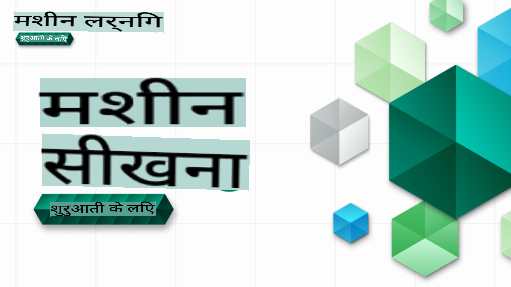

# शुरुआती लोगों के लिए मशीन लर्निंग - एक पाठ्यक्रम

> 🌍 दुनिया की संस्कृतियों के माध्यम से मशीन लर्निंग का अन्वेषण करते हुए हमारे साथ दुनिया की यात्रा करें 🌍

Microsoft के क्लाउड एडवोकेट्स एक 12-सप्ताह, 26-पाठ का पाठ्यक्रम प्रदान करने के लिए प्रसन्न हैं जो पूरी तरह से **मशीन लर्निंग** के बारे में है। इस पाठ्यक्रम में, आप कभी-कभी **क्लासिक मशीन लर्निंग** कहलाने वाली चीजों के बारे में जानेंगे, जिसमें मुख्य रूप से Scikit-learn का एक पुस्तकालय के रूप में उपयोग किया जाएगा और डीप लर्निंग से बचा जाएगा, जिसे हमारे [AI for Beginners' पाठ्यक्रम](https://aka.ms/ai4beginners) में कवर किया गया है। इन पाठों को हमारे ['Data Science for Beginners' पाठ्यक्रम](https://aka.ms/ds4beginners) के साथ भी जोड़ें!

हमारे साथ दुनिया भर में यात्रा करें क्योंकि हम इन क्लासिक तकनीकों को दुनिया के विभिन्न क्षेत्रों से डेटा पर लागू करते हैं। प्रत्येक पाठ में पाठ से पहले और बाद के क्विज़, पाठ को पूरा करने के लिए लिखित निर्देश, एक समाधान, एक असाइनमेंट, और अधिक शामिल हैं। हमारे प्रोजेक्ट-आधारित शिक्षाशास्त्र आपको निर्माण करते समय सीखने की अनुमति देते हैं, नए कौशल को 'स्टिक' करने का एक सिद्ध तरीका।

**✍️ हमारे लेखकों का हार्दिक धन्यवाद** Jen Looper, Stephen Howell, Francesca Lazzeri, Tomomi Imura, Cassie Breviu, Dmitry Soshnikov, Chris Noring, Anirban Mukherjee, Ornella Altunyan, Ruth Yakubu और Amy Boyd

**🎨 हमारे चित्रकारों का भी धन्यवाद** Tomomi Imura, Dasani Madipalli, और Jen Looper

**🙏 विशेष धन्यवाद 🙏 हमारे Microsoft Student Ambassador लेखकों, समीक्षकों, और सामग्री योगदानकर्ताओं को**, विशेष रूप से Rishit Dagli, Muhammad Sakib Khan Inan, Rohan Raj, Alexandru Petrescu, Abhishek Jaiswal, Nawrin Tabassum, Ioan Samuila, और Snigdha Agarwal

**🤩 हमारे R पाठों के लिए Microsoft Student Ambassadors Eric Wanjau, Jasleen Sondhi, और Vidushi Gupta को अतिरिक्त आभार!**

# शुरुआत करना

इन चरणों का पालन करें:
1. **रिपॉजिटरी को फोर्क करें**: इस पृष्ठ के ऊपर-दाईं ओर "Fork" बटन पर क्लिक करें।
2. **रिपॉजिटरी को क्लोन करें**:   `git clone https://github.com/microsoft/ML-For-Beginners.git`

> [इस पाठ्यक्रम के लिए सभी अतिरिक्त संसाधनों को हमारे Microsoft Learn संग्रह में खोजें](https://learn.microsoft.com/en-us/collections/qrqzamz1nn2wx3?WT.mc_id=academic-77952-bethanycheum)

**[विद्यार्थियों](https://aka.ms/student-page)**, इस पाठ्यक्रम का उपयोग करने के लिए, पूरे रिपॉजिटरी को अपने GitHub खाते में फोर्क करें और अपने या समूह के साथ अभ्यास करें:

- लेक्चर से पहले का क्विज़ शुरू करें।
- लेक्चर पढ़ें और गतिविधियों को पूरा करें, प्रत्येक ज्ञान जांच पर रुकें और विचार करें।
- पाठों को समझकर प्रोजेक्ट बनाने का प्रयास करें बजाय समाधान कोड चलाने के; हालांकि वह कोड प्रत्येक प्रोजेक्ट-उन्मुख पाठ में `/solution` फ़ोल्डरों में उपलब्ध है।
- लेक्चर के बाद का क्विज़ लें।
- चुनौती को पूरा करें।
- असाइनमेंट को पूरा करें।
- एक पाठ समूह को पूरा करने के बाद, [चर्चा बोर्ड](https://github.com/microsoft/ML-For-Beginners/discussions) पर जाएं और उचित PAT रूब्रिक को भरकर "जोर से सीखें"। 'PAT' एक प्रगति मूल्यांकन उपकरण है जो एक रूब्रिक है जिसे आप अपने सीखने को आगे बढ़ाने के लिए भरते हैं। आप अन्य PATs पर प्रतिक्रिया भी दे सकते हैं ताकि हम एक साथ सीख सकें।

> आगे की पढ़ाई के लिए, हम इन [Microsoft Learn](https://docs.microsoft.com/en-us/users/jenlooper-2911/collections/k7o7tg1gp306q4?WT.mc_id=academic-77952-leestott) मॉड्यूल और लर्निंग पाथ का पालन करने की सलाह देते हैं।

**शिक्षकों**, हमने इस पाठ्यक्रम का उपयोग कैसे करें पर [कुछ सुझाव शामिल किए हैं](for-teachers.md)।

---

## वीडियो वॉकथ्रू

कुछ पाठ छोटे वीडियो के रूप में उपलब्ध हैं। आप इन सभी को पाठों में इन-लाइन पा सकते हैं, या Microsoft Developer YouTube चैनल पर [ML for Beginners प्लेलिस्ट](https://aka.ms/ml-beginners-videos) पर क्लिक करके देख सकते हैं।

---

## टीम से मिलें

**Gif द्वारा** [Mohit Jaisal](https://linkedin.com/in/mohitjaisal)

> 🎥 परियोजना और इसे बनाने वाले लोगों के बारे में वीडियो के लिए ऊपर की छवि पर क्लिक करें!

---

## शिक्षाशास्त्र

हमने इस पाठ्यक्रम का निर्माण करते समय दो शैक्षिक सिद्धांतों को चुना है: यह सुनिश्चित करना कि यह व्यावहारिक **प्रोजेक्ट-आधारित** है और इसमें **बार-बार क्विज़** शामिल हैं। इसके अलावा, इस पाठ्यक्रम में इसे एकजुटता देने के लिए एक सामान्य **थीम** है।

यह सुनिश्चित करके कि सामग्री परियोजनाओं के साथ संरेखित है, प्रक्रिया छात्रों के लिए अधिक आकर्षक बन जाती है और अवधारणाओं का प्रतिधारण बढ़ेगा। इसके अलावा, कक्षा से पहले एक कम-दांव क्विज़ छात्र के इरादे को एक विषय की ओर सेट करता है, जबकि कक्षा के बाद का दूसरा क्विज़ आगे के प्रतिधारण को सुनिश्चित करता है। यह पाठ्यक्रम लचीला और मजेदार बनाने के लिए डिज़ाइन किया गया था और इसे पूरे या आंशिक रूप से लिया जा सकता है। परियोजनाएं छोटी शुरू होती हैं और 12-सप्ताह के चक्र के अंत तक बढ़ती जटिल होती जाती हैं। इस पाठ्यक्रम में एमएल के वास्तविक दुनिया के अनुप्रयोगों पर एक परिशिष्ट भी शामिल है, जिसका उपयोग अतिरिक्त क्रेडिट या चर्चा के आधार के रूप में किया जा सकता है।

> हमारे [आचार संहिता](CODE_OF_CONDUCT.md), [योगदान](CONTRIBUTING.md), और [अनुवाद](TRANSLATIONS.md) दिशानिर्देश खोजें। हम आपके रचनात्मक प्रतिक्रिया का स्वागत करते हैं!

## प्रत्येक पाठ में शामिल हैं

- वैकल्पिक स्केच नोट
- वैकल्पिक पूरक वीडियो
- वीडियो वॉकथ्रू (कुछ पाठों में ही)
- लेक्चर से पहले का वार्मअप क्विज़
- लिखित पाठ
- प्रोजेक्ट-आधारित पाठों के लिए, प्रोजेक्ट कैसे बनाएं इसके चरण-दर-चरण मार्गदर्शिका
- ज्ञान जांच
- एक चुनौती
- पूरक पठन
- असाइनमेंट
- लेक्चर के बाद का क्विज़

> **भाषाओं के बारे में एक नोट**: ये पाठ मुख्य रूप से Python में लिखे गए हैं, लेकिन कई R में भी उपलब्ध हैं। एक R पाठ को पूरा करने के लिए, `/solution` फ़ोल्डर में जाएं और R पाठ खोजें। इनमें एक .rmd एक्सटेंशन होता है जो एक **R मार्कडाउन** फ़ाइल का प्रतिनिधित्व करता है जिसे आसानी से परिभाषित किया जा सकता है जैसे कि `code chunks` (R या अन्य भाषाओं का) और एक `YAML header` (जो आउटपुट को प्रारूपित करने के तरीके को मार्गदर्शित करता है जैसे कि PDF) एक `Markdown document` में। इस प्रकार, यह डेटा विज्ञान के लिए एक उत्कृष्ट लेखन ढांचा के रूप में कार्य करता है क्योंकि यह आपको अपने कोड, उसके आउटपुट और अपने विचारों को एक साथ लिखने की अनुमति देता है। इसके अलावा, R मार्कडाउन दस्तावेज़ों को PDF, HTML, या Word जैसे आउटपुट प्रारूपों में प्रस्तुत किया जा सकता है।

> **क्विज़ के बारे में एक नोट**: सभी क्विज़ [क्विज़ ऐप फ़ोल्डर](../../quiz-app) में निहित हैं, प्रत्येक में तीन प्रश्नों के कुल 52 क्विज़ हैं। वे पाठों के भीतर से जुड़े हुए हैं लेकिन क्विज़ ऐप को स्थानीय रूप से चलाया जा सकता है; स्थानीय रूप से होस्ट करने या Azure पर तैनात करने के निर्देश `quiz-app` फ़ोल्डर में पाए जा सकते हैं।

| पाठ संख्या |                             विषय                              |                   पाठ समूह                   | सीखने के उद्देश्य                                                                                                             |                                                              लिंक्ड पाठ                                                               |                        लेखक                        |
| :-----------: | :------------------------------------------------------------: | :-------------------------------------------------: | ------------------------------------------------------------------------------------------------------------------------------- | :--------------------------------------------------------------------------------------------------------------------------------------: | :--------------------------------------------------: |
|      01       |                मशीन लर्निंग का परिचय                |      [परिचय](1-Introduction/README.md)       | मशीन लर्निंग के पीछे के मूलभूत अवधारणाओं को जानें                                                                                |                                             [पाठ](1-Introduction/1-intro-to-ML/README.md)                                             |                       Muhammad                       |
|      02       |                मशीन लर्निंग का इतिहास                 |      [परिचय](1-Introduction/README.md)       | इस क्षेत्र के पीछे के इतिहास को जानें                                                                                         |                                            [पाठ](1-Introduction/2-history-of-ML/README.md)                                            |                     Jen और Amy                      |
|      03       |                 निष्पक्षता और मशीन लर्निंग                  |      [परिचय](1-Introduction/README.md)       | मशीन लर्निंग मॉडल बनाते और लागू करते समय छात्रों को निष्पक्षता के महत्वपूर्ण दार्शनिक मुद्दों पर विचार करना चाहिए? |                                              [पाठ](1-Introduction/3-fairness/README.md)                                               |                        Tomomi                        |
|      04       |                मशीन लर्निंग के लिए तकनीकें                 |      [Introduction](1-Introduction/README.md)       | एमएल शोधकर्ता एमएल मॉडल बनाने के लिए किन तकनीकों का उपयोग करते हैं?                                                                       |                                          [Lesson](1-Introduction/4-techniques-of-ML/README.md)                                           |                    क्रिस और जेन                     |
|      05       |                   प्रतिगमन का परिचय                   |        [Regression](2-Regression/README.md)         | प्रतिगमन मॉडल के लिए पाइथन और स्किकिट-लर्न के साथ शुरुआत करें                                                                  |         <ul><li>[Python](2-Regression/1-Tools/README.md)</li><li>[R](../../2-Regression/1-Tools/solution/R/lesson_1.html)</li></ul>         |      <ul><li>जेन</li><li>एरिक वंजाउ</li></ul>       |
|      06       |                उत्तरी अमेरिकी कद्दू की कीमतें 🎃                |        [Regression](2-Regression/README.md)         | एमएल के लिए डेटा को विज़ुअलाइज़ और साफ करें                                                                                  |          <ul><li>[Python](2-Regression/2-Data/README.md)</li><li>[R](../../2-Regression/2-Data/solution/R/lesson_2.html)</li></ul>          |      <ul><li>जेन</li><li>एरिक वंजाउ</li></ul>       |
|      07       |                उत्तरी अमेरिकी कद्दू की कीमतें 🎃                |        [Regression](2-Regression/README.md)         | रैखिक और बहुपद प्रतिगमन मॉडल बनाएं                                                                                   |        <ul><li>[Python](2-Regression/3-Linear/README.md)</li><li>[R](../../2-Regression/3-Linear/solution/R/lesson_3.html)</li></ul>        |      <ul><li>जेन और दिमित्री</li><li>एरिक वंजाउ</li></ul>       |
|      08       |                उत्तरी अमेरिकी कद्दू की कीमतें 🎃                |        [Regression](2-Regression/README.md)         | एक लॉजिस्टिक प्रतिगमन मॉडल बनाएं                                                                                               |     <ul><li>[Python](2-Regression/4-Logistic/README.md) </li><li>[R](../../2-Regression/4-Logistic/solution/R/lesson_4.html)</li></ul>      |      <ul><li>जेन</li><li>एरिक वंजाउ</li></ul>       |
|      09       |                          एक वेब ऐप 🔌                          |           [Web App](3-Web-App/README.md)            | अपने प्रशिक्षित मॉडल का उपयोग करने के लिए एक वेब ऐप बनाएं                                                                                       |                                                 [Python](3-Web-App/1-Web-App/README.md)                                                  |                         जेन                          |
|      10       |                 वर्गीकरण का परिचय                 |    [Classification](4-Classification/README.md)     | अपने डेटा को साफ करें, तैयार करें, और विज़ुअलाइज़ करें; वर्गीकरण का परिचय                                                            | <ul><li> [Python](4-Classification/1-Introduction/README.md) </li><li>[R](../../4-Classification/1-Introduction/solution/R/lesson_10.html)  | <ul><li>जेन और कैसी</li><li>एरिक वंजाउ</li></ul> |
|      11       |             स्वादिष्ट एशियाई और भारतीय व्यंजन 🍜             |    [Classification](4-Classification/README.md)     | वर्गीकरणकर्ताओं का परिचय                                                                                                     | <ul><li> [Python](4-Classification/2-Classifiers-1/README.md)</li><li>[R](../../4-Classification/2-Classifiers-1/solution/R/lesson_11.html) | <ul><li>जेन और कैसी</li><li>एरिक वंजाउ</li></ul> |
|      12       |             स्वादिष्ट एशियाई और भारतीय व्यंजन 🍜             |    [Classification](4-Classification/README.md)     | अधिक वर्गीकरणकर्ता                                                                                                                | <ul><li> [Python](4-Classification/3-Classifiers-2/README.md)</li><li>[R](../../4-Classification/3-Classifiers-2/solution/R/lesson_12.html) | <ul><li>जेन और कैसी</li><li>एरिक वंजाउ</li></ul> |
|      13       |             स्वादिष्ट एशियाई और भारतीय व्यंजन 🍜             |    [Classification](4-Classification/README.md)     | अपने मॉडल का उपयोग करके एक अनुशंसा वेब ऐप बनाएं                                                                                    |                                              [Python](4-Classification/4-Applied/README.md)                                              |                         जेन                          |
|      14       |                   क्लस्टरिंग का परिचय                   |        [Clustering](5-Clustering/README.md)         | अपने डेटा को साफ करें, तैयार करें, और विज़ुअलाइज़ करें; क्लस्टरिंग का परिचय                                                                |         <ul><li> [Python](5-Clustering/1-Visualize/README.md)</li><li>[R](../../5-Clustering/1-Visualize/solution/R/lesson_14.html)         |      <ul><li>जेन</li><li>एरिक वंजाउ</li></ul>       |
|      15       |              नाइजीरियाई संगीत स्वादों का अन्वेषण 🎧              |        [Clustering](5-Clustering/README.md)         | K-Means क्लस्टरिंग विधि का अन्वेषण करें                                                                                           |           <ul><li> [Python](5-Clustering/2-K-Means/README.md)</li><li>[R](../../5-Clustering/2-K-Means/solution/R/lesson_15.html)           |      <ul><li>Jen</li><li>Eric Wanjau</li></ul>       |
|      16       |        प्राकृतिक भाषा प्रसंस्करण का परिचय ☕️         |   [Natural language processing](6-NLP/README.md)    | एक साधारण बॉट बनाकर NLP के बारे में बुनियादी बातें सीखें                                                                             |                                             [Python](6-NLP/1-Introduction-to-NLP/README.md)                                              |                       Stephen                        |
|      17       |                      सामान्य NLP कार्य ☕️                      |   [Natural language processing](6-NLP/README.md)    | भाषा संरचनाओं के साथ काम करते समय आवश्यक सामान्य कार्यों को समझकर अपने NLP ज्ञान को गहरा करें                          |                                                    [Python](6-NLP/2-Tasks/README.md)                                                     |                       Stephen                        |
|      18       |             अनुवाद और भावना विश्लेषण ♥️              |   [Natural language processing](6-NLP/README.md)    | जेन ऑस्टेन के साथ अनुवाद और भावना विश्लेषण                                                                             |                                            [Python](6-NLP/3-Translation-Sentiment/README.md)                                             |                       Stephen                        |
|      19       |                  यूरोप के रोमांटिक होटल ♥️                  |   [Natural language processing](6-NLP/README.md)    | होटल समीक्षाओं के साथ भावना विश्लेषण 1                                                                                         |                                               [Python](6-NLP/4-Hotel-Reviews-1/README.md)                                                |                       Stephen                        |
|      20       |                  यूरोप के रोमांटिक होटल ♥️                  |   [Natural language processing](6-NLP/README.md)    | होटल समीक्षाओं के साथ भावना विश्लेषण 2                                                                                         |                                               [Python](6-NLP/5-Hotel-Reviews-2/README.md)                                                |                       Stephen                        |
|      21       |            समय श्रृंखला पूर्वानुमान का परिचय             |        [Time series](7-TimeSeries/README.md)        | समय श्रृंखला पूर्वानुमान का परिचय                                                                                         |                                             [Python](7-TimeSeries/1-Introduction/README.md)                                              |                      Francesca                       |
|      22       | ⚡️ विश्व पावर उपयोग ⚡️ - ARIMA के साथ समय श्रृंखला पूर्वानुमान |        [Time series](7-TimeSeries/README.md)        | ARIMA के साथ समय श्रृंखला पूर्वानुमान                                                                                              |                                                 [Python](7-TimeSeries/2-ARIMA/README.md)                                                 |                      Francesca                       |
|      23       |  ⚡️ विश्व पावर उपयोग ⚡️ - SVR के साथ समय श्रृंखला पूर्वानुमान  |        [Time series](7-TimeSeries/README.md)        | सपोर्ट वेक्टर रेग्रेसर के साथ समय श्रृंखला पूर्वानुमान                                                                           |                                                  [Python](7-TimeSeries/3-SVR/README.md)                                                  |                       Anirban                        |
|      24       |             सुदृढीकरण अधिगम का परिचय             | [Reinforcement learning](8-Reinforcement/README.md) | Q-लर्निंग के साथ सुदृढीकरण अधिगम का परिचय                                                                          |                                             [Python](8-Reinforcement/1-QLearning/README.md)                                              |                        Dmitry                        |
|      25       |                 पीटर को भेड़िये से बचाएं! 🐺                  | [Reinforcement learning](8-Reinforcement/README.md) | सुदृढीकरण अधिगम जिम                                                                                                      |                                                [Python](8-Reinforcement/2-Gym/README.md)                                                 |                        Dmitry                        |
|  Postscript   |            वास्तविक दुनिया के ML परिदृश्य और अनुप्रयोग            |      [ML in the Wild](9-Real-World/README.md)       | शास्त्रीय ML के दिलचस्प और प्रकट करने वाले वास्तविक दुनिया के अनुप्रयोग                                                               |                                             [Lesson](9-Real-World/1-Applications/README.md)                                              |                         Team                         |
|  Postscript   |            RAI डैशबोर्ड का उपयोग करके ML में मॉडल डिबगिंग          |      [ML in the Wild](9-Real-World/README.md)       | जिम्मेदार AI डैशबोर्ड घटकों का उपयोग करके मशीन लर्निंग में मॉडल डिबगिंग                                                              |                                             [Lesson](9-Real-World/2-Debugging-ML-Models/README.md)                                              |                         Ruth Yakubu                       |

> [इस पाठ्यक्रम के लिए सभी अतिरिक्त संसाधनों को हमारे Microsoft Learn संग्रह में खोजें](https://learn.microsoft.com/en-us/collections/qrqzamz1nn2wx3?WT.mc_id=academic-77952-bethanycheum)

## ऑफलाइन एक्सेस

आप [Docsify](https://docsify.js.org/#/) का उपयोग करके इस दस्तावेज़ को ऑफ़लाइन चला सकते हैं। इस रिपॉजिटरी को फोर्क करें, [Docsify इंस्टॉल करें](https://docsify.js.org/#/quickstart) अपने स्थानीय मशीन पर, और फिर इस रिपॉजिटरी के रूट फ़ोल्डर में, टाइप करें `docsify serve`। वेबसाइट आपके localhost पर पोर्ट 3000 पर सर्व होगी: `localhost:3000`।

## PDFs
Find a pdf of the curriculum with links [here](https://microsoft.github.io/ML-For-Beginners/pdf/readme.pdf).

## सहायता की आवश्यकता

क्या आप अनुवाद में योगदान देना चाहेंगे? कृपया हमारे [अनुवाद दिशानिर्देश](TRANSLATIONS.md) पढ़ें और कार्यभार प्रबंधन के लिए एक टेम्पलेटेड मुद्दा [यहां](https://github.com/microsoft/ML-For-Beginners/issues) जोड़ें।

## अन्य पाठ्यक्रम

हमारी टीम अन्य पाठ्यक्रम भी तैयार करती है! इन्हें देखें:

- [AI for Beginners](https://aka.ms/ai4beginners)
- [Data Science for Beginners](https://aka.ms/datascience-beginners)
- [**New Version 2.0** - Generative AI for Beginners](https://aka.ms/genai-beginners)
- [**NEW** Cybersecurity for Beginners](https://github.com/microsoft/Security-101??WT.mc_id=academic-96948-sayoung)
- [Web Dev for Beginners](https://aka.ms/webdev-beginners)
- [IoT for Beginners](https://aka.ms/iot-beginners)
- [Machine Learning for Beginners](https://aka.ms/ml4beginners)
- [XR Development for Beginners](https://aka.ms/xr-dev-for-beginners)
- [Mastering GitHub Copilot for AI Paired Programming](https://aka.ms/GitHubCopilotAI)

        **अस्वीकरण**:
        इस दस्तावेज़ का अनुवाद मशीन-आधारित एआई अनुवाद सेवाओं का उपयोग करके किया गया है। जबकि हम सटीकता के लिए प्रयास करते हैं, कृपया ध्यान दें कि स्वचालित अनुवाद में त्रुटियाँ या गलतियाँ हो सकती हैं। मूल दस्तावेज़ को उसकी मूल भाषा में आधिकारिक स्रोत माना जाना चाहिए। महत्वपूर्ण जानकारी के लिए, पेशेवर मानव अनुवाद की सिफारिश की जाती है। इस अनुवाद के उपयोग से उत्पन्न किसी भी गलतफहमी या गलत व्याख्या के लिए हम उत्तरदायी नहीं हैं।