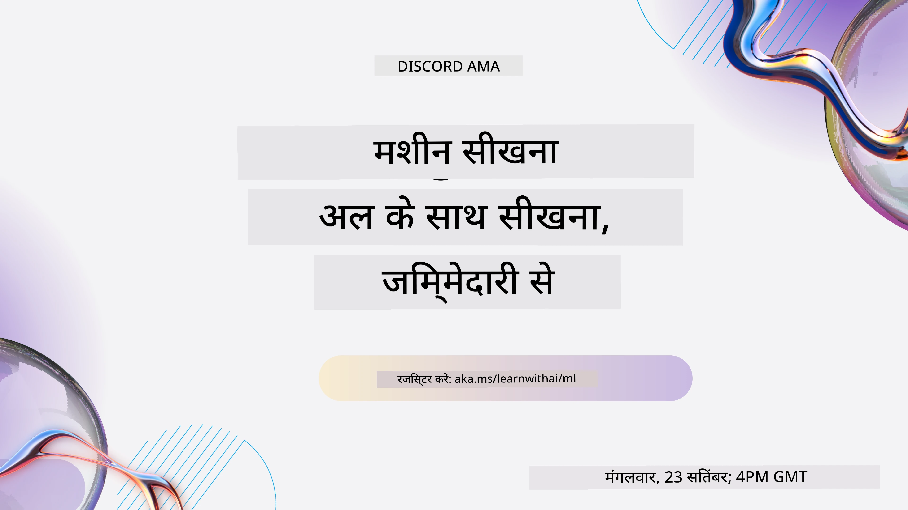
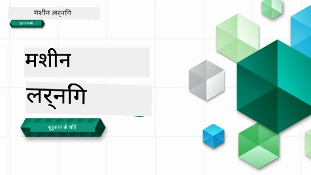

[](https://github.com/microsoft/ML-For-Beginners/blob/master/LICENSE)
[](https://GitHub.com/microsoft/ML-For-Beginners/graphs/contributors/)
[](https://GitHub.com/microsoft/ML-For-Beginners/issues/)
[](https://GitHub.com/microsoft/ML-For-Beginners/pulls/)
[](http://makeapullrequest.com)

[](https://GitHub.com/microsoft/ML-For-Beginners/watchers/)
[](https://GitHub.com/microsoft/ML-For-Beginners/network/)
[](https://GitHub.com/microsoft/ML-For-Beginners/stargazers/)

### 🌐 बहुभाषी समर्थन

#### गिटहब क्रिया के माध्यम से समर्थित (स्वचालित और हमेशा अद्यतित)

<!-- CO-OP TRANSLATOR LANGUAGES TABLE START -->
[अरबी](../ar/README.md) | [बंगाली](../bn/README.md) | [बुल्गारियाई](../bg/README.md) | [बर्मी (म्यांमार)](../my/README.md) | [चीनी (सरलीकृत)](../zh-CN/README.md) | [चीनी (परंपरागत, हांगकांग)](../zh-HK/README.md) | [चीनी (परंपरागत, मकाऊ)](../zh-MO/README.md) | [चीनी (परंपरागत, ताइवान)](../zh-TW/README.md) | [क्रोएशियाई](../hr/README.md) | [चेक](../cs/README.md) | [डेनिश](../da/README.md) | [डच](../nl/README.md) | [एस्टोनियाई](../et/README.md) | [फिनिश](../fi/README.md) | [फ्रेंच](../fr/README.md) | [जर्मन](../de/README.md) | [ग्रीक](../el/README.md) | [हिब्रू](../he/README.md) | [हिंदी](./README.md) | [हंगेरियाई](../hu/README.md) | [इंडोनेशियाई](../id/README.md) | [इतालवी](../it/README.md) | [जापानी](../ja/README.md) | [कन्नड़](../kn/README.md) | [खमेर](../km/README.md) | [कोरियाई](../ko/README.md) | [लिथुआनियाई](../lt/README.md) | [मलय](../ms/README.md) | [मलयालम](../ml/README.md) | [मराठी](../mr/README.md) | [नेपाली](../ne/README.md) | [नाइजीरियाई पिजिन](../pcm/README.md) | [नॉर्वेजियन](../no/README.md) | [फारसी (पर्शियन)](../fa/README.md) | [पोलिश](../pl/README.md) | [पुर्तगाली (ब्राज़ील)](../pt-BR/README.md) | [पुर्तगाली (पुर्तगाल)](../pt-PT/README.md) | [पंजाबी (गुरमुखी)](../pa/README.md) | [रोमानियाई](../ro/README.md) | [रूसी](../ru/README.md) | [सर्बियाई (सिरिलिक)](../sr/README.md) | [स्लोवाक](../sk/README.md) | [स्लोवेनियाई](../sl/README.md) | [स्पेनिश](../es/README.md) | [स्वाहिली](../sw/README.md) | [स्वीडिश](../sv/README.md) | [टागालॉग (फिलिपिनो)](../tl/README.md) | [तमिल](../ta/README.md) | [तेलुगु](../te/README.md) | [थाई](../th/README.md) | [तुर्की](../tr/README.md) | [यूक्रेनी](../uk/README.md) | [उर्दू](../ur/README.md) | [वियतनामी](../vi/README.md)

> **स्थानीय रूप से क्लोन करना पसंद है?**
>
> इस रिपॉजिटरी में 50+ भाषा अनुवाद शामिल हैं जो डाउनलोड आकार को काफी बढ़ाते हैं। अनुवाद के बिना क्लोन करने के लिए sparse checkout का उपयोग करें:
>
> **Bash / macOS / Linux:**
> ```bash
> git clone --filter=blob:none --sparse https://github.com/microsoft/ML-For-Beginners.git
> cd ML-For-Beginners
> git sparse-checkout set --no-cone '/*' '!translations' '!translated_images'
> ```
>
> **CMD (Windows):**
> ```cmd
> git clone --filter=blob:none --sparse https://github.com/microsoft/ML-For-Beginners.git
> cd ML-For-Beginners
> git sparse-checkout set --no-cone "/*" "!translations" "!translated_images"
> ```
>
> यह आपको एक बहुत तेज़ डाउनलोड के साथ कोर्स पूरा करने के लिए सब कुछ देता है।
<!-- CO-OP TRANSLATOR LANGUAGES TABLE END -->

#### हमारे समुदाय में शामिल हों

[](https://discord.gg/nTYy5BXMWG)

हमारे पास Discord पर AI के साथ सीखने की एक श्रंखला चल रही है, अधिक जानें और 18 - 30 सितंबर, 2025 को [Learn with AI Series](https://aka.ms/learnwithai/discord) में हमारे साथ जुड़ें। आपको डेटा साइंस के लिए GitHub Copilot का उपयोग करने के टिप्स और ट्रिक्स मिलेंगे।



# शुरुआती लोगों के लिए मशीन लर्निंग - एक पाठ्यक्रम

> 🌍 दुनिया के विभिन्न संस्कृतियों के माध्यम से मशीन लर्निंग का अन्वेषण करते हुए यात्रा करें 🌍

Microsoft के Cloud Advocates आपको एक 12-सप्ताह, 26-पाठ का पाठ्यक्रम प्रस्तुत करते हैं जो **मशीन लर्निंग** के बारे में है। इस पाठ्यक्रम में, आप कभी-कभी इसे **क्लासिक मशीन लर्निंग** कहते हैं के बारे में सीखेंगे, मुख्य रूप से Scikit-learn का उपयोग करते हुए, और डीप लर्निंग से बचेंगे, जो हमारे [AI for Beginners' curriculum](https://aka.ms/ai4beginners) में कवर किया गया है। इन पाठों को हमारे ['Data Science for Beginners' curriculum](https://aka.ms/ds4beginners) के साथ भी जोड़ा जा सकता है!

हमारे साथ दुनिया भर की विभिन्न जगहों के डेटा पर ये क्लासिक तकनीकें लागू करते हुए यात्रा करें। प्रत्येक पाठ में पूर्व और पश्चात क्विज़, लिखित निर्देश, समाधान, एक असाइनमेंट और बहुत कुछ शामिल है। हमारी परियोजना-आधारित शिक्षण पद्धति से आप निर्माण करते हुए सीखेंगे, जो नई कौशलों को अच्छी तरह से पकड़ने का प्रमाणित तरीका है।

**✍️ हमारे लेखकों का हार्दिक धन्यवाद** जेन लूपर, स्टीफन हाउवल, फ्रांसेस्का लज्जेरी, तोमामी इमूरा, कैसी ब्रीवियु, दिमित्री सोशनिकोव, क्रिस नोरिंग, अनिर्बन मुखर्जी, ऑर्नेला अल्टुनयान, रूथ याकुबू और एमी बॉयड

**🎨 हमारे चित्रकारों का भी धन्यवाद** तोमामी इमूरा, डसानी मदिपल्ली, और जेन लूपर

**🙏 विशेष धन्यवाद 🙏 हमारे Microsoft Student Ambassador लेखकों, समीक्षकों और सामग्री योगदानकर्ताओं को**, विशेष रूप से ऋषित डगली, मुहम्मद साकिब खान इनान, रोहन राज, अलेक्जेंड्रु पेट्रेस्कु, अभिषेक जैस्वाल, नवरीन तबस्सुम, इओन सामुइला, और स्निधा अग्रवाल

**🤩 हमारे R पाठों के लिए Microsoft Student Ambassadors एरिक वांजाऊ, जसलीन सोनधी, और विदुशी गुप्ता को अतिरिक्त आभार!**

# शुरुआत कैसे करें

इन चरणों का पालन करें:
1. **रिपॉजिटरी को Fork करें**: इस पेज के ऊपर-दाएँ कोने में "Fork" बटन पर क्लिक करें।
2. **रिपॉजिटरी को क्लोन करें**:   `git clone https://github.com/microsoft/ML-For-Beginners.git`

> 💡 **त्वरित शुरूआत सुझाव:** बिना स्थानीय रूप से Python सेटअप किए ब्राउज़र में शुरू करना चाहते हैं? अपने फोर्क के लिए एक क्लाउड विकास पर्यावरण बनाने के लिए [GitHub Codespaces](https://github.com/features/codespaces) का उपयोग करें। हरे **Code** मेनू को खोलें, **Codespaces** चुनें, और एक codespace बनाएं; आवश्यकतानुसार प्रत्येक पाठ के लिए आवश्यक निर्भरताएं उसमें स्थापित करें।

> [इस कोर्स के सभी अतिरिक्त संसाधन हमारे Microsoft Learn संग्रह में देखें](https://learn.microsoft.com/en-us/collections/qrqzamz1nn2wx3?WT.mc_id=academic-77952-bethanycheum)

> 🔧 **मदद चाहिए?** सामान्य स्थापना, सेटअप, और पाठ चलाने की समस्याओं के समाधान के लिए हमारे [Troubleshooting Guide](TROUBLESHOOTING.md) की जाँच करें।


**[छात्रों](https://aka.ms/student-page)**, इस पाठ्यक्रम का उपयोग करने के लिए पूरे रिपॉजिटरी को अपने GitHub अकाउंट पर fork करें और व्यायाम खुद या समूह के साथ पूरा करें:

- प्री-लेक्चर क्विज से शुरू करें।
- व्याख्यान पढ़ें और गतिविधियाँ पूरी करें, प्रत्येक ज्ञान जांच पर रुकें और विचार करें।
- समाधान कोड चलाने के बजाय, पाठों को समझकर परियोजनाएँ बनाने का प्रयास करें; हालाँकि, वह कोड प्रत्येक परियोजना केंद्रित पाठ के `/solution` फ़ोल्डरों में उपलब्ध है।
- पोस्ट-लेक्चर क्विज लें।
- चुनौती पूरी करें।
- असाइनमेंट पूरा करें।
- एक पाठ समूह पूरा करने के बाद, [Discussion Board](https://github.com/microsoft/ML-For-Beginners/discussions) पर जाएँ और उपयुक्त PAT रूपरेखा भरकर "उच्चारण में सीखें"। 'PAT' एक प्रगति मूल्यांकन उपकरण है जिसे आप अपनी सीख को आगे बढ़ाने के लिए भरते हैं। आप अन्य PATs पर प्रतिक्रिया भी दे सकते हैं ताकि हम एक साथ सीख सकें।

> आगे अध्ययन के लिए, हम अनुशंसा करते हैं कि आप इन [Microsoft Learn](https://docs.microsoft.com/en-us/users/jenlooper-2911/collections/k7o7tg1gp306q4?WT.mc_id=academic-77952-leestott) मॉड्यूल और सीखने के पथों का पालन करें।

**शिक्षकों**, हमने इस पाठ्यक्रम का उपयोग करने के कुछ सुझाव [शामिल किए हैं](for-teachers.md)।

---

## वीडियो वॉकथ्रू

कुछ पाठ छोटे वीडियो के रूप में उपलब्ध हैं। आप इन्हें पाठों के अंदर देख सकते हैं, या [Microsoft Developer YouTube चैनल पर ML for Beginners प्लेलिस्ट](https://aka.ms/ml-beginners-videos) पर नीचे की छवि पर क्लिक करके पा सकते हैं।

[](https://aka.ms/ml-beginners-videos)

---

## टीम से मिलें

[](https://youtu.be/Tj1XWrDSYJU)

**गिफ़ द्वारा** [मोहित जाइसल](https://linkedin.com/in/mohitjaisal)

> 🎥 परियोजना और इसे बनाने वाले लोगों के बारे में एक वीडियो के लिए ऊपर की छवि पर क्लिक करें!

---

## शिक्षाशास्त्र

इस पाठ्यक्रम को बनाते समय हमने दो शैक्षिक सिद्धांत चुने हैं: इसे व्यावहारिक **परियोजना-आधारित** बनाना और इसमें **बार-बार क्विज़** शामिल करना। इसके अलावा, इस पाठ्यक्रम का एक सामान्य **थीम** है जो इसे एकजुटता प्रदान करता है।

सुनिश्चित करके कि सामग्री परियोजनाओं के अनुरूप है, प्रक्रिया छात्रों के लिए अधिक रोचक बनती है और अवधारणाओं की पकड़ बढ़ेगी। इसके अतिरिक्त, कक्षा से पहले एक कम-जोखिम वाला क्विज़ छात्र के सीखने के इरादे को सेट करता है, जबकि कक्षा के बाद दूसरा क्विज़ आगे पकड़ सुनिश्चित करता है। यह पाठ्यक्रम लचीला और मजेदार है और इसे पूरी तरह या आंशिक रूप से लिया जा सकता है। परियोजनाएँ छोटी शुरुआत करती हैं और 12-सप्ताह के अंत तक बढ़ती जटिल होती जाती हैं। इस पाठ्यक्रम में मशीन लर्निंग के वास्तविक विश्व अनुप्रयोगों पर एक पोस्टस्क्रिप्ट भी शामिल है, जिसे अतिरिक्त क्रेडिट या चर्चा के आधार के रूप में उपयोग किया जा सकता है।

> हमारे [आचार संहिता](CODE_OF_CONDUCT.md), [योगदान](CONTRIBUTING.md), [अनुवाद](..), और [समस्या निवारण](TROUBLESHOOTING.md) दिशानिर्देश देखें। हम आपके रचनात्मक प्रतिक्रिया का स्वागत करते हैं!

## प्रत्येक पाठ में शामिल हैं

- वैकल्पिक स्केचनोट
- वैकल्पिक पूरक वीडियो
- वीडियो वॉकथ्रू (कुछ पाठों में ही)
- [प्री-लेक्चर वार्मअप क्विज](https://ff-quizzes.netlify.app/en/ml/)
- लिखित पाठ
- परियोजना-आधारित पाठों के लिए, परियोजना बनाने के चरण-दर-चरण निर्देश
- ज्ञान जांच
- एक चुनौती
- पूरक पठन
- असाइनमेंट
- [पोस्ट-लेक्चर क्विज](https://ff-quizzes.netlify.app/en/ml/)

> **भाषाओं के बारे में एक नोट**: ये पाठ मुख्य रूप से Python में लिखे गए हैं, लेकिन कई R में भी उपलब्ध हैं। R पाठ पूरा करने के लिए, `/solution` फ़ोल्डर में जाएं और R पाठों की खोज करें। उनमें .rmd एक्सटेंशन होता है जो एक **R Markdown** फ़ाइल दर्शाता है, जिसे सरलता से कोड खंड (R या अन्य भाषाओं के) और एक YAML शीर्षक (जो आउटपुट जैसे PDF के फॉर्मेट को निर्देशित करता है) के सम्मिलन के रूप में परिभाषित किया जा सकता है। इस प्रकार, यह डेटा साइंस के लिए एक उत्कृष्ट लेखन प्रणाली प्रदान करता है क्योंकि यह आपको अपने कोड, उसका आउटपुट और अपने विचारों को Markdown में लिखने की अनुमति देता है। इसके अलावा, R Markdown दस्तावेज़ PDF, HTML या Word जैसे आउटपुट प्रारूपों में रेंडर किए जा सकते हैं।

> **क्विज़ के बारे में एक नोट**: सभी क्विज़ [Quiz App फ़ोल्डर](../../quiz-app) में निहित हैं, कुल 52 क्विज़, हर एक में तीन प्रश्न हैं। वे पाठों के भीतर लिंक किए गए हैं लेकिन क्विज़ ऐप को स्थानीय रूप से चलाया जा सकता है; `quiz-app` फ़ोल्डर में निर्देश का पालन करें स्थानीय रूप से होस्ट या Azure पर तैनात करने के लिए।

| पाठ संख्या |                             विषय                              |                   पाठ समूह                   | सीखने के उद्देश्य                                                                                                             |                                                              लिंक किया गया पाठ                                                               |                        लेखक                        |
| :-----------: | :------------------------------------------------------------: | :-------------------------------------------------: | ------------------------------------------------------------------------------------------------------------------------------- | :--------------------------------------------------------------------------------------------------------------------------------------: | :--------------------------------------------------: |
|      01       |                मशीन लर्निंग का परिचय                |      [Introduction](1-Introduction/README.md)       | मशीन लर्निंग के मूल सिद्धांत सीखें                                                                                     |                                             [Lesson](1-Introduction/1-intro-to-ML/README.md)                                             |                       Muhammad                       |
|      02       |                मशीन लर्निंग का इतिहास                 |      [Introduction](1-Introduction/README.md)       | इस क्षेत्र के पीछे का इतिहास जानें                                                                                         |                                            [Lesson](1-Introduction/2-history-of-ML/README.md)                                            |                     Jen and Amy                      |
|      03       |                 निष्पक्षता और मशीन लर्निंग                  |      [Introduction](1-Introduction/README.md)       | निष्पक्षता के आसपास के महत्वपूर्ण दार्शनिक मुद्दे क्या हैं जो छात्रों को ML मॉडल बनाने और लागू करने के दौरान विचार करने चाहिए? |                                              [Lesson](1-Introduction/3-fairness/README.md)                                               |                        Tomomi                        |
|      04       |                मशीन लर्निंग के लिए तकनीकें                 |      [Introduction](1-Introduction/README.md)       | ML शोधकर्ता ML मॉडल बनाने के लिए किन तकनीकों का उपयोग करते हैं?                                                                       |                                          [Lesson](1-Introduction/4-techniques-of-ML/README.md)                                           |                    Chris and Jen                     |
|      05       |                   रिग्रेशन का परिचय                   |        [Regression](2-Regression/README.md)         | रिग्रेशन मॉडल के लिए Python और Scikit-learn के साथ शुरुआत करें                                                                  |         [Python](2-Regression/1-Tools/README.md) • [R](../../2-Regression/1-Tools/solution/R/lesson_1.html)         |      Jen • Eric Wanjau       |
|      06       |                उत्तरी अमेरिकी कद्दू की कीमतें 🎃                |        [Regression](2-Regression/README.md)         | मशीन लर्निंग के लिए डेटा को विज़ुअलाइज़ और साफ करें                                                                                  |          [Python](2-Regression/2-Data/README.md) • [R](../../2-Regression/2-Data/solution/R/lesson_2.html)          |      Jen • Eric Wanjau       |
|      07       |                उत्तरी अमेरिकी कद्दू की कीमतें 🎃                |        [Regression](2-Regression/README.md)         | रैखिक और बहुपदीय रिग्रेशन मॉडल बनाएं                                                                                   |        [Python](2-Regression/3-Linear/README.md) • [R](../../2-Regression/3-Linear/solution/R/lesson_3.html)        |      Jen and Dmitry • Eric Wanjau       |
|      08       |                उत्तरी अमेरिकी कद्दू की कीमतें 🎃                |        [Regression](2-Regression/README.md)         | एक लॉजिस्टिक रिग्रेशन मॉडल बनाएं                                                                                               |     [Python](2-Regression/4-Logistic/README.md) • [R](../../2-Regression/4-Logistic/solution/R/lesson_4.html)      |      Jen • Eric Wanjau       |
|      09       |                          एक वेब ऐप 🔌                          |           [Web App](3-Web-App/README.md)            | अपने प्रशिक्षित मॉडल का उपयोग करने के लिए वेब ऐप बनाएं                                                                                       |                                                 [Python](3-Web-App/1-Web-App/README.md)                                                  |                         Jen                          |
|      10       |                 वर्गीकरण का परिचय                 |    [Classification](4-Classification/README.md)     | अपने डेटा को साफ़ करें, तैयार करें, और विज़ुअलाइज़ करें; वर्गीकरण का परिचय                                                            | [Python](4-Classification/1-Introduction/README.md) • [R](../../4-Classification/1-Introduction/solution/R/lesson_10.html)  | Jen and Cassie • Eric Wanjau |
|      11       |             स्वादिष्ट एशियाई और भारतीय व्यंजन 🍜             |    [Classification](4-Classification/README.md)     | वर्गीकर्ताओं का परिचय                                                                                                     | [Python](4-Classification/2-Classifiers-1/README.md) • [R](../../4-Classification/2-Classifiers-1/solution/R/lesson_11.html) | Jen and Cassie • Eric Wanjau |
|      12       |             स्वादिष्ट एशियाई और भारतीय व्यंजन 🍜             |    [Classification](4-Classification/README.md)     | अधिक वर्गीकर्ता                                                                                                                | [Python](4-Classification/3-Classifiers-2/README.md) • [R](../../4-Classification/3-Classifiers-2/solution/R/lesson_12.html) | Jen and Cassie • Eric Wanjau |
|      13       |             स्वादिष्ट एशियाई और भारतीय व्यंजन 🍜             |    [Classification](4-Classification/README.md)     | अपने मॉडल का उपयोग करके एक सिफारिश वेब ऐप बनाएं                                                                                    |                                              [Python](4-Classification/4-Applied/README.md)                                              |                         Jen                          |
|      14       |                   क्लस्टरिंग का परिचय                   |        [Clustering](5-Clustering/README.md)         | अपने डेटा को साफ़ करें, तैयार करें, और विज़ुअलाइज़ करें; क्लस्टरिंग का परिचय                                                                |         [Python](5-Clustering/1-Visualize/README.md) • [R](../../5-Clustering/1-Visualize/solution/R/lesson_14.html)         |      Jen • Eric Wanjau       |
|      15       |              नाइजीरियाई संगीत स्वादों का अन्वेषण 🎧              |        [Clustering](5-Clustering/README.md)         | K-Means क्लस्टरिंग विधि का अन्वेषण करें                                                                                           |           [Python](5-Clustering/2-K-Means/README.md) • [R](../../5-Clustering/2-K-Means/solution/R/lesson_15.html)           |      Jen • Eric Wanjau       |
|      16       |        प्राकृतिक भाषा प्रसंस्करण का परिचय ☕️         |   [Natural language processing](6-NLP/README.md)    | एक सरल बॉट बनाकर NLP के मूल बातें सीखें                                                                             |                                             [Python](6-NLP/1-Introduction-to-NLP/README.md)                                              |                       Stephen                        |
|      17       |                      सामान्य NLP कार्य ☕️                      |   [Natural language processing](6-NLP/README.md)    | भाषा की संरचनाओं से निपटने के दौरान आवश्यक सामान्य कार्यों को समझकर अपने NLP ज्ञान को गहरा करें                          |                                                    [Python](6-NLP/2-Tasks/README.md)                                                     |                       Stephen                        |
|      18       |             अनुवाद और भावना विश्लेषण ♥️              |   [Natural language processing](6-NLP/README.md)    | जेन ऑस्टिन के साथ अनुवाद और भावना विश्लेषण                                                                             |                                            [Python](6-NLP/3-Translation-Sentiment/README.md)                                             |                       Stephen                        |
|      19       |                  यूरोप के रोमांटिक होटल ♥️                  |   [Natural language processing](6-NLP/README.md)    | होटल समीक्षाओं के साथ भावना विश्लेषण 1                                                                                         |                                               [Python](6-NLP/4-Hotel-Reviews-1/README.md)                                                |                       Stephen                        |
|      20       |                  यूरोप के रोमांटिक होटल ♥️                  |   [Natural language processing](6-NLP/README.md)    | होटल समीक्षाओं के साथ भावना विश्लेषण 2                                                                                         |                                               [Python](6-NLP/5-Hotel-Reviews-2/README.md)                                                |                       Stephen                        |
|      21       |            टाइम सीरीज पूर्वानुमान का परिचय             |        [Time series](7-TimeSeries/README.md)        | टाइम सीरीज पूर्वानुमान का परिचय                                                                                         |                                             [Python](7-TimeSeries/1-Introduction/README.md)                                              |                      Francesca                       |
|      22       | ⚡️ विश्व बिजली उपयोग ⚡️ - ARIMA के साथ टाइम सीरीज पूर्वानुमान |        [Time series](7-TimeSeries/README.md)        | ARIMA के साथ टाइम सीरीज पूर्वानुमान                                                                                              |                                                 [Python](7-TimeSeries/2-ARIMA/README.md)                                                 |                      Francesca                       |
|      23       |  ⚡️ विश्व बिजली उपयोग ⚡️ - SVR के साथ टाइम सीरीज पूर्वानुमान  |        [Time series](7-TimeSeries/README.md)        | सपोर्ट वेक्टर रिग्रेसर के साथ टाइम सीरीज पूर्वानुमान                                                                           |                                                  [Python](7-TimeSeries/3-SVR/README.md)                                                  |                       Anirban                        |
|      24       |             रिइन्फोर्समेंट लर्निंग का परिचय             | [Reinforcement learning](8-Reinforcement/README.md) | क्यू-लर्निंग के साथ रिइन्फोर्समेंट लर्निंग का परिचय                                                                          |                                             [Python](8-Reinforcement/1-QLearning/README.md)                                              |                        Dmitry                        |
|      25       |                 पीटर को भेड़िये से बचाओ! 🐺                  | [Reinforcement learning](8-Reinforcement/README.md) | रिइन्फोर्समेंट लर्निंग जिम                                                                                                      |                                                [Python](8-Reinforcement/2-Gym/README.md)                                                 |                        Dmitry                        |
|  Postscript   |            वास्तविक दुनिया के ML परिदृश्य और अनुप्रयोग            |      [ML in the Wild](9-Real-World/README.md)       | क्लासिक ML के दिलचस्प और खुलासे वाले वास्तविक दुनिया के अनुप्रयोग                                                               |                                             [Lesson](9-Real-World/1-Applications/README.md)                                              |                         Team                         |
|  Postscript   |            RAI डैशबोर्ड का उपयोग करके ML में मॉडल डिबगिंग            |      [ML in the Wild](9-Real-World/README.md)       | जिम्मेदार AI डैशबोर्ड घटकों का उपयोग करके मशीन लर्निंग में मॉडल डिबगिंग                                                              |                                             [Lesson](9-Real-World/2-Debugging-ML-Models/README.md)                                              |                     Ruth Yakubu                      |

> [find all additional resources for this course in our Microsoft Learn collection](https://learn.microsoft.com/en-us/collections/qrqzamz1nn2wx3?WT.mc_id=academic-77952-bethanycheum)

## ऑफ़लाइन एक्सेस

आप [Docsify](https://docsify.js.org/#/) का उपयोग करके इस डॉ큐मेंटेशन को ऑफ़लाइन चला सकते हैं। इस रिपॉ को फोर्क करें, अपनी स्थानीय मशीन पर [Docsify स्थापित करें](https://docsify.js.org/#/quickstart), और फिर इस रिपॉ के रूट फ़ोल्डर में `docsify serve` टाइप करें। वेबसाइट आपके लोकलहोस्ट पर पोर्ट 3000 पर परोसी जाएगी: `localhost:3000`।

## पीडीएफ़

पाठ्यक्रम के लिंक के साथ एक पीडीएफ़ [यहाँ](https://microsoft.github.io/ML-For-Beginners/pdf/readme.pdf) प्राप्त करें।


## 🎒 अन्य पाठ्यक्रम 

हमारी टीम अन्य पाठ्यक्रम भी बनाती है! देखें:

<!-- CO-OP TRANSLATOR OTHER COURSES START -->
### LangChain
[](https://aka.ms/langchain4j-for-beginners)
[](https://aka.ms/langchainjs-for-beginners?WT.mc_id=m365-94501-dwahlin)
[](https://github.com/microsoft/langchain-for-beginners?WT.mc_id=m365-94501-dwahlin)
---

### Azure / Edge / MCP / एजेंट्स
[](https://github.com/microsoft/AZD-for-beginners?WT.mc_id=academic-105485-koreyst)
[](https://github.com/microsoft/edgeai-for-beginners?WT.mc_id=academic-105485-koreyst)
[](https://github.com/microsoft/mcp-for-beginners?WT.mc_id=academic-105485-koreyst)
[](https://github.com/microsoft/ai-agents-for-beginners?WT.mc_id=academic-105485-koreyst)

---
 
### जनरेटिव AI श्रृंखला
[](https://github.com/microsoft/generative-ai-for-beginners?WT.mc_id=academic-105485-koreyst)
[-9333EA?style=for-the-badge&labelColor=E5E7EB&color=9333EA)](https://github.com/microsoft/Generative-AI-for-beginners-dotnet?WT.mc_id=academic-105485-koreyst)
[-C084FC?style=for-the-badge&labelColor=E5E7EB&color=C084FC)](https://github.com/microsoft/generative-ai-for-beginners-java?WT.mc_id=academic-105485-koreyst)
[-E879F9?style=for-the-badge&labelColor=E5E7EB&color=E879F9)](https://github.com/microsoft/generative-ai-with-javascript?WT.mc_id=academic-105485-koreyst)

---
 
### कोर लर्निंग
[](https://aka.ms/ml-beginners?WT.mc_id=academic-105485-koreyst)
[](https://aka.ms/datascience-beginners?WT.mc_id=academic-105485-koreyst)
[](https://aka.ms/ai-beginners?WT.mc_id=academic-105485-koreyst)
[](https://github.com/microsoft/Security-101?WT.mc_id=academic-96948-sayoung)
[](https://aka.ms/webdev-beginners?WT.mc_id=academic-105485-koreyst)
[](https://aka.ms/iot-beginners?WT.mc_id=academic-105485-koreyst)
[](https://github.com/microsoft/xr-development-for-beginners?WT.mc_id=academic-105485-koreyst)

---
 
### Copilot श्रृंखला
[](https://aka.ms/GitHubCopilotAI?WT.mc_id=academic-105485-koreyst)
[](https://github.com/microsoft/mastering-github-copilot-for-dotnet-csharp-developers?WT.mc_id=academic-105485-koreyst)
[](https://github.com/microsoft/CopilotAdventures?WT.mc_id=academic-105485-koreyst)
<!-- CO-OP TRANSLATOR OTHER COURSES END -->

## मदद लेना

यदि आप मशीन लर्निंग सीखते समय या AI अनुप्रयोग बनाते समय फंस जाते हैं या आपके पास प्रश्न हैं, तो चिंता न करें — मदद उपलब्ध है।

आप अन्य शिक्षार्थियों और डेवलपर्स के साथ चर्चाओं में शामिल हो सकते हैं, प्रश्न पूछ सकते हैं, और समुदाय के साथ अपने विचार साझा कर सकते हैं।

- प्रश्न पूछने और दूसरों के साथ सीखने के लिए समुदाय में शामिल हों
- मशीन लर्निंग सिद्धांतों और परियोजना विचारों पर चर्चा करें
- अनुभवी डेवलपर्स से मार्गदर्शन प्राप्त करें

एक सहायक समुदाय आपके कौशल को बढ़ाने और समस्याओं को तेज़ी से हल करने का एक शानदार तरीका है।

[Microsoft Foundry Discord Community](https://discord.gg/nTYy5BXMWG)

यदि आप बग, त्रुटियां पाते हैं, या सुधार के लिए सुझाव देना चाहते हैं, तो आप इस रिपॉजिटरी में समस्या की रिपोर्ट करने के लिए एक **Issue** भी खोल सकते हैं।

उत्पाद प्रतिक्रिया के लिए या मौजूदा समुदाय पोस्ट खोजने के लिए, डेवलपर फोरम पर जाएं:

[](https://aka.ms/foundry/forum)

## अतिरिक्त सीखने के सुझाव

- बेहतर समझ के लिए प्रत्येक पाठ के बाद नोटबुक की समीक्षा करें।
- अपने आप एल्गोरिदम लागू करने का अभ्यास करें।
- सीखे गए सिद्धांतों का उपयोग करके वास्तविक दुनिया के डेटासेट्स का अन्वेषण करें।

---

<!-- CO-OP TRANSLATOR DISCLAIMER START -->
**अस्वीकरण**:
इस दस्तावेज़ का अनुवाद AI अनुवाद सेवा [Co-op Translator](https://github.com/Azure/co-op-translator) का उपयोग करके किया गया है। जबकि हम सटीकता के लिए प्रयास करते हैं, कृपया ध्यान दें कि स्वचालित अनुवादों में त्रुटियाँ या अशुद्धियाँ हो सकती हैं। मूल दस्तावेज़ अपनी मूल भाषा में ही प्रामाणिक स्रोत माना जाना चाहिए। महत्वपूर्ण जानकारी के लिए, पेशेवर मानव अनुवाद की सिफारिश की जाती है। इस अनुवाद के उपयोग से उत्पन्न किसी भी गलतफहमी या गलत व्याख्या के लिए हम उत्तरदायी नहीं हैं।
<!-- CO-OP TRANSLATOR DISCLAIMER END -->