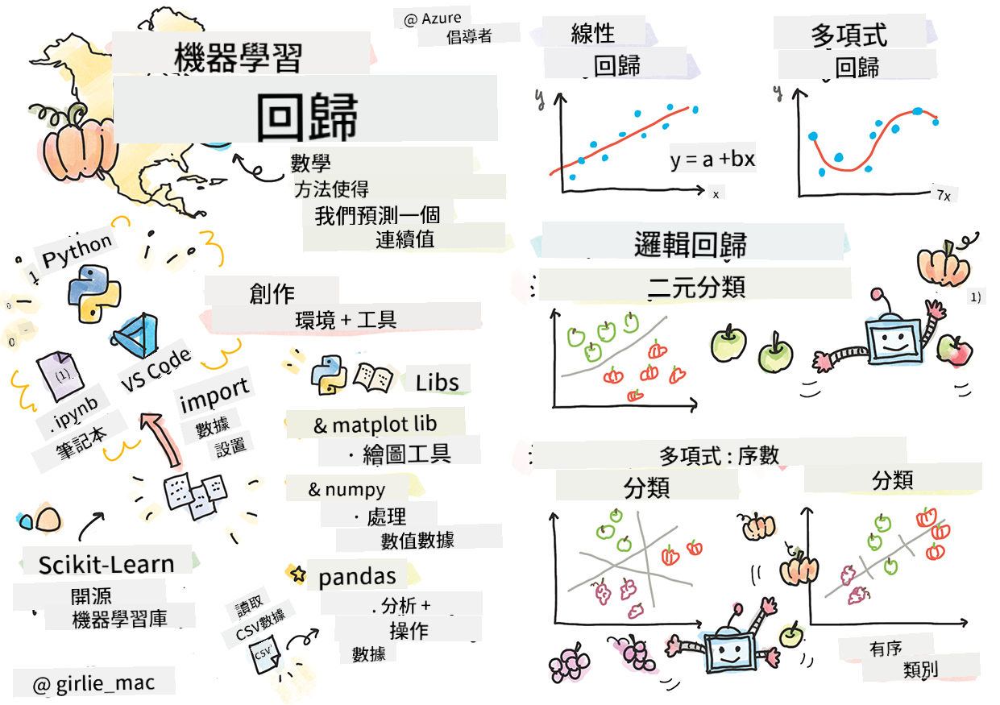
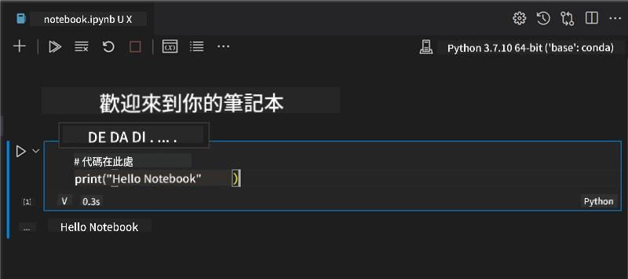
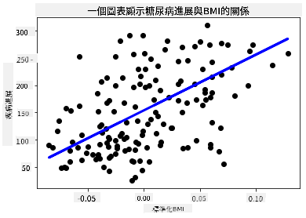

<!--
CO_OP_TRANSLATOR_METADATA:
{
  "original_hash": "6b1cb0e46d4c5b747eff6e3607642760",
  "translation_date": "2025-09-03T16:38:53+00:00",
  "source_file": "2-Regression/1-Tools/README.md",
  "language_code": "hk"
}
-->
# 使用 Python 和 Scikit-learn 建立回歸模型



> 手繪筆記由 [Tomomi Imura](https://www.twitter.com/girlie_mac) 提供

## [課前測驗](https://gray-sand-07a10f403.1.azurestaticapps.net/quiz/9/)

> ### [本課程也提供 R 版本！](../../../../2-Regression/1-Tools/solution/R/lesson_1.html)

## 簡介

在這四節課中，你將學習如何建立回歸模型。我們稍後會討論這些模型的用途。但在開始之前，請確保你已準備好所需的工具！

在本課程中，你將學習：

- 配置你的電腦以進行本地機器學習任務。
- 使用 Jupyter 筆記本。
- 安裝並使用 Scikit-learn。
- 通過實際操作探索線性回歸。

## 安裝與配置

[](https://youtu.be/-DfeD2k2Kj0 "機器學習初學者 - 配置工具以建立機器學習模型")

> 🎥 點擊上方圖片觀看短片，了解如何配置你的電腦以進行機器學習。

1. **安裝 Python**。確保你的電腦已安裝 [Python](https://www.python.org/downloads/)。Python 是進行許多數據科學和機器學習任務的必要工具。大多數電腦系統已預裝 Python。此外，還有一些方便的 [Python Coding Packs](https://code.visualstudio.com/learn/educators/installers?WT.mc_id=academic-77952-leestott)，可以簡化部分用戶的設置過程。

   不過，某些 Python 的使用場景可能需要特定版本的軟件，因此建議使用 [虛擬環境](https://docs.python.org/3/library/venv.html) 來管理不同版本。

2. **安裝 Visual Studio Code**。確保你的電腦已安裝 Visual Studio Code。按照這些指引完成 [Visual Studio Code 的基本安裝](https://code.visualstudio.com/)。在本課程中，你將在 Visual Studio Code 中使用 Python，因此可以先熟悉如何 [配置 Visual Studio Code](https://docs.microsoft.com/learn/modules/python-install-vscode?WT.mc_id=academic-77952-leestott) 以進行 Python 開發。

   > 透過這些 [學習模組](https://docs.microsoft.com/users/jenlooper-2911/collections/mp1pagggd5qrq7?WT.mc_id=academic-77952-leestott) 熟悉 Python。
   >
   > [](https://youtu.be/yyQM70vi7V8 "使用 Visual Studio Code 配置 Python")
   >
   > 🎥 點擊上方圖片觀看短片：在 VS Code 中使用 Python。

3. **安裝 Scikit-learn**，按照 [這些指引](https://scikit-learn.org/stable/install.html)。由於需要使用 Python 3，建議使用虛擬環境。如果你是在 M1 Mac 上安裝此庫，請參考上述頁面中的特殊指引。

4. **安裝 Jupyter Notebook**。你需要 [安裝 Jupyter 套件](https://pypi.org/project/jupyter/)。

## 你的機器學習開發環境

你將使用 **筆記本** 來開發 Python 代碼並建立機器學習模型。這種文件格式是數據科學家常用的工具，其文件後綴或擴展名為 `.ipynb`。

筆記本是一種交互式環境，允許開發者編寫代碼並添加筆記或文檔，這對於實驗性或研究導向的項目非常有幫助。

[](https://youtu.be/7E-jC8FLA2E "機器學習初學者 - 配置 Jupyter 筆記本以開始建立回歸模型")

> 🎥 點擊上方圖片觀看短片，了解如何完成此操作。

### 練習 - 使用筆記本

在此文件夾中，你會找到文件 _notebook.ipynb_。

1. 在 Visual Studio Code 中打開 _notebook.ipynb_。

   Jupyter 伺服器將啟動，並使用 Python 3+。你會看到筆記本中的代碼區塊，可以通過選擇播放按鈕圖標來執行代碼。

2. 選擇 `md` 圖標並添加一些 Markdown，輸入以下文字 **# 歡迎來到你的筆記本**。

   接著，添加一些 Python 代碼。

3. 在代碼區塊中輸入 **print('hello notebook')**。
4. 選擇箭頭執行代碼。

   你應該會看到打印的結果：

    ```output
    hello notebook
    ```



你可以在代碼中穿插註解，以自我記錄筆記本。

✅ 思考一下，網頁開發者的工作環境與數據科學家的工作環境有何不同。

## 使用 Scikit-learn 入門

現在你的本地環境已配置好 Python，並且你已熟悉 Jupyter 筆記本，接下來讓我們熟悉 Scikit-learn（發音為 `sci`，像 `science`）。Scikit-learn 提供了 [廣泛的 API](https://scikit-learn.org/stable/modules/classes.html#api-ref)，幫助你完成機器學習任務。

根據其 [官方網站](https://scikit-learn.org/stable/getting_started.html) 的描述，「Scikit-learn 是一個開源的機器學習庫，支持監督式和非監督式學習。它還提供了各種工具，用於模型擬合、數據預處理、模型選擇和評估，以及許多其他實用功能。」

在本課程中，你將使用 Scikit-learn 和其他工具來建立機器學習模型，完成我們所稱的「傳統機器學習」任務。我們刻意避開了神經網絡和深度學習，因為這些內容會在即將推出的「AI 初學者」課程中更詳細地介紹。

Scikit-learn 使建立模型並評估其使用變得簡單。它主要專注於使用數值數據，並包含幾個現成的數據集供學習使用。它還包括一些預建模型供學生嘗試。讓我們探索如何加載預打包數據並使用內建估算器進行第一次機器學習模型的建立。

## 練習 - 你的第一個 Scikit-learn 筆記本

> 本教程靈感來自 Scikit-learn 網站上的 [線性回歸範例](https://scikit-learn.org/stable/auto_examples/linear_model/plot_ols.html#sphx-glr-auto-examples-linear-model-plot-ols-py)。

[](https://youtu.be/2xkXL5EUpS0 "機器學習初學者 - 在 Python 中的第一個線性回歸項目")

> 🎥 點擊上方圖片觀看短片，了解如何完成此練習。

在與本課程相關的 _notebook.ipynb_ 文件中，按下「垃圾桶」圖標清除所有單元格。

在本節中，你將使用 Scikit-learn 中內建的關於糖尿病的小型數據集進行學習。假設你想測試一種針對糖尿病患者的治療方法。機器學習模型可能幫助你根據變量的組合，確定哪些患者對治療的反應更好。即使是非常基礎的回歸模型，當可視化時，也可能顯示出有助於組織理論臨床試驗的變量信息。

✅ 回歸方法有很多種類型，選擇哪一種取決於你想要回答的問題。如果你想預測某個年齡段的人的可能身高，你會使用線性回歸，因為你尋求的是一個 **數值**。如果你想判斷某種菜餚是否應被視為素食，你尋求的是一個 **類別分配**，因此你會使用邏輯回歸。稍後你會學到更多關於邏輯回歸的知識。思考一下你可以向數據提出哪些問題，以及哪種方法更適合。

讓我們開始這項任務。

### 導入庫

在此任務中，我們將導入一些庫：

- **matplotlib**。這是一個有用的 [繪圖工具](https://matplotlib.org/)，我們將用它來創建折線圖。
- **numpy**。 [numpy](https://numpy.org/doc/stable/user/whatisnumpy.html) 是一個處理 Python 數值數據的有用庫。
- **sklearn**。這是 [Scikit-learn](https://scikit-learn.org/stable/user_guide.html) 庫。

導入一些幫助完成任務的庫。

1. 輸入以下代碼添加導入：

   ```python
   import matplotlib.pyplot as plt
   import numpy as np
   from sklearn import datasets, linear_model, model_selection
   ```

   上述代碼中，你導入了 `matplotlib` 和 `numpy`，並從 `sklearn` 中導入了 `datasets`、`linear_model` 和 `model_selection`。`model_selection` 用於將數據分割為訓練集和測試集。

### 糖尿病數據集

內建的 [糖尿病數據集](https://scikit-learn.org/stable/datasets/toy_dataset.html#diabetes-dataset) 包含 442 個樣本，涉及糖尿病的數據，並有 10 個特徵變量，其中一些包括：

- age：年齡（以年為單位）
- bmi：身體質量指數
- bp：平均血壓
- s1 tc：T 細胞（一種白血球）

✅ 此數據集包含「性別」作為研究糖尿病的重要特徵變量。許多醫學數據集都包含這種二元分類。思考一下，這類分類可能如何排除某些群體的治療。

現在，載入 X 和 y 數據。

> 🎓 記住，這是監督式學習，我們需要一個名為 'y' 的目標。

在新的代碼單元格中，通過調用 `load_diabetes()` 加載糖尿病數據集。輸入 `return_X_y=True` 表示 `X` 將是數據矩陣，而 `y` 將是回歸目標。

1. 添加一些打印命令以顯示數據矩陣的形狀及其第一個元素：

    ```python
    X, y = datasets.load_diabetes(return_X_y=True)
    print(X.shape)
    print(X[0])
    ```

    你得到的響應是一個元組。你正在將元組的前兩個值分別分配給 `X` 和 `y`。了解更多 [關於元組](https://wikipedia.org/wiki/Tuple)。

    你可以看到此數據有 442 個項目，每個項目由 10 個元素組成的數組構成：

    ```text
    (442, 10)
    [ 0.03807591  0.05068012  0.06169621  0.02187235 -0.0442235  -0.03482076
    -0.04340085 -0.00259226  0.01990842 -0.01764613]
    ```

    ✅ 思考一下數據與回歸目標之間的關係。線性回歸預測特徵 X 和目標變量 y 之間的關係。你能在文檔中找到糖尿病數據集的 [目標](https://scikit-learn.org/stable/datasets/toy_dataset.html#diabetes-dataset) 嗎？此數據集展示了什麼？

2. 接下來，選擇此數據集的一部分進行繪圖，選擇數據集的第三列。你可以使用 `:` 運算符選擇所有行，然後使用索引（2）選擇第三列。你還可以使用 `reshape(n_rows, n_columns)` 將數據重塑為 2D 數組（繪圖所需）。如果其中一個參數為 -1，則相應的維度會自動計算。

   ```python
   X = X[:, 2]
   X = X.reshape((-1,1))
   ```

   ✅ 隨時打印數據以檢查其形狀。

3. 現在你已準備好繪製數據，可以看看機器是否能幫助確定數據集中數字的邏輯分割。為此，你需要將數據（X）和目標（y）分割為測試集和訓練集。Scikit-learn 提供了一種簡單的方法，你可以在給定點分割測試數據。

   ```python
   X_train, X_test, y_train, y_test = model_selection.train_test_split(X, y, test_size=0.33)
   ```

4. 現在你可以訓練你的模型了！加載線性回歸模型，並使用 `model.fit()` 訓練你的 X 和 y 訓練集：

    ```python
    model = linear_model.LinearRegression()
    model.fit(X_train, y_train)
    ```

    ✅ `model.fit()` 是你在許多機器學習庫（如 TensorFlow）中會看到的函數。

5. 然後，使用測試數據創建預測，使用函數 `predict()`。這將用於繪製數據組之間的分割線。

    ```python
    y_pred = model.predict(X_test)
    ```

6. 現在是時候用圖表展示數據了。Matplotlib 是完成此任務的非常有用的工具。創建所有 X 和 y 測試數據的散點圖，並使用預測在最合適的位置繪製一條線，分割模型的數據組。

    ```python
    plt.scatter(X_test, y_test,  color='black')
    plt.plot(X_test, y_pred, color='blue', linewidth=3)
    plt.xlabel('Scaled BMIs')
    plt.ylabel('Disease Progression')
    plt.title('A Graph Plot Showing Diabetes Progression Against BMI')
    plt.show()
    ```

   
✅ 想一想這裡發生了什麼。一條直線穿過許多小數據點，但它到底在做什麼？你能否看出如何利用這條直線來預測一個新的、未見過的數據點應該如何與圖表的 y 軸產生關係？試著用語言描述這個模型的實際用途。

恭喜你！你已經建立了你的第一個線性回歸模型，用它進行了預測，並在圖表中展示了結果！

---
## 🚀挑戰

繪製此數據集中另一個變量的圖表。提示：編輯這一行：`X = X[:,2]`。根據此數據集的目標，你能發現糖尿病作為一種疾病的進展情況嗎？

## [課後測驗](https://gray-sand-07a10f403.1.azurestaticapps.net/quiz/10/)

## 回顧與自學

在本教程中，你使用了簡單線性回歸，而不是單變量或多變量線性回歸。閱讀一些關於這些方法差異的資料，或者觀看[這段影片](https://www.coursera.org/lecture/quantifying-relationships-regression-models/linear-vs-nonlinear-categorical-variables-ai2Ef)。

深入了解回歸的概念，並思考可以用這種技術回答哪些問題。參加這個[教程](https://docs.microsoft.com/learn/modules/train-evaluate-regression-models?WT.mc_id=academic-77952-leestott)來加深你的理解。

## 作業

[另一個數據集](assignment.md)

---

**免責聲明**：  
本文件已使用人工智能翻譯服務 [Co-op Translator](https://github.com/Azure/co-op-translator) 進行翻譯。儘管我們致力於提供準確的翻譯，但請注意，自動翻譯可能包含錯誤或不準確之處。原始語言的文件應被視為權威來源。對於重要資訊，建議使用專業人工翻譯。我們對因使用此翻譯而引起的任何誤解或錯誤解釋概不負責。