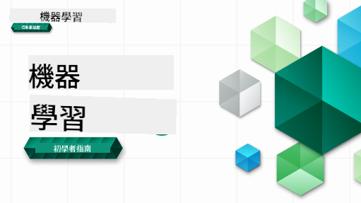

<!--
CO_OP_TRANSLATOR_METADATA:
{
  "original_hash": "5446266b7397d6dc7f3016921479e24b",
  "translation_date": "2025-12-21T10:53:03+00:00",
  "source_file": "README.md",
  "language_code": "hk"
}
-->

### 🌐 多語言支援

#### 透過 GitHub Action 支援（自動化及保持最新）

<!-- CO-OP TRANSLATOR LANGUAGES TABLE START -->
[Arabic](../ar/README.md) | [Bengali](../bn/README.md) | [Bulgarian](../bg/README.md) | [Burmese (Myanmar)](../my/README.md) | [Chinese (Simplified)](../zh/README.md) | [Chinese (Traditional, Hong Kong)](./README.md) | [Chinese (Traditional, Macau)](../mo/README.md) | [Chinese (Traditional, Taiwan)](../tw/README.md) | [Croatian](../hr/README.md) | [Czech](../cs/README.md) | [Danish](../da/README.md) | [Dutch](../nl/README.md) | [Estonian](../et/README.md) | [Finnish](../fi/README.md) | [French](../fr/README.md) | [German](../de/README.md) | [Greek](../el/README.md) | [Hebrew](../he/README.md) | [Hindi](../hi/README.md) | [Hungarian](../hu/README.md) | [Indonesian](../id/README.md) | [Italian](../it/README.md) | [Japanese](../ja/README.md) | [Kannada](../kn/README.md) | [Korean](../ko/README.md) | [Lithuanian](../lt/README.md) | [Malay](../ms/README.md) | [Malayalam](../ml/README.md) | [Marathi](../mr/README.md) | [Nepali](../ne/README.md) | [Nigerian Pidgin](../pcm/README.md) | [Norwegian](../no/README.md) | [Persian (Farsi)](../fa/README.md) | [Polish](../pl/README.md) | [Portuguese (Brazil)](../br/README.md) | [Portuguese (Portugal)](../pt/README.md) | [Punjabi (Gurmukhi)](../pa/README.md) | [Romanian](../ro/README.md) | [Russian](../ru/README.md) | [Serbian (Cyrillic)](../sr/README.md) | [Slovak](../sk/README.md) | [Slovenian](../sl/README.md) | [Spanish](../es/README.md) | [Swahili](../sw/README.md) | [Swedish](../sv/README.md) | [Tagalog (Filipino)](../tl/README.md) | [Tamil](../ta/README.md) | [Telugu](../te/README.md) | [Thai](../th/README.md) | [Turkish](../tr/README.md) | [Ukrainian](../uk/README.md) | [Urdu](../ur/README.md) | [Vietnamese](../vi/README.md)
<!-- CO-OP TRANSLATOR LANGUAGES TABLE END -->

#### 加入我哋嘅社群

我哋正舉行 Discord「Learn with AI」系列，活動時間為 2025 年 9 月 18 日至 30 日。想了解更多同加入我哋，請到 [Learn with AI 系列](https://aka.ms/learnwithai/discord)。你會學到使用 GitHub Copilot 做資料科學嘅技巧同秘訣。

# 初學者機器學習 - 課程大綱

> 🌍 跟我哋環遊世界，透過世界各地文化去探索機器學習 🌍

Microsoft 嘅 Cloud Advocates 很高興提供一個為期 12 週、共 26 節課嘅機器學習課程。在呢個課程裡，你會學到通常所講嘅「經典機器學習」，主要使用 Scikit-learn 作為函式庫，並避開深度學習（深度學習喺我哋嘅 [AI 初學者課程](https://aka.ms/ai4beginners) 有涵蓋）。你亦可以將呢啲課程同我哋嘅 [數據科學初學者課程](https://aka.ms/ds4beginners) 一齊配合學習。

同我哋一齊周遊世界，將呢啲經典技術應用喺來自世界各地嘅數據上。每節課包括課前與課後小測驗、書面指引完成課堂、解答、作業，仲有更多。透過專案導向教學，你一邊建立項目一邊學習，係一個經證實有效令新技能「記得住」嘅方法。

**✍️ 衷心感謝我哋嘅作者** Jen Looper, Stephen Howell, Francesca Lazzeri, Tomomi Imura, Cassie Breviu, Dmitry Soshnikov, Chris Noring, Anirban Mukherjee, Ornella Altunyan, Ruth Yakubu and Amy Boyd

**🎨 同樣多謝我哋嘅插畫師** Tomomi Imura, Dasani Madipalli, and Jen Looper

**🙏 特別鳴謝 🙏 我哋嘅 Microsoft Student Ambassador 作者、審稿人及內容貢獻者**，特別係 Rishit Dagli, Muhammad Sakib Khan Inan, Rohan Raj, Alexandru Petrescu, Abhishek Jaiswal, Nawrin Tabassum, Ioan Samuila, and Snigdha Agarwal

**🤩 額外鳴謝 Microsoft Student Ambassadors Eric Wanjau, Jasleen Sondhi, 同 Vidushi Gupta 為我哋嘅 R 課作出貢獻！**

# 開始使用

跟住以下步驟：
1. **Fork 倉庫**：按呢頁面右上角嘅「Fork」按鈕。
2. **複製倉庫（Clone the Repository）**：   `git clone https://github.com/microsoft/ML-For-Beginners.git`

> [喺我哋嘅 Microsoft Learn 收藏中搵到呢個課程嘅所有額外資源](https://learn.microsoft.com/en-us/collections/qrqzamz1nn2wx3?WT.mc_id=academic-77952-bethanycheum)

> 🔧 **需要幫忙？** 檢查我哋嘅 [疑難排解指南](TROUBLESHOOTING.md) 了解安裝、設定同運行課程時常見問題嘅解決方法。

**[學生](https://aka.ms/student-page)**，使用呢個課程時，請將整個倉庫 Fork 去你自己嘅 GitHub 帳戶，並單獨或同組員完成練習：

- 由課前小測驗開始。
- 閱讀講義並完成活動，喺每個知識檢查步驟停低反思。
- 盡量透過理解課堂內容去建立專案，而唔係直接執行解答代碼；不過每個以專案為導向嘅課程嘅 /solution 資料夾都有解答代碼可供參考。
- 做課後小測驗。
- 完成挑戰。
- 完成作業。
- 完成一組課程後，請到 [討論板](https://github.com/microsoft/ML-For-Beginners/discussions) 透過填寫相應嘅 PAT 評量表去「大聲學習」。PAT（Progress Assessment Tool）係一個讓你填寫以促進學習嘅評分規準。你亦可以對其他人嘅 PAT 作出回應，大家一齊學習。

> 如要深入學習，建議跟隨呢啲 [Microsoft Learn](https://docs.microsoft.com/en-us/users/jenlooper-2911/collections/k7o7tg1gp306q4?WT.mc_id=academic-77952-leestott) 模組同學習路徑。

**老師們**，我哋喺 [for-teachers.md](for-teachers.md) 提供咗一啲使用呢個課程嘅建議。

---

## 影片導覽

部分課程有短片形式嘅教學影片。你可以喺課堂內直接嵌入嘅位置睇到，或者按下面嘅圖片去 [Microsoft Developer YouTube 頻道嘅 ML for Beginners 播放清單](https://aka.ms/ml-beginners-videos)。

---

## 團隊成員

**Gif 由** [Mohit Jaisal](https://linkedin.com/in/mohitjaisal)

> 🎥 按上面嘅圖片睇一段關於呢個項目同創建者嘅影片！

---

## 教學法

我哋喺建立呢個課程時，選擇咗兩個教學原則：確保課程以實作為主（專案導向），並包含頻繁嘅小測驗。此外，課程有一個共同嘅主題令內容更有連貫性。

透過將內容與專案對齊，學習過程對學生會更有吸引力，概念記憶亦會加強。另外，課前嘅低壓力小測驗能夠令學生設定學習意向，而課後嘅第二次小測驗則有助鞏固記憶。呢個課程設計彈性而有趣，可以整套修讀或者按需選讀。專案由簡單開始，到 12 週循環結束時變得越來越複雜。課程亦包括一篇關於機器學習實際應用嘅後記，可作為加分題或討論基礎。

> 搵到我哋嘅 [行為準則](CODE_OF_CONDUCT.md)、[貢獻指南](CONTRIBUTING.md)、[翻譯指南](TRANSLATIONS.md)，同 [疑難排解](TROUBLESHOOTING.md) 指南。我哋歡迎你嘅建設性回饋！

## 每節課包括

- 可選的速寫筆記
- 可選的補充影片
- 影片導覽（僅部分課程）
- [課前熱身小測驗](https://ff-quizzes.netlify.app/en/ml/)
- 書面講義
- 對於以專案為基礎嘅課程，提供逐步指南教你點建立專案
- 知識檢查
- 一個挑戰
- 補充閱讀
- 作業
- [課後小測驗](https://ff-quizzes.netlify.app/en/ml/)

> **關於程式語言嘅說明**：呢啲課程主要以 Python 撰寫，但好多課程都有 R 版本。要完成 R 課程，請到 `/solution` 資料夾並尋找 R 課程。呢啲檔案會有 .rmd 副檔名，代表 **R Markdown** 檔案，簡單嚟講就係喺一個 Markdown 文件內嵌入 `code chunks`（R 或其他語言嘅程式碼）同 `YAML header`（指示如何格式化輸出例如 PDF）。因此，佢係數據科學嘅一個典範化撰寫框架，因為你可以將程式碼、其輸出同你嘅想法一齊用 Markdown 寫低。另外，R Markdown 文件可以渲染成 PDF、HTML 或 Word 等輸出格式。

> **關於小測驗嘅說明**：所有小測驗都放喺 [Quiz App folder](../../quiz-app)，總共有 52 個測驗，每個測驗包含三條問題。課堂內會有連結，但你亦可以喺本地執行 quiz app；請跟隨 `quiz-app` 資料夾內嘅指示去本地託管或部署到 Azure。

| 課程編號 |                             主題                              |                   課程分組                   | 學習目標                                                                                                             |                                                              相關課程                                                               |                        作者                        |
| :-----------: | :------------------------------------------------------------: | :-------------------------------------------------: | ------------------------------------------------------------------------------------------------------------------------------- | :--------------------------------------------------------------------------------------------------------------------------------------: | :--------------------------------------------------: |
|      01       |                機器學習簡介                |      [簡介](1-Introduction/README.md)       | 學習機器學習背後的基本概念                                                                                |                                             [課程](1-Introduction/1-intro-to-ML/README.md)                                             |                       Muhammad                       |
|      02       |                機器學習的歷史                 |      [簡介](1-Introduction/README.md)       | 了解此領域背後的歷史                                                                                         |                                            [課程](1-Introduction/2-history-of-ML/README.md)                                            |                     Jen and Amy                      |
|      03       |                 公平性與機器學習                  |      [簡介](1-Introduction/README.md)       | 在建立和應用機器學習模型時，學生應該考慮哪些有關公平性的重大哲學議題？ |                                              [課程](1-Introduction/3-fairness/README.md)                                               |                        Tomomi                        |
|      04       |                機器學習的技術                 |      [簡介](1-Introduction/README.md)       | 機器學習研究人員用哪些技術來建立模型？                                                                       |                                          [課程](1-Introduction/4-techniques-of-ML/README.md)                                           |                    Chris and Jen                     |
|      05       |                   回歸分析簡介                   |        [回歸](2-Regression/README.md)         | 使用 Python 與 Scikit-learn 開始回歸模型                                                                  |         [Python](2-Regression/1-Tools/README.md) • [R](../../2-Regression/1-Tools/solution/R/lesson_1.html)         |      Jen • Eric Wanjau       |
|      06       |                北美地區南瓜價格 🎃                |        [回歸](2-Regression/README.md)         | 視覺化並清理數據以準備機器學習                                                                                  |          [Python](2-Regression/2-Data/README.md) • [R](../../2-Regression/2-Data/solution/R/lesson_2.html)          |      Jen • Eric Wanjau       |
|      07       |                北美地區南瓜價格 🎃                |        [回歸](2-Regression/README.md)         | 建立線性與多項式回歸模型                                                                                   |        [Python](2-Regression/3-Linear/README.md) • [R](../../2-Regression/3-Linear/solution/R/lesson_3.html)        |      Jen and Dmitry • Eric Wanjau       |
|      08       |                北美地區南瓜價格 🎃                |        [回歸](2-Regression/README.md)         | 建立邏輯斯迴歸模型                                                                                               |     [Python](2-Regression/4-Logistic/README.md) • [R](../../2-Regression/4-Logistic/solution/R/lesson_4.html)      |      Jen • Eric Wanjau       |
|      09       |                          網頁應用 🔌                          |           [網頁應用](3-Web-App/README.md)            | 建立一個網頁應用以使用你訓練好的模型                                                                                       |                                                 [Python](3-Web-App/1-Web-App/README.md)                                                  |                         Jen                          |
|      10       |                 分類簡介                 |    [分類](4-Classification/README.md)     | 清理、預處理並視覺化你的數據；分類入門                                                            | [Python](4-Classification/1-Introduction/README.md) • [R](../../4-Classification/1-Introduction/solution/R/lesson_10.html)  | Jen and Cassie • Eric Wanjau |
|      11       |             美味的亞洲與印度料理 🍜             |    [分類](4-Classification/README.md)     | 分類器介紹                                                                                                     | [Python](4-Classification/2-Classifiers-1/README.md) • [R](../../4-Classification/2-Classifiers-1/solution/R/lesson_11.html) | Jen and Cassie • Eric Wanjau |
|      12       |             美味的亞洲與印度料理 🍜             |    [分類](4-Classification/README.md)     | 更多分類器                                                                                                                | [Python](4-Classification/3-Classifiers-2/README.md) • [R](../../4-Classification/3-Classifiers-2/solution/R/lesson_12.html) | Jen and Cassie • Eric Wanjau |
|      13       |             美味的亞洲與印度料理 🍜             |    [分類](4-Classification/README.md)     | 使用你的模型建立推薦系統網頁應用                                                                                    |                                              [Python](4-Classification/4-Applied/README.md)                                              |                         Jen                          |
|      14       |                   分群簡介                   |        [分群](5-Clustering/README.md)         | 清理、預處理並視覺化你的數據；分群入門                                                                |         [Python](5-Clustering/1-Visualize/README.md) • [R](../../5-Clustering/1-Visualize/solution/R/lesson_14.html)         |      Jen • Eric Wanjau       |
|      15       |              探索奈及利亞音樂喜好 🎧              |        [分群](5-Clustering/README.md)         | 探索 K-Means 分群方法                                                                                           |           [Python](5-Clustering/2-K-Means/README.md) • [R](../../5-Clustering/2-K-Means/solution/R/lesson_15.html)           |      Jen • Eric Wanjau       |
|      16       |        自然語言處理簡介 ☕️         |   [自然語言處理](6-NLP/README.md)    | 透過構建一個簡單機器人學習 NLP 的基礎知識                                                                             |                                             [Python](6-NLP/1-Introduction-to-NLP/README.md)                                              |                       Stephen                        |
|      17       |                      常見的 NLP 任務 ☕️                      |   [自然語言處理](6-NLP/README.md)    | 透過了解處理語言結構時常見的任務來深化你的 NLP 知識                          |                                                    [Python](6-NLP/2-Tasks/README.md)                                                     |                       Stephen                        |
|      18       |             翻譯與情感分析 ♥️              |   [自然語言處理](6-NLP/README.md)    | 用簡·奧斯汀的作品進行翻譯與情感分析                                                                             |                                            [Python](6-NLP/3-Translation-Sentiment/README.md)                                             |                       Stephen                        |
|      19       |                  歐洲浪漫旅館 ♥️                  |   [自然語言處理](6-NLP/README.md)    | 使用旅館評論進行情感分析 1                                                                                         |                                               [Python](6-NLP/4-Hotel-Reviews-1/README.md)                                                |                       Stephen                        |
|      20       |                  歐洲浪漫旅館 ♥️                  |   [自然語言處理](6-NLP/README.md)    | 使用旅館評論進行情感分析 2                                                                                         |                                               [Python](6-NLP/5-Hotel-Reviews-2/README.md)                                                |                       Stephen                        |
|      21       |            時間序列預測簡介             |        [時間序列](7-TimeSeries/README.md)        | 時間序列預測介紹                                                                                         |                                             [Python](7-TimeSeries/1-Introduction/README.md)                                              |                      Francesca                       |
|      22       | ⚡️ 全球電力使用 ⚡️ - 使用 ARIMA 的時間序列預測 |        [時間序列](7-TimeSeries/README.md)        | 使用 ARIMA 的時間序列預測                                                                                              |                                                 [Python](7-TimeSeries/2-ARIMA/README.md)                                                 |                      Francesca                       |
|      23       |  ⚡️ 全球電力使用 ⚡️ - 使用 SVR 的時間序列預測  |        [時間序列](7-TimeSeries/README.md)        | 使用支持向量回歸器的時間序列預測                                                                           |                                                  [Python](7-TimeSeries/3-SVR/README.md)                                                  |                       Anirban                        |
|      24       |             強化學習簡介             | [強化學習](8-Reinforcement/README.md) | 使用 Q-Learning 的強化學習入門                                                                          |                                             [Python](8-Reinforcement/1-QLearning/README.md)                                              |                        Dmitry                        |
|      25       |                 幫助彼得避開狼！ 🐺                  | [強化學習](8-Reinforcement/README.md) | 強化學習 Gym                                                                                                      |                                                [Python](8-Reinforcement/2-Gym/README.md)                                                 |                        Dmitry                        |
|  Postscript   |            真實世界的機器學習情境與應用            |      [實務中的 ML](9-Real-World/README.md)       | 有趣且具啟發性的經典機器學習真實應用                                                               |                                             [課程](9-Real-World/1-Applications/README.md)                                              |                         團隊                         |
|  Postscript   |            使用 RAI 儀表板進行機器學習模型除錯          |      [實務中的 ML](9-Real-World/README.md)       | 使用 Responsible AI 儀表板元件進行機器學習模型除錯                                                              |                                             [課程](9-Real-World/2-Debugging-ML-Models/README.md)                                              |                         Ruth Yakubu                       |

> [在我們的 Microsoft Learn 集合中尋找本課程的所有額外資源](https://learn.microsoft.com/en-us/collections/qrqzamz1nn2wx3?WT.mc_id=academic-77952-bethanycheum)

## 離線存取

你可以使用 [Docsify](https://docsify.js.org/#/) 離線運行此文件。Fork 此倉庫，安裝 [Docsify](https://docsify.js.org/#/quickstart) 在你的本機，然後在此倉庫的根目錄中輸入 `docsify serve`。網站將在本地的 3000 埠提供：`localhost:3000`。

## PDFs

在 [這裡](https://microsoft.github.io/ML-For-Beginners/pdf/readme.pdf) 找到包含連結的課程 PDF。

## 🎒 其他課程 

我們團隊還製作了其他課程！看看：

<!-- CO-OP TRANSLATOR OTHER COURSES START -->
### LangChain

---

### Azure / Edge / MCP / Agents

---
 
### 生成式 AI 系列

[-9333EA?style=for-the-badge&labelColor=E5E7EB&color=9333EA)](https://github.com/microsoft/Generative-AI-for-beginners-dotnet?WT.mc_id=academic-105485-koreyst)
[-C084FC?style=for-the-badge&labelColor=E5E7EB&color=C084FC)](https://github.com/microsoft/generative-ai-for-beginners-java?WT.mc_id=academic-105485-koreyst)
[-E879F9?style=for-the-badge&labelColor=E5E7EB&color=E879F9)](https://github.com/microsoft/generative-ai-with-javascript?WT.mc_id=academic-105485-koreyst)

---
 
### 核心學習

---
 
### Copilot 系列

<!-- CO-OP TRANSLATOR OTHER COURSES END -->

## 取得協助

如果你在構建 AI 應用程式時遇到瓶頸或有任何問題，歡迎加入學習者與經驗豐富的開發者，一同參與有關 MCP 的討論。這是一個互相支持的社群，歡迎提問並自由分享知識。

如果你在開發過程中有產品回饋或遇到錯誤，請造訪：

---

<!-- CO-OP TRANSLATOR DISCLAIMER START -->
免責聲明：
本文件由 AI 翻譯服務 Co‑op Translator（https://github.com/Azure/co-op-translator）翻譯。雖然我們致力確保準確性，但請注意，自動翻譯可能包含錯誤或不準確之處。原始文件的原文應視為權威來源。對於重要資訊，建議採用專業人工翻譯。對於因使用本翻譯而導致的任何誤解或錯誤詮釋，我們概不負責。
<!-- CO-OP TRANSLATOR DISCLAIMER END -->