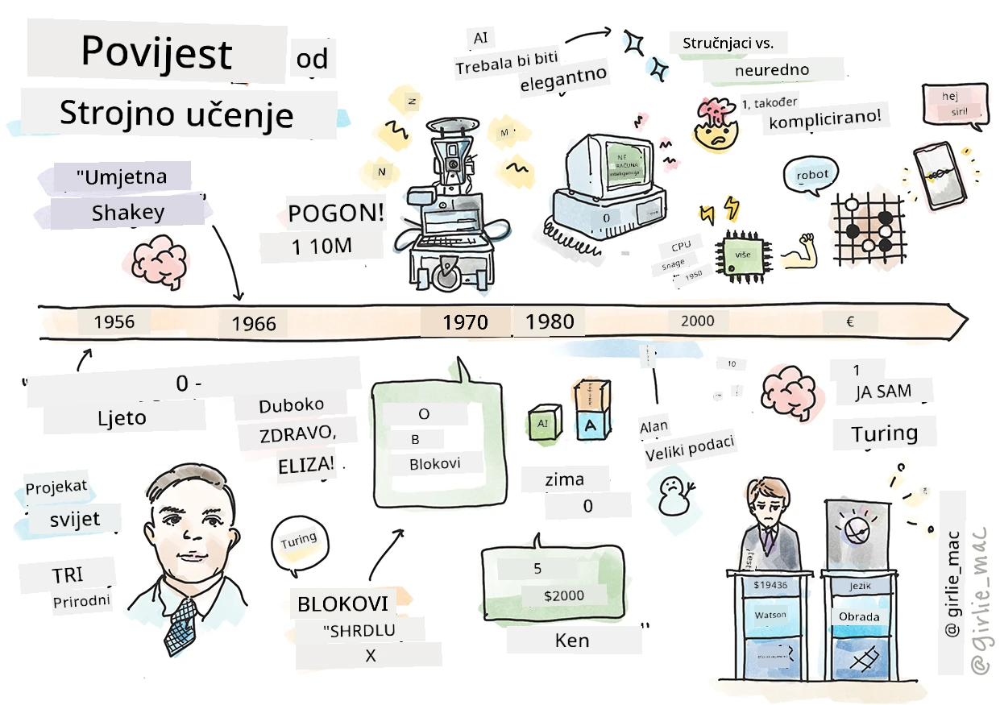
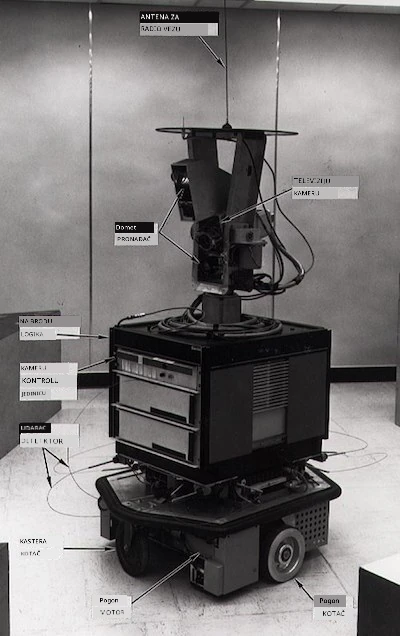
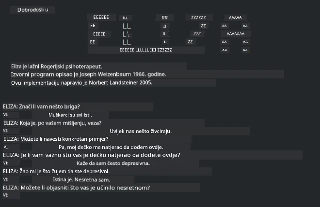

# Povijest strojnog učenja

> Sketchnote autora [Tomomi Imura](https://www.twitter.com/girlie_mac)

## [Kviza prije predavanja](https://ff-quizzes.netlify.app/en/ml/)

---

> 🎥 Kliknite na gornju sliku za kratak video kroz ovu lekciju.

U ovoj lekciji proći ćemo glavne prekretnice u povijesti strojnog učenja i umjetne inteligencije.

Povijest umjetne inteligencije (AI) kao područja isprepletena je s poviješću strojnog učenja, jer su algoritmi i računalni napretci koji podupiru ML doprinijeli razvoju AI. Korisno je zapamtiti da su, iako su ova područja kao zasebna polja počela dobivati oblik u 1950-ima, važna [algoritamska, statistička, matematička, računalna i tehnička otkrića](https://wikipedia.org/wiki/Timeline_of_machine_learning) prethodila i preklapala se s tim razdobljem. Zapravo, ljudi razmišljaju o ovim pitanjima već [stotinama godina](https://wikipedia.org/wiki/History_of_artificial_intelligence): ovaj članak raspravlja o povijesnim intelektualnim temeljnim idejama o 'mašini koja razmišlja.'

---
## Značajna otkrića

- 1763, 1812 [Bayesov teorem](https://wikipedia.org/wiki/Bayes%27_theorem) i njegovi prethodnici. Ovaj teorem i njegova primjena temelje inferenciju, opisujući vjerojatnost da se događaj dogodi na temelju prethodnog znanja.
- 1805 [Teorija najmanjih kvadrata](https://wikipedia.org/wiki/Least_squares) francuskog matematičara Adriena-Marie Legendrea. Ova teorija, o kojoj ćete učiti u našoj jedinici o regresiji, pomaže u prilagodbi podataka.
- 1913 [Markovljevi lanci](https://wikipedia.org/wiki/Markov_chain), nazvani po ruskom matematičaru Andreyu Markovu, koriste se za opisivanje niza mogućih događaja temeljenih na prethodnom stanju.
- 1957 [Perceptron](https://wikipedia.org/wiki/Perceptron) je vrsta linearnog klasifikatora kojeg je izumio američki psiholog Frank Rosenblatt i koji je temelj napretka u dubokom učenju.

---

- 1967 [Najbliži susjed](https://wikipedia.org/wiki/Nearest_neighbor) je algoritam izvorno dizajniran za mapiranje ruta. U kontekstu ML-a koristi se za otkrivanje obrazaca.
- 1970 [Unazadno širenje pogreške (Backpropagation)](https://wikipedia.org/wiki/Backpropagation) koristi se za treniranje [feedforward neuronskih mreža](https://wikipedia.org/wiki/Feedforward_neural_network).
- 1982 [Rekurentne neuronske mreže](https://wikipedia.org/wiki/Recurrent_neural_network) su umjetne neuronske mreže izvedene iz feedforward mreža koje stvaraju vremenske grafove.

✅ Malo istražite. Koji drugi datumi vam se čine ključnima u povijesti ML i AI?

---
## 1950: Strojevi koji razmišljaju

Alan Turing, zaista iznimna osoba koja je [2019. godine birana od javnosti](https://wikipedia.org/wiki/Icons:_The_Greatest_Person_of_the_20th_Century) za najvećeg znanstvenika 20. stoljeća, zaslužan je za postavljanje temelja koncepta 'stroja koji može razmišljati.' Suočio se s skepticima i svojom potrebom za empirijskim dokazima ovog koncepta djelomično stvarajući [Turingov test](https://www.bbc.com/news/technology-18475646), koji ćete istražiti u našim NLP lekcijama.

---
## 1956: Dartmouth ljetni istraživački projekt

"Dartmouth ljetni istraživački projekt o umjetnoj inteligenciji bio je presudan događaj za umjetnu inteligenciju kao polje," i ovdje je skovan termin 'umjetna inteligencija' ([izvor](https://250.dartmouth.edu/highlights/artificial-intelligence-ai-coined-dartmouth)).

> Svaki aspekt učenja ili bilo koja druga značajka inteligencije može se načelno tako precizno opisati da se može napraviti stroj koji to može simulirati.

---

Glavni istraživač, profesor matematike John McCarthy, nadao se "nastaviti na osnovi pretpostavke da se svaki aspekt učenja ili bilo koja druga značajka inteligencije načelno može tako precizno opisati da se može napraviti stroj koji to može simulirati." Među sudionicima je bio i Marvin Minsky, još jedna svjetla osoba u ovom polju.

Radionica se pripisuje za pokretanje i poticanje nekoliko rasprava uključujući "uspon simboličkih metoda, sustava usmjerenih na ograničena područja (rani stručni sustavi) te deduktivnih sustava nasuprot induktivnim sustavima." ([izvor](https://wikipedia.org/wiki/Dartmouth_workshop)).

---
## 1956 - 1974: "Zlatna godina"

Od 1950-ih do sredine 70-ih optimizam je bio velik u nadi da AI može riješiti mnoge probleme. Godine 1967. Marvin Minsky je samouvjereno izjavio da će "unutar jedne generacije ... problem stvaranja 'umjetne inteligencije' biti značajno riješen." (Minsky, Marvin (1967), Computation: Finite and Infinite Machines, Englewood Cliffs, N.J.: Prentice-Hall)

Istraživanje obrade prirodnog jezika je napredovalo, pretrage su se usavršile i postale moćnije, a stvoren je koncept 'mikrosvjetova', gdje su jednostavni zadaci obavljani pomoću uputa običnim jezikom.

---

Istraživanja su bila dobro financirana od strane državnih agencija, ostvareni su napreci u računanju i algoritmima, a izrađeni su prototipovi inteligentnih strojeva. Neki od tih strojeva su:

* [Shakey robot](https://wikipedia.org/wiki/Shakey_the_robot), koji je mogao manevrirati i odlučivati kako pametno obavljati zadatke.

    
    > Shakey 1972.

---

* Eliza, rani 'chatterbot', mogla je razgovarati s ljudima i služila kao primitivni 'terapeut'. Više o Elizi ćete naučiti u NLP lekcijama.

    
    > Verzija Elize, chatbot

---

* "Blocks world" bila je mikro-svijet u kojem su se blokovi mogli slagati i sortirati, a eksperimentiralo se u podučavanju strojeva donošenju odluka. Napreci ostvareni uz biblioteke poput [SHRDLU](https://wikipedia.org/wiki/SHRDLU) pomogli su u razvoju jezične obrade.

    

    > 🎥 Kliknite na gornju sliku za video: Blocks world with SHRDLU

---
## 1974 - 1980: "Zima AI-a"

Do sredine 1970-ih postalo je jasno da je složenost stvaranja 'inteligentnih strojeva' bila podcijenjena, a obećanja, s obzirom na dostupnu računalnu snagu, preuveličana. Financiranje je presušilo i povjerenje u polje je oslabilo. Neki problemi koji su utjecali na povjerenje bili su:
---
- **Ograničenja**. Računalna snaga je bila premala.
- **Kombinacijski eksplozija**. Broj parametara koje je trebalo trenirati rastao je eksponencijalno kako su računala morala rješavati više zadataka, bez paralelnog razvoja računalne snage i sposobnosti.
- **Nedostatak podataka**. Nedostatak podataka otežavao je proces testiranja, razvoja i usavršavanja algoritama.
- **Postavljamo li prava pitanja?**. Sama pitanja koja su postavljana počela su se dovoditi u pitanje. Istraživači su dobili kritike zbog svojih pristupa:
  - Turingovi testovi su dovedeni u pitanje, između ostalog, teorijom 'kineske sobe' koja tvrdi da "programiranje digitalnog računala može izgledati kao da razumije jezik, ali ne može proizvesti stvarno razumijevanje." ([izvor](https://plato.stanford.edu/entries/chinese-room/))
  - Etičnost uvođenja umjetnih inteligencija poput "terapeuta" ELIZE u društvo je izazvana.

---

U isto vrijeme, različite škole mišljenja o AI počele su se formirati. Utvrđena je dihotomija između ["nereda" i "uredne AI"](https://wikipedia.org/wiki/Neats_and_scruffies) praksi. _Neredni_ laboratoriji prilagođavali su programe satima dok nisu postigli željene rezultate. _Uredni_ laboratoriji su se "fokusirali na logiku i formalno rješavanje problema". ELIZA i SHRDLU bili su poznati _neredni_ sustavi. Tijekom 1980-ih, s potrebom da ML sustavi postanu reproducibilni, _uredni_ pristup je postupno preuzeo primat jer su njegovi rezultati jasniji za objašnjenje.

---
## 1980-te Ekspertni sustavi

Kako je polje raslo, jasnoća koristi za poslovanje postala je vidljivija, a u 1980-ima i širenje 'ekspertnih sustava'. "Ekspertni sustavi bili su među prvima uistinu uspješnim oblicima softvera umjetne inteligencije (AI)." ([izvor](https://wikipedia.org/wiki/Expert_system)).

Ovaj tip sustava zapravo je _hibridan_, dijelom se sastoji od pravila koja definiraju poslovne zahtjeve i inferencijskog motora koji koristi sustav pravila za izvođenje novih zaključaka.

U to je vrijeme također porasla pažnja prema neuronskim mrežama.

---
## 1987 - 1993: AI 'zatišje'

Proširenje specijaliziranog hardvera za ekspertne sustave imalo je nesretan učinak prevelike specijalizacije. Rastuća popularnost osobnih računala natjecala se s ovim velikim, specijaliziranim, centraliziranim sustavima. Demokracija računarstva započela je i otvorila put za modernu eksploziju velikih podataka.

---
## 1993 - 2011

Ovo je razdoblje donijelo novu eru za ML i AI da mogu riješiti neke probleme koji su ranije nastali zbog nedostatka podataka i računalne snage. Količina podataka počela je brzo rasti i postati široko dostupna, za bolje i za gore, posebno s pojavom pametnih telefona oko 2007. Računalna snaga rasla je eksponencijalno, a algoritmi su se zajedno razvijali. Polje je počelo stjecati zrelost dok su se slobodni dani prošlosti počeli oblikovati u pravu disciplinu.

---
## Sada

Danas strojno učenje i AI dodiruju gotovo svaki dio naših života. Ovo razdoblje zahtijeva pažljivo razumijevanje rizika i potencijalnih učinaka ovih algoritama na ljudske živote. Kako je rekao Brad Smith iz Microsofta, "Informacijska tehnologija postavlja pitanja koja se tiču temeljnih ljudskih prava poput privatnosti i slobode izražavanja. Ta pitanja povećavaju odgovornost tehnoloških kompanija koje stvaraju te proizvode. Po našem mišljenju, također zahtijevaju promišljenu državnu regulaciju i razvoj normi o prihvatljivoj uporabi" ([izvor](https://www.technologyreview.com/2019/12/18/102365/the-future-of-ais-impact-on-society/)).

---

Još uvijek ostaje za vidjeti što budućnost donosi, ali važno je razumjeti ove računalne sustave i softver i algoritme koje pokreću. Nadamo se da će vam ovaj kurikulum pomoći da steknete bolje razumijevanje kako biste mogli sami odlučiti.

> 🎥 Kliknite na gornju sliku za video: Yann LeCun raspravlja o povijesti dubokog učenja u ovom predavanju

---
## 🚀Izazov

Zaronite u jedan od ovih povijesnih trenutaka i saznajte više o ljudima iza njih. Postoje fascinantni likovi, a nijedno znanstveno otkriće nikada nije nastalo u kulturnom vakuumu. Što otkrivate?

## [Kviza nakon predavanja](https://ff-quizzes.netlify.app/en/ml/)

---
## Pregled i samostalno učenje

Evo stavki koje treba pogledati i poslušati:

[Podcast u kojem Amy Boyd raspravlja o evoluciji AI](http://runasradio.com/Shows/Show/739)

---

## Zadatak

[Napravite vremensku crtu](assignment.md)

---

<!-- CO-OP TRANSLATOR DISCLAIMER START -->
**Napomena**:
Ovaj dokument je preveden korištenjem AI prevoditeljskog servisa [Co-op Translator](https://github.com/Azure/co-op-translator). Iako težimo točnosti, imajte na umu da automatski prijevodi mogu sadržavati greške ili netočnosti. Izvorni dokument na izvornom jeziku treba smatrati autoritativnim izvorom. Za važne informacije preporuča se profesionalni ljudski prijevod. Nismo odgovorni za bilo kakva nesporazumevanja ili pogrešne interpretacije koje proizlaze iz korištenja ovog prijevoda.
<!-- CO-OP TRANSLATOR DISCLAIMER END -->