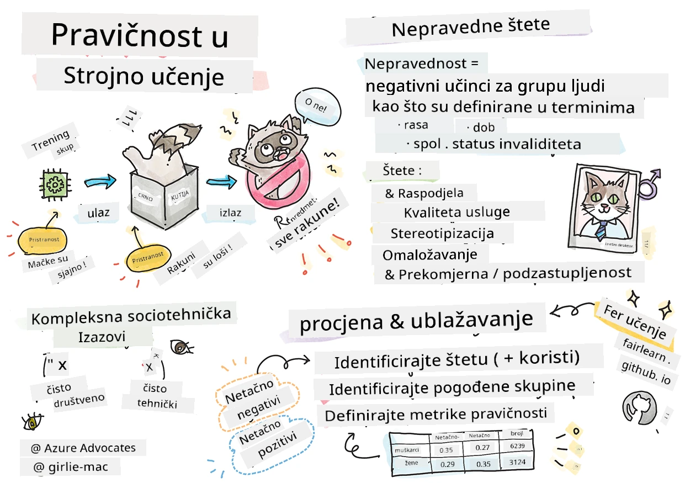
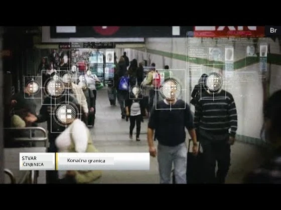

# Izgradnja rješenja strojnog učenja s odgovornim AI-jem
 

> Sketchnote autorice [Tomomi Imura](https://www.twitter.com/girlie_mac)

## [Kviz prije predavanja](https://ff-quizzes.netlify.app/en/ml/)
 
## Uvod

U ovom nastavnom programu počet ćete otkrivati kako strojno učenje može utjecati i utječe na naše svakodnevne živote. Čak i sada, sustavi i modeli sudjeluju u svakodnevnim odlukama, poput medicinskih dijagnoza, odobravanja kredita ili otkrivanja prijevara. Stoga je važno da ti modeli dobro funkcioniraju kako bi pružili rezultate koji su pouzdani. Baš kao i svaka softverska aplikacija, AI sustavi mogu razočarati ili imati neželjeni ishod. Zato je bitno razumjeti i objasniti ponašanje AI modela.

Zamislite što se može dogoditi kada podaci koje koristite za izradu tih modela nedostaju određenih demografskih skupina, poput rase, spola, političkog stava, religije, ili ako takve skupine neproporcionalno zastupaju. Što ako se izlaz modela tumaci u korist neke demografske skupine? Koja je posljedica za aplikaciju? Nadalje, što se događa kada model ima neželjeni ishod i štetan je za ljude? Tko je odgovoran za ponašanje AI sustava? To su neka od pitanja koja ćemo istražiti u ovom nastavnom programu.

U ovom ćete satu:

- Povećati svoju svijest o važnosti pravičnosti u strojnog učenja i štetama povezanim s pravičnošću.
- Upoznati se s praksom istraživanja odstupanja i neuobičajenih scenarija kako bi se osigurala pouzdanost i sigurnost
- Steći razumijevanje potrebe za osnaživanjem svih kroz dizajniranje inkluzivnih sustava
- Istražiti koliko je vitalno zaštititi privatnost i sigurnost podataka i ljudi
- Vidjeti važnost pristupa "staklene kutije" za objašnjavanje ponašanja AI modela
- Biti svjestan kako je odgovornost ključna za izgradnju povjerenja u AI sustave

## Preduvjet

Kao preduvjet, molimo da prođete "Principi odgovornog AI-ja" učenja i pogledate video u nastavku o toj temi:

Saznajte više o odgovornom AI-ju slijedeći ovaj [Učni put](https://docs.microsoft.com/learn/modules/responsible-ai-principles/?WT.mc_id=academic-77952-leestott)

> 🎥 Kliknite sliku gore za video: Microsoftov pristup odgovornom AI-ju

## Pravičnost

AI sustavi trebaju prema svima postupati pravično i izbjegavati utjecaj na slične skupine ljudi na različite načine. Na primjer, kada AI sustavi daju smjernice o medicinskom liječenju, zahtjevima za kredit ili zaposlenje, trebaju davati iste preporuke svima sa sličnim simptomima, financijskim okolnostima ili stručnim kvalifikacijama. Svaki od nas kao ljudi nosi naslijeđene pristranosti koje utječu na naše odluke i postupke. Te se pristranosti mogu očitovati u podacima koje koristimo za školovanje AI sustava. Takva manipulacija ponekad se događa i nenamjerno. Često je teško svjesno znati kada uvodite pristranost u podatke.

**"Nepravednost"** obuhvaća negativne utjecaje ili "štete" za skupinu ljudi, kao što su one definirane prema rasi, spolu, dobi ili statusu invalidnosti. Glavne štete povezane s pravičnošću mogu se klasificirati kao:

- **Dodjela**, ako se primjerice favorizira neki spol ili etnička skupina u odnosu na drugu.
- **Kvaliteta usluge**. Ako ste obrađivali podatke za jedan određeni scenarij, ali je stvarnost puno složenija, to vodi do slabog kvalitativnog pružanja usluge. Na primjer, dozator sapuna koji nije mogao prepoznati ljude s tamnom puti. [Referenca](https://gizmodo.com/why-cant-this-soap-dispenser-identify-dark-skin-1797931773)
- **Ocrnjivanje**. Nepravedno kritizirati i etiketirati nešto ili nekoga. Na primjer, tehnologija za označavanje slika zloglasno je pogrešno označila slike tamnoputih ljudi kao gorile.
- **Prevelika ili premala zastupljenost**. Ideja je da neka skupina nije vidljiva u određenoj profesiji, i bilo koja usluga ili funkcija koja to nastavlja promovirati pridonosi šteti.
- **Stereotipiziranje**. Povezivanje određene skupine s unaprijed dodijeljenim atributima. Na primjer, sustav za prevođenje između engleskog i turskog može imati netočnosti zbog riječi s stereotipnim povezivanjem s polom.

> prijevod na turski

> prijevod natrag na engleski

Prilikom dizajniranja i testiranja AI sustava trebamo osigurati da AI bude pravičan i da nije programiran za donošenje pristranih ili diskriminirajućih odluka, što je ljudima također zabranjeno. Jamčenje pravičnosti u AI-ju i strojnog učenja i dalje je složen sociotehnički izazov.

### Pouzdanost i sigurnost

Da bi izgradili povjerenje, AI sustavi trebaju biti pouzdani, sigurni i dosljedni u normalnim i neočekivanim uvjetima. Važno je znati kako će se AI sustavi ponašati u različitim situacijama, posebno u slučaju odstupanja. Prilikom izrade AI rješenja potrebno je posvetiti značajnu pažnju načinu rukovanja širokim spektrom okolnosti s kojima se AI rješenja mogu susresti. Na primjer, autonomni automobil mora sigurnost ljudi staviti na prvo mjesto. Kao rezultat, AI koji pokreće automobil mora uzeti u obzir sve moguće scenarije na koje bi automobil mogao naići, poput noći, oluja ili mećava, djece koja prelaze cestu, kućnih ljubimaca, cestovnih radova itd. Koliko dobro AI sustav može pouzdano i sigurno upravljati širokim rasponom uvjeta odražava razinu anticipacije koju je znanstvenik podataka ili AI programer imao tijekom dizajna ili testiranja sustava.

> [🎥 Kliknite ovdje za video: ](https://www.microsoft.com/videoplayer/embed/RE4vvIl)

### Uključivost

AI sustavi trebaju biti dizajnirani tako da uključuju i osnažuju svakoga. Prilikom dizajniranja i implementacije AI sustava znanstvenici podataka i AI programeri prepoznaju i uklanjaju potencijalne prepreke u sustavu koje bi nenamjerno mogle isključiti ljude. Na primjer, oko milijardu ljudi u svijetu ima invaliditet. S napretkom AI-ja oni mogu lakše pristupiti širokom rasponu informacija i prilika u svakodnevnom životu. Uklanjanjem prepreka stvara se prilika za inovacije i razvoj AI proizvoda s boljim iskustvima od kojih svi imaju koristi.

> [🎥 Kliknite ovdje za video: uključivost u AI](https://www.microsoft.com/videoplayer/embed/RE4vl9v)

### Sigurnost i privatnost

AI sustavi trebaju biti sigurni i poštivati privatnost ljudi. Ljudi manje vjeruju sustavima koji ugrožavaju njihovu privatnost, informacije ili živote. Prilikom treniranja modela strojnog učenja oslanjamo se na podatke kako bismo proizveli najbolje rezultate. Pri tome treba uzeti u obzir porijeklo podataka i njihovu cjelovitost. Na primjer, jesu li podaci koje je korisnik dostavio ili su javno dostupni? Nadalje, tijekom rada s podacima bitno je razviti AI sustave koji mogu zaštititi povjerljive informacije i odoljeti napadima. Kako AI postaje sve češći, zaštita privatnosti i sigurnost važnih osobnih i poslovnih podataka postaju kritičniji i složeniji. Pitanja privatnosti i sigurnosti podataka zahtijevaju posebno pomnu pažnju u AI-ju jer je pristup podacima ključan za točno i informirano predviđanje i donošenje odluka o ljudima.

> [🎥 Kliknite ovdje za video: sigurnost u AI-ju](https://www.microsoft.com/videoplayer/embed/RE4voJF)

- Kao industrija postigli smo značajan napredak u privatnosti i sigurnosti, što je uvelike potaknuto regulativama poput GDPR-a (Opća uredba o zaštiti podataka).
- Ipak, kod AI sustava moramo priznati napetost između potrebe za više osobnih podataka kako bi sustavi bili osobniji i učinkovitiji – i privatnosti.
- Kao i kod pojave povezanih računala s internetom, vidimo i veliki porast sigurnosnih problema vezanih za AI.
- Istodobno, vidi se da se AI koristi za poboljšanje sigurnosti. Na primjer, većina modernih antivirusnih skenera danas se temelji na AI heuristikama.
- Trebamo osigurati da naši procesi znanosti o podacima skladno prate najnovije prakse privatnosti i sigurnosti.

### Transparentnost
AI sustavi trebaju biti razumljivi. Ključni dio transparentnosti je objašnjavanje ponašanja AI sustava i njihovih komponenti. Poboljšanje razumijevanja AI sustava zahtijeva da dionici shvate kako i zašto oni funkcioniraju kako bi mogli identificirati potencijalne probleme performansi, zabrinutosti oko sigurnosti i privatnosti, pristranosti, isključujuće prakse ili neželjene ishode. Također smatramo da oni koji koriste AI sustave trebaju biti iskreni i otvoreni o tome kada, zašto i kako odlučuju koristiti te sustave. Kao i o ograničenjima sustava koje koriste. Na primjer, ako banka koristi AI sustav za podršku odlukama o kreditiranju potrošača, važno je pregledati rezultate i razumjeti koji podaci utječu na preporuke sustava. Vlade počinju regulirati AI u svim industrijama, pa znanstvenici podataka i organizacije moraju objasniti zadovoljava li AI sustav regulatorne zahtjeve, posebno kada postoji neželjeni ishod.

> [🎥 Kliknite ovdje za video: transparentnost u AI-ju](https://www.microsoft.com/videoplayer/embed/RE4voJF)

- Budući da su AI sustavi vrlo složeni, teško je razumjeti kako funkcioniraju i protumačiti rezultate.
- Taj nedostatak razumijevanja utječe na način na koji se ti sustavi upravljaju, operacionaliziraju i dokumentiraju.
- Još važnije, taj nedostatak razumijevanja utječe na odluke koje se donose koristeći rezultate koje ti sustavi proizvode.

### Odgovornost
 
Osobe koje dizajniraju i implementiraju AI sustave moraju biti odgovorne za njihovo funkcioniranje. Potreba za odgovornošću posebno je važna kod osjetljivih tehnologija poput prepoznavanja lica. Nedavno raste potražnja za tehnologijom prepoznavanja lica, osobito od strane policijskih organa koji uviđaju potencijal tehnologije u primjeni poput pronalaska nestale djece. Međutim, te se tehnologije potencijalno mogu koristiti od strane vlade da ugroze temeljna građanska prava, na primjer omogućavanjem kontinuiranog nadzora određenih osoba. Stoga znanstvenici podataka i organizacije moraju biti odgovorni za utjecaj svog AI sustava na pojedince ili društvo.

> 🎥 Kliknite sliku gore za video: Upozorenja o masovnom nadzoru putem prepoznavanja lica

U konačnici, jedno od najvećih pitanja za naše generacije, kao prve generacije koje donose AI društvu, jest kako osigurati da računala ostanu odgovorna ljudima i kako osigurati da ljudi koji dizajniraju računala ostanu odgovorni svima ostalima.

## Procjena utjecaja

Prije treniranja modela strojnog učenja važno je provesti procjenu utjecaja kako bi se razumjela svrha AI sustava; čemu je namijenjen; gdje će se koristiti; i tko će komunicirati sa sustavom. To pomaže pregledavateljima ili testerima u procjeni na što treba obratiti pažnju pri identificiranju potencijalnih rizika i očekivanih posljedica.

Sljedeća područja su fokus pri provođenju procjene utjecaja:

* **Neželjeni utjecaj na pojedince**. Svijest o bilo kakvim ograničenjima ili zahtjevima, nepodržanoj uporabi ili poznatim ograničenjima koja ometaju učinkovitost sustava ključna je da se sustav ne koristi na način koji bi mogao štetiti pojedincima.
* **Zahtjevi za podatke**. Razumijevanje kako i gdje će sustav koristiti podatke omogućuje pregledavateljima da prouče moguće zahtjeve za podatke kojima treba obratiti pozornost (npr., GDPR ili HIPAA regulative o podacima). Također, treba razmotriti je li izvor ili količina podataka dovoljna za treniranje.
* **Sažetak utjecaja**. Prikupiti popis potencijalnih šteta koje mogu proizaći iz korištenja sustava. Tijekom životnog ciklusa ML-a redovito se provjerava jesu li identificirani problemi ublaženi ili riješeni.
* **Primjenjivi ciljevi** za svaki od šest osnovnih principa. Procijeniti zadovoljavaju li se ciljevi svakog principa i postoje li praznine.

## Debugging s odgovornim AI-jem

Slično kao debugiranje softverske aplikacije, debugiranje AI sustava je potreban proces identificiranja i rješavanja problema u sustavu. Puno je čimbenika koji mogu utjecati na to da model ne radi prema očekivanjima ili nije odgovoran. Većina tradicionalnih metričkih pokazatelja performansi modela su kvantitativni zbrojevi učinkovitosti modela, koji nisu dovoljni za analizu kako model krši principe odgovornog AI-ja. Nadalje, model strojnog učenja je crna kutija što otežava razumijevanje što pokreće njegov ishod ili pruža objašnjenje kada pogriješi. Kasnije u ovom tečaju naučit ćemo kako koristiti Responsible AI nadzornu ploču za pomoć u debugiranju AI sustava. Nadzorna ploča pruža holistički alat za znanstvenike podataka i AI programere za izvođenje:

* **Analize pogrešaka**. Za identifikaciju raspodjele pogrešaka modela koje mogu utjecati na pravičnost ili pouzdanost sustava.
* **Pregled modela**. Za otkrivanje razlika u učinkovitosti modela među skupinama podataka.
* **Analizu podataka**. Za razumijevanje raspodjele podataka i identifikaciju potencijalnih pristranosti u podacima koje bi mogle dovesti do problema pravičnosti, uključivosti i pouzdanosti.
* **Interpretabilnost modela**. Za razumijevanje što utječe ili oblikuje predviđanja modela. Ovo pomaže pri objašnjavanju ponašanja modela što je važno za transparentnost i odgovornost.

## 🚀 Izazov
 
Da bismo spriječili da se štete uopće jave, trebali bismo:

- imati različita podrijetla i perspektive među ljudima koji rade na sustavima
- ulagati u skupove podataka koji odražavaju raznolikost našeg društva
- razvijati bolje metode kroz životni ciklus strojnog učenja za otkrivanje i ispravljanje odgovornog AI-ja kad se pojavi

Razmislite o stvarnim scenarijima gdje nepouzdanost modela postaje očita u izgradnji i korištenju modela. Što još bismo trebali uzeti u obzir?

## [Kviz nakon predavanja](https://ff-quizzes.netlify.app/en/ml/)

## Pregled i samostalno učenje
 

U ovoj lekciji naučili ste osnove pojmova pravednosti i nepravednosti u strojnome učenju.  
 
Pogledajte ovaj radionicu za dublje razumijevanje tema: 

- U potrazi za odgovornom umjetnom inteligencijom: Primjena principa u praksi by Besmira Nushi, Mehrnoosh Sameki i Amit Sharma

> 🎥 Kliknite na gornju sliku za video: RAI Toolbox: Otvoreni okvir za izgradnju odgovorne umjetne inteligencije by Besmira Nushi, Mehrnoosh Sameki i Amit Sharma

Također, pročitajte: 

- Microsoftov centar resursa za odgovornu umjetnu inteligenciju: [Responsible AI Resources – Microsoft AI](https://www.microsoft.com/ai/responsible-ai-resources?activetab=pivot1%3aprimaryr4) 

- Microsoftova istraživačka grupa FATE: [FATE: Poštenje, Odgovornost, Transparentnost i Etika u AI - Microsoft Research](https://www.microsoft.com/research/theme/fate/) 

RAI Toolbox: 

- [Responsible AI Toolbox GitHub repozitorij](https://github.com/microsoft/responsible-ai-toolbox)

Pročitajte o alatima Azure Machine Learninga za osiguranje pravednosti:

- [Azure Machine Learning](https://docs.microsoft.com/azure/machine-learning/concept-fairness-ml?WT.mc_id=academic-77952-leestott) 

## Zadatak

[Istražite RAI Toolbox](assignment.md)

---

<!-- CO-OP TRANSLATOR DISCLAIMER START -->
**Napomena**:
Ovaj dokument je preveden korištenjem AI prevoditeljskog servisa [Co-op Translator](https://github.com/Azure/co-op-translator). Iako težimo točnosti, imajte na umu da automatski prijevodi mogu sadržavati greške ili netočnosti. Izvorni dokument na izvornom jeziku treba smatrati autoritativnim izvorom. Za važne informacije preporuča se profesionalni ljudski prijevod. Nismo odgovorni za bilo kakva nesporazumevanja ili pogrešne interpretacije koje proizlaze iz korištenja ovog prijevoda.
<!-- CO-OP TRANSLATOR DISCLAIMER END -->