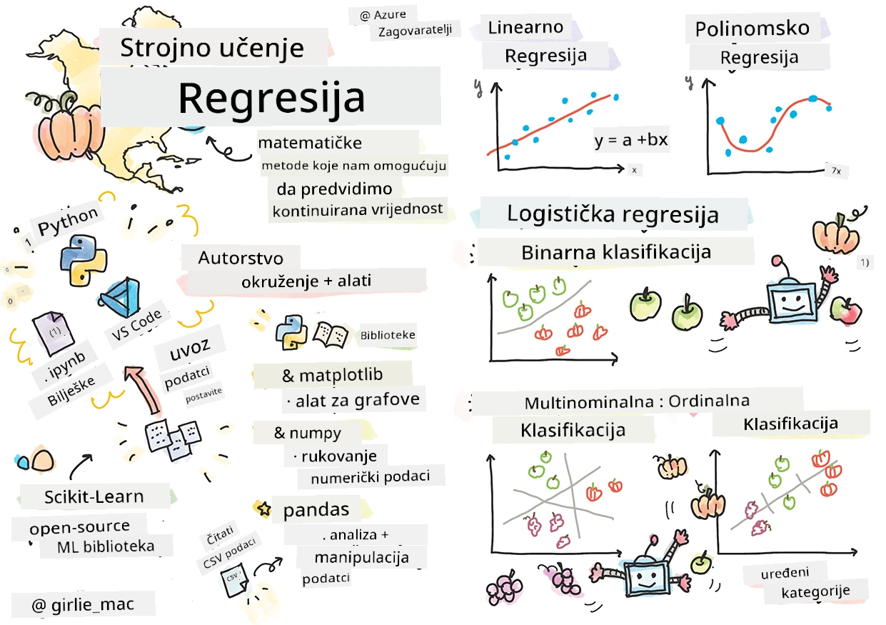
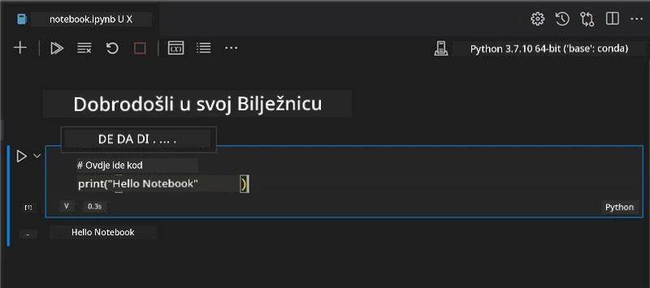
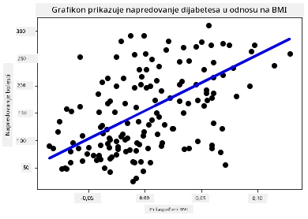

# Počnite s Pythonom i Scikit-learn za modele regresije



> Sketchnote autora [Tomomi Imura](https://www.twitter.com/girlie_mac)

## [Pre-lecture kviz](https://ff-quizzes.netlify.app/en/ml/)

> ### [Ova lekcija je dostupna na R!](../../../../2-Regression/1-Tools/solution/R/lesson_1.html)

## Uvod

U ove četiri lekcije otkrit ćete kako izgraditi regresijske modele. Uskoro ćemo razgovarati čemu oni služe. No prije nego što išta napravite, pobrinite se da imate odgovarajuće alate za početak procesa!

U ovoj lekciji naučit ćete kako:

- Konfigurirati svoje računalo za lokalne zadatke strojnog učenja.
- Raditi s Jupyter Notebookovima.
- Koristiti Scikit-learn, uključujući instalaciju.
- Istražiti linearnu regresiju kroz praktičnu vježbu.

## Instalacije i konfiguracije

[](https://youtu.be/-DfeD2k2Kj0 "ML za početnike - Postavite svoje alate spremne za izgradnju modela strojnog učenja")

> 🎥 Kliknite na gornju sliku za kratak video o konfiguriranju računala za ML.

1. **Instalirajte Python**. Provjerite je li [Python](https://www.python.org/downloads/) instaliran na vašem računalu. Python ćete koristiti za mnoge zadatke iz znanosti o podacima i strojnog učenja. Većina računarskih sustava već ima instaliran Python. Tu su i korisni [Python Coding Packovi](https://code.visualstudio.com/learn/educators/installers?WT.mc_id=academic-77952-leestott) koji mogu olakšati postavljanje nekim korisnicima.

   Međutim, neke primjene Pythona zahtijevaju određenu verziju softvera, dok druge zahtijevaju drugu verziju. Zbog toga je korisno raditi unutar [virtualnog okruženja](https://docs.python.org/3/library/venv.html).

2. **Instalirajte Visual Studio Code**. Pobrinite se da imate instaliran Visual Studio Code na računalu. Slijedite ove upute za [instalaciju Visual Studio Code](https://code.visualstudio.com/) za osnovnu instalaciju. U ovom ćete tečaju koristiti Python u Visual Studio Code-u, pa bi bilo korisno da se upoznate kako [konfigurirati Visual Studio Code](https://docs.microsoft.com/learn/modules/python-install-vscode?WT.mc_id=academic-77952-leestott) za razvoj u Pythonu.

   > Udobno se upoznajte s Pythonom radeći kroz ovu zbirku [Learn modula](https://docs.microsoft.com/users/jenlooper-2911/collections/mp1pagggd5qrq7?WT.mc_id=academic-77952-leestott)
   >
   > [](https://youtu.be/yyQM70vi7V8 "Postavljanje Pythona s Visual Studio Code")
   >
   > 🎥 Kliknite na gornju sliku za video: korištenje Pythona unutar VS Code.

3. **Instalirajte Scikit-learn** prema [ovim uputama](https://scikit-learn.org/stable/install.html). Budući da morate koristiti Python 3, preporučuje se rad u virtualnom okruženju. Ako instalirate ovu biblioteku na M1 Mac, postoje posebne upute na gore povezanom linku.

1. **Instalirajte Jupyter Notebook**. Trebat ćete [instalirati Jupyter paket](https://pypi.org/project/jupyter/).

## Vaše razvojno okruženje za ML

Koristit ćete **notebookove** za razvoj vašeg Python koda i kreiranje modela strojnog učenja. Ova vrsta datoteke je uobičajeni alat za znanstvenike podataka, a može se prepoznati po nastavku `.ipynb`.

Notebookovi su interaktivno okruženje koje omogućuje programeru da istovremeno piše kod i dodaje bilješke i dokumentaciju oko koda, što je vrlo korisno za eksperimentalne ili istraživačke projekte.

[](https://youtu.be/7E-jC8FLA2E "ML za početnike - Postavite Jupyter Notebookove za početak izgradnje regresijskih modela")

> 🎥 Kliknite na gornju sliku za kratak video vezano uz ovu vježbu.

### Vježba - rad s notebookom

U ovoj mapi pronaći ćete datoteku _notebook.ipynb_.

1. Otvorite _notebook.ipynb_ u Visual Studio Code.

   Pokrenut će se Jupyter server s Pythonom 3+. Naći ćete dijelove notebooka koje možete `pokrenuti`, odnosno zasebne dijelove koda. Kodni blok možete pokrenuti klikom na ikonu koja izgleda kao tipka play.

1. Odaberite ikonu `md` i dodajte malo markdown teksta, a zatim unesite sljedeći tekst: **# Dobrodošli u svoj notebook**.

   Sljedeće, dodajte malo Python koda.

1. Upišite **print('hello notebook')** u kodni blok.
1. Kliknite strelicu za pokretanje koda.

   Trebali biste vidjeti ispisanu izjavu:

    ```output
    hello notebook
    ```



Kod možete isprekidati komentarima kako biste sami dokumentirali notebook.

✅ Razmislite na trenutak koliko se radno okruženje web developera razlikuje od onog znanstvenika podataka.

## Pokretanje sa Scikit-learn

Sada kada je Python postavljen u vašem lokalnom okruženju i kada ste upoznati s Jupyter Notebookovima, upoznajmo se i sa Scikit-learnom (izgovara se `sci` kao u riječi `znanost`). Scikit-learn nudi [opširan API](https://scikit-learn.org/stable/modules/classes.html#api-ref) koji vam pomaže u izvođenju zadataka strojnog učenja.

Prema njihovoj [web stranici](https://scikit-learn.org/stable/getting_started.html), "Scikit-learn je biblioteka strojnog učenja otvorenog koda koja podržava nadzirano i nenadzirano učenje. Također pruža različite alate za prilagođavanje modela, prethodnu obradu podataka, izbor i evaluaciju modela te mnoge druge korisnosti."

U ovom tečaju koristiti ćete Scikit-learn i druge alate za izgradnju modela strojnog učenja za ono što zovemo 'tradicionalni zadaci strojnog učenja'. Namjerno smo izbjegli neuronske mreže i duboko učenje jer su bolje obrađeni u našem nadolazećem kurikulumu 'AI za početnike'.

Scikit-learn olakšava izgradnju i evaluaciju modela za upotrebu. Primarno je fokusiran na numeričke podatke i sadrži nekoliko gotovih datasetova za učenje. Uključuje i unaprijed izgrađene modele koje studenti mogu isprobati. Istražimo proces učitavanja prethodno pripremljenih podataka i korištenje ugrađenog estimator - prvog ML modela sa Scikit-lernom s osnovnim podacima.

## Vježba - vaš prvi Scikit-learn notebook

> Ovaj je vodič inspiriran [primjerom linearne regresije](https://scikit-learn.org/stable/auto_examples/linear_model/plot_ols.html#sphx-glr-auto-examples-linear-model-plot-ols-py) na Scikit-learn web stranici.


[](https://youtu.be/2xkXL5EUpS0 "ML za početnike - Vaš prvi projekt linearne regresije u Pythonu")

> 🎥 Kliknite na gornju sliku za kratak video vezano uz ovu vježbu.

U datoteci _notebook.ipynb_ povezanoj s ovom lekcijom, očistite sve ćelije pritiskom na ikonu 'kanta za smeće'.

U ovom dijelu ćete raditi s malim datasetom o dijabetesu koji je ugrađen u Scikit-learn za svrhe učenja. Zamislite da želite ispitati liječenje za dijabetičke pacijente. Modeli strojnog učenja mogli bi vam pomoći odrediti koji bi pacijenti bolje reagirali na liječenje, na temelju kombinacija varijabli. Čak i vrlo osnovni regresijski model, kada se vizualizira, može pokazati informacije o varijablama koje bi vam pomogle organizirati vaše teoretske kliničke studije.

✅ Postoji mnogo vrsta regresijskih metoda, a koju ćete odabrati ovisi o pitanju na koje želite odgovoriti. Ako želite predvidjeti vjerojatnu visinu za osobu određene dobi, koristili biste linearnu regresiju jer tražite **numeričku vrijednost**. Ako ste zainteresirani otkriti treba li neki tip kuhinje smatrati veganskim ili ne, tražite **kategorizaciju**, pa biste koristili logističku regresiju. O logističkoj regresiji ćete kasnije naučiti više. Razmislite malo o nekim pitanjima koja možete postaviti podacima i koja bi metoda od njih bila prikladnija.

Krenimo s ovim zadatkom.

### Uvezite biblioteke

Za ovaj zadatak uvest ćemo neke biblioteke:

- **matplotlib**. Koristan je [alat za grafove](https://matplotlib.org/) i koristit ćemo ga za crtanje linijskog grafikona.
- **numpy**. [numpy](https://numpy.org/doc/stable/user/whatisnumpy.html) je korisna biblioteka za rukovanje numeričkim podacima u Pythonu.
- **sklearn**. Ovo je biblioteka [Scikit-learn](https://scikit-learn.org/stable/user_guide.html).

Uvezite neke biblioteke koje će vam pomoći u zadacima.

1. Dodajte uvoze upisujući sljedeći kod:

   ```python
   import matplotlib.pyplot as plt
   import numpy as np
   from sklearn import datasets, linear_model, model_selection
   ```

   Gore uvozite `matplotlib`, `numpy` te uvozite `datasets`, `linear_model` i `model_selection` iz `sklearn`. `model_selection` se koristi za dijeljenje podataka na trening i test skupove.

### Dataset o dijabetesu

Ugrađeni [diabetes dataset](https://scikit-learn.org/stable/datasets/toy_dataset.html#diabetes-dataset) uključuje 442 uzorka podataka o dijabetesu, s 10 značajki, od kojih su neke:

- starost: starost u godinama
- bmi: indeks tjelesne mase
- bp: prosječni krvni tlak
- s1 tc: T-ćelije (vrsta bijelih krvnih stanica)

✅ Ovaj dataset uključuje koncept 'spola' kao važnu značajku za istraživanje dijabetesa. Mnogi medicinski datasetovi uključuju ovaj tip binarne klasifikacije. Razmislite malo o tome kako takve kategorizacije mogu isključiti određene dijelove populacije iz liječenja.

Sada učitajte X i y podatke.

> 🎓 Zapamtite, ovo je nadzirano učenje i potreban nam je nazvani cilj 'y'.

U novoj ćeliji za kod učitajte dataset o dijabetesu pozivajući `load_diabetes()`. Ulaz `return_X_y=True` označava da će `X` biti matrica podataka, a `y` cilj regresije.

1. Dodajte naredbe za ispis da pokažete dimenzije matrice podataka i njen prvi element:

    ```python
    X, y = datasets.load_diabetes(return_X_y=True)
    print(X.shape)
    print(X[0])
    ```

    Ono što dobivate kao odgovor je tuple. Ono što radite jest da prve dvije vrijednosti tupla dodjeljujete `X` i `y` redom. Saznajte više [o tupleima](https://wikipedia.org/wiki/Tuple).

    Možete vidjeti da ovaj dataset ima 442 stavke oblikovane u nizove od 10 elemenata:

    ```text
    (442, 10)
    [ 0.03807591  0.05068012  0.06169621  0.02187235 -0.0442235  -0.03482076
    -0.04340085 -0.00259226  0.01990842 -0.01764613]
    ```

    ✅ Razmislite malo o odnosu između podataka i cilja regresije. Linearna regresija predviđa odnose između značajke X i ciljane varijable y. Možete li pronaći [cilj](https://scikit-learn.org/stable/datasets/toy_dataset.html#diabetes-dataset) za diabetes dataset u dokumentaciji? Što ovaj dataset demonstrira, s obzirom na cilj?

2. Zatim, odaberite dio ovog dataseta za iscrtavanje birajući 3. stupac dataseta. To možete napraviti korištenjem operatora `:` za odabir svih redaka, a zatim odabirom 3. stupca s indeksom (2). Također možete promijeniti oblik podataka u 2D niz - kako je potrebno za crtanje - korištenjem `reshape(broj_redaka, broj_stupaca)`. Ako je jedan od parametara -1, odgovarajuća dimenzija se automatski izračunava.

   ```python
   X = X[:, 2]
   X = X.reshape((-1,1))
   ```

   ✅ U bilo kojem trenutku, ispišite podatke da provjerite njihov oblik.

3. Sada kada imate podatke spremne za crtanje, možete vidjeti može li vam stroj pomoći da odredite logičku granicu između brojeva u ovom datasetu. Da biste to učinili, morate podijeliti i podatke (X) i ciljeve (y) u testne i trening skupove. Scikit-learn ima jednostavan način za to; možete podijeliti svoje testne podatke u određenoj točki.

   ```python
   X_train, X_test, y_train, y_test = model_selection.train_test_split(X, y, test_size=0.33)
   ```

4. Sada ste spremni za treniranje modela! Učitajte model linearne regresije i trenirajte ga s vašim X i y trening skupovima korištenjem `model.fit()`:

    ```python
    model = linear_model.LinearRegression()
    model.fit(X_train, y_train)
    ```

    ✅ `model.fit()` je funkcija koju ćete vidjeti u mnogim ML bibliotekama poput TensorFlowa

5. Zatim, napravite predikciju koristeći test podatke, koristeći funkciju `predict()`. Ona će služiti za crtanje linije između skupina podataka

    ```python
    y_pred = model.predict(X_test)
    ```

6. Sada je vrijeme prikazati podatke na grafikonu. Matplotlib je vrlo koristan alat za ovaj zadatak. Napravite scatterplot svih X i y test podataka i upotrijebite predikciju da nacrtate liniju na najprikladnijem mjestu između grupacija podataka modela.

    ```python
    plt.scatter(X_test, y_test,  color='black')
    plt.plot(X_test, y_pred, color='blue', linewidth=3)
    plt.xlabel('Scaled BMIs')
    plt.ylabel('Disease Progression')
    plt.title('A Graph Plot Showing Diabetes Progression Against BMI')
    plt.show()
    ```

   


   ✅ Razmislite malo o tome što se ovdje događa. Prava linija prolazi kroz mnoge male točke podataka, ali što točno radi? Možete li vidjeti kako biste trebali moći koristiti ovu liniju za predviđanje gdje bi nova, neviđena točka podataka trebala stati u odnosu na y-osu na grafikonu? Pokušajte riječima objasniti praktičnu upotrebu ovog modela.

Čestitamo, izgradili ste svoj prvi model linearne regresije, stvorili predviđanje pomoću njega i prikazali ga na grafikonu!

---
## 🚀Izazov

Prikazujte drugu varijablu iz ovog skupa podataka. Nagovještaj: uredite ovaj redak: `X = X[:,2]`. S obzirom na cilj ovog skupa podataka, što možete otkriti o napredovanju dijabetesa kao bolesti?
## [Kviz nakon predavanja](https://ff-quizzes.netlify.app/en/ml/)

## Sažetak i samostalan rad

U ovom vodiču radili ste s jednostavnom linearnom regresijom, umjesto s univarijatnom ili višestrukom linearnom regresijom. Pročitajte malo o razlikama između ovih metoda ili pogledajte [ovaj video](https://www.coursera.org/lecture/quantifying-relationships-regression-models/linear-vs-nonlinear-categorical-variables-ai2Ef)

Pročitajte više o konceptu regresije i razmislite o vrstama pitanja na koja se ovom tehnikom može odgovoriti. Prođite ovaj [vodič](https://docs.microsoft.com/learn/modules/train-evaluate-regression-models?WT.mc_id=academic-77952-leestott) kako biste produbili svoje razumijevanje.

## Zadatak

[Drugi skup podataka](assignment.md)

---

<!-- CO-OP TRANSLATOR DISCLAIMER START -->
**Napomena**:
Ovaj dokument je preveden korištenjem AI prevoditeljskog servisa [Co-op Translator](https://github.com/Azure/co-op-translator). Iako težimo točnosti, imajte na umu da automatski prijevodi mogu sadržavati greške ili netočnosti. Izvorni dokument na izvornom jeziku treba smatrati autoritativnim izvorom. Za važne informacije preporuča se profesionalni ljudski prijevod. Nismo odgovorni za bilo kakva nesporazumevanja ili pogrešne interpretacije koje proizlaze iz korištenja ovog prijevoda.
<!-- CO-OP TRANSLATOR DISCLAIMER END -->