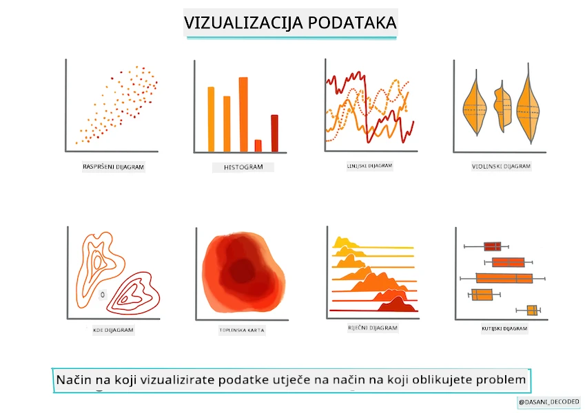
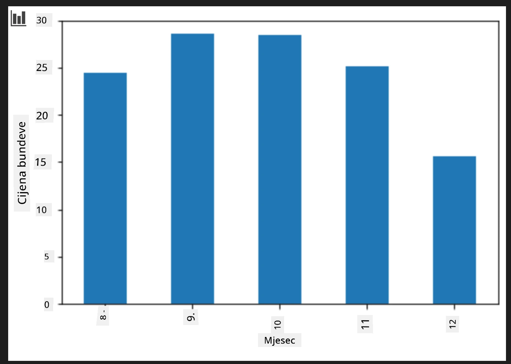
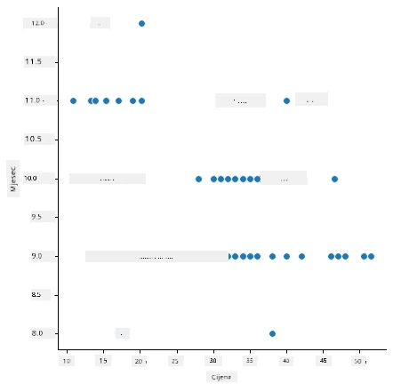
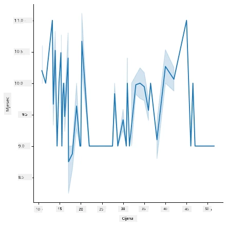
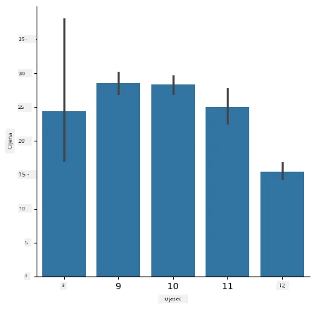
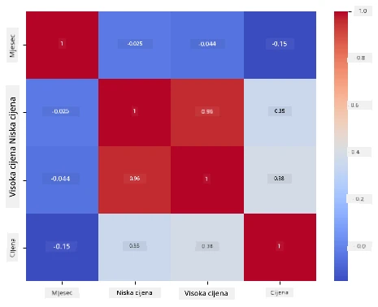

# Izgradite regresijski model koristeći Scikit-learn: pripremite i vizualizirajte podatke



Infografika autora [Dasani Madipalli](https://twitter.com/dasani_decoded)

## [Kviz prije predavanja](https://ff-quizzes.netlify.app/en/ml/)

> ### [Ova lekcija dostupna je i u R-u!](../../../../2-Regression/2-Data/solution/R/lesson_2.html)

## Uvod

Sada kada imate spremne alate koje trebate za početak izrade modela strojnog učenja sa Scikit-learn, spremni ste početi postavljati pitanja svojem skupu podataka. Dok radite s podacima i primjenjujete ML rješenja, vrlo je važno razumjeti kako postaviti pravo pitanje kako biste pravilno otključali potencijale svog skupa podataka.

U ovoj lekciji naučit ćete:

- Kako pripremiti svoje podatke za izradu modela.
- Kako koristiti Matplotlib za vizualizaciju podataka.
- Kako koristiti Seaborn za izražajniju vizualizaciju podataka.

## Postavljajte pravo pitanje svom skupu podataka

Pitanje na koje trebate odgovor odredit će koji tip ML algoritama ćete koristiti. A kvaliteta odgovora koji dobijete ovisit će u velikoj mjeri o prirodi vaših podataka.

Pogledajte [podatke](https://github.com/microsoft/ML-For-Beginners/blob/main/2-Regression/data/US-pumpkins.csv) dostavljene za ovu lekciju. Možete otvoriti ovu .csv datoteku u VS Code-u. Brzi pregled odmah pokazuje da postoje praznine i mješavina nizova i numeričkih podataka. Također postoji neobičan stupac nazvan 'Package' u kojem su podaci mješavina između 'vreća', 'kutija' i drugih vrijednosti. Podaci su, zapravo, pomalo neuredni.

[](https://youtu.be/5qGjczWTrDQ "ML za početnike - Kako analizirati i očistiti skup podataka")

> 🎥 Kliknite na gornju sliku za kratak video o pripremi podataka za ovu lekciju.

Zapravo, nije vrlo često da dobijete skup podataka koji je potpuno spreman za korištenje izravno za stvaranje ML modela. U ovoj lekciji naučit ćete kako pripremiti neobrađeni skup podataka koristeći standardne Python biblioteke. Također ćete naučiti različite tehnike za vizualizaciju podataka.

## Studija slučaja: 'tržište bundeva'

U ovoj mapi naći ćete .csv datoteku u korijenskoj mapi `data` nazvanu [US-pumpkins.csv](https://github.com/microsoft/ML-For-Beginners/blob/main/2-Regression/data/US-pumpkins.csv) koja sadrži 1757 redaka podataka o tržištu bundeva, sortirano po grupama prema gradu. Ovo su neobrađeni podaci izvučeni iz [Specijalnih izvještaja o terminalnim tržištima usjeva](https://www.marketnews.usda.gov/mnp/fv-report-config-step1?type=termPrice) koje distribuira Ministarstvo poljoprivrede Sjedinjenih Američkih Država.

### Priprema podataka

Ovi podaci su javno dostupni. Mogu se preuzeti u mnogim zasebnim datotekama, po gradovima, sa USDA web stranice. Kako bismo izbjegli previše zasebnih datoteka, spojili smo sve podatke po gradovima u jednu tablicu, tako da smo već malo _pripremili_ podatke. Sljedeće, pogledajmo podatke detaljnije.

### Podaci o bundevama - rani zaključci

Što primjećujete u vezi ovih podataka? Već ste vidjeli da postoji mješavina nizova, brojeva, praznina i neobičnih vrijednosti koje morate interpretirati.

Koje pitanje možete postaviti ovim podacima koristeći regresijsku tehniku? Što mislite o "Predviđanju cijene bundeve za prodaju u određenom mjesecu"? Promatrajući podatke, postoje neke promjene koje trebate napraviti da biste stvorili strukturu podataka potrebnu za taj zadatak.
## Vježba - analizirajte podatke o bundevama

Koristit ćemo [Pandas](https://pandas.pydata.org/), (ime znači `Python Data Analysis`) alat vrlo koristan za oblikovanje podataka, za analizu i pripremu ovih podataka o bundevama.

### Prvo, provjerite nedostajuće datume

Prvo ćete morati poduzeti korake za provjeru nedostajućih datuma:

1. Pretvorite datume u format mjeseca (to su američki datumi, pa je format `MM/DD/YYYY`).
2. Izvucite mjesec u novi stupac.

Otvorite datoteku _notebook.ipynb_ u Visual Studio Code i uvezite tablicu u novi Pandas dataframe.

1. Koristite funkciju `head()` da vidite prvih pet redaka.

    ```python
    import pandas as pd
    pumpkins = pd.read_csv('../data/US-pumpkins.csv')
    pumpkins.head()
    ```

    ✅ Koju biste funkciju upotrijebili da vidite zadnjih pet redaka?

1. Provjerite postoje li nedostajući podaci u trenutnom dataframe-u:

    ```python
    pumpkins.isnull().sum()
    ```

    Nedostaju podaci, ali možda to neće biti problem za zadatak.

1. Kako biste olakšali rad s dataframe-om, odaberite samo stupce koje trebate, koristeći funkciju `loc` koja iz originalnog dataframe-a izvlači skup redaka (proslijeđen kao prvi parametar) i stupaca (proslijeđen kao drugi parametar). Izraz `:` u ovom slučaju znači "svi redci".

    ```python
    columns_to_select = ['Package', 'Low Price', 'High Price', 'Date']
    pumpkins = pumpkins.loc[:, columns_to_select]
    ```

### Drugo, odredite prosječnu cijenu bundeve

Razmislite kako odrediti prosječnu cijenu bundeve u određenom mjesecu. Koje biste stupce odabrali za ovaj zadatak? Savjet: trebaju vam 3 stupca.

Rješenje: uzmite prosjek stupaca `Low Price` i `High Price` za popunjavanje novog stupca Cijena, i pretvorite stupac Datum tako da pokazuje samo mjesec. Srećom, prema prethodnoj provjeri, nema nedostajućih podataka za datume ili cijene.

1. Za izračun prosjeka dodajte sljedeći kod:

    ```python
    price = (pumpkins['Low Price'] + pumpkins['High Price']) / 2

    month = pd.DatetimeIndex(pumpkins['Date']).month

    ```

   ✅ Slobodno ispišite bilo koji podatak koji želite provjeriti korištenjem `print(month)`.

2. Sada kopirajte svoje konvertirane podatke u novi Pandas dataframe:

    ```python
    new_pumpkins = pd.DataFrame({'Month': month, 'Package': pumpkins['Package'], 'Low Price': pumpkins['Low Price'],'High Price': pumpkins['High Price'], 'Price': price})
    ```

    Ispis vašeg dataframe-a pokazat će vam čist i uredan skup podataka na kojem možete graditi svoj novi regresijski model.

### Ali, pričekajte! Tu nešto nije u redu

Ako pogledate stupac `Package`, bundeve se prodaju u mnogim različitim konfiguracijama. Neke se prodaju u mjerama '1 1/9 bušl', neke u mjerama '1/2 bušl', neke po jednoj bundevi, neke po funti, a neke u velikim kutijama različitih širina.

> Čini se da je vrlo teško konzistentno mjeriti težinu bundeva

Istražujući izvorne podatke, zanimljivo je da sve što ima `Unit of Sale` jednako 'EACH' ili 'PER BIN' također ima tip `Package` po inču, po binu ili 'svaki'. Bundeve se čine vrlo teškima za konzistentno vaganje, pa ih filtrirajmo tako da odaberemo samo one bundeve kojima je u stupcu `Package` niz 'bushel'.

1. Dodajte filter na početak datoteke, ispod početnog uvoza .csv:

    ```python
    pumpkins = pumpkins[pumpkins['Package'].str.contains('bushel', case=True, regex=True)]
    ```

    Ako sada ispišete podatke, vidjet ćete da dobivate samo otprilike 415 redaka podataka koji sadrže bundeve po bušlu.

### Ali, pričekajte! Još nešto treba napraviti

Primijetili ste da se količina bušl po retku razlikuje? Trebate normalizirati cijene tako da prikažete cijene po bušlu, pa napravite kalkulacije za standardizaciju.

1. Dodajte ove retke iza bloka koji stvara novi_pumpkins dataframe:

    ```python
    new_pumpkins.loc[new_pumpkins['Package'].str.contains('1 1/9'), 'Price'] = price/(1 + 1/9)

    new_pumpkins.loc[new_pumpkins['Package'].str.contains('1/2'), 'Price'] = price/(1/2)
    ```

✅ Prema [The Spruce Eats](https://www.thespruceeats.com/how-much-is-a-bushel-1389308), težina bušla ovisi o vrsti proizvoda, jer je mjera volumena. "Bušl rajčica, na primjer, treba težiti 56 funti... Listovi i zelje zauzimaju više prostora uz manje težine, pa bušl špinata teži samo 20 funti." Sve je to prilično komplicirano! Nemojmo se opterećivati pretvorbom bušl-u u funte, nego cijenu izrazimo po bušlu. Sva ova studija o bušlovima bundeva ipak pokazuje koliko je važno razumjeti prirodu svojih podataka!

Sada možete analizirati cijene po jedinici na osnovi njihove mjere u bušlu. Ako ponovno ispišete podatke, vidjet ćete kako su standardizirani.

✅ Primijetili ste da su bundeve prodane po pola bušla vrlo skupe? Možete li pogoditi zašto? Savjet: male su bundeve znatno skuplje od velikih, vjerojatno zato što ih ima puno više po bušlu, s obzirom na neiskorišteni prostor koji zauzima jedna velika šuplja pita bundeva.

## Strategije vizualizacije

Dio uloge data znanstvenika je demonstrirati kvalitetu i prirodu podataka s kojima rade. Da bi to učinili, često stvaraju zanimljive vizualizacije ili plotove, grafikone i dijagrame koji prikazuju različite aspekte podataka. Na taj način mogu vizualno pokazati odnose i praznine koje je inače teško otkriti.

[](https://youtu.be/SbUkxH6IJo0 "ML za početnike - Kako vizualizirati podatke pomoću Matplotlib")

> 🎥 Kliknite na gornju sliku za kratak video o vizualizaciji podataka za ovu lekciju.

Vizualizacije također mogu pomoći u određivanju tehnike strojnog učenja najprikladnije za podatke. Na primjer, scatterplot koji izgleda kao da prati liniju je pokazatelj da su podaci dobar kandidat za vježbu linearne regresije.

Jedna biblioteka za vizualizaciju podataka koja dobro funkcionira u Jupyter bilježnicama je [Matplotlib](https://matplotlib.org/) (koju ste također vidjeli u prethodnoj lekciji).

> Steknite više iskustva s vizualizacijom podataka u [ovim vodičima](https://docs.microsoft.com/learn/modules/explore-analyze-data-with-python?WT.mc_id=academic-77952-leestott).

## Vježba - eksperimentirajte s Matplotlibom

Pokušajte stvoriti neke osnovne plottove za prikaz novog dataframe-a koji ste upravo stvorili. Što bi osnovni plot linije prikazao?

1. Uvezite Matplotlib na vrh datoteke, ispod uvoza Pandasa:

    ```python
    import matplotlib.pyplot as plt
    ```

1. Ponovno pokrenite cijelu bilježnicu da biste osvježili.
1. Na dnu bilježnice dodajte ćeliju za iscrtavanje podataka kao box plot:

    ```python
    price = new_pumpkins.Price
    month = new_pumpkins.Month
    plt.scatter(price, month)
    plt.show()
    ```

    

    Je li ovaj plot koristan? Iznenađuje li vas nešto u vezi njega?

    Nije osobito koristan jer samo prikazuje vašu podatkovnu točku kao raspršene točke u određenom mjesecu.

### Učinite ga korisnim

Da bi grafikoni prikazali korisne podatke, obično trebate nekako grupirati podatke. Pokušajmo stvoriti plot gdje y-os prikazuje mjesece, a podaci pokazuju raspodjelu podataka.

1. Dodajte ćeliju koja će napraviti grupirani bar chart:

    ```python
    new_pumpkins.groupby(['Month'])['Price'].mean().plot(kind='bar')
    plt.ylabel("Pumpkin Price")
    ```

    

    Ovo je korisnija vizualizacija podataka! Čini se da najviša cijena bundeva nastupa u rujnu i listopadu. Očekujete li to? Zašto da ili zašto ne?

## Vježba - eksperimentirajte sa Seaborn bibliotekom

Matplotlib je moćan, ali može zahtijevati dosta koda za stvaranje dotjeranog grafikona. [Seaborn](https://seaborn.pydata.org/) je biblioteka izgrađena _na vrhu_ Matplotlib-a koja je dizajnirana za statističku vizualizaciju podataka. Radi izravno s Pandas dataframe-ima, primjenjuje privlačne zadane stilove i omogućuje vam stvaranje informativnih plottova uz znatno manje koda. Budući da Seaborn vraća Matplotlib objekte, još uvijek možete koristiti sve što već znate o Matplotlibu za fino podešavanje rezultata.

> Ako već nemate instaliran Seaborn, instalirajte ga naredbom `pip install seaborn`.

1. Uvezite Seaborn na vrh bilježnice, ispod ostalih uvoza. Konvencionalno se uvozi kao `sns`:

    ```python
    import seaborn as sns
    ```

### Scatter plotovi za prikaz odnosa

Velik dio istraživanja podataka prije izrade modela je traženje _odnosa_ među varijablama. [Scatter plot](https://en.wikipedia.org/wiki/Scatter_plot) je jedan od najboljih alata za to: ako točke izgledaju kao da prate liniju, dvije varijable mogu biti povezane, što je dobar znak da linearni regresijski model može funkcionirati.

1. Ponovno napravite scatter plot cijena po mjesecu, ali sada koristeći Seabornovu [`relplot()`](https://seaborn.pydata.org/generated/seaborn.relplot.html) (relacijski plot), koja radi izravno s vašim stupcima dataframe-a:

    ```python
    sns.relplot(x="Price", y="Month", data=new_pumpkins)
    ```

    

    Primijetite kako prosljeđujete _imena stupaca_ i dataframe, a Seaborn se brine o oznakama osi.

2. Možete prebaciti na line plot dodavanjem `kind="line"`. Seaborn čak crta sjenčanu traku koja pokazuje interval pouzdanosti oko linije:

    ```python
    sns.relplot(x="Price", y="Month", kind="line", data=new_pumpkins)
    ```

    

    Ovi podaci su dosta bučni, pa line plot nije najočitiji izbor — ali pokazuje koliko je lako mijenjati vrste grafikona u Seabornu.

### Bar chartovi za prikaz distribucija


Ranije ste ručno grupirali podatke da biste stvorili stupčasti grafikon s Matplotlibom. Seabornova funkcija [`catplot()`](https://seaborn.pydata.org/generated/seaborn.catplot.html) (kategorijski grafikon) može za vas obaviti grupiranje i agregaciju. Zadano `kind="bar"` prikazuje srednju vrijednost svake kategorije zajedno s crnom linijom koja označava interval pouzdanosti.

1. Napravite stupčasti grafikon prosječne cijene po mjesecu:

    ```python
    sns.catplot(x="Month", y="Price", data=new_pumpkins, kind="bar")
    ```

    

    Ovo potvrđuje ono što ste vidjeli s Matplotlibom — cijene vrhunce imaju oko rujna i listopada — ali Seaborn također prikazuje koliko se cijena _varira_ unutar svakog mjeseca.

### Toplinske mape za prikaz korelacija

Scatter plotovi uspoređuju dvije varijable odjednom. Kad imate nekoliko numeričkih stupaca, [toplinska mapa](https://en.wikipedia.org/wiki/Heat_map) vam omogućuje da istovremeno vidite jačinu odnosa između _svakog_ para stupaca. Ovo je uobičajen način za uočiti koje su značajke najviše korelirane prije nego što odlučite što ćete koristiti u modelu (i isti tip grafikona kasnije se koristi za prikazivanje matrica zabune u klasifikaciji).

1. Izgradite korelacijsku matrica s Pandasom, zatim je nacrtajte s Seabornovim [`heatmap()`](https://seaborn.pydata.org/generated/seaborn.heatmap.html). Opcija `annot=True` ispisuje vrijednosti korelacije u svakoj ćeliji:

    ```python
    correlations = new_pumpkins[['Month', 'Low Price', 'High Price', 'Price']].corr()
    sns.heatmap(correlations, annot=True, cmap="coolwarm")
    ```

    

    Vrijednosti blizu `1` (ili `-1`) znače da su stupci snažno _linearno_ korelirani. Primijetite kako su `Low Price` i `High Price` gotovo savršeno korelirani. `Month`, s druge strane, pokazuje samo slabu linearnu korelaciju s cijenom — iako je stupčasti grafikon gore otkrio jasan sezonski vrhunac u rujnu i listopadu. To je važna lekcija: koeficijent korelacije mjeri samo _pravolinijske_ odnose, pa može propustiti sezonske ili inače nelinearne obrasce. ✅ Zašto je korisno pogledati i toplinsku mapu *i* grafikone poput stupčastog grafikona prije nego što odlučite koje stupce koristiti?

### Matplotlib ili Seaborn?

Obje biblioteke vrijedi poznavati:

- **Matplotlib** vam pruža finu kontrolu nad svakim elementom grafikona i temelj je na kojem se gradi gotovo svaka druga Python biblioteka za crtanje.
- **Seaborn** nudi funkcije viših razina i atraktivne zadane postavke za statističke grafikone, radi direktno s dataframeovima i često je brži za istraživačku analizu podataka.

Čest radni tijek je posegnuti za Seabornom za brzo istraživanje podataka, a zatim prijeći na Matplotlib kada trebate prilagoditi detalje.

---

## 🚀Izazov

Istražite različite vrste vizualizacija koje nude Matplotlib i Seaborn. Koje su vrste najprikladnije za probleme regresije?

## [Kviz nakon predavanja](https://ff-quizzes.netlify.app/en/ml/)

## Pregled i samostalno učenje

Pogledajte različite načine vizualizacije podataka. Napravite popis dostupnih biblioteka i zabilježite koje su najbolje za određene vrste zadataka, na primjer 2D vizualizacije nasuprot 3D vizualizacijama. Što otkrivate?

## Zadatak

[Istraživanje vizualizacije](assignment.md)

---

<!-- CO-OP TRANSLATOR DISCLAIMER START -->
**Napomena**:
Ovaj dokument je preveden korištenjem AI prevoditeljskog servisa [Co-op Translator](https://github.com/Azure/co-op-translator). Iako težimo točnosti, imajte na umu da automatski prijevodi mogu sadržavati greške ili netočnosti. Izvorni dokument na izvornom jeziku treba smatrati autoritativnim izvorom. Za važne informacije preporuča se profesionalni ljudski prijevod. Nismo odgovorni za bilo kakva nesporazumevanja ili pogrešne interpretacije koje proizlaze iz korištenja ovog prijevoda.
<!-- CO-OP TRANSLATOR DISCLAIMER END -->