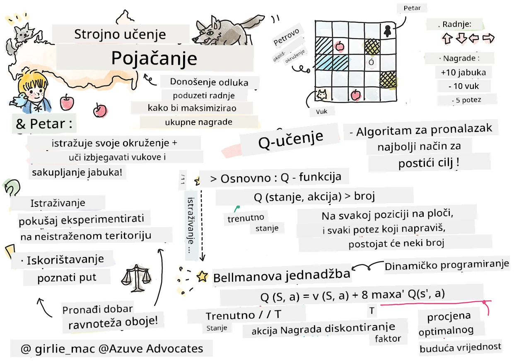

# Uvod u poučavanje potkrepljenjem i Q-učenje


> Sketchnote autorice [Tomomi Imura](https://www.twitter.com/girlie_mac)

Poučavanje potkrepljenjem uključuje tri važna pojma: agent, neka stanja i skup akcija po stanju. Izvršavanjem akcije u određenom stanju, agent dobiva nagradu. Ponovo zamislite računalnu igru Super Mario. Vi ste Mario, u razini igre stojite kraj ruba litice. Iznad vas je novčić. Vi, kao Mario, u razini igre, na određenoj poziciji ... to je vaše stanje. Pomicanje jedan korak udesno (akcija) odvelo bi vas preko ruba i zato biste dobili nizak broj bodova. Međutim, pritiskanjem tipke za skok dobivate bod i ostajete živi. To je pozitivan ishod i trebao bi vas nagraditi pozitivnim brojem bodova.

Korištenjem učenja potkrepljenjem i simulatora (igre) možete naučiti kako igrati igru da bi maksimizirali nagradu, odnosno ostali živi i prikupili što više bodova.

[](https://www.youtube.com/watch?v=lDq_en8RNOo)

> 🎥 Kliknite na sliku iznad da čujete Dmitryja kako govori o učenju potkrepljenjem

## [Kviz prije predavanja](https://ff-quizzes.netlify.app/en/ml/)

## Preduvjeti i postavljanje

U ovom ćemo se poglavlju igrati s ponekim kodom u Pythonu. Trebali biste moći pokrenuti Jupyter Notebook kod iz ovog poglavlja, bilo na svom računalu ili negdje u oblaku.

Možete otvoriti [zapisnik lekcije](https://github.com/microsoft/ML-For-Beginners/blob/main/8-Reinforcement/1-QLearning/notebook.ipynb) i proći ovaj lekciju za učenje.

> **Napomena:** Ako otvarate ovaj kod iz oblaka, također treba preuzeti datoteku [`rlboard.py`](https://github.com/microsoft/ML-For-Beginners/blob/main/8-Reinforcement/1-QLearning/rlboard.py), koja se koristi u kodu zapisnika. Dodajte ju u isti direktorij kao zapisnik.

## Uvod

U ovom ćemo poglavlju istražiti svijet **[Petra i vuka](https://en.wikipedia.org/wiki/Peter_and_the_Wolf)**, inspiriran glazbenom bajkom ruskog skladatelja, [Sergeja Prokofjeva](https://en.wikipedia.org/wiki/Sergei_Prokofiev). Koristit ćemo **poučavanje potkrepljenjem** da Petar istraži svoju okolinu, sakupi ukusne jabuke i izbjegne susret s vukom.

**Poučavanje potkrepljenjem** (RL) je tehnika učenja koja nam omogućava da naučimo optimalno ponašanje **agenta** u nekom **okruženju** izvođenjem mnogo eksperimenata. Agent u ovom okruženju treba imati neki **cilj**, definiran **funkcijom nagrade**.

## Okoliš

Radi jednostavnosti, zamislimo da je Petarov svijet kvadratna ploča dimenzija `width` x `height`, poput ove:


Svaka ćelija na ploči može biti:

* **tlo**, po kojem Peter i druga stvorenja mogu hodati.
* **voda**, po kojoj očito nema hodanja.
* **stablo** ili **trava**, mjesto za odmor.
* **jabuka**, što predstavlja nešto što bi Petar bio sretan pronaći da se nahrani.
* **vuk**, koji je opasan i treba ga izbjegavati.

Postoji poseban Python modul, [`rlboard.py`](https://github.com/microsoft/ML-For-Beginners/blob/main/8-Reinforcement/1-QLearning/rlboard.py), koji sadrži kod za rad s ovim okruženjem. Budući da ovaj kod nije važan za razumijevanje naših koncepata, uvest ćemo modul i iskoristiti ga za stvaranje primjera ploče (blok koda 1):

```python
from rlboard import *

width, height = 8,8
m = Board(width,height)
m.randomize(seed=13)
m.plot()
```

Ovaj kod bi trebao ispisati sliku okoline sličnu gore prikazanoj.

## Akcije i politika

U našem primjeru, Petrov cilj bio bi pronaći jabuku, pritom izbjegavajući vuka i prepreke. Da bi to učinio, može hodati dok ne pronađe jabuku.

Dakle, na bilo kojoj poziciji može izabrati između sljedećih akcija: gore, dolje, lijevo i desno.

Te ćemo akcije definirati kao rječnik, mapirajući ih na parove odgovarajućih promjena koordinata. Na primjer, pomak udesno (`R`) odgovara paru `(1,0)`. (blok koda 2):

```python
actions = { "U" : (0,-1), "D" : (0,1), "L" : (-1,0), "R" : (1,0) }
action_idx = { a : i for i,a in enumerate(actions.keys()) }
```

Ukratko, strategija i cilj ovog scenarija su sljedeći:

- **Strategija** našeg agenta (Petra) definirana je tzv. **politikom**. Politika je funkcija koja vraća akciju u danom stanju. U našem slučaju, stanje problema predstavlja ploča uključujući trenutnu poziciju igrača.

- **Cilj** učenja potkrepljenjem je naučiti dobru politiku koja će problem efikasno riješiti. Međutim, kao početnu točku promatrat ćemo najjednostavniju politiku nazvanu **nasumični hod**.

## Nasumični hod

Prvo ćemo riješiti problem implementirajući strategiju nasumičnog hoda. S njom ćemo nasumično birati sljedeću akciju iz dopuštenih, dok ne dođemo do jabuke (blok koda 3).

1. Implementirajte nasumični hod sljedećim kodom:

    ```python
    def random_policy(m):
        return random.choice(list(actions))
    
    def walk(m,policy,start_position=None):
        n = 0 # broj koraka
        # postavi početnu poziciju
        if start_position:
            m.human = start_position 
        else:
            m.random_start()
        while True:
            if m.at() == Board.Cell.apple:
                return n # uspjeh!
            if m.at() in [Board.Cell.wolf, Board.Cell.water]:
                return -1 # pojeden od vuka ili se utopio
            while True:
                a = actions[policy(m)]
                new_pos = m.move_pos(m.human,a)
                if m.is_valid(new_pos) and m.at(new_pos)!=Board.Cell.water:
                    m.move(a) # izvrši stvarni potez
                    break
            n+=1
    
    walk(m,random_policy)
    ```

    Poziv na `walk` treba vratiti duljinu odgovarajuće staze, što se može razlikovati od izvođenja do izvođenja.

1. Pokrenite eksperiment hoda više puta (recimo 100) i ispišite statistiku (blok koda 4):

    ```python
    def print_statistics(policy):
        s,w,n = 0,0,0
        for _ in range(100):
            z = walk(m,policy)
            if z<0:
                w+=1
            else:
                s += z
                n += 1
        print(f"Average path length = {s/n}, eaten by wolf: {w} times")
    
    print_statistics(random_policy)
    ```

    Primijetite da je prosječna duljina puta oko 30-40 koraka, što je dosta, s obzirom da je prosječna udaljenost do najbliže jabuke oko 5-6 koraka.

    Također možete vidjeti kako izgleda Petrovo kretanje tijekom nasumičnog hoda:

    

## Funkcija nagrade

Da bismo našu politiku učinili inteligentnijom, moramo razumjeti koje su poteze "bolji" od drugih. Zato trebamo definirati cilj.

Cilj može biti definiran u obliku **funkcije nagrade**, koja za svako stanje vraća neku vrijednost bodova. Što je broj veći, funkcija nagrade je bolja. (blok koda 5)

```python
move_reward = -0.1
goal_reward = 10
end_reward = -10

def reward(m,pos=None):
    pos = pos or m.human
    if not m.is_valid(pos):
        return end_reward
    x = m.at(pos)
    if x==Board.Cell.water or x == Board.Cell.wolf:
        return end_reward
    if x==Board.Cell.apple:
        return goal_reward
    return move_reward
```

Zanimljivo kod funkcija nagrade jest da nam se u većini slučajeva *značajna nagrada daje tek na kraju igre*. To znači da algoritam na neki način treba zapamtiti "dobre" korake koji vode do pozitivne nagrade na kraju i naglasiti njihovu važnost. Slično tome, svi loši potezi trebali bi biti obeshrabreni.

## Q-učenje

Algoritam o kojem ćemo govoriti naziva se **Q-učenje**. Kod njega politika je definirana funkcijom (ili podatkovnom strukturom) nazvanom **Q-tablica**. Ona bilježi "dobrotu" svake akcije u danom stanju.

Zove se Q-tablica jer ju je često zgodno prikazati kao tablicu ili višedimenzionalni niz. Budući da ploča ima dimenzije `width` x `height`, možemo Q-tablicu predstaviti numpy nizom oblika `width` x `height` x `len(actions)`: (blok koda 6)

```python
Q = np.ones((width,height,len(actions)),dtype=np.float)*1.0/len(actions)
```

Primijetite da inicijaliziramo sve vrijednosti u Q-tablici s istom vrijednošću, u našem slučaju - 0.25. To odgovara politici "nasumičnog hoda", jer su svi potezi u svakom stanju jednako dobri. Q-tablicu možemo predati funkciji `plot` da vizualiziramo tablicu na ploči: `m.plot(Q)`.


U središtu svake ćelije nalazi se "strelica" koja pokazuje preferirani smjer kretanja. Budući da su svi smjerovi jednaki, prikazuje se točka.

Sad trebamo pokrenuti simulaciju, istražiti okruženje i naučiti bolju distribuciju vrijednosti Q-tablice, što će nam omogućiti da brže pronađemo put do jabuke.

## Suština Q-učenja: Bellmanova jednadžba

Kad počnemo kretati, svaka akcija imat će odgovarajuću nagradu, tj. teoretski možemo izabrati sljedeću akciju s najvećom neposrednom nagradom. No, u većini stanja taj potez neće dovesti do cilja – dohvaćanja jabuke – pa ne možemo odmah odrediti koji je smjer bolji.

> Zapamtite da nije trenutni rezultat važan, nego konačni rezultat koji ćemo dobiti na kraju simulacije.

Da bismo to usporenu nagradu uzeli u obzir, upotrijebit ćemo principe **[dinamičkog programiranja](https://en.wikipedia.org/wiki/Dynamic_programming)**, koji nam omogućuju da promatramo problem rekurzivno.

Pretpostavimo da smo sada u stanju *s* i želimo se pomaknuti u sljedeće stanje *s'*\. Time ćemo dobiti neposrednu nagradu *r(s,a)*, definiranu funkcijom nagrade, plus neku buduću nagradu. Ako pretpostavimo da naša Q-tablica ispravno odražava "privlačnost" svake akcije, u stanju *s'* odabrat ćemo akciju *a* koja odgovara maksimalnoj vrijednosti *Q(s',a')*. Dakle, najbolja moguća buduća nagrada u stanju *s* definirat će se kao `max`<sub>a'</sub>*Q(s',a')* (maksimum je ovdje izračunat preko svih mogućih akcija *a'* u stanju *s'*).

Ovo daje **Bellmanovu formulu** za izračun vrijednosti Q-tablice u stanju *s*, za akciju *a*:


Ovdje je γ takozvani **faktor diskontiranja** koji određuje u kojoj mjeri treba zanemariti trenutnu nagradu u korist buduće ili obratno.

## Algoritam učenja

S obzirom na prethodnu jednadžbu, sada možemo napisati pseudo-kod algoritma učenja:

* Inicijaliziraj Q-tablicu Q jednakim brojevima za sva stanja i akcije
* Postavi stopu učenja α ← 1
* Ponavljaj simulaciju mnogo puta
   1. Počni na nasumičnoj poziciji
   1. Ponavljaj
        1. Izaberi akciju *a* u stanju *s*
        2. Izvrši akciju pomicanjem u novo stanje *s'*
        3. Ako je ispunjen uvjet kraja igre ili je ukupna nagrada previše mala - izađi iz simulacije  
        4. Izračunaj nagradu *r* u novom stanju
        5. Ažuriraj Q-funkciju prema Bellmanovoj formuli: *Q(s,a)* ← *(1-α)Q(s,a)+α(r+γ max<sub>a'</sub>Q(s',a'))*
        6. *s* ← *s'*
        7. Ažuriraj ukupnu nagradu i smanji α.

## Eksploatacija protiv istraživanja

U prethodnom algoritmu nismo precizirali kako točno birati akciju u koraku 2.1. Ako akciju biramo nasumično, **istraživat ćemo** okruženje i vjerojatno ćemo često umirati i istraživati mjesta gdje inače ne bismo išli. Alternativni pristup je **iskoristiti** već poznate vrijednosti Q-tablice i tako izabrati najbolju akciju (onu s većom Q-vrijednošću) u stanju *s*. To nas međutim sprječava u istraživanju novih stanja i možda nećemo pronaći optimalno rješenje.

Zbog toga je najbolji pristup postići ravnotežu između istraživanja i eksploatacije. To se može učiniti izborom akcije u stanju *s* s vjerojatnostima proporcionalnima vrijednostima u Q-tablici. Na početku, kada su sve vrijednosti u Q-tablici iste, to će biti nasumični izbor, ali kako učimo o okolišu, sve ćemo češće birati optimalnu putanju uz povremeni izbor neistraženih opcija.

## Implementacija u Pythonu

Spremni smo za implementaciju algoritma učenja. Prije toga trebamo još i funkciju koja će raznorazne vrijednosti u Q-tablici pretvoriti u vektor vjerojatnosti za odgovarajuće akcije.

1. Kreirajte funkciju `probs()`:

    ```python
    def probs(v,eps=1e-4):
        v = v-v.min()+eps
        v = v/v.sum()
        return v
    ```

    Dodajemo malo `eps` originalnom vektoru da izbjegnemo dijeljenje s 0 u početnom slučaju, kad su svi elementi vektora jednaki.

Pokrenite algoritam učenja kroz 5000 eksperimenata, nazvanih i **epohama**: (blok koda 8)
```python
    for epoch in range(5000):
    
        # Odaberi početnu točku
        m.random_start()
        
        # Započni putovanje
        n=0
        cum_reward = 0
        while True:
            x,y = m.human
            v = probs(Q[x,y])
            a = random.choices(list(actions),weights=v)[0]
            dpos = actions[a]
            m.move(dpos,check_correctness=False) # dopuštamo igraču da se pomakne izvan ploče, što završava epizodu
            r = reward(m)
            cum_reward += r
            if r==end_reward or cum_reward < -1000:
                lpath.append(n)
                break
            alpha = np.exp(-n / 10e5)
            gamma = 0.5
            ai = action_idx[a]
            Q[x,y,ai] = (1 - alpha) * Q[x,y,ai] + alpha * (r + gamma * Q[x+dpos[0], y+dpos[1]].max())
            n+=1
```

Nakon izvršavanja algoritma, Q-tablica trebala bi biti ažurirana vrijednostima koje definiraju privlačnost različitih akcija u svakom koraku. Možemo pokušati vizualizirati Q-tablicu tako da nacrtamo vektor u svakoj ćeliji koji pokazuje željeni smjer kretanja. Radi jednostavnosti, umjesto vrha strelice crtamo mali krug.


## Provjera politike

Kako Q-tablica prikazuje "privlačnost" svake akcije u svakom stanju, relativno je lako koristiti je za definiranje učinkovite navigacije u našem svijetu. U najjednostavnijem slučaju, možemo izabrati akciju s najvećom Q-vrijednošću: (blok koda 9)

```python
def qpolicy_strict(m):
        x,y = m.human
        v = probs(Q[x,y])
        a = list(actions)[np.argmax(v)]
        return a

walk(m,qpolicy_strict)
```


> Ako nekoliko puta pokušate gore navedeni kod, možda ćete primijetiti da se ponekad "zamrzne" i morate pritisnuti gumb STOP u bilježnici da ga prekinete. To se događa jer mogu postojati situacije kada se dva stanja "pokazuju" jedno na drugo u smislu optimalne Q-vrijednosti, u kojem slučaju agent na kraju naizmjence prelazi između tih stanja beskonačno.

## 🚀Izazov

> **Zadatak 1:** Izmijenite funkciju `walk` da ograniči maksimalnu duljinu puta na određeni broj koraka (recimo 100) i promatrajte kako gornji kod s vremena na vrijeme vraća tu vrijednost.

> **Zadatak 2:** Izmijenite funkciju `walk` tako da se ne vraća na mjesta na kojima je već bio ranije. Time će se spriječiti petljanje `walk` funkcije, no agent se i dalje može "zaglavljivati" na mjestu iz kojeg ne može pobjeći.

## Navigacija

Bolja navigacijska politika bila bi ona koju smo koristili tijekom učenja, koja kombinira eksploataciju i istraživanje. U ovoj politici ćemo odabrati svaku radnju s određenom vjerojatnošću, proporcionalnom vrijednostima u Q-tablici. Ova strategija i dalje može rezultirati time da se agent vrati na poziciju koju je već istražio, ali kao što možete vidjeti iz koda dolje, rezultat je vrlo kratak prosječni put do željene lokacije (zapamtite da `print_statistics` pokreće simulaciju 100 puta): (blok koda 10)

```python
def qpolicy(m):
        x,y = m.human
        v = probs(Q[x,y])
        a = random.choices(list(actions),weights=v)[0]
        return a

print_statistics(qpolicy)
```

Nakon pokretanja ovog koda, trebali biste dobiti znatno manju prosječnu duljinu puta nego prije, u rasponu od 3 do 6.

## Istraživanje procesa učenja

Kao što smo spomenuli, proces učenja je balans između istraživanja i eksploatacije stečenog znanja o strukturi problema. Vidjeli smo da su se rezultati učenja (sposobnost da agent nađe kratak put do cilja) poboljšali, ali također je zanimljivo promatrati kako se prosječna duljina puta ponaša tijekom procesa učenja:


Zaključci učenja mogu se sažeti kao:

- **Prosječna duljina puta se povećava**. Ono što vidimo ovdje je da se u početku prosječna duljina puta povećava. To je vjerojatno zbog toga što, kad ništa ne znamo o okolišu, vjerojatno ćemo se zaglaviti u lošim stanjima, vodi ili vuku. Kako učimo više i počinjemo koristiti to znanje, možemo duže istraživati okoliš, ali još uvijek ne znamo dobro gdje se nalaze jabuke.

- **Duljina puta se smanjuje kako učimo**. Kada dovoljno naučimo, agentu je lakše postići cilj, pa duljina puta počinje opadati. Međutim, još uvijek smo otvoreni za istraživanje, pa se često udaljimo od najboljeg puta i isprobavamo nove opcije, čineći put duljim od optimalnog.

- **Duljina naglo raste**. Također primjećujemo na ovom grafikonu da je u nekom trenutku duljina naglo porasla. To upućuje na stohastičku prirodu procesa i da možemo u nekom trenutku "pokvariti" koeficijente Q-tablice prebrisavanjem novim vrijednostima. To bi idealno trebalo biti minimizirano smanjenjem stope učenja (na primjer, prema kraju treninga, vrijednosti Q-tablice se prilagođavaju samo za malu vrijednost).

Sveukupno, važno je zapamtiti da uspjeh i kvaliteta procesa učenja značajno ovise o parametrima, kao što su stopa učenja, opadanje stope učenja i faktor diskonta. Ti se često nazivaju **hiperparametri** kako bi ih se razlikovalo od **parametara**, koje optimiziramo tijekom treninga (na primjer, koeficijenti Q-tablice). Proces pronalaska najboljih vrijednosti hiperparametara naziva se **optimizacija hiperparametara** i zaslužuje zasebnu temu.

## [Kviza nakon predavanja](https://ff-quizzes.netlify.app/en/ml/)

## Zadatak 
[Realističniji svijet](assignment.md)

---

<!-- CO-OP TRANSLATOR DISCLAIMER START -->
**Napomena**:
Ovaj dokument je preveden korištenjem AI prevoditeljskog servisa [Co-op Translator](https://github.com/Azure/co-op-translator). Iako težimo točnosti, imajte na umu da automatski prijevodi mogu sadržavati greške ili netočnosti. Izvorni dokument na izvornom jeziku treba smatrati autoritativnim izvorom. Za važne informacije preporuča se profesionalni ljudski prijevod. Nismo odgovorni za bilo kakva nesporazumevanja ili pogrešne interpretacije koje proizlaze iz korištenja ovog prijevoda.
<!-- CO-OP TRANSLATOR DISCLAIMER END -->