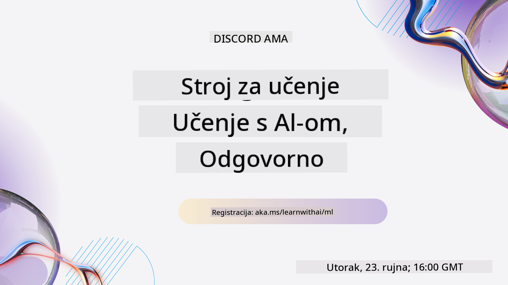
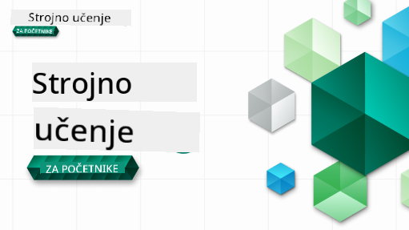

<!--
CO_OP_TRANSLATOR_METADATA:
{
  "original_hash": "a54f98da7bbee99ddc62a9e490eef7dc",
  "translation_date": "2025-09-29T22:23:01+00:00",
  "source_file": "README.md",
  "language_code": "hr"
}
-->
  
  
  
  
  

  
  
  

### 🌐 Podrška za više jezika  

#### Podržano putem GitHub Action (Automatizirano i uvijek ažurirano)  

[Francuski](../fr/README.md) | [Španjolski](../es/README.md) | [Njemački](../de/README.md) | [Ruski](../ru/README.md) | [Arapski](../ar/README.md) | [Perzijski (Farsi)](../fa/README.md) | [Urdu](../ur/README.md) | [Kineski (pojednostavljeni)](../zh/README.md) | [Kineski (tradicionalni, Makao)](../mo/README.md) | [Kineski (tradicionalni, Hong Kong)](../hk/README.md) | [Kineski (tradicionalni, Tajvan)](../tw/README.md) | [Japanski](../ja/README.md) | [Korejski](../ko/README.md) | [Hindski](../hi/README.md) | [Bengalski](../bn/README.md) | [Marathi](../mr/README.md) | [Nepalski](../ne/README.md) | [Pandžapski (Gurmukhi)](../pa/README.md) | [Portugalski (Portugal)](../pt/README.md) | [Portugalski (Brazil)](../br/README.md) | [Talijanski](../it/README.md) | [Poljski](../pl/README.md) | [Turski](../tr/README.md) | [Grčki](../el/README.md) | [Tajlandski](../th/README.md) | [Švedski](../sv/README.md) | [Danski](../da/README.md) | [Norveški](../no/README.md) | [Finski](../fi/README.md) | [Nizozemski](../nl/README.md) | [Hebrejski](../he/README.md) | [Vijetnamski](../vi/README.md) | [Indonezijski](../id/README.md) | [Malajski](../ms/README.md) | [Tagalog (Filipinski)](../tl/README.md) | [Svahili](../sw/README.md) | [Mađarski](../hu/README.md) | [Češki](../cs/README.md) | [Slovački](../sk/README.md) | [Rumunjski](../ro/README.md) | [Bugarski](../bg/README.md) | [Srpski (ćirilica)](../sr/README.md) | [Hrvatski](./README.md) | [Slovenski](../sl/README.md) | [Ukrajinski](../uk/README.md) | [Burmanski (Mjanmar)](../my/README.md)  

#### Pridružite se našoj zajednici  

  

Imamo seriju učenja s AI na Discordu, saznajte više i pridružite nam se na [Learn with AI Series](https://aka.ms/learnwithai/discord) od 18. do 30. rujna 2025. Dobit ćete savjete i trikove za korištenje GitHub Copilot-a za Data Science.  

  

# Strojno učenje za početnike - Kurikulum  

> 🌍 Putujte svijetom dok istražujemo strojno učenje kroz svjetske kulture 🌍  

Cloud Advocates u Microsoftu s ponosom nude 12-tjedni kurikulum s 26 lekcija o **strojnom učenju**. U ovom kurikulumu naučit ćete o onome što se ponekad naziva **klasično strojno učenje**, koristeći prvenstveno Scikit-learn kao biblioteku i izbjegavajući duboko učenje, koje je pokriveno u našem [AI za početnike kurikulumu](https://aka.ms/ai4beginners). Povežite ove lekcije s našim kurikulumom ['Data Science za početnike'](https://aka.ms/ds4beginners), također!  

Putujte s nama svijetom dok primjenjujemo ove klasične tehnike na podatke iz različitih dijelova svijeta. Svaka lekcija uključuje kvizove prije i poslije lekcije, pisane upute za dovršavanje lekcije, rješenje, zadatak i još mnogo toga. Naša metodologija temeljena na projektima omogućuje vam učenje kroz izgradnju, dokazano učinkovit način za usvajanje novih vještina.  

**✍️ Velika zahvala našim autorima** Jen Looper, Stephen Howell, Francesca Lazzeri, Tomomi Imura, Cassie Breviu, Dmitry Soshnikov, Chris Noring, Anirban Mukherjee, Ornella Altunyan, Ruth Yakubu i Amy Boyd  

**🎨 Zahvala i našim ilustratorima** Tomomi Imura, Dasani Madipalli i Jen Looper  

**🙏 Posebna zahvala 🙏 našim Microsoft Student Ambassador autorima, recenzentima i suradnicima sadržaja**, posebno Rishit Dagli, Muhammad Sakib Khan Inan, Rohan Raj, Alexandru Petrescu, Abhishek Jaiswal, Nawrin Tabassum, Ioan Samuila i Snigdha Agarwal  

**🤩 Dodatna zahvalnost Microsoft Student Ambassadorima Eric Wanjau, Jasleen Sondhi i Vidushi Gupta za naše lekcije u R-u!**  

# Početak  

Slijedite ove korake:  
1. **Forkajte repozitorij**: Kliknite na gumb "Fork" u gornjem desnom kutu ove stranice.  
2. **Klonirajte repozitorij**: `git clone https://github.com/microsoft/ML-For-Beginners.git`  

> [pronađite sve dodatne resurse za ovaj tečaj u našoj Microsoft Learn kolekciji](https://learn.microsoft.com/en-us/collections/qrqzamz1nn2wx3?WT.mc_id=academic-77952-bethanycheum)  

**[Studenti](https://aka.ms/student-page)**, za korištenje ovog kurikuluma, forkajte cijeli repo na svoj GitHub račun i dovršite vježbe sami ili u grupi:  

- Započnite s kvizom prije predavanja.  
- Pročitajte predavanje i dovršite aktivnosti, zaustavljajući se i razmišljajući na svakom provjeravanju znanja.  
- Pokušajte izraditi projekte razumijevanjem lekcija umjesto pokretanja rješenja koda; međutim, taj kod je dostupan u `/solution` mapama u svakoj lekciji temeljenoj na projektu.  
- Riješite kviz nakon predavanja.  
- Dovršite izazov.  
- Dovršite zadatak.  
- Nakon dovršetka grupe lekcija, posjetite [Diskusijsku ploču](https://github.com/microsoft/ML-For-Beginners/discussions) i "učite naglas" ispunjavanjem odgovarajuće PAT rubrike. 'PAT' je alat za procjenu napretka, rubrika koju ispunjavate kako biste dodatno unaprijedili svoje učenje. Također možete reagirati na druge PAT-ove kako bismo učili zajedno.  

> Za daljnje učenje, preporučujemo praćenje ovih [Microsoft Learn](https://docs.microsoft.com/en-us/users/jenlooper-2911/collections/k7o7tg1gp306q4?WT.mc_id=academic-77952-leestott) modula i putova učenja.  

**Nastavnici**, [uključili smo neke prijedloge](for-teachers.md) o tome kako koristiti ovaj kurikulum.  

---

## Video vodiči  

Neke lekcije dostupne su kao kratki videozapisi. Sve ih možete pronaći unutar lekcija ili na [ML za početnike playlisti na Microsoft Developer YouTube kanalu](https://aka.ms/ml-beginners-videos) klikom na sliku ispod.  

  

---

## Upoznajte tim  

  

**Gif autor** [Mohit Jaisal](https://linkedin.com/in/mohitjaisal)  

> 🎥 Kliknite na sliku iznad za video o projektu i ljudima koji su ga stvorili!  

---

## Pedagogija  

Odabrali smo dva pedagoška načela pri izradi ovog kurikuluma: osigurati da je praktičan **temeljen na projektima** i da uključuje **česte kvizove**. Osim toga, ovaj kurikulum ima zajedničku **temu** koja mu daje koheziju.  

Osiguravanjem da sadržaj odgovara projektima, proces postaje zanimljiviji za studente, a zadržavanje koncepata se povećava. Osim toga, kviz s niskim rizikom prije predavanja usmjerava namjeru studenta prema učenju teme, dok drugi kviz nakon predavanja osigurava daljnje zadržavanje. Ovaj kurikulum je dizajniran da bude fleksibilan i zabavan te se može uzeti u cijelosti ili djelomično. Projekti započinju malim i postaju sve složeniji do kraja 12-tjednog ciklusa. Ovaj kurikulum također uključuje dodatak o stvarnim primjenama ML-a, koji se može koristiti kao dodatni zadatak ili kao osnova za raspravu.  

> Pronađite naš [Kodeks ponašanja](CODE_OF_CONDUCT.md), [Doprinos](CONTRIBUTING.md) i [Smjernice za prijevod](TRANSLATIONS.md). Dobrodošli ste podijeliti konstruktivne povratne informacije!  

## Svaka lekcija uključuje  

- opcionalni sketchnote  
- opcionalni dopunski video  
- video vodič (samo za neke lekcije)  
- [kviz za zagrijavanje prije predavanja](https://ff-quizzes.netlify.app/en/ml/)  
- pisanu lekciju  
- za lekcije temeljene na projektima, vodiče korak po korak kako izraditi projekt  
- provjere znanja  
- izazov  
- dopunsko čitanje  
- zadatak  
- [kviz nakon predavanja](https://ff-quizzes.netlify.app/en/ml/)  

> **Napomena o jezicima**: Ove lekcije su prvenstveno napisane u Pythonu, ali mnoge su dostupne i u R-u. Za dovršavanje lekcije u R-u, idite u `/solution` mapu i potražite lekcije u R-u. One uključuju .rmd ekstenziju koja predstavlja **R Markdown** datoteku koja se može jednostavno definirati kao ugrađivanje `code chunks` (R ili drugih jezika) i `YAML header` (koji vodi kako formatirati izlaze poput PDF-a) u `Markdown dokument`. Kao takva, služi kao primjeran okvir za autorstvo u znanosti o podacima jer vam omogućuje kombiniranje vašeg koda, njegovog izlaza i vaših misli omogućujući vam da ih zabilježite u Markdownu. Osim toga, R Markdown dokumenti mogu se prikazati u formatima izlaza poput PDF-a, HTML-a ili Worda.  

> **Napomena o kvizovima**: Svi kvizovi nalaze se u [Quiz App mapi](../../quiz-app), ukupno 52 kviza s po tri pitanja. Povezani su unutar lekcija, ali aplikacija za kviz može se pokrenuti lokalno; slijedite upute u `quiz-app` mapi za lokalno hostiranje ili implementaciju na Azure.  

| Broj lekcije |                             Tema                              |                   Grupiranje lekcija                   | Ciljevi učenja                                                                                                             |                                                              Povezana lekcija                                                               |                        Autor                        |  
| :-----------: | :------------------------------------------------------------: | :-------------------------------------------------: | ------------------------------------------------------------------------------------------------------------------------------- | :--------------------------------------------------------------------------------------------------------------------------------------: | :--------------------------------------------------: |  
|      01       |                Uvod u strojno učenje                |      [Uvod](1-Introduction/README.md)       | Naučite osnovne koncepte strojnog učenja                                                                                |                                             [Lekcija](1-Introduction/1-intro-to-ML/README.md)                                             |                       Muhammad                       |  
|      02       |                Povijest strojnog učenja                 |      [Uvod](1-Introduction/README.md)       | Naučite povijest ovog područja                                                                                         |                                            [Lekcija](1-Introduction/2-history-of-ML/README.md)                                            |                     Jen i Amy                      |  
|      03       |                 Pravednost i strojno učenje                   |      [Uvod](1-Introduction/README.md)               | Koja su važna filozofska pitanja o pravednosti koja studenti trebaju razmotriti pri izradi i primjeni ML modela?                |                                              [Lekcija](1-Introduction/3-fairness/README.md)                                               |                        Tomomi                        |
|      04       |                Tehnike za strojno učenje                      |      [Uvod](1-Introduction/README.md)               | Koje tehnike istraživači ML-a koriste za izradu ML modela?                                                                       |                                          [Lekcija](1-Introduction/4-techniques-of-ML/README.md)                                           |                    Chris i Jen                      |
|      05       |                   Uvod u regresiju                            |        [Regresija](2-Regression/README.md)          | Počnite s Pythonom i Scikit-learnom za regresijske modele                                                                        |         [Python](2-Regression/1-Tools/README.md) • [R](../../2-Regression/1-Tools/solution/R/lesson_1.html)         |      Jen • Eric Wanjau       |
|      06       |                Cijene bundeva u Sjevernoj Americi 🎃          |        [Regresija](2-Regression/README.md)          | Vizualizirajte i očistite podatke u pripremi za ML                                                                               |          [Python](2-Regression/2-Data/README.md) • [R](../../2-Regression/2-Data/solution/R/lesson_2.html)          |      Jen • Eric Wanjau       |
|      07       |                Cijene bundeva u Sjevernoj Americi 🎃          |        [Regresija](2-Regression/README.md)          | Izradite linearne i polinomne regresijske modele                                                                                 |        [Python](2-Regression/3-Linear/README.md) • [R](../../2-Regression/3-Linear/solution/R/lesson_3.html)        |      Jen i Dmitry • Eric Wanjau       |
|      08       |                Cijene bundeva u Sjevernoj Americi 🎃          |        [Regresija](2-Regression/README.md)          | Izradite logistički regresijski model                                                                                           |     [Python](2-Regression/4-Logistic/README.md) • [R](../../2-Regression/4-Logistic/solution/R/lesson_4.html)      |      Jen • Eric Wanjau       |
|      09       |                          Web aplikacija 🔌                    |           [Web aplikacija](3-Web-App/README.md)     | Izradite web aplikaciju za korištenje vašeg treniranog modela                                                                    |                                                 [Python](3-Web-App/1-Web-App/README.md)                                                  |                         Jen                          |
|      10       |                 Uvod u klasifikaciju                          |    [Klasifikacija](4-Classification/README.md)      | Očistite, pripremite i vizualizirajte svoje podatke; uvod u klasifikaciju                                                        | [Python](4-Classification/1-Introduction/README.md) • [R](../../4-Classification/1-Introduction/solution/R/lesson_10.html)  | Jen i Cassie • Eric Wanjau |
|      11       |             Ukusna azijska i indijska kuhinja 🍜              |    [Klasifikacija](4-Classification/README.md)      | Uvod u klasifikatore                                                                                                            | [Python](4-Classification/2-Classifiers-1/README.md) • [R](../../4-Classification/2-Classifiers-1/solution/R/lesson_11.html) | Jen i Cassie • Eric Wanjau |
|      12       |             Ukusna azijska i indijska kuhinja 🍜              |    [Klasifikacija](4-Classification/README.md)      | Više klasifikatora                                                                                                              | [Python](4-Classification/3-Classifiers-2/README.md) • [R](../../4-Classification/3-Classifiers-2/solution/R/lesson_12.html) | Jen i Cassie • Eric Wanjau |
|      13       |             Ukusna azijska i indijska kuhinja 🍜              |    [Klasifikacija](4-Classification/README.md)      | Izradite web aplikaciju preporuka koristeći vaš model                                                                           |                                              [Python](4-Classification/4-Applied/README.md)                                              |                         Jen                          |
|      14       |                   Uvod u grupiranje                           |        [Grupiranje](5-Clustering/README.md)         | Očistite, pripremite i vizualizirajte svoje podatke; uvod u grupiranje                                                          |         [Python](5-Clustering/1-Visualize/README.md) • [R](../../5-Clustering/1-Visualize/solution/R/lesson_14.html)         |      Jen • Eric Wanjau       |
|      15       |              Istraživanje glazbenih ukusa u Nigeriji 🎧       |        [Grupiranje](5-Clustering/README.md)         | Istražite metodu grupiranja K-Means                                                                                            |           [Python](5-Clustering/2-K-Means/README.md) • [R](../../5-Clustering/2-K-Means/solution/R/lesson_15.html)           |      Jen • Eric Wanjau       |
|      16       |        Uvod u obradu prirodnog jezika ☕️                     |   [Obrada prirodnog jezika](6-NLP/README.md)        | Naučite osnove NLP-a izradom jednostavnog bota                                                                                  |                                             [Python](6-NLP/1-Introduction-to-NLP/README.md)                                              |                       Stephen                        |
|      17       |                      Uobičajeni NLP zadaci ☕️                |   [Obrada prirodnog jezika](6-NLP/README.md)        | Produbite svoje znanje o NLP-u razumijevanjem uobičajenih zadataka vezanih uz jezične strukture                                 |                                                    [Python](6-NLP/2-Tasks/README.md)                                                     |                       Stephen                        |
|      18       |             Prijevod i analiza sentimenta ♥️                 |   [Obrada prirodnog jezika](6-NLP/README.md)        | Prijevod i analiza sentimenta s Jane Austen                                                                                    |                                            [Python](6-NLP/3-Translation-Sentiment/README.md)                                             |                       Stephen                        |
|      19       |                  Romantični hoteli u Europi ♥️               |   [Obrada prirodnog jezika](6-NLP/README.md)        | Analiza sentimenta s recenzijama hotela 1                                                                                       |                                               [Python](6-NLP/4-Hotel-Reviews-1/README.md)                                                |                       Stephen                        |
|      20       |                  Romantični hoteli u Europi ♥️               |   [Obrada prirodnog jezika](6-NLP/README.md)        | Analiza sentimenta s recenzijama hotela 2                                                                                       |                                               [Python](6-NLP/5-Hotel-Reviews-2/README.md)                                                |                       Stephen                        |
|      21       |            Uvod u predviđanje vremenskih serija              |        [Vremenske serije](7-TimeSeries/README.md)   | Uvod u predviđanje vremenskih serija                                                                                           |                                             [Python](7-TimeSeries/1-Introduction/README.md)                                              |                      Francesca                       |
|      22       | ⚡️ Svjetska potrošnja energije ⚡️ - predviđanje vremenskih serija s ARIMA |        [Vremenske serije](7-TimeSeries/README.md)   | Predviđanje vremenskih serija s ARIMA                                                                                          |                                                 [Python](7-TimeSeries/2-ARIMA/README.md)                                                 |                      Francesca                       |
|      23       |  ⚡️ Svjetska potrošnja energije ⚡️ - predviđanje vremenskih serija s SVR  |        [Vremenske serije](7-TimeSeries/README.md)   | Predviđanje vremenskih serija s regresorom potpornih vektora                                                                   |                                                  [Python](7-TimeSeries/3-SVR/README.md)                                                  |                       Anirban                        |
|      24       |             Uvod u učenje pojačanjem                         | [Učenje pojačanjem](8-Reinforcement/README.md)      | Uvod u učenje pojačanjem s Q-Learning                                                                                          |                                             [Python](8-Reinforcement/1-QLearning/README.md)                                              |                        Dmitry                        |
|      25       |                 Pomozite Peteru izbjeći vuka! 🐺             | [Učenje pojačanjem](8-Reinforcement/README.md)      | Učenje pojačanjem s Gym                                                                                                         |                                                [Python](8-Reinforcement/2-Gym/README.md)                                                 |                        Dmitry                        |
|  Postscript   |            Scenariji i primjene ML-a u stvarnom svijetu      |      [ML u stvarnom svijetu](9-Real-World/README.md)| Zanimljive i otkrivajuće primjene klasičnog ML-a                                                                               |                                             [Lekcija](9-Real-World/1-Applications/README.md)                                              |                         Tim                          |
|  Postscript   |            Debugging modela u ML-u pomoću RAI nadzorne ploče |      [ML u stvarnom svijetu](9-Real-World/README.md)| Debugging modela u strojnom učenju pomoću komponenti nadzorne ploče za odgovornu umjetnu inteligenciju                         |                                             [Lekcija](9-Real-World/2-Debugging-ML-Models/README.md)                                              |                         Ruth Yakubu                       |

> [pronađite sve dodatne resurse za ovaj tečaj u našoj Microsoft Learn kolekciji](https://learn.microsoft.com/en-us/collections/qrqzamz1nn2wx3?WT.mc_id=academic-77952-bethanycheum)

## Pristup bez interneta

Možete pokrenuti ovu dokumentaciju offline koristeći [Docsify](https://docsify.js.org/#/). Forkajte ovaj repo, [instalirajte Docsify](https://docsify.js.org/#/quickstart) na svom lokalnom računalu, a zatim u root mapi ovog repozitorija upišite `docsify serve`. Web stranica će biti poslužena na portu 3000 na vašem localhostu: `localhost:3000`.

## PDF-ovi

Pronađite PDF kurikuluma s poveznicama [ovdje](https://microsoft.github.io/ML-For-Beginners/pdf/readme.pdf).

## 🎒 Ostali tečajevi 

Naš tim proizvodi i druge tečajeve! Pogledajte:

- [Edge AI za početnike](https://aka.ms/edgeai-for-beginners)
- [AI agenti za početnike](https://aka.ms/ai-agents-beginners)
- [Generativna AI za početnike](https://aka.ms/genai-beginners)
- [Generativna AI za početnike .NET](https://github.com/microsoft/Generative-AI-for-beginners-dotnet)
- [Generativna AI s JavaScriptom](https://github.com/microsoft/generative-ai-with-javascript)
- [Generativna AI s Javom](https://github.com/microsoft/Generative-AI-for-beginners-java)
- [AI za početnike](https://aka.ms/ai-beginners)
- [Data Science za početnike](https://aka.ms/datascience-beginners)
- [ML za početnike](https://aka.ms/ml-beginners)
- [Kibernetička sigurnost za početnike](https://github.com/microsoft/Security-101) 
- [Web razvoj za početnike](https://aka.ms/webdev-beginners)
- [IoT za početnike](https://aka.ms/iot-beginners)
- [XR razvoj za početnike](https://github.com/microsoft/xr-development-for-beginners)
- [Savladavanje GitHub Copilota za parno programiranje](https://github.com/microsoft/Mastering-GitHub-Copilot-for-Paired-Programming)
- [Savladavanje GitHub Copilota za C#/.NET programere](https://github.com/microsoft/mastering-github-copilot-for-dotnet-csharp-developers)
- [Odaberite svoju vlastitu Copilot avanturu](https://github.com/microsoft/CopilotAdventures)

---

**Odricanje od odgovornosti**:  
Ovaj dokument je preveden pomoću AI usluge za prevođenje [Co-op Translator](https://github.com/Azure/co-op-translator). Iako nastojimo osigurati točnost, imajte na umu da automatski prijevodi mogu sadržavati pogreške ili netočnosti. Izvorni dokument na izvornom jeziku treba smatrati autoritativnim izvorom. Za ključne informacije preporučuje se profesionalni prijevod od strane čovjeka. Ne preuzimamo odgovornost za nesporazume ili pogrešna tumačenja koja mogu proizaći iz korištenja ovog prijevoda.