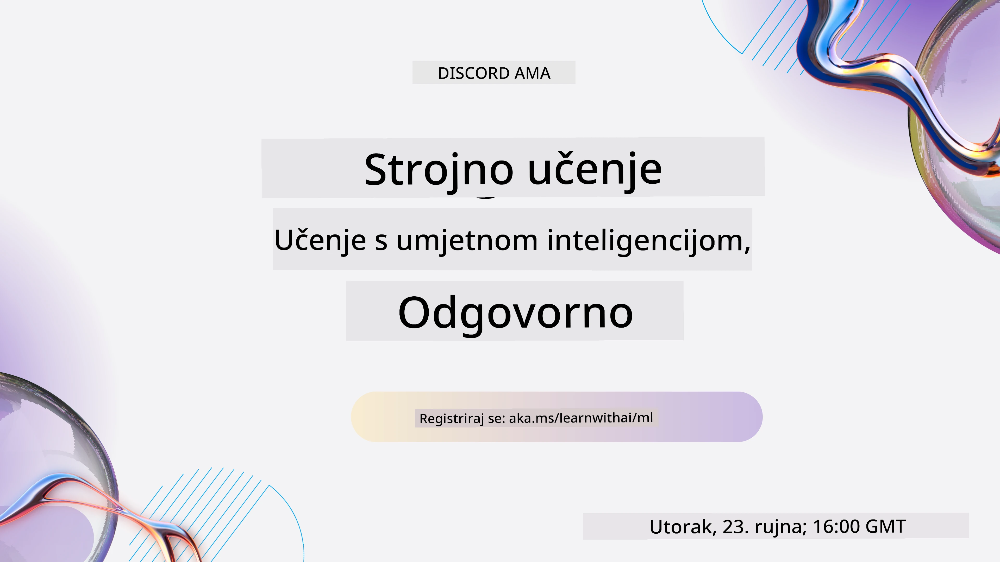
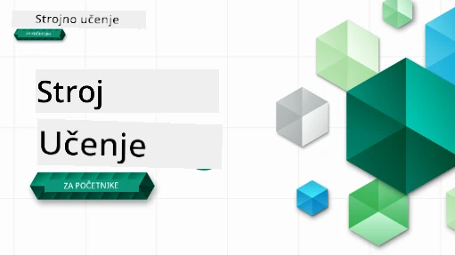

[](https://github.com/microsoft/ML-For-Beginners/blob/master/LICENSE)
[](https://GitHub.com/microsoft/ML-For-Beginners/graphs/contributors/)
[](https://GitHub.com/microsoft/ML-For-Beginners/issues/)
[](https://GitHub.com/microsoft/ML-For-Beginners/pulls/)
[](http://makeapullrequest.com)

[](https://GitHub.com/microsoft/ML-For-Beginners/watchers/)
[](https://GitHub.com/microsoft/ML-For-Beginners/network/)
[](https://GitHub.com/microsoft/ML-For-Beginners/stargazers/)

### 🌐 Podrška za više jezika

#### Podržano putem GitHub akcije (automatizirano i uvijek ažurno)

<!-- CO-OP TRANSLATOR LANGUAGES TABLE START -->
[Arapski](../ar/README.md) | [Bengalski](../bn/README.md) | [Bugarski](../bg/README.md) | [Burmanski (Mjanmar)](../my/README.md) | [Kineski (pojednostavljeni)](../zh-CN/README.md) | [Kineski (tradicionalni, Hong Kong)](../zh-HK/README.md) | [Kineski (tradicionalni, Makao)](../zh-MO/README.md) | [Kineski (tradicionalni, Tajvan)](../zh-TW/README.md) | [Hrvatski](./README.md) | [Češki](../cs/README.md) | [Danski](../da/README.md) | [Nizozemski](../nl/README.md) | [Estonski](../et/README.md) | [Finski](../fi/README.md) | [Francuski](../fr/README.md) | [Njemački](../de/README.md) | [Grčki](../el/README.md) | [Hebrejski](../he/README.md) | [Hindski](../hi/README.md) | [Mađarski](../hu/README.md) | [Indonezijski](../id/README.md) | [Talijanski](../it/README.md) | [Japanski](../ja/README.md) | [Kannada](../kn/README.md) | [Khmer](../km/README.md) | [Korejski](../ko/README.md) | [Litvanski](../lt/README.md) | [Malajski](../ms/README.md) | [Malajalamski](../ml/README.md) | [Marati](../mr/README.md) | [Nepalski](../ne/README.md) | [Nigerijski pidžin](../pcm/README.md) | [Norveški](../no/README.md) | [Perzijski (Farsi)](../fa/README.md) | [Poljski](../pl/README.md) | [Portugalski (Brazil)](../pt-BR/README.md) | [Portugalski (Portugal)](../pt-PT/README.md) | [Punjabi (Gurmukhi)](../pa/README.md) | [Rumunjski](../ro/README.md) | [Ruski](../ru/README.md) | [Srpski (ćirilica)](../sr/README.md) | [Slovački](../sk/README.md) | [Slovenski](../sl/README.md) | [Španjolski](../es/README.md) | [Svahili](../sw/README.md) | [Švedski](../sv/README.md) | [Tagalog (Filipinski)](../tl/README.md) | [Tamilski](../ta/README.md) | [Telugu](../te/README.md) | [Tajlandski](../th/README.md) | [Turski](../tr/README.md) | [Ukrajinski](../uk/README.md) | [Urdu](../ur/README.md) | [Vijetnamski](../vi/README.md)

> **Preferirate li lokalno kloniranje?**
>
> Ovaj repozitorij uključuje prijevode na više od 50 jezika što značajno povećava veličinu preuzimanja. Za kloniranje bez prijevoda, koristite sparse checkout:
>
> **Bash / macOS / Linux:**
> ```bash
> git clone --filter=blob:none --sparse https://github.com/microsoft/ML-For-Beginners.git
> cd ML-For-Beginners
> git sparse-checkout set --no-cone '/*' '!translations' '!translated_images'
> ```
>
> **CMD (Windows):**
> ```cmd
> git clone --filter=blob:none --sparse https://github.com/microsoft/ML-For-Beginners.git
> cd ML-For-Beginners
> git sparse-checkout set --no-cone "/*" "!translations" "!translated_images"
> ```
>
> Ovo vam daje sve što vam je potrebno za dovršetak tečaja s znatno bržim preuzimanjem.
<!-- CO-OP TRANSLATOR LANGUAGES TABLE END -->

#### Pridružite se našoj zajednici

[](https://discord.gg/nTYy5BXMWG)

Imamo aktivnu Discord seriju učenja s AI, saznajte više i pridružite nam se na [Learn with AI Series](https://aka.ms/learnwithai/discord) od 18. do 30. rujna 2025. Dobit ćete savjete i trikove za korištenje GitHub Copilota za podatkovnu znanost.



# Strojno učenje za početnike - Nastavni plan

> 🌍 Putujte po svijetu dok istražujemo strojno učenje putem svjetskih kultura 🌍

Cloud Advocates u Microsoftu s ponosom nude 12-tjedni, 26-lekcijski nastavni plan posvećen **Strojnom učenju**. U ovom nastavnom planu naučit ćete ono što se ponekad naziva **klasičnim strojnim učenjem**, koristeći uglavnom biblioteku Scikit-learn i izbjegavajući duboko učenje, koje je obrađeno u našem [nastavnom planu AI za početnike](https://aka.ms/ai4beginners). Također kombinirajte ove lekcije s našim [nastavnim planom 'Data Science for Beginners'](https://aka.ms/ds4beginners)!

Putujte s nama po svijetu dok primjenjujemo ove klasične tehnike na podatke iz mnogih dijelova svijeta. Svaka lekcija uključuje pre- i post-lekcijske kvizove, pisane upute za dovršetak lekcije, rješenje, zadatak i više. Naša pedagoška metoda temeljena na projektima omogućuje vam učenje kroz izgradnju, dokazani način da nove vještine "ostanu".

**✍️ Srdačne zahvale našim autorima** Jen Looper, Stephen Howell, Francesca Lazzeri, Tomomi Imura, Cassie Breviu, Dmitry Soshnikov, Chris Noring, Anirban Mukherjee, Ornella Altunyan, Ruth Yakubu i Amy Boyd

**🎨 Zahvale također i našim ilustratorima** Tomomi Imura, Dasani Madipalli i Jen Looper

**🙏 Posebne zahvale 🙏 našim Microsoft Student Ambassador autorima, recenzentima i suradnicima sadržaja**, osobito Rishit Dagli, Muhammad Sakib Khan Inan, Rohan Raj, Alexandru Petrescu, Abhishek Jaiswal, Nawrin Tabassum, Ioan Samuila i Snigdha Agarwal

**🤩 Posebno hvala Microsoft Student Ambassadorima Eric Wanjau, Jasleen Sondhi i Vidushi Gupta za naše R lekcije!**

# Početak rada

Slijedite ove korake:
1. **Napravite fork repozitorija**: Kliknite na gumb "Fork" u gornjem desnom kutu ove stranice.
2. **Klonirajte repozitorij**:   `git clone https://github.com/microsoft/ML-For-Beginners.git`

> 💡 **Savjet za brz početak:** Želite li započeti u pregledniku bez lokalnog postavljanja Pythona? Koristite [GitHub Codespaces](https://github.com/features/codespaces) za stvaranje razvojne cloud okoline za vaš fork. Otvorite zeleni izbornik **Code**, odaberite **Codespaces** i kreirajte codespace; instalirajte potrebne ovisnosti za svaku lekciju unutar njega po potrebi.

> [pronađite sve dodatne resurse za ovaj tečaj u našoj Microsoft Learn kolekciji](https://learn.microsoft.com/en-us/collections/qrqzamz1nn2wx3?WT.mc_id=academic-77952-bethanycheum)

> 🔧 **Trebate pomoć?** Provjerite naš [Vodič za rješavanje problema](TROUBLESHOOTING.md) za rješenja uobičajenih problema s instalacijom, postavljanjem i izvođenjem lekcija.


**[Studenti](https://aka.ms/student-page)**, za korištenje ovog nastavnog plana, napravite fork čitavog repozitorija na svoj GitHub račun i rješavajte zadatke samostalno ili u grupi:

- Počnite s kvizom prije predavanja.
- Pročitajte predavanje i dovršite aktivnosti, zastajući i razmišljajući na svakom provjeravanju znanja.
- Pokušajte stvarati projekte razumijevajući lekcije umjesto da samo pokrećete rješenja; međutim, kod je dostupan u mapama `/solution` u svakoj lekciji usmjerenoj na projekte.
- Uradite kviz nakon predavanja.
- Dovršite izazov.
- Dovršite zadatak.
- Nakon dovršetka grupe lekcija, posjetite [Discussion Board](https://github.com/microsoft/ML-For-Beginners/discussions) i „učite naglas“ ispunjavajući odgovarajući PAT obrazac. 'PAT' je Alat za procjenu napretka koji ispunjavate radi daljnjeg učenja. Također možete reagirati na druge PAT-ove kako bismo učili zajedno.

> Za daljnje učenje, preporučujemo praćenje ovih [Microsoft Learn](https://docs.microsoft.com/en-us/users/jenlooper-2911/collections/k7o7tg1gp306q4?WT.mc_id=academic-77952-leestott) modula i putanja učenja.

**Nastavnici**, uključili smo [neke prijedloge](for-teachers.md) o tome kako koristiti ovaj nastavni plan.

---

## Video vodiči

Neke lekcije dostupne su i u obliku kratkih video zapisa. Sve ih možete pronaći u samim lekcijama ili na [ML for Beginners playlisti na Microsoft Developer YouTube kanalu](https://aka.ms/ml-beginners-videos) klikom na donju sliku.

[](https://aka.ms/ml-beginners-videos)

---

## Upoznajte tim

[](https://youtu.be/Tj1XWrDSYJU)

**Gif by** [Mohit Jaisal](https://linkedin.com/in/mohitjaisal)

> 🎥 Kliknite gornju sliku za video o projektu i ljudima koji su ga stvorili!

---

## Pedagogija

Izabrali smo dva pedagoška principa pri izradi ovog nastavnog plana: osigurati da je praktičan i **temeljen na projektima** te da uključuje **česte kvizove**. Osim toga, ovaj nastavni plan ima zajedničku **temu** koja mu daje koheziju.

Osiguravanjem da sadržaj bude usklađen s projektima, proces učenja je zanimljiviji za učenike i povećava se zadržavanje koncepata. Također, kviz s niskim ulozima prije nastave postavlja namjeru učenika da uči određenu temu, dok drugi kviz nakon nastave osigurava dodatno zadržavanje. Ovaj nastavni plan je dizajniran da bude fleksibilan i zabavan te se može odraditi u cijelosti ili djelomično. Projekti započinju jednostavno i postaju sve složeniji do kraja 12-tjednog ciklusa. Nastavni plan također uključuje posvjetu o stvarnim primjenama strojnog učenja, koja se može koristiti kao dodatni bodovi ili kao osnova za diskusiju.

> Pronađite naš [Kodeks ponašanja](CODE_OF_CONDUCT.md), [Doprinos](CONTRIBUTING.md), [Prijevodi](..) i [Vodič za rješavanje problema](TROUBLESHOOTING.md). Dobrodošli su vaši konstruktivni komentari!

## Svaka lekcija uključuje

- opcionalnu skicu bilješki
- opcionalni dodatni video
- video vodič (samo u nekim lekcijama)
- [pre-lecture warmup kviz](https://ff-quizzes.netlify.app/en/ml/)
- pisanu lekciju
- za lekcije temeljene na projektima, korak-po-korak vodiče kako izgraditi projekt
- provjere znanja
- izazov
- dodatna literatura
- zadatak
- [post-lecture kviz](https://ff-quizzes.netlify.app/en/ml/)

> **Napomena o jezicima**: Lekcije su prvenstveno napisane u Pythonu, ali mnoge su dostupne i u R. Za dovršetak R lekcije, otiđite u mapu `/solution` i potražite R lekcije. One sadrže ekstenziju .rmd koja predstavlja **R Markdown** datoteku, što se može jednostavno definirati kao ugradnja `kôd blokova` (R ili drugih jezika) i `YAML zaglavlja` (koje vodi kako formatirati izlaze poput PDF-a) u `Markdown dokument`. Kao takav, služi kao izvrsni autorni okvir za podatkovnu znanost jer vam omogućuje da kombinirate svoj kod, njegov izlaz i svoje misli bilježeći ih u Markdownu. Nadalje, R Markdown dokumenti mogu se generirati u izlazne formate poput PDF-a, HTML-a ili Worda.

> **Napomena o kvizovima**: Svi kvizovi nalaze se u [Quiz App mapi](../../quiz-app), ukupno 52 kviza sa po tri pitanja svaki. Povezani su unutar lekcija, ali se Quiz app može pokrenuti lokalno; slijedite upute u mapi `quiz-app` za lokalni hosting ili distribuciju na Azure.

| Broj lekcije |                             Tema                              |                   Grupiranje lekcija                   | Ciljevi učenja                                                                                                             |                                                              Povezana lekcija                                                               |                        Autor                        |
| :-----------: | :------------------------------------------------------------: | :-------------------------------------------------: | ------------------------------------------------------------------------------------------------------------------------------- | :--------------------------------------------------------------------------------------------------------------------------------------: | :--------------------------------------------------: |
|      01       |                Uvod u strojno učenje                          |      [Introduction](1-Introduction/README.md)       | Naučite osnovne pojmove iza strojnog učenja                                                                                |                                             [Lesson](1-Introduction/1-intro-to-ML/README.md)                                             |                       Muhammad                       |
|      02       |                Povijest strojnog učenja                        |      [Introduction](1-Introduction/README.md)       | Naučite povijest koja stoji iza ovog područja                                                                                         |                                            [Lesson](1-Introduction/2-history-of-ML/README.md)                                            |                     Jen and Amy                      |
|      03       |                 Pravednost i strojno učenje                   |      [Introduction](1-Introduction/README.md)       | Koja su važna filozofska pitanja vezana uz pravednost koje studenti trebaju razmotriti prilikom izgradnje i primjene modela strojnog učenja? |                                              [Lesson](1-Introduction/3-fairness/README.md)                                               |                        Tomomi                        |
|      04       |                Tehnike za strojno učenje                      |      [Introduction](1-Introduction/README.md)       | Koje tehnike istraživači strojnog učenja koriste za izgradnju modela strojnog učenja?                                                                       |                                          [Lesson](1-Introduction/4-techniques-of-ML/README.md)                                           |                    Chris and Jen                     |
|      05       |                   Uvod u regresiju                             |        [Regression](2-Regression/README.md)         | Počnite s Python i Scikit-learn za regresijske modele                                                                  |         [Python](2-Regression/1-Tools/README.md) • [R](../../2-Regression/1-Tools/solution/R/lesson_1.html)         |      Jen • Eric Wanjau       |
|      06       |                Cijene bundeva u Sjevernoj Americi 🎃          |        [Regression](2-Regression/README.md)         | Vizualizirajte i očistite podatke u pripremi za strojno učenje                                                                                  |          [Python](2-Regression/2-Data/README.md) • [R](../../2-Regression/2-Data/solution/R/lesson_2.html)          |      Jen • Eric Wanjau       |
|      07       |                Cijene bundeva u Sjevernoj Americi 🎃          |        [Regression](2-Regression/README.md)         | Izgradite linearne i polinomne regresijske modele                                                                                   |        [Python](2-Regression/3-Linear/README.md) • [R](../../2-Regression/3-Linear/solution/R/lesson_3.html)        |      Jen and Dmitry • Eric Wanjau       |
|      08       |                Cijene bundeva u Sjevernoj Americi 🎃          |        [Regression](2-Regression/README.md)         | Izgradite model logističke regresije                                                                                               |     [Python](2-Regression/4-Logistic/README.md) • [R](../../2-Regression/4-Logistic/solution/R/lesson_4.html)      |      Jen • Eric Wanjau       |
|      09       |                          Web aplikacija 🔌                    |           [Web App](3-Web-App/README.md)            | Izgradite web aplikaciju za korištenje vašeg istreniranog modela                                                                                       |                                                 [Python](3-Web-App/1-Web-App/README.md)                                                  |                         Jen                          |
|      10       |                 Uvod u klasifikaciju                          |    [Classification](4-Classification/README.md)     | Očistite, pripremite i vizualizirajte svoje podatke; uvod u klasifikaciju                                                            | [Python](4-Classification/1-Introduction/README.md) • [R](../../4-Classification/1-Introduction/solution/R/lesson_10.html)  | Jen and Cassie • Eric Wanjau |
|      11       |             Ukusne azijske i indijske kuhinje 🍜              |    [Classification](4-Classification/README.md)     | Uvod u klasifikatore                                                                                                     | [Python](4-Classification/2-Classifiers-1/README.md) • [R](../../4-Classification/2-Classifiers-1/solution/R/lesson_11.html) | Jen and Cassie • Eric Wanjau |
|      12       |             Ukusne azijske i indijske kuhinje 🍜              |    [Classification](4-Classification/README.md)     | Više klasifikatora                                                                                                                | [Python](4-Classification/3-Classifiers-2/README.md) • [R](../../4-Classification/3-Classifiers-2/solution/R/lesson_12.html) | Jen and Cassie • Eric Wanjau |
|      13       |             Ukusne azijske i indijske kuhinje 🍜              |    [Classification](4-Classification/README.md)     | Izgradite preporučiteljsku web aplikaciju koristeći vaš model                                                                                    |                                              [Python](4-Classification/4-Applied/README.md)                                              |                         Jen                          |
|      14       |                   Uvod u klasteriranje                        |        [Clustering](5-Clustering/README.md)         | Očistite, pripremite i vizualizirajte svoje podatke; uvod u klasteriranje                                                                |         [Python](5-Clustering/1-Visualize/README.md) • [R](../../5-Clustering/1-Visualize/solution/R/lesson_14.html)         |      Jen • Eric Wanjau       |
|      15       |              Istraživanje nigerijskih glazbenih ukusa 🎧     |        [Clustering](5-Clustering/README.md)         | Istražite K-Means metodu klasteriranja                                                                                           |           [Python](5-Clustering/2-K-Means/README.md) • [R](../../5-Clustering/2-K-Means/solution/R/lesson_15.html)           |      Jen • Eric Wanjau       |
|      16       |        Uvod u obradu prirodnog jezika ☕️                     |   [Natural language processing](6-NLP/README.md)    | Naučite osnove NLP-a izradeći jednostavnog bota                                                                             |                                             [Python](6-NLP/1-Introduction-to-NLP/README.md)                                              |                       Stephen                        |
|      17       |                      Uobičajeni NLP zadaci ☕️                 |   [Natural language processing](6-NLP/README.md)    | Produbite svoje NLP znanje razumijevanjem uobičajenih zadataka potrebnih za rad s jezičnim strukturama                          |                                                    [Python](6-NLP/2-Tasks/README.md)                                                     |                       Stephen                        |
|      18       |             Prevođenje i analiza sentimenta ♥️                |   [Natural language processing](6-NLP/README.md)    | Prevođenje i analiza sentimenta s Jane Austen                                                                             |                                            [Python](6-NLP/3-Translation-Sentiment/README.md)                                             |                       Stephen                        |
|      19       |                  Romantični hoteli Europe ♥️                   |   [Natural language processing](6-NLP/README.md)    | Analiza sentimenta s recenzijama hotela 1                                                                                         |                                               [Python](6-NLP/4-Hotel-Reviews-1/README.md)                                                |                       Stephen                        |
|      20       |                  Romantični hoteli Europe ♥️                   |   [Natural language processing](6-NLP/README.md)    | Analiza sentimenta s recenzijama hotela 2                                                                                         |                                               [Python](6-NLP/5-Hotel-Reviews-2/README.md)                                                |                       Stephen                        |
|      21       |            Uvod u vremenske serije                             |        [Time series](7-TimeSeries/README.md)        | Uvod u predviđanje vremenskih serija                                                                                         |                                             [Python](7-TimeSeries/1-Introduction/README.md)                                              |                      Francesca                       |
|      22       | ⚡️ Korištenje električne energije u svijetu ⚡️ - predviđanje vremenskih serija s ARIMA |        [Time series](7-TimeSeries/README.md)        | Predviđanje vremenskih serija s ARIMA                                                                                              |                                                 [Python](7-TimeSeries/2-ARIMA/README.md)                                                 |                      Francesca                       |
|      23       |  ⚡️ Korištenje električne energije u svijetu ⚡️ - predviđanje vremenskih serija sa SVR  |        [Time series](7-TimeSeries/README.md)        | Predviđanje vremenskih serija s regresorom potpornih vektora                                                                           |                                                  [Python](7-TimeSeries/3-SVR/README.md)                                                  |                       Anirban                        |
|      24       |             Uvod u učenje učvršćivanjem                        | [Reinforcement learning](8-Reinforcement/README.md) | Uvod u učenje učvršćivanjem s Q-Learningom                                                                          |                                             [Python](8-Reinforcement/1-QLearning/README.md)                                              |                        Dmitry                        |
|      25       |                 Pomozi Petru izbjeći vuka! 🐺                 | [Reinforcement learning](8-Reinforcement/README.md) | Učenje učvršćivanjem u Gym-u                                                                                                      |                                                [Python](8-Reinforcement/2-Gym/README.md)                                                 |                        Dmitry                        |
|  Postscript   |            Stvarni scenariji i primjene strojnog učenja       |      [ML in the Wild](9-Real-World/README.md)       | Zanimljive i otkrivajuće stvarne primjene klasičnog strojnog učenja                                                               |                                             [Lesson](9-Real-World/1-Applications/README.md)                                              |                         Team                         |
|  Postscript   |            Otklanjanje pogrešaka modela u strojnog učenja koristeći RAI nadzornu ploču |      [ML in the Wild](9-Real-World/README.md)       | Otklanjanje pogrešaka modela u strojnog učenja koristeći odgovorne AI komponente nadzorne ploče                                                              |                                             [Lesson](9-Real-World/2-Debugging-ML-Models/README.md)                                              |                     Ruth Yakubu                      |

> [pronađite sve dodatne resurse za ovaj tečaj u našoj Microsoft Learn kolekciji](https://learn.microsoft.com/en-us/collections/qrqzamz1nn2wx3?WT.mc_id=academic-77952-bethanycheum)

## Pristup bez interneta

Možete pokrenuti ovu dokumentaciju offline koristeći [Docsify](https://docsify.js.org/#/). Forkajte ovaj repo, [instalirajte Docsify](https://docsify.js.org/#/quickstart) na svojem lokalnom računalu, a zatim u korijenskoj mapi ovog repozitorija upišite `docsify serve`. Web stranica će biti servirana na portu 3000 na vašem localhostu: `localhost:3000`.

## PDF-ovi

Pronađite pdf kurikuluma s poveznicama [ovdje](https://microsoft.github.io/ML-For-Beginners/pdf/readme.pdf).


## 🎒 Ostali tečajevi 

Naš tim proizvodi i druge tečajeve! Pogledajte:

<!-- CO-OP TRANSLATOR OTHER COURSES START -->
### LangChain
[](https://aka.ms/langchain4j-for-beginners)
[](https://aka.ms/langchainjs-for-beginners?WT.mc_id=m365-94501-dwahlin)
[](https://github.com/microsoft/langchain-for-beginners?WT.mc_id=m365-94501-dwahlin)
---

### Azure / Edge / MCP / Agenti
[](https://github.com/microsoft/AZD-for-beginners?WT.mc_id=academic-105485-koreyst)
[](https://github.com/microsoft/edgeai-for-beginners?WT.mc_id=academic-105485-koreyst)
[](https://github.com/microsoft/mcp-for-beginners?WT.mc_id=academic-105485-koreyst)
[](https://github.com/microsoft/ai-agents-for-beginners?WT.mc_id=academic-105485-koreyst)

---
 
### Serija generativne umjetne inteligencije
[](https://github.com/microsoft/generative-ai-for-beginners?WT.mc_id=academic-105485-koreyst)
[-9333EA?style=for-the-badge&labelColor=E5E7EB&color=9333EA)](https://github.com/microsoft/Generative-AI-for-beginners-dotnet?WT.mc_id=academic-105485-koreyst)
[-C084FC?style=for-the-badge&labelColor=E5E7EB&color=C084FC)](https://github.com/microsoft/generative-ai-for-beginners-java?WT.mc_id=academic-105485-koreyst)
[-E879F9?style=for-the-badge&labelColor=E5E7EB&color=E879F9)](https://github.com/microsoft/generative-ai-with-javascript?WT.mc_id=academic-105485-koreyst)

---
 
### Temeljno učenje
[](https://aka.ms/ml-beginners?WT.mc_id=academic-105485-koreyst)
[](https://aka.ms/datascience-beginners?WT.mc_id=academic-105485-koreyst)
[](https://aka.ms/ai-beginners?WT.mc_id=academic-105485-koreyst)
[](https://github.com/microsoft/Security-101?WT.mc_id=academic-96948-sayoung)
[](https://aka.ms/webdev-beginners?WT.mc_id=academic-105485-koreyst)
[](https://aka.ms/iot-beginners?WT.mc_id=academic-105485-koreyst)
[](https://github.com/microsoft/xr-development-for-beginners?WT.mc_id=academic-105485-koreyst)

---
 
### Serija Copilot
[](https://aka.ms/GitHubCopilotAI?WT.mc_id=academic-105485-koreyst)
[](https://github.com/microsoft/mastering-github-copilot-for-dotnet-csharp-developers?WT.mc_id=academic-105485-koreyst)
[](https://github.com/microsoft/CopilotAdventures?WT.mc_id=academic-105485-koreyst)
<!-- CO-OP TRANSLATOR OTHER COURSES END -->

## Dobivanje pomoći

Ako zapnete ili imate pitanja tijekom učenja strojnog učenja ili izrade AI aplikacija, ne brinite — pomoć je dostupna.

Možete se pridružiti raspravama s drugim učenicima i programerima, postavljati pitanja i dijeliti svoje ideje s zajednicom.

- Pridružite se zajednici za postavljanje pitanja i učenje s drugima
- Raspravljajte o pojmovima strojnog učenja i idejama za projekte
- Dobijte smjernice od iskusnih programera

Podržavajuća zajednica izvrstan je način za razvoj vještina i brže rješavanje problema.

[Microsoft Foundry Discord zajednica](https://discord.gg/nTYy5BXMWG)

Ako naiđete na greške, pogreške ili imate prijedloge za poboljšanja, također možete otvoriti **Issue** u ovom repozitoriju za prijavu problema.

Za povratne informacije o proizvodu ili pretraživanje postojećih objava zajednice, posjetite Forum za programere:

[](https://aka.ms/foundry/forum)

## Dodatni savjeti za učenje

- Pregledavajte bilježnice nakon svakog poglavlja radi boljeg razumijevanja.
- Vježbajte implementaciju algoritama samostalno.
- Istražite stvarne skupove podataka koristeći naučene koncepte.

---

<!-- CO-OP TRANSLATOR DISCLAIMER START -->
**Napomena**:
Ovaj dokument je preveden korištenjem AI prevoditeljskog servisa [Co-op Translator](https://github.com/Azure/co-op-translator). Iako težimo točnosti, imajte na umu da automatski prijevodi mogu sadržavati greške ili netočnosti. Izvorni dokument na izvornom jeziku treba smatrati autoritativnim izvorom. Za važne informacije preporuča se profesionalni ljudski prijevod. Nismo odgovorni za bilo kakva nesporazumevanja ili pogrešne interpretacije koje proizlaze iz korištenja ovog prijevoda.
<!-- CO-OP TRANSLATOR DISCLAIMER END -->