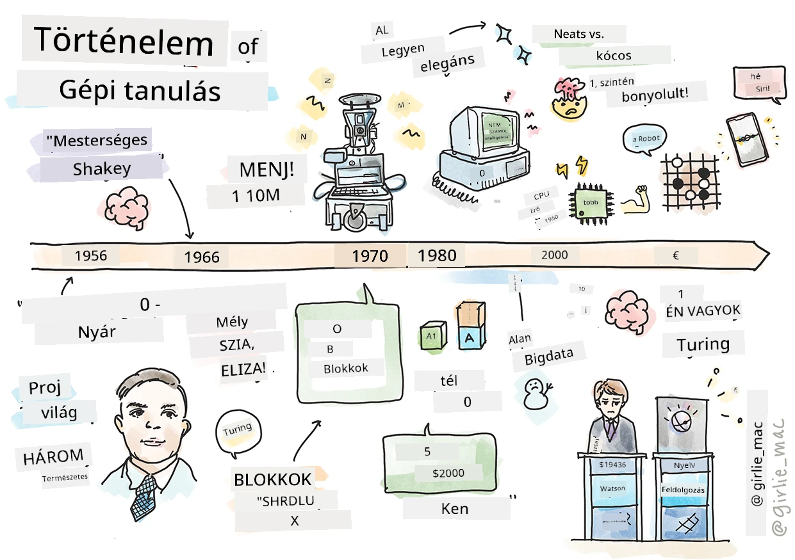
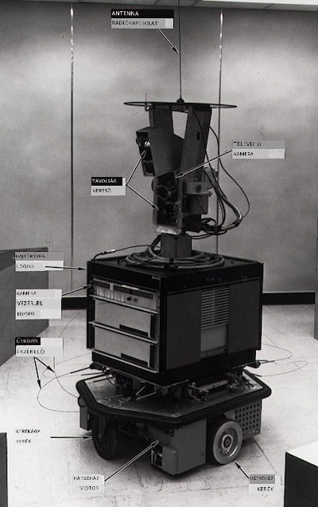
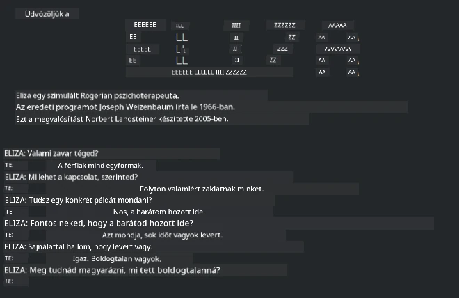

# A gépi tanulás története

> Sketchnote készítője: [Tomomi Imura](https://www.twitter.com/girlie_mac)

## [Előadás előtti kvíz](https://ff-quizzes.netlify.app/en/ml/)

---

> 🎥 Kattints a fenti képre egy rövid videó megtekintéséhez, amely végigvezet ezen az leckén.

Ebben a leckében végigjárjuk a gépi tanulás és a mesterséges intelligencia történetének fő mérföldköveit.

A mesterséges intelligencia (AI) mint tudományterület története összefonódik a gépi tanulás történetével, mivel az ML alapját képező algoritmusok és számítási fejlődések hozzájárultak az AI kifejlődéséhez. Hasznos felidézni, hogy bár ezek a területek különálló kutatási területekként az 1950-es években kezdtek kristályosodni, fontos [algoritmikus, statisztikai, matematikai, számítási és technikai felfedezések](https://wikipedia.org/wiki/Timeline_of_machine_learning) már megelőzték és átfedték ezt az időszakot. Valójában az emberek már [századok óta](https://wikipedia.org/wiki/History_of_artificial_intelligence) foglalkoznak ezekkel a kérdésekkel: ez a cikk a „gondolkodó gép” ötletének történelmi intellektuális alapjait tárgyalja.

---
## Jelentős felfedezések

- 1763, 1812 [Bayes-tétel](https://wikipedia.org/wiki/Bayes%27_theorem) és elődjei. Ez a tétel és alkalmazásai az indukció alapját képezik, leírva egy esemény valószínűségét előzetes ismeretek alapján.
- 1805 [Legkisebb négyzetek elmélete](https://wikipedia.org/wiki/Least_squares) a francia matematikus Adrien-Marie Legendre-től. Erről az elméletről a Regresszió egységünk során tanulsz, segíti az adatok illesztését.
- 1913 [Markov-láncok](https://wikipedia.org/wiki/Markov_chain), amelyeket az orosz matematikus Andrey Markovról neveztek el; egy korábbi állapot alapján leíró lehetséges események sorozatát ábrázolják.
- 1957 [Perceptron](https://wikipedia.org/wiki/Perceptron), az amerikai pszichológus Frank Rosenblatt által feltalált lineáris osztályozó, amely a mélytanulás fejlődésének alapját képezi.

---

- 1967 [Legközelebbi szomszéd](https://wikipedia.org/wiki/Nearest_neighbor), eredetileg útvonaltervezésre tervezett algoritmus. ML kontextusban mintázatok felismerésére használják.
- 1970 [Visszaterjesztés](https://wikipedia.org/wiki/Backpropagation), amelyet [előrecsatolt mesterséges neurális hálózatok](https://wikipedia.org/wiki/Feedforward_neural_network) tanítására használnak.
- 1982 [Rekurzív neurális hálózatok](https://wikipedia.org/wiki/Recurrent_neural_network), amelyek előrecsatolt hálózatokból származnak és időbeli gráfokat hoznak létre.

✅ Végezzen egy kis kutatást. Milyen egyéb dátumokat tartanak fontos mérföldkőnek az ML és AI történetében?

---
## 1950: Gondolkodó gépek

Alan Turing, egy igazán rendkívüli személy, akit [a közvélemény 2019-ben](https://wikipedia.org/wiki/Icons:_The_Greatest_Person_of_the_20th_Century) a 20. század legnagyobb tudósának választott, hozzájárult a „gondolkodni képes gép” koncepciójának alapjaihoz. Megküzdött a kételkedőkkel, valamint a fogalom empirikus bizonyításának szükségességével részben a [Turing-teszt](https://www.bbc.com/news/technology-18475646) megalkotásával, amelyet az NLP leckéink során fogsz megvizsgálni.

---
## 1956: Dartmouth nyári kutatási projekt

"A Dartmouth Nyári Kutatási Projekt a mesterséges intelligencia területén mérföldkő volt az AI tudományaként," és itt nevezték el a 'mesterséges intelligencia' kifejezést ([forrás](https://250.dartmouth.edu/highlights/artificial-intelligence-ai-coined-dartmouth)).

> Az intelligencia tanulási vagy bármely más aspektusa elvileg oly mértékben leírható, hogy egy gép képes legyen azt szimulálni.

---

Az esemény vezető kutatója, John McCarthy matematikaprofesszor azt remélte, „hogy az a feltételezés alapján haladhatunk, miszerint az intelligencia tanulási vagy bármilyen aspektusa elvileg oly pontosan leírható, hogy egy gép képes lehet azt szimulálni.” A résztvevők között szerepelt egy másik neves szakember, Marvin Minsky.

A műhely megkezdett és ösztönzött több vitát is, köztük „a szimbolikus módszerek térnyerését, korlátozott területekre fókuszált rendszereket (korai szakértői rendszerek), valamint a deduktív rendszerek és induktív rendszerek közötti eltéréseket.” ([forrás](https://wikipedia.org/wiki/Dartmouth_workshop)).

---
## 1956 - 1974: „Az aranykor”

Az 1950-es évektől egészen a '70-es évek közepéig nagy volt az optimizmus abban a reményben, hogy az AI sok problémát megoldhat. 1967-ben Marvin Minsky magabiztosan kijelentette, hogy „Egy generáción belül … az 'mesterséges intelligencia' létrehozásának problémája lényegében megoldásra kerül.” (Minsky, Marvin (1967), Computation: Finite and Infinite Machines, Englewood Cliffs, N.J.: Prentice-Hall)

A természetes nyelvfeldolgozás kutatása virágzott, a keresést finomították és hatékonyabbá tették, és létrejött a 'mikrovilágok' fogalma, ahol egyszerű feladatokat lehetett elvégezni közönséges nyelvi utasításokkal.

---

A kutatást kormányzati szervek jól finanszírozták, előrelépések történtek a számításelméletben és az algoritmusok terén, valamint intelligens gépek prototípusait építették. Ezek közül néhány gép:

* [Shakey, a robot](https://wikipedia.org/wiki/Shakey_the_robot), aki képes volt mozogni és intelligensen dönteni a feladatok végrehajtásáról.

    
    > Shakey 1972-ben

---

* Eliza, egy korai „csevegőbot”, aki képes volt emberekkel beszélgetni és primitív „terapeutaként” működni. Többet fogsz megtudni Elizáról az NLP leckékben.

    
    > Egy verziója Elizának, a chatbotnak

---

* A "blokkok világa" egy mikrovilág példa volt, ahol blokkokat lehetett egymásra rakni és rendezni, és kísérleteket végeztek a gépek döntéshozatali képességeinek tanítására. Az olyan könyvtárak, mint a [SHRDLU](https://wikipedia.org/wiki/SHRDLU), elősegítették a nyelvfeldolgozás fejlődését.

    

    > 🎥 Kattints a fenti képre egy videó megtekintéséhez: Blokkok világa a SHRDLU-val

---
## 1974 - 1980: „AI tél”

A '70-es évek közepére nyilvánvalóvá vált, hogy az „intelligens gépek” létrehozásának komplexitását alábecsülték, és hogy annak ígérete a rendelkezésre álló számítási kapacitás mellett túlzottan optimista volt. A finanszírozás elfogyott, és a terület iránti bizalom alábbhagyott. Néhány probléma, amely csökkentette a bizalmat:
---
- **Korlátozások**. A számítási kapacitás túl korlátozott volt.
- **Kombinatorikus robbanás**. Az edzéshez szükséges paraméterek száma exponenciálisan nőtt, miközben a számítási kapacitás és képességek nem fejlődtek párhuzamosan.
- **Adathiány**. Hiányoztak az adatok, ami gátolta az algoritmusok tesztelését, fejlesztését és finomítását.
- **Jó kérdéseket teszünk fel?**. Maga a kérdés is megkérdőjeleződött. A kutatók kritikát kaptak megközelítéseik miatt:
  - A Turing-tesztet megkérdőjelezték többek között a 'kínai szobás elmélet' által, amely szerint „egy digitális számítógép programozása úgy tűnhet, mintha értené a nyelvet, de nem képes valódi megértésre.” ([forrás](https://plato.stanford.edu/entries/chinese-room/))
  - A mesterséges intelligenciák, mint például az „Eliza” terapeuta bevezetésének etikája társadalmi vitákat váltott ki.

---

Ugyanakkor különböző AI filozófiai iskolák kezdtek kialakulni. Kialakult egy kettősség a ["rendetlen" vs. "rendezett AI"](https://wikipedia.org/wiki/Neats_and_scruffies) gyakorlatok között. A _rendetlen_ laborok hosszú órákon át finomították a programokat, amíg a kívánt eredményt el nem érték. A _rendezett_ laborok „a logikára és a formális problémamegoldásra összpontosítottak”. Az Eliza és a SHRDLU jól ismert _rendetlen_ rendszerek voltak. Az 1980-as években, amikor igény mutatkozott az ML rendszerek reprodukálhatóságára, a _rendezett_ megközelítés fokozatosan előtérbe került, mivel eredményei jobban magyarázhatóak.

---
## 1980-as évek Szakértői rendszerek

Ahogy a terület növekedett, üzleti hasznossága egyre világosabbá vált, és az 1980-as években elterjedtek a „szakértői rendszerek”. „A szakértői rendszerek voltak az első valóban sikeres mesterséges intelligencia (AI) szoftverformák között.” ([forrás](https://wikipedia.org/wiki/Expert_system)).

Ez a típus valójában _hibrid_, részben egy szabálymotorból áll, amely az üzleti követelményeket határozza meg, és egy következtető motorból, amely a szabályrendszert használva új tényeket állapít meg.

Ebben az időszakban nőtt a neurális hálózatok iránti figyelem.

---
## 1987 - 1993: AI „korszakalkony”

A speciális szakértői rendszerek hardverének elterjedése sajnálatos módon túlspecializálódáshoz vezetett. A személyi számítógépek térnyerése versenyre kelt ezekkel a nagy, speciális, központosított rendszerekkel. A számítástechnika demokratizálódása megkezdődött, és végül megalapozta a nagy adatok modern robbanását.

---
## 1993 - 2011

Ebben az időszakban új korszak kezdődött az ML és AI számára, hogy képesek legyenek megoldani azokat a problémákat, amelyeket korábban az adat- és számítási kapacitás hiánya okozott. Az adatok mennyisége gyorsan nőtt és egyre szélesebb körben volt elérhető, akár jó, akár rossz értelemben, különösen a 2007 körüli okostelefonok megjelenésével. A számítási kapacitás exponenciálisan nőtt, és az algoritmusok is fejlődtek párhuzamosan. A terület éretté vált, mivel a korábbi szabadabban szerveződő napok valódi diszciplínává kristályosodtak.

---
## Most

Ma a gépi tanulás és az AI szinte minden életünk részét megérinti. Ez az időszak megköveteli ezeknek az algoritmusoknak az emberi életre gyakorolt kockázatainak és potenciális hatásainak körültekintő megértését. Ahogy Brad Smith a Microsofttól fogalmazott: „Az információtechnológia olyan kérdéseket vet fel, amelyek az alapvető emberi jogok, mint a magánélet és a szólásszabadság védelmének szívéhez nyúlnak. Ezek a kérdések növelik a felelősséget azokat a termékeket létrehozó technológiai cégek számára. Véleményünk szerint ezek átgondolt kormányzati szabályozást és az elfogadható felhasználás normáinak kialakítását is igénylik” ([forrás](https://www.technologyreview.com/2019/12/18/102365/the-future-of-ais-impact-on-society/)).

---

Még nem ismert, mit hoz a jövő, de fontos megérteni ezeket a számítógépes rendszereket, valamint a rajtuk futó szoftvereket és algoritmusokat. Reméljük, hogy ez a tananyag segít jobban megérteni ezeket, hogy te magad dönthess.

> 🎥 Kattints a fenti képre egy videóért: Yann LeCun a mélytanulás történetéről beszél ebben az előadásban

---
## 🚀Kihívás

Merülj el valamelyik történelmi pillanatban és ismerd meg jobban az őket meghatározó embereket. Lenfűgöző személyiségek, és egyetlen tudományos felfedezés sem született kulturális vákuumban. Mit fedezel fel?

## [Előadás utáni kvíz](https://ff-quizzes.netlify.app/en/ml/)

---
## Áttekintés & Önálló tanulás

Íme néhány megtekintendő és meghallgatandó anyag:

[Ez a podcast, ahol Amy Boyd az AI fejlődéséről beszél](http://runasradio.com/Shows/Show/739)

---

## Feladat

[Idővonal készítése](assignment.md)

---

<!-- CO-OP TRANSLATOR DISCLAIMER START -->
**Jogi nyilatkozat**:
Ez a dokumentum az AI fordítási szolgáltatás, a [Co-op Translator](https://github.com/Azure/co-op-translator) segítségével készült. Bár az pontosságra törekszünk, kérjük, vegye figyelembe, hogy az automatikus fordítások hibákat vagy pontatlanságokat tartalmazhatnak. Az eredeti dokumentum az anyanyelvén tekintendő hiteles forrásnak. Fontos információk esetén professzionális emberi fordítást javasolunk. Nem vállalunk felelősséget semmilyen félreértésért vagy téves értelmezésért, amely ebből a fordításból ered.
<!-- CO-OP TRANSLATOR DISCLAIMER END -->