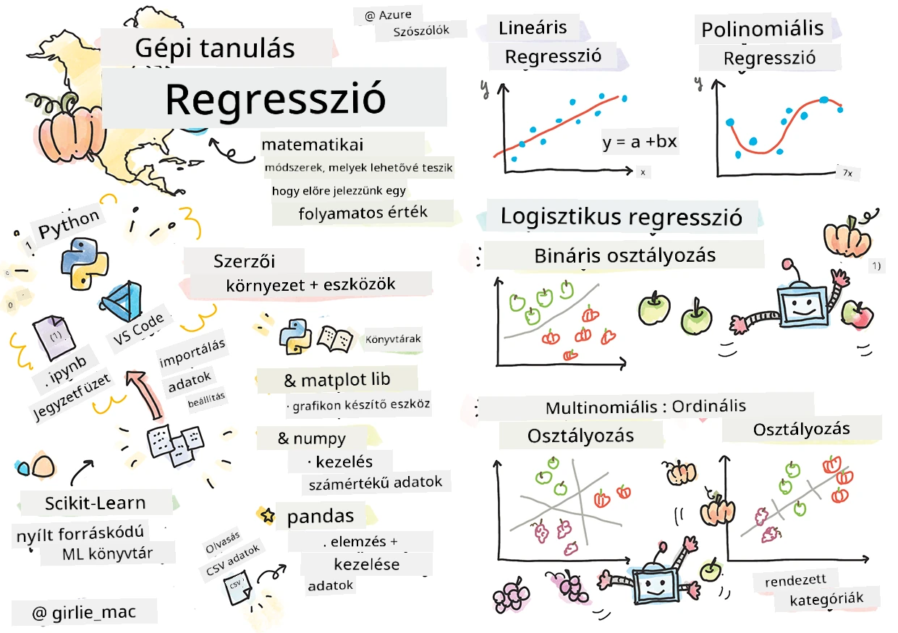
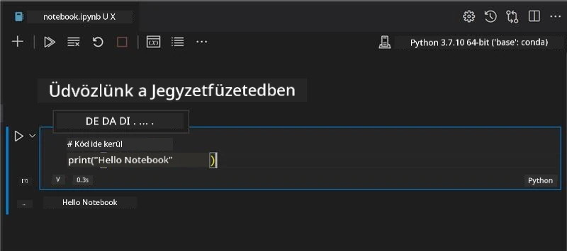
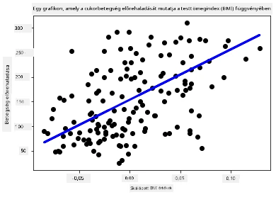

# Kezdjünk neki a Python és a Scikit-learn használatának regressziós modellekhez



> Sketchnote készítette [Tomomi Imura](https://www.twitter.com/girlie_mac)

## [Előadás előtti kvíz](https://ff-quizzes.netlify.app/en/ml/)

> ### [Ez az óra elérhető R-ben is!](../../../../2-Regression/1-Tools/solution/R/lesson_1.html)

## Bevezetés

Ezekben a négy leckében megismered, hogyan kell regressziós modelleket építeni. Hamarosan megbeszéljük, mire valók ezek. De mielőtt bármit is tennél, győződj meg róla, hogy a megfelelő eszközök telepítve vannak a folyamat elindításához!

Ebben a leckében megtanulod, hogyan kell:

- Konfigurálni a számítógépedet helyi gépi tanulási feladatokhoz.
- Jupyter Notebookokkal dolgozni.
- Használni a Scikit-learn könyvtárat, beleértve annak telepítését is.
- Felfedezni a lineáris regressziót egy gyakorlati feladaton keresztül.

## Telepítések és beállítások

[](https://youtu.be/-DfeD2k2Kj0 "Gépi tanulás kezdőknek - Állítsd be az eszközeidet a gépi tanulási modellek építéséhez")

> 🎥 Kattints a fenti képre egy rövid videó megtekintéséhez, amely végigvezet a számítógép gépi tanuláshoz való beállításán.

1. **Telepítsd a Pythont**. Ellenőrizd, hogy [Python](https://www.python.org/downloads/) telepítve van-e a számítógépeden. A Python sok adat tudományi és gépi tanulási feladathoz szükséges. A legtöbb rendszer már tartalmaz Python telepítést. Elérhetők hasznos [Python fejlesztőkészletek](https://code.visualstudio.com/learn/educators/installers?WT.mc_id=academic-77952-leestott) is, melyek megkönnyítik a beállítást egyes felhasználók számára.

   A Python egyes felhasználási módjai egy adott verziót igényelnek, míg mások mást. Emiatt hasznos egy [virtuális környezetben](https://docs.python.org/3/library/venv.html) dolgozni.

2. **Telepítsd a Visual Studio Code-ot**. Győződj meg róla, hogy telepítve van a Visual Studio Code a számítógépeden. Kövesd az [Visual Studio Code telepítési útmutatóját](https://code.visualstudio.com/) az alap telepítéshez. A tanfolyamban Python kódot a Visual Studio Code-ban fogsz írni, ezért érdemes átnézni, hogyan kell [Visual Studio Code-ot beállítani Python fejlesztéshez](https://docs.microsoft.com/learn/modules/python-install-vscode?WT.mc_id=academic-77952-leestott).

   > Ismerkedj meg alaposan a Python használatával az alábbi [tanulási modulok](https://docs.microsoft.com/users/jenlooper-2911/collections/mp1pagggd5qrq7?WT.mc_id=academic-77952-leestott) segítségével.
   >
   > [](https://youtu.be/yyQM70vi7V8 "Python beállítása Visual Studio Code-ban")
   >
   > 🎥 Kattints a fenti képre egy videó megtekintéséhez: Python használata VS Code-ban.

3. **Telepítsd a Scikit-learn könyvtárat**, az [itt található utasítások](https://scikit-learn.org/stable/install.html) alapján. Mivel Python 3-at kell használnod, ajánlott virtuális környezetet használni. Megjegyzés: ha M1 Mac-en telepíted ezt a könyvtárat, külön utasítások vannak a fenti linken.

1. **Telepítsd a Jupyter Notebookot**. Szükséged lesz a [Jupyter csomag telepítésére](https://pypi.org/project/jupyter/).

## A gépi tanulási fejlesztőkörnyezeted

A Python kód fejlesztéséhez és gépi tanulási modellek létrehozásához **notebookokat** fogsz használni. Ez a fájltípus gyakori eszköz az adattudósok között, jelölése a `.ipynb` kiterjesztés.

A notebookok interaktív környezetet biztosítanak, ahol a fejlesztő egyszerre tud kódolni és jegyzeteket, dokumentációt írni a kód köré, ami különösen hasznos kísérleti vagy kutatási projektekben.

[](https://youtu.be/7E-jC8FLA2E "Gépi tanulás kezdőknek - Jupyter Notebookok beállítása regressziós modellekhez")

> 🎥 Kattints a fenti képre egy rövid videó megtekintéséhez, amely végigvezet ezen a gyakorlaton.

### Gyakorlat - dolgozz egy notebookkal

Ebben a mappában megtalálod a _notebook.ipynb_ fájlt.

1. Nyisd meg a _notebook.ipynb_ fájlt a Visual Studio Code-ban.

   Egy Jupyter szerver elindul Python 3+ környezetben. Láthatsz majd notebook cellákat, amelyek kódblokkok, ezeket lehet `futtatni`. Egy kódblokk futtatásához válaszd a lejátszás gomb ikont.

1. Válaszd ki az `md` ikont és adj hozzá egy kis markdown szöveget, például a következőt: **# Üdvözöl a notebookod**.

   Ezután adj hozzá egy kis Python kódot.

1. Gépeld be a **print('hello notebook')** parancsot a kódblokkba.
1. Kattints a nyílra a kód futtatásához.

   Látnod kell a kinyomtatott üzenetet:

    ```output
    hello notebook
    ```



Kódod kommentekkel gazdagíthatod, hogy a notebook dokumentált legyen.

✅ Gondolkodj el egy percre, mennyire más a webfejlesztő és az adattudós munkakörnyezete.

## Kész a Scikit-learn használatra

Most, hogy a Python helyileg be van állítva és kényelmesen használod a Jupyter Notebookokat, ismerkedjünk meg a Scikit-learn könyvtárral is (kiejtve: "szájkit", mint a "science"). A Scikit-learn egy [kiterjedt API-t](https://scikit-learn.org/stable/modules/classes.html#api-ref) biztosít a gépi tanulási feladatok elvégzéséhez.

A [honlapjuk](https://scikit-learn.org/stable/getting_started.html) szerint: "A Scikit-learn egy nyílt forráskódú gépi tanulási könyvtár, amely támogatja a felügyelt és felügyelet nélküli tanulást. Emellett különböző eszközöket kínál modellillesztéshez, adat-előkészítéshez, modellválasztáshoz és kiértékeléshez, valamint sok más hasznos funkciót."

Ebben a tanfolyamban a Scikit-learn és egyéb eszközök segítségével gépi tanulási modelleket építünk, elsősorban a hagyományos gépi tanulásra fókuszálva. Szándékosan kerüljük a neurális hálózatokat és mélytanulást, mivel ezek egy külön 'Mesterséges intelligencia kezdőknek' tananyagban lesznek részletesebben tárgyalva.

A Scikit-learn segítségével egyszerű modelleket építhetsz és kiértékelhetsz használatra. Elsősorban numerikus adatokat kezel és több beépített mintaadatot tartalmaz tanulási eszközként. Emellett van előre elkészített modellje is, amit a diákok kipróbálhatnak. Először nézzük meg, hogyan tölthetünk be beépített adatokat és használhatjuk beépített eldöntő modellt egy egyszerű gépi tanulási feladathoz.

## Gyakorlat - az első Scikit-learn notebookod

> Ez az oktatóanyag a [lineáris regresszió példájából](https://scikit-learn.org/stable/auto_examples/linear_model/plot_ols.html#sphx-glr-auto-examples-linear-model-plot-ols-py) származik a Scikit-learn honlapjáról.


[](https://youtu.be/2xkXL5EUpS0 "Gépi tanulás kezdőknek - Az első lineáris regressziós projekted Pythonban")

> 🎥 Kattints a fenti képre az ehhez a feladathoz készült rövid videóért.

A _notebook.ipynb_ fájlban, amely ehhez az órához tartozik, törölj minden cellát a 'kuka' ikon használatával.

Ebben a részben egy kis, a cukorbetegséggel kapcsolatos mintaadattal dolgozol majd, amely a Scikit-learnbe be van építve tanulási célokra. Képzeld el, hogy egy kezelési módszert szeretnél tesztelni cukorbetegeknél. A gépi tanulási modellek segíthetnek meghatározni, mely páciensek reagálnak jobban a kezelésre, az egyes változók kombinációi alapján. Egy nagyon egyszerű regressziós modell, ha vizualizálod, információt nyújthat azokról a változókról, amik segíthetnek a klinikai kísérletek elméleti tervezésében.

✅ Sokféle regressziós módszer létezik, és hogy melyiket választod, attól függ, milyen választ keresel. Ha például előre akarod jelezni egy adott korú személy várható magasságát, lineáris regressziót használsz, mert **numerikus értéket** keresel. Ha viszont azt akarod megtudni, hogy egy konyha vegan kategóriába esik-e vagy sem, **kategória-besorolásra** van szükséged, ezért logisztikus regressziót alkalmaznád. A logisztikus regressziót később részletesebben megismered. Gondolkodj el azon, milyen kérdéseket tehetsz fel az adatoknak, és melyik módszer lenne megfelelőbb.

Kezdjünk neki a feladatnak.

### Könyvtárak importálása

Ehhez a feladathoz néhány könyvtárat importálunk:

- **matplotlib**. Egy hasznos [grafikus eszköz](https://matplotlib.org/), amit vonaldiagram készítéséhez fogunk használni.
- **numpy**. A [numpy](https://numpy.org/doc/stable/user/whatisnumpy.html) egy hasznos könyvtár számadatok kezeléséhez Pythonban.
- **sklearn**. Ez a [Scikit-learn](https://scikit-learn.org/stable/user_guide.html) könyvtár.

Importálj néhány könyvtárat a feladat elvégzéséhez.

1. Add hozzá az importokat a következő kód beírásával:

   ```python
   import matplotlib.pyplot as plt
   import numpy as np
   from sklearn import datasets, linear_model, model_selection
   ```

   Fent a `matplotlib`, `numpy` könyvtárakat importálod, továbbá a `datasets`, `linear_model` és `model_selection` modulokat a `sklearn`-ből. A `model_selection` a tanító és teszt adathalmazok szétválasztására szolgál.

### A cukorbetegség adatállomány

A beépített [cukorbetegség adatállomány](https://scikit-learn.org/stable/datasets/toy_dataset.html#diabetes-dataset) 442 mintából áll, 10 jellemző változóval, amelyek közül néhány:

- kor: életkor években
- bmi: testtömeg-index
- bp: átlagos vérnyomás
- s1 tc: T-sejtek (egyféle fehérvérsejt)

✅ Ez az adathalmaz tartalmazza a 'nem' fogalmát is, mint fontos jellemzőt a cukorbetegséggel kapcsolatos kutatásokban. Sok orvosi adathalmaz tartalmaz ilyen bináris besorolásokat. Gondolkodj el, hogyan zárhatnak ki bizonyos kategóriák ilyen osztályozások miatt népességcsoportokat a kezelésekből.

Most töltsd be az X és y adathalmazokat.

> 🎓 Ne feledd, ez felügyelt tanulás, nekünk egy nevesített, 'y' célváltozóra van szükségünk.

Egy új kódcella segítségével töltsd be a cukorbetegség adatállományt `load_diabetes()` hívásával. A `return_X_y=True` paraméter jelzi, hogy `X` adatmátrix lesz, míg az `y` a regressziós célérték.

1. Adj néhány print parancsot az adatmátrix alakjának és első elemének megjelenítésére:

    ```python
    X, y = datasets.load_diabetes(return_X_y=True)
    print(X.shape)
    print(X[0])
    ```

    Amit visszakapsz válaszként, az egy tuple. Amit csinálsz, hogy a tuple első két elemét az `X` és `y` változókhoz rendeld. Tudj meg többet a [tuple-ökről](https://wikipedia.org/wiki/Tuple).

    Láthatod, hogy ez az adatállomány 442 elemből áll, melyek 10 elemes tömbökbe vannak rendezve:

    ```text
    (442, 10)
    [ 0.03807591  0.05068012  0.06169621  0.02187235 -0.0442235  -0.03482076
    -0.04340085 -0.00259226  0.01990842 -0.01764613]
    ```

    ✅ Gondolkodj el az adatok és a regressziós célérték kapcsolatán. A lineáris regresszió az X jellemző és y célváltozó közötti kapcsolatokat becsüli meg. Meg tudod találni a [célt](https://scikit-learn.org/stable/datasets/toy_dataset.html#diabetes-dataset) a cukorbetegség adatállomány dokumentációjában? Mit mutat be ez az adatállomány a cél alapján?

2. Ezután válassz ki egy részt az adatállományból a 3. oszlop kiválasztásával. Ezt úgy teheted meg, hogy az összes sort kiválasztod a `:` operátorral, majd az index (2) segítségével a 3. oszlopot. Az adatot átalakíthatod 2D tömbbé, amire szükség van a megjelenítéshez, a `reshape(n_rows, n_columns)` függvénnyel. Ha egy paraméter értéke -1, annak megfelelő dimenziót automatikusan kiszámítja a rendszer.

   ```python
   X = X[:, 2]
   X = X.reshape((-1,1))
   ```

   ✅ Bármikor nyomtasd ki az adatot, hogy ellenőrizd az alakját.

3. Most, hogy készen áll az adat a megjelenítésre, nézd meg, segíthet-e egy gép logikus elválasztást találni az adatok között. Ehhez mind az X adatokat, mind az y célértékeket fel kell osztani teszt és tanító adathalmazokra. A Scikit-learn egyszerű megoldást kínál erre: a tesztadatokat egy adott pontnál szeletelheted.

   ```python
   X_train, X_test, y_train, y_test = model_selection.train_test_split(X, y, test_size=0.33)
   ```

4. Most már készen állsz a modell edzésére! Töltsd be a lineáris regressziós modellt és edzd az X és y tanító adatokkal a `model.fit()` segítségével:

    ```python
    model = linear_model.LinearRegression()
    model.fit(X_train, y_train)
    ```

    ✅ A `model.fit()` olyan függvény, amely sok ML könyvtárban, például a TensorFlow-ban is megtalálható.

5. Ezután készíts előrejelzést a tesztadatok alapján a `predict()` függvénnyel. Ezt a modellt felhasználhatod, hogy a modell által képzett adatcsoportok közé a legmegfelelőbb helyre vonalat rajzolj.

    ```python
    y_pred = model.predict(X_test)
    ```

6. Most jelenítsd meg az adatokat egy ábrán. A Matplotlib nagyon hasznos eszköz erre. Készíts szórásdiagramot az összes X és y tesztadatról, és a predikció segítségével húzz vonalat a modell adatcsoportjai közé, ahol az a leglogikusabb.

    ```python
    plt.scatter(X_test, y_test,  color='black')
    plt.plot(X_test, y_pred, color='blue', linewidth=3)
    plt.xlabel('Scaled BMIs')
    plt.ylabel('Disease Progression')
    plt.title('A Graph Plot Showing Diabetes Progression Against BMI')
    plt.show()
    ```

   


   ✅ Gondolkodj egy kicsit azon, mi is történik itt. Egy egyenes vonal halad keresztül sok kis adatponton, de pontosan mit is csinál? Látod, hogyan használhatod ezt a vonalat annak előrejelzésére, hogy egy új, még nem látott adatpont hol illeszkedjen az ábra y tengelyéhez képest? Próbáld meg szavakba önteni ennek a modellnek a gyakorlati hasznát.

Gratulálunk, elkészítetted az első lineáris regressziós modelledet, készítettél vele előrejelzést, és meg is jelenítettél egy ábrán!

---
## 🚀Kihívás

Ábrázolj egy másik változót ebből az adathalmazból. Tipp: szerkeszd ezt a sort: `X = X[:,2]`. Tekintettel az adathalmaz célváltozójára, mit tudsz felfedezni a cukorbetegség betegségként való lefolyásáról?
## [Előadás utáni kvíz](https://ff-quizzes.netlify.app/en/ml/)

## Áttekintés és önálló tanulás

Ebben a bemutatóban egyszerű lineáris regresszióval dolgoztál, nem egyszereplős vagy többváltozós lineáris regresszióval. Olvass kicsit ezeknek a módszereknek a különbségeiről, vagy nézd meg ezt a [videót](https://www.coursera.org/lecture/quantifying-relationships-regression-models/linear-vs-nonlinear-categorical-variables-ai2Ef)

Olvass többet a regresszió fogalmáról, és gondolkodj el rajta, hogy milyen kérdésekre tud választ adni ez a technika. Végezd el ezt a [gyakorlati útmutatót](https://docs.microsoft.com/learn/modules/train-evaluate-regression-models?WT.mc_id=academic-77952-leestott), hogy mélyebb ismeretekre tegyél szert.

## Feladat

[Egy másik adathalmaz](assignment.md)

---

<!-- CO-OP TRANSLATOR DISCLAIMER START -->
**Jogi nyilatkozat**:
Ez a dokumentum az AI fordítási szolgáltatás, a [Co-op Translator](https://github.com/Azure/co-op-translator) segítségével készült. Bár az pontosságra törekszünk, kérjük, vegye figyelembe, hogy az automatikus fordítások hibákat vagy pontatlanságokat tartalmazhatnak. Az eredeti dokumentum az anyanyelvén tekintendő hiteles forrásnak. Fontos információk esetén professzionális emberi fordítást javasolunk. Nem vállalunk felelősséget semmilyen félreértésért vagy téves értelmezésért, amely ebből a fordításból ered.
<!-- CO-OP TRANSLATOR DISCLAIMER END -->