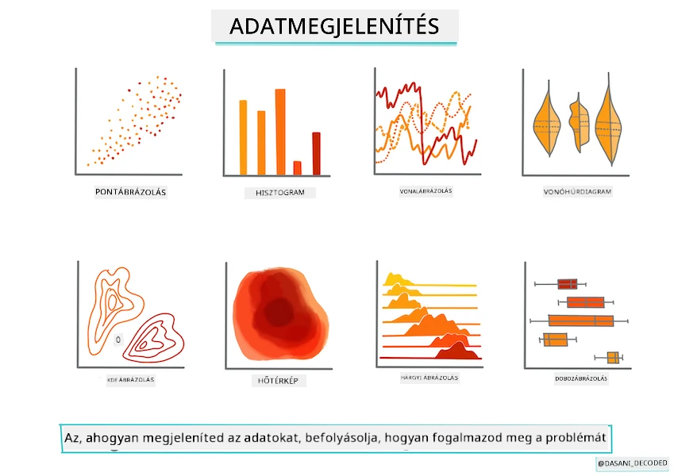
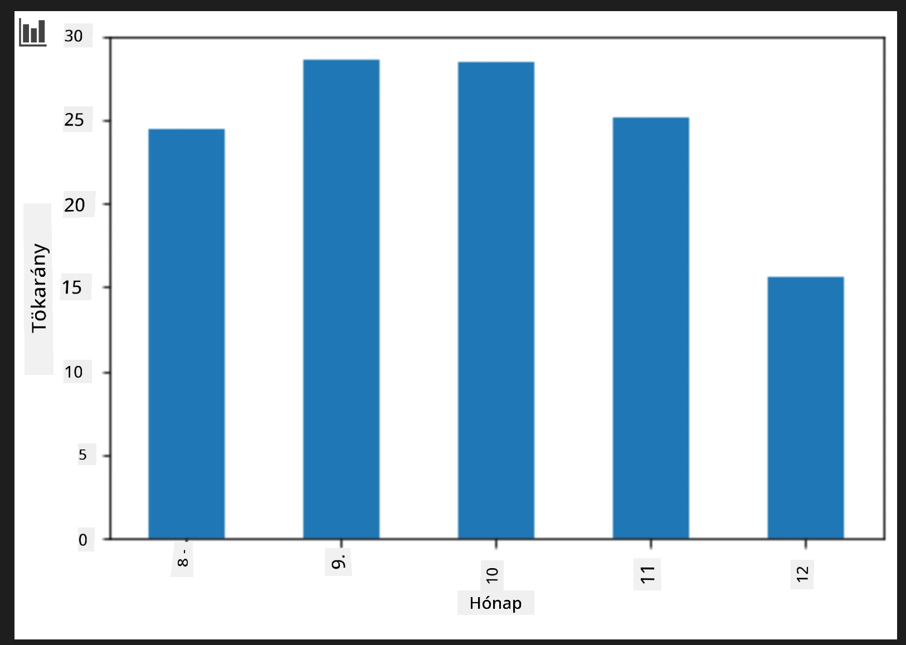
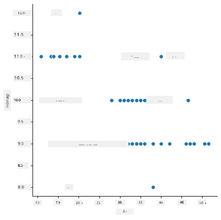
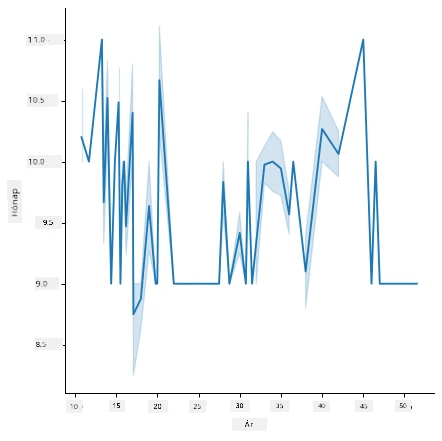
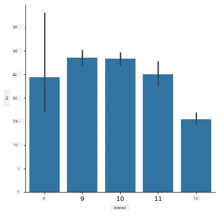
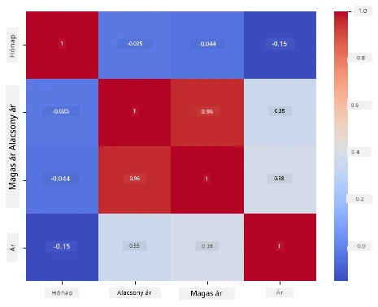

# Regressziós modell építése Scikit-learn segítségével: adatok előkészítése és vizualizálása



Infografika készítője: [Dasani Madipalli](https://twitter.com/dasani_decoded)

## [Előadás előtti kvíz](https://ff-quizzes.netlify.app/en/ml/)

> ### [Ez a lecke elérhető R-ben is!](../../../../2-Regression/2-Data/solution/R/lesson_2.html)

## Bevezetés

Most, hogy készen állsz a szükséges eszközökkel a gépi tanulási modellek építésének elkezdéséhez Scikit-learn segítségével, ideje elkezdeni kérdéseket feltenni az adataidnak. Amint dolgozol az adatokkal és alkalmazod az ML megoldásokat, nagyon fontos megérteni, hogyan kell megfelelő kérdést feltenni az adatbázisod potenciáljának felszabadításához.

Ebben a leckében megtanulod:

- Hogyan készítsd elő az adataidat a modellépítéshez.
- Hogyan használd a Matplotlib-et az adatok vizualizációjához.
- Hogyan használd a Seaborn-t kifejezőbb adatvizualizációhoz.

## A helyes kérdés feltevése az adataiddal kapcsolatban

A megválaszolandó kérdés meghatározza, hogy milyen típusú ML algoritmusokat fogsz használni. És a válasz minősége jelentősen függ az adatok természetétől.

Nézd meg a [leckéhez adott adatokat](https://github.com/microsoft/ML-For-Beginners/blob/main/2-Regression/data/US-pumpkins.csv). Megnyithatod ezt a .csv fájlt VS Code-ban. Egy gyors átfutás azonnal mutatja, hogy vannak üres mezők, és vegyesen szerepelnek sztring és numerikus adatok. Van egy furcsa oszlop is 'Package' néven, ahol az adatok között 'zsákok', 'ládák' és más értékek is szerepelnek. Az adatok valójában eléggé rendezetlenek.

[](https://youtu.be/5qGjczWTrDQ "ML kezdőknek - Hogyan elemezz és tisztíts egy adatbázist")

> 🎥 Kattints a fenti képre egy rövid videóért, amely végigvezet az adatok előkészítésén ehhez a leckéhez.

Valójában nem gyakori, hogy egy teljesen kész, azonnal használható adatbázist kapjunk egy ML modell létrehozásához. Ebben a leckében megtanulod, hogyan készíts elő egy nyers adatbázist szabványos Python könyvtárak használatával. Megtanulsz különféle technikákat is az adatok vizualizálására.

## Esettanulmány: 'a tökpiac'

Ebben a mappában található egy .csv fájl a gyökér `data` mappában, amelynek neve [US-pumpkins.csv](https://github.com/microsoft/ML-For-Beginners/blob/main/2-Regression/data/US-pumpkins.csv), és tartalmaz 1757 sort a tökpiac adatairól, városonként csoportosítva. Ez nyers adat az Egyesült Államok Mezőgazdasági Minisztériuma által közzétett [Specialty Crops Terminal Markets Standard Reports](https://www.marketnews.usda.gov/mnp/fv-report-config-step1?type=termPrice) adatforrásból.

### Az adatok előkészítése

Ezek az adatok közkinccsé váltak. Sok különálló fájlban tölthetők le, városonként az USDA weboldaláról. Azért, hogy ne legyen túl sok külön fájl, az összes városi adatot egy táblázatba fűztük össze, tehát már részben _előkészítettük_ az adatokat. Ezután nézzük meg közelebbről az adatokat.

### A tökadatok – első következtetések

Mit veszel észre ezekről az adatokról? Már láttad, hogy vegyesen vannak benne szöveges értékek, számok, üres cellák és furcsa értékek, amelyeket értelmezni kell.

Milyen kérdést tehetnél fel ezeknek az adatoknak regressziós módszerrel? Például: "Milyen az adott hónapra vonatkozó tök ára?". Ha újra megnézed az adatokat, van néhány módosítás, amelyet el kell végezni, hogy létrehozd a feladathoz szükséges adatszerkezetet.
## Gyakorlat – elemezd a tök adatokat

Használjuk a [Pandas](https://pandas.pydata.org/)-t (a neve a `Python Data Analysis` szavakból ered), amely nagyon hasznos eszköz az adatok alakítására, hogy elemezzük és előkészítsük ezt a tök adatbázist.

### Először, ellenőrizd a hiányzó dátumokat

Először meg kell tenned a hiányzó dátumok ellenőrzésének lépéseit:

1. Alakítsd át a dátumokat hónap formátumra (az adatok amerikai dátumformátumúak, vagyis `HH/NN/ÉÉÉÉ`).
2. Válogasd ki a hónapokat egy új oszlopba.

Nyisd meg a _notebook.ipynb_ fájlt a Visual Studio Code-ban, és importáld az adatokat egy új Pandas dataframe-be.

1. Használd a `head()` függvényt az első öt sor megtekintéséhez.

    ```python
    import pandas as pd
    pumpkins = pd.read_csv('../data/US-pumpkins.csv')
    pumpkins.head()
    ```

    ✅ Milyen függvényt használnál az utolsó öt sor megtekintéséhez?

1. Ellenőrizd, hogy van-e hiányzó adat a jelenlegi dataframe-ben:

    ```python
    pumpkins.isnull().sum()
    ```

    Van hiányzó adat, de lehet, hogy nem számít a feladat szempontjából.

1. Hogy könnyebb legyen a munkád a dataframe-vel, válaszd ki csak azokat az oszlopokat, amikre szükséged van, a `loc` függvény segítségével, amely az eredeti dataframe-ből kiválaszt egy csoport sort (az első paraméterként átadott) és oszlopot (a második paraméter). Az alábbi `:` kifejezés minden sort jelent.

    ```python
    columns_to_select = ['Package', 'Low Price', 'High Price', 'Date']
    pumpkins = pumpkins.loc[:, columns_to_select]
    ```

### Másodszor, határozd meg a tök átlagárát

Gondold át, hogyan lehet meghatározni a tök átlagárát adott hónapban. Milyen oszlopokat választanál ehhez? Tipp: 3 oszlopra lesz szükséged.

Megoldás: számítsd ki a `Low Price` és `High Price` oszlopok átlagát az új Price oszlop feltöltéséhez, és alakítsd a Date oszlopot úgy, hogy csak a hónapot mutassa. Szerencsére, az előbbi ellenőrzés szerint nincs hiányzó adat a dátumok vagy az árak esetében.

1. Az átlag kiszámításához add hozzá a következő kódot:

    ```python
    price = (pumpkins['Low Price'] + pumpkins['High Price']) / 2

    month = pd.DatetimeIndex(pumpkins['Date']).month

    ```

   ✅ Nyugodtan használd a `print(month)` parancsot, ha szeretnéd az adatokat ellenőrizni.

2. Most másold át az átalakított adatot egy új Pandas dataframe-be:

    ```python
    new_pumpkins = pd.DataFrame({'Month': month, 'Package': pumpkins['Package'], 'Low Price': pumpkins['Low Price'],'High Price': pumpkins['High Price'], 'Price': price})
    ```

    Ha kinyomtatod a dataframe-ed, egy tiszta, rendezett adatbázist fogsz látni, amely alapján építheted a regressziós modelledet.

### De várj! Valami furcsa van itt

Ha megnézed a `Package` oszlopot, a tökök sokféle formációban vannak eladva. Egyeseket '1 1/9 bushel' mértékben árulják, másokat '1/2 bushel' egységekben, egyeseket darabonként, másokat fontonként, és vannak nagy dobozok is különféle szélességekkel.

> A tökök súlyának következetes mérése elég nehéznek tűnik

Az eredeti adatokat vizsgálva érdekes, hogy ahol a `Unit of Sale` 'EACH' vagy 'PER BIN', ott a `Package` típus inch-ben, ládában vagy darabonként van megadva. Egyértelmű, hogy a tökök súlyának következetes mérése nehéz, ezért szűrjük az adatokat úgy, hogy csak azok a tökök legyenek benne, amelyek `Package` oszlopában szerepel a 'bushel'.

1. Adj hozzá egy szűrőt a fájl tetején, a kezdeti .csv import után:

    ```python
    pumpkins = pumpkins[pumpkins['Package'].str.contains('bushel', case=True, regex=True)]
    ```

    Ha most kinyomtatod az adatokat, láthatod, hogy csak körülbelül 415 sort kapsz, amelyek bushel-ben mért tököket tartalmaznak.

### De várj még! Van még egy teendő

Észrevetted, hogy a bushel mértéke soronként változik? Normalizálnod kell az árakat, hogy bushelre vonatkozó árat mutassanak, ezért végezz néhány számítást az egységesítéshez.

1. Add hozzá ezeket a sorokat az új_pumpkins dataframe létrehozása utáni blokkhoz:

    ```python
    new_pumpkins.loc[new_pumpkins['Package'].str.contains('1 1/9'), 'Price'] = price/(1 + 1/9)

    new_pumpkins.loc[new_pumpkins['Package'].str.contains('1/2'), 'Price'] = price/(1/2)
    ```

✅ A [The Spruce Eats](https://www.thespruceeats.com/how-much-is-a-bushel-1389308) szerint egy bushel súlya a termény típusától függ, mivel ez térfogati mértékegység. "Egy bushel paradicsom például 56 fontot kell, hogy nyomjon... A levelek és zöldek nagyobb helyet foglalnak el, kevesebb súly mellett, így a spenót bushel-je csak 20 font." Mindez elég bonyolult! Ne foglalkozzunk bushel-ről fontra való átváltással, az árazást tegyük bushel alapján. Mindenesetre ez a tök bushel-ek vizsgálata is rámutat arra, mennyire fontos megérteni az adataid természetét!

Most elemezheted az egységárakat a bushel mérték alapján. Ha még egyszer kiírod az adatokat, láthatod, hogyan szabványosítottuk őket.

✅ Észrevetted, hogy a fél bushel-ben árult tökök nagyon drágák? Meg tudod fejteni, miért? Tipp: a kicsi tökök sokkal drágábbak, valószínűleg azért, mert egy bushelben sokkal több van belőlük, szemben azzal, hogy egy nagy üreges sütőtök sok helyet foglal.

## Vizualizációs stratégiák

Az adatkutatók szerepének része, hogy bemutassák a kezelt adatok minőségét és természetét. Ennek érdekében gyakran készítenek érdekes vizualizációkat, mint például diagramokat, grafikonokat vagy táblázatokat, amelyek különböző adat aspektusokat ábrázolnak. Ezzel vizuálisan mutathatnak be kapcsolatokat és hiányosságokat, amelyek egyébként nehezen lennének feltárhatók.

[](https://youtu.be/SbUkxH6IJo0 "ML kezdőknek - Hogyan vizualizálj adatokat Matplotlib-pel")

> 🎥 Kattints a fenti képre egy rövid videóért, amely az adatok vizualizálását mutatja be ehhez a leckéhez.

A vizualizációk segíthetnek meghatározni azt a gépi tanulási módszert is, amely a leginkább megfelelő az adatokhoz. Például egy pontfelhő, amely úgy tűnik, hogy egy egyenes vonalat követ, jelzi, hogy az adatok alkalmasak lineáris regressziós gyakorlatra.

Egy adatvizualizációs könyvtár, ami jól működik Jupyter notebookokban, a [Matplotlib](https://matplotlib.org/) (amit az előző leckében is láthattál).

> Szerezz több tapasztalatot adatvizualizációban [ezeken az oktatóanyagokon keresztül](https://docs.microsoft.com/learn/modules/explore-analyze-data-with-python?WT.mc_id=academic-77952-leestott).

## Gyakorlat – kísérletezz a Matplotlib-pel

Próbálj meg néhány alap diagramot készíteni az újonnan létrehozott dataframe megjelenítésére. Mit mutatna egy egyszerű vonaldiagram?

1. Importáld a Matplotlib-et a fájl tetején, a Pandas import alatt:

    ```python
    import matplotlib.pyplot as plt
    ```

1. Futtasd újra az egész notebookot a frissítéshez.
1. A notebook alján adj hozzá egy cellát, hogy dobozdiaagramot (boxplot) készíts az adatokból:

    ```python
    price = new_pumpkins.Price
    month = new_pumpkins.Month
    plt.scatter(price, month)
    plt.show()
    ```

    

    Hasznos ez a diagram? Meglep valami benne?

    Nem igazán hasznos, mivel mindössze azt mutatja meg, hogy az adatok pontjai egy adott hónapban hogyan oszlanak el.

### Tedd hasznossá

Ahhoz, hogy a diagramok hasznos adatokat jelenítsenek meg, általában csoportosítanod kell az adatokat. Próbáljunk meg olyan diagramot készíteni, ahol az y tengely a hónapokat mutatja, az adat pedig a megoszlást szemlélteti.

1. Adj hozzá egy cellát, hogy csoportosított oszlopdiagramot hozz létre:

    ```python
    new_pumpkins.groupby(['Month'])['Price'].mean().plot(kind='bar')
    plt.ylabel("Pumpkin Price")
    ```

    

    Ez már egy sokkal hasznosabb adatvizualizáció! Úgy tűnik, hogy a legmagasabb tökár szeptemberben és októberben van. Találkozik ez az elvárásoddal? Miért igen vagy miért nem?

## Gyakorlat – kísérletezz a Seaborn-nal

A Matplotlib hatékony, de sok kód kell a jól kidolgozott diagram elkészítéséhez. A [Seaborn](https://seaborn.pydata.org/) egy, a Matplotlib-re épülő könyvtár, amely statisztikai adatvizualizációra készült. Közvetlenül Pandas dataframe-ekkel dolgozik, vonzó alapstílusokat alkalmaz, és kevesebb kóddal lehet vele informatív diagramokat készíteni. Mivel a Seaborn Matplotlib objektumokat ad vissza, továbbra is használhatod mindazt, amit a Matplotlib-ről tudsz az eredmény finomhangolásához.

> Ha nincs még telepítve a Seaborn, telepítsd a `pip install seaborn` paranccsal.

1. Importáld a Seaborn-t a notebook tetején, más importok alatt. Szokásosan `sns` néven importáljuk:

    ```python
    import seaborn as sns
    ```

### Pontdiagramok a kapcsolatok bemutatására

Az adatok előzetes feltárásának nagy része az _összefüggések_ kereséséről szól a változók között. Egy [pontdiagram](https://en.wikipedia.org/wiki/Scatter_plot) a legjobb eszközök egyike erre: ha a pontok vonalat követnek, akkor a két változó korrelálhat, ami jó jel arra, hogy a lineáris regressziós modell működhet.

1. Készítsd újra a korábbi ár-hónap pontdiagramot, ezúttal a Seaborn [`relplot()`](https://seaborn.pydata.org/generated/seaborn.relplot.html) (relációs diagram) függvényével, amely közvetlenül a dataframe oszlopokkal működik:

    ```python
    sns.relplot(x="Price", y="Month", data=new_pumpkins)
    ```

    

    Figyeld meg, hogyan adod át az _oszlopneveket_ és a dataframe-et, a Seaborn pedig automatikusan kezeli az tengelycímkéket.

2. Átválthatsz vonaldiagramra azzal, hogy `kind="line"` paramétert adsz. A Seaborn még egy árnyékolt sávot is rajzol, amely a vonal körüli konfidencia-intervallumot mutatja:

    ```python
    sns.relplot(x="Price", y="Month", kind="line", data=new_pumpkins)
    ```

    

    Ez a konkrét adat elég zajos, így a vonaldiagram nem a legjobb választás – de jól mutatja, milyen könnyen lehet típusokat váltani a Seaborn-ban.

### Oszlopdiagramok az eloszlások bemutatására


Korábban kézzel csoportosítottad az adatokat, hogy létrehozz egy oszlopdiagramot Matplotlib segítségével. A Seaborn [`catplot()`](https://seaborn.pydata.org/generated/seaborn.catplot.html) (kategóriák szerinti ábrázolás) képes elvégezni helyetted a csoportosítást és az aggregálást. Alapértelmezés szerint a `kind="bar"` a kategóriák átlagát mutatja fekete vonallal jelzett konfidencia intervallummal együtt.

1. Készíts egy oszlopdiagramot a havi átlagárakról:

    ```python
    sns.catplot(x="Month", y="Price", data=new_pumpkins, kind="bar")
    ```

    

    Ez megerősíti, amit Matplotlib-el láttál — az árak szeptember és október körül tetőznek — de a Seaborn azt is vizualizálja, mennyire _változnak_ az árak az egyes hónapokon belül.

### Korrelációk megjelenítése hőtérképpel

A szórásdiagramok két változót hasonlítanak össze egyszerre. Ha több numerikus oszlopod van, egy [hőtérkép](https://en.wikipedia.org/wiki/Heat_map) lehetővé teszi, hogy az _összes_ oszloppár közötti kapcsolat erősségét egyszerre lásd. Ez gyakori módszer arra, hogy felismerd, mely jellemzők vannak erősen korrelálva, mielőtt eldöntenéd, mit használj fel egy modell bemeneteként (és ugyanilyen típusú ábrázolást használnak később osztályozási zavarási mátrixok megjelenítéséhez).

1. Készítsd el a korrelációs mátrixot Pandas segítségével, majd rajzold meg Seaborn [`heatmap()`](https://seaborn.pydata.org/generated/seaborn.heatmap.html) függvényével. Az `annot=True` opció kiírja a korrelációs értékeket minden cellában:

    ```python
    correlations = new_pumpkins[['Month', 'Low Price', 'High Price', 'Price']].corr()
    sns.heatmap(correlations, annot=True, cmap="coolwarm")
    ```

    

    Az `1`-hez (vagy `-1`-hez) közeli értékek azt jelentik, hogy az oszlopok erősen _lineárisan_ korrelálnak. Figyeld meg, hogy a `Low Price` és `High Price` szinte tökéletesen korrelálnak. A `Month` viszont csak gyenge lineáris korrelációt mutat az árral — bár az oszlopdiagram egyértelmű szezonális csúcsot mutat szeptember és október körül. Ez egy fontos tanulság: a korrelációs együttható csak a _egyenes vonalú_ kapcsolatokat méri, így figyelmen kívül hagyhat szezonális vagy más nemlineáris mintákat. ✅ Miért hasznos mind a hőtérképet, mind az olyan diagramokat, mint az oszlopdiagram, megnézni mielőtt eldöntöd, mely oszlopokat használd?

### Matplotlib vagy Seaborn?

Mindkét könyvtár ismerete hasznos:

- **Matplotlib** részletes kontrollt ad az ábra minden elemére, és szinte minden más Python-rajzoló könyvtár alapja.
- **Seaborn** magasabb szintű függvényeket és vonzó alapbeállításokat nyújt statisztikai diagramokhoz, közvetlenül dolgozik dataframe-ekkel, és gyakran gyorsabb az adatelemzés felfedező fázisában.

Egy gyakori munkafolyamat, hogy először Seaborn-t használsz az adatok gyors felfedezésére, majd Matplotlib-hez nyúlsz, ha a részleteket testreszabnád.

---

## 🚀Kihívás

Fedezd fel a Matplotlib és a Seaborn által kínált különféle ábrázolási típusokat. Mely típusok a legmegfelelőbbek regressziós problémákhoz?

## [Előadás utáni kvíz](https://ff-quizzes.netlify.app/en/ml/)

## Áttekintés & Önálló tanulás

Nézd meg az adatvizualizálás számos módját. Készíts listát az elérhető különböző könyvtárakról és jegyezd fel, melyek a legjobbak adott feladattípusokhoz, például 2D vagy 3D ábrázoláshoz. Mit találsz?

## Feladat

[Felfedező vizualizáció](assignment.md)

---

<!-- CO-OP TRANSLATOR DISCLAIMER START -->
**Jogi nyilatkozat**:
Ez a dokumentum az AI fordítási szolgáltatás, a [Co-op Translator](https://github.com/Azure/co-op-translator) segítségével készült. Bár az pontosságra törekszünk, kérjük, vegye figyelembe, hogy az automatikus fordítások hibákat vagy pontatlanságokat tartalmazhatnak. Az eredeti dokumentum az anyanyelvén tekintendő hiteles forrásnak. Fontos információk esetén professzionális emberi fordítást javasolunk. Nem vállalunk felelősséget semmilyen félreértésért vagy téves értelmezésért, amely ebből a fordításból ered.
<!-- CO-OP TRANSLATOR DISCLAIMER END -->