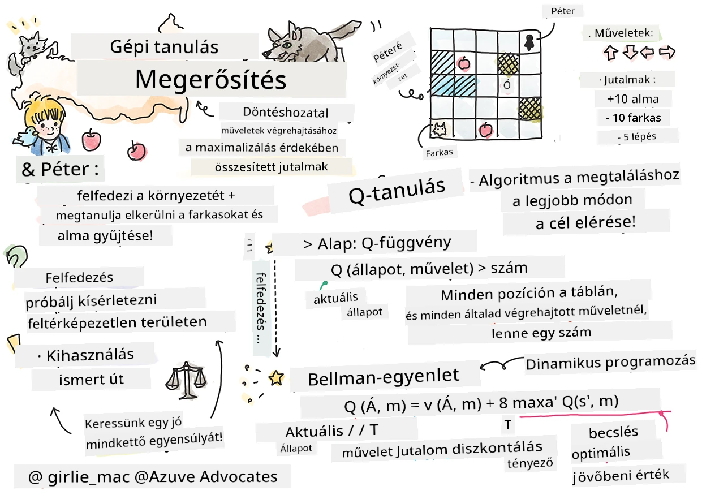

# Bevezetés a megerősítéses tanulásba és a Q-tanulásba


> Vázlatjegyzet készítette: [Tomomi Imura](https://www.twitter.com/girlie_mac)

A megerősítéses tanulás három fontos fogalmat foglal magában: az ágentet, néhány állapotot és állapotonként egy cselekvési halmazt. Egy adott állapotban végrehajtott cselekedetért az ágens jutalmat kap. Gondoljunk újra a Super Mario számítógépes játékra. Te vagy Mario, egy játék szinten, egy szikla szélén állsz. Fent feletted egy érme van. Te, mint Mario, egy játékszinten, egy adott pozícióban... ez az állapotod. Egy lépés jobbra (cselekvés) átesne a sziklaperemen, és ez alacsony numerikus pontszámot eredményezne. Azonban a ugrás gomb megnyomásával pontot szerezhetnél, és életben maradnál. Ez egy pozitív eredmény, ami pozitív numerikus pontszámot kell, hogy adjon.

Megerősítéses tanulás és egy szimulátor (a játék) használatával megtanulhatod, hogyan játszd a játékot úgy, hogy maximalizáld a jutalmat, ami az életben maradás és minél több pont szerzése.

[](https://www.youtube.com/watch?v=lDq_en8RNOo)

> 🎥 Kattints a fent látható képre, hogy meghallgasd Dmitry előadását a megerősítéses tanulásról

## [Előadás előtti kvíz](https://ff-quizzes.netlify.app/en/ml/)

## Előfeltételek és beállítás

Ebben az órában kódokat fogunk kipróbálni Pythonban. Képesnek kell lenned futtatni a Jupyter Notebook kódját ennek a leckének, akár a számítógépeden, akár a felhőben.

Megnyithatod [a lecke jegyzetfüzetét](https://github.com/microsoft/ML-For-Beginners/blob/main/8-Reinforcement/1-QLearning/notebook.ipynb), és végigkövetheted a leckét a felépítéshez.

> **Megjegyzés:** Ha a kódot a felhőből nyitod meg, akkor le kell töltened a [`rlboard.py`](https://github.com/microsoft/ML-For-Beginners/blob/main/8-Reinforcement/1-QLearning/rlboard.py) fájlt is, amely a notebook kódban használatos. Tedd ezt a jegyzetfüzet könyvtárába.

## Bevezetés

Ebben a leckében felfedezzük a **[Péter és a farkas](https://en.wikipedia.org/wiki/Peter_and_the_Wolf)** világát, melyet egy orosz zeneszerző, [Sergei Prokofiev](https://en.wikipedia.org/wiki/Sergei_Prokofiev) zenés meséje ihletett. Megerősítéses tanulást fogunk alkalmazni, hogy Péter felfedezhesse a környezetét, gyűjtheesse az ízletes almákat, és elkerülhesse a farkast.

A **Megerősítéses tanulás** (RL) egy olyan tanulási technika, amely lehetővé teszi számunkra, hogy egy **ágens** optimális viselkedését megtanuljuk egy adott **környezetben** sok kísérlet segítségével. Az ágensnek ebben a környezetben van egy **célja**, amelyet egy **jutalomfüggvény** határoz meg.

## A környezet

Az egyszerűség kedvéért tekintsük Péter világát egy `szélesség` x `magasság` méretű négyzetes táblának, így:


A táblán minden cella lehet:

* **föld**, amelyen Péter és más lények járhatnak.
* **víz**, amelyen természetesen nem lehet járni.
* egy **fa** vagy **fű**, ahol meg lehet pihenni.
* egy **alma**, ami valami olyasmit jelent, amit Péter örömmel találna meg, hogy táplálkozhasson.
* egy **farkas**, amely veszélyes és kerülendő.

Van egy külön Python modul, a [`rlboard.py`](https://github.com/microsoft/ML-For-Beginners/blob/main/8-Reinforcement/1-QLearning/rlboard.py), amely tartalmazza a kódot a környezettel való munkához. Mivel ez a kód nem fontos a fogalmak megértéséhez, importáljuk a modult, és használjuk a minta tábla létrehozásához (kódblokk 1):

```python
from rlboard import *

width, height = 8,8
m = Board(width,height)
m.randomize(seed=13)
m.plot()
```

Ez a kód ki kell, hogy írjon egy képet a környezetről, amely hasonló a fentiekhez.

## Cselekvések és szabályzat

Péter célja példánkban az volna, hogy megtaláljon egy almát, miközben elkerüli a farkast és egyéb akadályokat. Ehhez lényegében körbejárhat, amíg talál egy almát.

Ezért bármely pozícióban választhat a következő cselekvések közül: fel, le, balra és jobbra.

Ezeket a cselekvéseket egy szótárként definiáljuk, és hozzárendeljük az adott koordinátaváltozásokat. Például a jobbra való mozgás (`R`) egy `(1,0)` párnak felel meg (kódblokk 2):

```python
actions = { "U" : (0,-1), "D" : (0,1), "L" : (-1,0), "R" : (1,0) }
action_idx = { a : i for i,a in enumerate(actions.keys()) }
```

Összefoglalva, a stratégia és a cél az alábbiak:

- **A stratégia** az ágensemnek (Péter) egy ún. **szabályzat** által van megadva. Egy szabályzat egy függvény, ami visszaadja az adott állapotban végrehajtandó cselekvést. A mi esetünkben a probléma állapota a tábla, beleértve a játékos pillanatnyi pozícióját.

- **A cél**, a megerősítéses tanulásban, hogy végül megtanuljunk egy jó szabályzatot, amely hatékonyan megoldja a problémát. Mégis, kiindulásként vegyük a legegyszerűbb szabályzatot, az ún. **véletlenszerű sétát**.

## Véletlenszerű séta

Először oldjuk meg problémánkat a véletlenszerű séta stratégiával. Véletlenszerű sétával véletlenszerűen választjuk ki a következő cselekvést az engedélyezett cselekvések közül, amíg el nem érjük az almát (kódblokk 3).

1. Valósítsuk meg a véletlenszerű sétát az alábbi kóddal:

    ```python
    def random_policy(m):
        return random.choice(list(actions))
    
    def walk(m,policy,start_position=None):
        n = 0 # lépések száma
        # állítsa be a kezdő pozíciót
        if start_position:
            m.human = start_position 
        else:
            m.random_start()
        while True:
            if m.at() == Board.Cell.apple:
                return n # siker!
            if m.at() in [Board.Cell.wolf, Board.Cell.water]:
                return -1 # farkas elnyelte vagy vízbe fulladt
            while True:
                a = actions[policy(m)]
                new_pos = m.move_pos(m.human,a)
                if m.is_valid(new_pos) and m.at(new_pos)!=Board.Cell.water:
                    m.move(a) # hajtsa végre a tényleges lépést
                    break
            n+=1
    
    walk(m,random_policy)
    ```

    A `walk` hívás vissza kell, hogy adja az adott út hosszát, amely egyik futásról a másikra változhat.

1. Futtasd a séta kísérletet több alkalommal (például 100), és írd ki az eredménystatisztikát (kódblokk 4):

    ```python
    def print_statistics(policy):
        s,w,n = 0,0,0
        for _ in range(100):
            z = walk(m,policy)
            if z<0:
                w+=1
            else:
                s += z
                n += 1
        print(f"Average path length = {s/n}, eaten by wolf: {w} times")
    
    print_statistics(random_policy)
    ```

    Megjegyzés: az átlagos út hossza kb. 30-40 lépés, ami elég sok, figyelembe véve, hogy az átlagos távolság a legközelebbi almához kb. 5-6 lépés.

    Megnézheted, hogyan néz ki Péter mozgása a véletlenszerű séta során:

    

## Jutalomfüggvény

Ahhoz, hogy szabályzatunk okosabb legyen, meg kell értenünk, mely lépések "jobbak", mint mások. Ehhez definiálnunk kell a célunkat.

A célt egy **jutalomfüggvénnyel** határozhatjuk meg, amely minden állapothoz pontszámot rendel. Minél nagyobb a szám, annál jobb a jutalomfüggvény. (kódblokk 5)

```python
move_reward = -0.1
goal_reward = 10
end_reward = -10

def reward(m,pos=None):
    pos = pos or m.human
    if not m.is_valid(pos):
        return end_reward
    x = m.at(pos)
    if x==Board.Cell.water or x == Board.Cell.wolf:
        return end_reward
    if x==Board.Cell.apple:
        return goal_reward
    return move_reward
```

Érdekes, hogy a jutalomfüggvények többségében *a jelentős jutalmat csak a játék végén kapjuk meg*. Ez azt jelenti, hogy algoritmusunknak valahogy meg kell jegyeznie azokat a "jó" lépéseket, amelyek pozitív jutalomhoz vezetnek a végén, és azok fontosságát növelnie kell. Hasonlóképpen, minden rossz eredményhez vezető lépést ösztönözni kell, hogy elkerülje az algoritmus.

## Q-tanulás

Egy algoritmus, amelyet itt megvitatunk, a **Q-tanulás**. Ebben az algoritmusban a szabályzat egy függvénnyel (vagy adatszerkezettel) van definiálva, amit **Q-táblának** nevezünk. Ez rögzíti az egyes állapotokban elérhető cselekvések "jósságát".

Q-táblának hívjuk, mert gyakran kényelmes táblázatként vagy többdimenziós tömbként ábrázolni. Mivel a táblánk mérete `szélesség` x `magasság`, a Q-táblát egy numpy tömbbel ábrázolhatjuk, amelynek alakja `szélesség` x `magasság` x `len(cselekvések)`: (kódblokk 6)

```python
Q = np.ones((width,height,len(actions)),dtype=np.float)*1.0/len(actions)
```

Vegyük észre, hogy a Q-tábla összes értékét egyenlőre inicializáljuk, nálunk ez 0.25. Ez megfelel a "véletlenszerű séta" szabályzatnak, mert minden lépés minden állapotban egyformán jó. A Q-táblát átadhatjuk a `plot` függvénynek, hogy megjelenítsük azt a táblán: `m.plot(Q)`.


Minden cella közepén egy "nyíl" jelzi az előnyben részesített mozgásirányt. Mivel minden irány egyenlő, egy pont van megjelenítve helyette.

Most futtatnunk kell a szimulációt, felfedezni környezetünket, és megtanulni egy jobb Q-tábla értékeloszlást, amely gyorsabban megtalálja az almához vezető utat.

## Q-tanulás lényege: Bellman-egyenlet

Amikor elindulunk, minden cselekvéshez tartozik egy jutalom, vagyis elméletileg kiválaszthatnánk a következő cselekvést a legmagasabb azonnali jutalom alapján. Azonban a legtöbb állapotban a lépés nem teljesíti célunkat, vagyis nem jutunk az almához, így nem dönthetünk azonnal, melyik irány a jobb.

> Ne feledd, hogy nem az azonnali eredmény számít, hanem a végső eredmény, amit a szimuláció végén kapunk meg.

A késleltetett jutalom figyelembe vételéhez a **[dinamikus programozás](https://en.wikipedia.org/wiki/Dynamic_programming)** elveit kell alkalmaznunk, amelyek lehetővé teszik a probléma rekurzív megfontolását.

Tegyük fel, hogy most az *s* állapotban vagyunk, és a következő *s'* állapotba akarunk lépni. Ezzel kapjuk az azonnali jutalmat *r(s,a)* a jutalomfüggvényből, plusz egy jövőbeni jutalmat. Ha feltételezzük, hogy a Q-tábla helyesen tükrözi a cselekvések "vonzerejét", akkor az *s'* állapotban kiválasztjuk az *a* cselekvést, amely a *Q(s',a')* legmagasabb értékéhez tartozik. Így a legjobb jövőbeni jutalom az *s* állapotban legyen a `max`<sub>a'</sub>*Q(s',a')* (a maximum az összes lehetséges *a'* cselekvésen számított).

Ez adja a **Bellman formula**-t a Q-tábla értékének kiszámításához az *s* állapotban, adott *a* cselekvésnél:


Itt γ az ún. **diszkont faktor**, amely meghatározza, milyen mértékben preferáljuk a jelenlegi jutalmat a jövőbelivel szemben és fordítva.

## Tanulási algoritmus

A fenti egyenlet alapján most megírhatjuk pszeudokódban a tanulási algoritmust:

* Inicializáljuk a Q-táblát Q azonos számokkal minden állapothoz és cselekvéshez
* Beállítjuk a tanulási rátát α ← 1
* Ismételjük meg a szimulációt sokszor
   1. Induljunk véletlenszerű pozícióból
   1. Ismételjük
        1. Válasszuk ki a cselekvést *a* az állapot *s*-ben
        2. Hajtsuk végre a cselekvést, lépjünk az új *s'* állapotba
        3. Ha vége a játéknak, vagy a teljes jutalom túl kicsi - lépjünk ki a szimulációból  
        4. Számítsuk ki a jutalmat *r* az új állapotban
        5. Frissítsük a Q-függvényt a Bellman-egyenlet szerint: *Q(s,a)* ← *(1-α)Q(s,a)+α(r+γ max<sub>a'</sub>Q(s',a'))*
        6. *s* ← *s'*
        7. Frissítsük a teljes jutalmat és csökkentsük az α-t.

## Kiaknázás vs. felfedezés

A fenti algoritmusban nem részleteztük, pontosan hogyan válasszuk ki a cselekvést a 2.1 lépésben. Ha véletlenszerűen választunk, akkor véletlenszerűen felfedezzük a környezetet, és gyakran meghalhatunk, valamint bejárhatunk olyan területeket is, ahová egyébként nem mennénk. Alternatív megoldás, hogy kiaknázod a Q-tábla ismert értékeit, és így a legjobb cselekvést választod az adott állapotban (magasabb Q-értékű). Ez azonban megakadályozza a többi állapot felfedezését, és valószínűleg nem találjuk meg az optimális megoldást.

Ezért a legjobb megközelítés egyensúlyt teremteni a felfedezés és a kiaknázás között. Ezt úgy érhetjük el, ha az állapotban lévő cselekvéseket a Q-tábla értékeinek arányában választjuk ki valószínűséggel. Eleinte, amikor minden Q-érték azonos, ez véletlenszerű választásnak felel meg, de ahogy többet tanulunk a környezetünkről, egyre valószínűbb, hogy követjük az optimális útvonalat, miközben az ágnes néha felfedező útra is mehet.

## Python megvalósítás

Most készen állunk a tanulási algoritmus megvalósítására. Mielőtt ezt megtennénk, szükségünk van egy függvényre, amely a Q-tábla tetszőleges számait átalakítja a megfelelő cselekvések valószínűségi vektorává.

1. Hozd létre a `probs()` függvényt:

    ```python
    def probs(v,eps=1e-4):
        v = v-v.min()+eps
        v = v/v.sum()
        return v
    ```

    Egy kis `eps` értéket adunk hozzá az eredeti vektorhoz, hogy elkerüljük a 0-val való osztást az induló esetben, amikor a vektor összetevői azonosak.

Futtasd az algoritmust 5000 kísérlet, ún. **epocha** során: (kódblokk 8)
```python
    for epoch in range(5000):
    
        # Válassz kezdeti pontot
        m.random_start()
        
        # Kezdd el az utazást
        n=0
        cum_reward = 0
        while True:
            x,y = m.human
            v = probs(Q[x,y])
            a = random.choices(list(actions),weights=v)[0]
            dpos = actions[a]
            m.move(dpos,check_correctness=False) # Megengedjük, hogy a játékos a táblán kívülre lépjen, ami az epizód végét jelenti
            r = reward(m)
            cum_reward += r
            if r==end_reward or cum_reward < -1000:
                lpath.append(n)
                break
            alpha = np.exp(-n / 10e5)
            gamma = 0.5
            ai = action_idx[a]
            Q[x,y,ai] = (1 - alpha) * Q[x,y,ai] + alpha * (r + gamma * Q[x+dpos[0], y+dpos[1]].max())
            n+=1
```

Az algoritmus futása után a Q-táblát frissíteni kell azzal az értékkel, amely meghatározza a különböző cselekvések vonzerejét minden lépésnél. Megpróbálhatjuk vizualizálni a Q-táblát azáltal, hogy minden cellában megjelenítünk egy vektort, ami a kívánt mozgás irányába mutat. Egyszerűség kedvéért egy kis kört rajzolunk nyílhegy helyett.


## A szabályzat ellenőrzése

Mivel a Q-tábla felsorolja az egyes cselekvések "vonzerősségét" minden állapotban, könnyű vele hatékony navigációt definiálni a világunkban. A legegyszerűbb esetben a legmagasabb Q-táblabeli értékhez tartozó cselekvést választjuk: (kódblokk 9)

```python
def qpolicy_strict(m):
        x,y = m.human
        v = probs(Q[x,y])
        a = list(actions)[np.argmax(v)]
        return a

walk(m,qpolicy_strict)
```


> Ha többször is lefuttatod a fenti kódot, észreveheted, hogy néha "lefagy", és a megszakításhoz meg kell nyomnod a STOP gombot a jegyzetfüzetben. Ez azért fordul elő, mert előfordulhat olyan helyzet, amikor két állapot "mutat egymásra" az optimális Q-érték tekintetében, ilyenkor az ágensek végtelenül mozognak ezek között az állapotok között.

## 🚀Kihívás

> **1. feladat:** Módosítsd a `walk` függvényt, hogy korlátozd a maximális út hosszát egy bizonyos lépésszámra (például 100 lépés), és figyeld, hogy a fenti kód időről időre visszaadja ezt az értéket.

> **2. feladat:** Módosítsd a `walk` függvényt úgy, hogy ne térjen vissza azokhoz a helyekhez, ahol már járt korábban. Ez megakadályozza, hogy a `walk` ciklikusan mozogjon, azonban az ágensek még így is csapdába eshetnek egy olyan helyen, ahonnan nem tudnak elmenekülni.

## Navigáció

Egy jobb navigációs politika az, amit a tanulás során használtunk, amely kombinálja a kihasználást és a felfedezést. Ebben a politikában minden egyes akciót bizonyos valószínűséggel választunk ki, arányosan a Q-tábla értékeivel. Ez a stratégia még mindig eredményezheti, hogy az ágensek visszatérjenek egy már felfedezett helyre, de, ahogy a lenti kódból látható, nagyon rövid átlagos utat eredményez a kívánt helyhez (emlékezz rá, hogy a `print_statistics` százszor futtatja a szimulációt): (kódblokk 10)

```python
def qpolicy(m):
        x,y = m.human
        v = probs(Q[x,y])
        a = random.choices(list(actions),weights=v)[0]
        return a

print_statistics(qpolicy)
```

Ennek a kódnak a lefuttatása után sokkal kisebb átlagos út hosszt kell kapni, mint korábban, körülbelül 3-6 között.

## A tanulási folyamat vizsgálata

Ahogy említettük, a tanulási folyamat az új ismeretek felfedezése és hasznosítása közötti egyensúly. Láttuk, hogy a tanulás eredménye (az ágensek segítségével a célhoz vezető rövid út megtalálásának képessége) javult, de érdekes megfigyelni, hogyan viselkedik az átlagos út hossz a tanulási folyamat során:


A tanulságok összefoglalva:

- **Az átlagos út hossz nő**. Amit itt látunk, az az, hogy kezdetben az átlagos út hossz nő. Valószínűleg azért, mert amikor semmit sem tudunk a környezetről, akkor könnyen csapdába eshetünk rossz állapotokban, például vízben vagy a farkasnál. Ahogy többet tanulunk és használjuk ezt a tudást, hosszabb ideig tudjuk felfedezni a környezetet, de még mindig nem ismerjük jól, hol vannak az almák.

- **Az út hossz csökken, ahogy többet tanulunk**. Miután elég sokat megtanultunk, az ügynök számára könnyebb elérni a célt, és az út hossza elkezd csökkeni. Azonban még mindig nyitottak vagyunk a felfedezésre, így gyakran eltérünk a legjobb úttól, és új lehetőségeket fedezünk fel, ami az út hosszát az optimálisnál hosszabbá teszi.

- **A hossz hirtelen megnő**. A grafikonon azt is megfigyelhetjük, hogy egy ponton a hossz hirtelen megnőtt. Ez a folyamat sztochasztikus jellegére utal, és arra, hogy egy ponton "tönkretehetjük" a Q-tábla együtthatóit, ha új értékekkel felülírjuk azokat. Ezt ideális esetben csökkenteni kell a tanulási ráta visszaesésével (például a tanulás végén csak kis mértékben módosítjuk a Q-tábla értékeit).

Összességében fontos megjegyezni, hogy a tanulási folyamat sikere és minősége jelentősen függ a paraméterektől, mint például a tanulási ráta, a tanulási ráta csökkenése és a diszkont faktor. Ezeket gyakran **hiperparamétereknek** nevezzük, hogy elkülönítsük őket a **paraméterektől**, amelyeket a tanulás során optimalizálunk (például a Q-tábla együtthatóit). A legjobb hiperparaméter értékek megtalálásának folyamatát **hiperparaméter optimalizációnak** nevezzük, ami egy külön téma.

## [Előadás utáni kvíz](https://ff-quizzes.netlify.app/en/ml/)

## Feladat
[Egy valósághűbb világ](assignment.md)

---

<!-- CO-OP TRANSLATOR DISCLAIMER START -->
**Jogi nyilatkozat**:
Ez a dokumentum az AI fordítási szolgáltatás, a [Co-op Translator](https://github.com/Azure/co-op-translator) segítségével készült. Bár az pontosságra törekszünk, kérjük, vegye figyelembe, hogy az automatikus fordítások hibákat vagy pontatlanságokat tartalmazhatnak. Az eredeti dokumentum az anyanyelvén tekintendő hiteles forrásnak. Fontos információk esetén professzionális emberi fordítást javasolunk. Nem vállalunk felelősséget semmilyen félreértésért vagy téves értelmezésért, amely ebből a fordításból ered.
<!-- CO-OP TRANSLATOR DISCLAIMER END -->