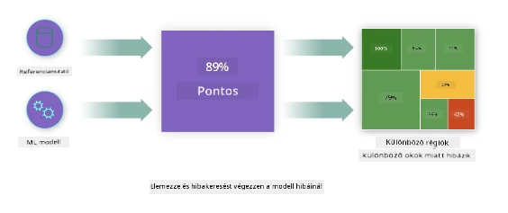
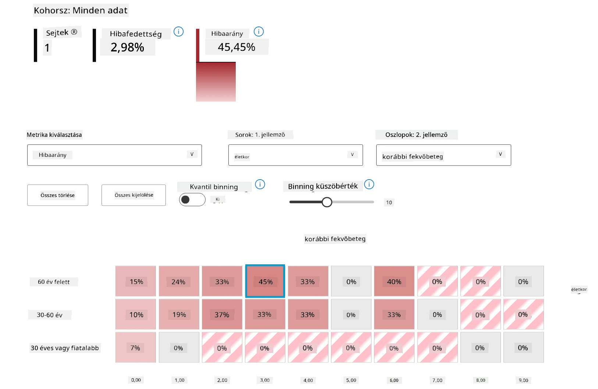
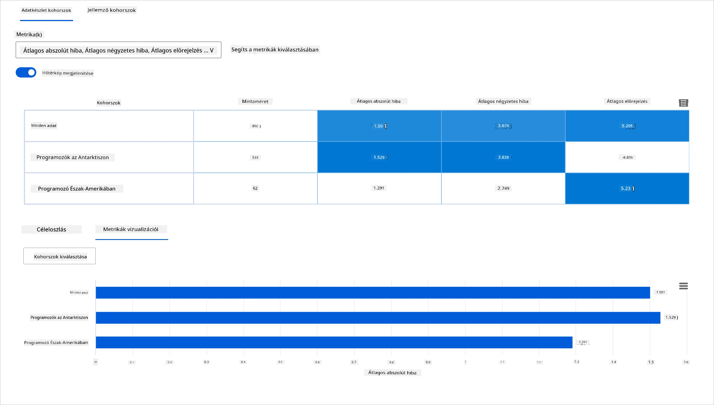
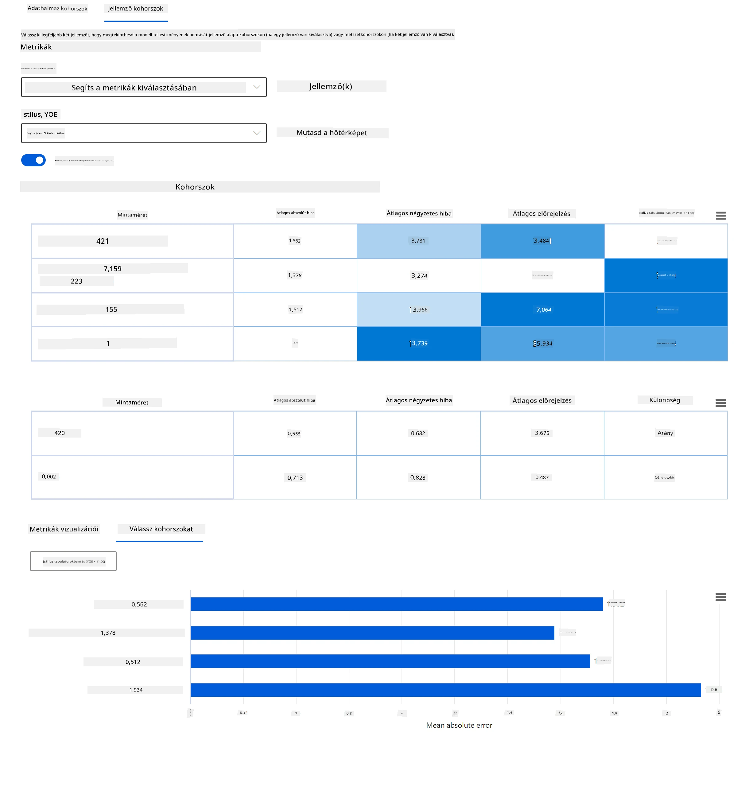
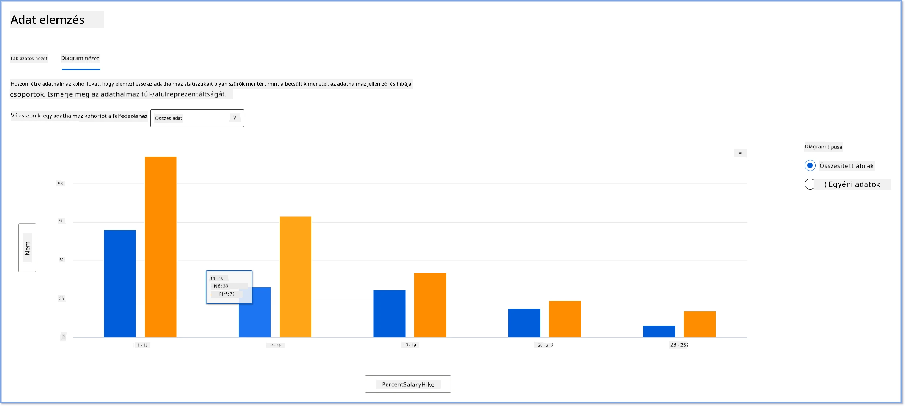
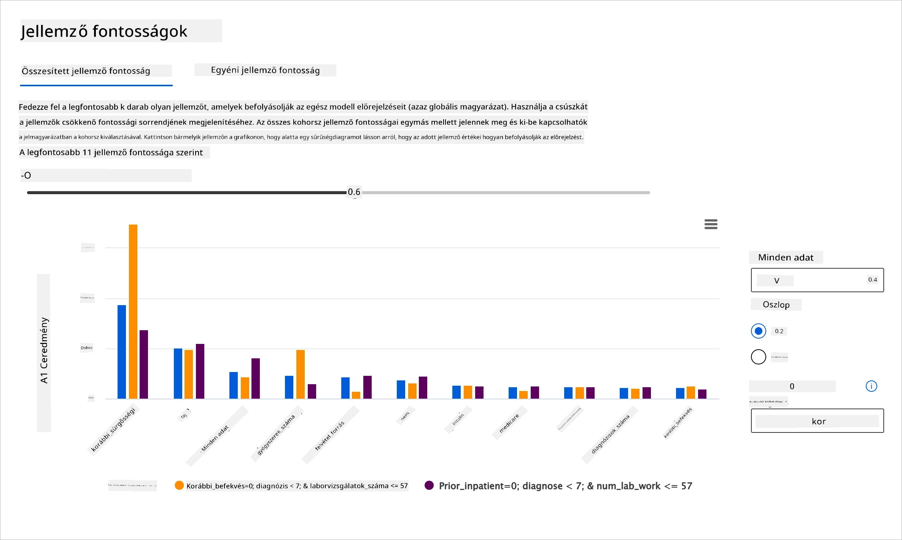
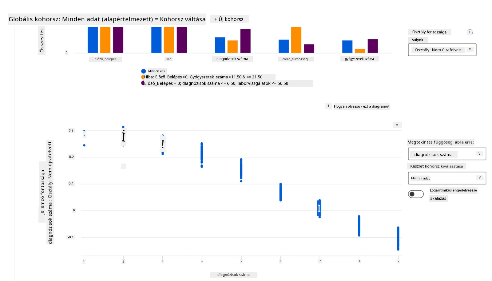

# Utószó: Modellhibakeresés gépi tanulásban a Felelős MI irányítópult elemeinek használatával
 

## [Előadás előtti kvíz](https://ff-quizzes.netlify.app/en/ml/)
 
## Bevezetés

A gépi tanulás hatással van mindennapi életünkre. A mesterséges intelligencia utat tör magának a legfontosabb rendszerekben, amelyek minket, egyéneket, valamint társadalmunkat érintenek, az egészségügytől, a pénzügyeken és az oktatáson át a foglalkoztatásig. Például rendszerek és modellek vesznek részt a napi döntéshozatali feladatokban, mint az egészségügyi diagnózisok vagy a csalás felismerése. Következésképpen az MI fejlődésével és az ütemezett elterjedéssel párhuzamosan folyamatosan változó társadalmi elvárásokkal és növekvő szabályozásokkal találkozunk válaszként. Állandóan tapasztaljuk, hogy az MI-rendszerek nem felelnek meg az elvárásoknak; új kihívásokat tárnak fel; és a kormányok elkezdik szabályozni az MI-megoldásokat. Ezért fontos, hogy ezeket a modelleket elemezzük annak érdekében, hogy mindenki számára igazságos, megbízható, befogadó, átlátható és elszámoltatható eredményeket szolgáltassanak.

Ebben a tananyagban gyakorlati eszközöket vizsgálunk, amelyekkel felmérhető, ha egy modell felelős MI-problémákkal küzd. A hagyományos gépi tanulási hibakeresési technikák jellemzően kvantitatív számításokon alapulnak, például összesített pontosság vagy átlagos hibaveszteség. Képzeljük el, mi történik, ha az adat, amelyből a modelleket építjük, hiányos bizonyos demográfiai jellemzők tekintetében, például faj, nem, politikai nézet, vallás, vagy aránytalanul képviseli ezeket a csoportokat. Mi van akkor, ha a modell kimenetét úgy értelmezik, hogy egyes demográfiai csoportokat előnyben részesítsen? Ez felül- vagy alulreprezentáltságot okozhat ezekben az érzékeny jellemzőcsoportokban, ami igazságossági, befogadási vagy megbízhatósági problémákat eredményezhet a modellnél. Egy másik tényező, hogy a gépi tanulási modelleket fekete dobozoknak tekintjük, ami megnehezíti megérteni és magyarázni, mi befolyásolja egy modell előrejelzését. Ezek mind olyan kihívások, amelyekkel az adattudósok és MI-fejlesztők szembesülnek, amikor nem rendelkeznek megfelelő eszközökkel a modell igazságosságának vagy megbízhatóságának hibakeresésére és értékelésére.

Ebben a leckében a modellek hibakeresését tanulhatod meg az alábbi eszközök segítségével:

-	**Hibaanalízis**: azonosítani, hogy az adateloszlás mely részein magas a modell hibaaránya.
-	**Modelláttekintés**: összehasonlító elemzés végzése különböző adatkohorszok között, hogy felfedezhessük a teljesítménymutatók eltéréseit.
-	**Adat elemzés**: vizsgálni, hol lehet túl- vagy alulreprezentált az adat, ami a modell torzulásához vezethet egyes demográfiai csoportok javára vagy hátrányára.
-	**Jellemző fontosság**: megérteni, hogy mely jellemzők befolyásolják globális vagy lokális szinten a modell előrejelzéseit.

## Előfeltétel

Előfeltételként kérjük, tekintsd át a [Fejlődőknek szánt felelős MI eszközök](https://www.microsoft.com/ai/ai-lab-responsible-ai-dashboard) anyagot

> 

## Hibaanalízis

A hagyományos modell teljesítménymutatók, amelyek pontosságot mérnek, általában arra alapoznak, hogy az előrejelzés helyes vagy helytelen volt-e. Például egy modellről megállapítani, hogy 89%-ban pontos, 0,001 hibaveszteség mellett, jó teljesítménynek számíthat. A hibák sokszor nem egyenletesen oszlanak el az alapadat-készletben. Lehet, hogy egy 89%-os pontosságot mérsz, de észreveszed, hogy az adataid különböző régióiban a modell 42%-ban hibázik. Ezek a hibamintázatok bizonyos csoportoknál igazságossági vagy megbízhatósági problémákhoz vezethetnek. Lényeges megérteni, mely területeken teljesít jól vagy rosszul a modell. Az adatterületek, ahol sok pontatlanság jelenik meg, fontos demográfiai csoportot jelenthetnek.

A Hibaanalízis komponens az RAI irányítópulton azt mutatja meg, hogyan oszlik el a modell hibája különböző kohorszok között egy fa vizualizáción keresztül. Ez segít azonosítani azokat a jellemzőket vagy területeket, ahol magas hibaarány van az adatbázisban. Ha látod, honnan származik a legtöbb pontatlanság, elkezdheted vizsgálni a gyökérokot. Létrehozhatsz adatkohorszokat is elemzés céljából. Ezek a kohorszok segítik a hibakeresést, hogy megértsd, miért teljesít jól egy kohorszban a modell, de hibázik egy másikban.

A fa diagram vizuális jelzései gyorsabban segítenek megtalálni a problémás területeket. Például minél sötétebb piros színű egy fa csomópont, annál magasabb a hibaarány.

A hőtérképes megjelenítés egy másik vizualizációs funkció, amellyel egy vagy két jellemző alapján vizsgálhatók a hibaarányok, és az adatkészlet vagy kohorszok mentén is kereshetők a hiba hozzájárulói.

Használd a hibaanalízist, amikor szükséged van:

* Mélyreható megértésre arról, hogyan oszlanak meg a modellhibák az adatokon és jellemző dimenziókon keresztül.
* Az összesített teljesítménymutatók lebontására, hogy automatikusan felfedezd a hibás kohorszokat, és ennek alapján célzott javítási lépéseket tegyél.

## Modelláttekintés

Egy gépi tanulási modell értékeléséhez átfogó megértést kell szereznünk a viselkedéséről. Ezt különböző mutatók, például hibaarány, pontosság, visszahívás, precizitás vagy MAE (átlagos abszolút hiba) összevetésével lehet elérni, hogy eltéréseket fedezzünk fel a teljesítményben. Egy mutató kiemelkedő lehet, de más mutatóban pontatlanságok jelennek meg. Továbbá az egész adatkészleten vagy kohorszokon végzett összehasonlítás fényt derít arra, hol teljesít jól vagy nem a modell. Ez különösen fontos érzékeny és nem érzékeny jellemzők (például beteg bőrszíne, neme vagy kora) között, hogy felfedjük az esetleges igazságtalanságokat, amelyek a modellben lehetnek. Például ha egy érzékeny jellemzőkkel rendelkező kohorszban magasabb a hibaarány, az potenciális igazságtalanságot jelezhet.

Az RAI irányítópult Modelláttekintő komponense nemcsak az adott kohorsz adatainak teljesítménymutatóit elemzi, hanem lehetőséget ad a modell viselkedésének összehasonlítására különböző kohorszok között.

A komponens jellemző-alapú elemző funkciója lehetővé teszi a felhasználók számára, hogy egy adott jellemzőn belül adat-alcsoportokra szűkítsenek, hogy finom szinten azonosítsák az anomáliákat. Például az irányítópult intelligenciája automatikusan létrehozza a kohorszokat a felhasználó által kiválasztott jellemző alapján (pl. *"time_in_hospital < 3"* vagy *"time_in_hospital >= 7"*). Ez lehetővé teszi az egyes jellemzők elkülönítését egy nagyobb adatcsoportból annak megállapítására, hogy kulcsfontosságú tényező-e a modell hibás eredményeiben.

A Modelláttekintés komponens két típusú különbségmérőt támogat:

**Teljesítménybeli különbség**: Ezek a mutatók a kiválasztott teljesítménymutató értékének különbségét számolják ki az adat alkohorszai között. Néhány példa:

* Pontosságbeli különbség
* Hibaaránybeli különbség
* Precizitásbeli különbség
* Visszahívásbeli különbség
* Átlagos abszolút hiba (MAE) különbség

**Kiválasztási aránybeli különbség**: Ez a mutató a kiválasztási arány (kedvező előrejelzés) különbségét tartalmazza az alkohorszok között. Példa erre a kölcsönjóváhagyási arány különbsége. A kiválasztási arány az egyes kategóriákban 1-nek osztályozott adatpontok aránya (bináris osztályozásban), vagy az előrejelzési értékek eloszlása (regresszióban).

## Adat elemzés

> „Ha elég sokáig kínozod az adatokat, bármit beismernek.” – Ronald Coase

Ez a kijelentés talán túlzónak hangzik, de igaz, hogy az adatokat manipulálni lehet bármilyen következtetés támogatására. Néha ez akaratlan is megtörténhet. Emberként mindannyian hordozunk elfogultságot, és gyakran nehéz tudatosan észrevenni, mikor vezetünk be elfogultságot az adatokba. Az igazságosság garantálása az MI-ben és a gépi tanulásban összetett kihívás.

Az adat hatalmas vakfolt a hagyományos modell teljesítménymutatókban. Lehet, hogy magas pontosságod van, de ez nem tükrözi mindig az adatokban rejlő torzításokat. Például, ha egy cég alkalmazotti adatállományában 27% női és 73% férfi felsővezető van, akkor az ezen az adaton tanított álláshirdető MI valószínűleg férfi közönséget céloz meg felső szintű pozíciókra. Az adatok aránytalansága torzítja a modell előrejelzését, egy nemi előítéletet hoz létre az MI-ben.

Az Adat elemzés komponens az RAI irányítópulton segít azonosítani a túl- vagy alulreprezentált területeket az adattömegben. Segít feltárni a hibák és igazságossági problémák gyökerező okát, amelyeket az adatok kiegyensúlyozatlansága vagy egy adott csoport hiánya okoz. A felhasználók vizualizálhatják az adatokat valódi és előrejelzett eredmények, hibacsoportok és jellemzők szerint. Néha egy alulreprezentált csoport felfedezése kiderítheti, hogy a modell nem tanul jól, ezért magas az pontatlanság. Az adatokban meglévő torzítás nem csak igazságossági probléma, hanem azt is jelzi, hogy a modell nem befogadó vagy megbízható.

Használd az adat elemzést, amikor szükséged van:

* Az adatkészlet statisztikáinak felfedezésére különböző szűrők segítségével, hogy az adatokat különböző dimenziókra (kohorszokra) bontsd.
* Megérteni az adatkészlet eloszlását különböző kohorszok és jellemzőcsoportok között.
* Megállapítani, hogy az igazságossággal, hibaanalízissel és okozatisággal kapcsolatos megállapításaid (amelyek más irányítópult komponensekből származnak) az adateloszlás következményei-e.
* Eldönteni, mely területeken kell több adatot gyűjteni a reprezentációs problémákból, osztálycímke zajból, jellemző zajból, címke torzításból és hasonló tényezőkből eredő hibák enyhítésére.

## Modell értelmezhetőség

A gépi tanulási modellek általában fekete dobozok. Nehéz megérteni, hogy mely kulcsfontosságú adatjellemzők befolyásolják egy modell előrejelzését. Fontos átláthatóságot biztosítani arról, miért adja a modell az adott előrejelzést. Például, ha egy MI-rendszer előrejelzi, hogy egy cukorbeteg beteg 30 napon belül kórházba kerül újra, akkor támogatást adó adatokat is kell szolgáltatnia, amelyek az előrejelzést vezérelték. A támogató adatindikátorok átláthatóságot hoznak, hogy az orvosok vagy kórházak megalapozott döntéseket hozhassanak. Emellett a modell előrejelzésének magyarázata az egyéni beteg esetében elszámoltathatóságot és egészségügyi szabályozási megfelelést tesz lehetővé. Amikor gépi tanulási modelleket használsz emberek életére kiható módon, alapvető, hogy megértsd és megmagyarázd, mi befolyásolja a modell viselkedését. A modellmagyarázhatóság és értelmezhetőség olyan kérdésekre ad választ, mint:

* Modellhibakeresés: Miért hibázott a modellem? Hogyan javíthatom a modellem?
* Ember-MI együttműködés: Hogyan érthetem meg, és bízhatok a modell döntéseiben?
* Szabályozói megfelelés: Megfelel a modellem a jogi követelményeknek?

Az RAI irányítópult Jellemző fontosság komponense segít a modell hibakeresésében és átfogó megértésében, hogy miként készít előrejelzéseket. Ez egy hasznos eszköz a gépi tanulási szakemberek és döntéshozók számára is, hogy bizonyítékokat mutassanak be arra vonatkozóan, mely jellemzők befolyásolják a modell viselkedését a szabályozói megfelelés érdekében. A felhasználók felfedezhetik a globális és lokális magyarázatokat, amelyek megerősítik, hogy mely jellemzők befolyásolják egy modell előrejelzését. A globális magyarázatok a modell egész előrejelzésére ható legfontosabb jellemzőket sorolják fel. A helyi magyarázatok megmutatják, hogy egy konkrét esetben mely jellemzők vezettek az előrejelzéshez. A helyi magyarázatok értékelése segíthet egy adott eset hibakeresésében vagy auditálásában, hogy jobban megértsük, miért volt a modell előrejelzése helyes vagy helytelen.

* Globális magyarázatok: például mely jellemzők befolyásolják egy cukorbetegség újra-kórházi felvétel modell egész viselkedését?
* Lokális magyarázatok: például miért jósolta a modell, hogy egy 60 évnél idősebb, korábbi kórházi felvételekkel rendelkező cukorbeteg beteg újrafelvételre kerül vagy nem kerül 30 napon belül?

A modell teljesítményének vizsgálata során különböző kohorszokban a Jellemző fontosság megmutatja, hogy egy jellemző milyen hatással van az egyes kohorszokra. Segít felfedni anomáliákat, amikor egy jellemző befolyásának szintjét hasonlítjuk össze az egyes kohorszokon belül a modell hibás előrejelzéseiben. A komponens megmutatja, hogy egy jellemző mely értékei befolyásolták pozitívan vagy negatívan a modell eredményét. Például, ha a modell téves előrejelzést adott, a komponens segítségével mélyebben megnézheted, hogy mely jellemzők vagy jellemző értékek vezettek ehhez az előrejelzéshez. Ez a részletezettség nemcsak a hibakeresést segíti, hanem átláthatóságot és elszámoltathatóságot is biztosít auditálási helyzetekben. Végül a komponens segíthet az igazságossági problémák azonosításában is. Ha például egy érzékeny jellemző, mint az etnikum vagy a nem jelentős befolyással bír a modell előrejelzésére, az a modell rassz vagy nemi torzítását jelezheti.

Használd az értelmezhetőséget, amikor szükséged van:

* Megítélni az MI rendszered előrejelzéseinek megbízhatóságát azáltal, hogy megérted, mely jellemzők a legfontosabbak az előrejelzésekhez.
* Hibakeresési folyamatot megalapozni a modell megértésével, annak megállapítására, hogy egészséges jellemzők alapján működik-e vagy csak hamis korrelációkat használ.
* Feltárni a potenciális igazságtalansági forrásokat azáltal, hogy megvizsgálod, vannak-e érzékeny jellemzők vagy azokkal erősen korreláló jellemzők az előrejelzés alapjaként.
* Felhasználói bizalom építése a modell döntéseibe helyi magyarázatok generálásával a döntések bemutatásához.
* Szabályozói audit elvégzése az MI rendszered modelljeinek ellenőrzésére és a hatás figyelésére az emberekre.

## Összefoglalás

Az összes RAI irányítópult komponens gyakorlati eszköz a gépi tanulási modellek fejlesztéséhez, amelyek kevésbé károsak és megbízhatóbbak a társadalom számára. Javítja az emberi jogok védelmét, csökkenti a bizonyos csoportok igazságtalan megkülönböztetését vagy életlehetőségektől való kizárását; valamint a fizikai vagy lelki sérülések kockázatát. Segít emellett a modell döntéseibe vetett bizalom építésében helyi magyarázatok generálásával az eredmények szemléltetésére. Néhány potenciális kártípus a következőképpen sorolható be:

- **Elosztás**, ha például egy nem vagy etnikum előnyben részesül a másikkal szemben.
- **Szolgáltatás minősége**: Ha az adatokat egy adott helyzetre tanítják, de a valóság ennél jóval összetettebb, az gyenge szolgáltatási teljesítményhez vezet.
- **Stereotipizálás**: Egy adott csoporthoz előre meghatározott tulajdonságok társítása.

- **Lerontás**. Valami vagy valaki igazságtalan bírálata és megbélyegzése.
- **Túl- vagy alulreprezentáltság**. Az az ötlet, hogy egy bizonyos csoport nem jelenik meg egy adott szakmában, és bármely olyan szolgáltatás vagy funkció, amely ezt tovább erősíti, káros hatású.

### Azure RAI műszerfal
 
Az [Azure RAI műszerfal](https://learn.microsoft.com/en-us/azure/machine-learning/concept-responsible-ai-dashboard?WT.mc_id=aiml-90525-ruyakubu) nyílt forráskódú eszközökön alapul, amelyeket vezető akadémiai intézmények és szervezetek, köztük a Microsoft fejlesztettek ki, és amelyek kulcsfontosságúak az adattudósok és az MI fejlesztők számára, hogy jobban megértsék a modell viselkedését, felfedezzék és enyhítsék az MI modellek nemkívánatos problémáit.

- Ismerd meg a különböző összetevők használatát a RAI műszerfal [dokumentációjában.](https://learn.microsoft.com/en-us/azure/machine-learning/how-to-responsible-ai-dashboard?WT.mc_id=aiml-90525-ruyakubu)

- Nézd meg néhány RAI műszerfal [mintanaplóját](https://github.com/Azure/RAI-vNext-Preview/tree/main/examples/notebooks) felelősebb MI forgatókönyvek hibakereséséhez az Azure Machine Learning-ben. 
  
---
## 🚀 Kihívás 
 
Annak érdekében, hogy statisztikai vagy adatbeli elfogultság ne alakuljon ki az elején, a következőket kell tennünk: 

- különböző hátterű és nézőpontú emberek dolgozzanak a rendszereken 
- befektetni olyan adatkészletekbe, amelyek társadalmunk sokszínűségét tükrözik 
- jobb módszereket fejleszteni az elfogultság felismerésére és korrekciójára, amikor előfordul 

Gondolj olyan valós helyzetekre, ahol a méltánytalanság nyilvánvaló a modellépítés és -használat során. Mit kellene még figyelembe vennünk? 

## [Előadás utáni kvíz](https://ff-quizzes.netlify.app/en/ml/)
## Áttekintés és önálló tanulás 
 
Ebben a leckében megismerted a felelős MI beépítésének néhány gyakorlati eszközét a gépi tanulásban.  

Nézd meg ezt a műhelyt, hogy mélyebben belemerülj a témákba: 

- Responsible AI Dashboard: Egyablakos megoldás a RAI gyakorlati működtetésére Besmira Nushi és Mehrnoosh Sameki előadásában

> 🎥 Kattints a fenti képre a videó megtekintéséhez: Responsible AI Dashboard: Egyablakos megoldás a RAI gyakorlati működtetésére Besmira Nushi és Mehrnoosh Sameki előadásában
 
Tekintsd át a következő anyagokat, hogy többet megtudj a felelős MI-ről és hogy hogyan lehet megbízhatóbb modelleket építeni: 

- A Microsoft RAI műszerfal eszközei az ML modellek hibakereséséhez: [Responsible AI tools resources](https://aka.ms/rai-dashboard)

- Fedezd fel a Responsible AI eszköztárat: [Github](https://github.com/microsoft/responsible-ai-toolbox)

- A Microsoft RAI erőforrásközpontja: [Responsible AI Resources – Microsoft AI](https://www.microsoft.com/ai/responsible-ai-resources?activetab=pivot1%3aprimaryr4) 

- A Microsoft FATE kutatócsoportja: [FATE: Fairness, Accountability, Transparency, and Ethics in AI - Microsoft Research](https://www.microsoft.com/research/theme/fate/) 

## Feladat

[Fedezd fel a RAI műszerfalat](assignment.md)

---

<!-- CO-OP TRANSLATOR DISCLAIMER START -->
**Jogi nyilatkozat**:
Ez a dokumentum az AI fordítási szolgáltatás, a [Co-op Translator](https://github.com/Azure/co-op-translator) segítségével készült. Bár az pontosságra törekszünk, kérjük, vegye figyelembe, hogy az automatikus fordítások hibákat vagy pontatlanságokat tartalmazhatnak. Az eredeti dokumentum az anyanyelvén tekintendő hiteles forrásnak. Fontos információk esetén professzionális emberi fordítást javasolunk. Nem vállalunk felelősséget semmilyen félreértésért vagy téves értelmezésért, amely ebből a fordításból ered.
<!-- CO-OP TRANSLATOR DISCLAIMER END -->