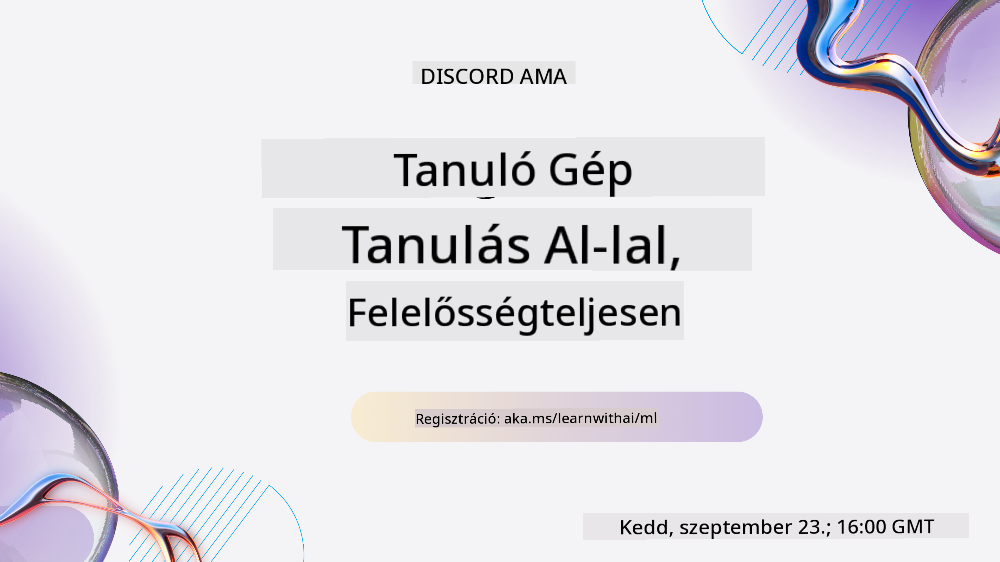
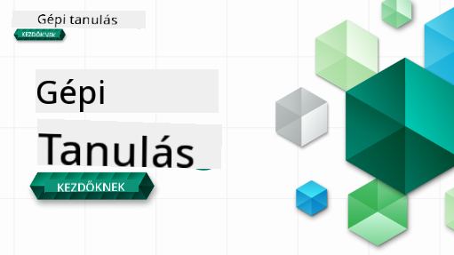

<!--
CO_OP_TRANSLATOR_METADATA:
{
  "original_hash": "7a13afb3674838f557d61f8d67e4d5f8",
  "translation_date": "2025-10-24T09:19:34+00:00",
  "source_file": "README.md",
  "language_code": "hu"
}
-->

### 🌐 Többnyelvű támogatás

#### Támogatott GitHub Action segítségével (Automatikus és mindig naprakész)

<!-- CO-OP TRANSLATOR LANGUAGES TABLE START -->
[Arab](../ar/README.md) | [Bengáli](../bn/README.md) | [Bolgár](../bg/README.md) | [Burmai (Mianmar)](../my/README.md) | [Kínai (Egyszerűsített)](../zh/README.md) | [Kínai (Hagyományos, Hongkong)](../hk/README.md) | [Kínai (Hagyományos, Makaó)](../mo/README.md) | [Kínai (Hagyományos, Tajvan)](../tw/README.md) | [Horvát](../hr/README.md) | [Cseh](../cs/README.md) | [Dán](../da/README.md) | [Holland](../nl/README.md) | [Észt](../et/README.md) | [Finn](../fi/README.md) | [Francia](../fr/README.md) | [Német](../de/README.md) | [Görög](../el/README.md) | [Héber](../he/README.md) | [Hindi](../hi/README.md) | [Magyar](./README.md) | [Indonéz](../id/README.md) | [Olasz](../it/README.md) | [Japán](../ja/README.md) | [Koreai](../ko/README.md) | [Litván](../lt/README.md) | [Maláj](../ms/README.md) | [Maráthi](../mr/README.md) | [Nepáli](../ne/README.md) | [Norvég](../no/README.md) | [Perzsa (Fárszi)](../fa/README.md) | [Lengyel](../pl/README.md) | [Portugál (Brazília)](../br/README.md) | [Portugál (Portugália)](../pt/README.md) | [Pandzsábi (Gurmukhi)](../pa/README.md) | [Román](../ro/README.md) | [Orosz](../ru/README.md) | [Szerb (Cirill)](../sr/README.md) | [Szlovák](../sk/README.md) | [Szlovén](../sl/README.md) | [Spanyol](../es/README.md) | [Szuahéli](../sw/README.md) | [Svéd](../sv/README.md) | [Tagalog (Filippínó)](../tl/README.md) | [Tamil](../ta/README.md) | [Thai](../th/README.md) | [Török](../tr/README.md) | [Ukrán](../uk/README.md) | [Urdu](../ur/README.md) | [Vietnámi](../vi/README.md)
<!-- CO-OP TRANSLATOR LANGUAGES TABLE END -->

#### Csatlakozz közösségünkhöz

Van egy folyamatban lévő Discord tanulási sorozatunk az AI-ról, tudj meg többet és csatlakozz hozzánk a [Learn with AI Series](https://aka.ms/learnwithai/discord) keretében 2025. szeptember 18-30. között. Tippeket és trükköket kapsz a GitHub Copilot adatkutatáshoz való használatához.

# Gépi tanulás kezdőknek - Tanterv

> 🌍 Utazz körbe a világban, miközben a gépi tanulást a világ kultúráin keresztül fedezzük fel 🌍

A Microsoft Cloud Advocates örömmel kínál egy 12 hetes, 26 leckéből álló tantervet, amely teljes egészében a **gépi tanulásról** szól. Ebben a tantervben megismerheted az úgynevezett **klasszikus gépi tanulást**, elsősorban a Scikit-learn könyvtár használatával, elkerülve a mély tanulást, amelyet a [AI for Beginners tantervünkben](https://aka.ms/ai4beginners) tárgyalunk. Párosítsd ezeket a leckéket a ['Data Science for Beginners' tantervünkkel](https://aka.ms/ds4beginners) is!

Utazz velünk a világ körül, miközben ezeket a klasszikus technikákat alkalmazzuk a világ különböző területeiről származó adatokra. Minden lecke tartalmaz előzetes és utólagos kvízeket, írásos útmutatókat a lecke elvégzéséhez, megoldásokat, feladatokat és még sok mást. Projektalapú pedagógiánk lehetővé teszi, hogy tanulás közben építs, ami bizonyítottan segíti az új készségek elsajátítását.

**✍️ Hálás köszönet szerzőinknek** Jen Looper, Stephen Howell, Francesca Lazzeri, Tomomi Imura, Cassie Breviu, Dmitry Soshnikov, Chris Noring, Anirban Mukherjee, Ornella Altunyan, Ruth Yakubu és Amy Boyd

**🎨 Köszönet illusztrátorainknak** Tomomi Imura, Dasani Madipalli és Jen Looper

**🙏 Külön köszönet 🙏 a Microsoft Student Ambassador szerzőknek, bírálóknak és tartalomhozzájárulóknak**, különösen Rishit Dagli, Muhammad Sakib Khan Inan, Rohan Raj, Alexandru Petrescu, Abhishek Jaiswal, Nawrin Tabassum, Ioan Samuila és Snigdha Agarwal

**🤩 Extra köszönet a Microsoft Student Ambassadoroknak Eric Wanjau, Jasleen Sondhi és Vidushi Gupta az R leckékért!**

# Kezdés

Kövesd az alábbi lépéseket:
1. **Forkold a repót**: Kattints az oldal jobb felső sarkában található "Fork" gombra.
2. **Klónozd a repót**:   `git clone https://github.com/microsoft/ML-For-Beginners.git`

> [találd meg a kurzushoz kapcsolódó további forrásokat a Microsoft Learn gyűjteményünkben](https://learn.microsoft.com/en-us/collections/qrqzamz1nn2wx3?WT.mc_id=academic-77952-bethanycheum)

> 🔧 **Segítségre van szükséged?** Nézd meg a [Hibaelhárítási útmutatónkat](TROUBLESHOOTING.md) a telepítéssel, beállítással és leckék futtatásával kapcsolatos gyakori problémák megoldásához.

**[Diákok](https://aka.ms/student-page)**, hogy használjátok ezt a tantervet, forkoljátok az egész repót a saját GitHub fiókotokba, és végezzétek el a gyakorlatokat egyedül vagy csoportban:

- Kezdj egy előadás előtti kvízzel.
- Olvasd el az előadást, és végezd el a tevékenységeket, megállva és reflektálva minden tudásellenőrzésnél.
- Próbáld meg létrehozni a projekteket a leckék megértésével, ahelyett hogy a megoldási kódot futtatnád; azonban az a kód elérhető a `/solution` mappákban minden projektorientált leckénél.
- Végezze el az előadás utáni kvízt.
- Teljesítsd a kihívást.
- Teljesítsd a feladatot.
- Miután befejeztél egy leckecsoportot, látogasd meg a [Vita Fórumot](https://github.com/microsoft/ML-For-Beginners/discussions), és "tanulj hangosan", kitöltve a megfelelő PAT rubrikát. A 'PAT' egy Haladási Értékelő Eszköz, amely egy rubrika, amit kitöltesz a tanulásod előmozdítása érdekében. Mások PAT-jaira is reagálhatsz, hogy együtt tanuljunk.

> További tanulmányokhoz javasoljuk, hogy kövesd ezeket a [Microsoft Learn](https://docs.microsoft.com/en-us/users/jenlooper-2911/collections/k7o7tg1gp306q4?WT.mc_id=academic-77952-leestott) modulokat és tanulási útvonalakat.

**Tanárok**, [néhány javaslatot is mellékeltünk](for-teachers.md) arra vonatkozóan, hogyan használjátok ezt a tantervet.

---

## Videós bemutatók

Néhány lecke rövid videó formájában is elérhető. Ezeket megtalálhatod a leckékben, vagy a [ML for Beginners lejátszási listán a Microsoft Developer YouTube csatornán](https://aka.ms/ml-beginners-videos), ha az alábbi képre kattintasz.

---

## Ismerd meg a csapatot

**Gif készítette** [Mohit Jaisal](https://linkedin.com/in/mohitjaisal)

> 🎥 Kattints a fenti képre, hogy megnézd a projektet és az alkotókat bemutató videót!

---

## Pedagógia

Két pedagógiai alapelvet választottunk a tanterv kidolgozása során: biztosítani, hogy az **projektalapú** legyen, és hogy **gyakori kvízeket** tartalmazzon. Ezen kívül a tantervnek van egy közös **témája**, amely összefogja az egészet.

Azáltal, hogy a tartalom projektekhez igazodik, a folyamat érdekesebbé válik a diákok számára, és a fogalmak jobban rögzülnek. Ezen kívül egy alacsony tétű kvíz az óra előtt a diákot a téma tanulására irányítja, míg egy második kvíz az óra után tovább erősíti a tanultakat. Ez a tanterv rugalmas és szórakoztató, és egészében vagy részben is elvégezhető. A projektek kicsiben kezdődnek, és a 12 hetes ciklus végére egyre összetettebbé válnak. A tanterv tartalmaz egy utószót is a gépi tanulás valós alkalmazásairól, amelyet extra kreditként vagy vitaalapként lehet használni.

> Találd meg a [Magatartási Kódexünket](CODE_OF_CONDUCT.md), [Hozzájárulási](CONTRIBUTING.md), [Fordítási](TRANSLATIONS.md) és [Hibaelhárítási](TROUBLESHOOTING.md) irányelveinket. Örömmel fogadjuk az építő jellegű visszajelzéseidet!

## Minden lecke tartalmaz

- opcionális sketchnote
- opcionális kiegészítő videó
- videós bemutató (csak néhány leckénél)
- [előadás előtti bemelegítő kvíz](https://ff-quizzes.netlify.app/en/ml/)
- írásos lecke
- projektalapú leckéknél lépésről lépésre útmutató a projekt elkészítéséhez
- tudásellenőrzések
- kihívás
- kiegészítő olvasmány
- feladat
- [előadás utáni kvíz](https://ff-quizzes.netlify.app/en/ml/)

> **Megjegyzés a nyelvekről**: Ezek a leckék elsősorban Pythonban íródtak, de sok elérhető R-ben is. Egy R lecke elvégzéséhez menj a `/solution` mappába, és keresd az R leckéket. Ezek .rmd kiterjesztést tartalmaznak, amely egy **R Markdown** fájlt jelöl, amely egyszerűen definiálható úgy, mint `kódrészletek` (R vagy más nyelvek) és egy `YAML fejléc` (amely irányítja az olyan kimeneti formátumokat, mint a PDF) beágyazása egy `Markdown dokumentumba`. Mint ilyen, példás szerzői keretet nyújt az adatkutatáshoz, mivel lehetővé teszi, hogy kombináld a kódodat, annak kimenetét és gondolataidat, lehetővé téve, hogy Markdownban leírd őket. Ezenkívül az R Markdown dokumentumok olyan kimeneti formátumokra renderelhetők, mint a PDF, HTML vagy Word.

> **Megjegyzés a kvízekről**: Minden kvíz a [Quiz App mappában](../../quiz-app) található, összesen 52 darab három kérdéses kvízzel. Ezek a leckékből vannak linkelve, de a kvíz alkalmazás helyileg is futtatható; kövesd az utasításokat a `quiz-app` mappában a helyi hosztoláshoz vagy Azure-ra való telepítéshez.

| Lecke száma |                             Téma                              |                   Leckecsoportosítás                   | Tanulási célok                                                                                                             |                                                              Kapcsolódó lecke                                                               |                        Szerző                        |
| :-----------: | :------------------------------------------------------------: | :-------------------------------------------------: | ------------------------------------------------------------------------------------------------------------------------------- | :--------------------------------------------------------------------------------------------------------------------------------------: | :--------------------------------------------------: |
|      01       |                Bevezetés a gépi tanulásba                     |      [Bevezetés](1-Introduction/README.md)          | Ismerd meg a gépi tanulás alapfogalmait                                                                                         |                                             [Lecke](1-Introduction/1-intro-to-ML/README.md)                                              |                       Muhammad                       |
|      02       |                A gépi tanulás története                       |      [Bevezetés](1-Introduction/README.md)          | Ismerd meg ennek a területnek a történetét                                                                                      |                                            [Lecke](1-Introduction/2-history-of-ML/README.md)                                             |                     Jen és Amy                      |
|      03       |                 Méltányosság és gépi tanulás                  |      [Bevezetés](1-Introduction/README.md)          | Milyen fontos filozófiai kérdéseket kell figyelembe venni a méltányosság kapcsán, amikor gépi tanulási modelleket építünk és alkalmazunk? |                                              [Lecke](1-Introduction/3-fairness/README.md)                                                |                        Tomomi                        |
|      04       |                Gépi tanulási technikák                        |      [Bevezetés](1-Introduction/README.md)          | Milyen technikákat használnak a gépi tanulás kutatói modellek építéséhez?                                                       |                                          [Lecke](1-Introduction/4-techniques-of-ML/README.md)                                           |                    Chris és Jen                     |
|      05       |                   Bevezetés a regresszióba                    |        [Regresszió](2-Regression/README.md)         | Kezdj el dolgozni Python és Scikit-learn segítségével regressziós modellekhez                                                   |         [Python](2-Regression/1-Tools/README.md) • [R](../../2-Regression/1-Tools/solution/R/lesson_1.html)         |      Jen • Eric Wanjau       |
|      06       |                Észak-amerikai tökárak 🎃                      |        [Regresszió](2-Regression/README.md)         | Vizualizáld és tisztítsd meg az adatokat a gépi tanulás előkészítéséhez                                                         |          [Python](2-Regression/2-Data/README.md) • [R](../../2-Regression/2-Data/solution/R/lesson_2.html)          |      Jen • Eric Wanjau       |
|      07       |                Észak-amerikai tökárak 🎃                      |        [Regresszió](2-Regression/README.md)         | Építs lineáris és polinomiális regressziós modelleket                                                                           |        [Python](2-Regression/3-Linear/README.md) • [R](../../2-Regression/3-Linear/solution/R/lesson_3.html)        |      Jen és Dmitry • Eric Wanjau       |
|      08       |                Észak-amerikai tökárak 🎃                      |        [Regresszió](2-Regression/README.md)         | Építs logisztikus regressziós modellt                                                                                           |     [Python](2-Regression/4-Logistic/README.md) • [R](../../2-Regression/4-Logistic/solution/R/lesson_4.html)      |      Jen • Eric Wanjau       |
|      09       |                          Egy webalkalmazás 🔌                 |           [Webalkalmazás](3-Web-App/README.md)      | Építs egy webalkalmazást, amely használja a betanított modelledet                                                               |                                                 [Python](3-Web-App/1-Web-App/README.md)                                                  |                         Jen                          |
|      10       |                 Bevezetés az osztályozásba                    |    [Osztályozás](4-Classification/README.md)        | Tisztítsd meg, készítsd elő és vizualizáld az adataidat; bevezetés az osztályozásba                                             | [Python](4-Classification/1-Introduction/README.md) • [R](../../4-Classification/1-Introduction/solution/R/lesson_10.html)  | Jen és Cassie • Eric Wanjau |
|      11       |             Finom ázsiai és indiai konyhák 🍜                 |    [Osztályozás](4-Classification/README.md)        | Bevezetés az osztályozókba                                                                                                      | [Python](4-Classification/2-Classifiers-1/README.md) • [R](../../4-Classification/2-Classifiers-1/solution/R/lesson_11.html) | Jen és Cassie • Eric Wanjau |
|      12       |             Finom ázsiai és indiai konyhák 🍜                 |    [Osztályozás](4-Classification/README.md)        | További osztályozók                                                                                                             | [Python](4-Classification/3-Classifiers-2/README.md) • [R](../../4-Classification/3-Classifiers-2/solution/R/lesson_12.html) | Jen és Cassie • Eric Wanjau |
|      13       |             Finom ázsiai és indiai konyhák 🍜                 |    [Osztályozás](4-Classification/README.md)        | Építs egy ajánló webalkalmazást a modelled segítségével                                                                         |                                              [Python](4-Classification/4-Applied/README.md)                                              |                         Jen                          |
|      14       |                   Bevezetés a klaszterezésbe                  |        [Klaszterezés](5-Clustering/README.md)       | Tisztítsd meg, készítsd elő és vizualizáld az adataidat; bevezetés a klaszterezésbe                                             |         [Python](5-Clustering/1-Visualize/README.md) • [R](../../5-Clustering/1-Visualize/solution/R/lesson_14.html)         |      Jen • Eric Wanjau       |
|      15       |              Nigériai zenei ízlés felfedezése 🎧              |        [Klaszterezés](5-Clustering/README.md)       | Fedezd fel a K-Means klaszterezési módszert                                                                                     |           [Python](5-Clustering/2-K-Means/README.md) • [R](../../5-Clustering/2-K-Means/solution/R/lesson_15.html)           |      Jen • Eric Wanjau       |
|      16       |        Bevezetés a természetes nyelvfeldolgozásba ☕️         |   [Természetes nyelvfeldolgozás](6-NLP/README.md)   | Ismerd meg a természetes nyelvfeldolgozás alapjait egy egyszerű bot építésével                                                  |                                             [Python](6-NLP/1-Introduction-to-NLP/README.md)                                              |                       Stephen                        |
|      17       |                      Gyakori NLP feladatok ☕️                |   [Természetes nyelvfeldolgozás](6-NLP/README.md)   | Mélyítsd el az NLP ismereteidet, megértve a nyelvi struktúrákkal kapcsolatos gyakori feladatokat                                |                                                    [Python](6-NLP/2-Tasks/README.md)                                                     |                       Stephen                        |
|      18       |             Fordítás és érzelemelemzés ♥️                     |   [Természetes nyelvfeldolgozás](6-NLP/README.md)   | Fordítás és érzelemelemzés Jane Austen műveivel                                                                                 |                                            [Python](6-NLP/3-Translation-Sentiment/README.md)                                             |                       Stephen                        |
|      19       |                  Romantikus európai hotelek ♥️                |   [Természetes nyelvfeldolgozás](6-NLP/README.md)   | Érzelemelemzés hotelértékelésekkel 1                                                                                           |                                               [Python](6-NLP/4-Hotel-Reviews-1/README.md)                                                |                       Stephen                        |
|      20       |                  Romantikus európai hotelek ♥️                |   [Természetes nyelvfeldolgozás](6-NLP/README.md)   | Érzelemelemzés hotelértékelésekkel 2                                                                                           |                                               [Python](6-NLP/5-Hotel-Reviews-2/README.md)                                                |                       Stephen                        |
|      21       |            Bevezetés az idősorok előrejelzésébe               |        [Idősorok](7-TimeSeries/README.md)           | Bevezetés az idősorok előrejelzésébe                                                                                           |                                             [Python](7-TimeSeries/1-Introduction/README.md)                                              |                      Francesca                       |
|      22       | ⚡️ Világ energiafelhasználása ⚡️ - idősorok előrejelzése ARIMA-val |        [Idősorok](7-TimeSeries/README.md)           | Idősorok előrejelzése ARIMA-val                                                                                                 |                                                 [Python](7-TimeSeries/2-ARIMA/README.md)                                                 |                      Francesca                       |
|      23       | ⚡️ Világ energiafelhasználása ⚡️ - idősorok előrejelzése SVR-rel |        [Idősorok](7-TimeSeries/README.md)           | Idősorok előrejelzése Support Vector Regressor segítségével                                                                     |                                                  [Python](7-TimeSeries/3-SVR/README.md)                                                  |                       Anirban                        |
|      24       |             Bevezetés a megerősítéses tanulásba               | [Megerősítéses tanulás](8-Reinforcement/README.md)  | Bevezetés a megerősítéses tanulásba Q-Learning segítségével                                                                     |                                             [Python](8-Reinforcement/1-QLearning/README.md)                                              |                        Dmitry                        |
|      25       |                 Segíts Péternek elkerülni a farkast! 🐺       | [Megerősítéses tanulás](8-Reinforcement/README.md)  | Megerősítéses tanulás Gym                                                                                                       |                                                [Python](8-Reinforcement/2-Gym/README.md)                                                 |                        Dmitry                        |
|  Utószó       |            Valós gépi tanulási forgatókönyvek és alkalmazások |      [ML a gyakorlatban](9-Real-World/README.md)    | Érdekes és tanulságos valós alkalmazások a klasszikus gépi tanulás területén                                                    |                                             [Lecke](9-Real-World/1-Applications/README.md)                                              |                         Csapat                       |
|  Utószó       |            Modell hibakeresés a gépi tanulásban RAI dashboard segítségével |      [ML a gyakorlatban](9-Real-World/README.md)    | Modell hibakeresés a gépi tanulásban a Responsible AI dashboard komponensek segítségével                                        |                                             [Lecke](9-Real-World/2-Debugging-ML-Models/README.md)                                              |                         Ruth Yakubu                       |

> [keresd meg a kurzushoz tartozó további forrásokat a Microsoft Learn gyűjteményünkben](https://learn.microsoft.com/en-us/collections/qrqzamz1nn2wx3?WT.mc_id=academic-77952-bethanycheum)

## Offline hozzáférés

Ezt a dokumentációt offline is futtathatod a [Docsify](https://docsify.js.org/#/) segítségével. Forkold ezt a repót, [telepítsd a Docsify-t](https://docsify.js.org/#/quickstart) a helyi gépedre, majd a repó gyökérmappájában írd be: `docsify serve`. A weboldal a localhost 3000-es portján lesz elérhető: `localhost:3000`.

## PDF-ek

A tananyag PDF változatát linkekkel [itt találod](https://microsoft.github.io/ML-For-Beginners/pdf/readme.pdf).

## 🎒 Egyéb kurzusok 

Csapatunk más kurzusokat is készít! Nézd meg:

<!-- CO-OP TRANSLATOR OTHER COURSES START -->
### Azure / Edge / MCP / Ügynökök

---
 
### Generatív AI sorozat

[-9333EA?style=for-the-badge&labelColor=E5E7EB&color=9333EA)](https://github.com/microsoft/Generative-AI-for-beginners-dotnet?WT.mc_id=academic-105485-koreyst)
[-C084FC?style=for-the-badge&labelColor=E5E7EB&color=C084FC)](https://github.com/microsoft/generative-ai-for-beginners-java?WT.mc_id=academic-105485-koreyst)
[-E879F9?style=for-the-badge&labelColor=E5E7EB&color=E879F9)](https://github.com/microsoft/generative-ai-with-javascript?WT.mc_id=academic-105485-koreyst)

---
 
### Alapvető tanulás
  
  
  
  
  
  
  

---

### Copilot sorozat  
  
  
  

## Segítség kérése  

Ha elakadnál, vagy kérdésed van MI alkalmazások építésével kapcsolatban, csatlakozz:  

  

Ha termékekkel kapcsolatos visszajelzésed van, vagy hibát tapasztalsz az építés során, látogass el:  

  

---

**Felelősség kizárása**:  
Ez a dokumentum az [Co-op Translator](https://github.com/Azure/co-op-translator) AI fordítási szolgáltatás segítségével lett lefordítva. Bár törekszünk a pontosságra, kérjük, vegye figyelembe, hogy az automatikus fordítások hibákat vagy pontatlanságokat tartalmazhatnak. Az eredeti dokumentum az eredeti nyelvén tekintendő hiteles forrásnak. Kritikus információk esetén javasolt professzionális emberi fordítást igénybe venni. Nem vállalunk felelősséget semmilyen félreértésért vagy téves értelmezésért, amely a fordítás használatából eredhet.