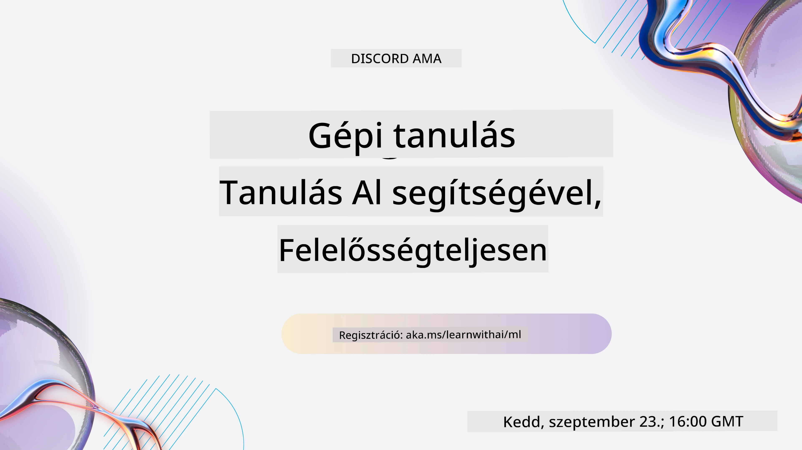
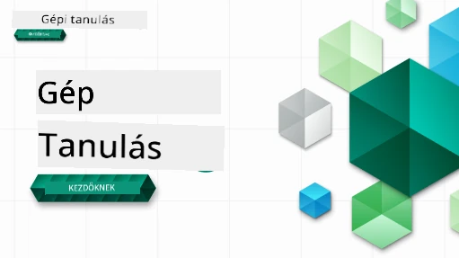

<!--
CO_OP_TRANSLATOR_METADATA:
{
  "original_hash": "ec8385130a8239ad9d827175126a0722",
  "translation_date": "2026-01-01T13:01:49+00:00",
  "source_file": "README.md",
  "language_code": "hu"
}
-->

### 🌐 Többnyelvű támogatás

#### GitHub Action által támogatott (Automatizált és mindig naprakész)

<!-- CO-OP TRANSLATOR LANGUAGES TABLE START -->
[Arab](../ar/README.md) | [Bengáli](../bn/README.md) | [Bolgár](../bg/README.md) | [Burmai (Myanmar)](../my/README.md) | [Kínai (egyszerűsített)](../zh/README.md) | [Kínai (hagyományos, Hongkong)](../hk/README.md) | [Kínai (hagyományos, Makaó)](../mo/README.md) | [Kínai (hagyományos, Tajvan)](../tw/README.md) | [Horvát](../hr/README.md) | [Cseh](../cs/README.md) | [Dán](../da/README.md) | [Holland](../nl/README.md) | [Észt](../et/README.md) | [Finn](../fi/README.md) | [Francia](../fr/README.md) | [Német](../de/README.md) | [Görög](../el/README.md) | [Héber](../he/README.md) | [Hindi](../hi/README.md) | [Magyar](./README.md) | [Indonéz](../id/README.md) | [Olasz](../it/README.md) | [Japán](../ja/README.md) | [Kannada](../kn/README.md) | [Koreai](../ko/README.md) | [Litván](../lt/README.md) | [Maláj](../ms/README.md) | [Malajálam](../ml/README.md) | [Maráthi](../mr/README.md) | [Nepáli](../ne/README.md) | [Nigériai pidgin](../pcm/README.md) | [Norvég](../no/README.md) | [Perzsa (Farsi)](../fa/README.md) | [Lengyel](../pl/README.md) | [Portugál (Brazília)](../br/README.md) | [Portugál (Portugália)](../pt/README.md) | [Pandzsábi (Gurmukhi)](../pa/README.md) | [Román](../ro/README.md) | [Orosz](../ru/README.md) | [Szerb (cirill)](../sr/README.md) | [Szlovák](../sk/README.md) | [Szlovén](../sl/README.md) | [Spanyol](../es/README.md) | [Szuahéli](../sw/README.md) | [Svéd](../sv/README.md) | [Tagalog (Filippínó)](../tl/README.md) | [Tamil](../ta/README.md) | [Telugu](../te/README.md) | [Thai](../th/README.md) | [Török](../tr/README.md) | [Ukrán](../uk/README.md) | [Urdu](../ur/README.md) | [Vietnami](../vi/README.md)
<!-- CO-OP TRANSLATOR LANGUAGES TABLE END -->

#### Csatlakozz közösségünkhöz

Folyamatban van a Discordon a "Learn with AI" sorozatunk, további információkért és csatlakozáshoz látogass el a [Learn with AI Series](https://aka.ms/learnwithai/discord) oldalra 2025. szeptember 18. és 30. között. Tippeket és trükköket kapsz a GitHub Copilot adattudományban való használatához.

# Gépi tanulás kezdőknek - Tanterv

> 🌍 Utazz a világ körül, miközben a gépi tanulást a világ kultúráin keresztül fedezzük fel 🌍

A Microsoft Cloud Advocates örömmel kínál egy 12 hetes, 26 leckéből álló tantervet, amely a **Gépi tanulásról** szól. Ebben a tananyagban a főként Scikit-learn könyvtárat használó, néha "klasszikus gépi tanulásnak" nevezett módszereket tanulhatod meg, és elkerüljük a mélytanulást, amely a mi [AI for Beginners tantervünkben](https://aka.ms/ai4beginners) található. Ezeket a leckéket párosítsd a mi ['Data Science for Beginners' tantervünkkel](https://aka.ms/ds4beginners) is!

Utazz velünk a világ körül, miközben ezeket a klasszikus technikákat a világ számos területéről származó adatokon alkalmazzuk. Minden lecke tartalmaz elő- és utóleckés kvízeket, írásos utasításokat a lecke elvégzéséhez, egy megoldást, egy feladatot és még többet. Projektalapú pedagógiánk lehetővé teszi, hogy tanulj miközben építesz — ez egy bevált módja annak, hogy az új készségek "megragadjanak".

**✍️ Szívből köszönet szerzőinknek** Jen Looper, Stephen Howell, Francesca Lazzeri, Tomomi Imura, Cassie Breviu, Dmitry Soshnikov, Chris Noring, Anirban Mukherjee, Ornella Altunyan, Ruth Yakubu és Amy Boyd

**🎨 Köszönet illusztrátorainknak is** Tomomi Imura, Dasani Madipalli és Jen Looper

**🙏 Külön köszönet 🙏 Microsoft Student Ambassador szerzőinknek, lektorainknak és tartalomhozzájárulóinknak**, különösen Rishit Dagli, Muhammad Sakib Khan Inan, Rohan Raj, Alexandru Petrescu, Abhishek Jaiswal, Nawrin Tabassum, Ioan Samuila és Snigdha Agarwal

**🤩 Külön hála Microsoft Student Ambassadors Eric Wanjau, Jasleen Sondhi és Vidushi Gupta részére az R leckéinkért!**

# Első lépések

Kövesd az alábbi lépéseket:
1. **Készíts forkot a tárhelyről**: Kattints a "Fork" gombra ennek az oldalnak a jobb felső sarkában.
2. **Klónozd a tárhelyet**:   `git clone https://github.com/microsoft/ML-For-Beginners.git`

> [találd meg a tanfolyam összes további forrását a Microsoft Learn gyűjteményünkben](https://learn.microsoft.com/en-us/collections/qrqzamz1nn2wx3?WT.mc_id=academic-77952-bethanycheum)

> 🔧 **Segítség kell?** Nézd meg a [Troubleshooting Guide](TROUBLESHOOTING.md)-t a telepítéssel, beállítással és a leckék futtatásával kapcsolatos gyakori problémák megoldásaiért.

**[Diákok](https://aka.ms/student-page)**, a tananyag használatához forkold le az egész repót a saját GitHub fiókodba, és oldd meg a feladatokat egyénileg vagy csoportban:

- Kezdd egy előadás előtti kvízzel.
- Olvasd el az előadást és hajtsd végre a tevékenységeket, állj meg és gondolkodj el minden tudásellenőrzésnél.
- Próbáld meg a projekteket a leckék megértésével elkészíteni, ahelyett, hogy csak lefuttatnád a megoldást; azonban az a kód elérhető minden projektorientált lecke `/solution` mappájában.
- Töltsd ki az előadás utáni kvízt.
- Teljesítsd a kihívást.
- Teljesítsd a feladatot.
- Egy leccsecsoport befejezése után látogass el a [Discussion Board](https://github.com/microsoft/ML-For-Beginners/discussions)-ra és "tanulj hangosan" egy megfelelő PAT rubrika kitöltésével. A 'PAT' egy Progress Assessment Tool (Haladási értékelő eszköz), amely egy olyan rubrika, amelyet kitöltesz a tanulásod elősegítésére. Más PAT-ekre is reagálhatsz, hogy közösen tanulhassunk.

> A további tanuláshoz ajánljuk ezeket a [Microsoft Learn](https://docs.microsoft.com/en-us/users/jenlooper-2911/collections/k7o7tg1gp306q4?WT.mc_id=academic-77952-leestott) modulokat és tanulási útvonalakat.

**Tanárok**, [tartalmaztunk néhány javaslatot](for-teachers.md) arra vonatkozóan, hogyan használhatjátok ezt a tananyagot.

---

## Videós bemutatók

Néhány lecke rövid videó formában is elérhető. Ezeket megtalálhatod beágyazva a leckékben, vagy a [ML for Beginners lejátszási listán a Microsoft Developer YouTube csatornán](https://aka.ms/ml-beginners-videos) az alábbi képre kattintva.

---

## Ismerd meg a csapatot

**Gif készítette** [Mohit Jaisal](https://linkedin.com/in/mohitjaisal)

> 🎥 Kattints a fenti képre a projektről és az alkotókról szóló videóért!

---

## Pedagógia

Két pedagógiai alapelvet választottunk ennek a tananyagnak a kialakításakor: biztosítani, hogy kézben fogható, **projektalapú** legyen, és hogy tartalmazzon **gyakori kvízeket**. Ezenkívül a tananyag egy közös **téma** mentén épül, hogy koherens egészet alkosson.

Azáltal, hogy a tartalom illeszkedik a projektekhez, a folyamat érdekesebb lesz a diákok számára és a fogalmak elraktározása is javulni fog. Emellett egy alacsony tétű kvíz az óra előtt beállítja a tanuló szándékát egy téma elsajátítására, míg egy második kvíz az óra után biztosítja a további rögzülést. Ezt a tananyagot rugalmasra és szórakoztatóra terveztük, és egészben vagy részben is elvégezhető. A projektek kicsiben kezdődnek és a 12 hetes ciklus végére egyre összetettebbé válnak. A tananyag egy posztszkriptet is tartalmaz a gépi tanulás valós alkalmazásairól, amely extra krediteként vagy vitaalapként használható.

> Találd meg a mi [Code of Conduct](CODE_OF_CONDUCT.md), [Contributing](CONTRIBUTING.md), [Translation](TRANSLATIONS.md) és [Troubleshooting](TROUBLESHOOTING.md) útmutatóinkat. Várjuk építő jellegű visszajelzésedet!

## Minden lecke tartalmaz

- opcionális sketchnote-ot
- opcionális kiegészítő videót
- videós bemutatót (csak egyes leckék)
- [előadás előtti bemelegítő kvíz](https://ff-quizzes.netlify.app/en/ml/)
- írásos leckét
- projektalapú leckéknél lépésről-lépésre útmutatót a projekt elkészítéséhez
- tudásellenőrzéseket
- egy kihívást
- kiegészítő olvasmányt
- feladatot
- [előadás utáni kvíz](https://ff-quizzes.netlify.app/en/ml/)

> **Megjegyzés a nyelvekről**: Ezek a leckék elsősorban Pythonban íródtak, de sokuk elérhető R nyelven is. Egy R lecke elvégzéséhez menj a `/solution` mappába és keresd az R leckéket. Ezek .rmd kiterjesztésű fájlok, amelyek egy **R Markdown** fájlt jelentenek, amely egyszerűen definiálható úgy, hogy `kódblokkokat` (R vagy más nyelvekhez) és egy `YAML fejlécet` (ami irányítja, hogyan formázódnak a kimenetek, pl. PDF) ágyaz be egy `Markdown dokumentumban`. Ennek megfelelően kiváló szerkesztési keretet ad a data science számára, mivel lehetővé teszi, hogy kombináld a kódot, annak kimenetét és a gondolataidat úgy, hogy Markdownban írod le. R Markdown dokumentumok továbbá renderelhetők olyan kimeneti formátumokra, mint PDF, HTML vagy Word.

> **Megjegyzés a kvízekről**: Az összes kvíz a [Quiz App mappában](../../quiz-app) található, összesen 52 kvíz három-három kérdéssel. A leckékben vannak linkelve, de a quiz app helyileg is futtatható; kövesd a `quiz-app` mappában található utasításokat a helyi hosztoláshoz vagy Azure-ra történő telepítéshez.

| Lecke száma |                             Téma                              |                   Leckecsoport                   | Tanulási célok                                                                                                             |                                                              Kapcsolt lecke                                                               |                        Szerző                        |
| :-----------: | :------------------------------------------------------------: | :-------------------------------------------------: | ------------------------------------------------------------------------------------------------------------------------------- | :--------------------------------------------------------------------------------------------------------------------------------------: | :--------------------------------------------------: |
|      01       |                Bevezetés a gépi tanulásba                      |      [Bevezetés](1-Introduction/README.md)         | Ismerje meg a gépi tanulás alapfogalmait                                                                                         |                                             [Lecke](1-Introduction/1-intro-to-ML/README.md)                                             |                       Muhammad                       |
|      02       |                A gépi tanulás története                        |      [Bevezetés](1-Introduction/README.md)         | Ismerje meg ennek a területnek a történetét                                                                                      |                                            [Lecke](1-Introduction/2-history-of-ML/README.md)                                            |                     Jen és Amy                      |
|      03       |                 Méltányosság és gépi tanulás                   |      [Bevezetés](1-Introduction/README.md)         | Melyek a méltányossággal kapcsolatos fontos filozófiai kérdések, amelyeket a hallgatóknak figyelembe kell venniük ML-modellek építésekor és alkalmazásakor? |                                              [Lecke](1-Introduction/3-fairness/README.md)                                               |                        Tomomi                        |
|      04       |                Gépi tanulási technikák                         |      [Bevezetés](1-Introduction/README.md)         | Milyen technikákat használnak a gépi tanulás kutatói ML-modellek építéséhez?                                                     |                                          [Lecke](1-Introduction/4-techniques-of-ML/README.md)                                           |                    Chris és Jen                     |
|      05       |                   Bevezetés a regresszióba                     |        [Regresszió](2-Regression/README.md)        | Ismerkedjen meg a Python és a Scikit-learn használatával regressziós modellekhez                                                |         [Python](2-Regression/1-Tools/README.md) • [R](../../2-Regression/1-Tools/solution/R/lesson_1.html)         |      Jen • Eric Wanjau       |
|      06       |                Észak-amerikai tökárak 🎃                       |        [Regresszió](2-Regression/README.md)        | Adatok vizualizálása és tisztítása ML-re való felkészüléshez                                                                      |          [Python](2-Regression/2-Data/README.md) • [R](../../2-Regression/2-Data/solution/R/lesson_2.html)          |      Jen • Eric Wanjau       |
|      07       |                Észak-amerikai tökárak 🎃                       |        [Regresszió](2-Regression/README.md)        | Lineáris és polinom regressziós modellek építése                                                                                 |        [Python](2-Regression/3-Linear/README.md) • [R](../../2-Regression/3-Linear/solution/R/lesson_3.html)        |      Jen és Dmitry • Eric Wanjau       |
|      08       |                Észak-amerikai tökárak 🎃                       |        [Regresszió](2-Regression/README.md)        | Logisztikus regressziós modell építése                                                                                            |     [Python](2-Regression/4-Logistic/README.md) • [R](../../2-Regression/4-Logistic/solution/R/lesson_4.html)      |      Jen • Eric Wanjau       |
|      09       |                          Webalkalmazás 🔌                      |           [Webalkalmazás](3-Web-App/README.md)     | Webalkalmazás készítése a betanított modell használatához                                                                        |                                                 [Python](3-Web-App/1-Web-App/README.md)                                                  |                         Jen                          |
|      10       |                 Bevezetés az osztályozáshoz                    |    [Osztályozás](4-Classification/README.md)      | Adatok tisztítása, előkészítése és vizualizálása; bevezetés az osztályozásba                                                     | [Python](4-Classification/1-Introduction/README.md) • [R](../../4-Classification/1-Introduction/solution/R/lesson_10.html)  | Jen és Cassie • Eric Wanjau |
|      11       |             Finom ázsiai és indiai konyhák 🍜                  |    [Osztályozás](4-Classification/README.md)      | Bevezetés az osztályozókhoz                                                                                                      | [Python](4-Classification/2-Classifiers-1/README.md) • [R](../../4-Classification/2-Classifiers-1/solution/R/lesson_11.html) | Jen és Cassie • Eric Wanjau |
|      12       |             Finom ázsiai és indiai konyhák 🍜                  |    [Osztályozás](4-Classification/README.md)      | További osztályozók                                                                                                              | [Python](4-Classification/3-Classifiers-2/README.md) • [R](../../4-Classification/3-Classifiers-2/solution/R/lesson_12.html) | Jen és Cassie • Eric Wanjau |
|      13       |             Finom ázsiai és indiai konyhák 🍜                  |    [Osztályozás](4-Classification/README.md)      | Ajánló webalkalmazás készítése a modell használatával                                                                            |                                              [Python](4-Classification/4-Applied/README.md)                                              |                         Jen                          |
|      14       |                   Bevezetés a klaszterezésbe                   |        [Klaszterezés](5-Clustering/README.md)     | Adatok tisztítása, előkészítése és vizualizálása; bevezetés a klaszterezésbe                                                     |         [Python](5-Clustering/1-Visualize/README.md) • [R](../../5-Clustering/1-Visualize/solution/R/lesson_14.html)         |      Jen • Eric Wanjau       |
|      15       |              Nigériai zenei ízlések felfedezése 🎧             |        [Klaszterezés](5-Clustering/README.md)     | A K-Means klaszterezési módszer felfedezése                                                                                       |           [Python](5-Clustering/2-K-Means/README.md) • [R](../../5-Clustering/2-K-Means/solution/R/lesson_15.html)           |      Jen • Eric Wanjau       |
|      16       |        Bevezetés a természetes nyelvfeldolgozásba ☕️         |   [Természetes nyelvfeldolgozás](6-NLP/README.md)  | Ismerje meg az NLP alapjait egy egyszerű bot készítésével                                                                        |                                             [Python](6-NLP/1-Introduction-to-NLP/README.md)                                              |                       Stephen                        |
|      17       |                      Gyakori NLP-feladatok ☕️                  |   [Természetes nyelvfeldolgozás](6-NLP/README.md)  | Mélyítse NLP-ismereteit azáltal, hogy megérti a nyelvi szerkezetek kezeléséhez szükséges gyakori feladatokat                       |                                                    [Python](6-NLP/2-Tasks/README.md)                                                     |                       Stephen                        |
|      18       |             Fordítás és érzelem-elemzés ♥️                     |   [Természetes nyelvfeldolgozás](6-NLP/README.md)  | Fordítás és érzelem-elemzés Jane Austen műveivel                                                                                 |                                            [Python](6-NLP/3-Translation-Sentiment/README.md)                                             |                       Stephen                        |
|      19       |                  Romantikus európai szállodák ♥️               |   [Természetes nyelvfeldolgozás](6-NLP/README.md)  | Érzelem-elemzés szállodai értékelésekkel 1                                                                                       |                                               [Python](6-NLP/4-Hotel-Reviews-1/README.md)                                                |                       Stephen                        |
|      20       |                  Romantikus európai szállodák ♥️               |   [Természetes nyelvfeldolgozás](6-NLP/README.md)  | Érzelem-elemzés szállodai értékelésekkel 2                                                                                       |                                               [Python](6-NLP/5-Hotel-Reviews-2/README.md)                                                |                       Stephen                        |
|      21       |            Bevezetés az idősoros előrejelzésbe                 |        [Idősorok](7-TimeSeries/README.md)         | Bevezetés az idősoros előrejelzésbe                                                                                              |                                             [Python](7-TimeSeries/1-Introduction/README.md)                                              |                      Francesca                       |
|      22       | ⚡️ Világ energiafelhasználása ⚡️ - idősoros előrejelzés ARIMA-val |        [Idősorok](7-TimeSeries/README.md)         | Idősoros előrejelzés ARIMA-val                                                                                                   |                                                 [Python](7-TimeSeries/2-ARIMA/README.md)                                                 |                      Francesca                       |
|      23       |  ⚡️ Világ energiafelhasználása ⚡️ - idősoros előrejelzés SVR-rel  |        [Idősorok](7-TimeSeries/README.md)         | Idősoros előrejelzés Support Vector Regressorral                                                                                 |                                                  [Python](7-TimeSeries/3-SVR/README.md)                                                  |                       Anirban                        |
|      24       |             Bevezetés a megerősítéses tanulásba               | [Megerősítéses tanulás](8-Reinforcement/README.md) | Bevezetés a megerősítéses tanulásba Q-tanulással                                                                                 |                                             [Python](8-Reinforcement/1-QLearning/README.md)                                              |                        Dmitry                        |
|      25       |                 Segíts Péternek elkerülni a farkast! 🐺         | [Megerősítéses tanulás](8-Reinforcement/README.md) | Megerősítéses tanulás a Gym könyvtárral                                                                                            |                                                [Python](8-Reinforcement/2-Gym/README.md)                                                 |                        Dmitry                        |
|  Utószó       |            Valós világ ML forgatókönyvek és alkalmazások       |      [ML a gyakorlatban](9-Real-World/README.md)   | Érdekes és szemléletes valós alkalmazások a klasszikus ML területéről                                                             |                                             [Lecke](9-Real-World/1-Applications/README.md)                                              |                         Csapat                         |
|  Utószó       |            Modellek hibakeresése ML-ben az RAI irányítópult segítségével          |      [ML a gyakorlatban](9-Real-World/README.md)   | Modellek hibakeresése gépi tanulásban a Responsible AI irányítópult komponenseivel                                                               |                                             [Lecke](9-Real-World/2-Debugging-ML-Models/README.md)                                              |                         Ruth Yakubu                       |

> [Keresse meg az összes további forrást ehhez a kurzushoz a Microsoft Learn gyűjteményünkben](https://learn.microsoft.com/en-us/collections/qrqzamz1nn2wx3?WT.mc_id=academic-77952-bethanycheum)

## Offline hozzáférés

A dokumentációt offline is futtathatja a [Docsify](https://docsify.js.org/#/) használatával. Forkolja ezt a repót, [telepítse a Docsify-t](https://docsify.js.org/#/quickstart) a helyi gépére, és a repo gyökérmappájában írja be a `docsify serve` parancsot. A weboldal a 3000-es porton lesz kiszolgálva a localhoston: `localhost:3000`.

## PDF-ek

A tanterv PDF változatát linkekkel megtalálja [itt](https://microsoft.github.io/ML-For-Beginners/pdf/readme.pdf).

## 🎒 Egyéb kurzusok 

Csapatunk más kurzusokat is készít! Nézze meg:

<!-- CO-OP TRANSLATOR OTHER COURSES START -->
### LangChain

---

### Azure / Edge / MCP / Ügynökök

---
 
### Generatív AI sorozat

[-9333EA?style=for-the-badge&labelColor=E5E7EB&color=9333EA)](https://github.com/microsoft/Generative-AI-for-beginners-dotnet?WT.mc_id=academic-105485-koreyst)
[-C084FC?style=for-the-badge&labelColor=E5E7EB&color=C084FC)](https://github.com/microsoft/generative-ai-for-beginners-java?WT.mc_id=academic-105485-koreyst)
[-E879F9?style=for-the-badge&labelColor=E5E7EB&color=E879F9)](https://github.com/microsoft/generative-ai-with-javascript?WT.mc_id=academic-105485-koreyst)

---
 
### Alapvető tananyagok

---
 
### Copilot-sorozat

<!-- CO-OP TRANSLATOR OTHER COURSES END -->

## Segítség kérése

Ha elakadsz, vagy bármilyen kérdésed van az MI-alkalmazások fejlesztésével kapcsolatban. Csatlakozz más tanulókhoz és tapasztalt fejlesztőkhöz az MCP-ről folytatott beszélgetésekhez. Ez egy támogató közösség, ahol a kérdések szívesen látottak és a tudás szabadon megosztott.

Ha termékvisszajelzésed van, vagy hibákat tapasztalsz a fejlesztés során, látogass el ide:

---

<!-- CO-OP TRANSLATOR DISCLAIMER START -->
Felelősségkizárás:
Ez a dokumentum a mesterséges intelligencián alapuló fordítószolgáltatás, a Co-op Translator (https://github.com/Azure/co-op-translator) segítségével készült. Bár a pontosságra törekszünk, kérjük, vegye figyelembe, hogy az automatikus fordítások hibákat vagy pontatlanságokat tartalmazhatnak. Az eredeti dokumentum az eredeti nyelvén tekintendő irányadónak. Kritikus jelentőségű információk esetén professzionális, emberi fordítást javasolunk. Nem vállalunk felelősséget a fordítás használatából eredő félreértésekért vagy téves értelmezésekért.
<!-- CO-OP TRANSLATOR DISCLAIMER END -->