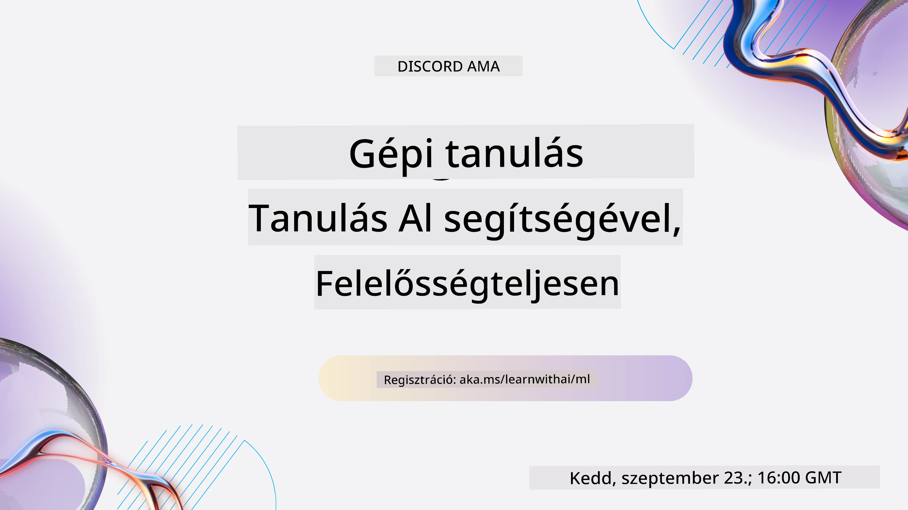
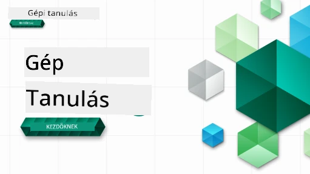

[](https://github.com/microsoft/ML-For-Beginners/blob/master/LICENSE)
[](https://GitHub.com/microsoft/ML-For-Beginners/graphs/contributors/)
[](https://GitHub.com/microsoft/ML-For-Beginners/issues/)
[](https://GitHub.com/microsoft/ML-For-Beginners/pulls/)
[](http://makeapullrequest.com)

[](https://GitHub.com/microsoft/ML-For-Beginners/watchers/)
[](https://GitHub.com/microsoft/ML-For-Beginners/network/)
[](https://GitHub.com/microsoft/ML-For-Beginners/stargazers/)

### 🌐 Többnyelvű támogatás

#### GitHub Action révén támogatott (Automatizált és mindig naprakész)

<!-- CO-OP TRANSLATOR LANGUAGES TABLE START -->
[Arab](../ar/README.md) | [Bengáli](../bn/README.md) | [Bolgár](../bg/README.md) | [Burmai (Myanmar)](../my/README.md) | [Kínai (egyszerűsített)](../zh-CN/README.md) | [Kínai (hagyományos, Hongkong)](../zh-HK/README.md) | [Kínai (hagyományos, Makaó)](../zh-MO/README.md) | [Kínai (hagyományos, Tajvan)](../zh-TW/README.md) | [Horvát](../hr/README.md) | [Cseh](../cs/README.md) | [Dán](../da/README.md) | [Holland](../nl/README.md) | [Észt](../et/README.md) | [Finn](../fi/README.md) | [Francia](../fr/README.md) | [Német](../de/README.md) | [Görög](../el/README.md) | [Héber](../he/README.md) | [Hindi](../hi/README.md) | [Magyar](./README.md) | [Indonéz](../id/README.md) | [Olasz](../it/README.md) | [Japán](../ja/README.md) | [Kannada](../kn/README.md) | [Khmer](../km/README.md) | [Korea](../ko/README.md) | [Litván](../lt/README.md) | [Malaáj](../ms/README.md) | [Malajálam](../ml/README.md) | [Maráthi](../mr/README.md) | [Nepáli](../ne/README.md) | [Nigériai pidgin](../pcm/README.md) | [Norvég](../no/README.md) | [Perzsa (Fárszi)](../fa/README.md) | [Lengyel](../pl/README.md) | [Portugál (Brazília)](../pt-BR/README.md) | [Portugál (Portugália)](../pt-PT/README.md) | [Pandzsábi (Gurmukhi)](../pa/README.md) | [Román](../ro/README.md) | [Orosz](../ru/README.md) | [Szerb (cirill)](../sr/README.md) | [Szlovák](../sk/README.md) | [Szlovén](../sl/README.md) | [Spanyol](../es/README.md) | [Szuahéli](../sw/README.md) | [Svéd](../sv/README.md) | [Tagalog (filippínó)](../tl/README.md) | [Tamil](../ta/README.md) | [Telugu](../te/README.md) | [Thai](../th/README.md) | [Török](../tr/README.md) | [Ukrán](../uk/README.md) | [Urdu](../ur/README.md) | [Vietnami](../vi/README.md)

> **Inkábban szeretnéd helyben klónozni?**
>
> Ez a tároló több mint 50 nyelvi fordítást tartalmaz, ami jelentősen megnöveli a letöltési méretet. Fordítások nélküli klónozáshoz használd a sparse checkout-ot:
>
> **Bash / macOS / Linux:**
> ```bash
> git clone --filter=blob:none --sparse https://github.com/microsoft/ML-For-Beginners.git
> cd ML-For-Beginners
> git sparse-checkout set --no-cone '/*' '!translations' '!translated_images'
> ```
>
> **CMD (Windows):**
> ```cmd
> git clone --filter=blob:none --sparse https://github.com/microsoft/ML-For-Beginners.git
> cd ML-For-Beginners
> git sparse-checkout set --no-cone "/*" "!translations" "!translated_images"
> ```
>
> Ez mindent megad, amire szükséged van a tanfolyam teljesítéséhez, sokkal gyorsabb letöltéssel.
<!-- CO-OP TRANSLATOR LANGUAGES TABLE END -->

#### Csatlakozz a közösségünkhöz

[](https://discord.gg/nTYy5BXMWG)

Folyamatban van egy Discord AI tanulósorozatunk, tudj meg többet és csatlakozz hozzánk a [Learn with AI Series](https://aka.ms/learnwithai/discord) eseményen 2025. szeptember 18-30. között. Tippeket és trükköket kapsz majd a GitHub Copilot használatához az Adattudományban.



# Gépi tanulás kezdőknek – Tanterv

> 🌍 Utazz körbe a világon, miközben a gépi tanulást világkultúrákon keresztül fedezzük fel 🌍

A Microsoft Cloud Advocates örömmel kínál egy 12 hetes, 26 leckéből álló tantervet, amely a **Gépi tanulásról** szól. Ebben a tantervben megismerkedsz azzal, amit néha **klasszikus gépi tanulásnak** neveznek, főként a Scikit-learn könyvtár használatával, elkerülve a mély tanulást, amelyet a [Kezdőknek szóló AI tantervünkben](https://aka.ms/ai4beginners) tárgyalunk. Ezeket a leckéket kombináld a ['Kezdőknek szóló adattudomány' tantervünkkel](https://aka.ms/ds4beginners) is!

Utazz velünk a világ körül, miközben ezeket a klasszikus technikákat világ sokféle adatán alkalmazzuk. Minden leckéhez elő- és utótesztek tartoznak, írott útmutató a lecke elvégzéséhez, megoldás, feladat és még sok más. A projektalapú pedagógiánk lehetővé teszi, hogy tanulás közben építs, ami bizonyított módszer az új készségek megtartására.

**✍️ Szívből köszönjük szerzőinknek** Jen Looper, Stephen Howell, Francesca Lazzeri, Tomomi Imura, Cassie Breviu, Dmitry Soshnikov, Chris Noring, Anirban Mukherjee, Ornella Altunyan, Ruth Yakubu és Amy Boyd

**🎨 Köszönet illusztrátorainknak is** Tomomi Imura, Dasani Madipalli és Jen Looper

**🙏 Külön köszönet 🙏 Microsoft Student Ambassador szerzőinknek, lektorainknak és tartalomközreműködőinknek**, különösen Rishit Dagli, Muhammad Sakib Khan Inan, Rohan Raj, Alexandru Petrescu, Abhishek Jaiswal, Nawrin Tabassum, Ioan Samuila és Snigdha Agarwal

**🤩 Külön hála a Microsoft Student Ambassadors Eric Wanjau, Jasleen Sondhi és Vidushi Gupta részére az R leckéinkért!**

# Első lépések

Kövesd ezeket a lépéseket:
1. **Forkold a tárolót**: Kattints a "Fork" gombra ennek az oldalnak a jobb felső sarkában.
2. **Klónozd a tárolót**: `git clone https://github.com/microsoft/ML-For-Beginners.git`

> 💡 **Gyors kezdő tipp:** Szeretnél böngészőben elkezdeni anélkül, hogy helyileg állítanád be a Pythont? Használd a [GitHub Codespaces](https://github.com/features/codespaces) szolgáltatást, hogy felhőalapú fejlesztői környezetet hozz létre a forkodnak. Nyisd meg a zöld **Code** menüt, válaszd a **Codespaces** lehetőséget, és hozz létre egy codespace-et; a szükséges függőségeket telepítsd minden leckénél benne.

> [minden további forrást megtalálsz ehhez a tanfolyamhoz a Microsoft Learn gyűjteményünkben](https://learn.microsoft.com/en-us/collections/qrqzamz1nn2wx3?WT.mc_id=academic-77952-bethanycheum)

> 🔧 **Segítségre van szükséged?** Nézd meg [Hibaelhárító útmutatónkat](TROUBLESHOOTING.md), ahol megoldásokat találsz a telepítéssel, beállítással és leckék futtatásával kapcsolatos gyakori problémákra.


**[Diákoknak](https://aka.ms/student-page)**, a tanterv használatához forkold a teljes tárolót a saját GitHub fiókodba, és végezd el a feladatokat egyedül vagy csoportban:

- Kezdd egy előadás előtti kvízzel.
- Olvasd el az előadást, és végezd el a tevékenységeket, minden tudásellenőrzésnél megállva és gondolkodva.
- Próbáld meg a projekteket a leckék megértése alapján elkészíteni, ne csak a megoldáskód futtatásával; a kód azonban elérhető a `/solution` mappákban minden projektalapú leckénél.
- Tedd meg az előadás utáni kvízt.
- Oldd meg a kihívást.
- Végezd el a feladatot.
- Miután elvégeztél egy leckecsoportot, látogass el a [Vita fórumra](https://github.com/microsoft/ML-For-Beginners/discussions), és "tanulj hangosan" azzal, hogy kitöltöd az erre szolgáló PAT elégtérképet. A PAT egy haladási értékelő eszköz, amelyet kitöltesz a tanulás előmozdításához. Más PAT-ekre is reagálhatsz, így együtt tanulhatunk.

> További tanuláshoz ajánljuk, hogy kövesd ezeket a [Microsoft Learn](https://docs.microsoft.com/en-us/users/jenlooper-2911/collections/k7o7tg1gp306q4?WT.mc_id=academic-77952-leestott) modulokat és tanulási útvonalakat.

**Tanárként** [találsz néhány javaslatot](for-teachers.md) a tanterv használatára.

---

## Videós bemutatók

Néhány lecke rövid videó formájában is elérhető. Ezeket megtalálod közvetlenül a leckékben, vagy a [ML for Beginners lejátszási listán a Microsoft Developer YouTube csatornán](https://aka.ms/ml-beginners-videos) a képre kattintva.

[](https://aka.ms/ml-beginners-videos)

---

## Ismerd meg a csapatot

[](https://youtu.be/Tj1XWrDSYJU)

**GIF készítője:** [Mohit Jaisal](https://linkedin.com/in/mohitjaisal)

> 🎥 Kattints a fenti képre a projektről és alkotóiról szóló videó megtekintéséhez!

---

## Pedagógia

A tanterv összeállításakor két pedagógiai elvet választottunk: kézzelfogható, **projektalapú** tanulás és **gyakori kvízek** alkalmazása. Ezen kívül a tantervnek közös **tematikája** van, hogy egységes legyen.

Azáltal, hogy a tartalom összhangban van a projektekkel, a folyamat élvezetesebb a diákok számára, és a fogalmak jobban megmaradnak. Egy alacsony tétű kvíz az óra előtt beállítja a tanuló szándékát egy téma megtanulására, míg egy második kvíz az óra után további megtartást biztosít. Ez a tanterv rugalmas és szórakoztató, egészben vagy részben is elvégezhető. A projektek kicsiben kezdődnek és a 12 hetes ciklus végére egyre összetettebbek lesznek. A tanterv egy posztszkriptet is tartalmaz a ML valódi alkalmazásairól, amely extra pontként vagy vitaalapként használható.

> Találd meg az [Etikai Kódexünket](CODE_OF_CONDUCT.md), [Hozzájárulási](CONTRIBUTING.md), [Fordítási](..) és [Hibaelhárítási](TROUBLESHOOTING.md) irányelveinket. Szívesen fogadjuk építő jellegű visszajelzésedet!

## Minden lecke tartalmazza

- opcionális vázlatjegyzetet
- opcionális kiegészítő videót
- videós bemutatót (csak néhány leckénél)
- [előadás előtti bemelegítő kvíz](https://ff-quizzes.netlify.app/en/ml/)
- írott leckét
- projektalapú leckéknél lépésről lépésre útmutatókat a projekt elkészítéséhez
- tudásellenőrzéseket
- egy kihívást
- kiegészítő olvasmányt
- feladatot
- [előadás utáni kvíz](https://ff-quizzes.netlify.app/en/ml/)

> **Megjegyzés a nyelvekről**: Ezek a leckék elsősorban Pythonban íródtak, de sok elérhető R-ben is. Egy R lecke elvégzéséhez keresd meg a `/solution` mappában az R leckéket. Ezek .rmd kiterjesztésűek, ami egy **R Markdown** fájlt jelent, amit egyszerűen definiálhatunk úgy, hogy egy `kódrészleteket` (R vagy más nyelvek) és egy `YAML fejlécet` (amely útmutatást ad a kimenetek, pl. PDF formázásához) ágyaz be egy `Markdown dokumentumba`. Így ez példamutató szerkesztési keretrendszer az adattudományhoz, mert lehetővé teszi kód, kimenet és gondolatok egyidejű dokumentálását Markdownban. Ezen felül az R Markdown dokumentumok PDF, HTML vagy Word kimeneti formátumokra is fordíthatók.

> **Megjegyzés a kvízekről**: Az összes kvíz megtalálható a [Kvíz alkalmazás mappában](../../quiz-app), összesen 52 kvíz három kérdéssel. Ezek be vannak linkelve a leckékből, de a kvíz alkalmazás helyileg is futtatható; a `quiz-app` mappában található utasításokat kövesd helyi hosztoláshoz vagy Azure-ra telepítéshez.

| Lecke száma |                             Téma                              |                   Lecke csoportosítása                   | Tanulási célok                                                                                                             |                                                              Kapcsolódó lecke                                                               |                        Szerző                        |
| :-----------: | :------------------------------------------------------------: | :-------------------------------------------------: | ------------------------------------------------------------------------------------------------------------------------------- | :--------------------------------------------------------------------------------------------------------------------------------------: | :--------------------------------------------------: |
|      01       |                Bevezetés a gépi tanulásba                |      [Bevezetés](1-Introduction/README.md)       | Ismerd meg a gépi tanulás alapfogalmait                                                                                |                                             [Tanóra](1-Introduction/1-intro-to-ML/README.md)                                             |                       Muhammad                       |
|      02       |                A gépi tanulás története                 |      [Bevezetés](1-Introduction/README.md)       | Ismerd meg a terület történetét                                                                                         |                                            [Tanóra](1-Introduction/2-history-of-ML/README.md)                                            |                     Jen és Amy                      |
|      03       |                 Méltányosság és gépi tanulás                  |      [Bevezetés](1-Introduction/README.md)       | Melyek a fontos filozófiai kérdések a méltányosság kapcsán, amelyeket a diákoknak figyelembe kell venniük ML modellek építése és alkalmazása során? |                                              [Tanóra](1-Introduction/3-fairness/README.md)                                               |                        Tomomi                        |
|      04       |                Gépi tanulási technikák                 |      [Bevezetés](1-Introduction/README.md)       | Milyen technikákat használnak a gépi tanulás kutatói ML modellek építésére?                                                                       |                                          [Tanóra](1-Introduction/4-techniques-of-ML/README.md)                                           |                    Chris és Jen                     |
|      05       |                   Bevezetés a regresszióhoz                   |        [Regresszió](2-Regression/README.md)         | Kezdd el a regressziós modelleket Python és Scikit-learn segítségével                                                                  |         [Python](2-Regression/1-Tools/README.md) • [R](../../2-Regression/1-Tools/solution/R/lesson_1.html)         |      Jen • Eric Wanjau       |
|      06       |                Észak-amerikai tökárak 🎃                |        [Regresszió](2-Regression/README.md)         | Ábrázold és tisztítsd meg az adatokat a gépi tanuláshoz                                                                                  |          [Python](2-Regression/2-Data/README.md) • [R](../../2-Regression/2-Data/solution/R/lesson_2.html)          |      Jen • Eric Wanjau       |
|      07       |                Észak-amerikai tökárak 🎃                |        [Regresszió](2-Regression/README.md)         | Építs lineáris és polinom regressziós modelleket                                                                                   |        [Python](2-Regression/3-Linear/README.md) • [R](../../2-Regression/3-Linear/solution/R/lesson_3.html)        |      Jen és Dmitry • Eric Wanjau       |
|      08       |                Észak-amerikai tökárak 🎃                |        [Regresszió](2-Regression/README.md)         | Építs logisztikus regressziós modellt                                                                                               |     [Python](2-Regression/4-Logistic/README.md) • [R](../../2-Regression/4-Logistic/solution/R/lesson_4.html)      |      Jen • Eric Wanjau       |
|      09       |                          Egy webalkalmazás 🔌                          |           [Webalkalmazás](3-Web-App/README.md)            | Építs egy webalkalmazást, amely használja a betanított modelled                                                                                       |                                                 [Python](3-Web-App/1-Web-App/README.md)                                                  |                         Jen                          |
|      10       |                 Bevezetés az osztályozásba                 |    [Osztályozás](4-Classification/README.md)     | Tisztítsd, készítsd elő és ábrázold az adataidat; bevezetés az osztályozásba                                                            | [Python](4-Classification/1-Introduction/README.md) • [R](../../4-Classification/1-Introduction/solution/R/lesson_10.html)  | Jen és Cassie • Eric Wanjau |
|      11       |             Ízletes ázsiai és indiai konyhák 🍜             |    [Osztályozás](4-Classification/README.md)     | Bevezetés az osztályozókba                                                                                                     | [Python](4-Classification/2-Classifiers-1/README.md) • [R](../../4-Classification/2-Classifiers-1/solution/R/lesson_11.html) | Jen és Cassie • Eric Wanjau |
|      12       |             Ízletes ázsiai és indiai konyhák 🍜             |    [Osztályozás](4-Classification/README.md)     | További osztályozók                                                                                                                | [Python](4-Classification/3-Classifiers-2/README.md) • [R](../../4-Classification/3-Classifiers-2/solution/R/lesson_12.html) | Jen és Cassie • Eric Wanjau |
|      13       |             Ízletes ázsiai és indiai konyhák 🍜             |    [Osztályozás](4-Classification/README.md)     | Építs egy ajánló webalkalmazást a modelled segítségével                                                                                    |                                              [Python](4-Classification/4-Applied/README.md)                                              |                         Jen                          |
|      14       |                   Bevezetés a klaszterezéshez                   |        [Klaszterezés](5-Clustering/README.md)         | Tisztítsd, készítsd elő és ábrázold az adataidat; bevezetés a klaszterezésbe                                                                |         [Python](5-Clustering/1-Visualize/README.md) • [R](../../5-Clustering/1-Visualize/solution/R/lesson_14.html)         |      Jen • Eric Wanjau       |
|      15       |              Felfedező túra a nigériai zenei ízlések 🎧              |        [Klaszterezés](5-Clustering/README.md)         | Fedezd fel a K-közép klaszterezési módszert                                                                                           |           [Python](5-Clustering/2-K-Means/README.md) • [R](../../5-Clustering/2-K-Means/solution/R/lesson_15.html)           |      Jen • Eric Wanjau       |
|      16       |        Bevezetés a természetes nyelv feldolgozásba ☕️         |   [Természetes nyelv feldolgozás](6-NLP/README.md)    | Ismerd meg az NLP alapjait egy egyszerű bot építésével                                                                             |                                             [Python](6-NLP/1-Introduction-to-NLP/README.md)                                              |                       Stephen                        |
|      17       |                      Gyakori NLP feladatok ☕️                      |   [Természetes nyelv feldolgozás](6-NLP/README.md)    | Mélyítsd el NLP ismereteidet a nyelvi struktúrákkal kapcsolatos gyakori feladatok megértésével                          |                                                    [Python](6-NLP/2-Tasks/README.md)                                                     |                       Stephen                        |
|      18       |             Fordítás és érzelem elemzés ♥️              |   [Természetes nyelv feldolgozás](6-NLP/README.md)    | Fordítás és érzelem elemzés Jane Austen művei alapján                                                                             |                                            [Python](6-NLP/3-Translation-Sentiment/README.md)                                             |                       Stephen                        |
|      19       |                  Romantikus európai hotelek ♥️                  |   [Természetes nyelv feldolgozás](6-NLP/README.md)    | Érzelem elemzés hotel értékelések alapján 1                                                                                         |                                               [Python](6-NLP/4-Hotel-Reviews-1/README.md)                                                |                       Stephen                        |
|      20       |                  Romantikus európai hotelek ♥️                  |   [Természetes nyelv feldolgozás](6-NLP/README.md)    | Érzelem elemzés hotel értékelések alapján 2                                                                                         |                                               [Python](6-NLP/5-Hotel-Reviews-2/README.md)                                                |                       Stephen                        |
|      21       |            Bevezetés az idősor előrejelzésbe             |        [Idősor](7-TimeSeries/README.md)        | Bevezetés az idősor előrejelzésbe                                                                                         |                                             [Python](7-TimeSeries/1-Introduction/README.md)                                              |                      Francesca                       |
|      22       | ⚡️ Világ energiafelhasználás ⚡️ - idősor előrejelzés ARIMA-val |        [Idősor](7-TimeSeries/README.md)        | Idősor előrejelzés ARIMA modellel                                                                                              |                                                 [Python](7-TimeSeries/2-ARIMA/README.md)                                                 |                      Francesca                       |
|      23       |  ⚡️ Világ energiafelhasználás ⚡️ - idősor előrejelzés SVR-rel  |        [Idősor](7-TimeSeries/README.md)        | Idősor előrejelzés Támogatott Vektoros Regresszorral                                                                           |                                                  [Python](7-TimeSeries/3-SVR/README.md)                                                  |                       Anirban                        |
|      24       |             Bevezetés a megerősítéses tanulásba             | [Megerősítéses tanulás](8-Reinforcement/README.md) | Bevezetés a Q-learning alapú megerősítéses tanulásba                                                                          |                                             [Python](8-Reinforcement/1-QLearning/README.md)                                              |                        Dmitry                        |
|      25       |                 Segíts Péternek elkerülni a farkast! 🐺                  | [Megerősítéses tanulás](8-Reinforcement/README.md) | Gym könyvtár használata megerősítéses tanuláshoz                                                                                                      |                                                [Python](8-Reinforcement/2-Gym/README.md)                                                 |                        Dmitry                        |
|  Utószó   |            Valós világ ML helyzetek és alkalmazások            |      [ML a gyakorlatban](9-Real-World/README.md)       | Érdekes és tanulságos valós alkalmazások a klasszikus gépi tanulásban                                                               |                                             [Tanóra](9-Real-World/1-Applications/README.md)                                              |                         Csapat                         |
|  Utószó   |            Modellhibakeresés ML-ben az RAI irányítópult használatával            |      [ML a gyakorlatban](9-Real-World/README.md)       | Modellhibakeresés gépi tanulásban a Responsible AI irányítópult komponenseivel                                                              |                                             [Tanóra](9-Real-World/2-Debugging-ML-Models/README.md)                                              |                     Ruth Yakubu                      |

> [keresd meg az összes további erőforrást ehhez a tanfolyamhoz a Microsoft Learn gyűjteményünkben](https://learn.microsoft.com/en-us/collections/qrqzamz1nn2wx3?WT.mc_id=academic-77952-bethanycheum)

## Offline hozzáférés

Ezt a dokumentációt offline is futtathatod a [Docsify](https://docsify.js.org/#/) segítségével. Forkold ezt a repo-t, [telepítsd a Docsify-t](https://docsify.js.org/#/quickstart) a helyi gépeden, majd a repo gyökérmappájában írd be, hogy `docsify serve`. A weboldal a 3000-es porton lesz elérhető a localhostodon: `localhost:3000`.

## PDF-ek

Találd meg a tananyag PDF változatát linkekkel [itt](https://microsoft.github.io/ML-For-Beginners/pdf/readme.pdf).


## 🎒 Más tanfolyamok

Csapatunk más tanfolyamokat is készít! Nézd meg:

<!-- CO-OP TRANSLATOR OTHER COURSES START -->
### LangChain
[](https://aka.ms/langchain4j-for-beginners)
[](https://aka.ms/langchainjs-for-beginners?WT.mc_id=m365-94501-dwahlin)
[](https://github.com/microsoft/langchain-for-beginners?WT.mc_id=m365-94501-dwahlin)
---

### Azure / Edge / MCP / Ügynökök
[](https://github.com/microsoft/AZD-for-beginners?WT.mc_id=academic-105485-koreyst)
[](https://github.com/microsoft/edgeai-for-beginners?WT.mc_id=academic-105485-koreyst)
[](https://github.com/microsoft/mcp-for-beginners?WT.mc_id=academic-105485-koreyst)
[](https://github.com/microsoft/ai-agents-for-beginners?WT.mc_id=academic-105485-koreyst)

---
 
### Generatív AI sorozat
[](https://github.com/microsoft/generative-ai-for-beginners?WT.mc_id=academic-105485-koreyst)
[-9333EA?style=for-the-badge&labelColor=E5E7EB&color=9333EA)](https://github.com/microsoft/Generative-AI-for-beginners-dotnet?WT.mc_id=academic-105485-koreyst)
[-C084FC?style=for-the-badge&labelColor=E5E7EB&color=C084FC)](https://github.com/microsoft/generative-ai-for-beginners-java?WT.mc_id=academic-105485-koreyst)
[-E879F9?style=for-the-badge&labelColor=E5E7EB&color=E879F9)](https://github.com/microsoft/generative-ai-with-javascript?WT.mc_id=academic-105485-koreyst)

---
 
### Alap tanulás
[](https://aka.ms/ml-beginners?WT.mc_id=academic-105485-koreyst)
[](https://aka.ms/datascience-beginners?WT.mc_id=academic-105485-koreyst)
[](https://aka.ms/ai-beginners?WT.mc_id=academic-105485-koreyst)
[](https://github.com/microsoft/Security-101?WT.mc_id=academic-96948-sayoung)
[](https://aka.ms/webdev-beginners?WT.mc_id=academic-105485-koreyst)
[](https://aka.ms/iot-beginners?WT.mc_id=academic-105485-koreyst)
[](https://github.com/microsoft/xr-development-for-beginners?WT.mc_id=academic-105485-koreyst)

---
 
### Copilot sorozat
[](https://aka.ms/GitHubCopilotAI?WT.mc_id=academic-105485-koreyst)
[](https://github.com/microsoft/mastering-github-copilot-for-dotnet-csharp-developers?WT.mc_id=academic-105485-koreyst)
[](https://github.com/microsoft/CopilotAdventures?WT.mc_id=academic-105485-koreyst)
<!-- CO-OP TRANSLATOR OTHER COURSES END -->

## Segítségkérés

Ha elakadsz vagy kérdéseid vannak a gépi tanulás tanulása vagy AI alkalmazások fejlesztése közben, ne aggódj — segítség elérhető.

Csatlakozhatsz a tanulók és fejlesztők közösségéhez, tehetsz fel kérdéseket, és megoszthatod ötleteidet a közösséggel.

- Csatlakozz a közösséghez, hogy kérdéseket tehess fel és másokkal tanulj együtt
- Beszélgess a gépi tanulás fogalmairól és projekt ötletekről
- Szerezz útmutatást tapasztalt fejlesztőktől

Egy támogató közösség remek módja annak, hogy fejleszd képességeidet és gyorsabban oldd meg a problémákat.

[Microsoft Foundry Discord Közösség](https://discord.gg/nTYy5BXMWG)

Ha hibákat, problémákat tapasztalsz, vagy javaslataid vannak a fejlesztéshez, létrehozhatsz egy **Issue-t** ebben a repóban, hogy bejelentsd a problémát.

Termék visszajelzéshez vagy a meglévő közösségi bejegyzések kereséséhez látogass el a Fejlesztői Fórumra:

[](https://aka.ms/foundry/forum)

## További tanulási tippek

- Nézd át a jegyzetfüzeteket minden tanóra után a jobb megértésért.
- Gyakorold az algoritmusok önálló implementációját.
- Fedezz fel valós adatbázisokat a megtanult fogalmak segítségével.

---

<!-- CO-OP TRANSLATOR DISCLAIMER START -->
**Jogi nyilatkozat**:
Ez a dokumentum az AI fordítási szolgáltatás, a [Co-op Translator](https://github.com/Azure/co-op-translator) segítségével készült. Bár az pontosságra törekszünk, kérjük, vegye figyelembe, hogy az automatikus fordítások hibákat vagy pontatlanságokat tartalmazhatnak. Az eredeti dokumentum az anyanyelvén tekintendő hiteles forrásnak. Fontos információk esetén professzionális emberi fordítást javasolunk. Nem vállalunk felelősséget semmilyen félreértésért vagy téves értelmezésért, amely ebből a fordításból ered.
<!-- CO-OP TRANSLATOR DISCLAIMER END -->