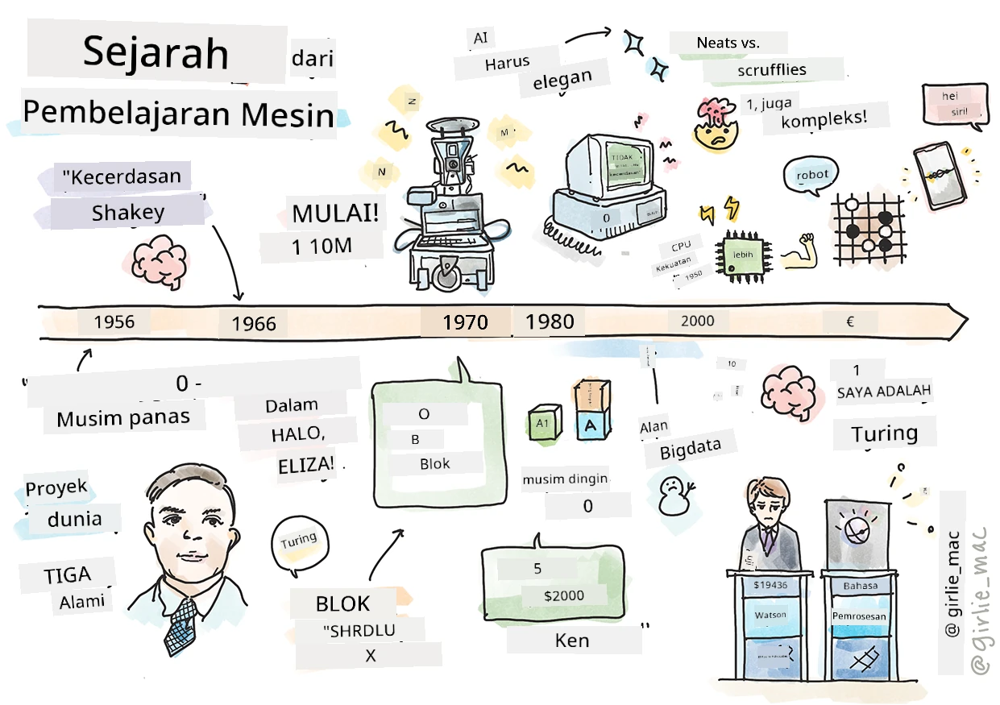
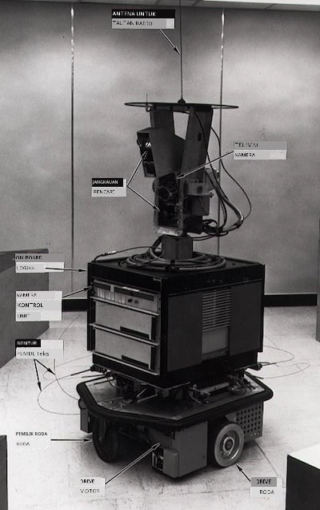
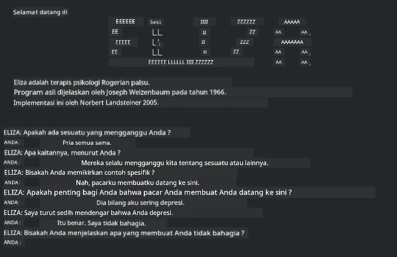

# Sejarah pembelajaran mesin

> Sketchnote oleh [Tomomi Imura](https://www.twitter.com/girlie_mac)

## [Kuis pra-ceramah](https://ff-quizzes.netlify.app/en/ml/)

---

> 🎥 Klik gambar di atas untuk video singkat yang membahas pelajaran ini.

Dalam pelajaran ini, kita akan menelusuri tonggak besar dalam sejarah pembelajaran mesin dan kecerdasan buatan.

Sejarah kecerdasan buatan (AI) sebagai bidang terkait erat dengan sejarah pembelajaran mesin, karena algoritma dan kemajuan komputasi yang mendasari ML turut memperkuat pengembangan AI. Penting diingat bahwa, meskipun bidang ini sebagai area penyelidikan yang berbeda mulai mengkristal pada tahun 1950-an, [penemuan algoritmik, statistik, matematika, komputasi, dan teknis](https://wikipedia.org/wiki/Timeline_of_machine_learning) penting sudah ada sebelum dan tumpang tindih dengan era ini. Bahkan, orang telah memikirkan pertanyaan ini selama [ratusan tahun](https://wikipedia.org/wiki/History_of_artificial_intelligence): artikel ini membahas dasar intelektual historis dari gagasan 'mesin yang bisa berpikir.'

---
## Penemuan penting

- 1763, 1812 [Teorema Bayes](https://wikipedia.org/wiki/Bayes%27_theorem) dan pendahulunya. Teorema ini dan aplikasinya mendasari inferensi, menggambarkan probabilitas suatu kejadian berdasarkan pengetahuan sebelumnya.
- 1805 [Teori Kuadrat Terkecil](https://wikipedia.org/wiki/Least_squares) oleh matematikawan Prancis Adrien-Marie Legendre. Teori ini, yang akan Anda pelajari di unit Regresi kami, membantu dalam pemodelan data.
- 1913 [Rantai Markov](https://wikipedia.org/wiki/Markov_chain), bernama dari matematikawan Rusia Andrey Markov, digunakan untuk menggambarkan rangkaian kemungkinan kejadian berdasarkan keadaan sebelumnya.
- 1957 [Perceptron](https://wikipedia.org/wiki/Perceptron) adalah jenis pengklasifikasi linier yang ditemukan oleh psikolog Amerika Frank Rosenblatt yang mendasari kemajuan dalam pembelajaran mendalam.

---

- 1967 [Tetangga Terdekat](https://wikipedia.org/wiki/Nearest_neighbor) adalah algoritma yang awalnya dirancang untuk memetakan rute. Dalam konteks ML digunakan untuk mendeteksi pola.
- 1970 [Backpropagation](https://wikipedia.org/wiki/Backpropagation) digunakan untuk melatih [jaringan saraf feedforward](https://wikipedia.org/wiki/Feedforward_neural_network).
- 1982 [Jaringan Saraf Rekurens](https://wikipedia.org/wiki/Recurrent_neural_network) adalah jaringan saraf buatan yang berasal dari jaringan saraf feedforward yang membangun grafik temporal.

✅ Lakukan sedikit riset. Tanggal lain mana yang menonjol sebagai titik penting dalam sejarah ML dan AI?

---
## 1950: Mesin yang bisa berpikir

Alan Turing, sosok yang luar biasa yang dipilih [oleh publik pada 2019](https://wikipedia.org/wiki/Icons:_The_Greatest_Person_of_the_20th_Century) sebagai ilmuwan terbesar abad ke-20, diakui telah membantu meletakkan dasar konsep 'mesin yang bisa berpikir.' Dia menghadapi skeptis dan kebutuhan akan bukti empiris konsep ini dengan menciptakan [Tes Turing](https://www.bbc.com/news/technology-18475646), yang akan Anda pelajari dalam pelajaran NLP kami.

---
## 1956: Proyek Penelitian Musim Panas Dartmouth

"Proyek Penelitian Musim Panas Dartmouth tentang kecerdasan buatan adalah peristiwa penting bagi kecerdasan buatan sebagai bidang," dan di sinilah istilah 'kecerdasan buatan' diciptakan ([sumber](https://250.dartmouth.edu/highlights/artificial-intelligence-ai-coined-dartmouth)).

> Setiap aspek pembelajaran atau fitur lain dari kecerdasan pada prinsipnya dapat dijelaskan dengan begitu tepat sehingga sebuah mesin dapat dibuat untuk menirunya.

---

Peneliti utama, profesor matematika John McCarthy, berharap "melanjutkan berdasarkan dugaan bahwa setiap aspek pembelajaran atau fitur lain dari kecerdasan pada prinsipnya dapat dijelaskan dengan begitu tepat sehingga sebuah mesin dapat dibuat untuk menirunya." Peserta termasuk tokoh penting lain di bidang ini, Marvin Minsky.

Lokakarya ini diakui telah memulai dan mendorong beberapa diskusi termasuk "bangkitnya metode simbolik, sistem yang berfokus pada domain terbatas (sistem pakar awal), dan sistem deduktif versus sistem induktif." ([sumber](https://wikipedia.org/wiki/Dartmouth_workshop)).

---
## 1956 - 1974: "Tahun-tahun emas"

Dari 1950-an hingga pertengahan '70-an, optimisme sangat tinggi dengan harapan AI bisa memecahkan banyak masalah. Pada 1967, Marvin Minsky dengan yakin menyatakan bahwa "Dalam satu generasi ... masalah menciptakan 'kecerdasan buatan' akan terpecahkan secara substansial." (Minsky, Marvin (1967), Computation: Finite and Infinite Machines, Englewood Cliffs, N.J.: Prentice-Hall)

Penelitian pemrosesan bahasa alami berkembang, pencarian disempurnakan dan dibuat lebih kuat, dan konsep 'mikro-dunia' dibuat, di mana tugas sederhana diselesaikan menggunakan instruksi bahasa biasa.

---

Penelitian didanai dengan baik oleh lembaga pemerintah, kemajuan dicapai dalam komputasi dan algoritma, dan prototipe mesin cerdas dibuat. Beberapa mesin tersebut termasuk:

* [Shakey the robot](https://wikipedia.org/wiki/Shakey_the_robot), yang bisa bergerak dan memutuskan bagaimana melakukan tugas secara 'cerdas'.

    
    > Shakey pada 1972

---

* Eliza, 'chatterbot' awal, bisa berbicara dengan orang dan berperan sebagai 'terapis' primitif. Anda akan mempelajari lebih banyak tentang Eliza di pelajaran NLP.

    
    > Sebuah versi Eliza, chatbot

---

* "Blocks world" adalah contoh mikro-dunia di mana blok bisa disusun dan diurutkan, serta eksperimen dalam mengajarkan mesin membuat keputusan diuji. Kemajuan yang dibangun dengan perpustakaan seperti [SHRDLU](https://wikipedia.org/wiki/SHRDLU) membantu mendorong pemrosesan bahasa.

    

    > 🎥 Klik gambar di atas untuk video: Blocks world dengan SHRDLU

---
## 1974 - 1980: "Musim dingin AI"

Pada pertengahan 1970-an, menjadi jelas bahwa kompleksitas membuat 'mesin cerdas' diremehkan dan janjinya, dengan kekuatan komputasi yang tersedia, telah dibesar-besarkan. Pendanaan mengering dan kepercayaan pada bidang tersebut menurun. Beberapa masalah yang mempengaruhi kepercayaan termasuk:
---
- **Keterbatasan**. Kekuatan komputasi terlalu terbatas.
- **Ledakan kombinatorial**. Jumlah parameter yang perlu dilatih tumbuh secara eksponensial saat komputer diminta melakukan lebih banyak, tanpa evolusi sejajar dari kekuatan dan kemampuan komputasi.
- **Kekurangan data**. Kekurangan data menghambat proses pengujian, pengembangan, dan penyempurnaan algoritma.
- **Apakah kami mengajukan pertanyaan yang tepat?**. Pertanyaan yang diajukan mulai dipertanyakan ulang. Peneliti mendapat kritik tentang pendekatan mereka:
  - Tes Turing dipertanyakan melalui, antara lain, 'teori kamar Cina' yang menyatakan bahwa, "memprogram komputer digital mungkin membuatnya tampak memahami bahasa tetapi tidak bisa menghasilkan pemahaman nyata." ([sumber](https://plato.stanford.edu/entries/chinese-room/))
  - Etika memperkenalkan kecerdasan buatan seperti "terapis" ELIZA ke masyarakat dipertanyakan.

---

Pada saat yang sama, berbagai aliran pemikiran AI mulai terbentuk. Dikotomi terbentuk antara praktik ["scruffy" vs. "neat AI"](https://wikipedia.org/wiki/Neats_and_scruffies). Laboratorium _scruffy_ mengutak-atik program selama berjam-jam sampai mendapat hasil yang diinginkan. Laboratorium _neat_ "berfokus pada logika dan pemecahan masalah formal". ELIZA dan SHRDLU adalah sistem _scruffy_ yang terkenal. Pada 1980-an, saat muncul tuntutan agar sistem ML bisa direproduksi, pendekatan _neat_ perlahan jadi utama karena hasilnya lebih mudah dijelaskan.

---
## Sistem pakar 1980-an

Seiring bidang ini berkembang, manfaatnya bagi bisnis menjadi lebih jelas, dan pada 1980-an juga berkembang proliferasi 'sistem pakar'. "Sistem pakar adalah salah satu bentuk perangkat lunak kecerdasan buatan (AI) yang pertama kali berhasil." ([sumber](https://wikipedia.org/wiki/Expert_system)).

Sistem ini sebenarnya _hibrid_, sebagian terdiri dari mesin aturan yang mendefinisikan kebutuhan bisnis, dan mesin inferensi yang menggunakan sistem aturan untuk menyimpulkan fakta baru.

Era ini juga meningkatkan perhatian pada jaringan saraf.

---
## 1987 - 1993: 'Hebatnya' AI

Perkembangan perangkat keras sistem pakar khusus ternyata terlalu spesialis. Kebangkitan komputer pribadi juga bersaing dengan sistem besar, khusus, dan terpusat ini. Demokratisasi komputasi dimulai, yang akhirnya membuka jalan bagi ledakan data besar modern.

---
## 1993 - 2011

Era ini melihat era baru bagi ML dan AI untuk dapat menyelesaikan beberapa masalah yang disebabkan sebelumnya oleh kurangnya data dan kekuatan komputasi. Jumlah data mulai meningkat pesat dan menjadi lebih luas tersedia, untuk baik dan buruk, terutama dengan hadirnya smartphone sekitar 2007. Kekuatan komputasi berkembang secara eksponensial, dan algoritma turut berkembang. Bidang ini mulai matang seiring hari-hari bebas yang lalu mengkristal menjadi disiplin yang sesungguhnya.

---
## Sekarang

Saat ini pembelajaran mesin dan AI menyentuh hampir setiap bagian kehidupan kita. Era ini menuntut pemahaman yang cermat tentang risiko dan potensi efek algoritma ini pada kehidupan manusia. Seperti yang dikatakan Brad Smith dari Microsoft, "Teknologi informasi menghadirkan isu yang menyentuh inti perlindungan hak asasi manusia fundamental seperti privasi dan kebebasan berekspresi. Isu-isu ini meningkatkan tanggung jawab perusahaan teknologi yang menciptakan produk ini. Dalam pandangan kami, ini juga menuntut regulasi pemerintah yang bijaksana dan pengembangan norma tentang penggunaan yang dapat diterima" ([sumber](https://www.technologyreview.com/2019/12/18/102365/the-future-of-ais-impact-on-society/)).

---

Masih harus dilihat apa yang akan terjadi di masa depan, tetapi penting untuk memahami sistem komputer ini dan perangkat lunak serta algoritma yang mereka jalankan. Kami berharap kurikulum ini membantu Anda memperoleh pemahaman yang lebih baik sehingga Anda dapat memutuskan sendiri.

> 🎥 Klik gambar di atas untuk video: Yann LeCun membahas sejarah pembelajaran mendalam dalam kuliah ini

---
## 🚀Tantangan

Dalami salah satu momen bersejarah ini dan pelajari lebih lanjut tentang orang-orang di baliknya. Ada karakter menarik, dan tidak ada penemuan ilmiah yang pernah dibuat dalam kekosongan budaya. Apa yang Anda temukan?

## [Kuis pasca-ceramah](https://ff-quizzes.netlify.app/en/ml/)

---
## Ulasan & Studi Mandiri

Berikut ialah item yang dapat ditonton dan didengarkan:

[Podcast ini di mana Amy Boyd membahas evolusi AI](http://runasradio.com/Shows/Show/739)

---

## Tugas

[Buat sebuah garis waktu](assignment.md)

---

<!-- CO-OP TRANSLATOR DISCLAIMER START -->
**Penafian**:
Dokumen ini telah diterjemahkan menggunakan layanan terjemahan AI [Co-op Translator](https://github.com/Azure/co-op-translator). Meskipun kami berupaya untuk mencapai akurasi, harap diketahui bahwa terjemahan otomatis mungkin mengandung kesalahan atau ketidakakuratan. Dokumen asli dalam bahasa aslinya harus dianggap sebagai sumber yang sah. Untuk informasi penting, disarankan menggunakan terjemahan profesional oleh manusia. Kami tidak bertanggung jawab atas kesalahpahaman atau penafsiran yang keliru yang timbul dari penggunaan terjemahan ini.
<!-- CO-OP TRANSLATOR DISCLAIMER END -->