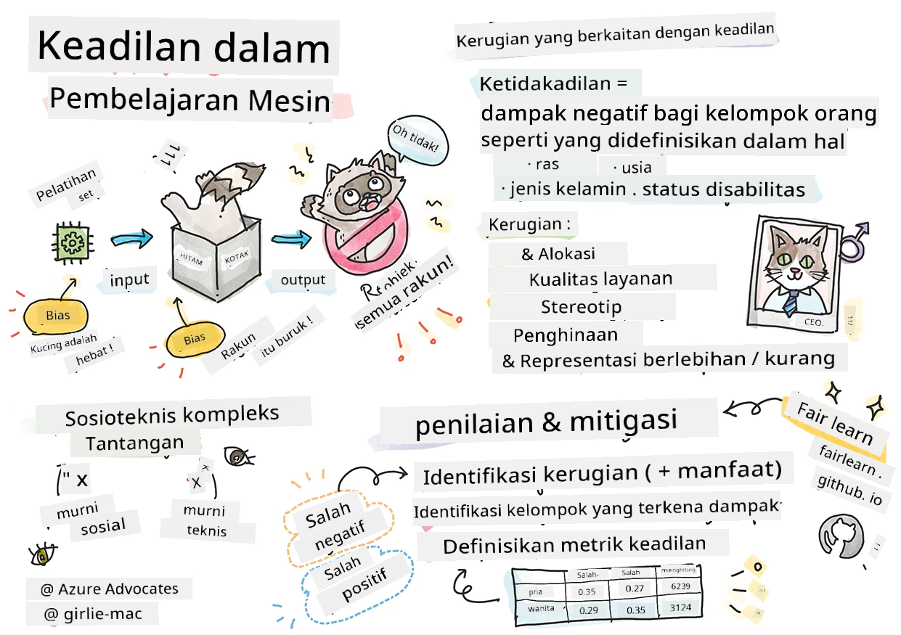

# Membangun solusi Machine Learning dengan AI yang bertanggung jawab
 

> Sketchnote oleh [Tomomi Imura](https://www.twitter.com/girlie_mac)

## [Kuis sebelum kuliah](https://ff-quizzes.netlify.app/en/ml/)
 
## Pendahuluan

Dalam kurikulum ini, Anda akan mulai menemukan bagaimana machine learning dapat dan sedang memengaruhi kehidupan sehari-hari kita. Bahkan sekarang, sistem dan model terlibat dalam tugas pengambilan keputusan harian, seperti diagnosis perawatan kesehatan, persetujuan pinjaman, atau mendeteksi penipuan. Jadi, penting bahwa model-model ini bekerja dengan baik untuk memberikan hasil yang dapat dipercaya. Sama seperti aplikasi perangkat lunak lainnya, sistem AI kadang akan tidak memenuhi ekspektasi atau menghasilkan hasil yang tidak diinginkan. Itulah mengapa sangat penting untuk dapat memahami dan menjelaskan perilaku model AI.

Bayangkan apa yang bisa terjadi ketika data yang Anda gunakan untuk membangun model ini kurang mencakup demografi tertentu, seperti ras, jenis kelamin, pandangan politik, agama, atau secara tidak proporsional mewakili demografi tersebut. Bagaimana jika output model diinterpretasikan untuk memihak demografi tertentu? Apa konsekuensinya bagi aplikasi tersebut? Selain itu, apa yang terjadi jika model menghasilkan hasil yang merugikan dan berbahaya bagi orang-orang? Siapa yang bertanggung jawab atas perilaku sistem AI? Ini adalah beberapa pertanyaan yang akan kita jelajahi dalam kurikulum ini.

Dalam pelajaran ini, Anda akan:

- Meningkatkan kesadaran Anda tentang pentingnya keadilan dalam machine learning dan bahaya terkait ketidakadilan.
- Mengenal praktik mengeksplorasi nilai ekstrim dan skenario tidak biasa untuk memastikan keandalan dan keselamatan.
- Memperoleh pemahaman akan kebutuhan memberdayakan semua orang dengan merancang sistem yang inklusif.
- Menyelami pentingnya melindungi privasi dan keamanan data serta orang.
- Melihat pentingnya pendekatan kotak kaca untuk menjelaskan perilaku model AI.
- Menjadi sadar akan bagaimana akuntabilitas penting untuk membangun kepercayaan dalam sistem AI.

## Prasyarat

Sebagai prasyarat, silakan ikuti "Prinsip AI yang Bertanggung Jawab" dalam Jalur Pembelajaran dan tonton video di bawah ini tentang topik tersebut:

Pelajari lebih lanjut tentang AI yang Bertanggung Jawab dengan mengikuti [Jalur Pembelajaran ini](https://docs.microsoft.com/learn/modules/responsible-ai-principles/?WT.mc_id=academic-77952-leestott)

> 🎥 Klik gambar di atas untuk video: Pendekatan Microsoft terhadap AI yang Bertanggung Jawab

## Keadilan

Sistem AI harus memperlakukan semua orang secara adil dan menghindari memberikan pengaruh berbeda pada kelompok orang yang serupa. Sebagai contoh, saat sistem AI memberikan panduan dalam perawatan medis, aplikasi pinjaman, atau pekerjaan, mereka harus memberikan rekomendasi yang sama kepada semua orang dengan gejala, kondisi keuangan, atau kualifikasi profesional yang serupa. Setiap dari kita sebagai manusia membawa bias yang diwariskan yang memengaruhi keputusan dan tindakan kita. Bias-bias ini bisa jelas dalam data yang kita gunakan untuk melatih sistem AI. Manipulasi semacam ini kadang terjadi tanpa disengaja. Seringkali sulit untuk sadar ketika Anda memperkenalkan bias dalam data.

**"Ketidakadilan"** mencakup dampak negatif, atau "kerugian", bagi kelompok orang tertentu, seperti yang didefinisikan berdasarkan ras, jenis kelamin, usia, atau status disabilitas. Bahaya utama terkait keadilan dapat diklasifikasikan sebagai:

- **Alokasi**, jika misalnya sebuah gender atau etnis lebih diutamakan dibanding yang lain.
- **Kualitas layanan**. Jika Anda melatih data untuk satu skenario spesifik tapi kenyataannya jauh lebih kompleks, hal itu menghasilkan layanan dengan kinerja buruk. Misalnya, dispenser sabun tangan yang tampaknya tidak dapat mendeteksi orang dengan kulit gelap. [Referensi](https://gizmodo.com/why-cant-this-soap-dispenser-identify-dark-skin-1797931773)
- **Penghinaan**. Mengkritik dan memberi label sesuatu atau seseorang secara tidak adil. Contohnya, teknologi pelabelan gambar yang secara terkenal salah memberi label gambar orang dengan kulit gelap sebagai gorila.
- **Keterwakilan berlebihan atau kekurangan**. Gagasan bahwa kelompok tertentu tidak terlihat di profesi tertentu, dan layanan atau fungsi yang terus mempromosikannya berkontribusi pada kerugian.
- **Stereotip**. Mengasosiasikan kelompok tertentu dengan atribut yang telah ditetapkan sebelumnya. Misalnya, sebuah sistem terjemahan bahasa antara Inggris dan Turki mungkin memiliki ketidakakuratan karena kata-kata yang terkait secara stereotip dengan gender.

> terjemahan ke bahasa Turki

> terjemahan kembali ke bahasa Inggris

Saat merancang dan menguji sistem AI, kita harus memastikan bahwa AI adil dan tidak diprogram untuk membuat keputusan yang bias atau diskriminatif, yang juga dilarang bagi manusia. Menjamin keadilan dalam AI dan machine learning tetap menjadi tantangan sosioteknis yang kompleks.

### Keandalan dan keselamatan

Untuk membangun kepercayaan, sistem AI harus andal, aman, dan konsisten dalam kondisi normal maupun tak terduga. Penting untuk mengetahui bagaimana sistem AI berperilaku dalam berbagai situasi, terutama saat terjadi nilai ekstrim. Saat membangun solusi AI, perlu adanya fokus besar pada cara menangani berbagai keadaan yang mungkin dihadapi solusi AI tersebut. Misalnya, mobil swakemudi harus mengutamakan keselamatan manusia. Oleh karena itu, AI yang menggerakkan mobil harus mempertimbangkan semua skenario yang mungkin dihadapi seperti malam hari, badai petir atau badai salju, anak-anak yang berlari menyeberang jalan, binatang peliharaan, konstruksi jalan, dan sebagainya. Seberapa baik sistem AI dapat menangani berbagai kondisi ekstrem dengan andal dan aman mencerminkan tingkat antisipasi yang dipertimbangkan oleh ilmuwan data atau pengembang AI selama perancangan atau pengujian sistem.

> [🎥 Klik di sini untuk video: ](https://www.microsoft.com/videoplayer/embed/RE4vvIl)

### Inklusivitas

Sistem AI harus dirancang untuk melibatkan dan memberdayakan semua orang. Saat merancang dan menerapkan sistem AI, ilmuwan data dan pengembang AI mengidentifikasi dan mengatasi potensi penghalang dalam sistem yang mungkin tanpa sengaja mengecualikan orang. Misalnya, ada 1 miliar orang dengan disabilitas di seluruh dunia. Dengan kemajuan AI, mereka dapat mengakses berbagai informasi dan peluang dengan lebih mudah dalam kehidupan sehari-hari mereka. Dengan mengatasi penghalang tersebut, tercipta peluang untuk berinovasi dan mengembangkan produk AI dengan pengalaman yang lebih baik yang menguntungkan semua orang.

> [🎥 Klik di sini untuk video: inklusivitas dalam AI](https://www.microsoft.com/videoplayer/embed/RE4vl9v)

### Keamanan dan privasi

Sistem AI harus aman dan menghormati privasi orang. Orang kurang percaya pada sistem yang membahayakan privasi, informasi, atau kehidupan mereka. Saat melatih model machine learning, kita mengandalkan data untuk menghasilkan hasil terbaik. Dalam melakukannya, asal dan integritas data harus dipertimbangkan. Misalnya, apakah data dikirimkan oleh pengguna atau tersedia secara publik? Selanjutnya, saat bekerja dengan data, sangat penting untuk mengembangkan sistem AI yang dapat melindungi informasi rahasia dan tahan terhadap serangan. Seiring AI semakin meluas, melindungi privasi dan mengamankan informasi pribadi serta bisnis menjadi semakin penting dan kompleks. Masalah privasi dan keamanan data memerlukan perhatian khusus untuk AI karena akses ke data sangat penting bagi sistem AI untuk membuat prediksi dan keputusan yang akurat dan tepat terkait orang.

> [🎥 Klik di sini untuk video: keamanan dalam AI](https://www.microsoft.com/videoplayer/embed/RE4voJF)

- Sebagai industri, kami telah membuat kemajuan signifikan dalam Privasi & keamanan, yang didorong secara signifikan oleh regulasi seperti GDPR (General Data Protection Regulation).
- Namun dengan sistem AI kita harus mengakui adanya ketegangan antara kebutuhan akan lebih banyak data pribadi agar sistem lebih personal dan efektif – dengan privasi.
- Sama seperti dengan lahirnya komputer yang terhubung dengan internet, kita juga melihat peningkatan besar dalam jumlah masalah keamanan terkait AI.
- Pada saat yang sama, kita telah melihat AI digunakan untuk meningkatkan keamanan. Sebagai contoh, sebagian besar pemindai anti-virus modern saat ini didorong oleh heuristik AI.
- Kita perlu memastikan bahwa proses Data Science kita selaras harmonis dengan praktik privasi dan keamanan terbaru.

### Transparansi
Sistem AI harus dapat dipahami. Bagian penting dari transparansi adalah menjelaskan perilaku sistem AI dan komponennya. Meningkatkan pemahaman tentang sistem AI mengharuskan para pemangku kepentingan memahami bagaimana dan mengapa sistem berfungsi sehingga mereka dapat mengidentifikasi potensi masalah kinerja, kekhawatiran keselamatan dan privasi, bias, praktik pengecualian, atau hasil yang tidak diinginkan. Kami juga percaya bahwa mereka yang menggunakan sistem AI harus jujur dan terbuka tentang kapan, mengapa, dan bagaimana mereka memilih untuk menggunakannya. Serta keterbatasan sistem yang mereka gunakan. Misalnya, jika bank menggunakan sistem AI untuk mendukung keputusan pinjaman konsumen, penting untuk memeriksa hasil dan memahami data apa yang memengaruhi rekomendasi sistem. Pemerintah mulai mengatur AI di berbagai industri, sehingga ilmuwan data dan organisasi harus menjelaskan jika sistem AI memenuhi persyaratan regulasi, terutama saat terjadi hasil yang tidak diinginkan.

> [🎥 Klik di sini untuk video: transparansi dalam AI](https://www.microsoft.com/videoplayer/embed/RE4voJF)

- Karena sistem AI sangat kompleks, sulit untuk memahami cara kerja dan menginterpretasikan hasilnya.
- Kurangnya pemahaman ini memengaruhi cara sistem ini dikelola, dioperasikan, dan didokumentasikan.
- Kurangnya pemahaman ini terutama memengaruhi keputusan yang dibuat menggunakan hasil yang dihasilkan sistem ini.

### Akuntabilitas
 
Orang yang merancang dan meluncurkan sistem AI harus bertanggung jawab atas cara sistem mereka beroperasi. Kebutuhan akan akuntabilitas sangat krusial untuk teknologi penggunaan sensitif seperti pengenalan wajah. Baru-baru ini, permintaan terhadap teknologi pengenalan wajah semakin meningkat, terutama dari organisasi penegak hukum yang melihat potensi teknologi ini untuk menemukan anak hilang. Namun, teknologi ini bisa digunakan oleh pemerintah untuk mempertaruhkan kebebasan mendasar warganya dengan, misalnya, memungkinkan pengawasan terus-menerus terhadap individu tertentu. Oleh karena itu, ilmuwan data dan organisasi harus bertanggung jawab atas dampak sistem AI mereka terhadap individu atau masyarakat.

> 🎥 Klik gambar di atas untuk video: Peringatan tentang Pengawasan Massal melalui Pengenalan Wajah

Pada akhirnya salah satu pertanyaan terbesar bagi generasi kita, sebagai generasi pertama yang membawa AI ke masyarakat, adalah bagaimana memastikan komputer tetap bertanggung jawab kepada manusia dan bagaimana memastikan orang yang merancang komputer tetap bertanggung jawab kepada semua orang.

## Penilaian Dampak

Sebelum melatih model machine learning, penting untuk melakukan penilaian dampak untuk memahami tujuan sistem AI; apa penggunaan yang dimaksudkan; di mana sistem akan disebarkan; dan siapa yang akan berinteraksi dengan sistem. Ini berguna bagi peninjau atau penguji yang mengevaluasi sistem agar tahu faktor apa yang harus dipertimbangkan ketika mengidentifikasi potensi risiko dan konsekuensi yang diharapkan.

Berikut adalah area fokus saat melakukan penilaian dampak:

* **Dampak merugikan pada individu**. Menyadari adanya pembatasan atau persyaratan, penggunaan yang tidak didukung atau keterbatasan yang diketahui yang menghambat kinerja sistem sangat penting untuk memastikan sistem tidak digunakan dengan cara yang dapat membahayakan individu.
* **Persyaratan data**. Memahami bagaimana dan di mana sistem akan menggunakan data memungkinkan peninjau mengeksplorasi persyaratan data yang harus diperhatikan (misal, regulasi data GDPR atau HIPAA). Selain itu, periksa apakah sumber atau jumlah data cukup untuk pelatihan.
* **Ringkasan dampak**. Kumpulkan daftar potensi bahaya yang bisa muncul dari penggunaan sistem. Sepanjang siklus hidup ML, tinjau apakah masalah yang diidentifikasi telah dikurangi atau ditangani.
* **Tujuan yang berlaku** untuk setiap dari enam prinsip inti. Nilai apakah tujuan dari masing-masing prinsip terpenuhi dan apakah ada celah.

## Debugging dengan AI yang bertanggung jawab

Mirip dengan debugging aplikasi perangkat lunak, debugging sistem AI adalah proses yang diperlukan untuk mengidentifikasi dan menyelesaikan masalah dalam sistem. Ada banyak faktor yang dapat memengaruhi model tidak berperforma sesuai harapan atau dengan cara yang bertanggung jawab. Sebagian besar metrik kinerja model tradisional adalah agregat kuantitatif dari kinerja model, yang tidak cukup untuk menganalisa bagaimana model melanggar prinsip AI yang bertanggung jawab. Selain itu, model machine learning adalah kotak hitam yang menyulitkan untuk memahami apa yang menggerakkan hasilnya atau memberikan penjelasan saat membuat kesalahan. Nanti dalam kursus ini, kita akan belajar cara menggunakan dashboard Responsible AI untuk membantu debugging sistem AI. Dashboard ini menyediakan alat holistik bagi ilmuwan data dan pengembang AI untuk melakukan:

* **Analisis kesalahan**. Untuk mengidentifikasi distribusi kesalahan model yang dapat memengaruhi keadilan atau keandalannya.
* **Ikhtisar model**. Untuk menemukan di mana ada kesenjangan dalam kinerja model di berbagai kohort data.
* **Analisis data**. Untuk memahami distribusi data dan mengidentifikasi bias potensial dalam data yang dapat menyebabkan masalah keadilan, inklusivitas, dan keandalan.
* **Interpretabilitas model**. Untuk memahami apa yang memengaruhi atau mempengaruhi prediksi model. Ini membantu menjelaskan perilaku model, yang penting untuk transparansi dan akuntabilitas.

## 🚀 Tantangan
 
Untuk mencegah bahaya diperkenalkan sejak awal, kita harus:

- memiliki keragaman latar belakang dan perspektif di antara orang-orang yang bekerja pada sistem
- berinvestasi dalam dataset yang mencerminkan keragaman masyarakat kita
- mengembangkan metode yang lebih baik sepanjang siklus hidup machine learning untuk mendeteksi dan mengoreksi AI yang bertanggung jawab saat itu terjadi

Pikirkan tentang skenario kehidupan nyata di mana ketidakpercayaan model tampak jelas dalam pembangunan dan penggunaan model. Apa lagi yang harus kita pertimbangkan?

## [Kuis setelah kuliah](https://ff-quizzes.netlify.app/en/ml/)

## Ulasan & Studi Mandiri
 

Dalam pelajaran ini, Anda telah mempelajari beberapa dasar konsep keadilan dan ketidakadilan dalam pembelajaran mesin.  
 
Tonton lokakarya ini untuk menyelami lebih dalam topik-topik tersebut: 

- Dalam upaya AI yang bertanggung jawab: Menerapkan prinsip ke praktik oleh Besmira Nushi, Mehrnoosh Sameki dan Amit Sharma

> 🎥 Klik gambar di atas untuk video: RAI Toolbox: Kerangka kerja sumber terbuka untuk membangun AI yang bertanggung jawab oleh Besmira Nushi, Mehrnoosh Sameki, dan Amit Sharma

Juga, baca: 

- Pusat sumber daya RAI Microsoft: [Responsible AI Resources – Microsoft AI](https://www.microsoft.com/ai/responsible-ai-resources?activetab=pivot1%3aprimaryr4) 

- Kelompok riset FATE Microsoft: [FATE: Fairness, Accountability, Transparency, and Ethics in AI - Microsoft Research](https://www.microsoft.com/research/theme/fate/) 

RAI Toolbox: 

- [Repositori GitHub Responsible AI Toolbox](https://github.com/microsoft/responsible-ai-toolbox)

Baca tentang alat Azure Machine Learning untuk memastikan keadilan:

- [Azure Machine Learning](https://docs.microsoft.com/azure/machine-learning/concept-fairness-ml?WT.mc_id=academic-77952-leestott) 

## Tugas

[Jelajahi RAI Toolbox](assignment.md)

---

<!-- CO-OP TRANSLATOR DISCLAIMER START -->
**Penafian**:
Dokumen ini telah diterjemahkan menggunakan layanan terjemahan AI [Co-op Translator](https://github.com/Azure/co-op-translator). Meskipun kami berupaya untuk mencapai akurasi, harap diketahui bahwa terjemahan otomatis mungkin mengandung kesalahan atau ketidakakuratan. Dokumen asli dalam bahasa aslinya harus dianggap sebagai sumber yang sah. Untuk informasi penting, disarankan menggunakan terjemahan profesional oleh manusia. Kami tidak bertanggung jawab atas kesalahpahaman atau penafsiran yang keliru yang timbul dari penggunaan terjemahan ini.
<!-- CO-OP TRANSLATOR DISCLAIMER END -->