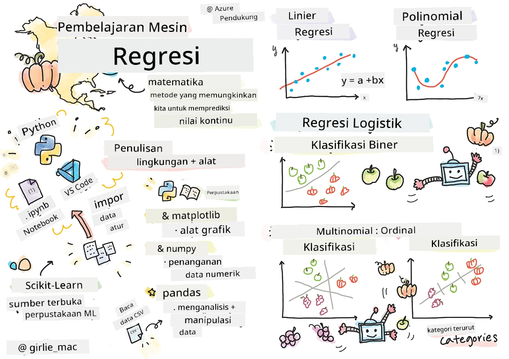
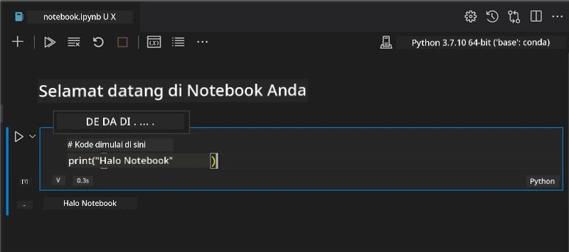
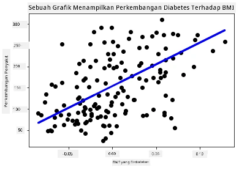

# Memulai dengan Python dan Scikit-learn untuk model regresi



> Sketchnote oleh [Tomomi Imura](https://www.twitter.com/girlie_mac)

## [Kuis sebelum kuliah](https://ff-quizzes.netlify.app/en/ml/)

> ### [Pelajaran ini tersedia dalam R!](../../../../2-Regression/1-Tools/solution/R/lesson_1.html)

## Pendahuluan

Dalam empat pelajaran ini, Anda akan menemukan cara membangun model regresi. Kita akan membahas kegunaannya sebentar lagi. Tetapi sebelum Anda melakukan apa pun, pastikan Anda memiliki alat yang tepat untuk memulai prosesnya!

Dalam pelajaran ini, Anda akan belajar bagaimana:

- Mengonfigurasi komputer Anda untuk tugas pembelajaran mesin lokal.
- Bekerja dengan Jupyter Notebooks.
- Menggunakan Scikit-learn, termasuk instalasi.
- Mengeksplorasi regresi linier dengan latihan langsung.

## Instalasi dan konfigurasi

[](https://youtu.be/-DfeD2k2Kj0 "ML untuk pemula -Persiapkan alat Anda untuk membangun model Pembelajaran Mesin")

> 🎥 Klik gambar di atas untuk video singkat yang menjelaskan cara mengonfigurasi komputer Anda untuk ML.

1. **Install Python**. Pastikan [Python](https://www.python.org/downloads/) terpasang di komputer Anda. Anda akan menggunakan Python untuk banyak tugas data science dan machine learning. Kebanyakan sistem komputer sudah menyertakan instalasi Python. Ada juga [Python Coding Packs](https://code.visualstudio.com/learn/educators/installers?WT.mc_id=academic-77952-leestott) yang berguna, untuk memudahkan pengaturan bagi beberapa pengguna.

   Namun, beberapa penggunaan Python memerlukan satu versi perangkat lunak, sedangkan lainnya membutuhkan versi berbeda. Karena itu, berguna untuk bekerja dalam [virtual environment](https://docs.python.org/3/library/venv.html).

2. **Install Visual Studio Code**. Pastikan Anda memiliki Visual Studio Code di komputer Anda. Ikuti petunjuk ini untuk [menginstal Visual Studio Code](https://code.visualstudio.com/) untuk instalasi dasar. Anda akan menggunakan Python di Visual Studio Code dalam kursus ini, jadi Anda mungkin ingin belajar cara [mengonfigurasi Visual Studio Code](https://docs.microsoft.com/learn/modules/python-install-vscode?WT.mc_id=academic-77952-leestott) untuk pengembangan Python.

   > Kenali Python dengan bekerja melalui kumpulan [modul Learn](https://docs.microsoft.com/users/jenlooper-2911/collections/mp1pagggd5qrq7?WT.mc_id=academic-77952-leestott)
   >
   > [](https://youtu.be/yyQM70vi7V8 "Setup Python dengan Visual Studio Code")
   >
   > 🎥 Klik gambar di atas untuk video: menggunakan Python dalam VS Code.

3. **Install Scikit-learn**, dengan mengikuti [petunjuk ini](https://scikit-learn.org/stable/install.html). Karena Anda perlu memastikan menggunakan Python 3, disarankan menggunakan virtual environment. Catatan, jika Anda menginstal perpustakaan ini di Mac M1, ada petunjuk khusus di halaman yang ditautkan di atas.

1. **Install Jupyter Notebook**. Anda perlu [menginstal paket Jupyter](https://pypi.org/project/jupyter/).

## Lingkungan penyusunan ML Anda

Anda akan menggunakan **notebook** untuk mengembangkan kode Python dan membuat model pembelajaran mesin. Jenis file ini adalah alat umum untuk ilmuwan data, dan dapat dikenali dari akhiran atau ekstensi `.ipynb`.

Notebook adalah lingkungan interaktif yang memungkinkan pengembang untuk menulis kode sekaligus menambahkan catatan dan dokumentasi di sekitar kode yang sangat membantu untuk proyek eksperimental atau riset.

[](https://youtu.be/7E-jC8FLA2E "ML untuk pemula - Siapkan Jupyter Notebooks untuk mulai membangun model regresi")

> 🎥 Klik gambar di atas untuk video singkat yang menjelaskan latihan ini.

### Latihan - bekerja dengan notebook

Dalam folder ini, Anda akan menemukan file _notebook.ipynb_.

1. Buka _notebook.ipynb_ di Visual Studio Code.

   Server Jupyter akan mulai dengan Python 3+ aktif. Anda akan menemukan area di notebook yang dapat `run`, potongan kode. Anda dapat menjalankan blok kode dengan memilih ikon yang mirip tombol play.

1. Pilih ikon `md` dan tambahkan sedikit markdown, serta teks berikut **# Selamat datang di notebook Anda**.

   Selanjutnya, tambahkan beberapa kode Python.

1. Ketik **print('hello notebook')** dalam blok kode.
1. Pilih panah untuk menjalankan kodenya.

   Anda akan melihat pernyataan tercetak:

    ```output
    hello notebook
    ```



Anda dapat menyisipkan kode Anda dengan komentar untuk mendokumentasikan notebook sendiri.

✅ Pikirkan sejenak bagaimana berbeda lingkungan kerja pengembang web dengan ilmuwan data.

## Jalankan Scikit-learn

Sekarang Python sudah disiapkan di lingkungan lokal Anda, dan Anda sudah nyaman dengan Jupyter Notebooks, mari kita juga nyaman menggunakan Scikit-learn (baca `sci` seperti `science`). Scikit-learn menyediakan [API ekstensif](https://scikit-learn.org/stable/modules/classes.html#api-ref) untuk membantu Anda melakukan tugas ML.

Menurut [situs web mereka](https://scikit-learn.org/stable/getting_started.html), "Scikit-learn adalah perpustakaan pembelajaran mesin sumber terbuka yang mendukung pembelajaran terawasi dan tak terawasi. Ia juga menyediakan berbagai alat untuk pemasangan model, prapengolahan data, pemilihan dan evaluasi model, dan banyak utilitas lainnya."

Dalam kursus ini, Anda akan menggunakan Scikit-learn dan alat lain untuk membangun model pembelajaran mesin untuk melakukan apa yang kami sebut tugas 'pembelajaran mesin tradisional'. Kami sengaja menghindari neural network dan deep learning, karena itu dibahas lebih baik di kurikulum 'AI untuk Pemula' yang akan datang.

Scikit-learn memudahkan membangun model dan mengevaluasinya untuk digunakan. Fokus utamanya menggunakan data numerik dan menyediakan beberapa dataset siap pakai sebagai alat pembelajaran. Ia juga termasuk model bawaan untuk dicoba oleh siswa. Mari jelajahi proses memuat data paket dan menggunakan estimator bawaan untuk model ML pertama dengan Scikit-learn menggunakan data dasar.

## Latihan - notebook Scikit-learn pertama Anda

> Tutorial ini terinspirasi oleh [contoh regresi linier](https://scikit-learn.org/stable/auto_examples/linear_model/plot_ols.html#sphx-glr-auto-examples-linear-model-plot-ols-py) di situs Scikit-learn.


[](https://youtu.be/2xkXL5EUpS0 "ML untuk pemula - Proyek Regresi Linier Pertama Anda di Python")

> 🎥 Klik gambar di atas untuk video singkat yang menjelaskan latihan ini.

Dalam file _notebook.ipynb_ yang terkait dengan pelajaran ini, kosongkan semua sel dengan menekan ikon 'tempat sampah'.

Dalam bagian ini, Anda akan bekerja dengan dataset kecil tentang diabetes yang sudah terintegrasi dalam Scikit-learn untuk tujuan pembelajaran. Bayangkan Anda ingin menguji pengobatan untuk pasien diabetes. Model Pembelajaran Mesin dapat membantu menentukan pasien mana yang akan merespon lebih baik berdasarkan kombinasi variabel. Bahkan model regresi dasar, jika divisualisasikan, dapat menunjukkan informasi variabel yang membantu mengatur uji klinis teoretis Anda.

✅ Ada banyak jenis metode regresi, dan yang Anda pilih tergantung pada jawaban yang Anda cari. Jika ingin memprediksi tinggi badan yang mungkin untuk seseorang pada usia tertentu, gunakan regresi linier, karena Anda mencari **nilai numerik**. Jika ingin mengetahui apakah jenis masakan harus diklasifikasikan sebagai vegan atau tidak, Anda mencari **penugasan kategori**, sehingga Anda menggunakan regresi logistik. Anda akan belajar lebih tentang regresi logistik nanti. Pikirkan beberapa pertanyaan yang dapat diajukan pada data, dan metode mana yang lebih tepat digunakan.

Mari kita mulai tugas ini.

### Impor pustaka

Untuk tugas ini kita akan mengimpor beberapa pustaka:

- **matplotlib**. Ini alat [grafik](https://matplotlib.org/) yang berguna dan akan kita gunakan untuk membuat plot garis.
- **numpy**. [numpy](https://numpy.org/doc/stable/user/whatisnumpy.html) adalah pustaka berguna untuk menangani data numerik di Python.
- **sklearn**. Ini adalah pustaka [Scikit-learn](https://scikit-learn.org/stable/user_guide.html).

Impor beberapa pustaka untuk membantu tugas Anda.

1. Tambahkan import dengan mengetik kode berikut:

   ```python
   import matplotlib.pyplot as plt
   import numpy as np
   from sklearn import datasets, linear_model, model_selection
   ```

   Di atas Anda mengimpor `matplotlib`, `numpy` dan mengimpor `datasets`, `linear_model` dan `model_selection` dari `sklearn`. `model_selection` digunakan untuk membagi data menjadi set pelatihan dan pengujian.

### Dataset diabetes

Dataset bawaan [diabetes](https://scikit-learn.org/stable/datasets/toy_dataset.html#diabetes-dataset) berisi 442 sampel data diabetes, dengan 10 variabel fitur, beberapa di antaranya:

- age: usia dalam tahun
- bmi: indeks massa tubuh
- bp: tekanan darah rata-rata
- s1 tc: Sel-T (jenis sel darah putih)

✅ Dataset ini menyertakan konsep 'jenis kelamin' sebagai variabel fitur penting untuk penelitian diabetes. Banyak dataset medis menyertakan klasifikasi biner seperti ini. Pikirkan bagaimana kategorisasi seperti ini dapat mengecualikan bagian populasi tertentu dari pengobatan.

Sekarang, muat data X dan y.

> 🎓 Ingat, ini pembelajaran terawasi, dan kita membutuhkan target bernama 'y'.

Di sel kode baru, muat dataset diabetes dengan memanggil `load_diabetes()`. Input `return_X_y=True` menandakan bahwa `X` akan menjadi matriks data, dan `y` target regresi.

1. Tambahkan beberapa perintah print untuk menunjukkan bentuk matriks data dan elemen pertamanya:

    ```python
    X, y = datasets.load_diabetes(return_X_y=True)
    print(X.shape)
    print(X[0])
    ```

    Apa yang Anda dapatkan sebagai respons adalah tuple. Anda menetapkan dua nilai pertama tuple ke `X` dan `y` masing-masing. Pelajari lebih lanjut [tentang tuple](https://wikipedia.org/wiki/Tuple).

    Anda dapat melihat data ini memiliki 442 item yang berbentuk array dengan 10 elemen:

    ```text
    (442, 10)
    [ 0.03807591  0.05068012  0.06169621  0.02187235 -0.0442235  -0.03482076
    -0.04340085 -0.00259226  0.01990842 -0.01764613]
    ```

    ✅ Pikirkan hubungan antara data dan target regresi. Regresi linier memprediksi hubungan antara fitur X dan variabel target y. Bisakah Anda menemukan [target](https://scikit-learn.org/stable/datasets/toy_dataset.html#diabetes-dataset) untuk dataset diabetes dalam dokumentasi? Apa yang ditunjukkan dataset ini, berdasarkan target tersebut?

2. Selanjutnya, pilih sebagian dari dataset ini untuk dibuatkan plot dengan memilih kolom ke-3 dataset. Anda dapat melakukan ini dengan menggunakan operator `:` untuk memilih semua baris, lalu memilih kolom ke-3 dengan indeks (2). Anda juga dapat mengubah bentuk data menjadi array 2D - sesuai kebutuhan plotting - dengan menggunakan `reshape(n_rows, n_columns)`. Jika salah satu parameternya -1, dimensi yang sesuai dihitung secara otomatis.

   ```python
   X = X[:, 2]
   X = X.reshape((-1,1))
   ```

   ✅ Kapan saja, cetak data untuk memeriksa bentuknya.

3. Sekarang data sudah siap untuk diplot, lihat apakah mesin dapat membantu menentukan pemisahan logis antara angka dalam dataset ini. Untuk melakukan ini, Anda perlu membagi data (X) dan target (y) ke dalam set pengujian dan pelatihan. Scikit-learn menyediakan cara mudah untuk melakukan ini; Anda dapat membagi data pengujian pada titik tertentu.

   ```python
   X_train, X_test, y_train, y_test = model_selection.train_test_split(X, y, test_size=0.33)
   ```

4. Sekarang Anda siap melatih model! Muat model regresi linier dan latih dengan set pelatihan X dan y menggunakan `model.fit()`:

    ```python
    model = linear_model.LinearRegression()
    model.fit(X_train, y_train)
    ```

    ✅ `model.fit()` adalah fungsi yang akan Anda temui di banyak perpustakaan ML seperti TensorFlow

5. Kemudian, buat prediksi menggunakan data uji, dengan fungsi `predict()`. Ini akan digunakan untuk menggambar garis di antara kelompok data

    ```python
    y_pred = model.predict(X_test)
    ```

6. Sekarang saatnya menampilkan data dalam plot. Matplotlib adalah alat yang sangat berguna untuk tugas ini. Buat scatterplot dari semua data uji X dan y, dan gunakan prediksi untuk menggambar garis di tempat paling tepat, di antara pengelompokan data model.

    ```python
    plt.scatter(X_test, y_test,  color='black')
    plt.plot(X_test, y_pred, color='blue', linewidth=3)
    plt.xlabel('Scaled BMIs')
    plt.ylabel('Disease Progression')
    plt.title('A Graph Plot Showing Diabetes Progression Against BMI')
    plt.show()
    ```

   


   ✅ Pikirkan sejenak tentang apa yang sedang terjadi di sini. Sebuah garis lurus berjalan melalui banyak titik data kecil, tapi sebenarnya apa yang dilakukannya? Bisakah Anda melihat bagaimana seharusnya Anda bisa menggunakan garis ini untuk memprediksi di mana titik data baru yang belum terlihat harus ditempatkan relatif terhadap sumbu y pada plot? Cobalah untuk mengungkapkan dalam kata-kata kegunaan praktis dari model ini.

Selamat, Anda telah membangun model regresi linier pertama Anda, membuat prediksi dengannya, dan menampilkannya dalam sebuah plot!

---
## 🚀Tantangan

Plot variabel yang berbeda dari dataset ini. Petunjuk: edit baris ini: `X = X[:,2]`. Mengingat target dari dataset ini, apa yang dapat Anda temukan tentang perkembangan diabetes sebagai penyakit?
## [Kuis pasca kuliah](https://ff-quizzes.netlify.app/en/ml/)

## Tinjauan & Belajar Mandiri

Dalam tutorial ini, Anda bekerja dengan regresi linier sederhana, bukan regresi linier univariat atau multipel. Bacalah sedikit tentang perbedaan antara metode-metode ini, atau lihat [video ini](https://www.coursera.org/lecture/quantifying-relationships-regression-models/linear-vs-nonlinear-categorical-variables-ai2Ef)

Baca lebih lanjut tentang konsep regresi dan pikirkan jenis pertanyaan apa yang bisa dijawab dengan teknik ini. Ikuti [tutorial ini](https://docs.microsoft.com/learn/modules/train-evaluate-regression-models?WT.mc_id=academic-77952-leestott) untuk memperdalam pemahaman Anda.

## Tugas

[Dataset berbeda](assignment.md)

---

<!-- CO-OP TRANSLATOR DISCLAIMER START -->
**Penafian**:
Dokumen ini telah diterjemahkan menggunakan layanan terjemahan AI [Co-op Translator](https://github.com/Azure/co-op-translator). Meskipun kami berupaya untuk mencapai akurasi, harap diketahui bahwa terjemahan otomatis mungkin mengandung kesalahan atau ketidakakuratan. Dokumen asli dalam bahasa aslinya harus dianggap sebagai sumber yang sah. Untuk informasi penting, disarankan menggunakan terjemahan profesional oleh manusia. Kami tidak bertanggung jawab atas kesalahpahaman atau penafsiran yang keliru yang timbul dari penggunaan terjemahan ini.
<!-- CO-OP TRANSLATOR DISCLAIMER END -->