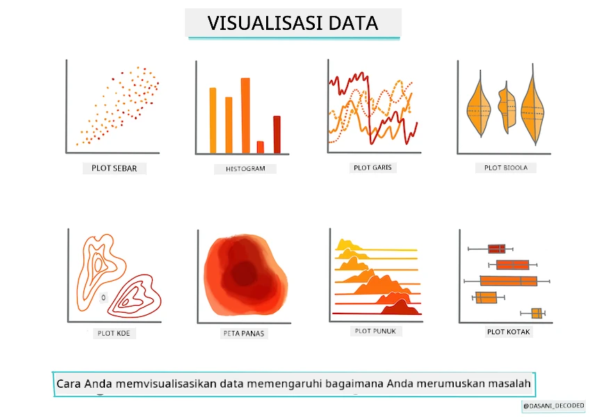
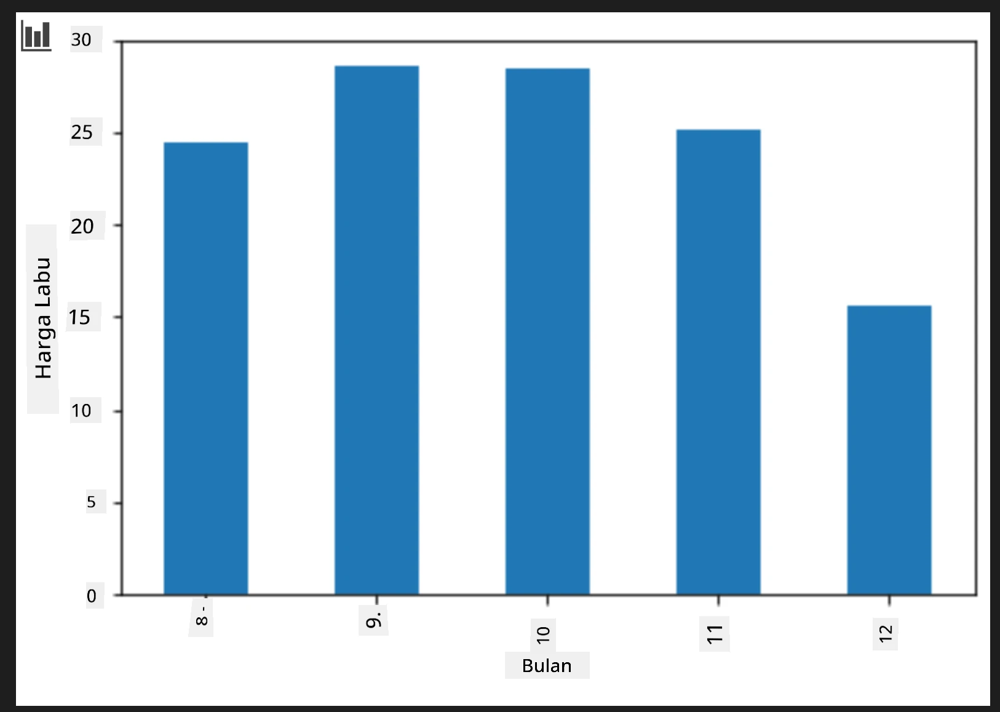
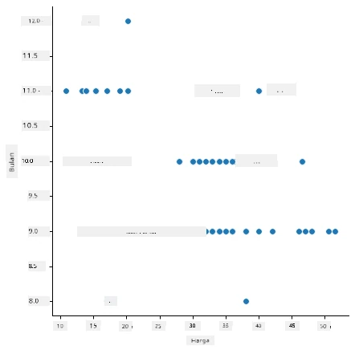
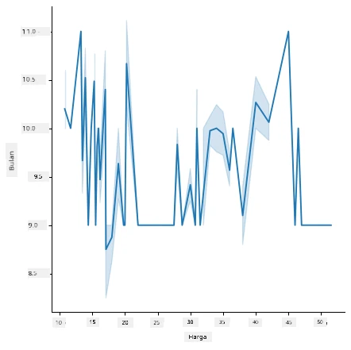
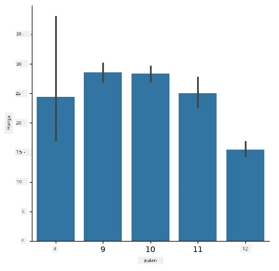

# Membangun model regresi menggunakan Scikit-learn: menyiapkan dan memvisualisasikan data



Infografis oleh [Dasani Madipalli](https://twitter.com/dasani_decoded)

## [Kuis sebelum kuliah](https://ff-quizzes.netlify.app/en/ml/)

> ### [Pelajaran ini tersedia dalam R!](../../../../2-Regression/2-Data/solution/R/lesson_2.html)

## Pendahuluan

Sekarang Anda sudah siap dengan alat yang Anda butuhkan untuk mulai menangani pembuatan model pembelajaran mesin dengan Scikit-learn, Anda siap untuk mulai mengajukan pertanyaan pada data Anda. Saat Anda bekerja dengan data dan menerapkan solusi ML, sangat penting untuk memahami cara mengajukan pertanyaan yang tepat agar dapat membuka potensi dataset Anda secara benar.

Dalam pelajaran ini, Anda akan belajar:

- Cara menyiapkan data Anda untuk pembangunan model.
- Cara menggunakan Matplotlib untuk visualisasi data.
- Cara menggunakan Seaborn untuk visualisasi data yang lebih ekspresif.

## Mengajukan pertanyaan yang tepat dari data Anda

Pertanyaan yang perlu Anda jawab akan menentukan jenis algoritma ML yang akan Anda gunakan. Dan kualitas jawaban yang Anda dapatkan sangat bergantung pada sifat data Anda.

Lihatlah [data](https://github.com/microsoft/ML-For-Beginners/blob/main/2-Regression/data/US-pumpkins.csv) yang disediakan untuk pelajaran ini. Anda bisa membuka file .csv ini di VS Code. Sekilas menunjukkan ada kekosongan dan campuran data string dan numerik. Ada juga kolom aneh bernama 'Package' di mana data merupakan campuran antara 'sacks', 'bins' dan nilai lainnya. Data ini sebenarnya agak berantakan.

[](https://youtu.be/5qGjczWTrDQ "ML untuk pemula - Cara Menganalisis dan Membersihkan Dataset")

> 🎥 Klik gambar di atas untuk video singkat yang membahas cara menyiapkan data untuk pelajaran ini.

Sebenarnya, jarang sekali mendapatkan dataset yang benar-benar siap digunakan langsung untuk membuat model ML. Dalam pelajaran ini, Anda akan belajar cara menyiapkan dataset mentah menggunakan pustaka standar Python. Anda juga akan mempelajari berbagai teknik untuk memvisualisasikan data.

## Studi kasus: 'pasar labu'

Dalam folder ini Anda akan menemukan file .csv di folder root `data` bernama [US-pumpkins.csv](https://github.com/microsoft/ML-For-Beginners/blob/main/2-Regression/data/US-pumpkins.csv) yang berisikan 1757 baris data tentang pasar labu, disortir berdasarkan kota. Ini adalah data mentah yang diambil dari [Laporan Standar Pasar Terminal Hasil Khusus](https://www.marketnews.usda.gov/mnp/fv-report-config-step1?type=termPrice) yang didistribusikan oleh Departemen Pertanian Amerika Serikat.

### Menyiapkan data

Data ini berada di domain publik. Bisa diunduh dalam banyak file terpisah per kota dari situs USDA. Untuk menghindari terlalu banyak file terpisah, kami telah menggabungkan semua data kota ke dalam satu spreadsheet, sehingga kami sudah _menyiapkan_ data tersebut sedikit. Selanjutnya, mari kita lihat lebih dekat data tersebut.

### Data labu - kesimpulan awal

Apa yang Anda perhatikan dari data ini? Anda sudah melihat ada campuran string, angka, kekosongan, dan nilai aneh yang perlu Anda pahami.

Pertanyaan apa yang bisa Anda ajukan dari data ini, menggunakan teknik Regresi? Bagaimana dengan "Memprediksi harga labu yang dijual selama bulan tertentu". Melihat kembali data, ada beberapa perubahan yang perlu dilakukan untuk membuat struktur data yang diperlukan untuk tugas ini.
## Latihan - menganalisis data labu

Mari gunakan [Pandas](https://pandas.pydata.org/), (nama ini berasal dari `Python Data Analysis`) alat yang sangat berguna untuk membentuk data, untuk menganalisis dan menyiapkan data labu ini.

### Pertama, periksa tanggal yang hilang

Pertama Anda perlu mengambil langkah untuk memeriksa tanggal yang hilang:

1. Ubah tanggal ke format bulan (ini adalah tanggal AS, jadi formatnya `MM/DD/YYYY`).
2. Ekstrak bulan menjadi kolom baru.

Buka file _notebook.ipynb_ di Visual Studio Code dan impor spreadsheet ke dalam dataframe Pandas baru.

1. Gunakan fungsi `head()` untuk melihat lima baris pertama.

    ```python
    import pandas as pd
    pumpkins = pd.read_csv('../data/US-pumpkins.csv')
    pumpkins.head()
    ```

    ✅ Fungsi apa yang akan Anda gunakan untuk melihat lima baris terakhir?

1. Periksa apakah ada data yang hilang di dataframe saat ini:

    ```python
    pumpkins.isnull().sum()
    ```

    Ada data yang hilang, tetapi mungkin tidak berpengaruh untuk tugas ini.

1. Untuk memudahkan pengolahan dataframe Anda, pilih hanya kolom yang Anda butuhkan, menggunakan fungsi `loc` yang mengekstrak dari dataframe asli sekumpulan baris (dilewatkan sebagai parameter pertama) dan kolom (parameter kedua). Ekspresi `:` dalam contoh di bawah berarti "semua baris".

    ```python
    columns_to_select = ['Package', 'Low Price', 'High Price', 'Date']
    pumpkins = pumpkins.loc[:, columns_to_select]
    ```

### Kedua, tentukan harga rata-rata labu

Pikirkan cara menentukan harga rata-rata labu dalam bulan tertentu. Kolom apa yang akan Anda pilih untuk tugas ini? Petunjuk: Anda akan membutuhkan 3 kolom.

Solusi: ambil rata-rata dari kolom `Low Price` dan `High Price` untuk mengisi kolom Harga baru, dan ubah kolom Date hanya menampilkan bulan. Untungnya, menurut pemeriksaan di atas, tidak ada data yang hilang untuk tanggal atau harga.

1. Untuk menghitung rata-rata, tambahkan kode berikut:

    ```python
    price = (pumpkins['Low Price'] + pumpkins['High Price']) / 2

    month = pd.DatetimeIndex(pumpkins['Date']).month

    ```

   ✅ Jangan ragu untuk mencetak data apa pun yang ingin Anda periksa menggunakan `print(month)`.

2. Sekarang, salin data yang sudah diubah ke dataframe Pandas baru:

    ```python
    new_pumpkins = pd.DataFrame({'Month': month, 'Package': pumpkins['Package'], 'Low Price': pumpkins['Low Price'],'High Price': pumpkins['High Price'], 'Price': price})
    ```

    Mencetak dataframe Anda akan menunjukkan dataset bersih dan rapi yang bisa digunakan untuk membangun model regresi Anda.

### Tapi tunggu! Ada yang ganjil di sini

Jika Anda lihat kolom `Package`, labu dijual dalam berbagai konfigurasi berbeda. Ada yang dijual dalam ukuran '1 1/9 bushel', ada yang '1/2 bushel', beberapa per labu, beberapa per pon, dan ada yang dalam kotak besar dengan lebar bervariasi.

> Labu tampaknya sangat sulit untuk ditimbang secara konsisten

Melihat data asli, menarik bahwa apa pun dengan `Unit of Sale` bernilai 'EACH' atau 'PER BIN' juga memiliki jenis `Package` per inci, per bin, atau 'each'. Labu memang sulit ditimbang secara konsisten, jadi mari kita saring dengan memilih hanya labu yang memiliki string 'bushel' di kolom `Package` mereka.

1. Tambahkan filter di bagian atas file, di bawah impor .csv awal:

    ```python
    pumpkins = pumpkins[pumpkins['Package'].str.contains('bushel', case=True, regex=True)]
    ```

    Jika Anda mencetak data sekarang, Anda akan melihat bahwa Anda hanya mendapatkan sekitar 415 baris data yang berisi labu per bushel.

### Tapi tunggu! Ada satu hal lagi yang harus dilakukan

Apakah Anda menyadari bahwa jumlah bushel bervariasi per baris? Anda perlu menormalkan harga sehingga menampilkan harga per bushel, jadi lakukan beberapa perhitungan untuk menstandarisasinya.

1. Tambahkan baris ini setelah blok yang membuat dataframe new_pumpkins:

    ```python
    new_pumpkins.loc[new_pumpkins['Package'].str.contains('1 1/9'), 'Price'] = price/(1 + 1/9)

    new_pumpkins.loc[new_pumpkins['Package'].str.contains('1/2'), 'Price'] = price/(1/2)
    ```

✅ Menurut [The Spruce Eats](https://www.thespruceeats.com/how-much-is-a-bushel-1389308), berat bushel tergantung jenis produk, karena ini adalah ukuran volume. "Satu bushel tomat, misalnya, seharusnya beratnya 56 pon... Daun dan sayuran hijau mengisi lebih banyak ruang dengan berat lebih sedikit, jadi satu bushel bayam hanya sekitar 20 pon." Semuanya cukup rumit! Mari kita tidak repot membuat konversi bushel ke pon, dan harga berdasarkan bushel saja. Studi tentang bushel labu ini menunjukkan betapa pentingnya memahami sifat data Anda!

Sekarang Anda bisa menganalisis harga per unit berdasarkan ukuran bushelnya. Jika Anda mencetak data sekali lagi, Anda bisa melihat bagaimana data tersebut sudah distandarisasi.

✅ Apakah Anda menyadari labu yang dijual per setengah bushel sangat mahal? Bisakah Anda mencari tahu mengapa? Petunjuk: labu kecil jauh lebih mahal daripada yang besar, mungkin karena ada lebih banyak jumlah labu kecil per bushel, mengingat ruang tidak terpakai yang diambil oleh satu labu pie besar berongga.

## Strategi Visualisasi

Bagian dari peran ilmuwan data adalah untuk menunjukkan kualitas dan sifat data yang mereka gunakan. Untuk melakukan ini, mereka sering membuat visualisasi menarik, atau plot, grafik, dan diagram, yang menunjukkan berbagai aspek data. Dengan cara ini, mereka dapat secara visual menunjukkan hubungan dan celah yang sulit ditemukan dengan cara lain.

[](https://youtu.be/SbUkxH6IJo0 "ML untuk pemula - Cara Memvisualisasikan Data dengan Matplotlib")

> 🎥 Klik gambar di atas untuk video singkat yang membahas visualisasi data untuk pelajaran ini.

Visualisasi juga dapat membantu menentukan teknik pembelajaran mesin yang paling cocok untuk data. Sebuah scatterplot yang tampak mengikuti garis, misalnya, menunjukkan bahwa data tersebut adalah kandidat bagus untuk latihan regresi linier.

Salah satu pustaka visualisasi data yang bekerja baik di Jupyter notebook adalah [Matplotlib](https://matplotlib.org/) (yang juga Anda lihat di pelajaran sebelumnya).

> Dapatkan lebih banyak pengalaman dengan visualisasi data di [tutorial-tutorial ini](https://docs.microsoft.com/learn/modules/explore-analyze-data-with-python?WT.mc_id=academic-77952-leestott).

## Latihan - bereksperimen dengan Matplotlib

Cobalah membuat beberapa plot dasar untuk menampilkan dataframe baru yang baru saja Anda buat. Apa yang akan ditampilkan plot garis dasar?

1. Impor Matplotlib di bagian atas file, di bawah impor Pandas:

    ```python
    import matplotlib.pyplot as plt
    ```

1. Jalankan ulang seluruh notebook untuk menyegarkan.
1. Di bagian bawah notebook, tambahkan sel untuk membuat plot data sebagai box:

    ```python
    price = new_pumpkins.Price
    month = new_pumpkins.Month
    plt.scatter(price, month)
    plt.show()
    ```

    

    Apakah ini plot yang berguna? Apakah ada sesuatu yang mengejutkan Anda?

    Ini tidak terlalu berguna karena hanya menampilkan data Anda sebagai titik-titik yang tersebar di bulan tertentu.

### Membuatnya berguna

Untuk mendapatkan grafik yang menampilkan data berguna, biasanya Anda perlu mengelompokkan data. Mari coba buat plot di mana sumbu y menunjukkan bulan dan datanya menunjukkan distribusi data.

1. Tambahkan sel untuk membuat diagram batang kelompok:

    ```python
    new_pumpkins.groupby(['Month'])['Price'].mean().plot(kind='bar')
    plt.ylabel("Pumpkin Price")
    ```

    

    Ini adalah visualisasi data yang lebih berguna! Tampaknya menunjukkan bahwa harga tertinggi untuk labu terjadi pada bulan September dan Oktober. Apakah ini sesuai dengan harapan Anda? Mengapa atau mengapa tidak?

## Latihan - bereksperimen dengan Seaborn

Matplotlib sangat kuat, tetapi bisa membutuhkan banyak kode untuk menghasilkan grafik yang rapi. [Seaborn](https://seaborn.pydata.org/) adalah perpustakaan yang dibangun _di atas_ Matplotlib yang dirancang untuk visualisasi data statistik. Ia bekerja langsung dengan dataframe Pandas, menerapkan gaya default yang menarik, dan memungkinkan Anda membuat plot informatif dengan kode jauh lebih sedikit. Karena Seaborn mengembalikan objek Matplotlib, Anda masih bisa menggunakan semua yang sudah Anda ketahui tentang Matplotlib untuk menyempurnakan hasilnya.

> Jika Anda belum memasang Seaborn, pasang dengan `pip install seaborn`.

1. Impor Seaborn di bagian atas notebook, di bawah impor lainnya. Konvensinya diimpor sebagai `sns`:

    ```python
    import seaborn as sns
    ```

### Scatter plot untuk menampilkan hubungan

Bagian besar dari eksplorasi data sebelum membangun model adalah mencari _hubungan_ antara variabel. [Scatter plot](https://en.wikipedia.org/wiki/Scatter_plot) adalah salah satu alat terbaik untuk ini: jika titik-titik tampak mengikuti garis, dua variabel tersebut mungkin berkorelasi, yang merupakan tanda baik bahwa model regresi linier bisa berhasil.

1. Buat ulang scatter plot harga terhadap bulan dari sebelumnya, kali ini menggunakan [`relplot()`](https://seaborn.pydata.org/generated/seaborn.relplot.html) Seaborn (plot relasional), yang bekerja langsung dengan kolom dataframe Anda:

    ```python
    sns.relplot(x="Price", y="Month", data=new_pumpkins)
    ```

    

    Perhatikan bagaimana Anda melewatkan _nama kolom_ dan dataframe, dan Seaborn menangani label sumbu untuk Anda.

2. Anda dapat beralih ke plot garis dengan melewatkan `kind="line"`. Seaborn bahkan menggambar pita bayangan yang menunjukkan interval kepercayaan di sekitar garis:

    ```python
    sns.relplot(x="Price", y="Month", kind="line", data=new_pumpkins)
    ```

    

    Data ini cukup berisik, jadi plot garis bukan pilihan paling jelas di sini — tetapi ini menunjukkan betapa mudahnya Anda mengubah jenis grafik di Seaborn.

### Diagram batang untuk menunjukkan distribusi


Sebelumnya Anda mengelompokkan data secara manual untuk membuat diagram batang dengan Matplotlib. Seaborn's [`catplot()`](https://seaborn.pydata.org/generated/seaborn.catplot.html) (plot kategorikal) dapat melakukan pengelompokan dan agregasi untuk Anda. Secara default `kind="bar"` menampilkan rata-rata dari setiap kategori bersama dengan garis hitam yang menunjukkan interval kepercayaan.

1. Buat diagram batang harga rata-rata per bulan:

    ```python
    sns.catplot(x="Month", y="Price", data=new_pumpkins, kind="bar")
    ```

    

    Ini mengonfirmasi apa yang Anda lihat dengan Matplotlib — harga mencapai puncak sekitar September dan Oktober — tetapi Seaborn juga memvisualisasikan seberapa banyak harga _bervariasi_ dalam setiap bulan.

### Heatmap untuk menunjukkan korelasi

Scatter plot membandingkan dua variabel sekaligus. Ketika Anda memiliki beberapa kolom numerik, sebuah [heatmap](https://en.wikipedia.org/wiki/Heat_map) memungkinkan Anda melihat kekuatan hubungan antar _setiap_ pasangan kolom sekaligus. Ini adalah cara umum untuk melihat fitur mana yang paling berkorelasi sebelum memilih yang akan digunakan dalam model (dan jenis grafik yang sama kemudian digunakan untuk menampilkan matriks kebingungan dalam klasifikasi).

1. Bangun matriks korelasi dengan Pandas, lalu gambar menggunakan Seaborn's [`heatmap()`](https://seaborn.pydata.org/generated/seaborn.heatmap.html). Opsi `annot=True` mencetak nilai korelasi pada setiap sel:

    ```python
    correlations = new_pumpkins[['Month', 'Low Price', 'High Price', 'Price']].corr()
    sns.heatmap(correlations, annot=True, cmap="coolwarm")
    ```

    

    Nilai yang mendekati `1` (atau `-1`) berarti kolom-kolom tersebut sangat berkorelasi secara _linear_. Perhatikan bagaimana `Low Price` dan `High Price` hampir berkorelasi sempurna. `Month`, di sisi lain, hanya menunjukkan korelasi linear yang lemah dengan harga — meskipun diagram batang di atas mengungkapkan puncak musiman yang jelas di September dan Oktober. Itu pelajaran penting: koefisien korelasi hanya mengukur hubungan _garis lurus_, jadi bisa melewatkan pola musiman atau pola non-linear lainnya. ✅ Mengapa berguna melihat baik heatmap *dan* grafik seperti diagram batang sebelum memutuskan kolom mana yang akan digunakan?

### Matplotlib atau Seaborn?

Kedua perpustakaan ini patut diketahui:

- **Matplotlib** memberi Anda kontrol detail atas setiap elemen grafik dan merupakan dasar dari hampir semua perpustakaan plotting Python lainnya.
- **Seaborn** menyediakan fungsi tingkat tinggi dan default menarik untuk grafik statistik, bekerja langsung dengan dataframe, dan seringkali lebih cepat untuk analisis data eksploratif.

Alur kerja umum adalah menggunakan Seaborn untuk menjelajahi data dengan cepat, kemudian beralih ke Matplotlib ketika Anda perlu menyesuaikan detail.

---

## 🚀Tantangan

Jelajahi berbagai jenis visualisasi yang ditawarkan Matplotlib dan Seaborn. Jenis mana yang paling tepat untuk masalah regresi?

## [Kuis pasca kuliah](https://ff-quizzes.netlify.app/en/ml/)

## Tinjauan & Studi Mandiri

Lihat berbagai cara untuk memvisualisasikan data. Buatlah daftar berbagai perpustakaan yang tersedia dan catat mana yang terbaik untuk jenis tugas tertentu, misalnya visualisasi 2D vs. visualisasi 3D. Apa yang Anda temukan?

## Tugas

[Menjelajahi visualisasi](assignment.md)

---

<!-- CO-OP TRANSLATOR DISCLAIMER START -->
**Penafian**:
Dokumen ini telah diterjemahkan menggunakan layanan terjemahan AI [Co-op Translator](https://github.com/Azure/co-op-translator). Meskipun kami berupaya untuk mencapai akurasi, harap diketahui bahwa terjemahan otomatis mungkin mengandung kesalahan atau ketidakakuratan. Dokumen asli dalam bahasa aslinya harus dianggap sebagai sumber yang sah. Untuk informasi penting, disarankan menggunakan terjemahan profesional oleh manusia. Kami tidak bertanggung jawab atas kesalahpahaman atau penafsiran yang keliru yang timbul dari penggunaan terjemahan ini.
<!-- CO-OP TRANSLATOR DISCLAIMER END -->