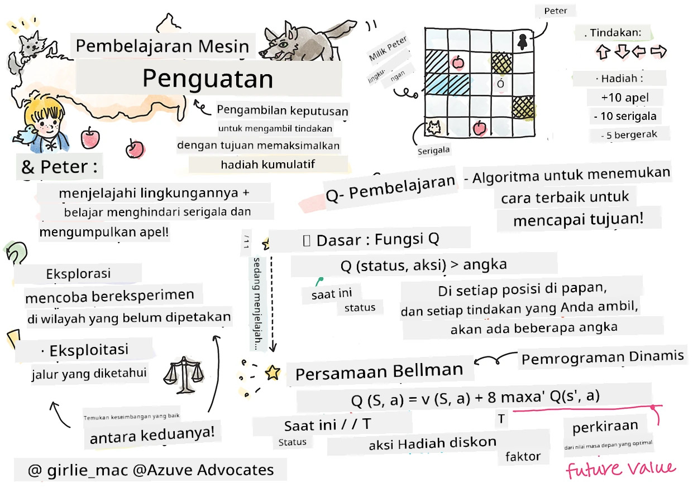

# Pengantar Pembelajaran Penguatan dan Q-Learning


> Sketchnote oleh [Tomomi Imura](https://www.twitter.com/girlie_mac)

Pembelajaran penguatan melibatkan tiga konsep penting: agen, beberapa keadaan, dan seperangkat tindakan per keadaan. Dengan mengeksekusi sebuah tindakan di keadaan tertentu, agen diberikan hadiah. Bayangkan lagi permainan komputer Super Mario. Anda adalah Mario, Anda berada di sebuah level permainan, berdiri di tepi jurang. Di atas Anda ada sebuah koin. Anda sebagai Mario, dalam level permainan, pada posisi tertentu ... itulah keadaan Anda. Melangkah satu langkah ke kanan (sebuah tindakan) akan membuat Anda jatuh dari tepi, dan itu akan memberikan skor numerik rendah. Namun, menekan tombol lompat akan membuat Anda mendapatkan satu poin dan Anda akan tetap hidup. Itu adalah hasil positif dan harus memberikan skor numerik positif.

Dengan menggunakan pembelajaran penguatan dan sebuah simulator (permainan), Anda bisa belajar cara bermain permainan untuk memaksimalkan hadiah yaitu tetap hidup dan mengumpulkan poin sebanyak mungkin.

[](https://www.youtube.com/watch?v=lDq_en8RNOo)

> 🎥 Klik gambar di atas untuk mendengarkan Dmitry membahas Pembelajaran Penguatan

## [Kuis pra-perkuliahan](https://ff-quizzes.netlify.app/en/ml/)

## Prasyarat dan Pengaturan

Dalam pelajaran ini, kita akan bereksperimen dengan beberapa kode dalam Python. Anda harus bisa menjalankan kode Jupyter Notebook dari pelajaran ini, baik di komputer Anda atau di cloud.

Anda dapat membuka [notebook pelajaran](https://github.com/microsoft/ML-For-Beginners/blob/main/8-Reinforcement/1-QLearning/notebook.ipynb) dan mengikuti pelajaran ini untuk membangun.

> **Catatan:** Jika Anda membuka kode ini dari cloud, Anda juga perlu mengambil file [`rlboard.py`](https://github.com/microsoft/ML-For-Beginners/blob/main/8-Reinforcement/1-QLearning/rlboard.py), yang digunakan dalam kode notebook. Tambahkan ke direktori yang sama dengan notebook.

## Pengantar

Dalam pelajaran ini, kita akan menjelajahi dunia **[Peter dan Serigala](https://en.wikipedia.org/wiki/Peter_and_the_Wolf)**, terinspirasi oleh dongeng musikal dari komposer Rusia, [Sergei Prokofiev](https://en.wikipedia.org/wiki/Sergei_Prokofiev). Kita akan menggunakan **Pembelajaran Penguatan** untuk membiarkan Peter menjelajahi lingkungannya, mengumpulkan apel lezat dan menghindari bertemu dengan serigala.

**Pembelajaran Penguatan** (RL) adalah teknik pembelajaran yang memungkinkan kita belajar perilaku optimal dari sebuah **agen** dalam beberapa **lingkungan** dengan menjalankan banyak eksperimen. Agen dalam lingkungan ini harus memiliki beberapa **tujuan**, yang didefinisikan oleh **fungsi hadiah**.

## Lingkungan

Untuk kesederhanaan, mari kita anggap dunia Peter sebagai papan persegi berukuran `width` x `height`, seperti ini:


Setiap sel di papan ini bisa berupa:

* **tanah**, tempat Peter dan makhluk lain bisa berjalan.
* **air**, yang jelas Anda tidak bisa berjalan di atasnya.
* sebuah **pohon** atau **rumput**, tempat Anda bisa beristirahat.
* sebuah **apel**, yang mewakili sesuatu yang akan menyenangkan Peter untuk ditemukan agar bisa memberi makan dirinya.
* sebuah **serigala**, yang berbahaya dan harus dihindari.

Ada modul Python terpisah, [`rlboard.py`](https://github.com/microsoft/ML-For-Beginners/blob/main/8-Reinforcement/1-QLearning/rlboard.py), yang berisi kode untuk bekerja dengan lingkungan ini. Karena kode ini tidak penting untuk memahami konsep kita, kita akan mengimpor modul tersebut dan menggunakannya untuk membuat papan sampel (blok kode 1):

```python
from rlboard import *

width, height = 8,8
m = Board(width,height)
m.randomize(seed=13)
m.plot()
```

Kode ini harus mencetak gambar lingkungan yang mirip dengan yang di atas.

## Tindakan dan kebijakan

Dalam contoh kita, tujuan Peter adalah bisa menemukan apel, sambil menghindari serigala dan rintangan lainnya. Untuk melakukan ini, dia pada dasarnya bisa berjalan sampai menemukan apel.

Oleh karena itu, di posisi manapun, dia dapat memilih salah satu dari tindakan berikut: ke atas, ke bawah, ke kiri dan ke kanan.

Kita akan mendefinisikan tindakan-tindakan tersebut sebagai sebuah kamus, dan memetakannya ke pasangan perubahan koordinat yang sesuai. Misalnya, bergerak ke kanan (`R`) akan sesuai dengan pasangan `(1,0)`. (blok kode 2):

```python
actions = { "U" : (0,-1), "D" : (0,1), "L" : (-1,0), "R" : (1,0) }
action_idx = { a : i for i,a in enumerate(actions.keys()) }
```

Untuk menyimpulkan, strategi dan tujuan skenario ini adalah sebagai berikut:

- **Strategi**, agen kita (Peter) didefinisikan oleh yang disebut **kebijakan**. Kebijakan adalah fungsi yang mengembalikan tindakan pada keadaan tertentu. Dalam kasus kita, keadaan masalah direpresentasikan oleh papan, termasuk posisi pemain saat ini.

- **Tujuan**, pembelajaran penguatan adalah pada akhirnya mempelajari kebijakan yang baik yang memungkinkan kita menyelesaikan masalah secara efisien. Namun, sebagai baseline, mari kita pertimbangkan kebijakan paling sederhana yang disebut **random walk**.

## Random walk

Mari kita selesaikan masalah kita dengan menerapkan strategi random walk. Dengan random walk, kita akan memilih tindakan berikutnya secara acak dari tindakan yang diperbolehkan, sampai kita mencapai apel (blok kode 3).

1. Implementasikan random walk dengan kode berikut:

    ```python
    def random_policy(m):
        return random.choice(list(actions))
    
    def walk(m,policy,start_position=None):
        n = 0 # jumlah langkah
        # atur posisi awal
        if start_position:
            m.human = start_position 
        else:
            m.random_start()
        while True:
            if m.at() == Board.Cell.apple:
                return n # berhasil!
            if m.at() in [Board.Cell.wolf, Board.Cell.water]:
                return -1 # dimakan serigala atau tenggelam
            while True:
                a = actions[policy(m)]
                new_pos = m.move_pos(m.human,a)
                if m.is_valid(new_pos) and m.at(new_pos)!=Board.Cell.water:
                    m.move(a) # lakukan perpindahan sebenarnya
                    break
            n+=1
    
    walk(m,random_policy)
    ```

    Panggilan ke `walk` harus mengembalikan panjang jalur yang sesuai, yang bisa berbeda dari satu percobaan ke percobaan lain.

1. Jalankan eksperimen walk beberapa kali (misalnya, 100), dan cetak statistik hasilnya (blok kode 4):

    ```python
    def print_statistics(policy):
        s,w,n = 0,0,0
        for _ in range(100):
            z = walk(m,policy)
            if z<0:
                w+=1
            else:
                s += z
                n += 1
        print(f"Average path length = {s/n}, eaten by wolf: {w} times")
    
    print_statistics(random_policy)
    ```

    Perhatikan bahwa panjang rata-rata jalur sekitar 30-40 langkah, yang cukup banyak, mengingat jarak rata-rata ke apel terdekat sekitar 5-6 langkah.

    Anda juga dapat melihat bagaimana gerakan Peter selama random walk:

    

## Fungsi hadiah

Untuk membuat kebijakan kita lebih cerdas, kita perlu memahami gerakan mana yang "lebih baik" daripada yang lain. Untuk melakukan ini, kita perlu mendefinisikan tujuan kita.

Tujuan dapat didefinisikan dalam bentuk **fungsi hadiah**, yang akan mengembalikan nilai skor untuk setiap keadaan. Semakin tinggi angkanya, semakin baik fungsi hadiah tersebut. (blok kode 5)

```python
move_reward = -0.1
goal_reward = 10
end_reward = -10

def reward(m,pos=None):
    pos = pos or m.human
    if not m.is_valid(pos):
        return end_reward
    x = m.at(pos)
    if x==Board.Cell.water or x == Board.Cell.wolf:
        return end_reward
    if x==Board.Cell.apple:
        return goal_reward
    return move_reward
```

Hal menarik tentang fungsi hadiah adalah bahwa dalam kebanyakan kasus, *kita hanya diberikan hadiah substansial pada akhir permainan*. Ini berarti algoritma kita harus somehow mengingat langkah "baik" yang mengarah pada hadiah positif di akhir, dan meningkatkan pentingnya. Demikian pula, semua gerakan yang mengarah ke hasil buruk harus dihindari.

## Q-Learning

Algoritma yang akan kita bahas di sini disebut **Q-Learning**. Dalam algoritma ini, kebijakan didefinisikan oleh fungsi (atau struktur data) yang disebut **Q-Table**. Ini merekam "kebaikan" dari masing-masing tindakan dalam suatu keadaan tertentu.

Disebut Q-Table karena seringkali mudah merepresentasikannya sebagai tabel, atau array multi-dimensi. Karena papan kita memiliki dimensi `width` x `height`, kita dapat merepresentasikan Q-Table menggunakan array numpy dengan bentuk `width` x `height` x `len(actions)`: (blok kode 6)

```python
Q = np.ones((width,height,len(actions)),dtype=np.float)*1.0/len(actions)
```

Perhatikan bahwa kita menginisialisasi semua nilai Q-Table dengan nilai yang sama, dalam kasus kita - 0.25. Ini sesuai dengan kebijakan "random walk", karena semua gerakan pada setiap keadaan memiliki nilai sama. Kita dapat memberikan Q-Table ke fungsi `plot` untuk memvisualisasikan tabel di papan: `m.plot(Q)`.


Di tengah setiap sel terdapat "panah" yang menunjukkan arah gerak yang diinginkan. Karena semua arah sama, sebuah titik ditampilkan.

Sekarang kita perlu menjalankan simulasi, menjelajahi lingkungan kita, dan mempelajari distribusi nilai Q-Table yang lebih baik, yang akan memungkinkan kita menemukan jalur ke apel lebih cepat.

## Inti Q-Learning: Persamaan Bellman

Setelah kita mulai bergerak, setiap aksi akan memiliki hadiah yang sesuai, yaitu secara teoritis kita dapat memilih aksi berikutnya berdasarkan hadiah langsung tertinggi. Namun, di kebanyakan keadaan, gerakan itu tidak akan mencapai tujuan kita untuk mendapatkan apel, sehingga kita tidak bisa segera memutuskan arah mana yang lebih baik.

> Ingatlah bahwa hasil langsung bukanlah yang penting, melainkan hasil akhir yang akan kita peroleh di akhir simulasi.

Untuk memperhitungkan hadiah yang tertunda ini, kita perlu menggunakan prinsip **[pemrograman dinamis](https://en.wikipedia.org/wiki/Dynamic_programming)**, yang memungkinkan kita berpikir secara rekursif tentang masalah kita.

Misal kita sekarang berada di keadaan *s*, dan ingin pindah ke keadaan berikutnya *s'*. Dengan melakukan itu, kita akan menerima hadiah langsung *r(s,a)*, yang didefinisikan oleh fungsi hadiah, plus beberapa hadiah di masa depan. Jika kita menganggap Q-Table kita mencerminkan "daya tarik" dari setiap tindakan dengan benar, maka di keadaan *s'* kita akan memilih sebuah tindakan *a* yang sesuai dengan nilai maksimum dari *Q(s',a')*. Jadi, hadiah masa depan terbaik yang bisa kita dapatkan di keadaan *s* didefinisikan sebagai `max`<sub>a'</sub>*Q(s',a')* (maksimum di sini dihitung untuk semua tindakan *a'* yang mungkin di keadaan *s'*).

Ini memberikan **rumus Bellman** untuk menghitung nilai Q-Table di keadaan *s*, dengan tindakan *a*:


Di sini γ adalah yang disebut **faktor diskon** yang menentukan seberapa besar Anda harus lebih mengutamakan hadiah sekarang dibanding hadiah di masa depan dan sebaliknya.

## Algoritma Pembelajaran

Berdasarkan persamaan di atas, kita sekarang bisa menulis pseudo-code untuk algoritma pembelajaran kita:

* Inisialisasi Q-Table Q dengan angka sama untuk semua keadaan dan tindakan
* Tetapkan laju pembelajaran α ← 1
* Ulangi simulasi berkali-kali
   1. Mulai dari posisi acak
   1. Ulangi
        1. Pilih tindakan *a* di keadaan *s*
        2. Eksekusi tindakan dengan pindah ke keadaan baru *s'*
        3. Jika kita menemui kondisi akhir permainan, atau total hadiah terlalu kecil - keluar dari simulasi  
        4. Hitung hadiah *r* di keadaan baru
        5. Update Fungsi Q sesuai persamaan Bellman: *Q(s,a)* ← *(1-α)Q(s,a)+α(r+γ max<sub>a'</sub>Q(s',a'))*
        6. *s* ← *s'*
        7. Update total hadiah dan turunkan α.

## Eksploitasi vs. eksplorasi

Dalam algoritma di atas, kita tidak menentukan bagaimana tepatnya kita memilih tindakan pada langkah 2.1. Jika kita memilih tindakan secara acak, kita akan secara acak **mengeksplorasi** lingkungan, dan kita juga cukup mungkin mati sering serta menjelajahi area yang biasanya tidak kita kunjungi. Pendekatan alternatif adalah **mengeksploitasi** nilai-nilai Q-Table yang sudah kita ketahui, dan memilih tindakan terbaik (dengan nilai Q-Table lebih tinggi) di keadaan *s*. Namun, ini akan mencegah kita mengeksplorasi keadaan lain, dan kemungkinan kita tidak akan menemukan solusi optimal.

Oleh karena itu, pendekatan terbaik adalah menyeimbangkan eksplorasi dan eksploitasi. Ini dapat dilakukan dengan memilih tindakan di keadaan *s* dengan probabilitas yang proporsional terhadap nilai-nilai di Q-Table. Pada awalnya, ketika nilai Q-Table semua sama, ini akan sama dengan pilihan acak, tapi seiring kita belajar lebih banyak tentang lingkungan, kita lebih cenderung mengikuti rute optimal sekaligus membiarkan agen memilih jalur yang belum dijelajahi sesekali.

## Implementasi Python

Sekarang kita siap mengimplementasikan algoritma pembelajaran. Sebelum itu, kita juga perlu fungsi yang akan mengubah angka-angka sembarang dalam Q-Table menjadi vektor probabilitas untuk tindakan yang sesuai.

1. Buat fungsi `probs()`:

    ```python
    def probs(v,eps=1e-4):
        v = v-v.min()+eps
        v = v/v.sum()
        return v
    ```

    Kita menambahkan beberapa `eps` ke vektor asli agar terhindar dari pembagian dengan 0 pada kasus awal, ketika semua komponen vektor identik.

Jalankan algoritma pembelajaran melalui 5000 eksperimen, yang juga disebut **epoch**: (blok kode 8)
```python
    for epoch in range(5000):
    
        # Pilih titik awal
        m.random_start()
        
        # Mulai perjalanan
        n=0
        cum_reward = 0
        while True:
            x,y = m.human
            v = probs(Q[x,y])
            a = random.choices(list(actions),weights=v)[0]
            dpos = actions[a]
            m.move(dpos,check_correctness=False) # kami mengizinkan pemain bergerak di luar papan, yang mengakhiri episode
            r = reward(m)
            cum_reward += r
            if r==end_reward or cum_reward < -1000:
                lpath.append(n)
                break
            alpha = np.exp(-n / 10e5)
            gamma = 0.5
            ai = action_idx[a]
            Q[x,y,ai] = (1 - alpha) * Q[x,y,ai] + alpha * (r + gamma * Q[x+dpos[0], y+dpos[1]].max())
            n+=1
```

Setelah menjalankan algoritma ini, Q-Table harus diperbarui dengan nilai yang mendefinisikan daya tarik tindakan berbeda di setiap langkah. Kita bisa mencoba memvisualisasikan Q-Table dengan menggambar vektor di setiap sel yang mengarah ke arah gerak yang diinginkan. Demi kesederhanaan, kita gambar lingkaran kecil sebagai pengganti ujung panah.


## Memeriksa kebijakan

Karena Q-Table mencantumkan "daya tarik" setiap tindakan di setiap keadaan, cukup mudah menggunakannya untuk mendefinisikan navigasi efisien di dunia kita. Dalam kasus paling sederhana, kita bisa memilih tindakan yang sesuai dengan nilai tertinggi di Q-Table: (blok kode 9)

```python
def qpolicy_strict(m):
        x,y = m.human
        v = probs(Q[x,y])
        a = list(actions)[np.argmax(v)]
        return a

walk(m,qpolicy_strict)
```


> Jika Anda mencoba kode di atas beberapa kali, Anda mungkin memperhatikan bahwa terkadang kode tersebut "terhenti", dan Anda perlu menekan tombol STOP di notebook untuk menghentikannya. Ini terjadi karena mungkin ada situasi di mana dua status "mengarah" satu sama lain dalam hal nilai Q optimal, sehingga agen berakhir bergerak antara status tersebut tanpa henti.

## 🚀Tantangan

> **Tugas 1:** Modifikasi fungsi `walk` untuk membatasi panjang jalur maksimum dengan sejumlah langkah tertentu (misalnya, 100), dan perhatikan kode di atas mengembalikan nilai ini dari waktu ke waktu.

> **Tugas 2:** Modifikasi fungsi `walk` sehingga tidak kembali ke tempat-tempat yang sudah pernah dikunjunginya sebelumnya. Ini akan mencegah `walk` berputar tanpa henti, namun, agen masih bisa terjebak di suatu lokasi yang tidak bisa ia tinggalkan.

## Navigasi

Kebijakan navigasi yang lebih baik adalah yang kita gunakan selama pelatihan, yaitu menggabungkan eksploitasi dan eksplorasi. Dalam kebijakan ini, kita akan memilih setiap tindakan dengan probabilitas tertentu, berbanding lurus dengan nilai-nilai dalam Q-Table. Strategi ini mungkin masih menyebabkan agen kembali ke posisi yang sudah dijelajahi, tetapi, seperti yang Anda lihat dari kode di bawah ini, hasilnya adalah jalur rata-rata yang sangat pendek ke lokasi yang diinginkan (ingat bahwa `print_statistics` menjalankan simulasi 100 kali): (blok kode 10)

```python
def qpolicy(m):
        x,y = m.human
        v = probs(Q[x,y])
        a = random.choices(list(actions),weights=v)[0]
        return a

print_statistics(qpolicy)
```

Setelah menjalankan kode ini, Anda seharusnya mendapatkan panjang jalur rata-rata yang jauh lebih kecil dari sebelumnya, dalam rentang 3-6.

## Menyelidiki proses pembelajaran

Seperti yang telah kami sebutkan, proses pembelajaran adalah keseimbangan antara eksplorasi dan eksploitasi pengetahuan yang didapat tentang struktur ruang masalah. Kami telah melihat bahwa hasil pembelajaran (kemampuan untuk membantu agen menemukan jalur pendek ke tujuan) telah meningkat, tetapi juga menarik untuk mengamati bagaimana panjang jalur rata-rata berperilaku selama proses pembelajaran:


Pembelajaran ini dapat dirangkum sebagai berikut:

- **Panjang jalur rata-rata meningkat**. Apa yang kita lihat di sini adalah pertama-tama, panjang jalur rata-rata meningkat. Ini mungkin disebabkan oleh fakta bahwa ketika kita tidak tahu apa pun tentang lingkungan, kita cenderung terjebak di status buruk, air atau serigala. Saat kita belajar lebih banyak dan mulai menggunakan pengetahuan ini, kita dapat menjelajahi lingkungan lebih lama, tetapi kita masih belum tahu dengan baik di mana letak apel.

- **Panjang jalur menurun, seiring kita mempelajari lebih banyak.** Setelah kita belajar cukup banyak, menjadi lebih mudah bagi agen mencapai tujuan, dan panjang jalur mulai menurun. Namun, kita masih terbuka untuk eksplorasi, jadi kita sering menyimpang dari jalur terbaik, dan menjelajahi opsi baru, membuat jalur lebih panjang dari yang optimal.

- **Panjang meningkat secara tiba-tiba.** Yang juga kami amati pada grafik ini adalah bahwa pada titik tertentu, panjang tiba-tiba meningkat. Ini menunjukkan sifat stokastik dari proses tersebut, dan bahwa kita dapat pada suatu titik "merusak" koefisien dalam Q-Table dengan menimpanya dengan nilai baru. Hal ini idealnya harus diminimalkan dengan mengurangi laju pembelajaran (misalnya, menjelang akhir pelatihan, kita hanya menyesuaikan nilai Q-Table dengan nilai kecil).

Secara keseluruhan, penting untuk diingat bahwa keberhasilan dan kualitas proses pembelajaran sangat bergantung pada parameter, seperti laju pembelajaran, penurunan laju pembelajaran, dan faktor diskonto. Parameter tersebut sering disebut **hiperparameter**, untuk membedakannya dari **parameter**, yang kita optimalkan selama pelatihan (misalnya, koefisien Q-Table). Proses menemukan nilai hiperparameter terbaik disebut **optimasi hiperparameter**, dan ini layak menjadi topik terpisah.

## [Kuis pasca kuliah](https://ff-quizzes.netlify.app/en/ml/)

## Tugas 
[Dunia yang Lebih Realistis](assignment.md)

---

<!-- CO-OP TRANSLATOR DISCLAIMER START -->
**Penafian**:
Dokumen ini telah diterjemahkan menggunakan layanan terjemahan AI [Co-op Translator](https://github.com/Azure/co-op-translator). Meskipun kami berupaya untuk mencapai akurasi, harap diketahui bahwa terjemahan otomatis mungkin mengandung kesalahan atau ketidakakuratan. Dokumen asli dalam bahasa aslinya harus dianggap sebagai sumber yang sah. Untuk informasi penting, disarankan menggunakan terjemahan profesional oleh manusia. Kami tidak bertanggung jawab atas kesalahpahaman atau penafsiran yang keliru yang timbul dari penggunaan terjemahan ini.
<!-- CO-OP TRANSLATOR DISCLAIMER END -->