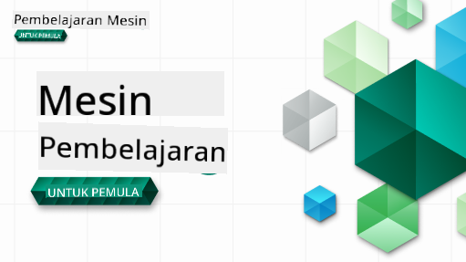

<!--
CO_OP_TRANSLATOR_METADATA:
{
  "original_hash": "7a13afb3674838f557d61f8d67e4d5f8",
  "translation_date": "2025-10-24T09:16:21+00:00",
  "source_file": "README.md",
  "language_code": "id"
}
-->

### 🌐 Dukungan Multi-Bahasa

#### Didukung melalui GitHub Action (Otomatis & Selalu Terbaru)

<!-- TABEL BAHASA PENERJEMAH CO-OP MULAI -->
[Arab](../ar/README.md) | [Bengali](../bn/README.md) | [Bulgaria](../bg/README.md) | [Burma (Myanmar)](../my/README.md) | [Cina (Sederhana)](../zh/README.md) | [Cina (Tradisional, Hong Kong)](../hk/README.md) | [Cina (Tradisional, Makau)](../mo/README.md) | [Cina (Tradisional, Taiwan)](../tw/README.md) | [Kroasia](../hr/README.md) | [Ceko](../cs/README.md) | [Denmark](../da/README.md) | [Belanda](../nl/README.md) | [Estonia](../et/README.md) | [Finlandia](../fi/README.md) | [Prancis](../fr/README.md) | [Jerman](../de/README.md) | [Yunani](../el/README.md) | [Ibrani](../he/README.md) | [Hindi](../hi/README.md) | [Hungaria](../hu/README.md) | [Indonesia](./README.md) | [Italia](../it/README.md) | [Jepang](../ja/README.md) | [Korea](../ko/README.md) | [Lituania](../lt/README.md) | [Melayu](../ms/README.md) | [Marathi](../mr/README.md) | [Nepali](../ne/README.md) | [Norwegia](../no/README.md) | [Persia (Farsi)](../fa/README.md) | [Polandia](../pl/README.md) | [Portugis (Brasil)](../br/README.md) | [Portugis (Portugal)](../pt/README.md) | [Punjabi (Gurmukhi)](../pa/README.md) | [Rumania](../ro/README.md) | [Rusia](../ru/README.md) | [Serbia (Kiril)](../sr/README.md) | [Slovakia](../sk/README.md) | [Slovenia](../sl/README.md) | [Spanyol](../es/README.md) | [Swahili](../sw/README.md) | [Swedia](../sv/README.md) | [Tagalog (Filipina)](../tl/README.md) | [Tamil](../ta/README.md) | [Thailand](../th/README.md) | [Turki](../tr/README.md) | [Ukraina](../uk/README.md) | [Urdu](../ur/README.md) | [Vietnam](../vi/README.md)
<!-- TABEL BAHASA PENERJEMAH CO-OP SELESAI -->

#### Bergabunglah dengan Komunitas Kami

Kami memiliki seri pembelajaran dengan AI di Discord yang sedang berlangsung, pelajari lebih lanjut dan bergabunglah dengan kami di [Seri Belajar dengan AI](https://aka.ms/learnwithai/discord) dari 18 - 30 September, 2025. Anda akan mendapatkan tips dan trik menggunakan GitHub Copilot untuk Data Science.

# Pembelajaran Mesin untuk Pemula - Kurikulum

> 🌍 Jelajahi dunia saat kita mempelajari Pembelajaran Mesin melalui budaya dunia 🌍

Cloud Advocates di Microsoft dengan senang hati menawarkan kurikulum 12 minggu, 26 pelajaran tentang **Pembelajaran Mesin**. Dalam kurikulum ini, Anda akan mempelajari apa yang kadang-kadang disebut **pembelajaran mesin klasik**, menggunakan Scikit-learn sebagai pustaka utama dan menghindari pembelajaran mendalam, yang dibahas dalam [kurikulum AI untuk Pemula](https://aka.ms/ai4beginners). Padukan pelajaran ini dengan kurikulum kami ['Data Science untuk Pemula'](https://aka.ms/ds4beginners), juga!

Jelajahi dunia bersama kami saat kami menerapkan teknik klasik ini pada data dari berbagai wilayah dunia. Setiap pelajaran mencakup kuis sebelum dan sesudah pelajaran, instruksi tertulis untuk menyelesaikan pelajaran, solusi, tugas, dan lainnya. Pedagogi berbasis proyek kami memungkinkan Anda belajar sambil membangun, cara yang terbukti untuk membuat keterampilan baru lebih melekat.

**✍️ Terima kasih yang tulus kepada penulis kami** Jen Looper, Stephen Howell, Francesca Lazzeri, Tomomi Imura, Cassie Breviu, Dmitry Soshnikov, Chris Noring, Anirban Mukherjee, Ornella Altunyan, Ruth Yakubu, dan Amy Boyd

**🎨 Terima kasih juga kepada ilustrator kami** Tomomi Imura, Dasani Madipalli, dan Jen Looper

**🙏 Terima kasih khusus 🙏 kepada penulis, pengulas, dan kontributor konten Microsoft Student Ambassador**, terutama Rishit Dagli, Muhammad Sakib Khan Inan, Rohan Raj, Alexandru Petrescu, Abhishek Jaiswal, Nawrin Tabassum, Ioan Samuila, dan Snigdha Agarwal

**🤩 Terima kasih ekstra kepada Microsoft Student Ambassadors Eric Wanjau, Jasleen Sondhi, dan Vidushi Gupta untuk pelajaran R kami!**

# Memulai

Ikuti langkah-langkah ini:
1. **Fork Repository**: Klik tombol "Fork" di sudut kanan atas halaman ini.
2. **Clone Repository**:   `git clone https://github.com/microsoft/ML-For-Beginners.git`

> [temukan semua sumber daya tambahan untuk kursus ini dalam koleksi Microsoft Learn kami](https://learn.microsoft.com/en-us/collections/qrqzamz1nn2wx3?WT.mc_id=academic-77952-bethanycheum)

> 🔧 **Butuh bantuan?** Periksa [Panduan Pemecahan Masalah](TROUBLESHOOTING.md) kami untuk solusi masalah umum terkait instalasi, pengaturan, dan menjalankan pelajaran.

**[Siswa](https://aka.ms/student-page)**, untuk menggunakan kurikulum ini, fork seluruh repo ke akun GitHub Anda sendiri dan selesaikan latihan secara mandiri atau bersama kelompok:

- Mulailah dengan kuis sebelum pelajaran.
- Baca materi pelajaran dan selesaikan aktivitas, berhenti dan refleksi pada setiap pemeriksaan pengetahuan.
- Cobalah membuat proyek dengan memahami pelajaran daripada menjalankan kode solusi; namun kode tersebut tersedia di folder `/solution` dalam setiap pelajaran berbasis proyek.
- Ikuti kuis setelah pelajaran.
- Selesaikan tantangan.
- Selesaikan tugas.
- Setelah menyelesaikan grup pelajaran, kunjungi [Papan Diskusi](https://github.com/microsoft/ML-For-Beginners/discussions) dan "belajar dengan lantang" dengan mengisi rubrik PAT yang sesuai. 'PAT' adalah Alat Penilaian Kemajuan yang merupakan rubrik yang Anda isi untuk memperdalam pembelajaran Anda. Anda juga dapat memberikan reaksi terhadap PAT lainnya sehingga kita dapat belajar bersama.

> Untuk studi lebih lanjut, kami merekomendasikan mengikuti modul dan jalur pembelajaran [Microsoft Learn](https://docs.microsoft.com/en-us/users/jenlooper-2911/collections/k7o7tg1gp306q4?WT.mc_id=academic-77952-leestott).

**Guru**, kami telah [menyertakan beberapa saran](for-teachers.md) tentang cara menggunakan kurikulum ini.

---

## Video walkthrough

Beberapa pelajaran tersedia dalam bentuk video pendek. Anda dapat menemukan semuanya di dalam pelajaran, atau di [playlist ML untuk Pemula di saluran YouTube Microsoft Developer](https://aka.ms/ml-beginners-videos) dengan mengklik gambar di bawah ini.

---

## Kenali Tim

**Gif oleh** [Mohit Jaisal](https://linkedin.com/in/mohitjaisal)

> 🎥 Klik gambar di atas untuk video tentang proyek dan orang-orang yang membuatnya!

---

## Pedagogi

Kami memilih dua prinsip pedagogi saat membangun kurikulum ini: memastikan bahwa kurikulum ini berbasis **proyek langsung** dan mencakup **kuis yang sering**. Selain itu, kurikulum ini memiliki **tema umum** untuk memberikan kesatuan.

Dengan memastikan bahwa konten selaras dengan proyek, proses pembelajaran menjadi lebih menarik bagi siswa dan retensi konsep akan meningkat. Selain itu, kuis dengan risiko rendah sebelum kelas menetapkan niat siswa untuk mempelajari topik, sementara kuis kedua setelah kelas memastikan retensi lebih lanjut. Kurikulum ini dirancang agar fleksibel dan menyenangkan serta dapat diambil secara keseluruhan atau sebagian. Proyek dimulai dari yang kecil dan menjadi semakin kompleks pada akhir siklus 12 minggu. Kurikulum ini juga mencakup postscript tentang aplikasi dunia nyata dari ML, yang dapat digunakan sebagai kredit tambahan atau sebagai dasar untuk diskusi.

> Temukan [Kode Etik](CODE_OF_CONDUCT.md), [Kontribusi](CONTRIBUTING.md), [Penerjemahan](TRANSLATIONS.md), dan [Panduan Pemecahan Masalah](TROUBLESHOOTING.md) kami. Kami menyambut umpan balik konstruktif Anda!

## Setiap pelajaran mencakup

- sketchnote opsional
- video tambahan opsional
- video walkthrough (beberapa pelajaran saja)
- [kuis pemanasan sebelum pelajaran](https://ff-quizzes.netlify.app/en/ml/)
- pelajaran tertulis
- untuk pelajaran berbasis proyek, panduan langkah demi langkah tentang cara membangun proyek
- pemeriksaan pengetahuan
- tantangan
- bacaan tambahan
- tugas
- [kuis setelah pelajaran](https://ff-quizzes.netlify.app/en/ml/)

> **Catatan tentang bahasa**: Pelajaran ini sebagian besar ditulis dalam Python, tetapi banyak juga yang tersedia dalam R. Untuk menyelesaikan pelajaran R, buka folder `/solution` dan cari pelajaran R. Pelajaran tersebut mencakup ekstensi .rmd yang mewakili file **R Markdown** yang dapat didefinisikan sebagai penggabungan `code chunks` (dari R atau bahasa lain) dan `YAML header` (yang memandu cara memformat output seperti PDF) dalam dokumen `Markdown`. Dengan demikian, ini berfungsi sebagai kerangka kerja penulisan yang luar biasa untuk data science karena memungkinkan Anda menggabungkan kode, outputnya, dan pemikiran Anda dengan menuliskannya dalam Markdown. Selain itu, dokumen R Markdown dapat dirender ke format output seperti PDF, HTML, atau Word.

> **Catatan tentang kuis**: Semua kuis terdapat dalam [folder Aplikasi Kuis](../../quiz-app), dengan total 52 kuis masing-masing terdiri dari tiga pertanyaan. Kuis tersebut terhubung dari dalam pelajaran tetapi aplikasi kuis dapat dijalankan secara lokal; ikuti instruksi di folder `quiz-app` untuk hosting lokal atau penerapan ke Azure.

| Nomor Pelajaran |                             Topik                              |                   Pengelompokan Pelajaran                   | Tujuan Pembelajaran                                                                                                             |                                                              Pelajaran Terkait                                                               |                        Penulis                        |
| :-----------: | :------------------------------------------------------------: | :-------------------------------------------------: | ------------------------------------------------------------------------------------------------------------------------------- | :--------------------------------------------------------------------------------------------------------------------------------------: | :--------------------------------------------------: |
|      01       |                Pengantar pembelajaran mesin                   |      [Pengantar](1-Introduction/README.md)       | Pelajari konsep dasar di balik pembelajaran mesin                                                                               |                                             [Pelajaran](1-Introduction/1-intro-to-ML/README.md)                                             |                       Muhammad                       |
|      02       |                Sejarah pembelajaran mesin                     |      [Pengantar](1-Introduction/README.md)       | Pelajari sejarah yang mendasari bidang ini                                                                                     |                                            [Pelajaran](1-Introduction/2-history-of-ML/README.md)                                            |                     Jen dan Amy                      |
|      03       |                 Keadilan dan pembelajaran mesin               |      [Pengantar](1-Introduction/README.md)       | Apa saja isu filosofis penting tentang keadilan yang harus dipertimbangkan siswa saat membangun dan menerapkan model ML?       |                                              [Pelajaran](1-Introduction/3-fairness/README.md)                                               |                        Tomomi                        |
|      04       |                Teknik untuk pembelajaran mesin                |      [Pengantar](1-Introduction/README.md)       | Teknik apa yang digunakan peneliti ML untuk membangun model ML?                                                                |                                          [Pelajaran](1-Introduction/4-techniques-of-ML/README.md)                                           |                    Chris dan Jen                     |
|      05       |                   Pengantar regresi                           |        [Regresi](2-Regression/README.md)         | Mulai dengan Python dan Scikit-learn untuk model regresi                                                                       |         [Python](2-Regression/1-Tools/README.md) • [R](../../2-Regression/1-Tools/solution/R/lesson_1.html)         |      Jen • Eric Wanjau       |
|      06       |                Harga labu di Amerika Utara 🎃                 |        [Regresi](2-Regression/README.md)         | Visualisasikan dan bersihkan data sebagai persiapan untuk ML                                                                   |          [Python](2-Regression/2-Data/README.md) • [R](../../2-Regression/2-Data/solution/R/lesson_2.html)          |      Jen • Eric Wanjau       |
|      07       |                Harga labu di Amerika Utara 🎃                 |        [Regresi](2-Regression/README.md)         | Bangun model regresi linier dan polinomial                                                                                     |        [Python](2-Regression/3-Linear/README.md) • [R](../../2-Regression/3-Linear/solution/R/lesson_3.html)        |      Jen dan Dmitry • Eric Wanjau       |
|      08       |                Harga labu di Amerika Utara 🎃                 |        [Regresi](2-Regression/README.md)         | Bangun model regresi logistik                                                                                                  |     [Python](2-Regression/4-Logistic/README.md) • [R](../../2-Regression/4-Logistic/solution/R/lesson_4.html)      |      Jen • Eric Wanjau       |
|      09       |                          Aplikasi Web 🔌                      |           [Aplikasi Web](3-Web-App/README.md)    | Bangun aplikasi web untuk menggunakan model yang telah dilatih                                                                 |                                                 [Python](3-Web-App/1-Web-App/README.md)                                                  |                         Jen                          |
|      10       |                 Pengantar klasifikasi                         |    [Klasifikasi](4-Classification/README.md)     | Bersihkan, siapkan, dan visualisasikan data Anda; pengantar klasifikasi                                                        | [Python](4-Classification/1-Introduction/README.md) • [R](../../4-Classification/1-Introduction/solution/R/lesson_10.html)  | Jen dan Cassie • Eric Wanjau |
|      11       |             Masakan Asia dan India yang Lezat 🍜              |    [Klasifikasi](4-Classification/README.md)     | Pengantar pengklasifikasi                                                                                                      | [Python](4-Classification/2-Classifiers-1/README.md) • [R](../../4-Classification/2-Classifiers-1/solution/R/lesson_11.html) | Jen dan Cassie • Eric Wanjau |
|      12       |             Masakan Asia dan India yang Lezat 🍜              |    [Klasifikasi](4-Classification/README.md)     | Lebih banyak pengklasifikasi                                                                                                   | [Python](4-Classification/3-Classifiers-2/README.md) • [R](../../4-Classification/3-Classifiers-2/solution/R/lesson_12.html) | Jen dan Cassie • Eric Wanjau |
|      13       |             Masakan Asia dan India yang Lezat 🍜              |    [Klasifikasi](4-Classification/README.md)     | Bangun aplikasi web rekomendasi menggunakan model Anda                                                                         |                                              [Python](4-Classification/4-Applied/README.md)                                              |                         Jen                          |
|      14       |                   Pengantar pengelompokan                     |        [Pengelompokan](5-Clustering/README.md)   | Bersihkan, siapkan, dan visualisasikan data Anda; pengantar pengelompokan                                                     |         [Python](5-Clustering/1-Visualize/README.md) • [R](../../5-Clustering/1-Visualize/solution/R/lesson_14.html)         |      Jen • Eric Wanjau       |
|      15       |              Menjelajahi Selera Musik Nigeria 🎧              |        [Pengelompokan](5-Clustering/README.md)   | Jelajahi metode pengelompokan K-Means                                                                                         |           [Python](5-Clustering/2-K-Means/README.md) • [R](../../5-Clustering/2-K-Means/solution/R/lesson_15.html)           |      Jen • Eric Wanjau       |
|      16       |        Pengantar pemrosesan bahasa alami ☕️                   |   [Pemrosesan bahasa alami](6-NLP/README.md)     | Pelajari dasar-dasar tentang NLP dengan membangun bot sederhana                                                                |                                             [Python](6-NLP/1-Introduction-to-NLP/README.md)                                              |                       Stephen                        |
|      17       |                      Tugas NLP Umum ☕️                        |   [Pemrosesan bahasa alami](6-NLP/README.md)     | Perdalam pengetahuan NLP Anda dengan memahami tugas-tugas umum yang diperlukan saat menangani struktur bahasa                  |                                                    [Python](6-NLP/2-Tasks/README.md)                                                     |                       Stephen                        |
|      18       |             Terjemahan dan analisis sentimen ♥️               |   [Pemrosesan bahasa alami](6-NLP/README.md)     | Terjemahan dan analisis sentimen dengan Jane Austen                                                                            |                                            [Python](6-NLP/3-Translation-Sentiment/README.md)                                             |                       Stephen                        |
|      19       |                  Hotel Romantis di Eropa ♥️                   |   [Pemrosesan bahasa alami](6-NLP/README.md)     | Analisis sentimen dengan ulasan hotel 1                                                                                        |                                               [Python](6-NLP/4-Hotel-Reviews-1/README.md)                                                |                       Stephen                        |
|      20       |                  Hotel Romantis di Eropa ♥️                   |   [Pemrosesan bahasa alami](6-NLP/README.md)     | Analisis sentimen dengan ulasan hotel 2                                                                                        |                                               [Python](6-NLP/5-Hotel-Reviews-2/README.md)                                                |                       Stephen                        |
|      21       |            Pengantar peramalan deret waktu                    |        [Deret waktu](7-TimeSeries/README.md)     | Pengantar peramalan deret waktu                                                                                                |                                             [Python](7-TimeSeries/1-Introduction/README.md)                                              |                      Francesca                       |
|      22       | ⚡️ Penggunaan Daya Dunia ⚡️ - peramalan deret waktu dengan ARIMA |        [Deret waktu](7-TimeSeries/README.md)     | Peramalan deret waktu dengan ARIMA                                                                                             |                                                 [Python](7-TimeSeries/2-ARIMA/README.md)                                                 |                      Francesca                       |
|      23       |  ⚡️ Penggunaan Daya Dunia ⚡️ - peramalan deret waktu dengan SVR  |        [Deret waktu](7-TimeSeries/README.md)     | Peramalan deret waktu dengan Support Vector Regressor                                                                          |                                                  [Python](7-TimeSeries/3-SVR/README.md)                                                  |                       Anirban                        |
|      24       |             Pengantar pembelajaran penguatan                  | [Pembelajaran penguatan](8-Reinforcement/README.md) | Pengantar pembelajaran penguatan dengan Q-Learning                                                                             |                                             [Python](8-Reinforcement/1-QLearning/README.md)                                              |                        Dmitry                        |
|      25       |                 Bantu Peter menghindari serigala! 🐺           | [Pembelajaran penguatan](8-Reinforcement/README.md) | Gym pembelajaran penguatan                                                                                                     |                                                [Python](8-Reinforcement/2-Gym/README.md)                                                 |                        Dmitry                        |
|  Postscript   |            Skenario dan aplikasi ML di dunia nyata            |      [ML di Dunia Nyata](9-Real-World/README.md)  | Aplikasi dunia nyata yang menarik dan mengungkapkan tentang ML klasik                                                          |                                             [Pelajaran](9-Real-World/1-Applications/README.md)                                              |                         Tim                          |
|  Postscript   |            Debugging Model ML menggunakan dashboard RAI       |      [ML di Dunia Nyata](9-Real-World/README.md)  | Debugging Model dalam Pembelajaran Mesin menggunakan komponen dashboard AI yang Bertanggung Jawab                              |                                             [Pelajaran](9-Real-World/2-Debugging-ML-Models/README.md)                                              |                         Ruth Yakubu                       |

> [temukan semua sumber tambahan untuk kursus ini di koleksi Microsoft Learn kami](https://learn.microsoft.com/en-us/collections/qrqzamz1nn2wx3?WT.mc_id=academic-77952-bethanycheum)

## Akses Offline

Anda dapat menjalankan dokumentasi ini secara offline dengan menggunakan [Docsify](https://docsify.js.org/#/). Fork repositori ini, [instal Docsify](https://docsify.js.org/#/quickstart) di mesin lokal Anda, lalu di folder root repositori ini, ketik `docsify serve`. Situs web akan disajikan di port 3000 di localhost Anda: `localhost:3000`.

## PDF

Temukan PDF kurikulum dengan tautan [di sini](https://microsoft.github.io/ML-For-Beginners/pdf/readme.pdf).

## 🎒 Kursus Lainnya 

Tim kami juga membuat kursus lainnya! Lihat:

<!-- CO-OP TRANSLATOR OTHER COURSES START -->
### Azure / Edge / MCP / Agen

---
 
### Seri AI Generatif

[-9333EA?style=for-the-badge&labelColor=E5E7EB&color=9333EA)](https://github.com/microsoft/Generative-AI-for-beginners-dotnet?WT.mc_id=academic-105485-koreyst)
[-C084FC?style=for-the-badge&labelColor=E5E7EB&color=C084FC)](https://github.com/microsoft/generative-ai-for-beginners-java?WT.mc_id=academic-105485-koreyst)
[-E879F9?style=for-the-badge&labelColor=E5E7EB&color=E879F9)](https://github.com/microsoft/generative-ai-with-javascript?WT.mc_id=academic-105485-koreyst)

---
 
### Pembelajaran Inti
  
  
  
  
  
  
  

---

### Seri Copilot  
  
  
  
<!-- CO-OP TRANSLATOR OTHER COURSES END -->

## Mendapatkan Bantuan  

Jika Anda mengalami kesulitan atau memiliki pertanyaan tentang membangun aplikasi AI, bergabunglah:  

  

Jika Anda memiliki masukan produk atau menemukan kesalahan saat membangun, kunjungi:  

  

---

**Penafian**:  
Dokumen ini telah diterjemahkan menggunakan layanan penerjemahan AI [Co-op Translator](https://github.com/Azure/co-op-translator). Meskipun kami berusaha untuk memberikan hasil yang akurat, harap diketahui bahwa terjemahan otomatis mungkin mengandung kesalahan atau ketidakakuratan. Dokumen asli dalam bahasa aslinya harus dianggap sebagai sumber yang otoritatif. Untuk informasi yang bersifat kritis, disarankan menggunakan jasa penerjemahan manusia profesional. Kami tidak bertanggung jawab atas kesalahpahaman atau penafsiran yang timbul dari penggunaan terjemahan ini.