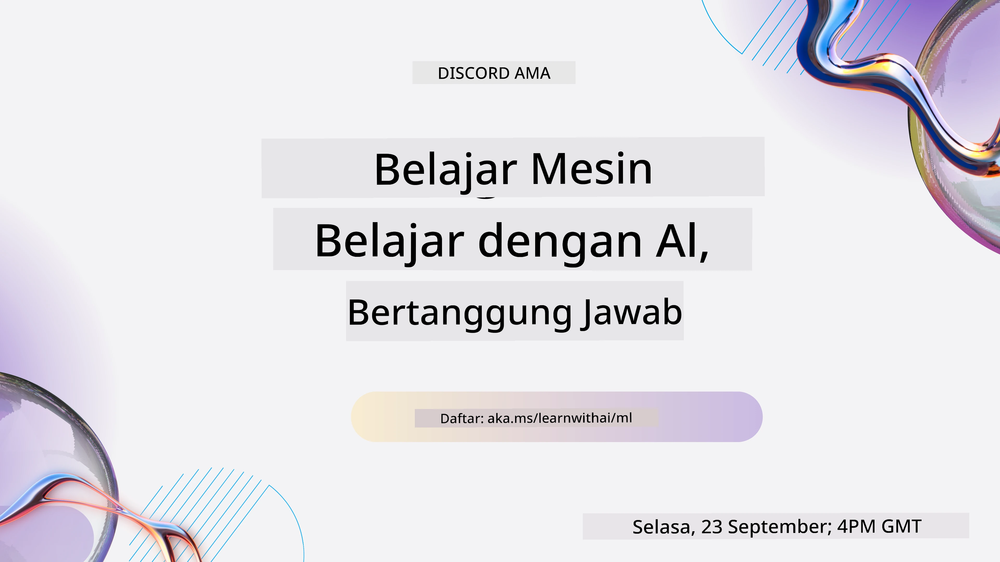
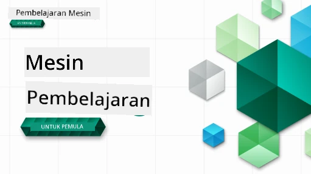

[](https://github.com/microsoft/ML-For-Beginners/blob/master/LICENSE)
[](https://GitHub.com/microsoft/ML-For-Beginners/graphs/contributors/)
[](https://GitHub.com/microsoft/ML-For-Beginners/issues/)
[](https://GitHub.com/microsoft/ML-For-Beginners/pulls/)
[](http://makeapullrequest.com)

[](https://GitHub.com/microsoft/ML-For-Beginners/watchers/)
[](https://GitHub.com/microsoft/ML-For-Beginners/network/)
[](https://GitHub.com/microsoft/ML-For-Beginners/stargazers/)

### 🌐 Dukungan Multi-Bahasa

#### Didukung melalui GitHub Action (Otomatis & Selalu Terbaru)

<!-- CO-OP TRANSLATOR LANGUAGES TABLE START -->
[Arabic](../ar/README.md) | [Bengali](../bn/README.md) | [Bulgarian](../bg/README.md) | [Burmese (Myanmar)](../my/README.md) | [Chinese (Simplified)](../zh-CN/README.md) | [Chinese (Traditional, Hong Kong)](../zh-HK/README.md) | [Chinese (Traditional, Macau)](../zh-MO/README.md) | [Chinese (Traditional, Taiwan)](../zh-TW/README.md) | [Croatian](../hr/README.md) | [Czech](../cs/README.md) | [Danish](../da/README.md) | [Dutch](../nl/README.md) | [Estonian](../et/README.md) | [Finnish](../fi/README.md) | [French](../fr/README.md) | [German](../de/README.md) | [Greek](../el/README.md) | [Hebrew](../he/README.md) | [Hindi](../hi/README.md) | [Hungarian](../hu/README.md) | [Indonesian](./README.md) | [Italian](../it/README.md) | [Japanese](../ja/README.md) | [Kannada](../kn/README.md) | [Khmer](../km/README.md) | [Korean](../ko/README.md) | [Lithuanian](../lt/README.md) | [Malay](../ms/README.md) | [Malayalam](../ml/README.md) | [Marathi](../mr/README.md) | [Nepali](../ne/README.md) | [Nigerian Pidgin](../pcm/README.md) | [Norwegian](../no/README.md) | [Persian (Farsi)](../fa/README.md) | [Polish](../pl/README.md) | [Portuguese (Brazil)](../pt-BR/README.md) | [Portuguese (Portugal)](../pt-PT/README.md) | [Punjabi (Gurmukhi)](../pa/README.md) | [Romanian](../ro/README.md) | [Russian](../ru/README.md) | [Serbian (Cyrillic)](../sr/README.md) | [Slovak](../sk/README.md) | [Slovenian](../sl/README.md) | [Spanish](../es/README.md) | [Swahili](../sw/README.md) | [Swedish](../sv/README.md) | [Tagalog (Filipino)](../tl/README.md) | [Tamil](../ta/README.md) | [Telugu](../te/README.md) | [Thai](../th/README.md) | [Turkish](../tr/README.md) | [Ukrainian](../uk/README.md) | [Urdu](../ur/README.md) | [Vietnamese](../vi/README.md)

> **Lebih Suka Clone Secara Lokal?**
>
> Repositori ini mencakup lebih dari 50 terjemahan bahasa yang secara signifikan meningkatkan ukuran unduhan. Untuk clone tanpa terjemahan, gunakan sparse checkout:
>
> **Bash / macOS / Linux:**
> ```bash
> git clone --filter=blob:none --sparse https://github.com/microsoft/ML-For-Beginners.git
> cd ML-For-Beginners
> git sparse-checkout set --no-cone '/*' '!translations' '!translated_images'
> ```
>
> **CMD (Windows):**
> ```cmd
> git clone --filter=blob:none --sparse https://github.com/microsoft/ML-For-Beginners.git
> cd ML-For-Beginners
> git sparse-checkout set --no-cone "/*" "!translations" "!translated_images"
> ```
>
> Ini memberikan Anda segala yang Anda butuhkan untuk menyelesaikan kursus dengan unduhan yang jauh lebih cepat.
<!-- CO-OP TRANSLATOR LANGUAGES TABLE END -->

#### Bergabung dengan Komunitas Kami

[](https://discord.gg/nTYy5BXMWG)

Kami memiliki seri Discord belajar bersama AI yang sedang berlangsung, pelajari lebih lanjut dan bergabunglah dengan kami di [Learn with AI Series](https://aka.ms/learnwithai/discord) dari tanggal 18 - 30 September, 2025. Anda akan mendapatkan tips dan trik menggunakan GitHub Copilot untuk Data Science.



# Pembelajaran Mesin untuk Pemula - Sebuah Kurikulum

> 🌍 Jelajahi ke seluruh dunia sambil kita mengeksplorasi Pembelajaran Mesin melalui budaya dunia 🌍

Para Pendukung Cloud di Microsoft dengan senang hati menawarkan kurikulum 12 minggu, 26 pelajaran yang semuanya tentang **Pembelajaran Mesin**. Dalam kurikulum ini, Anda akan belajar tentang apa yang kadang disebut **pembelajaran mesin klasik**, menggunakan terutama Scikit-learn sebagai perpustakaan dan menghindari pembelajaran mendalam, yang dibahas dalam [kurikulum AI untuk Pemula](https://aka.ms/ai4beginners) kami. Padukan pelajaran ini dengan kurikulum ['Data Science untuk Pemula'](https://aka.ms/ds4beginners) kami juga!

Jelajahi bersama kami ke seluruh dunia saat kami menerapkan teknik klasik ini ke data dari banyak wilayah dunia. Setiap pelajaran mencakup kuis sebelum dan sesudah pelajaran, instruksi tertulis untuk menyelesaikan pelajaran, solusi, tugas, dan lainnya. Pedagogi berbasis proyek kami memungkinkan Anda belajar sambil membangun, cara yang terbukti agar keterampilan baru tetap melekat.

**✍️ Terima kasih sebesar-besarnya kepada penulis kami** Jen Looper, Stephen Howell, Francesca Lazzeri, Tomomi Imura, Cassie Breviu, Dmitry Soshnikov, Chris Noring, Anirban Mukherjee, Ornella Altunyan, Ruth Yakubu dan Amy Boyd

**🎨 Terima kasih juga kepada ilustrator kami** Tomomi Imura, Dasani Madipalli, dan Jen Looper

**🙏 Terima kasih khusus 🙏 kepada para Microsoft Student Ambassador penulis, reviewer, dan kontributor konten kami**, terutama Rishit Dagli, Muhammad Sakib Khan Inan, Rohan Raj, Alexandru Petrescu, Abhishek Jaiswal, Nawrin Tabassum, Ioan Samuila, dan Snigdha Agarwal

**🤩 Ucapan terima kasih ekstra kepada Microsoft Student Ambassadors Eric Wanjau, Jasleen Sondhi, dan Vidushi Gupta untuk pelajaran R kami!**

# Memulai

Ikuti langkah-langkah ini:
1. **Fork Repositori**: Klik tombol "Fork" di pojok kanan atas halaman ini.
2. **Clone Repositori**:   `git clone https://github.com/microsoft/ML-For-Beginners.git`

> 💡 **Tips Memulai Cepat:** Ingin mulai di browser tanpa mengatur Python secara lokal? Gunakan [GitHub Codespaces](https://github.com/features/codespaces) untuk membuat lingkungan pengembangan cloud untuk fork Anda. Buka menu hijau **Code**, pilih **Codespaces**, dan buat codespace; instal ketergantungan yang dibutuhkan untuk setiap pelajaran di dalamnya sesuai kebutuhan.

> [temukan semua sumber daya tambahan untuk kursus ini dalam koleksi Microsoft Learn kami](https://learn.microsoft.com/en-us/collections/qrqzamz1nn2wx3?WT.mc_id=academic-77952-bethanycheum)

> 🔧 **Perlu bantuan?** Periksa [Panduan Pemecahan Masalah](TROUBLESHOOTING.md) kami untuk solusi masalah umum dengan instalasi, pengaturan, dan menjalankan pelajaran.


**[Para Siswa](https://aka.ms/student-page)**, untuk menggunakan kurikulum ini, fork seluruh repo ke akun GitHub Anda sendiri dan selesaikan latihan sendiri atau dengan kelompok:

- Mulai dengan kuis pra-ceramah.
- Baca ceramah dan selesaikan aktivitas, berhenti dan refleksikan pada setiap pemeriksaan pengetahuan.
- Cobalah membuat proyek dengan memahami pelajarannya daripada menjalankan kode solusi; meskipun kode itu tersedia dalam folder `/solution` di setiap pelajaran berorientasi proyek.
- Ikuti kuis pasca-ceramah.
- Selesaikan tantangan.
- Selesaikan tugas.
- Setelah menyelesaikan kelompok pelajaran, kunjungi [Papan Diskusi](https://github.com/microsoft/ML-For-Beginners/discussions) dan "belajar secara terbuka" dengan mengisi rubrik PAT yang sesuai. 'PAT' adalah Alat Penilaian Kemajuan berupa rubrik yang Anda isi untuk memperdalam pembelajaran Anda. Anda juga dapat merespons PAT lain agar kita bisa belajar bersama.

> Untuk studi lebih lanjut, kami sarankan mengikuti modul dan jalur pembelajaran [Microsoft Learn](https://docs.microsoft.com/en-us/users/jenlooper-2911/collections/k7o7tg1gp306q4?WT.mc_id=academic-77952-leestott) ini.

**Para Guru**, kami telah [menyertakan beberapa saran](for-teachers.md) tentang cara menggunakan kurikulum ini.

---

## Video walkthroughs

Beberapa pelajaran tersedia dalam bentuk video pendek. Anda dapat menemukan semua ini di dalam pelajaran, atau di [playlist ML for Beginners pada kanal YouTube Microsoft Developer](https://aka.ms/ml-beginners-videos) dengan mengklik gambar di bawah.

[](https://aka.ms/ml-beginners-videos)

---

## Meet the Team

[](https://youtu.be/Tj1XWrDSYJU)

**Gif oleh** [Mohit Jaisal](https://linkedin.com/in/mohitjaisal)

> 🎥 Klik gambar di atas untuk video tentang proyek dan orang-orang yang membuatnya!

---

## Pedagogi

Kami memilih dua asas pedagogis saat membangun kurikulum ini: memastikan bahwa ini bersifat hands-on **berbasis proyek** dan mencakup **kuis yang sering**. Selain itu, kurikulum ini memiliki **tema** yang umum agar kohesif.

Dengan memastikan isi selaras dengan proyek, proses dibuat lebih menarik bagi siswa dan retensi konsep akan meningkat. Selain itu, kuis dengan risiko rendah sebelum kelas menetapkan niat siswa untuk mempelajari topik, sementara kuis kedua setelah kelas memastikan retensi lebih jauh. Kurikulum ini dirancang agar fleksibel dan menyenangkan dan dapat diambil secara lengkap atau sebagian. Proyek dimulai kecil dan menjadi semakin kompleks pada akhir siklus 12 minggu. Kurikulum ini juga mencakup posskrip tentang aplikasi nyata ML, yang dapat digunakan sebagai kredit tambahan atau dasar diskusi.

> Temukan [Kode Etik](CODE_OF_CONDUCT.md), [Kontribusi](CONTRIBUTING.md), [Terjemahan](..), dan petunjuk [Pemecahan Masalah](TROUBLESHOOTING.md) kami. Kami menyambut umpan balik konstruktif Anda!

## Setiap pelajaran mencakup

- sketchnote opsional
- video pelengkap opsional
- walkthrough video (beberapa pelajaran saja)
- [kuis pemanasan pra-ceramah](https://ff-quizzes.netlify.app/en/ml/)
- pelajaran tertulis
- untuk pelajaran berbasis proyek, panduan langkah-demi-langkah tentang cara membangun proyek
- pemeriksaan pengetahuan
- tantangan
- bacaan pelengkap
- tugas
- [kuis pasca-ceramah](https://ff-quizzes.netlify.app/en/ml/)

> **Catatan tentang bahasa**: Pelajaran ini terutama ditulis dalam Python, tetapi banyak juga tersedia dalam R. Untuk menyelesaikan pelajaran R, buka folder `/solution` dan cari pelajaran R. Mereka mencakup ekstensi .rmd yang mewakili file **R Markdown** yang dapat didefinisikan sebagai penggabungan `potongan kode` (dari R atau bahasa lain) dan `header YAML` (yang mengatur cara format output seperti PDF) dalam sebuah `dokumen Markdown`. Dengan demikian, ini berfungsi sebagai kerangka kerja penulisan contoh untuk data science karena memungkinkan Anda menggabungkan kode Anda, outputnya, dan pemikiran Anda dengan menuliskannya dalam Markdown. Selain itu, dokumen R Markdown dapat dirender ke format output seperti PDF, HTML, atau Word.

> **Catatan tentang kuis**: Semua kuis terdapat dalam folder [Quiz App](../../quiz-app), dengan total 52 kuis masing-masing berisi tiga pertanyaan. Kuis-kuis tersebut terhubung dari dalam pelajaran tetapi aplikasi kuis dapat dijalankan secara lokal; ikuti instruksi di folder `quiz-app` untuk hosting lokal atau deploy ke Azure.

| Lesson Number |                             Topik                              |                   Pengelompokan Pelajaran                   | Tujuan Pembelajaran                                                                                                             |                                                              Pelajaran Terkait                                                               |                        Penulis                        |
| :-----------: | :------------------------------------------------------------: | :-------------------------------------------------: | ------------------------------------------------------------------------------------------------------------------------------- | :--------------------------------------------------------------------------------------------------------------------------------------: | :--------------------------------------------------: |
|      01       |                Pengantar pembelajaran mesin                   |      [Introduction](1-Introduction/README.md)       | Pelajari konsep dasar di balik pembelajaran mesin                                                                              |                                             [Lesson](1-Introduction/1-intro-to-ML/README.md)                                             |                       Muhammad                       |
|      02       |                Sejarah pembelajaran mesin                      |      [Introduction](1-Introduction/README.md)       | Pelajari sejarah yang mendasari bidang ini                                                                                      |                                            [Lesson](1-Introduction/2-history-of-ML/README.md)                                            |                     Jen dan Amy                      |
|      03       |                 Keadilan dan pembelajaran mesin                |      [Introduction](1-Introduction/README.md)       | Apa isu filosofis penting mengenai keadilan yang harus dipertimbangkan siswa saat membangun dan menerapkan model ML?            |                                              [Lesson](1-Introduction/3-fairness/README.md)                                               |                        Tomomi                        |
|      04       |                Teknik untuk pembelajaran mesin                 |      [Introduction](1-Introduction/README.md)       | Teknik apa yang digunakan peneliti ML untuk membangun model ML?                                                                 |                                          [Lesson](1-Introduction/4-techniques-of-ML/README.md)                                           |                    Chris dan Jen                     |
|      05       |                   Pengantar regresi                            |        [Regression](2-Regression/README.md)         | Mulai menggunakan Python dan Scikit-learn untuk model regresi                                                                   |         [Python](2-Regression/1-Tools/README.md) • [R](../../2-Regression/1-Tools/solution/R/lesson_1.html)         |      Jen • Eric Wanjau       |
|      06       |                Harga labu Amerika Utara 🎃                     |        [Regression](2-Regression/README.md)         | Visualisasikan dan bersihkan data untuk persiapan ML                                                                            |          [Python](2-Regression/2-Data/README.md) • [R](../../2-Regression/2-Data/solution/R/lesson_2.html)          |      Jen • Eric Wanjau       |
|      07       |                Harga labu Amerika Utara 🎃                     |        [Regression](2-Regression/README.md)         | Bangun model regresi linier dan polinomial                                                                                      |        [Python](2-Regression/3-Linear/README.md) • [R](../../2-Regression/3-Linear/solution/R/lesson_3.html)        |      Jen dan Dmitry • Eric Wanjau       |
|      08       |                Harga labu Amerika Utara 🎃                     |        [Regression](2-Regression/README.md)         | Bangun model regresi logistik                                                                                                   |     [Python](2-Regression/4-Logistic/README.md) • [R](../../2-Regression/4-Logistic/solution/R/lesson_4.html)      |      Jen • Eric Wanjau       |
|      09       |                          Aplikasi Web 🔌                        |           [Web App](3-Web-App/README.md)            | Bangun aplikasi web untuk menggunakan model yang sudah dilatih                                                                   |                                                 [Python](3-Web-App/1-Web-App/README.md)                                                  |                         Jen                          |
|      10       |                 Pengantar klasifikasi                          |    [Classification](4-Classification/README.md)     | Bersihkan, siapkan, dan visualisasikan data; pengantar klasifikasi                                                              | [Python](4-Classification/1-Introduction/README.md) • [R](../../4-Classification/1-Introduction/solution/R/lesson_10.html)  | Jen dan Cassie • Eric Wanjau |
|      11       |             Masakan Asia dan India yang lezat 🍜               |    [Classification](4-Classification/README.md)     | Pengantar klasifikasi                                                                                                           | [Python](4-Classification/2-Classifiers-1/README.md) • [R](../../4-Classification/2-Classifiers-1/solution/R/lesson_11.html) | Jen dan Cassie • Eric Wanjau |
|      12       |             Masakan Asia dan India yang lezat 🍜               |    [Classification](4-Classification/README.md)     | Lebih banyak klasifikasi                                                                                                       | [Python](4-Classification/3-Classifiers-2/README.md) • [R](../../4-Classification/3-Classifiers-2/solution/R/lesson_12.html) | Jen dan Cassie • Eric Wanjau |
|      13       |             Masakan Asia dan India yang lezat 🍜               |    [Classification](4-Classification/README.md)     | Bangun aplikasi web rekomendasi menggunakan model Anda                                                                          |                                              [Python](4-Classification/4-Applied/README.md)                                              |                         Jen                          |
|      14       |                   Pengantar pengelompokan                      |        [Clustering](5-Clustering/README.md)         | Bersihkan, siapkan, dan visualisasikan data; pengantar pengelompokan                                                             |         [Python](5-Clustering/1-Visualize/README.md) • [R](../../5-Clustering/1-Visualize/solution/R/lesson_14.html)         |      Jen • Eric Wanjau       |
|      15       |              Menjelajahi selera musik Nigeria 🎧               |        [Clustering](5-Clustering/README.md)         | Jelajahi metode pengelompokan K-Means                                                                                          |           [Python](5-Clustering/2-K-Means/README.md) • [R](../../5-Clustering/2-K-Means/solution/R/lesson_15.html)           |      Jen • Eric Wanjau       |
|      16       |        Pengantar pengolahan bahasa alami ☕️                    |   [Natural language processing](6-NLP/README.md)    | Pelajari dasar-dasar NLP dengan membangun bot sederhana                                                                        |                                             [Python](6-NLP/1-Introduction-to-NLP/README.md)                                              |                       Stephen                        |
|      17       |                      Tugas NLP umum ☕️                         |   [Natural language processing](6-NLP/README.md)    | Perdalam pengetahuan NLP Anda dengan memahami tugas umum yang diperlukan dalam bekerja dengan struktur bahasa                   |                                                    [Python](6-NLP/2-Tasks/README.md)                                                     |                       Stephen                        |
|      18       |             Terjemahan dan analisis sentimen ♥️                |   [Natural language processing](6-NLP/README.md)    | Terjemahan dan analisis sentimen dengan Jane Austen                                                                             |                                            [Python](6-NLP/3-Translation-Sentiment/README.md)                                             |                       Stephen                        |
|      19       |                  Hotel romantis di Eropa ♥️                     |   [Natural language processing](6-NLP/README.md)    | Analisis sentimen dengan ulasan hotel 1                                                                                         |                                               [Python](6-NLP/4-Hotel-Reviews-1/README.md)                                                |                       Stephen                        |
|      20       |                  Hotel romantis di Eropa ♥️                     |   [Natural language processing](6-NLP/README.md)    | Analisis sentimen dengan ulasan hotel 2                                                                                         |                                               [Python](6-NLP/5-Hotel-Reviews-2/README.md)                                                |                       Stephen                        |
|      21       |            Pengantar peramalan deret waktu                     |        [Time series](7-TimeSeries/README.md)        | Pengantar peramalan deret waktu                                                                                                |                                             [Python](7-TimeSeries/1-Introduction/README.md)                                              |                      Francesca                       |
|      22       | ⚡️ Penggunaan Listrik Dunia ⚡️ - peramalan deret waktu dengan ARIMA |        [Time series](7-TimeSeries/README.md)        | Peramalan deret waktu dengan ARIMA                                                                                             |                                                 [Python](7-TimeSeries/2-ARIMA/README.md)                                                 |                      Francesca                       |
|      23       |  ⚡️ Penggunaan Listrik Dunia ⚡️ - peramalan deret waktu dengan SVR  |        [Time series](7-TimeSeries/README.md)        | Peramalan deret waktu dengan Support Vector Regressor                                                                          |                                                  [Python](7-TimeSeries/3-SVR/README.md)                                                  |                       Anirban                        |
|      24       |             Pengantar pembelajaran penguatan                    | [Reinforcement learning](8-Reinforcement/README.md) | Pengantar pembelajaran penguatan dengan Q-Learning                                                                             |                                             [Python](8-Reinforcement/1-QLearning/README.md)                                              |                        Dmitry                        |
|      25       |                 Bantu Peter menghindari serigala! 🐺           | [Reinforcement learning](8-Reinforcement/README.md) | Pembelajaran penguatan Gym                                                                                                      |                                                [Python](8-Reinforcement/2-Gym/README.md)                                                 |                        Dmitry                        |
|  Postscript   |            Studi kasus dan aplikasi ML di dunia nyata           |      [ML in the Wild](9-Real-World/README.md)       | Aplikasi nyata ML klasik yang menarik dan mengungkap                                                                              |                                             [Lesson](9-Real-World/1-Applications/README.md)                                              |                         Team                         |
|  Postscript   |            Debugging model ML menggunakan dasbor RAI           |      [ML in the Wild](9-Real-World/README.md)       | Debugging model dalam Machine Learning menggunakan komponen dasbor Responsible AI                                                  |                                             [Lesson](9-Real-World/2-Debugging-ML-Models/README.md)                                              |                     Ruth Yakubu                      |

> [temukan semua sumber tambahan untuk kursus ini dalam koleksi Microsoft Learn kami](https://learn.microsoft.com/en-us/collections/qrqzamz1nn2wx3?WT.mc_id=academic-77952-bethanycheum)

## Akses offline

Anda dapat menjalankan dokumentasi ini secara offline dengan menggunakan [Docsify](https://docsify.js.org/#/). Fork repositori ini, [pasang Docsify](https://docsify.js.org/#/quickstart) di mesin lokal Anda, lalu di folder root repositori ini, ketik `docsify serve`. Situs web akan dilayani pada port 3000 di localhost Anda: `localhost:3000`.

## PDF

Temukan pdf kurikulum dengan tautan [di sini](https://microsoft.github.io/ML-For-Beginners/pdf/readme.pdf).


## 🎒 Kursus Lainnya 

Tim kami juga membuat kursus lain! Lihat:

<!-- CO-OP TRANSLATOR OTHER COURSES START -->
### LangChain
[](https://aka.ms/langchain4j-for-beginners)
[](https://aka.ms/langchainjs-for-beginners?WT.mc_id=m365-94501-dwahlin)
[](https://github.com/microsoft/langchain-for-beginners?WT.mc_id=m365-94501-dwahlin)
---

### Azure / Edge / MCP / Agen
[](https://github.com/microsoft/AZD-for-beginners?WT.mc_id=academic-105485-koreyst)
[](https://github.com/microsoft/edgeai-for-beginners?WT.mc_id=academic-105485-koreyst)
[](https://github.com/microsoft/mcp-for-beginners?WT.mc_id=academic-105485-koreyst)
[](https://github.com/microsoft/ai-agents-for-beginners?WT.mc_id=academic-105485-koreyst)

---
 
### Seri Generative AI
[](https://github.com/microsoft/generative-ai-for-beginners?WT.mc_id=academic-105485-koreyst)
[-9333EA?style=for-the-badge&labelColor=E5E7EB&color=9333EA)](https://github.com/microsoft/Generative-AI-for-beginners-dotnet?WT.mc_id=academic-105485-koreyst)
[-C084FC?style=for-the-badge&labelColor=E5E7EB&color=C084FC)](https://github.com/microsoft/generative-ai-for-beginners-java?WT.mc_id=academic-105485-koreyst)
[-E879F9?style=for-the-badge&labelColor=E5E7EB&color=E879F9)](https://github.com/microsoft/generative-ai-with-javascript?WT.mc_id=academic-105485-koreyst)

---
 
### Pembelajaran Inti
[](https://aka.ms/ml-beginners?WT.mc_id=academic-105485-koreyst)
[](https://aka.ms/datascience-beginners?WT.mc_id=academic-105485-koreyst)
[](https://aka.ms/ai-beginners?WT.mc_id=academic-105485-koreyst)
[](https://github.com/microsoft/Security-101?WT.mc_id=academic-96948-sayoung)
[](https://aka.ms/webdev-beginners?WT.mc_id=academic-105485-koreyst)
[](https://aka.ms/iot-beginners?WT.mc_id=academic-105485-koreyst)
[](https://github.com/microsoft/xr-development-for-beginners?WT.mc_id=academic-105485-koreyst)

---
 
### Seri Copilot
[](https://aka.ms/GitHubCopilotAI?WT.mc_id=academic-105485-koreyst)
[](https://github.com/microsoft/mastering-github-copilot-for-dotnet-csharp-developers?WT.mc_id=academic-105485-koreyst)
[](https://github.com/microsoft/CopilotAdventures?WT.mc_id=academic-105485-koreyst)
<!-- CO-OP TRANSLATOR OTHER COURSES END -->

## Mendapatkan Bantuan

Jika Anda mengalami kesulitan atau memiliki pertanyaan saat belajar Pembelajaran Mesin atau membangun aplikasi AI, jangan khawatir — bantuan tersedia.

Anda dapat bergabung dalam diskusi dengan pelajar dan pengembang lain, mengajukan pertanyaan, dan berbagi ide dengan komunitas.

- Bergabung dengan komunitas untuk bertanya dan belajar bersama
- Diskusikan konsep dan ide proyek Pembelajaran Mesin
- Dapatkan panduan dari pengembang berpengalaman

Komunitas yang suportif adalah cara yang bagus untuk mengembangkan keterampilan dan menyelesaikan masalah lebih cepat.

[Microsoft Foundry Discord Community](https://discord.gg/nTYy5BXMWG)

Jika Anda menemukan bug, kesalahan, atau memiliki saran untuk perbaikan, Anda juga dapat membuka **Issue** di repositori ini untuk melaporkan masalah.

Untuk umpan balik produk atau mencari posting komunitas yang sudah ada, kunjungi Forum Pengembang:

[](https://aka.ms/foundry/forum)

## Tips Belajar Tambahan

- Tinjau catatan setelah setiap pelajaran untuk pemahaman lebih baik.
- Latih mengimplementasikan algoritma secara mandiri.
- Jelajahi dataset dunia nyata dengan konsep yang sudah dipelajari.

---

<!-- CO-OP TRANSLATOR DISCLAIMER START -->
**Penafian**:
Dokumen ini telah diterjemahkan menggunakan layanan terjemahan AI [Co-op Translator](https://github.com/Azure/co-op-translator). Meskipun kami berupaya untuk mencapai akurasi, harap diketahui bahwa terjemahan otomatis mungkin mengandung kesalahan atau ketidakakuratan. Dokumen asli dalam bahasa aslinya harus dianggap sebagai sumber yang sah. Untuk informasi penting, disarankan menggunakan terjemahan profesional oleh manusia. Kami tidak bertanggung jawab atas kesalahpahaman atau penafsiran yang keliru yang timbul dari penggunaan terjemahan ini.
<!-- CO-OP TRANSLATOR DISCLAIMER END -->