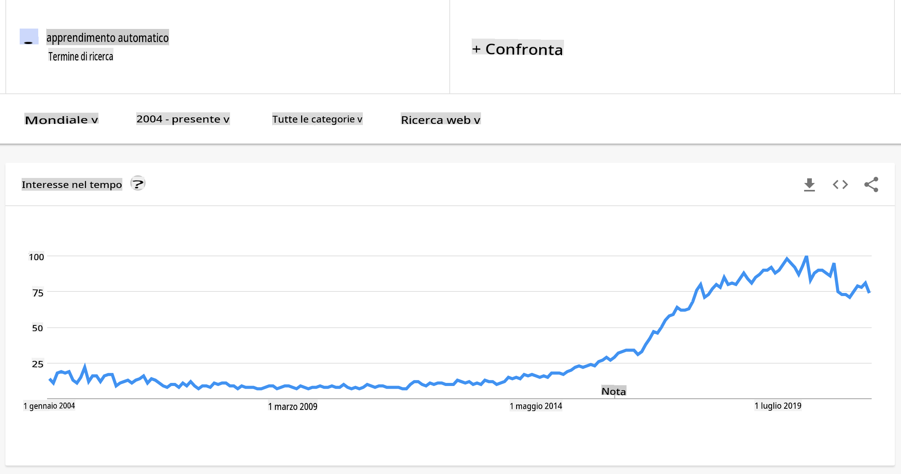

# Introduzione al machine learning

## [Quiz pre-lezione](https://gray-sand-07a10f403.1.azurestaticapps.net/quiz/1/)

---

> 🎥 Clicca sull'immagine sopra per un breve video che esplora questa lezione.

Benvenuto a questo corso sul machine learning classico per principianti! Che tu sia completamente nuovo a questo argomento o un praticante esperto di ML che vuole rinfrescare alcune conoscenze, siamo felici che tu ti unisca a noi! Vogliamo creare un punto di partenza accogliente per il tuo studio del ML e saremmo felici di valutare, rispondere e incorporare i tuoi [feedback](https://github.com/microsoft/ML-For-Beginners/discussions).

> 🎥 Clicca sull'immagine sopra per un video: John Guttag del MIT introduce il machine learning

---
## Iniziare con il machine learning

Prima di iniziare con questo curriculum, è necessario configurare il computer e prepararlo per eseguire notebook localmente.

- **Configura il tuo computer con questi video**. Utilizza i seguenti link per imparare [come installare Python](https://youtu.be/CXZYvNRIAKM) nel tuo sistema e [configurare un editor di testo](https://youtu.be/EU8eayHWoZg) per lo sviluppo.
- **Impara Python**. È anche raccomandato avere una comprensione di base di [Python](https://docs.microsoft.com/learn/paths/python-language/?WT.mc_id=academic-77952-leestott), un linguaggio di programmazione utile per i data scientist che utilizziamo in questo corso.
- **Impara Node.js e JavaScript**. Utilizziamo anche JavaScript alcune volte in questo corso quando costruiamo applicazioni web, quindi sarà necessario avere [node](https://nodejs.org) e [npm](https://www.npmjs.com/) installati, oltre a [Visual Studio Code](https://code.visualstudio.com/) disponibile per lo sviluppo sia in Python che in JavaScript.
- **Crea un account GitHub**. Dato che ci hai trovato qui su [GitHub](https://github.com), potresti già avere un account, ma se non lo hai, creane uno e poi fork questo curriculum per utilizzarlo da solo. (Sentiti libero di darci una stella, 😊)
- **Esplora Scikit-learn**. Familiarizza con [Scikit-learn](https://scikit-learn.org/stable/user_guide.html), un insieme di librerie ML che citiamo in queste lezioni.

---
## Cos'è il machine learning?

Il termine 'machine learning' è uno dei più popolari e frequentemente utilizzati al giorno d'oggi. È molto probabile che tu abbia sentito questo termine almeno una volta se hai una certa familiarità con la tecnologia, indipendentemente dal settore in cui lavori. La meccanica del machine learning, tuttavia, è un mistero per la maggior parte delle persone. Per un principiante del machine learning, l'argomento può a volte sembrare travolgente. Pertanto, è importante capire cosa sia realmente il machine learning e impararlo passo dopo passo, attraverso esempi pratici.

---
## La curva dell'hype

> Google Trends mostra la recente 'curva dell'hype' del termine 'machine learning'

---
## Un universo misterioso

Viviamo in un universo pieno di misteri affascinanti. Grandi scienziati come Stephen Hawking, Albert Einstein e molti altri hanno dedicato la loro vita alla ricerca di informazioni significative che svelino i misteri del mondo che ci circonda. Questa è la condizione umana dell'apprendimento: un bambino umano impara nuove cose e scopre la struttura del suo mondo anno dopo anno mentre cresce fino all'età adulta.

---
## Il cervello del bambino

Il cervello e i sensi di un bambino percepiscono i fatti del loro ambiente e gradualmente apprendono i modelli nascosti della vita che aiutano il bambino a creare regole logiche per identificare i modelli appresi. Il processo di apprendimento del cervello umano rende gli esseri umani la creatura vivente più sofisticata di questo mondo. Imparare continuamente scoprendo modelli nascosti e poi innovando su quei modelli ci permette di migliorare sempre di più nel corso della nostra vita. Questa capacità di apprendimento e capacità di evoluzione è correlata a un concetto chiamato [plasticità cerebrale](https://www.simplypsychology.org/brain-plasticity.html). Superficialmente, possiamo tracciare alcune somiglianze motivazionali tra il processo di apprendimento del cervello umano e i concetti del machine learning.

---
## Il cervello umano

Il [cervello umano](https://www.livescience.com/29365-human-brain.html) percepisce le cose dal mondo reale, elabora le informazioni percepite, prende decisioni razionali e compie determinate azioni in base alle circostanze. Questo è ciò che chiamiamo comportarsi in modo intelligente. Quando programmiamo una copia del processo comportamentale intelligente su una macchina, viene chiamata intelligenza artificiale (AI).

---
## Alcuni termini

Sebbene i termini possano essere confusi, il machine learning (ML) è un sottoinsieme importante dell'intelligenza artificiale. **ML si occupa di utilizzare algoritmi specializzati per scoprire informazioni significative e trovare modelli nascosti dai dati percepiti per corroborare il processo decisionale razionale**.

---
## AI, ML, Deep Learning

> Un diagramma che mostra le relazioni tra AI, ML, deep learning e data science. Infografica di [Jen Looper](https://twitter.com/jenlooper) ispirata da [questa grafica](https://softwareengineering.stackexchange.com/questions/366996/distinction-between-ai-ml-neural-networks-deep-learning-and-data-mining)

---
## Concetti da coprire

In questo curriculum, copriremo solo i concetti fondamentali del machine learning che un principiante deve conoscere. Copriamo ciò che chiamiamo 'machine learning classico' utilizzando principalmente Scikit-learn, un'ottima libreria che molti studenti utilizzano per imparare le basi. Per comprendere concetti più ampi di intelligenza artificiale o deep learning, è indispensabile una solida conoscenza fondamentale del machine learning, e quindi vorremmo offrirla qui.

---
## In questo corso imparerai:

- concetti fondamentali del machine learning
- la storia del ML
- ML e equità
- tecniche di regressione ML
- tecniche di classificazione ML
- tecniche di clustering ML
- tecniche di elaborazione del linguaggio naturale ML
- tecniche di previsione delle serie temporali ML
- apprendimento per rinforzo
- applicazioni reali per ML

---
## Cosa non copriremo

- deep learning
- reti neurali
- AI

Per migliorare l'esperienza di apprendimento, eviteremo le complessità delle reti neurali, del 'deep learning' - costruzione di modelli a più strati utilizzando reti neurali - e dell'AI, che discuteremo in un curriculum diverso. Offriremo anche un prossimo curriculum di data science per concentrarci su quell'aspetto di questo campo più ampio.

---
## Perché studiare il machine learning?

Il machine learning, da una prospettiva di sistemi, è definito come la creazione di sistemi automatizzati che possono apprendere modelli nascosti dai dati per aiutare a prendere decisioni intelligenti.

Questa motivazione è vagamente ispirata da come il cervello umano apprende certe cose basate sui dati che percepisce dal mondo esterno.

✅ Pensa per un minuto perché un'azienda vorrebbe provare a utilizzare strategie di machine learning rispetto a creare un motore basato su regole codificate.

---
## Applicazioni del machine learning

Le applicazioni del machine learning sono ora quasi ovunque e sono tanto onnipresenti quanto i dati che fluiscono nelle nostre società, generati dai nostri smartphone, dispositivi connessi e altri sistemi. Considerando l'immenso potenziale degli algoritmi di machine learning all'avanguardia, i ricercatori hanno esplorato la loro capacità di risolvere problemi reali multidimensionali e multidisciplinari con grandi risultati positivi.

---
## Esempi di ML applicato

**Puoi utilizzare il machine learning in molti modi**:

- Per prevedere la probabilità di una malattia dalla storia medica di un paziente o dai rapporti.
- Per sfruttare i dati meteorologici per prevedere eventi meteorologici.
- Per comprendere il sentimento di un testo.
- Per rilevare notizie false per fermare la diffusione della propaganda.

Finanza, economia, scienze della terra, esplorazione spaziale, ingegneria biomedica, scienze cognitive e persino campi nelle scienze umane hanno adattato il machine learning per risolvere i problemi ardui e pesanti di elaborazione dei dati del loro settore.

---
## Conclusione

Il machine learning automatizza il processo di scoperta dei modelli trovando intuizioni significative dai dati reali o generati. Si è dimostrato altamente prezioso in applicazioni aziendali, sanitarie e finanziarie, tra le altre.

Nel prossimo futuro, comprendere le basi del machine learning sarà un must per le persone di qualsiasi settore a causa della sua adozione diffusa.

---
# 🚀 Sfida

Disegna, su carta o utilizzando un'app online come [Excalidraw](https://excalidraw.com/), la tua comprensione delle differenze tra AI, ML, deep learning e data science. Aggiungi alcune idee sui problemi che ciascuna di queste tecniche è brava a risolvere.

# [Quiz post-lezione](https://gray-sand-07a10f403.1.azurestaticapps.net/quiz/2/)

---
# Revisione & Studio Autonomo

Per saperne di più su come puoi lavorare con gli algoritmi ML nel cloud, segui questo [Percorso di Apprendimento](https://docs.microsoft.com/learn/paths/create-no-code-predictive-models-azure-machine-learning/?WT.mc_id=academic-77952-leestott).

Segui un [Percorso di Apprendimento](https://docs.microsoft.com/learn/modules/introduction-to-machine-learning/?WT.mc_id=academic-77952-leestott) sui fondamenti del ML.

---
# Compito

[Inizia a lavorare](assignment.md)

**Disclaimer**: 
Questo documento è stato tradotto utilizzando servizi di traduzione automatizzata basati su intelligenza artificiale. Sebbene ci impegniamo per l'accuratezza, si prega di notare che le traduzioni automatiche possono contenere errori o imprecisioni. Il documento originale nella sua lingua nativa dovrebbe essere considerato la fonte autorevole. Per informazioni critiche, si raccomanda una traduzione professionale umana. Non siamo responsabili per eventuali malintesi o interpretazioni errate derivanti dall'uso di questa traduzione.