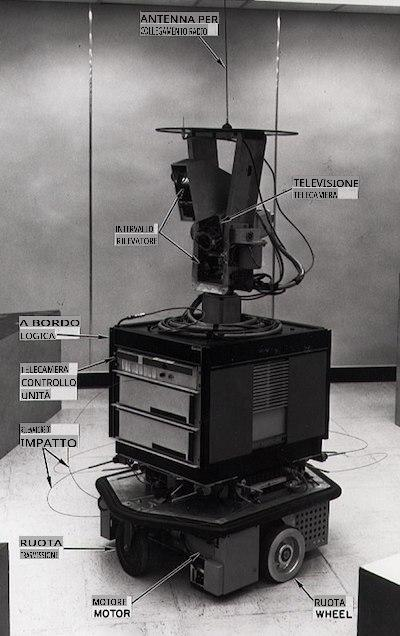
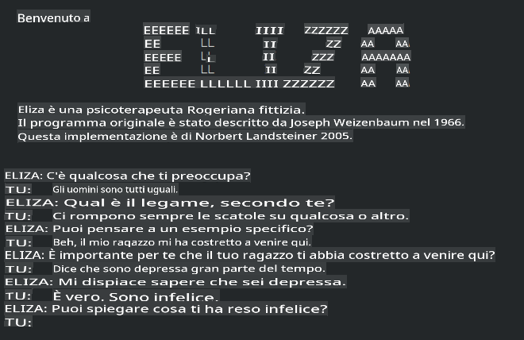

# Storia del machine learning

> Schizzo di [Tomomi Imura](https://www.twitter.com/girlie_mac)

## [Quiz pre-lezione](https://gray-sand-07a10f403.1.azurestaticapps.net/quiz/3/)

---

> 🎥 Clicca sull'immagine qui sopra per un breve video su questa lezione.

In questa lezione, passeremo in rassegna i principali traguardi nella storia del machine learning e dell'intelligenza artificiale.

La storia dell'intelligenza artificiale (AI) come campo è intrecciata con la storia del machine learning, poiché gli algoritmi e i progressi computazionali che sostengono il ML hanno alimentato lo sviluppo dell'AI. È utile ricordare che, sebbene questi campi come aree di indagine distinte abbiano iniziato a cristallizzarsi negli anni '50, importanti [scoperte algoritmiche, statistiche, matematiche, computazionali e tecniche](https://wikipedia.org/wiki/Timeline_of_machine_learning) hanno preceduto e si sono sovrapposte a questa era. In effetti, le persone hanno pensato a queste domande per [centinaia di anni](https://wikipedia.org/wiki/History_of_artificial_intelligence): questo articolo discute le basi intellettuali storiche dell'idea di una 'macchina pensante'.

---
## Scoperte notevoli

- 1763, 1812 [Teorema di Bayes](https://wikipedia.org/wiki/Bayes%27_theorem) e i suoi predecessori. Questo teorema e le sue applicazioni sono alla base dell'inferenza, descrivendo la probabilità che un evento si verifichi basandosi su conoscenze pregresse.
- 1805 [Teoria dei minimi quadrati](https://wikipedia.org/wiki/Least_squares) del matematico francese Adrien-Marie Legendre. Questa teoria, che imparerai nella nostra unità sulla Regressione, aiuta nell'adattamento dei dati.
- 1913 [Catene di Markov](https://wikipedia.org/wiki/Markov_chain), chiamate così in onore del matematico russo Andrey Markov, vengono utilizzate per descrivere una sequenza di eventi possibili basati su uno stato precedente.
- 1957 [Perceptron](https://wikipedia.org/wiki/Perceptron) è un tipo di classificatore lineare inventato dallo psicologo americano Frank Rosenblatt che è alla base dei progressi nel deep learning.

---

- 1967 [Nearest Neighbor](https://wikipedia.org/wiki/Nearest_neighbor) è un algoritmo originariamente progettato per mappare percorsi. In un contesto ML viene utilizzato per rilevare modelli.
- 1970 [Backpropagation](https://wikipedia.org/wiki/Backpropagation) viene utilizzato per addestrare le [reti neurali feedforward](https://wikipedia.org/wiki/Feedforward_neural_network).
- 1982 [Reti Neurali Ricorrenti](https://wikipedia.org/wiki/Recurrent_neural_network) sono reti neurali artificiali derivate dalle reti neurali feedforward che creano grafici temporali.

✅ Fai una piccola ricerca. Quali altre date si distinguono come fondamentali nella storia del ML e dell'AI?

---
## 1950: Macchine che pensano

Alan Turing, una persona davvero straordinaria che è stata votata [dal pubblico nel 2019](https://wikipedia.org/wiki/Icons:_The_Greatest_Person_of_the_20th_Century) come il più grande scienziato del XX secolo, è accreditato di aver contribuito a gettare le basi per il concetto di 'macchina che può pensare'. Ha lottato con i detrattori e con il proprio bisogno di prove empiriche di questo concetto in parte creando il [Test di Turing](https://www.bbc.com/news/technology-18475646), che esplorerai nelle nostre lezioni di NLP.

---
## 1956: Progetto di ricerca estivo di Dartmouth

"Il Progetto di ricerca estivo di Dartmouth sull'intelligenza artificiale è stato un evento fondamentale per l'intelligenza artificiale come campo," ed è stato qui che il termine 'intelligenza artificiale' è stato coniato ([fonte](https://250.dartmouth.edu/highlights/artificial-intelligence-ai-coined-dartmouth)).

> Ogni aspetto dell'apprendimento o di qualsiasi altra caratteristica dell'intelligenza può, in linea di principio, essere descritto così precisamente che una macchina può essere costruita per simularlo.

---

Il ricercatore principale, il professore di matematica John McCarthy, sperava "di procedere sulla base dell'ipotesi che ogni aspetto dell'apprendimento o di qualsiasi altra caratteristica dell'intelligenza possa, in linea di principio, essere descritto così precisamente che una macchina può essere costruita per simularlo." I partecipanti includevano un'altra luminare nel campo, Marvin Minsky.

Il workshop è accreditato di aver avviato e incoraggiato diverse discussioni, tra cui "l'ascesa dei metodi simbolici, sistemi focalizzati su domini limitati (primi sistemi esperti) e sistemi deduttivi contro sistemi induttivi." ([fonte](https://wikipedia.org/wiki/Dartmouth_workshop)).

---
## 1956 - 1974: "Gli anni d'oro"

Dagli anni '50 fino alla metà degli anni '70, l'ottimismo era alto nella speranza che l'AI potesse risolvere molti problemi. Nel 1967, Marvin Minsky affermava con sicurezza che "Entro una generazione ... il problema di creare 'intelligenza artificiale' sarà sostanzialmente risolto." (Minsky, Marvin (1967), Computation: Finite and Infinite Machines, Englewood Cliffs, N.J.: Prentice-Hall)

la ricerca sul natural language processing fiorì, la ricerca fu perfezionata e resa più potente, e fu creato il concetto di 'micro-mondi', dove compiti semplici venivano completati usando istruzioni in linguaggio naturale.

---

La ricerca era ben finanziata da agenzie governative, si fecero progressi nel calcolo e negli algoritmi, e furono costruiti prototipi di macchine intelligenti. Alcune di queste macchine includono:

* [Shakey il robot](https://wikipedia.org/wiki/Shakey_the_robot), che poteva manovrare e decidere come eseguire i compiti 'intelligentemente'.

    
    > Shakey nel 1972

---

* Eliza, un primo 'chatterbot', poteva conversare con le persone e agire come un primitivo 'terapeuta'. Imparerai di più su Eliza nelle lezioni di NLP.

    
    > Una versione di Eliza, un chatbot

---

* "Blocks world" era un esempio di micro-mondo dove i blocchi potevano essere impilati e ordinati, e si potevano testare esperimenti nell'insegnare alle macchine a prendere decisioni. I progressi costruiti con librerie come [SHRDLU](https://wikipedia.org/wiki/SHRDLU) hanno aiutato a spingere avanti l'elaborazione del linguaggio.

    

    > 🎥 Clicca sull'immagine qui sopra per un video: Blocks world con SHRDLU

---
## 1974 - 1980: "AI Winter"

Entro la metà degli anni '70, era diventato evidente che la complessità di creare 'macchine intelligenti' era stata sottovalutata e che la sua promessa, data la potenza di calcolo disponibile, era stata sopravvalutata. I finanziamenti si prosciugarono e la fiducia nel campo rallentò. Alcuni problemi che hanno influenzato la fiducia includevano:
---
- **Limitazioni**. La potenza di calcolo era troppo limitata.
- **Esplosione combinatoria**. La quantità di parametri che dovevano essere addestrati cresceva esponenzialmente man mano che si chiedeva di più ai computer, senza un'evoluzione parallela della potenza di calcolo e delle capacità.
- **Scarsità di dati**. C'era una scarsità di dati che ostacolava il processo di test, sviluppo e raffinamento degli algoritmi.
- **Stiamo facendo le domande giuste?**. Le stesse domande che venivano poste cominciarono a essere messe in discussione. I ricercatori iniziarono a ricevere critiche sui loro approcci:
  - I test di Turing furono messi in discussione tramite, tra le altre idee, la 'teoria della stanza cinese' che postulava che, "programmare un computer digitale può farlo apparire come se comprendesse il linguaggio ma non potrebbe produrre una vera comprensione." ([fonte](https://plato.stanford.edu/entries/chinese-room/))
  - L'etica dell'introduzione di intelligenze artificiali come il "terapeuta" ELIZA nella società fu messa in discussione.

---

Allo stesso tempo, varie scuole di pensiero sull'AI cominciarono a formarsi. Si stabilì una dicotomia tra le pratiche ["scruffy" e "neat AI"](https://wikipedia.org/wiki/Neats_and_scruffies). I laboratori _scruffy_ modificavano i programmi per ore fino a ottenere i risultati desiderati. I laboratori _neat_ "si concentravano sulla logica e sulla risoluzione formale dei problemi". ELIZA e SHRDLU erano sistemi _scruffy_ ben noti. Negli anni '80, con l'emergere della domanda di rendere i sistemi ML riproducibili, l'approccio _neat_ prese gradualmente il sopravvento poiché i suoi risultati sono più spiegabili.

---
## Sistemi esperti degli anni '80

Man mano che il campo cresceva, il suo beneficio per il business diventava più chiaro, e negli anni '80 proliferarono i 'sistemi esperti'. "I sistemi esperti furono tra le prime forme di software di intelligenza artificiale (AI) veramente di successo." ([fonte](https://wikipedia.org/wiki/Expert_system)).

Questo tipo di sistema è in realtà _ibrido_, costituito in parte da un motore di regole che definisce i requisiti aziendali, e un motore di inferenza che sfruttava il sistema di regole per dedurre nuovi fatti.

Quest'era vide anche una crescente attenzione rivolta alle reti neurali.

---
## 1987 - 1993: "Chill" dell'AI

La proliferazione dell'hardware specializzato dei sistemi esperti ebbe l'effetto sfortunato di diventare troppo specializzata. L'ascesa dei personal computer competeva anche con questi grandi, specializzati, sistemi centralizzati. La democratizzazione del calcolo era iniziata, e alla fine spianò la strada all'esplosione moderna dei big data.

---
## 1993 - 2011

Quest'epoca vide una nuova era per il ML e l'AI per poter risolvere alcuni dei problemi che erano stati causati in precedenza dalla mancanza di dati e potenza di calcolo. La quantità di dati iniziò a crescere rapidamente e a diventare più ampiamente disponibile, nel bene e nel male, soprattutto con l'avvento dello smartphone intorno al 2007. La potenza di calcolo si espanse esponenzialmente, e gli algoritmi si evolvettero di pari passo. Il campo iniziò a maturare man mano che i giorni liberi del passato cominciarono a cristallizzarsi in una vera disciplina.

---
## Oggi

Oggi il machine learning e l'AI toccano quasi ogni parte delle nostre vite. Quest'era richiede una comprensione attenta dei rischi e degli effetti potenziali di questi algoritmi sulle vite umane. Come ha affermato Brad Smith di Microsoft, "La tecnologia dell'informazione solleva questioni che vanno al cuore delle protezioni fondamentali dei diritti umani come la privacy e la libertà di espressione. Queste questioni aumentano la responsabilità delle aziende tecnologiche che creano questi prodotti. A nostro avviso, richiedono anche una regolamentazione governativa ponderata e lo sviluppo di norme sull'uso accettabile" ([fonte](https://www.technologyreview.com/2019/12/18/102365/the-future-of-ais-impact-on-society/)).

---

Resta da vedere cosa riserva il futuro, ma è importante comprendere questi sistemi informatici e il software e gli algoritmi che eseguono. Speriamo che questo curriculum ti aiuti a ottenere una migliore comprensione in modo che tu possa decidere da solo.

> 🎥 Clicca sull'immagine qui sopra per un video: Yann LeCun discute la storia del deep learning in questa lezione

---
## 🚀Sfida

Approfondisci uno di questi momenti storici e scopri di più sulle persone dietro di essi. Ci sono personaggi affascinanti, e nessuna scoperta scientifica è mai stata creata in un vuoto culturale. Cosa scopri?

## [Quiz post-lezione](https://gray-sand-07a10f403.1.azurestaticapps.net/quiz/4/)

---
## Revisione e studio autonomo

Ecco alcuni elementi da guardare e ascoltare:

[Questo podcast dove Amy Boyd discute l'evoluzione dell'AI](http://runasradio.com/Shows/Show/739)

---

## Compito

[Crea una timeline](assignment.md)

**Disclaimer**: 
Questo documento è stato tradotto utilizzando servizi di traduzione automatica basati su AI. Sebbene ci sforziamo di garantire l'accuratezza, si prega di essere consapevoli che le traduzioni automatiche possono contenere errori o imprecisioni. Il documento originale nella sua lingua nativa dovrebbe essere considerato la fonte autorevole. Per informazioni critiche, si raccomanda una traduzione professionale umana. Non siamo responsabili per eventuali malintesi o interpretazioni errate derivanti dall'uso di questa traduzione.