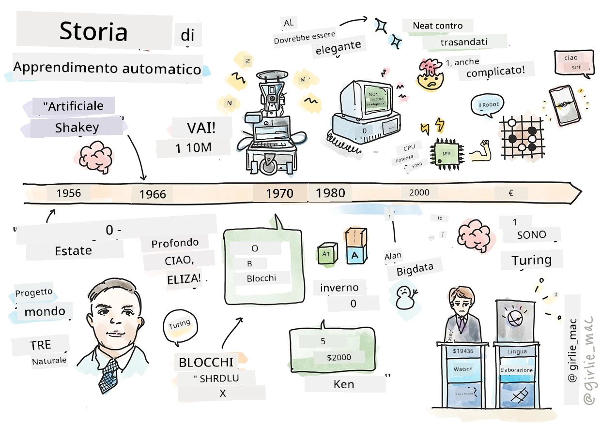
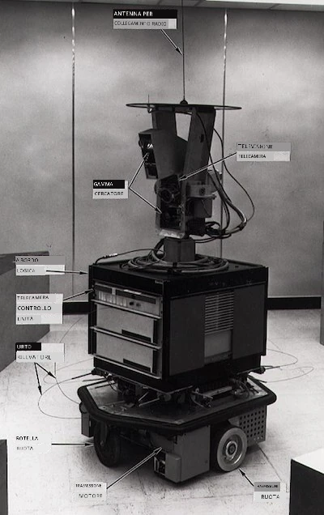
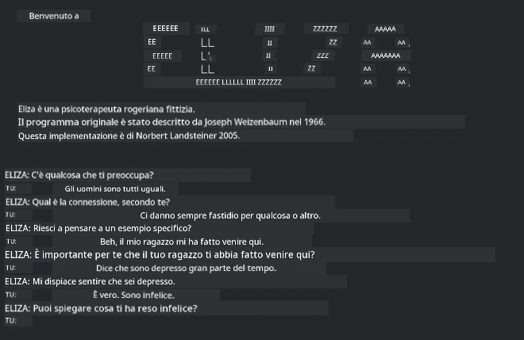

# Storia dell'apprendimento automatico

> Sketchnote di [Tomomi Imura](https://www.twitter.com/girlie_mac)

## [Quiz pre-lezione](https://ff-quizzes.netlify.app/en/ml/)

---

> 🎥 Clicca sull'immagine sopra per un breve video che percorre questa lezione.

In questa lezione, attraverseremo le tappe principali della storia dell'apprendimento automatico e dell'intelligenza artificiale.

La storia dell'intelligenza artificiale (IA) come campo è intrecciata con la storia dell'apprendimento automatico, poiché gli algoritmi e i progressi computazionali che supportano ML hanno contribuito allo sviluppo dell'IA. È utile ricordare che, mentre questi campi come ambiti distinti di indagine iniziarono a cristallizzarsi negli anni '50, importanti [scoperte algoritmiche, statistiche, matematiche, computazionali e tecniche](https://wikipedia.org/wiki/Timeline_of_machine_learning) precedettero e si sovrapposero a quest'epoca. Infatti, le persone hanno riflettuto su queste questioni per [centinaia di anni](https://wikipedia.org/wiki/History_of_artificial_intelligence): questo articolo discute i fondamenti intellettuali storici dell'idea di una 'macchina pensante.'

---
## Scoperte notevoli

- 1763, 1812 [Teorema di Bayes](https://wikipedia.org/wiki/Bayes%27_theorem) e i suoi predecessori. Questo teorema e le sue applicazioni costituiscono la base dell'inferenza, descrivendo la probabilità che un evento si verifichi basandosi su conoscenze precedenti.
- 1805 [Teoria dei minimi quadrati](https://wikipedia.org/wiki/Least_squares) del matematico francese Adrien-Marie Legendre. Questa teoria, che apprenderai nella nostra unità di regressione, aiuta nell'adattamento dei dati.
- 1913 [Catene di Markov](https://wikipedia.org/wiki/Markov_chain), denominate dal matematico russo Andrey Markov, sono utilizzate per descrivere una sequenza di eventi possibili basata su uno stato precedente.
- 1957 [Perceptron](https://wikipedia.org/wiki/Perceptron) è un tipo di classificatore lineare inventato dallo psicologo americano Frank Rosenblatt che è alla base dei progressi nel deep learning.

---

- 1967 [Nearest Neighbor](https://wikipedia.org/wiki/Nearest_neighbor) è un algoritmo originariamente progettato per mappare rotte. Nel contesto di ML è usato per rilevare pattern.
- 1970 [Backpropagation](https://wikipedia.org/wiki/Backpropagation) è usato per addestrare [reti neurali feedforward](https://wikipedia.org/wiki/Feedforward_neural_network).
- 1982 [Reti neurali ricorrenti](https://wikipedia.org/wiki/Recurrent_neural_network) sono reti neurali artificiali derivate dalle reti neurali feedforward che creano grafi temporali.

✅ Fai un po' di ricerca. Quali altre date si distinguono come fondamentali nella storia di ML e AI?

---
## 1950: Macchine che pensano

Alan Turing, una persona veramente straordinaria che è stata votata [dal pubblico nel 2019](https://wikipedia.org/wiki/Icons:_The_Greatest_Person_of_the_20th_Century) come il più grande scienziato del XX secolo, è accreditato per aver contribuito a gettare le basi del concetto di una 'macchina che può pensare.' Ha affrontato gli scettici e la propria necessità di prove empiriche di questo concetto in parte creando il [Test di Turing](https://www.bbc.com/news/technology-18475646), che esplorerai nelle nostre lezioni di NLP.

---
## 1956: Progetto di ricerca estivo di Dartmouth

"Il Progetto di ricerca estivo di Dartmouth sull’intelligenza artificiale fu un evento fondamentale per l'intelligenza artificiale come campo," ed è qui che fu coniato il termine 'intelligenza artificiale' ([fonte](https://250.dartmouth.edu/highlights/artificial-intelligence-ai-coined-dartmouth)).

> Ogni aspetto dell'apprendimento o qualsiasi altra caratteristica dell'intelligenza può in principio essere così precisamente descritto che una macchina può essere fatta per simularlo.

---

Il ricercatore principale, il professore di matematica John McCarthy, sperava "di procedere sulla base della congettura che ogni aspetto dell'apprendimento o qualsiasi altra caratteristica dell'intelligenza possa in principio essere così precisamente descritto che una macchina possa essere fatta per simularlo." Tra i partecipanti c'era un altro luminare nel campo, Marvin Minsky.

All'officina si attribuisce il merito di aver avviato e incoraggiato varie discussioni, inclusi "l'ascesa dei metodi simbolici, sistemi focalizzati su domini limitati (primi sistemi esperti), e sistemi deduttivi contro sistemi induttivi." ([fonte](https://wikipedia.org/wiki/Dartmouth_workshop)).

---
## 1956 - 1974: "Gli anni d'oro"

Dagli anni '50 fino alla metà degli anni '70, l'ottimismo era alto nell'aspettativa che l'IA potesse risolvere molti problemi. Nel 1967, Marvin Minsky affermava con fiducia che "Entro una generazione ... il problema di creare 'intelligenza artificiale' sarà sostanzialmente risolto." (Minsky, Marvin (1967), Computation: Finite and Infinite Machines, Englewood Cliffs, N.J.: Prentice-Hall)

La ricerca in elaborazione del linguaggio naturale fiorì, la ricerca venne perfezionata e resa più potente, e il concetto di 'micro-mondi' fu creato, dove semplici compiti venivano completati usando istruzioni in linguaggio comune.

---

La ricerca fu ben finanziata da enti governativi, si fecero progressi nel calcolo e negli algoritmi, e furono realizzati prototipi di macchine intelligenti. Alcune di queste macchine includono:

* [Shakey il robot](https://wikipedia.org/wiki/Shakey_the_robot), che poteva manovrare e decidere come eseguire i compiti in modo 'intelligente'.

    
    > Shakey nel 1972

---

* Eliza, un primo 'chatterbot', poteva conversare con le persone e agire come una 'terapeuta' primitiva. Imparerai di più su Eliza nelle lezioni di NLP.

    
    > Una versione di Eliza, un chatbot

---

* "Blocks world" era un esempio di micro-mondo dove i blocchi potevano essere impilati e ordinati, e si potevano testare esperimenti nell’insegnare alle macchine a prendere decisioni. I progressi costruiti con librerie come [SHRDLU](https://wikipedia.org/wiki/SHRDLU) aiutarono a far progredire l'elaborazione del linguaggio.

    

    > 🎥 Clicca sull'immagine sopra per un video: Blocks world con SHRDLU

---
## 1974 - 1980: "Inverno dell'IA"

A metà degli anni '70 era diventato evidente che la complessità nel creare 'macchine intelligenti' era stata sottovalutata e che le promesse, dato il potere di calcolo disponibile, erano state esagerate. I finanziamenti si prosciugarono e la fiducia nel campo rallentò. Alcuni problemi che influirono sulla fiducia includevano:
---
- **Limitazioni**. Il potere computazionale era troppo limitato.
- **Esplosione combinatoria**. La quantità di parametri da addestrare cresceva esponenzialmente man mano che si chiedeva di più ai computer, senza un'evoluzione parallela del potere e della capacità computazionale.
- **Poca disponibilità di dati**. La scarsità di dati ostacolava il processo di test, sviluppo e perfezionamento degli algoritmi.
- **Stiamo facendo le domande giuste?**. Le stesse domande poste iniziarono a essere messe in dubbio. I ricercatori iniziarono a ricevere critiche riguardo ai loro approcci:
  - Il Test di Turing venne messo in discussione tramite, tra le altre idee, la 'teoria della stanza cinese' che asseriva che "programmare un computer digitale può far sembrare che comprenda il linguaggio ma non può produrre una vera comprensione." ([fonte](https://plato.stanford.edu/entries/chinese-room/))
  - Vennero sfidate le questioni etiche legate all'introduzione di intelligenze artificiali come la "terapeuta" ELIZA nella società.

---

Nello stesso periodo, iniziarono a formarsi varie scuole di pensiero sull'IA. Si stabilì una dicotomia tra pratiche ["scruffy" vs. "neat AI"](https://wikipedia.org/wiki/Neats_and_scruffies). I laboratori _scruffy_ modificavano programmi per ore fino a ottenere i risultati desiderati. I laboratori _neat_ "si concentravano sulla logica e sulla risoluzione formale dei problemi". ELIZA e SHRDLU erano sistemi _scruffy_ ben noti. Negli anni '80, con la crescente domanda di rendere riproducibili i sistemi ML, l'approccio _neat_ prese gradualmente il sopravvento poiché fornisce risultati più spiegabili.

---
## Anni '80 Sistemi esperti

Con la crescita del campo, divenne più chiaro il suo beneficio per il business, e negli anni '80 si diffuse la proliferazione dei 'sistemi esperti'. "I sistemi esperti furono tra le prime forme veramente di successo di software di intelligenza artificiale (IA)." ([fonte](https://wikipedia.org/wiki/Expert_system)).

Questo tipo di sistema è in realtà _ibrido_, composto parzialmente da un motore di regole che definisce i requisiti aziendali, e un motore di inferenza che sfrutta il sistema di regole per dedurre nuovi fatti.

In questa epoca venne anche posta crescente attenzione sulle reti neurali.

---
## 1987 - 1993: 'Pausa' dell'IA

La proliferazione di hardware specializzato per sistemi esperti ebbe l'effetto sfortunato di diventare troppo specializzato. L'ascesa dei personal computer competeva anche con questi grandi sistemi centralizzati e specializzati. La democratizzazione del computing era iniziata, preparando la strada all'esplosione moderna dei big data.

---
## 1993 - 2011

Questa epoca ha visto una nuova era per ML e IA per poter risolvere alcuni dei problemi causati in precedenza dalla mancanza di dati e potere computazionale. La quantità di dati iniziò a crescere rapidamente e a diventare più ampiamente disponibile, in bene e in male, soprattutto con l'avvento dello smartphone intorno al 2007. Il potere computazionale si espanse in modo esponenziale e gli algoritmi si evolsero di conseguenza. Il campo iniziò a maturare mentre i giorni spensierati del passato iniziarono a cristallizzarsi in una vera disciplina.

---
## Adesso

Oggi l'apprendimento automatico e l'IA toccano quasi ogni parte della nostra vita. Questa era richiede una comprensione attenta dei rischi e dei potenziali effetti di questi algoritmi sulle vite umane. Come ha affermato Brad Smith di Microsoft, "La tecnologia dell'informazione solleva questioni che vanno al cuore delle protezioni fondamentali dei diritti umani come la privacy e la libertà di espressione. Queste questioni aumentano la responsabilità delle aziende tecnologiche che creano questi prodotti. A nostro avviso, richiedono anche una regolamentazione governativa ponderata e lo sviluppo di norme sugli usi accettabili" ([fonte](https://www.technologyreview.com/2019/12/18/102365/the-future-of-ais-impact-on-society/)).

---

Resta da vedere cosa riserva il futuro, ma è importante comprendere questi sistemi informatici e il software e gli algoritmi che eseguono. Speriamo che questo curriculum ti aiuti a ottenere una migliore comprensione così da poter decidere per te stesso.

> 🎥 Clicca sull'immagine sopra per un video: Yann LeCun discute la storia del deep learning in questa lezione

---
## 🚀Sfida

Approfondisci uno di questi momenti storici e scopri di più sulle persone dietro di essi. Ci sono personaggi affascinanti, e nessuna scoperta scientifica è mai stata creata in un vuoto culturale. Cosa scopri?

## [Quiz post-lezione](https://ff-quizzes.netlify.app/en/ml/)

---
## Ripasso & Studio autonomo

Ecco alcuni elementi da guardare e ascoltare:

[Questo podcast in cui Amy Boyd discute l'evoluzione dell'IA](http://runasradio.com/Shows/Show/739)

---

## Compito

[Crea una timeline](assignment.md)

---

<!-- CO-OP TRANSLATOR DISCLAIMER START -->
**Disclaimer**:
Questo documento è stato tradotto utilizzando il servizio di traduzione AI [Co-op Translator](https://github.com/Azure/co-op-translator). Sebbene ci impegniamo per garantire la precisione, si prega di notare che le traduzioni automatizzate possono contenere errori o imprecisioni. Il documento originale nella sua lingua nativa deve essere considerato la fonte autorevole. Per informazioni critiche, si raccomanda una traduzione professionale effettuata da un essere umano. Non siamo responsabili per eventuali malintesi o interpretazioni errate derivanti dall’uso di questa traduzione.
<!-- CO-OP TRANSLATOR DISCLAIMER END -->