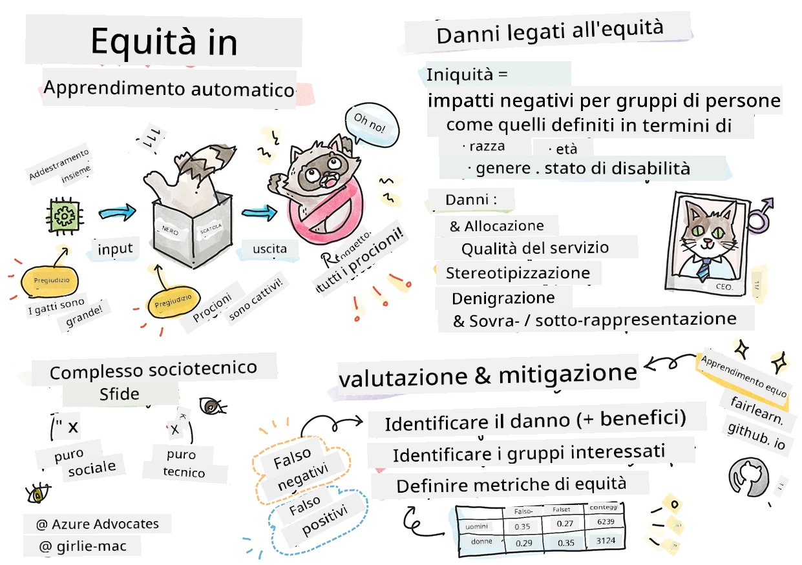

# Costruire soluzioni di Machine Learning con AI responsabile
 

> Sketchnote di [Tomomi Imura](https://www.twitter.com/girlie_mac)

## [Quiz pre-lezione](https://ff-quizzes.netlify.app/en/ml/)
 
## Introduzione

In questo corso inizierai a scoprire come il machine learning può e sta influenzando la nostra vita quotidiana. Anche adesso, sistemi e modelli sono coinvolti in attività decisionali quotidiane, come diagnosi mediche, approvazioni di prestiti o rilevamento di frodi. Quindi è importante che questi modelli funzionino bene per fornire risultati affidabili. Come per qualsiasi applicazione software, i sistemi di AI possono non soddisfare le aspettative o avere esiti indesiderati. Per questo motivo è essenziale essere in grado di comprendere e spiegare il comportamento di un modello AI.

Immagina cosa può accadere quando i dati che usi per costruire questi modelli mancano di determinate demografie, come razza, genere, opinione politica, religione, o rappresentano in modo sproporzionato tali demografie. Cosa succede quando l’output del modello è interpretato per favorire una certa demografia? Qual è la conseguenza per l’applicazione? Inoltre, cosa accade quando il modello produce un risultato avverso dannoso per le persone? Chi è responsabile del comportamento del sistema AI? Queste sono alcune delle domande che esploreremo in questo corso.

In questa lezione imparerai a:

- Aumentare la consapevolezza sull'importanza dell'equità nel machine learning e sui danni correlati all'equità.
- Familiarizzare con la pratica di esplorare gli outlier e scenari insoliti per garantire affidabilità e sicurezza.
- Acquisire comprensione della necessità di dare potere a tutti progettando sistemi inclusivi.
- Esplorare quanto sia vitale proteggere la privacy e la sicurezza dei dati e delle persone.
- Vedere l'importanza di un approccio "scatola trasparente" per spiegare il comportamento dei modelli di AI.
- Essere consapevoli di come la responsabilità sia essenziale per costruire fiducia nei sistemi di AI.

## Prerequisito

Come prerequisito, svolgi il Percorso di apprendimento "Principi di AI responsabile" e guarda il video qui sotto sull'argomento:

Scopri di più sull'AI responsabile seguendo questo [Percorso di apprendimento](https://docs.microsoft.com/learn/modules/responsible-ai-principles/?WT.mc_id=academic-77952-leestott)

> 🎥 Clicca sull'immagine sopra per un video: Approccio di Microsoft all'AI responsabile

## Equità

I sistemi AI dovrebbero trattare tutti in modo equo ed evitare di colpire gruppi simili di persone in modi diversi. Per esempio, quando i sistemi AI forniscono indicazioni su trattamenti medici, domande di prestito o impiego, dovrebbero fare le stesse raccomandazioni a tutti coloro che presentano sintomi simili, condizioni finanziarie o qualifiche professionali. Ognuno di noi come umano porta con sé bias ereditati che influenzano decisioni e azioni. Questi bias possono essere evidenti nei dati usati per addestrare i sistemi AI. Tale manipolazione può a volte avvenire involontariamente. È spesso difficile sapere consapevolmente quando si introduce un bias nei dati.

**"Disparità"** comprende impatti negativi, o "danni", per un gruppo di persone definito in termini di razza, genere, età o stato di disabilità. I principali danni legati all'equità possono essere classificati come:

- **Allocazione**, se per esempio un genere o un'etnia viene favorito rispetto a un altro.
- **Qualità del servizio**. Se addestri i dati per uno scenario specifico ma la realtà è più complessa, il servizio può risultare inefficace. Ad esempio, un distributore di sapone che sembra incapace di riconoscere persone con la pelle scura. [Riferimento](https://gizmodo.com/why-cant-this-soap-dispenser-identify-dark-skin-1797931773)
- **Denigrazione**. Criticare etichettare ingiustamente qualcosa o qualcuno. Ad esempio, una tecnologia di etichettatura delle immagini ha etichettato infamemente le immagini di persone dalla pelle scura come gorilla.
- **Sovra- o sotto-rappresentazione**. L'idea è che un certo gruppo non sia visto in una certa professione e qualsiasi servizio o funzione che continua a promuovere ciò contribuisce al danno.
- **Stereotipizzazione**. Associare a un dato gruppo attributi preassegnati. Per esempio, un sistema di traduzione linguistica tra inglese e turco può avere imprecisioni dovute a parole con associazioni stereotipate di genere.

> traduzione in turco

> traduzione di nuovo in inglese

Quando progetti e testi sistemi AI, dobbiamo assicurarci che l'AI sia equa e non programmata per prendere decisioni di parte o discriminatorie, decisioni che anche gli esseri umani sono proibiti di prendere. Garantire l'equità nell'AI e nel machine learning rimane una sfida sociotecnica complessa.

### Affidabilità e sicurezza

Per costruire fiducia, i sistemi AI devono essere affidabili, sicuri e coerenti in condizioni normali e impreviste. È importante sapere come i sistemi AI si comporteranno in varie situazioni, specialmente quando sono outlier. Nel costruire soluzioni AI, occorre concentrarsi molto su come affrontare una vasta gamma di circostanze che le soluzioni AI potrebbero incontrare. Per esempio, un'auto a guida autonoma deve mettere la sicurezza delle persone come massima priorità. Di conseguenza, l'AI che alimenta l'auto deve considerare tutti gli scenari possibili, come notte, temporali o bufere di neve, bambini che attraversano la strada, animali domestici, cantieri stradali ecc. Quanto bene un sistema AI riesce a gestire una vasta gamma di condizioni in modo affidabile e sicuro riflette il livello di anticipazione preso in considerazione dal data scientist o sviluppatore AI durante la progettazione o i test del sistema.

> [🎥 Clicca qui per un video: ](https://www.microsoft.com/videoplayer/embed/RE4vvIl)

### Inclusività

I sistemi AI dovrebbero essere progettati per coinvolgere e responsabilizzare tutti. Quando progettano e implementano sistemi AI, data scientist e sviluppatori AI identificano e affrontano barriere potenziali nel sistema che potrebbero escludere involontariamente le persone. Per esempio, ci sono 1 miliardo di persone con disabilità nel mondo. Con l'avanzamento dell'AI, possono accedere più facilmente a una vasta gamma di informazioni e opportunità nella vita quotidiana. Affrontando le barriere si creano opportunità per innovare e sviluppare prodotti AI con esperienze migliori che avvantaggiano tutti.

> [🎥 Clicca qui per un video: inclusività nell'AI](https://www.microsoft.com/videoplayer/embed/RE4vl9v)

### Sicurezza e privacy

I sistemi AI dovrebbero essere sicuri e rispettare la privacy delle persone. Le persone hanno meno fiducia in sistemi che mettono a rischio la loro privacy, informazioni o vite. Nel addestrare modelli di machine learning, ci si affida ai dati per produrre i migliori risultati. In questo processo, bisogna considerare l’origine dei dati e l'integrità. Per esempio, i dati sono stati inviati dagli utenti o sono pubblicamente disponibili? Inoltre, durante il lavoro con i dati è fondamentale sviluppare sistemi AI in grado di proteggere informazioni riservate e resistere ad attacchi. Con la diffusione crescente dell'AI, proteggere la privacy e mettere in sicurezza informazioni personali e aziendali importanti diventa sempre più critico e complesso. Questioni di privacy e sicurezza dei dati richiedono particolare attenzione per l’AI poiché l’accesso ai dati è essenziale per i sistemi AI per fare previsioni e decisioni accurate e informate sulle persone.

> [🎥 Clicca qui per un video: sicurezza nell'AI](https://www.microsoft.com/videoplayer/embed/RE4voJF)

- Come settore abbiamo fatto progressi significativi in Privacy e sicurezza, alimentati in gran parte da regolamenti come il GDPR (Regolamento Generale sulla Protezione dei Dati).
- Tuttavia, con i sistemi AI dobbiamo riconoscere la tensione tra la necessità di avere più dati personali per rendere i sistemi più personali ed efficaci – e la privacy.
- Proprio come con la nascita dei computer connessi a internet, stiamo assistendo anche a un forte aumento delle problematiche di sicurezza legate all'AI.
- Allo stesso tempo, abbiamo visto l’AI usata per migliorare la sicurezza. Ad esempio, la maggior parte degli scanner antivirus moderni oggi si basa su euristiche AI.
- Dobbiamo garantire che i nostri processi di Data Science si integrino armoniosamente con le più recenti pratiche di privacy e sicurezza.

### Trasparenza
I sistemi AI dovrebbero essere comprensibili. Una parte cruciale della trasparenza è spiegare il comportamento dei sistemi AI e dei loro componenti. Migliorare la comprensione dei sistemi AI richiede che gli stakeholder capiscano come e perché funzionano, per poter individuare problemi di prestazione, sicurezza e privacy, bias, pratiche escludenti o esiti imprevisti. Crediamo inoltre che chi usa sistemi AI dovrebbe essere onesto e trasparente su quando, perché e come sceglie di implementarli, nonché sui limiti dei sistemi utilizzati. Per esempio, se una banca utilizza un sistema AI per supportare le decisioni di prestito ai consumatori, è importante esaminare i risultati e capire quali dati influenzano le raccomandazioni del sistema. I governi stanno iniziando a regolamentare l'AI in tutti i settori, quindi data scientist e organizzazioni devono spiegare se un sistema AI soddisfa i requisiti normativi, soprattutto se si verifica un esito indesiderato.

> [🎥 Clicca qui per un video: trasparenza nell'AI](https://www.microsoft.com/videoplayer/embed/RE4voJF)

- Poiché i sistemi AI sono così complessi, è difficile capire come funzionano e interpretare i risultati.
- Questa mancanza di comprensione influisce sul modo in cui questi sistemi vengono gestiti, operazionalizzati e documentati.
- E ancora più importante, questa mancanza di comprensione influisce sulle decisioni prese utilizzando i risultati prodotti da questi sistemi.

### Responsabilità
 
Le persone che progettano e implementano sistemi AI devono essere responsabili di come i loro sistemi operano. La necessità di responsabilità è particolarmente cruciale con tecnologie sensibili come il riconoscimento facciale. Recentemente, c'è stata una crescente domanda di tecnologia di riconoscimento facciale, soprattutto da parte delle forze dell'ordine che vedono il potenziale della tecnologia per usi come il ritrovamento di bambini scomparsi. Tuttavia, queste tecnologie potrebbero potenzialmente essere usate da un governo per mettere a rischio le libertà fondamentali dei cittadini, per esempio consentendo la sorveglianza continua di individui specifici. Pertanto, data scientist e organizzazioni devono essere responsabili di come il loro sistema AI impatta individui o la società.

> 🎥 Clicca l'immagine sopra per un video: Avvisi sulla sorveglianza di massa tramite riconoscimento facciale

In definitiva, una delle grandi questioni per la nostra generazione, come prima generazione che porta l'AI alla società, è come garantire che i computer rimangano responsabili verso le persone e come assicurare che chi progetta i computer rimanga responsabile verso tutti gli altri.

## Valutazione d'impatto

Prima di addestrare un modello di machine learning, è importante condurre una valutazione d'impatto per comprendere lo scopo del sistema AI; qual è l'uso previsto; dove sarà distribuito; e chi interagirà con il sistema. Questi aspetti sono utili per i revisori o i tester che valutano il sistema per sapere quali fattori considerare quando identificano potenziali rischi e conseguenze attese.

Le seguenti sono aree di interesse quando si conduce una valutazione d'impatto:

* **Impatto negativo sugli individui**. Essere consapevoli di qualsiasi restrizione o requisito, uso non supportato o limitazioni note che ostacolano la performance del sistema è vitale per assicurare che il sistema non venga usato in modo da causare danni agli individui.
* **Requisiti dei dati**. Capire come e dove il sistema utilizzerà i dati consente ai revisori di esplorare eventuali requisiti di dati di cui occorre essere consapevoli (es. regolamentazioni GDPR o HIPAA). Inoltre, esaminare se la sorgente o la quantità di dati è adeguata per l'addestramento.
* **Riepilogo dell'impatto**. Raccogliere una lista dei potenziali danni che potrebbero sorgere dall'uso del sistema. Durante il ciclo di vita del ML, verificare se le problematiche identificate sono mitigate o affrontate.
* **Obiettivi applicabili** per ciascuno dei sei principi fondamentali. Valutare se gli obiettivi di ciascun principio sono raggiunti e se ci sono lacune.

## Debugging con AI responsabile

Simile al debugging di un’applicazione software, il debugging di un sistema AI è un processo necessario per identificare e risolvere problemi nel sistema. Ci sono molti fattori che potrebbero influire sul fatto che un modello non si comporti come previsto o responsabilmente. La maggior parte delle metriche tradizionali delle prestazioni del modello sono aggregati quantitativi delle prestazioni, insufficienti per analizzare come un modello viola i principi di AI responsabile. Inoltre, un modello di machine learning è una scatola nera che rende difficile comprendere cosa determina il suo risultato o fornire spiegazioni quando commette un errore. Più avanti in questo corso, impareremo a usare la dashboard Responsible AI per aiutare nel debugging dei sistemi AI. La dashboard fornisce uno strumento olistico per data scientist e sviluppatori AI per:

* **Analisi degli errori**. Per identificare la distribuzione degli errori del modello che possono influenzare l’equità o l’affidabilità del sistema.
* **Panoramica del modello**. Per scoprire dove ci sono disparità nelle prestazioni del modello tra i diversi gruppi di dati.
* **Analisi dei dati**. Per comprendere la distribuzione dei dati e identificare eventuali bias potenziali nei dati che potrebbero causare problemi di equità, inclusività e affidabilità.
* **Interpretabilità del modello**. Per capire cosa influisce o influenza le predizioni del modello. Questo aiuta a spiegare il comportamento del modello, importante per trasparenza e responsabilità.

## 🚀 Sfida
 
Per prevenire che i danni vengano introdotti fin dall'inizio, dovremmo:

- avere una diversità di background e prospettive tra le persone che lavorano sui sistemi
- investire in dataset che riflettano la diversità della nostra società
- sviluppare metodi migliori durante tutto il ciclo di vita del machine learning per rilevare e correggere l'AI responsabile quando si verifica

Rifletti su scenari reali in cui l'affidabilità di un modello è evidente nella costruzione e nell'uso del modello. Cos'altro dovremmo considerare?

## [Quiz post-lezione](https://ff-quizzes.netlify.app/en/ml/)

## Revisione e studio autonomo
 

In questa lezione, hai appreso alcune nozioni di base sui concetti di equità e ingiustizia nel machine learning.  
 
Guarda questo workshop per approfondire i temi: 

- In the pursuit of responsible AI: Bringing principles to practice di Besmira Nushi, Mehrnoosh Sameki e Amit Sharma

> 🎥 Clicca sull'immagine sopra per un video: RAI Toolbox: An open-source framework for building responsible AI di Besmira Nushi, Mehrnoosh Sameki e Amit Sharma

Inoltre, leggi: 

- Centro risorse RAI di Microsoft: [Responsible AI Resources – Microsoft AI](https://www.microsoft.com/ai/responsible-ai-resources?activetab=pivot1%3aprimaryr4) 

- Gruppo di ricerca FATE di Microsoft: [FATE: Fairness, Accountability, Transparency, and Ethics in AI - Microsoft Research](https://www.microsoft.com/research/theme/fate/) 

RAI Toolbox: 

- [Repository GitHub di Responsible AI Toolbox](https://github.com/microsoft/responsible-ai-toolbox)

Leggi degli strumenti di Azure Machine Learning per garantire l'equità:

- [Azure Machine Learning](https://docs.microsoft.com/azure/machine-learning/concept-fairness-ml?WT.mc_id=academic-77952-leestott) 

## Compito

[Esplora RAI Toolbox](assignment.md)

---

<!-- CO-OP TRANSLATOR DISCLAIMER START -->
**Disclaimer**:
Questo documento è stato tradotto utilizzando il servizio di traduzione AI [Co-op Translator](https://github.com/Azure/co-op-translator). Sebbene ci impegniamo per garantire la precisione, si prega di notare che le traduzioni automatizzate possono contenere errori o imprecisioni. Il documento originale nella sua lingua nativa deve essere considerato la fonte autorevole. Per informazioni critiche, si raccomanda una traduzione professionale effettuata da un essere umano. Non siamo responsabili per eventuali malintesi o interpretazioni errate derivanti dall’uso di questa traduzione.
<!-- CO-OP TRANSLATOR DISCLAIMER END -->