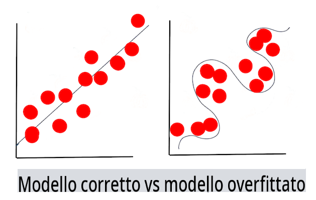

# Tecniche di Machine Learning

Il processo di costruzione, utilizzo e mantenimento dei modelli di machine learning e dei dati che utilizzano è molto diverso da molti altri flussi di lavoro di sviluppo. In questa lezione, demistificheremo il processo e delineeremo le principali tecniche che devi conoscere. Imparerai a:

- Comprendere i processi che stanno alla base del machine learning a un livello alto.
- Esplorare concetti di base come 'modelli', 'predizioni' e 'dati di addestramento'.

## [Quiz pre-lezione](https://gray-sand-07a10f403.1.azurestaticapps.net/quiz/7/)

> 🎥 Clicca sull'immagine sopra per un breve video che illustra questa lezione.

## Introduzione

A un livello alto, l'arte di creare processi di machine learning (ML) è composta da diversi passaggi:

1. **Decidere la domanda**. La maggior parte dei processi ML inizia ponendo una domanda che non può essere risolta da un semplice programma condizionale o da un motore basato su regole. Queste domande spesso ruotano attorno a predizioni basate su una raccolta di dati.
2. **Raccogliere e preparare i dati**. Per poter rispondere alla tua domanda, hai bisogno di dati. La qualità e, a volte, la quantità dei tuoi dati determineranno quanto bene puoi rispondere alla tua domanda iniziale. Visualizzare i dati è un aspetto importante di questa fase. Questa fase include anche la suddivisione dei dati in un gruppo di addestramento e un gruppo di test per costruire un modello.
3. **Scegliere un metodo di addestramento**. A seconda della tua domanda e della natura dei tuoi dati, devi scegliere come vuoi addestrare un modello per riflettere al meglio i tuoi dati e fare predizioni accurate. Questa è la parte del tuo processo ML che richiede competenze specifiche e, spesso, una notevole quantità di sperimentazione.
4. **Addestrare il modello**. Utilizzando i tuoi dati di addestramento, userai vari algoritmi per addestrare un modello a riconoscere schemi nei dati. Il modello potrebbe sfruttare pesi interni che possono essere regolati per privilegiare certe parti dei dati rispetto ad altre per costruire un modello migliore.
5. **Valutare il modello**. Usi dati mai visti prima (i tuoi dati di test) dal tuo set raccolto per vedere come il modello sta performando.
6. **Ottimizzazione dei parametri**. In base alle prestazioni del tuo modello, puoi rifare il processo utilizzando parametri diversi, o variabili, che controllano il comportamento degli algoritmi utilizzati per addestrare il modello.
7. **Predire**. Utilizza nuovi input per testare l'accuratezza del tuo modello.

## Quale domanda porre

I computer sono particolarmente abili nello scoprire schemi nascosti nei dati. Questa capacità è molto utile per i ricercatori che hanno domande su un dato dominio che non possono essere facilmente risolte creando un motore basato su regole condizionali. Data un'attività attuariale, per esempio, un data scientist potrebbe essere in grado di costruire regole artigianali sulla mortalità dei fumatori rispetto ai non fumatori.

Quando molti altri variabili vengono inserite nell'equazione, tuttavia, un modello ML potrebbe risultare più efficiente nel predire i tassi di mortalità futuri basandosi sulla storia sanitaria passata. Un esempio più allegro potrebbe essere fare previsioni meteorologiche per il mese di aprile in una data località basandosi su dati che includono latitudine, longitudine, cambiamenti climatici, prossimità all'oceano, schemi della corrente a getto e altro.

✅ Questa [presentazione](https://www2.cisl.ucar.edu/sites/default/files/2021-10/0900%20June%2024%20Haupt_0.pdf) sui modelli meteorologici offre una prospettiva storica sull'uso del ML nell'analisi meteorologica.  

## Compiti pre-costruzione

Prima di iniziare a costruire il tuo modello, ci sono diversi compiti che devi completare. Per testare la tua domanda e formare un'ipotesi basata sulle predizioni di un modello, devi identificare e configurare diversi elementi.

### Dati

Per poter rispondere alla tua domanda con una certa sicurezza, hai bisogno di una buona quantità di dati del tipo giusto. Ci sono due cose che devi fare a questo punto:

- **Raccogliere dati**. Tenendo presente la lezione precedente sull'equità nell'analisi dei dati, raccogli i tuoi dati con cura. Sii consapevole delle fonti di questi dati, di eventuali bias intrinseci che potrebbero avere e documenta la loro origine.
- **Preparare i dati**. Ci sono diversi passaggi nel processo di preparazione dei dati. Potresti dover unire i dati e normalizzarli se provengono da fonti diverse. Puoi migliorare la qualità e la quantità dei dati attraverso vari metodi come convertire stringhe in numeri (come facciamo in [Clustering](../../5-Clustering/1-Visualize/README.md)). Potresti anche generare nuovi dati, basandoti sugli originali (come facciamo in [Classification](../../4-Classification/1-Introduction/README.md)). Puoi pulire e modificare i dati (come faremo prima della lezione sulla [Web App](../../3-Web-App/README.md)). Infine, potresti anche doverli randomizzare e mescolarli, a seconda delle tue tecniche di addestramento.

✅ Dopo aver raccolto e processato i tuoi dati, prenditi un momento per vedere se la loro forma ti permetterà di affrontare la tua domanda prevista. Potrebbe essere che i dati non performino bene nel tuo compito dato, come scopriamo nelle nostre lezioni di [Clustering](../../5-Clustering/1-Visualize/README.md)!

### Caratteristiche e Target

Una [caratteristica](https://www.datasciencecentral.com/profiles/blogs/an-introduction-to-variable-and-feature-selection) è una proprietà misurabile dei tuoi dati. In molti set di dati è espressa come un'intestazione di colonna come 'data', 'dimensione' o 'colore'. La tua variabile caratteristica, solitamente rappresentata come `X` nel codice, rappresenta la variabile di input che verrà utilizzata per addestrare il modello.

Un target è ciò che stai cercando di predire. Il target solitamente rappresentato come `y` nel codice, rappresenta la risposta alla domanda che stai cercando di fare ai tuoi dati: a dicembre, quale **colore** delle zucche sarà il più economico? a San Francisco, quali quartieri avranno il miglior **prezzo** immobiliare? A volte il target è anche indicato come attributo etichetta.

### Selezionare la tua variabile caratteristica

🎓 **Selezione delle caratteristiche ed Estrazione delle caratteristiche** Come fai a sapere quale variabile scegliere quando costruisci un modello? Probabilmente passerai attraverso un processo di selezione delle caratteristiche o estrazione delle caratteristiche per scegliere le variabili giuste per il modello più performante. Tuttavia, non sono la stessa cosa: "L'estrazione delle caratteristiche crea nuove caratteristiche da funzioni delle caratteristiche originali, mentre la selezione delle caratteristiche restituisce un sottoinsieme delle caratteristiche." ([fonte](https://wikipedia.org/wiki/Feature_selection))

### Visualizzare i tuoi dati

Un aspetto importante dell'arsenale del data scientist è il potere di visualizzare i dati utilizzando diverse eccellenti librerie come Seaborn o MatPlotLib. Rappresentare i tuoi dati visivamente potrebbe permetterti di scoprire correlazioni nascoste che puoi sfruttare. Le tue visualizzazioni potrebbero anche aiutarti a scoprire bias o dati sbilanciati (come scopriamo in [Classification](../../4-Classification/2-Classifiers-1/README.md)).

### Dividere il tuo dataset

Prima di addestrare, devi dividere il tuo dataset in due o più parti di dimensioni disuguali che rappresentino comunque bene i dati.

- **Addestramento**. Questa parte del dataset viene adattata al tuo modello per addestrarlo. Questo set costituisce la maggior parte del dataset originale.
- **Test**. Un dataset di test è un gruppo indipendente di dati, spesso raccolti dai dati originali, che usi per confermare le prestazioni del modello costruito.
- **Validazione**. Un set di validazione è un gruppo indipendente più piccolo di esempi che usi per regolare i parametri del modello, o l'architettura, per migliorare il modello. A seconda delle dimensioni dei tuoi dati e della domanda che stai ponendo, potresti non avere bisogno di costruire questo terzo set (come notiamo in [Time Series Forecasting](../../7-TimeSeries/1-Introduction/README.md)).

## Costruire un modello

Utilizzando i tuoi dati di addestramento, il tuo obiettivo è costruire un modello, o una rappresentazione statistica dei tuoi dati, utilizzando vari algoritmi per **addestrarlo**. Addestrare un modello lo espone ai dati e gli permette di fare assunzioni sugli schemi percepiti che scopre, valida e accetta o rifiuta.

### Decidere un metodo di addestramento

A seconda della tua domanda e della natura dei tuoi dati, sceglierai un metodo per addestrarlo. Scorrendo la [documentazione di Scikit-learn](https://scikit-learn.org/stable/user_guide.html) - che usiamo in questo corso - puoi esplorare molti modi per addestrare un modello. A seconda della tua esperienza, potresti dover provare diversi metodi per costruire il miglior modello. Probabilmente passerai attraverso un processo in cui i data scientist valutano le prestazioni di un modello alimentandolo con dati non visti, controllando l'accuratezza, i bias e altri problemi di degrado della qualità, e selezionando il metodo di addestramento più appropriato per il compito in questione.

### Addestrare un modello

Armato dei tuoi dati di addestramento, sei pronto a 'adattarli' per creare un modello. Noterai che in molte librerie ML troverai il codice 'model.fit' - è in questo momento che invii la tua variabile caratteristica come un array di valori (solitamente 'X') e una variabile target (solitamente 'y').

### Valutare il modello

Una volta completato il processo di addestramento (possono essere necessarie molte iterazioni, o 'epoche', per addestrare un grande modello), sarai in grado di valutare la qualità del modello utilizzando dati di test per valutarne le prestazioni. Questi dati sono un sottoinsieme dei dati originali che il modello non ha precedentemente analizzato. Puoi stampare una tabella di metriche sulla qualità del tuo modello.

🎓 **Adattamento del modello**

Nel contesto del machine learning, l'adattamento del modello si riferisce all'accuratezza della funzione sottostante del modello mentre tenta di analizzare dati con cui non ha familiarità.

🎓 **Underfitting** e **overfitting** sono problemi comuni che degradano la qualità del modello, poiché il modello si adatta troppo bene o troppo poco. Questo causa il modello a fare predizioni troppo allineate o troppo poco allineate con i suoi dati di addestramento. Un modello sovradattato predice i dati di addestramento troppo bene perché ha imparato troppo bene i dettagli e il rumore dei dati. Un modello sotto-adattato non è accurato poiché non può analizzare accuratamente né i suoi dati di addestramento né i dati che non ha ancora 'visto'.

> Infografica di [Jen Looper](https://twitter.com/jenlooper)

## Ottimizzazione dei parametri

Una volta completato l'addestramento iniziale, osserva la qualità del modello e considera di migliorarlo regolando i suoi 'iperparametri'. Leggi di più sul processo [nella documentazione](https://docs.microsoft.com/en-us/azure/machine-learning/how-to-tune-hyperparameters?WT.mc_id=academic-77952-leestott).

## Predizione

Questo è il momento in cui puoi utilizzare dati completamente nuovi per testare l'accuratezza del tuo modello. In un contesto ML 'applicato', dove stai costruendo asset web per utilizzare il modello in produzione, questo processo potrebbe coinvolgere la raccolta di input utente (una pressione di un pulsante, per esempio) per impostare una variabile e inviarla al modello per inferenza, o valutazione.

In queste lezioni, scoprirai come utilizzare questi passaggi per preparare, costruire, testare, valutare e predire - tutti i gesti di un data scientist e altro, mentre progredisci nel tuo viaggio per diventare un ingegnere ML 'full stack'.

---

## 🚀Sfida

Disegna un diagramma di flusso che rifletta i passaggi di un praticante ML. Dove ti vedi in questo momento nel processo? Dove prevedi che troverai difficoltà? Cosa ti sembra facile?

## [Quiz post-lezione](https://gray-sand-07a10f403.1.azurestaticapps.net/quiz/8/)

## Revisione & Studio Autonomo

Cerca online interviste con data scientist che discutono del loro lavoro quotidiano. Eccone [una](https://www.youtube.com/watch?v=Z3IjgbbCEfs).

## Compito

[Intervista a un data scientist](assignment.md)

**Disclaimer**:
Questo documento è stato tradotto utilizzando servizi di traduzione basati su intelligenza artificiale. Sebbene ci sforziamo di garantire l'accuratezza, si prega di essere consapevoli che le traduzioni automatiche possono contenere errori o imprecisioni. Il documento originale nella sua lingua madre dovrebbe essere considerato la fonte autorevole. Per informazioni critiche, si raccomanda la traduzione professionale umana. Non siamo responsabili per eventuali malintesi o interpretazioni errate derivanti dall'uso di questa traduzione.