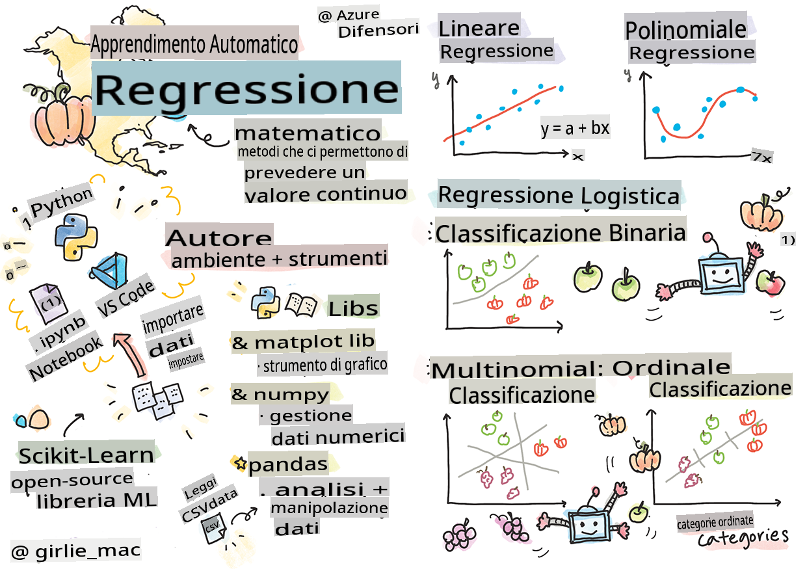
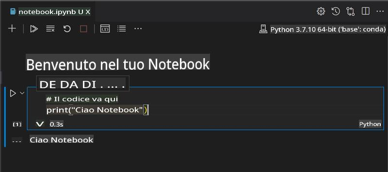
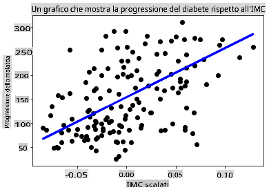

# Inizia con Python e Scikit-learn per modelli di regressione



> Sketchnote di [Tomomi Imura](https://www.twitter.com/girlie_mac)

## [Quiz pre-lezione](https://gray-sand-07a10f403.1.azurestaticapps.net/quiz/9/)

> ### [Questa lezione è disponibile in R!](../../../../2-Regression/1-Tools/solution/R/lesson_1.html)

## Introduzione

In queste quattro lezioni, scoprirai come costruire modelli di regressione. Discuteremo presto a cosa servono. Ma prima di fare qualsiasi cosa, assicurati di avere gli strumenti giusti per iniziare il processo!

In questa lezione, imparerai come:

- Configurare il tuo computer per attività di machine learning locale.
- Lavorare con Jupyter notebooks.
- Usare Scikit-learn, inclusa l'installazione.
- Esplorare la regressione lineare con un esercizio pratico.

## Installazioni e configurazioni

[](https://youtu.be/-DfeD2k2Kj0 "ML per principianti - Configura i tuoi strumenti per costruire modelli di Machine Learning")

> 🎥 Clicca sull'immagine sopra per un breve video che ti guida nella configurazione del tuo computer per ML.

1. **Installa Python**. Assicurati che [Python](https://www.python.org/downloads/) sia installato sul tuo computer. Userai Python per molte attività di data science e machine learning. La maggior parte dei sistemi informatici include già un'installazione di Python. Sono disponibili anche utili [Python Coding Packs](https://code.visualstudio.com/learn/educators/installers?WT.mc_id=academic-77952-leestott) per facilitare la configurazione per alcuni utenti.

   Alcuni utilizzi di Python, tuttavia, richiedono una versione del software, mentre altri ne richiedono una diversa. Per questo motivo, è utile lavorare all'interno di un [ambiente virtuale](https://docs.python.org/3/library/venv.html).

2. **Installa Visual Studio Code**. Assicurati di avere Visual Studio Code installato sul tuo computer. Segui queste istruzioni per [installare Visual Studio Code](https://code.visualstudio.com/) per l'installazione di base. Userai Python in Visual Studio Code in questo corso, quindi potrebbe essere utile ripassare come [configurare Visual Studio Code](https://docs.microsoft.com/learn/modules/python-install-vscode?WT.mc_id=academic-77952-leestott) per lo sviluppo in Python.

   > Familiarizza con Python lavorando attraverso questa raccolta di [moduli di apprendimento](https://docs.microsoft.com/users/jenlooper-2911/collections/mp1pagggd5qrq7?WT.mc_id=academic-77952-leestott)
   >
   > [](https://youtu.be/yyQM70vi7V8 "Configura Python con Visual Studio Code")
   >
   > 🎥 Clicca sull'immagine sopra per un video: usare Python all'interno di VS Code.

3. **Installa Scikit-learn**, seguendo [queste istruzioni](https://scikit-learn.org/stable/install.html). Poiché devi assicurarti di usare Python 3, si consiglia di usare un ambiente virtuale. Nota, se stai installando questa libreria su un Mac M1, ci sono istruzioni speciali sulla pagina linkata sopra.

4. **Installa Jupyter Notebook**. Dovrai [installare il pacchetto Jupyter](https://pypi.org/project/jupyter/).

## Il tuo ambiente di sviluppo ML

Utilizzerai **notebooks** per sviluppare il tuo codice Python e creare modelli di machine learning. Questo tipo di file è uno strumento comune per i data scientist e possono essere identificati dalla loro estensione `.ipynb`.

I notebooks sono un ambiente interattivo che permette al sviluppatore di codificare e aggiungere note e scrivere documentazione intorno al codice, il che è molto utile per progetti sperimentali o orientati alla ricerca.

[](https://youtu.be/7E-jC8FLA2E "ML per principianti - Configura Jupyter Notebooks per iniziare a costruire modelli di regressione")

> 🎥 Clicca sull'immagine sopra per un breve video che ti guida attraverso questo esercizio.

### Esercizio - lavorare con un notebook

In questa cartella, troverai il file _notebook.ipynb_.

1. Apri _notebook.ipynb_ in Visual Studio Code.

   Un server Jupyter si avvierà con Python 3+. Troverai aree del notebook che possono essere `run`, pezzi di codice. Puoi eseguire un blocco di codice, selezionando l'icona che sembra un pulsante di riproduzione.

2. Seleziona l'icona `md` e aggiungi un po' di markdown, e il seguente testo **# Benvenuto nel tuo notebook**.

   Successivamente, aggiungi del codice Python.

3. Scrivi **print('hello notebook')** nel blocco di codice.
4. Seleziona la freccia per eseguire il codice.

   Dovresti vedere la dichiarazione stampata:

    ```output
    hello notebook
    ```



Puoi intercalare il tuo codice con commenti per auto-documentare il notebook.

✅ Pensa per un momento a quanto è diverso l'ambiente di lavoro di uno sviluppatore web rispetto a quello di un data scientist.

## Iniziare con Scikit-learn

Ora che Python è configurato nel tuo ambiente locale e ti senti a tuo agio con i Jupyter notebooks, prendiamo confidenza anche con Scikit-learn (pronuncialo `sci` as in `science`). Scikit-learn fornisce una [API estesa](https://scikit-learn.org/stable/modules/classes.html#api-ref) per aiutarti a svolgere compiti di ML.

Secondo il loro [sito web](https://scikit-learn.org/stable/getting_started.html), "Scikit-learn è una libreria open source di machine learning che supporta l'apprendimento supervisionato e non supervisionato. Fornisce anche vari strumenti per l'adattamento dei modelli, la pre-elaborazione dei dati, la selezione e la valutazione dei modelli e molte altre utilità."

In questo corso, utilizzerai Scikit-learn e altri strumenti per costruire modelli di machine learning per eseguire quelli che chiamiamo compiti di 'machine learning tradizionale'. Abbiamo deliberatamente evitato le reti neurali e il deep learning, poiché sono meglio trattati nel nostro prossimo curriculum 'AI for Beginners'.

Scikit-learn rende semplice costruire modelli e valutarli per l'uso. È principalmente focalizzato sull'utilizzo di dati numerici e contiene diversi dataset pronti all'uso come strumenti di apprendimento. Include anche modelli pre-costruiti per gli studenti da provare. Esploriamo il processo di caricamento dei dati preconfezionati e l'uso di un estimatore incorporato per il primo modello di ML con Scikit-learn con alcuni dati di base.

## Esercizio - il tuo primo notebook con Scikit-learn

> Questo tutorial è stato ispirato dall'[esempio di regressione lineare](https://scikit-learn.org/stable/auto_examples/linear_model/plot_ols.html#sphx-glr-auto-examples-linear-model-plot-ols-py) sul sito web di Scikit-learn.

[](https://youtu.be/2xkXL5EUpS0 "ML per principianti - Il tuo primo progetto di regressione lineare in Python")

> 🎥 Clicca sull'immagine sopra per un breve video che ti guida attraverso questo esercizio.

Nel file _notebook.ipynb_ associato a questa lezione, cancella tutte le celle premendo l'icona del 'cestino'.

In questa sezione, lavorerai con un piccolo dataset sul diabete che è integrato in Scikit-learn per scopi didattici. Immagina di voler testare un trattamento per pazienti diabetici. I modelli di Machine Learning potrebbero aiutarti a determinare quali pazienti risponderebbero meglio al trattamento, in base a combinazioni di variabili. Anche un modello di regressione molto semplice, quando visualizzato, potrebbe mostrare informazioni sulle variabili che ti aiuterebbero a organizzare i tuoi studi clinici teorici.

✅ Esistono molti tipi di metodi di regressione e quale scegli dipende dalla risposta che stai cercando. Se vuoi prevedere l'altezza probabile di una persona di una certa età, useresti la regressione lineare, poiché stai cercando un **valore numerico**. Se sei interessato a scoprire se un tipo di cucina dovrebbe essere considerato vegano o meno, stai cercando un **assegnazione di categoria** quindi useresti la regressione logistica. Imparerai di più sulla regressione logistica più avanti. Pensa un po' a delle domande che puoi fare ai dati e quale di questi metodi sarebbe più appropriato.

Iniziamo con questo compito.

### Importa le librerie

Per questo compito importeremo alcune librerie:

- **matplotlib**. È uno strumento utile per [grafici](https://matplotlib.org/) e lo useremo per creare un grafico a linee.
- **numpy**. [numpy](https://numpy.org/doc/stable/user/whatisnumpy.html) è una libreria utile per la gestione dei dati numerici in Python.
- **sklearn**. Questa è la libreria [Scikit-learn](https://scikit-learn.org/stable/user_guide.html).

Importa alcune librerie per aiutarti con i tuoi compiti.

1. Aggiungi gli import digitando il seguente codice:

   ```python
   import matplotlib.pyplot as plt
   import numpy as np
   from sklearn import datasets, linear_model, model_selection
   ```

   Sopra stai importando `matplotlib`, `numpy` and you are importing `datasets`, `linear_model` and `model_selection` from `sklearn`. `model_selection` is used for splitting data into training and test sets.

### The diabetes dataset

The built-in [diabetes dataset](https://scikit-learn.org/stable/datasets/toy_dataset.html#diabetes-dataset) includes 442 samples of data around diabetes, with 10 feature variables, some of which include:

- age: age in years
- bmi: body mass index
- bp: average blood pressure
- s1 tc: T-Cells (a type of white blood cells)

✅ This dataset includes the concept of 'sex' as a feature variable important to research around diabetes. Many medical datasets include this type of binary classification. Think a bit about how categorizations such as this might exclude certain parts of a population from treatments.

Now, load up the X and y data.

> 🎓 Remember, this is supervised learning, and we need a named 'y' target.

In a new code cell, load the diabetes dataset by calling `load_diabetes()`. The input `return_X_y=True` signals that `X` will be a data matrix, and `y` sarà il target della regressione.

2. Aggiungi alcuni comandi di stampa per mostrare la forma della matrice dei dati e il suo primo elemento:

    ```python
    X, y = datasets.load_diabetes(return_X_y=True)
    print(X.shape)
    print(X[0])
    ```

    Quello che ottieni come risposta è una tupla. Quello che stai facendo è assegnare i primi due valori della tupla a `X` and `y` rispettivamente. Scopri di più [sulle tuple](https://wikipedia.org/wiki/Tuple).

    Puoi vedere che questi dati hanno 442 elementi formati in array di 10 elementi:

    ```text
    (442, 10)
    [ 0.03807591  0.05068012  0.06169621  0.02187235 -0.0442235  -0.03482076
    -0.04340085 -0.00259226  0.01990842 -0.01764613]
    ```

    ✅ Pensa un po' alla relazione tra i dati e il target della regressione. La regressione lineare prevede relazioni tra la caratteristica X e la variabile target y. Puoi trovare il [target](https://scikit-learn.org/stable/datasets/toy_dataset.html#diabetes-dataset) per il dataset del diabete nella documentazione? Cosa sta dimostrando questo dataset, dato quel target?

3. Successivamente, seleziona una porzione di questo dataset da tracciare selezionando la 3ª colonna del dataset. Puoi farlo usando il `:` operator to select all rows, and then selecting the 3rd column using the index (2). You can also reshape the data to be a 2D array - as required for plotting - by using `reshape(n_rows, n_columns)`. Se uno dei parametri è -1, la dimensione corrispondente viene calcolata automaticamente.

   ```python
   X = X[:, 2]
   X = X.reshape((-1,1))
   ```

   ✅ In qualsiasi momento, stampa i dati per controllarne la forma.

4. Ora che hai i dati pronti per essere tracciati, puoi vedere se una macchina può aiutare a determinare una divisione logica tra i numeri in questo dataset. Per fare ciò, devi dividere sia i dati (X) che il target (y) in set di test e di addestramento. Scikit-learn ha un modo semplice per farlo; puoi dividere i tuoi dati di test in un punto dato.

   ```python
   X_train, X_test, y_train, y_test = model_selection.train_test_split(X, y, test_size=0.33)
   ```

5. Ora sei pronto per addestrare il tuo modello! Carica il modello di regressione lineare e addestralo con i tuoi set di addestramento X e y usando `model.fit()`:

    ```python
    model = linear_model.LinearRegression()
    model.fit(X_train, y_train)
    ```

    ✅ `model.fit()` is a function you'll see in many ML libraries such as TensorFlow

5. Then, create a prediction using test data, using the function `predict()`. Questo sarà usato per tracciare la linea tra i gruppi di dati del modello

    ```python
    y_pred = model.predict(X_test)
    ```

6. Ora è il momento di mostrare i dati in un grafico. Matplotlib è uno strumento molto utile per questo compito. Crea un grafico a dispersione di tutti i dati di test X e y, e usa la previsione per tracciare una linea nel punto più appropriato, tra i gruppi di dati del modello.

    ```python
    plt.scatter(X_test, y_test,  color='black')
    plt.plot(X_test, y_pred, color='blue', linewidth=3)
    plt.xlabel('Scaled BMIs')
    plt.ylabel('Disease Progression')
    plt.title('A Graph Plot Showing Diabetes Progression Against BMI')
    plt.show()
    ```

   

   ✅ Pensa un po' a cosa sta succedendo qui. Una linea retta sta attraversando molti piccoli punti di dati, ma cosa sta facendo esattamente? Riesci a vedere come dovresti essere in grado di usare questa linea per prevedere dove un nuovo punto dati non visto dovrebbe adattarsi in relazione all'asse y del grafico? Prova a mettere in parole l'uso pratico di questo modello.

Congratulazioni, hai costruito il tuo primo modello di regressione lineare, creato una previsione con esso e l'hai visualizzata in un grafico!

---
## 🚀Sfida

Traccia una variabile diversa da questo dataset. Suggerimento: modifica questa linea: `X = X[:,2]`. Dato il target di questo dataset, cosa sei in grado di scoprire sulla progressione del diabete come malattia?
## [Quiz post-lezione](https://gray-sand-07a10f403.1.azurestaticapps.net/quiz/10/)

## Revisione & Studio Individuale

In questo tutorial, hai lavorato con la regressione lineare semplice, piuttosto che con la regressione univariata o multipla. Leggi un po' sulle differenze tra questi metodi, o guarda [questo video](https://www.coursera.org/lecture/quantifying-relationships-regression-models/linear-vs-nonlinear-categorical-variables-ai2Ef)

Leggi di più sul concetto di regressione e pensa a quali tipi di domande possono essere risposte con questa tecnica. Segui questo [tutorial](https://docs.microsoft.com/learn/modules/train-evaluate-regression-models?WT.mc_id=academic-77952-leestott) per approfondire la tua comprensione.

## Compito

[Un dataset diverso](assignment.md)

**Disclaimer**:
Questo documento è stato tradotto utilizzando servizi di traduzione automatica basati su AI. Sebbene ci impegniamo per l'accuratezza, si prega di essere consapevoli che le traduzioni automatiche possono contenere errori o imprecisioni. Il documento originale nella sua lingua madre dovrebbe essere considerato la fonte autorevole. Per informazioni critiche, si raccomanda la traduzione professionale umana. Non siamo responsabili per eventuali malintesi o interpretazioni errate derivanti dall'uso di questa traduzione.