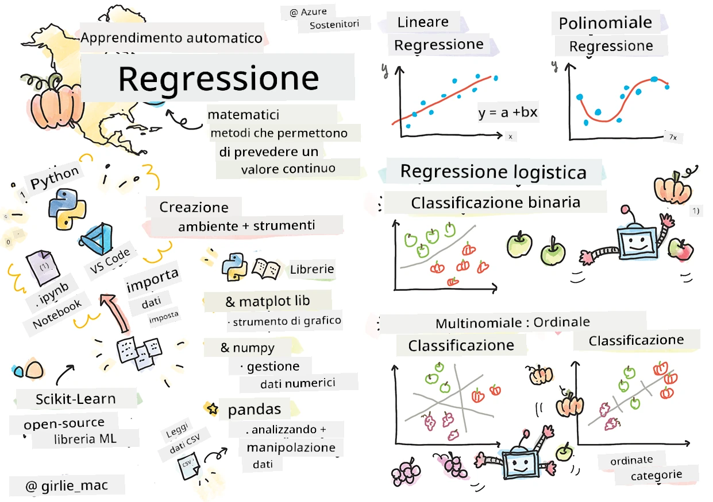
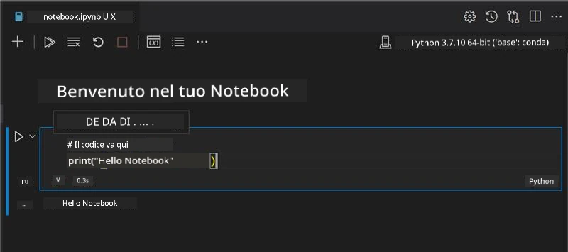
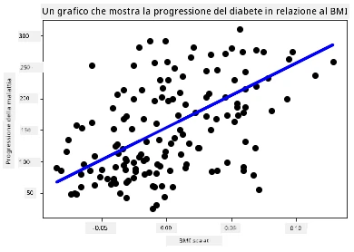

# Iniziare con Python e Scikit-learn per modelli di regressione



> Sketchnote di [Tomomi Imura](https://www.twitter.com/girlie_mac)

## [Quiz pre-lezione](https://ff-quizzes.netlify.app/en/ml/)

> ### [Questa lezione è disponibile anche in R!](../../../../2-Regression/1-Tools/solution/R/lesson_1.html)

## Introduzione

In queste quattro lezioni scoprirai come costruire modelli di regressione. Discuteremo a breve a cosa servono. Ma prima di fare qualsiasi cosa, assicurati di avere gli strumenti giusti per iniziare il processo!

In questa lezione imparerai a:

- Configurare il tuo computer per compiti di machine learning locale.
- Lavorare con Jupyter Notebooks.
- Usare Scikit-learn, incluso l’installazione.
- Esplorare la regressione lineare con un esercizio pratico.

## Installazioni e configurazioni

[](https://youtu.be/-DfeD2k2Kj0 "ML per principianti -Configura i tuoi strumenti per costruire modelli di Machine Learning")

> 🎥 Clicca sull’immagine sopra per un breve video che mostra come configurare il computer per ML.

1. **Installa Python**. Assicurati che [Python](https://www.python.org/downloads/) sia installato sul tuo computer. Userai Python per molti compiti di data science e machine learning. La maggior parte dei sistemi informatici include già un’installazione di Python. Sono disponibili anche utili [Pacchetti di Codifica Python](https://code.visualstudio.com/learn/educators/installers?WT.mc_id=academic-77952-leestott) per semplificare l’installazione ad alcuni utenti.

   Alcuni usi di Python, tuttavia, richiedono una versione del software, mentre altri ne richiedono una diversa. Per questo motivo, è utile lavorare all’interno di un [ambiente virtuale](https://docs.python.org/3/library/venv.html).

2. **Installa Visual Studio Code**. Assicurati di aver installato Visual Studio Code sul tuo computer. Segui queste istruzioni per [installare Visual Studio Code](https://code.visualstudio.com/) per l’installazione di base. Userai Python in Visual Studio Code in questo corso, quindi potresti voler ripassare come [configurare Visual Studio Code](https://docs.microsoft.com/learn/modules/python-install-vscode?WT.mc_id=academic-77952-leestott) per lo sviluppo Python.

   > Abituati a Python lavorando con questa raccolta di [moduli di apprendimento](https://docs.microsoft.com/users/jenlooper-2911/collections/mp1pagggd5qrq7?WT.mc_id=academic-77952-leestott)
   >
   > [](https://youtu.be/yyQM70vi7V8 "Configura Python con Visual Studio Code")
   >
   > 🎥 Clicca sull’immagine sopra per un video: usare Python in VS Code.

3. **Installa Scikit-learn**, seguendo [queste istruzioni](https://scikit-learn.org/stable/install.html). Dal momento che devi usare Python 3, è raccomandato lavorare in un ambiente virtuale. Nota che, se stai installando questa libreria su un Mac M1, ci sono istruzioni speciali sulla pagina collegata sopra.

1. **Installa Jupyter Notebook**. Dovrai [installare il pacchetto Jupyter](https://pypi.org/project/jupyter/).

## Il tuo ambiente di lavoro ML

Userai **notebook** per sviluppare il tuo codice Python e creare modelli di machine learning. Questo tipo di file è uno strumento comune per i data scientist, e possono essere identificati dal loro suffisso o estensione `.ipynb`.

I notebook sono un ambiente interattivo che permette allo sviluppatore sia di scrivere codice che di aggiungere note e documentazione attorno al codice, cosa molto utile per progetti sperimentali o orientati alla ricerca.

[](https://youtu.be/7E-jC8FLA2E "ML per principianti - Configura Jupyter Notebooks per iniziare a costruire modelli di regressione")

> 🎥 Clicca sull’immagine sopra per un breve video che mostra questo esercizio.

### Esercizio - lavora con un notebook

In questa cartella troverai il file _notebook.ipynb_.

1. Apri _notebook.ipynb_ in Visual Studio Code.

   Partirà un server Jupyter con Python 3+ attivato. Troverai aree del notebook che possono essere `eseguite`, pezzi di codice. Puoi eseguire un blocco di codice selezionando l’icona che assomiglia a un pulsante di riproduzione.

1. Seleziona l’icona `md` e aggiungi un po’ di markdown, e il seguente testo **# Benvenuto nel tuo notebook**.

   Poi, aggiungi del codice Python.

1. Digita **print('hello notebook')** nel blocco di codice.
1. Seleziona la freccia per eseguire il codice.

   Vedrai la stampa della seguente dichiarazione:

    ```output
    hello notebook
    ```



Puoi alternare il tuo codice con commenti per auto-documentare il notebook.

✅ Pensa per un minuto a quanto è diverso l’ambiente di lavoro di uno sviluppatore web rispetto a quello di un data scientist.

## Partire con Scikit-learn

Ora che Python è configurato nel tuo ambiente locale e hai confidenza con i Jupyter Notebooks, familiarizziamo con Scikit-learn (si pronuncia `sci` come `science`). Scikit-learn fornisce un [API estesa](https://scikit-learn.org/stable/modules/classes.html#api-ref) per aiutarti a svolgere compiti di ML.

Secondo il loro [sito web](https://scikit-learn.org/stable/getting_started.html), "Scikit-learn è una libreria open source di machine learning che supporta l’apprendimento supervisionato e non supervisionato. Fornisce inoltre vari strumenti per il fitting dei modelli, preprocessing dei dati, selezione e valutazione dei modelli e molte altre utility."

In questo corso, utilizzerai Scikit-learn ed altri strumenti per costruire modelli di machine learning per svolgere ciò che chiamiamo 'machine learning tradizionale'. Abbiamo volutamente evitato reti neurali e deep learning, che saranno meglio trattati nel nostro prossimo curriculum 'AI per Principianti'.

Scikit-learn rende semplice costruire modelli e valutarli per l’uso. È principalmente incentrato sull’uso di dati numerici e contiene diversi dataset pronti all’uso come strumenti di apprendimento. Include anche modelli pre-costruiti per gli studenti da provare. Esploriamo il processo di caricamento di dati preconfezionati e l’uso di uno stimatore incorporato, il primo modello ML con Scikit-learn con dati di base.

## Esercizio - il tuo primo notebook Scikit-learn

> Questo tutorial è ispirato dall’[esempio di regressione lineare](https://scikit-learn.org/stable/auto_examples/linear_model/plot_ols.html#sphx-glr-auto-examples-linear-model-plot-ols-py) sul sito di Scikit-learn.


[](https://youtu.be/2xkXL5EUpS0 "ML per principianti - Il tuo primo progetto di regressione lineare in Python")

> 🎥 Clicca sull’immagine sopra per un breve video che mostra questo esercizio.

Nel file _notebook.ipynb_ associato a questa lezione, cancella tutte le celle premendo l’icona del 'cestino'.

In questa sezione lavorerai con un piccolo dataset sul diabete incluso in Scikit-learn per scopi didattici. Immagina di voler testare un trattamento per pazienti diabetici. I modelli di Machine Learning potrebbero aiutarti a determinare quali pazienti risponderebbero meglio al trattamento, basandosi su combinazioni di variabili. Anche un modello di regressione molto basilare, visualizzato, può mostrare informazioni sulle variabili che ti aiuterebbero a organizzare i tuoi ipotetici trial clinici.

✅ Esistono molti tipi di metodi di regressione, e quale scegli dipende dalla risposta che cerchi. Se vuoi predire l’altezza probabile per una persona di una certa età, useresti la regressione lineare, poiché cerchi un **valore numerico**. Se invece sei interessato a scoprire se un tipo di cucina debba essere considerato vegano o meno, stai cercando un **assegnamento di categoria**, quindi useresti la regressione logistica. Imparerai di più sulla regressione logistica più avanti. Pensa un po’ ad alcune domande che puoi porre ai dati e quale di questi metodi sarebbe più appropriato.

Iniziamo questo compito.

### Importa le librerie

Per questo compito importeremo alcune librerie:

- **matplotlib**. È un utile [strumento per grafici](https://matplotlib.org/) e lo useremo per creare un grafico a linee.
- **numpy**. [numpy](https://numpy.org/doc/stable/user/whatisnumpy.html) è una libreria utile per gestire dati numerici in Python.
- **sklearn**. Questa è la libreria [Scikit-learn](https://scikit-learn.org/stable/user_guide.html).

Importa alcune librerie per aiutarti nei tuoi compiti.

1. Aggiungi gli import digitando il seguente codice:

   ```python
   import matplotlib.pyplot as plt
   import numpy as np
   from sklearn import datasets, linear_model, model_selection
   ```

   Sopra stai importando `matplotlib`, `numpy` e stai importando `datasets`, `linear_model` e `model_selection` da `sklearn`. `model_selection` è usato per dividere i dati in set di addestramento e test.

### Il dataset sul diabete

Il built-in [dataset sul diabete](https://scikit-learn.org/stable/datasets/toy_dataset.html#diabetes-dataset) include 442 campioni di dati relativi al diabete, con 10 variabili caratteristiche, alcune delle quali includono:

- age: età in anni
- bmi: indice di massa corporea
- bp: pressione sanguigna media
- s1 tc: cellule T (un tipo di globuli bianchi)

✅ Questo dataset include il concetto di 'sesso' come variabile importante per le ricerche sul diabete. Molti dataset medici includono questo tipo di classificazione binaria. Pensa un po’ a come categorie come questa possano escludere alcune parti della popolazione dai trattamenti.

Ora carichiamo i dati X e y.

> 🎓 Ricorda, questo è apprendimento supervisionato, e abbiamo bisogno di un target denominato 'y'.

In una nuova cella di codice, carica il dataset sul diabete chiamando `load_diabetes()`. L’input `return_X_y=True` indica che `X` sarà una matrice di dati e `y` sarà il target di regressione.

1. Aggiungi alcuni comandi print per mostrare la forma della matrice dati e il suo primo elemento:

    ```python
    X, y = datasets.load_diabetes(return_X_y=True)
    print(X.shape)
    print(X[0])
    ```

    Quello che ricevi come risposta è una tupla. Stai assegnando i primi due valori della tupla a `X` e `y` rispettivamente. Approfondisci le [tuple](https://wikipedia.org/wiki/Tuple).

    Puoi vedere che questi dati hanno 442 elementi organizzati in array di 10 elementi:

    ```text
    (442, 10)
    [ 0.03807591  0.05068012  0.06169621  0.02187235 -0.0442235  -0.03482076
    -0.04340085 -0.00259226  0.01990842 -0.01764613]
    ```

    ✅ Pensa un po’ al rapporto tra i dati e il target di regressione. La regressione lineare predice le relazioni tra la caratteristica X e la variabile target y. Puoi trovare il [target](https://scikit-learn.org/stable/datasets/toy_dataset.html#diabetes-dataset) nel dataset sul diabete nella documentazione? Cosa dimostra questo dataset, dato quel target?

2. Successivamente, seleziona una porzione di questo dataset da plottare scegliendo la terza colonna del dataset. Puoi farlo usando l’operatore `:` per selezionare tutte le righe, poi selezionando la terza colonna tramite l’indice (2). Puoi anche rimodellare i dati per avere un array 2D - come richiesto per il plot - usando `reshape(n_righe, n_colonne)`. Se uno dei parametri è -1, la dimensione corrispondente è calcolata automaticamente.

   ```python
   X = X[:, 2]
   X = X.reshape((-1,1))
   ```

   ✅ In ogni momento, stampa i dati per verificarne la forma.

3. Ora che hai dati pronti per il plot, puoi vedere se una macchina può aiutare a determinare una divisione logica tra i numeri in questo dataset. Per fare questo, devi suddividere sia i dati (X) che il target (y) in set di test e di addestramento. Scikit-learn ha un modo semplice per farlo; puoi dividere i tuoi dati di test in un punto dato.

   ```python
   X_train, X_test, y_train, y_test = model_selection.train_test_split(X, y, test_size=0.33)
   ```

4. Ora sei pronto per addestrare il modello! Carica il modello di regressione lineare e addestralo con i tuoi set di addestramento X e y usando `model.fit()`:

    ```python
    model = linear_model.LinearRegression()
    model.fit(X_train, y_train)
    ```

    ✅ `model.fit()` è una funzione che vedrai in molte librerie ML come TensorFlow

5. Poi, crea una predizione usando i dati di test, utilizzando la funzione `predict()`. Questa sarà usata per tracciare la linea tra i gruppi di dati

    ```python
    y_pred = model.predict(X_test)
    ```

6. Adesso è il momento di mostrare i dati in un grafico. Matplotlib è uno strumento molto utile per questo compito. Crea uno scatterplot di tutti i dati di test X e y, e usa la predizione per disegnare una linea nella posizione più appropriata, tra i raggruppamenti di dati del modello.

    ```python
    plt.scatter(X_test, y_test,  color='black')
    plt.plot(X_test, y_pred, color='blue', linewidth=3)
    plt.xlabel('Scaled BMIs')
    plt.ylabel('Disease Progression')
    plt.title('A Graph Plot Showing Diabetes Progression Against BMI')
    plt.show()
    ```

   


   ✅ Rifletti un po' su cosa sta succedendo qui. Una linea retta attraversa molti piccoli punti di dati, ma cosa sta facendo esattamente? Riesci a vedere come dovresti poter utilizzare questa linea per prevedere dove un nuovo punto dati mai visto dovrebbe collocarsi in relazione all'asse y del grafico? Prova a mettere in parole l'uso pratico di questo modello.

Congratulazioni, hai costruito il tuo primo modello di regressione lineare, creato una previsione con esso e l'hai mostrato in un grafico!

---
## 🚀Sfida

Traccia una variabile diversa da questo dataset. Suggerimento: modifica questa linea: `X = X[:,2]`. Considerando il target di questo dataset, cosa riesci a scoprire sulla progressione del diabete come malattia?
## [Quiz post-lezione](https://ff-quizzes.netlify.app/en/ml/)

## Revisione e Autoapprendimento

In questo tutorial, hai lavorato con la regressione lineare semplice, piuttosto che con la regressione lineare univariata o multipla. Leggi un po' sulle differenze tra questi metodi, oppure guarda [questo video](https://www.coursera.org/lecture/quantifying-relationships-regression-models/linear-vs-nonlinear-categorical-variables-ai2Ef)

Leggi di più sul concetto di regressione e rifletti su quali tipi di domande possono essere risposte con questa tecnica. Segui questo [tutorial](https://docs.microsoft.com/learn/modules/train-evaluate-regression-models?WT.mc_id=academic-77952-leestott) per approfondire la tua comprensione.

## Compito

[Un dataset diverso](assignment.md)

---

<!-- CO-OP TRANSLATOR DISCLAIMER START -->
**Disclaimer**:
Questo documento è stato tradotto utilizzando il servizio di traduzione AI [Co-op Translator](https://github.com/Azure/co-op-translator). Sebbene ci impegniamo per garantire la precisione, si prega di notare che le traduzioni automatizzate possono contenere errori o imprecisioni. Il documento originale nella sua lingua nativa deve essere considerato la fonte autorevole. Per informazioni critiche, si raccomanda una traduzione professionale effettuata da un essere umano. Non siamo responsabili per eventuali malintesi o interpretazioni errate derivanti dall’uso di questa traduzione.
<!-- CO-OP TRANSLATOR DISCLAIMER END -->