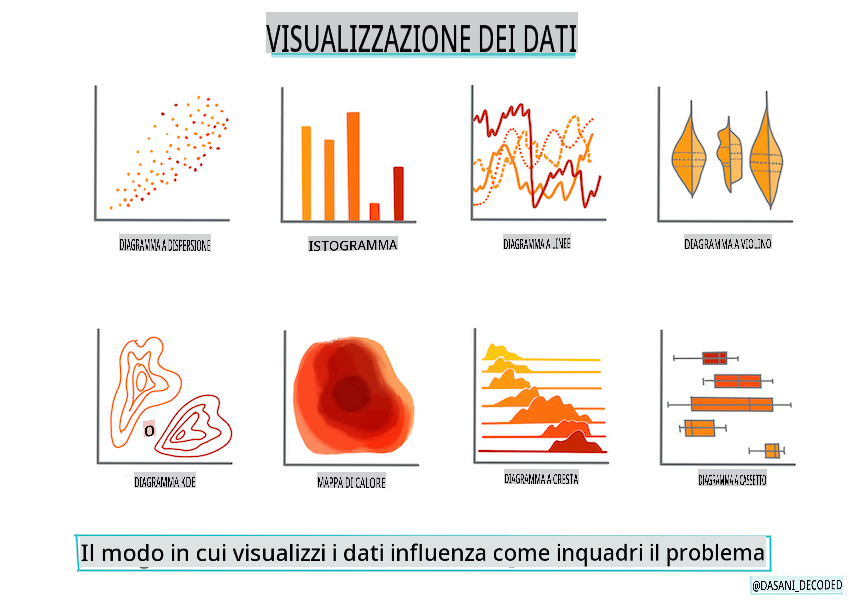

# Costruisci un modello di regressione usando Scikit-learn: prepara e visualizza i dati



Infografica di [Dasani Madipalli](https://twitter.com/dasani_decoded)

## [Quiz pre-lezione](https://gray-sand-07a10f403.1.azurestaticapps.net/quiz/11/)

> ### [Questa lezione è disponibile in R!](../../../../2-Regression/2-Data/solution/R/lesson_2.html)

## Introduzione

Ora che hai a disposizione gli strumenti necessari per iniziare a costruire modelli di machine learning con Scikit-learn, sei pronto per iniziare a fare domande ai tuoi dati. Quando lavori con i dati e applichi soluzioni di ML, è molto importante capire come porre la domanda giusta per sbloccare correttamente il potenziale del tuo dataset.

In questa lezione imparerai:

- Come preparare i tuoi dati per la costruzione di modelli.
- Come usare Matplotlib per la visualizzazione dei dati.

## Porre la domanda giusta ai tuoi dati

La domanda a cui hai bisogno di rispondere determinerà il tipo di algoritmi di ML che utilizzerai. E la qualità della risposta che ottieni sarà fortemente dipendente dalla natura dei tuoi dati.

Dai un'occhiata ai [dati](https://github.com/microsoft/ML-For-Beginners/blob/main/2-Regression/data/US-pumpkins.csv) forniti per questa lezione. Puoi aprire questo file .csv in VS Code. Una rapida occhiata mostra subito che ci sono spazi vuoti e un mix di stringhe e dati numerici. C'è anche una colonna strana chiamata 'Package' dove i dati sono un mix tra 'sacks', 'bins' e altri valori. In effetti, i dati sono un po' un disastro.

[](https://youtu.be/5qGjczWTrDQ "ML per principianti - Come analizzare e pulire un dataset")

> 🎥 Clicca sull'immagine sopra per un breve video su come preparare i dati per questa lezione.

In effetti, non è molto comune ricevere un dataset completamente pronto per essere utilizzato per creare un modello di ML. In questa lezione, imparerai come preparare un dataset grezzo usando librerie Python standard. Imparerai anche varie tecniche per visualizzare i dati.

## Caso di studio: 'il mercato delle zucche'

In questa cartella troverai un file .csv nella cartella principale `data` chiamato [US-pumpkins.csv](https://github.com/microsoft/ML-For-Beginners/blob/main/2-Regression/data/US-pumpkins.csv) che include 1757 righe di dati sul mercato delle zucche, ordinati per città. Questi sono dati grezzi estratti dai [Rapporti Standard dei Mercati Terminali delle Colture Speciali](https://www.marketnews.usda.gov/mnp/fv-report-config-step1?type=termPrice) distribuiti dal Dipartimento dell'Agricoltura degli Stati Uniti.

### Preparazione dei dati

Questi dati sono di dominio pubblico. Possono essere scaricati in molti file separati, per città, dal sito web dell'USDA. Per evitare troppi file separati, abbiamo concatenato tutti i dati delle città in un unico foglio di calcolo, quindi abbiamo già _preparato_ un po' i dati. Ora, diamo un'occhiata più da vicino ai dati.

### I dati delle zucche - prime conclusioni

Cosa noti riguardo a questi dati? Hai già visto che c'è un mix di stringhe, numeri, spazi vuoti e valori strani che devi capire.

Che domanda puoi fare a questi dati, usando una tecnica di Regressione? Che ne dici di "Prevedere il prezzo di una zucca in vendita durante un dato mese". Guardando di nuovo i dati, ci sono alcune modifiche che devi fare per creare la struttura dei dati necessaria per il compito.

## Esercizio - analizzare i dati delle zucche

Usiamo [Pandas](https://pandas.pydata.org/), (il nome sta per `Python Data Analysis`) uno strumento molto utile per modellare i dati, per analizzare e preparare questi dati sulle zucche.

### Prima di tutto, controlla le date mancanti

Per prima cosa dovrai prendere provvedimenti per controllare le date mancanti:

1. Converti le date in un formato mensile (queste sono date statunitensi, quindi il formato è `MM/DD/YYYY`).
2. Estrai il mese in una nuova colonna.

Apri il file _notebook.ipynb_ in Visual Studio Code e importa il foglio di calcolo in un nuovo dataframe Pandas.

1. Usa la funzione `head()` per visualizzare le prime cinque righe.

    ```python
    import pandas as pd
    pumpkins = pd.read_csv('../data/US-pumpkins.csv')
    pumpkins.head()
    ```

    ✅ Quale funzione useresti per visualizzare le ultime cinque righe?

1. Controlla se ci sono dati mancanti nel dataframe corrente:

    ```python
    pumpkins.isnull().sum()
    ```

    Ci sono dati mancanti, ma forse non sarà importante per il compito in questione.

1. Per rendere il tuo dataframe più facile da gestire, seleziona solo le colonne di cui hai bisogno, usando `loc` function which extracts from the original dataframe a group of rows (passed as first parameter) and columns (passed as second parameter). The expression `:` nel caso sotto significa "tutte le righe".

    ```python
    columns_to_select = ['Package', 'Low Price', 'High Price', 'Date']
    pumpkins = pumpkins.loc[:, columns_to_select]
    ```

### Secondo, determina il prezzo medio delle zucche

Pensa a come determinare il prezzo medio di una zucca in un dato mese. Quali colonne sceglieresti per questo compito? Suggerimento: avrai bisogno di 3 colonne.

Soluzione: prendi la media delle colonne `Low Price` and `High Price` per popolare la nuova colonna Price e converti la colonna Date per mostrare solo il mese. Fortunatamente, secondo il controllo sopra, non ci sono dati mancanti per le date o i prezzi.

1. Per calcolare la media, aggiungi il seguente codice:

    ```python
    price = (pumpkins['Low Price'] + pumpkins['High Price']) / 2

    month = pd.DatetimeIndex(pumpkins['Date']).month

    ```

   ✅ Sentiti libero di stampare qualsiasi dato che desideri controllare usando `print(month)`.

2. Ora, copia i tuoi dati convertiti in un nuovo dataframe Pandas:

    ```python
    new_pumpkins = pd.DataFrame({'Month': month, 'Package': pumpkins['Package'], 'Low Price': pumpkins['Low Price'],'High Price': pumpkins['High Price'], 'Price': price})
    ```

    Stampando il tuo dataframe, vedrai un dataset pulito e ordinato su cui puoi costruire il tuo nuovo modello di regressione.

### Ma aspetta! C'è qualcosa di strano qui

Se guardi la colonna `Package` column, pumpkins are sold in many different configurations. Some are sold in '1 1/9 bushel' measures, and some in '1/2 bushel' measures, some per pumpkin, some per pound, and some in big boxes with varying widths.

> Pumpkins seem very hard to weigh consistently

Digging into the original data, it's interesting that anything with `Unit of Sale` equalling 'EACH' or 'PER BIN' also have the `Package` type per inch, per bin, or 'each'. Pumpkins seem to be very hard to weigh consistently, so let's filter them by selecting only pumpkins with the string 'bushel' in their `Package`.

1. Aggiungi un filtro in cima al file, sotto l'importazione iniziale del .csv:

    ```python
    pumpkins = pumpkins[pumpkins['Package'].str.contains('bushel', case=True, regex=True)]
    ```

    Se stampi i dati ora, puoi vedere che stai ottenendo solo circa 415 righe di dati contenenti zucche al bushel.

### Ma aspetta! C'è un'altra cosa da fare

Hai notato che la quantità di bushel varia per riga? Devi normalizzare i prezzi in modo da mostrare il prezzo per bushel, quindi fai qualche calcolo per standardizzarlo.

1. Aggiungi queste righe dopo il blocco che crea il dataframe new_pumpkins:

    ```python
    new_pumpkins.loc[new_pumpkins['Package'].str.contains('1 1/9'), 'Price'] = price/(1 + 1/9)

    new_pumpkins.loc[new_pumpkins['Package'].str.contains('1/2'), 'Price'] = price/(1/2)
    ```

✅ Secondo [The Spruce Eats](https://www.thespruceeats.com/how-much-is-a-bushel-1389308), il peso di un bushel dipende dal tipo di prodotto, poiché è una misura di volume. "Un bushel di pomodori, ad esempio, dovrebbe pesare 56 libbre... Le foglie e le verdure occupano più spazio con meno peso, quindi un bushel di spinaci pesa solo 20 libbre." È tutto piuttosto complicato! Non preoccupiamoci di fare una conversione bushel-libbre e invece calcoliamo il prezzo per bushel. Tutto questo studio sui bushel di zucche, tuttavia, dimostra quanto sia importante capire la natura dei tuoi dati!

Ora, puoi analizzare i prezzi per unità in base alla loro misura di bushel. Se stampi i dati un'altra volta, puoi vedere come sono standardizzati.

✅ Hai notato che le zucche vendute a mezzo bushel sono molto costose? Riesci a capire perché? Suggerimento: le zucche piccole sono molto più costose di quelle grandi, probabilmente perché ce ne sono molte di più per bushel, dato lo spazio inutilizzato occupato da una grande zucca vuota per torta.

## Strategie di visualizzazione

Parte del ruolo del data scientist è dimostrare la qualità e la natura dei dati con cui stanno lavorando. Per fare ciò, spesso creano visualizzazioni interessanti, o grafici, diagrammi e chart, mostrando diversi aspetti dei dati. In questo modo, sono in grado di mostrare visivamente relazioni e lacune che altrimenti sarebbero difficili da scoprire.

[](https://youtu.be/SbUkxH6IJo0 "ML per principianti - Come visualizzare i dati con Matplotlib")

> 🎥 Clicca sull'immagine sopra per un breve video su come visualizzare i dati per questa lezione.

Le visualizzazioni possono anche aiutare a determinare la tecnica di machine learning più appropriata per i dati. Un grafico a dispersione che sembra seguire una linea, ad esempio, indica che i dati sono un buon candidato per un esercizio di regressione lineare.

Una libreria di visualizzazione dei dati che funziona bene nei notebook Jupyter è [Matplotlib](https://matplotlib.org/) (che hai visto anche nella lezione precedente).

> Ottieni più esperienza con la visualizzazione dei dati in [questi tutorial](https://docs.microsoft.com/learn/modules/explore-analyze-data-with-python?WT.mc_id=academic-77952-leestott).

## Esercizio - sperimenta con Matplotlib

Prova a creare alcuni grafici di base per visualizzare il nuovo dataframe che hai appena creato. Cosa mostrerebbe un grafico a linee di base?

1. Importa Matplotlib in cima al file, sotto l'importazione di Pandas:

    ```python
    import matplotlib.pyplot as plt
    ```

1. Rilancia l'intero notebook per aggiornare.
1. In fondo al notebook, aggiungi una cella per tracciare i dati come un box:

    ```python
    price = new_pumpkins.Price
    month = new_pumpkins.Month
    plt.scatter(price, month)
    plt.show()
    ```

    

    Questo grafico è utile? C'è qualcosa che ti sorprende?

    Non è particolarmente utile poiché tutto ciò che fa è mostrare i tuoi dati come una distribuzione di punti in un dato mese.

### Rendilo utile

Per ottenere grafici che mostrino dati utili, di solito è necessario raggruppare i dati in qualche modo. Proviamo a creare un grafico in cui l'asse y mostra i mesi e i dati dimostrano la distribuzione dei dati.

1. Aggiungi una cella per creare un grafico a barre raggruppato:

    ```python
    new_pumpkins.groupby(['Month'])['Price'].mean().plot(kind='bar')
    plt.ylabel("Pumpkin Price")
    ```

    

    Questa è una visualizzazione dei dati più utile! Sembra indicare che il prezzo più alto delle zucche si verifica a settembre e ottobre. Questo soddisfa le tue aspettative? Perché o perché no?

---

## 🚀Sfida

Esplora i diversi tipi di visualizzazione che Matplotlib offre. Quali tipi sono più appropriati per i problemi di regressione?

## [Quiz post-lezione](https://gray-sand-07a10f403.1.azurestaticapps.net/quiz/12/)

## Revisione e studio autonomo

Dai un'occhiata ai molti modi per visualizzare i dati. Fai un elenco delle varie librerie disponibili e annota quali sono le migliori per determinati tipi di compiti, ad esempio visualizzazioni 2D vs. visualizzazioni 3D. Cosa scopri?

## Compito

[Esplorazione della visualizzazione](assignment.md)

**Disclaimer**:
Questo documento è stato tradotto utilizzando servizi di traduzione basati su intelligenza artificiale. Sebbene ci impegniamo per l'accuratezza, si prega di essere consapevoli che le traduzioni automatiche possono contenere errori o imprecisioni. Il documento originale nella sua lingua madre dovrebbe essere considerato la fonte autorevole. Per informazioni critiche, si raccomanda una traduzione professionale umana. Non siamo responsabili per eventuali fraintendimenti o interpretazioni errate derivanti dall'uso di questa traduzione.