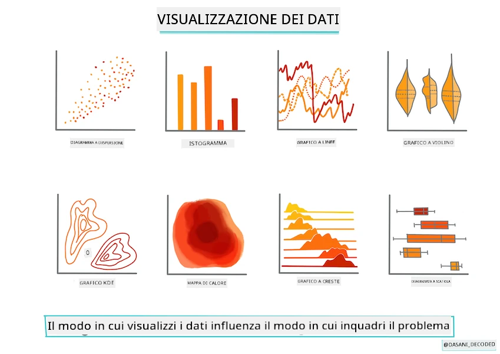
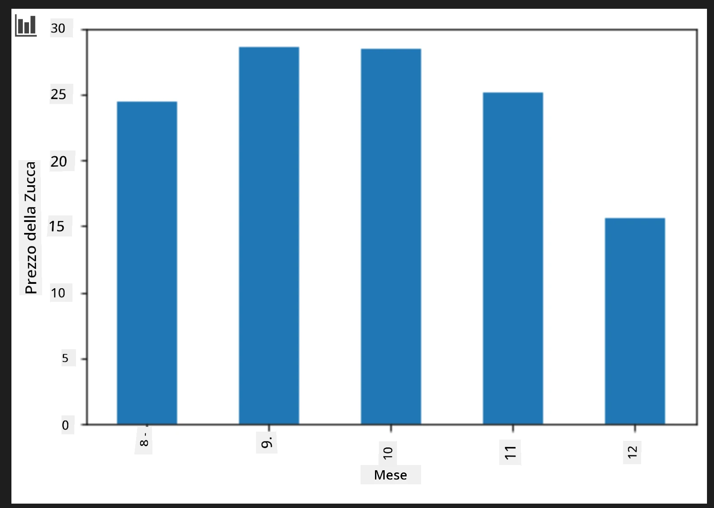
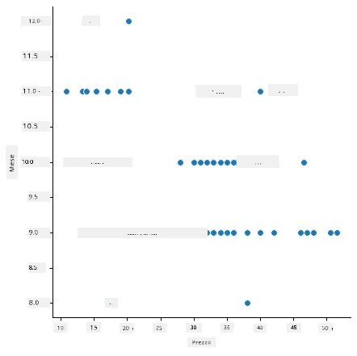
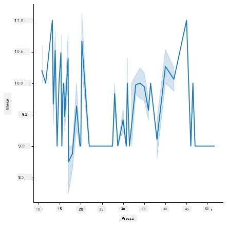
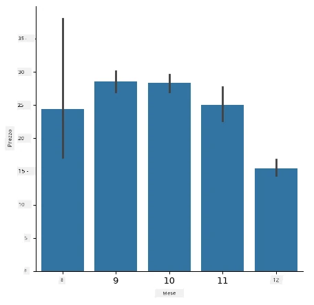
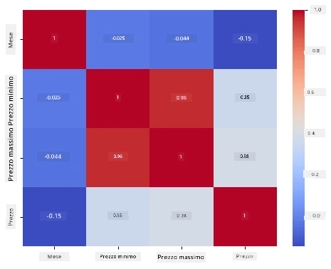

# Costruire un modello di regressione usando Scikit-learn: preparare e visualizzare i dati



Infografica di [Dasani Madipalli](https://twitter.com/dasani_decoded)

## [Quiz prima della lezione](https://ff-quizzes.netlify.app/en/ml/)

> ### [Questa lezione è disponibile in R!](../../../../2-Regression/2-Data/solution/R/lesson_2.html)

## Introduzione

Ora che hai configurato gli strumenti necessari per iniziare a costruire modelli di machine learning con Scikit-learn, sei pronto per iniziare a fare domande ai tuoi dati. Mentre lavori con i dati e applichi soluzioni ML, è molto importante capire come porre la domanda giusta per sbloccare correttamente il potenziale del tuo dataset.

In questa lezione imparerai:

- Come preparare i tuoi dati per la costruzione del modello.
- Come usare Matplotlib per la visualizzazione dei dati.
- Come usare Seaborn per una visualizzazione dei dati più espressiva.

## Porre la domanda giusta ai tuoi dati

La domanda a cui vuoi rispondere determinerà quale tipo di algoritmi di ML utilizzerai. E la qualità della risposta che otterrai dipenderà fortemente dalla natura dei tuoi dati.

Dai un'occhiata ai [dati](https://github.com/microsoft/ML-For-Beginners/blob/main/2-Regression/data/US-pumpkins.csv) forniti per questa lezione. Puoi aprire questo file .csv in VS Code. Un'occhiata veloce mostra immediatamente che ci sono spazi vuoti e una mescolanza di stringhe e dati numerici. C'è anche una colonna strana chiamata 'Package' dove i dati sono un misto tra 'sacchi', 'cassette' e altri valori. I dati, in effetti, sono un po' disordinati.

[](https://youtu.be/5qGjczWTrDQ "ML for beginners - Come analizzare e pulire un dataset")

> 🎥 Clicca sull'immagine sopra per un breve video che mostra come preparare i dati per questa lezione.

In realtà, non è molto comune ricevere un dataset completamente pronto all'uso per creare un modello ML già pronto. In questa lezione, imparerai come preparare un dataset grezzo usando le librerie standard di Python. Imparerai anche diverse tecniche per visualizzare i dati.

## Caso di studio: 'il mercato delle zucche'

In questa cartella troverai un file .csv nella cartella principale `data` chiamato [US-pumpkins.csv](https://github.com/microsoft/ML-For-Beginners/blob/main/2-Regression/data/US-pumpkins.csv) che include 1757 righe di dati sul mercato delle zucche, raggruppate per città. Questi sono dati grezzi estratti dai [Rapporti Standard dei Mercati Terminali delle Colture Speciali](https://www.marketnews.usda.gov/mnp/fv-report-config-step1?type=termPrice) distribuiti dal Dipartimento dell'Agricoltura degli Stati Uniti.

### Preparare i dati

Questi dati sono di dominio pubblico. Possono essere scaricati in molti file separati, per città, dal sito USDA. Per evitare troppi file separati, abbiamo concatenato tutti i dati delle città in un unico foglio di calcolo, quindi abbiamo già un po’ _preparato_ i dati. Ora, diamo un’occhiata più da vicino ai dati.

### I dati sulle zucche - prime conclusioni

Cosa noti di questi dati? Hai già visto che c’è una mescolanza di stringhe, numeri, spazi vuoti e valori strani che devi interpretare.

Quale domanda puoi porre a questi dati, usando una tecnica di Regressione? Che ne dici di "Prevedere il prezzo di una zucca in vendita durante un dato mese". Guardando di nuovo i dati, ci sono alcune modifiche da fare per creare la struttura dati necessaria per questo compito.
## Esercizio - analizza i dati delle zucche

Usamo [Pandas](https://pandas.pydata.org/) (il nome sta per `Python Data Analysis`), uno strumento molto utile per modellare i dati, per analizzare e preparare questi dati sulle zucche.

### Prima, verifica la presenza di date mancanti

Prima devi prendere provvedimenti per controllare la presenza di date mancanti:

1. Converti le date in un formato mese (sono date USA, quindi il formato è `MM/DD/YYYY`).
2. Estrai il mese in una nuova colonna.

Apri il file _notebook.ipynb_ in Visual Studio Code e importa il foglio di calcolo in un nuovo dataframe Pandas.

1. Usa la funzione `head()` per vedere le prime cinque righe.

    ```python
    import pandas as pd
    pumpkins = pd.read_csv('../data/US-pumpkins.csv')
    pumpkins.head()
    ```

    ✅ Quale funzione useresti per vedere le ultime cinque righe?

1. Controlla se ci sono dati mancanti nel dataframe corrente:

    ```python
    pumpkins.isnull().sum()
    ```

    Ci sono dati mancanti, ma forse non influiranno sul compito assegnato.

1. Per rendere il dataframe più facile da gestire, seleziona solo le colonne necessarie, usando la funzione `loc` che estrae dal dataframe originale un gruppo di righe (passate come primo parametro) e colonne (passate come secondo parametro). L'espressione `:` nel caso sotto significa "tutte le righe".

    ```python
    columns_to_select = ['Package', 'Low Price', 'High Price', 'Date']
    pumpkins = pumpkins.loc[:, columns_to_select]
    ```

### Secondo, determina il prezzo medio della zucca

Pensa a come determinare il prezzo medio di una zucca in un dato mese. Quali colonne sceglieresti per questo compito? Suggerimento: ti servono 3 colonne.

Soluzione: prendi la media delle colonne `Low Price` e `High Price` per popolare la nuova colonna Price e converti la colonna Date per mostrare solo il mese. Fortunatamente, come risulta dal controllo sopra, non ci sono dati mancanti per date o prezzi.

1. Per calcolare la media, aggiungi il seguente codice:

    ```python
    price = (pumpkins['Low Price'] + pumpkins['High Price']) / 2

    month = pd.DatetimeIndex(pumpkins['Date']).month

    ```

   ✅ Sentiti libero di stampare qualsiasi dato desideri controllare usando `print(month)`.

2. Ora, copia i dati convertiti in un nuovo dataframe Pandas pulito:

    ```python
    new_pumpkins = pd.DataFrame({'Month': month, 'Package': pumpkins['Package'], 'Low Price': pumpkins['Low Price'],'High Price': pumpkins['High Price'], 'Price': price})
    ```

    Stampare il dataframe mostra un dataset pulito e ordinato su cui puoi costruire il tuo nuovo modello di regressione.

### Ma aspetta! C’è qualcosa di strano qui

Se guardi la colonna `Package`, le zucche sono vendute in molte configurazioni diverse. Alcune sono vendute in misure '1 1/9 bushel', altre in '1/2 bushel', alcune per zucca, altre per libbra, e altre in grandi scatole di larghezze variabili.

> Le zucche sembrano molto difficili da pesare in modo coerente

Analizzando i dati originali, è interessante notare che tutto ciò che ha `Unit of Sale` uguale a 'EACH' o 'PER BIN' ha anche il tipo di `Package` per pollice, per cassetta o 'per unità'. Le zucche sembrano molto difficili da pesare in modo coerente, quindi filtra selezionando solo le zucche con la stringa 'bushel' nella colonna `Package`.

1. Aggiungi un filtro in cima al file, sotto l'importazione iniziale del file .csv:

    ```python
    pumpkins = pumpkins[pumpkins['Package'].str.contains('bushel', case=True, regex=True)]
    ```

    Se stampi i dati ora, vedrai che stai ottenendo solo le circa 415 righe di dati che contengono zucche per bushel.

### Ma aspetta! C'è un'altra cosa da fare

Hai notato che la quantità di bushel varia per riga? Devi normalizzare il prezzo perché venga mostrato il prezzo per bushel, quindi fai qualche calcolo per standardizzarlo.

1. Aggiungi queste righe dopo il blocco che crea il dataframe new_pumpkins:

    ```python
    new_pumpkins.loc[new_pumpkins['Package'].str.contains('1 1/9'), 'Price'] = price/(1 + 1/9)

    new_pumpkins.loc[new_pumpkins['Package'].str.contains('1/2'), 'Price'] = price/(1/2)
    ```

✅ Secondo [The Spruce Eats](https://www.thespruceeats.com/how-much-is-a-bushel-1389308), il peso di un bushel dipende dal tipo di prodotto, dato che è una misura di volume. "Un bushel di pomodori, per esempio, dovrebbe pesare 56 libbre... Le foglie e le verdure occupano più spazio con meno peso, quindi un bushel di spinaci pesa solo 20 libbre." È tutto piuttosto complicato! Non ci preoccuperemo di fare una conversione bushel-libbra, e invece prezzare per bushel. Tutto questo studio sui bushel di zucche, comunque, dimostra quanto sia molto importante capire la natura dei tuoi dati!

Ora, puoi analizzare il prezzo per unità basato sulla loro misura di bushel. Se stampi nuovamente i dati, puoi vedere come è standardizzato.

✅ Hai notato che le zucche vendute a mezzo bushel sono molto costose? Riesci a capire perché? Suggerimento: le zucche piccole sono molto più costose di quelle grandi, probabilmente perché ce ne sono molte di più per bushel, considerando lo spazio inutilizzato occupato da una zucca cavo grande da torta.

## Strategie di visualizzazione

Parte del ruolo dello scienziato dei dati è dimostrare la qualità e la natura dei dati con cui lavora. Per farlo, spesso crea visualizzazioni interessanti, come grafici, diagrammi e tabelle, che mostrano diversi aspetti dei dati. In questo modo, è possibile mostrare visivamente relazioni e lacune difficili da scoprire altrimenti.

[](https://youtu.be/SbUkxH6IJo0 "ML for beginners - Come visualizzare i dati con Matplotlib")

> 🎥 Clicca sull'immagine sopra per un breve video che mostra come visualizzare i dati per questa lezione.

Le visualizzazioni possono anche aiutare a determinare la tecnica di machine learning più appropriata per i dati. Un grafico a dispersione che sembra seguire una linea, per esempio, indica che i dati sono un buon candidato per un esercizio di regressione lineare.

Una libreria di visualizzazione dei dati che funziona bene nei notebook Jupyter è [Matplotlib](https://matplotlib.org/) (che hai già visto nella lezione precedente).

> Acquisisci più esperienza con la visualizzazione dei dati in [questi tutorial](https://docs.microsoft.com/learn/modules/explore-analyze-data-with-python?WT.mc_id=academic-77952-leestott).

## Esercizio - sperimenta con Matplotlib

Prova a creare dei grafici base per visualizzare il nuovo dataframe che hai appena creato. Cosa mostrerà un grafico a linee base?

1. Importa Matplotlib in cima al file, sotto l'importazione di Pandas:

    ```python
    import matplotlib.pyplot as plt
    ```

1. Esegui nuovamente tutto il notebook per aggiornarlo.
1. In fondo al notebook, aggiungi una cella per tracciare i dati come boxplot:

    ```python
    price = new_pumpkins.Price
    month = new_pumpkins.Month
    plt.scatter(price, month)
    plt.show()
    ```

    

    È un grafico utile? C'è qualcosa che ti sorprende?

    Non è particolarmente utile dato che mostra solo i tuoi dati come una dispersione di punti in un dato mese.

### Rendilo utile

Per ottenere grafici che mostrino dati utili, di solito devi raggruppare i dati in qualche modo. Proviamo a creare un grafico dove l'asse y mostra i mesi e i dati dimostrano la distribuzione.

1. Aggiungi una cella per creare un grafico a barre raggruppato:

    ```python
    new_pumpkins.groupby(['Month'])['Price'].mean().plot(kind='bar')
    plt.ylabel("Pumpkin Price")
    ```

    

    Questa è una visualizzazione dei dati più utile! Sembra indicare che il prezzo più alto per le zucche si verifica a settembre e ottobre. Corrisponde alle tue aspettative? Perché sì o perché no?

## Esercizio - sperimenta con Seaborn

Matplotlib è potente, ma può richiedere molto codice per produrre un grafico rifinito. [Seaborn](https://seaborn.pydata.org/) è una libreria costruita _sopra_ Matplotlib progettata per la visualizzazione statistica dei dati. Lavora direttamente con i dataframe Pandas, applica stili predefiniti accattivanti e ti permette di creare grafici informativi con molto meno codice. Poiché Seaborn restituisce oggetti Matplotlib, puoi ancora usare tutto ciò che già sai su Matplotlib per perfezionare il risultato.

> Se non hai ancora installato Seaborn, installalo con `pip install seaborn`.

1. Importa Seaborn in cima al notebook, sotto gli altri import. Convenzionalmente è importato come `sns`:

    ```python
    import seaborn as sns
    ```

### Grafici a dispersione per mostrare relazioni

Una parte importante dell’esplorazione dei dati prima di costruire un modello è cercare _relazioni_ tra variabili. Un [grafico a dispersione](https://en.wikipedia.org/wiki/Scatter_plot) è uno dei migliori strumenti per questo: se i punti sembrano seguire una linea, le due variabili potrebbero essere correlate, il che è un buon segno che un modello di regressione lineare potrebbe funzionare.

1. Ricrea il grafico prezzo-mese a dispersione di prima, questa volta usando [`relplot()`](https://seaborn.pydata.org/generated/seaborn.relplot.html) di Seaborn (grafico relazionale), che lavora direttamente con le colonne del tuo dataframe:

    ```python
    sns.relplot(x="Price", y="Month", data=new_pumpkins)
    ```

    

    Nota come passi i _nomi delle colonne_ e il dataframe, e Seaborn si occupa delle etichette degli assi per te.

2. Puoi passare a un grafico a linee passando `kind="line"`. Seaborn disegna anche una banda sfumata che mostra l'intervallo di confidenza attorno alla linea:

    ```python
    sns.relplot(x="Price", y="Month", kind="line", data=new_pumpkins)
    ```

    

    Questi dati sono abbastanza rumorosi, quindi un grafico a linee non è la scelta più chiara qui — ma mostra quanto facilmente puoi cambiare tipo di grafico in Seaborn.

### Grafici a barre per mostrare distribuzioni


In precedenza hai raggruppato manualmente i dati per creare un grafico a barre con Matplotlib. [`catplot()`](https://seaborn.pydata.org/generated/seaborn.catplot.html) di Seaborn (grafico categorico) può fare il raggruppamento e l'aggregazione per te. Per impostazione predefinita, `kind="bar"` mostra la media di ogni categoria insieme a una linea nera che indica l'intervallo di confidenza.

1. Crea un grafico a barre del prezzo medio per mese:

    ```python
    sns.catplot(x="Month", y="Price", data=new_pumpkins, kind="bar")
    ```

    

    Questo conferma ciò che hai visto con Matplotlib — i prezzi raggiungono il picco intorno a settembre e ottobre — ma Seaborn visualizza anche quanto il prezzo _varia_ all'interno di ogni mese.

### Mappe di calore per mostrare le correlazioni

I grafici a dispersione confrontano due variabili alla volta. Quando hai diverse colonne numeriche, una [heatmap](https://en.wikipedia.org/wiki/Heat_map) ti permette di visualizzare la forza della relazione tra _ogni_ coppia di colonne contemporaneamente. Questo è un modo comune per individuare quali caratteristiche sono più correlate prima di scegliere cosa inserire in un modello (e lo stesso tipo di grafico viene poi utilizzato per mostrare matrici di confusione nella classificazione).

1. Costruisci una matrice di correlazione con Pandas, poi disegnala con [`heatmap()`](https://seaborn.pydata.org/generated/seaborn.heatmap.html) di Seaborn. L'opzione `annot=True` stampa i valori di correlazione in ogni cella:

    ```python
    correlations = new_pumpkins[['Month', 'Low Price', 'High Price', 'Price']].corr()
    sns.heatmap(correlations, annot=True, cmap="coolwarm")
    ```

    

    Valori vicini a `1` (o `-1`) significano che le colonne sono fortemente correlate _linearmente_. Nota come `Low Price` e `High Price` siano quasi perfettamente correlate. `Month`, invece, mostra solo una debole correlazione lineare con il prezzo — anche se il grafico a barre sopra ha rivelato un chiaro picco stagionale a settembre e ottobre. Questa è una lezione importante: il coefficiente di correlazione misura solo relazioni _lineari_, quindi può perdere schemi stagionali o non lineari. ✅ Perché è utile guardare sia una heatmap *che* grafici come quello a barre prima di decidere quali colonne usare?

### Matplotlib o Seaborn?

Entrambe le librerie vale la pena conoscerle:

- **Matplotlib** ti dà un controllo dettagliato su ogni elemento di un grafico ed è la base su cui si costruiscono quasi tutte le altre librerie di plotting Python.
- **Seaborn** fornisce funzioni di livello superiore e impostazioni predefinite attraenti per grafici statistici, lavora direttamente con i dataframe ed è spesso più veloce per l'analisi esplorativa dei dati.

Un flusso di lavoro comune è usare Seaborn per esplorare rapidamente i dati, poi passare a Matplotlib quando è necessario personalizzare i dettagli.

---

## 🚀Sfida

Esplora i diversi tipi di visualizzazioni offerte da Matplotlib e Seaborn. Quali tipi sono più appropriati per problemi di regressione?

## [Quiz post-lezione](https://ff-quizzes.netlify.app/en/ml/)

## Revisione & Studio individuale

Dai un'occhiata ai tanti modi per visualizzare i dati. Fai una lista delle varie librerie disponibili e annota quali sono le migliori per tipi di compiti specifici, per esempio visualizzazioni 2D vs. 3D. Cosa scopri?

## Compito

[Esplorare la visualizzazione](assignment.md)

---

<!-- CO-OP TRANSLATOR DISCLAIMER START -->
**Disclaimer**:
Questo documento è stato tradotto utilizzando il servizio di traduzione AI [Co-op Translator](https://github.com/Azure/co-op-translator). Sebbene ci impegniamo per garantire la precisione, si prega di notare che le traduzioni automatizzate possono contenere errori o imprecisioni. Il documento originale nella sua lingua nativa deve essere considerato la fonte autorevole. Per informazioni critiche, si raccomanda una traduzione professionale effettuata da un essere umano. Non siamo responsabili per eventuali malintesi o interpretazioni errate derivanti dall’uso di questa traduzione.
<!-- CO-OP TRANSLATOR DISCLAIMER END -->