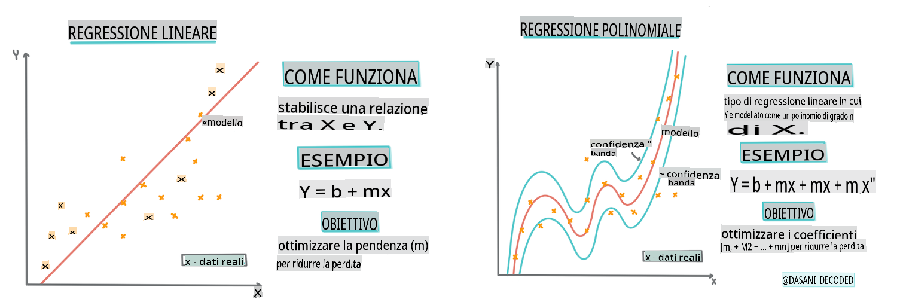
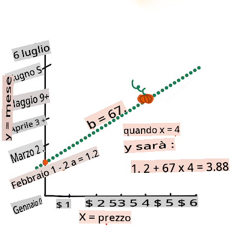

# Costruire un modello di regressione usando Scikit-learn: quattro modi di fare regressione


> Infografica di [Dasani Madipalli](https://twitter.com/dasani_decoded)
## [Quiz pre-lezione](https://gray-sand-07a10f403.1.azurestaticapps.net/quiz/13/)

> ### [Questa lezione è disponibile in R!](../../../../2-Regression/3-Linear/solution/R/lesson_3.html)
### Introduzione

Finora hai esplorato cosa sia la regressione con dati di esempio raccolti dal dataset dei prezzi delle zucche che useremo durante questa lezione. Hai anche visualizzato questi dati usando Matplotlib.

Ora sei pronto per approfondire la regressione per il Machine Learning. Mentre la visualizzazione ti permette di comprendere i dati, il vero potere del Machine Learning deriva dall'addestramento dei modelli. I modelli vengono addestrati su dati storici per catturare automaticamente le dipendenze dei dati e ti permettono di prevedere i risultati per nuovi dati che il modello non ha mai visto prima.

In questa lezione, imparerai di più su due tipi di regressione: _regressione lineare di base_ e _regressione polinomiale_, insieme ad alcune delle matematiche sottostanti queste tecniche. Questi modelli ci permetteranno di prevedere i prezzi delle zucche in base a diversi dati di input.

[](https://youtu.be/CRxFT8oTDMg "ML per principianti - Comprendere la Regressione Lineare")

> 🎥 Clicca sull'immagine sopra per una breve panoramica sulla regressione lineare.

> In tutto questo curriculum, assumiamo una conoscenza minima della matematica e cerchiamo di renderla accessibile per gli studenti provenienti da altri campi, quindi presta attenzione alle note, 🧮 callout, diagrammi e altri strumenti di apprendimento per aiutare nella comprensione.

### Prerequisiti

Dovresti essere ormai familiare con la struttura dei dati delle zucche che stiamo esaminando. Puoi trovarli pre-caricati e pre-puliti nel file _notebook.ipynb_ di questa lezione. Nel file, il prezzo delle zucche è mostrato per bushel in un nuovo dataframe. Assicurati di poter eseguire questi notebook nei kernel in Visual Studio Code.

### Preparazione

Come promemoria, stai caricando questi dati per fare delle domande su di essi.

- Qual è il momento migliore per comprare zucche?
- Quale prezzo posso aspettarmi per una cassa di zucche in miniatura?
- Dovrei comprarle in cesti da mezzo bushel o in scatole da 1 1/9 bushel?
Continuiamo a scavare in questi dati.

Nella lezione precedente, hai creato un dataframe Pandas e lo hai popolato con parte del dataset originale, standardizzando i prezzi per bushel. Facendo così, tuttavia, sei riuscito a raccogliere solo circa 400 punti dati e solo per i mesi autunnali.

Dai un'occhiata ai dati che abbiamo pre-caricato nel notebook allegato a questa lezione. I dati sono pre-caricati e un primo scatterplot è tracciato per mostrare i dati mensili. Forse possiamo ottenere un po' più di dettaglio sulla natura dei dati pulendoli ulteriormente.

## Una linea di regressione lineare

Come hai appreso nella Lezione 1, l'obiettivo di un esercizio di regressione lineare è essere in grado di tracciare una linea per:

- **Mostrare le relazioni tra le variabili**. Mostrare la relazione tra le variabili
- **Fare previsioni**. Fare previsioni accurate su dove un nuovo punto dati cadrebbe in relazione a quella linea.

È tipico della **Regressione dei Minimi Quadrati** tracciare questo tipo di linea. Il termine 'minimi quadrati' significa che tutti i punti dati che circondano la linea di regressione vengono quadrati e poi sommati. Idealmente, quella somma finale è il più piccola possibile, perché vogliamo un numero basso di errori, o `least-squares`.

Facciamo così poiché vogliamo modellare una linea che abbia la minima distanza cumulativa da tutti i nostri punti dati. Inoltre, quadratiamo i termini prima di aggiungerli poiché siamo interessati alla loro grandezza piuttosto che alla loro direzione.

> **🧮 Mostrami la matematica**
>
> Questa linea, chiamata _linea di miglior adattamento_ può essere espressa da [un'equazione](https://en.wikipedia.org/wiki/Simple_linear_regression):
>
> ```
> Y = a + bX
> ```
>
> `X` is the 'explanatory variable'. `Y` is the 'dependent variable'. The slope of the line is `b` and `a` is the y-intercept, which refers to the value of `Y` when `X = 0`. 
>
>
>
> First, calculate the slope `b`. Infographic by [Jen Looper](https://twitter.com/jenlooper)
>
> In other words, and referring to our pumpkin data's original question: "predict the price of a pumpkin per bushel by month", `X` would refer to the price and `Y` would refer to the month of sale. 
>
>
>
> Calculate the value of Y. If you're paying around $4, it must be April! Infographic by [Jen Looper](https://twitter.com/jenlooper)
>
> The math that calculates the line must demonstrate the slope of the line, which is also dependent on the intercept, or where `Y` is situated when `X = 0`.
>
> You can observe the method of calculation for these values on the [Math is Fun](https://www.mathsisfun.com/data/least-squares-regression.html) web site. Also visit [this Least-squares calculator](https://www.mathsisfun.com/data/least-squares-calculator.html) to watch how the numbers' values impact the line.

## Correlation

One more term to understand is the **Correlation Coefficient** between given X and Y variables. Using a scatterplot, you can quickly visualize this coefficient. A plot with datapoints scattered in a neat line have high correlation, but a plot with datapoints scattered everywhere between X and Y have a low correlation.

A good linear regression model will be one that has a high (nearer to 1 than 0) Correlation Coefficient using the Least-Squares Regression method with a line of regression.

✅ Run the notebook accompanying this lesson and look at the Month to Price scatterplot. Does the data associating Month to Price for pumpkin sales seem to have high or low correlation, according to your visual interpretation of the scatterplot? Does that change if you use more fine-grained measure instead of `Month`, eg. *day of the year* (i.e. number of days since the beginning of the year)?

In the code below, we will assume that we have cleaned up the data, and obtained a data frame called `new_pumpkins`, similar to the following:

ID | Month | DayOfYear | Variety | City | Package | Low Price | High Price | Price
---|-------|-----------|---------|------|---------|-----------|------------|-------
70 | 9 | 267 | PIE TYPE | BALTIMORE | 1 1/9 bushel cartons | 15.0 | 15.0 | 13.636364
71 | 9 | 267 | PIE TYPE | BALTIMORE | 1 1/9 bushel cartons | 18.0 | 18.0 | 16.363636
72 | 10 | 274 | PIE TYPE | BALTIMORE | 1 1/9 bushel cartons | 18.0 | 18.0 | 16.363636
73 | 10 | 274 | PIE TYPE | BALTIMORE | 1 1/9 bushel cartons | 17.0 | 17.0 | 15.454545
74 | 10 | 281 | PIE TYPE | BALTIMORE | 1 1/9 bushel cartons | 15.0 | 15.0 | 13.636364

> The code to clean the data is available in [`notebook.ipynb`](../../../../2-Regression/3-Linear/notebook.ipynb). We have performed the same cleaning steps as in the previous lesson, and have calculated `DayOfYear` colonna usando la seguente espressione:

```python
day_of_year = pd.to_datetime(pumpkins['Date']).apply(lambda dt: (dt-datetime(dt.year,1,1)).days)
```

Ora che hai compreso la matematica dietro la regressione lineare, creiamo un modello di Regressione per vedere se possiamo prevedere quale pacchetto di zucche avrà i migliori prezzi delle zucche. Qualcuno che acquista zucche per un campo di zucche per le vacanze potrebbe voler avere questa informazione per ottimizzare i propri acquisti di pacchetti di zucche per il campo.

## Cercare la Correlazione

[](https://youtu.be/uoRq-lW2eQo "ML per principianti - Cercare la Correlazione: La Chiave per la Regressione Lineare")

> 🎥 Clicca sull'immagine sopra per una breve panoramica sulla correlazione.

Dalla lezione precedente hai probabilmente visto che il prezzo medio per i diversi mesi appare così:


Questo suggerisce che ci dovrebbe essere una certa correlazione, e possiamo provare ad addestrare un modello di regressione lineare per prevedere la relazione tra `Month` and `Price`, or between `DayOfYear` and `Price`. Here is the scatter plot that shows the latter relationship:

 

Let's see if there is a correlation using the `corr` funzione:

```python
print(new_pumpkins['Month'].corr(new_pumpkins['Price']))
print(new_pumpkins['DayOfYear'].corr(new_pumpkins['Price']))
```

Sembra che la correlazione sia piuttosto bassa, -0.15 da `Month` and -0.17 by the `DayOfMonth`, but there could be another important relationship. It looks like there are different clusters of prices corresponding to different pumpkin varieties. To confirm this hypothesis, let's plot each pumpkin category using a different color. By passing an `ax` parameter to the `scatter` funzione di tracciamento possiamo tracciare tutti i punti sullo stesso grafico:

```python
ax=None
colors = ['red','blue','green','yellow']
for i,var in enumerate(new_pumpkins['Variety'].unique()):
    df = new_pumpkins[new_pumpkins['Variety']==var]
    ax = df.plot.scatter('DayOfYear','Price',ax=ax,c=colors[i],label=var)
```


La nostra indagine suggerisce che la varietà ha più effetto sul prezzo complessivo rispetto alla data effettiva di vendita. Possiamo vedere questo con un grafico a barre:

```python
new_pumpkins.groupby('Variety')['Price'].mean().plot(kind='bar')
```


Concentriamoci per il momento solo su una varietà di zucca, il 'tipo torta', e vediamo quale effetto ha la data sul prezzo:

```python
pie_pumpkins = new_pumpkins[new_pumpkins['Variety']=='PIE TYPE']
pie_pumpkins.plot.scatter('DayOfYear','Price') 
```


Se ora calcoliamo la correlazione tra `Price` and `DayOfYear` using `corr` function, we will get something like `-0.27` - il che significa che addestrare un modello predittivo ha senso.

> Prima di addestrare un modello di regressione lineare, è importante assicurarsi che i nostri dati siano puliti. La regressione lineare non funziona bene con valori mancanti, quindi ha senso eliminare tutte le celle vuote:

```python
pie_pumpkins.dropna(inplace=True)
pie_pumpkins.info()
```

Un altro approccio sarebbe riempire quei valori vuoti con valori medi dalla colonna corrispondente.

## Regressione Lineare Semplice

[](https://youtu.be/e4c_UP2fSjg "ML per principianti - Regressione Lineare e Polinomiale usando Scikit-learn")

> 🎥 Clicca sull'immagine sopra per una breve panoramica sulla regressione lineare e polinomiale.

Per addestrare il nostro modello di Regressione Lineare, useremo la libreria **Scikit-learn**.

```python
from sklearn.linear_model import LinearRegression
from sklearn.metrics import mean_squared_error
from sklearn.model_selection import train_test_split
```

Iniziamo separando i valori di input (caratteristiche) e l'output atteso (etichetta) in array numpy separati:

```python
X = pie_pumpkins['DayOfYear'].to_numpy().reshape(-1,1)
y = pie_pumpkins['Price']
```

> Nota che abbiamo dovuto eseguire `reshape` sui dati di input affinché il pacchetto di Regressione Lineare li comprenda correttamente. La Regressione Lineare si aspetta un array 2D come input, dove ogni riga dell'array corrisponde a un vettore di caratteristiche di input. Nel nostro caso, poiché abbiamo solo un input, abbiamo bisogno di un array con forma N×1, dove N è la dimensione del dataset.

Poi, dobbiamo dividere i dati in dataset di addestramento e di test, in modo da poter validare il nostro modello dopo l'addestramento:

```python
X_train, X_test, y_train, y_test = train_test_split(X, y, test_size=0.2, random_state=0)
```

Infine, l'addestramento del vero e proprio modello di Regressione Lineare richiede solo due righe di codice. Definiamo il metodo `LinearRegression` object, and fit it to our data using the `fit`:

```python
lin_reg = LinearRegression()
lin_reg.fit(X_train,y_train)
```

Il `LinearRegression` object after `fit`-ting contains all the coefficients of the regression, which can be accessed using `.coef_` property. In our case, there is just one coefficient, which should be around `-0.017`. It means that prices seem to drop a bit with time, but not too much, around 2 cents per day. We can also access the intersection point of the regression with Y-axis using `lin_reg.intercept_` - it will be around `21` nel nostro caso, indicando il prezzo all'inizio dell'anno.

Per vedere quanto è accurato il nostro modello, possiamo prevedere i prezzi su un dataset di test, e poi misurare quanto le nostre previsioni siano vicine ai valori attesi. Questo può essere fatto usando la metrica dell'errore quadratico medio (MSE), che è la media di tutte le differenze quadrate tra il valore atteso e quello previsto.

```python
pred = lin_reg.predict(X_test)

mse = np.sqrt(mean_squared_error(y_test,pred))
print(f'Mean error: {mse:3.3} ({mse/np.mean(pred)*100:3.3}%)')
```

Il nostro errore sembra essere intorno ai 2 punti, che è ~17%. Non troppo buono. Un altro indicatore della qualità del modello è il **coefficiente di determinazione**, che può essere ottenuto così:

```python
score = lin_reg.score(X_train,y_train)
print('Model determination: ', score)
```
Se il valore è 0, significa che il modello non tiene conto dei dati di input e agisce come il *peggior predittore lineare*, che è semplicemente un valore medio del risultato. Il valore di 1 significa che possiamo prevedere perfettamente tutti gli output attesi. Nel nostro caso, il coefficiente è intorno a 0.06, che è piuttosto basso.

Possiamo anche tracciare i dati di test insieme alla linea di regressione per vedere meglio come funziona la regressione nel nostro caso:

```python
plt.scatter(X_test,y_test)
plt.plot(X_test,pred)
```


## Regressione Polinomiale

Un altro tipo di Regressione Lineare è la Regressione Polinomiale. Mentre a volte c'è una relazione lineare tra le variabili - più grande è la zucca in volume, più alto è il prezzo - a volte queste relazioni non possono essere tracciate come un piano o una linea retta.

✅ Ecco [alcuni esempi](https://online.stat.psu.edu/stat501/lesson/9/9.8) di dati che potrebbero usare la Regressione Polinomiale

Dai un'altra occhiata alla relazione tra Data e Prezzo. Questo scatterplot sembra necessariamente essere analizzato con una linea retta? I prezzi non possono fluttuare? In questo caso, puoi provare la regressione polinomiale.

✅ I polinomi sono espressioni matematiche che potrebbero consistere in una o più variabili e coefficienti

La regressione polinomiale crea una linea curva per adattarsi meglio ai dati non lineari. Nel nostro caso, se includiamo una variabile quadrata `DayOfYear` nei dati di input, dovremmo essere in grado di adattare i nostri dati con una curva parabolica, che avrà un minimo in un certo punto dell'anno.

Scikit-learn include una utile [API pipeline](https://scikit-learn.org/stable/modules/generated/sklearn.pipeline.make_pipeline.html?highlight=pipeline#sklearn.pipeline.make_pipeline) per combinare diversi passaggi di elaborazione dei dati insieme. Una **pipeline** è una catena di **stimatori**. Nel nostro caso, creeremo una pipeline che prima aggiunge caratteristiche polinomiali al nostro modello, e poi addestra la regressione:

```python
from sklearn.preprocessing import PolynomialFeatures
from sklearn.pipeline import make_pipeline

pipeline = make_pipeline(PolynomialFeatures(2), LinearRegression())

pipeline.fit(X_train,y_train)
```

Usando `PolynomialFeatures(2)` means that we will include all second-degree polynomials from the input data. In our case it will just mean `DayOfYear`<sup>2</sup>, but given two input variables X and Y, this will add X<sup>2</sup>, XY and Y<sup>2</sup>. We may also use higher degree polynomials if we want.

Pipelines can be used in the same manner as the original `LinearRegression` object, i.e. we can `fit` the pipeline, and then use `predict` to get the prediction results. Here is the graph showing test data, and the approximation curve:


Using Polynomial Regression, we can get slightly lower MSE and higher determination, but not significantly. We need to take into account other features!

> You can see that the minimal pumpkin prices are observed somewhere around Halloween. How can you explain this? 

🎃 Congratulations, you just created a model that can help predict the price of pie pumpkins. You can probably repeat the same procedure for all pumpkin types, but that would be tedious. Let's learn now how to take pumpkin variety into account in our model!

## Categorical Features

In the ideal world, we want to be able to predict prices for different pumpkin varieties using the same model. However, the `Variety` column is somewhat different from columns like `Month`, because it contains non-numeric values. Such columns are called **categorical**.

[](https://youtu.be/DYGliioIAE0 "ML for beginners - Categorical Feature Predictions with Linear Regression")

> 🎥 Click the image above for a short video overview of using categorical features.

Here you can see how average price depends on variety:


To take variety into account, we first need to convert it to numeric form, or **encode** it. There are several way we can do it:

* Simple **numeric encoding** will build a table of different varieties, and then replace the variety name by an index in that table. This is not the best idea for linear regression, because linear regression takes the actual numeric value of the index, and adds it to the result, multiplying by some coefficient. In our case, the relationship between the index number and the price is clearly non-linear, even if we make sure that indices are ordered in some specific way.
* **One-hot encoding** will replace the `Variety` column by 4 different columns, one for each variety. Each column will contain `1` if the corresponding row is of a given variety, and `0` altrimenti. Questo significa che ci saranno quattro coefficienti nella regressione lineare, uno per ogni varietà di zucca, responsabile del "prezzo iniziale" (o piuttosto "prezzo aggiuntivo") per quella particolare varietà.

Il codice qui sotto mostra come possiamo codificare una varietà con one-hot encoding:

```python
pd.get_dummies(new_pumpkins['Variety'])
```

 ID | FAIRYTALE | MINIATURE | MIXED HEIRLOOM VARIETIES | PIE TYPE
----|-----------|-----------|--------------------------|----------
70 | 0 | 0 | 0 | 1
71 | 0 | 0 | 0 | 1
... | ... | ... | ... | ...
1738 | 0 | 1 | 0 | 0
1739 | 0 | 1 | 0 | 0
1740 | 0 | 1 | 0 | 0
1741 | 0 | 1 | 0 | 0
1742 | 0 | 1 | 0 | 0

Per addestrare la regressione lineare usando la varietà codificata con one-hot come input, dobbiamo solo inizializzare correttamente i dati `X` and `y`:

```python
X = pd.get_dummies(new_pumpkins['Variety'])
y = new_pumpkins['Price']
```

Il resto del codice è lo stesso di quello che abbiamo usato sopra per addestrare la Regressione Lineare. Se lo provi, vedrai che l'errore quadratico medio è più o meno lo stesso, ma otteniamo un coefficiente di determinazione molto più alto (~77%). Per ottenere previsioni ancora più accurate, possiamo tenere conto di più caratteristiche categoriche, così come di caratteristiche numeriche, come `Month` or `DayOfYear`. To get one large array of features, we can use `join`:

```python
X = pd.get_dummies(new_pumpkins['Variety']) \
        .join(new_pumpkins['Month']) \
        .join(pd.get_dummies(new_pumpkins['City'])) \
        .join(pd.get_dummies(new_pumpkins['Package']))
y = new_pumpkins['Price']
```

Qui teniamo anche conto di `City` and `Package` tipo, che ci dà un MSE di 2.84 (10%), e una determinazione di 0.94!

## Mettere tutto insieme

Per fare il miglior modello, possiamo usare dati combinati (categorici codificati con one-hot + numerici) dall'esempio sopra insieme alla Regressione Polinomiale. Ecco il codice completo per tua comodità:

```python
# set up training data
X = pd.get_dummies(new_pumpkins['Variety']) \
        .join(new_pumpkins['Month']) \
        .join(pd.get_dummies(new_pumpkins['City'])) \
        .join(pd.get_dummies(new_pumpkins['Package']))
y = new_pumpkins['Price']

# make train-test split
X_train, X_test, y_train, y_test = train_test_split(X, y, test_size=0.2, random_state=0)

# setup and train the pipeline
pipeline = make_pipeline(PolynomialFeatures(2), LinearRegression())
pipeline.fit(X_train,y_train)

# predict results for test data
pred = pipeline.predict(X_test)

# calculate MSE and determination
mse = np.sqrt(mean_squared_error(y_test,pred))
print(f'Mean error: {mse:3.3} ({mse/np.mean(pred)*100:3.3}%)')

score = pipeline.score(X_train,y_train)
print('Model determination: ', score)
```

Questo dovrebbe darci il miglior coefficiente di determinazione di quasi il 97%, e MSE=2.23 (~8% di errore di previsione).

| Modello | MSE | Determinazione |
|---------|-----|----------------|
| `DayOfYear` Linear | 2.77 (17.2%) | 0.07 |
| `DayOfYear` Polynomial | 2.73 (17.0%) | 0.08 |
| `Variety` Lineare | 5.24 (19.7%) | 0.77 |
| Tutte le caratteristiche Lineare | 2.84 (10.5%) | 0.94 |
| Tutte le caratteristiche Polinomiale | 2.23 (8.25%) | 0.97 |

🏆 Ben fatto! Hai creato quattro modelli di Regressione in una lezione e hai migliorato la qualità del modello al 97%. Nell'ultima sezione sulla Regressione, imparerai la Regressione Logistica per determinare le categorie.

---
## 🚀Sfida

Testa diverse variabili in questo notebook per vedere come la correlazione corrisponde alla precisione del modello.

## [Quiz post-lezione](https://gray-sand-07a10f403.1.azurestaticapps.net/quiz/14/)

## Revisione e Studio Autonomo

In questa lezione abbiamo imparato la Regressione Lineare. Ci sono altri tipi importanti di Regressione. Leggi delle tecniche Stepwise, Ridge, Lasso e Elasticnet. Un buon corso da seguire per saperne di più è il [corso di Stanford Statistical Learning](https://online.stanford.edu/courses/sohs-ystatslearning-statistical-learning)

## Compito

[Costruisci un Modello](assignment.md)

**Disclaimer**: 
Questo documento è stato tradotto utilizzando servizi di traduzione automatica basati su AI. Sebbene ci sforziamo di garantire l'accuratezza, si prega di notare che le traduzioni automatiche possono contenere errori o imprecisioni. Il documento originale nella sua lingua nativa dovrebbe essere considerato la fonte autorevole. Per informazioni critiche, si raccomanda una traduzione professionale umana. Non siamo responsabili per eventuali malintesi o interpretazioni errate derivanti dall'uso di questa traduzione.