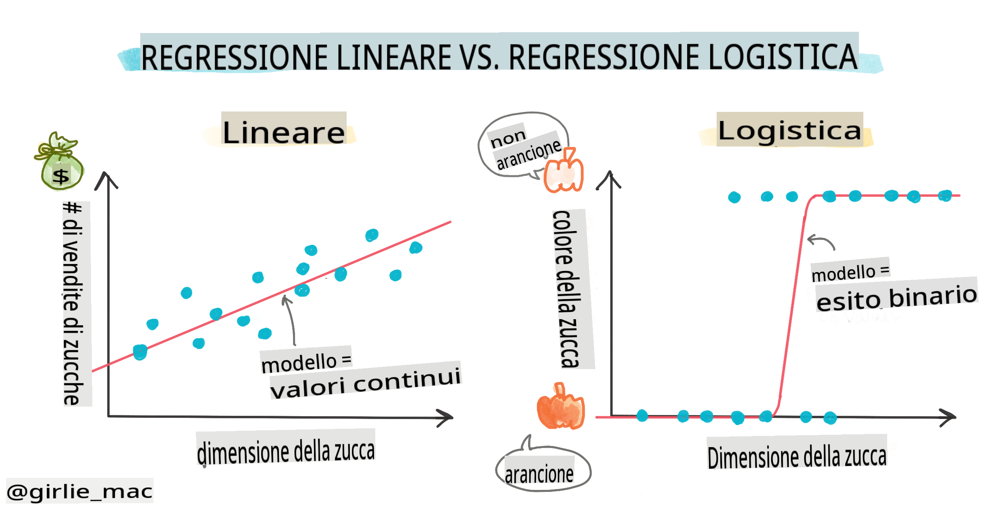
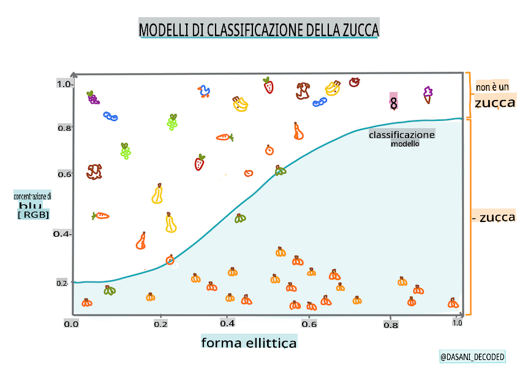
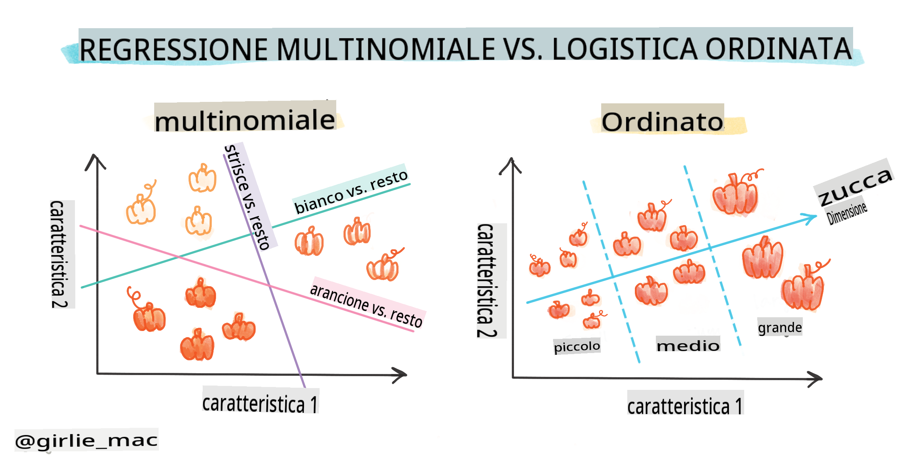
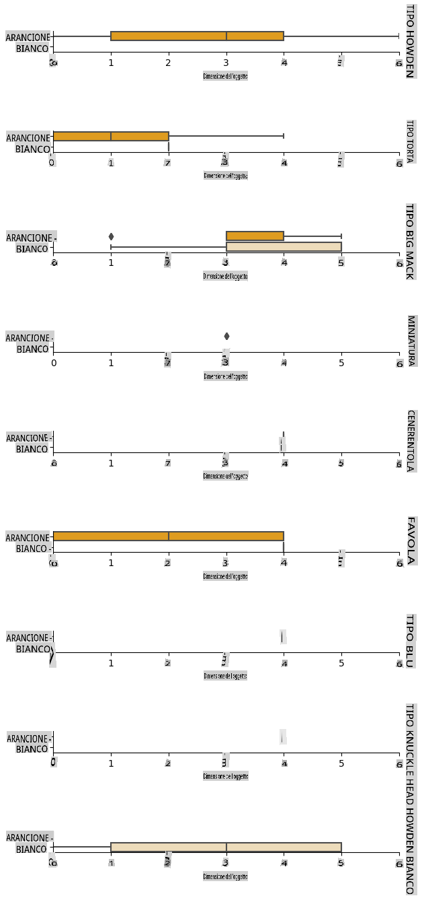
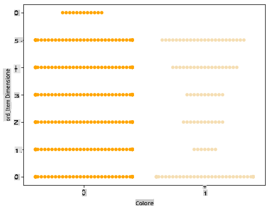

# Regressione logistica per predire categorie



## [Quiz pre-lezione](https://gray-sand-07a10f403.1.azurestaticapps.net/quiz/15/)

> ### [Questa lezione è disponibile in R!](../../../../2-Regression/4-Logistic/solution/R/lesson_4.html)

## Introduzione

In questa ultima lezione sulla Regressione, una delle tecniche di ML _classiche_ di base, esamineremo la Regressione Logistica. Utilizzeresti questa tecnica per scoprire schemi per prevedere categorie binarie. Questa caramella è cioccolato o no? Questa malattia è contagiosa o no? Questo cliente sceglierà questo prodotto o no?

In questa lezione, imparerai:

- Una nuova libreria per la visualizzazione dei dati
- Tecniche per la regressione logistica

✅ Approfondisci la tua comprensione del lavoro con questo tipo di regressione in questo [modulo di apprendimento](https://docs.microsoft.com/learn/modules/train-evaluate-classification-models?WT.mc_id=academic-77952-leestott)

## Prerequisiti

Avendo lavorato con i dati della zucca, ora siamo abbastanza familiari con essi da capire che c'è una categoria binaria con cui possiamo lavorare: `Color`.

Costruiamo un modello di regressione logistica per prevedere, date alcune variabili, _di che colore è probabile che sia una data zucca_ (arancione 🎃 o bianca 👻).

> Perché stiamo parlando di classificazione binaria in una lezione raggruppata sulla regressione? Solo per convenienza linguistica, poiché la regressione logistica è [in realtà un metodo di classificazione](https://scikit-learn.org/stable/modules/linear_model.html#logistic-regression), sebbene basato su un modello lineare. Impara altri modi per classificare i dati nel prossimo gruppo di lezioni.

## Definire la domanda

Per i nostri scopi, esprimeremo questo come un binario: 'Bianco' o 'Non Bianco'. C'è anche una categoria 'a strisce' nel nostro dataset, ma ci sono pochi casi, quindi non la useremo. Scompare comunque una volta rimosse le nullità dal dataset.

> 🎃 Curiosità, a volte chiamiamo le zucche bianche 'zucche fantasma'. Non sono molto facili da intagliare, quindi non sono popolari come quelle arancioni, ma hanno un aspetto interessante! Quindi potremmo anche riformulare la nostra domanda come: 'Fantasma' o 'Non Fantasma'. 👻

## Sulla regressione logistica

La regressione logistica differisce dalla regressione lineare, di cui hai già appreso, in alcuni modi importanti.

[](https://youtu.be/KpeCT6nEpBY "ML per principianti - Comprendere la Regressione Logistica per la Classificazione del Machine Learning")

> 🎥 Clicca sull'immagine sopra per una breve panoramica sulla regressione logistica.

### Classificazione binaria

La regressione logistica non offre le stesse funzionalità della regressione lineare. La prima offre una previsione su una categoria binaria ("bianco o non bianco") mentre la seconda è in grado di prevedere valori continui, ad esempio data l'origine di una zucca e il tempo del raccolto, _quanto aumenterà il suo prezzo_.


> Infografica di [Dasani Madipalli](https://twitter.com/dasani_decoded)

### Altre classificazioni

Ci sono altri tipi di regressione logistica, inclusi multinomiale e ordinale:

- **Multinomiale**, che implica avere più di una categoria - "Arancione, Bianco e a Strisce".
- **Ordinale**, che implica categorie ordinate, utile se volessimo ordinare i nostri risultati in modo logico, come le nostre zucche ordinate per un numero finito di dimensioni (mini, sm, med, lg, xl, xxl).



### Le variabili NON devono correlare

Ricordi come la regressione lineare funzionava meglio con variabili più correlate? La regressione logistica è l'opposto - le variabili non devono allinearsi. Questo funziona per questi dati che hanno correlazioni piuttosto deboli.

### Hai bisogno di molti dati puliti

La regressione logistica darà risultati più accurati se usi più dati; il nostro piccolo dataset non è ottimale per questo compito, quindi tienilo a mente.

[](https://youtu.be/B2X4H9vcXTs "ML per principianti - Analisi e Preparazione dei Dati per la Regressione Logistica")

> 🎥 Clicca sull'immagine sopra per una breve panoramica sulla preparazione dei dati per la regressione lineare

✅ Pensa ai tipi di dati che si presterebbero bene alla regressione logistica

## Esercizio - pulire i dati

Per prima cosa, pulisci un po' i dati, eliminando i valori nulli e selezionando solo alcune delle colonne:

1. Aggiungi il seguente codice:

    ```python
  
    columns_to_select = ['City Name','Package','Variety', 'Origin','Item Size', 'Color']
    pumpkins = full_pumpkins.loc[:, columns_to_select]

    pumpkins.dropna(inplace=True)
    ```

    Puoi sempre dare un'occhiata al tuo nuovo dataframe:

    ```python
    pumpkins.info
    ```

### Visualizzazione - grafico categorico

A questo punto hai caricato il [notebook iniziale](../../../../2-Regression/4-Logistic/notebook.ipynb) con i dati delle zucche ancora una volta e li hai puliti in modo da preservare un dataset contenente alcune variabili, inclusa `Color`. Visualizziamo il dataframe nel notebook usando una libreria diversa: [Seaborn](https://seaborn.pydata.org/index.html), che è costruita su Matplotlib che abbiamo usato in precedenza.

Seaborn offre modi interessanti per visualizzare i tuoi dati. Ad esempio, puoi confrontare le distribuzioni dei dati per ogni `Variety` e `Color` in un grafico categorico.

1. Crea un tale grafico usando `catplot` function, using our pumpkin data `pumpkins`, specificando una mappatura dei colori per ogni categoria di zucca (arancione o bianca):

    ```python
    import seaborn as sns
    
    palette = {
    'ORANGE': 'orange',
    'WHITE': 'wheat',
    }

    sns.catplot(
    data=pumpkins, y="Variety", hue="Color", kind="count",
    palette=palette, 
    )
    ```

    

    Osservando i dati, puoi vedere come i dati di Colore si relazionano a Variety.

    ✅ Data questa trama categorica, quali sono alcune esplorazioni interessanti che puoi immaginare?

### Pre-elaborazione dei dati: codifica delle caratteristiche e delle etichette
Il nostro dataset di zucche contiene valori stringa per tutte le sue colonne. Lavorare con dati categorici è intuitivo per gli esseri umani ma non per le macchine. Gli algoritmi di machine learning funzionano bene con i numeri. Ecco perché la codifica è un passaggio molto importante nella fase di pre-elaborazione dei dati, poiché ci consente di trasformare i dati categorici in dati numerici, senza perdere alcuna informazione. Una buona codifica porta alla costruzione di un buon modello.

Per la codifica delle caratteristiche ci sono due principali tipi di encoder:

1. Encoder ordinale: si adatta bene alle variabili ordinali, che sono variabili categoriche in cui i loro dati seguono un ordine logico, come la colonna `Item Size` nel nostro dataset. Crea una mappatura tale che ogni categoria sia rappresentata da un numero, che è l'ordine della categoria nella colonna.

    ```python
    from sklearn.preprocessing import OrdinalEncoder

    item_size_categories = [['sml', 'med', 'med-lge', 'lge', 'xlge', 'jbo', 'exjbo']]
    ordinal_features = ['Item Size']
    ordinal_encoder = OrdinalEncoder(categories=item_size_categories)
    ```

2. Encoder categorico: si adatta bene alle variabili nominali, che sono variabili categoriche in cui i loro dati non seguono un ordine logico, come tutte le caratteristiche diverse da `Item Size` nel nostro dataset. È una codifica one-hot, il che significa che ogni categoria è rappresentata da una colonna binaria: la variabile codificata è uguale a 1 se la zucca appartiene a quella Variety e 0 altrimenti.

    ```python
    from sklearn.preprocessing import OneHotEncoder

    categorical_features = ['City Name', 'Package', 'Variety', 'Origin']
    categorical_encoder = OneHotEncoder(sparse_output=False)
    ```
Quindi, `ColumnTransformer` viene utilizzato per combinare più encoder in un unico passaggio e applicarli alle colonne appropriate.

```python
    from sklearn.compose import ColumnTransformer
    
    ct = ColumnTransformer(transformers=[
        ('ord', ordinal_encoder, ordinal_features),
        ('cat', categorical_encoder, categorical_features)
        ])
    
    ct.set_output(transform='pandas')
    encoded_features = ct.fit_transform(pumpkins)
```
D'altra parte, per codificare l'etichetta, utilizziamo la classe `LabelEncoder` di scikit-learn, che è una classe di utilità per aiutare a normalizzare le etichette in modo che contengano solo valori tra 0 e n_classi-1 (qui, 0 e 1).

```python
    from sklearn.preprocessing import LabelEncoder

    label_encoder = LabelEncoder()
    encoded_label = label_encoder.fit_transform(pumpkins['Color'])
```
Una volta codificate le caratteristiche e l'etichetta, possiamo unirle in un nuovo dataframe `encoded_pumpkins`.

```python
    encoded_pumpkins = encoded_features.assign(Color=encoded_label)
```
✅ Quali sono i vantaggi dell'utilizzo di un encoder ordinale per la colonna `Item Size` column?

### Analyse relationships between variables

Now that we have pre-processed our data, we can analyse the relationships between the features and the label to grasp an idea of how well the model will be able to predict the label given the features.
The best way to perform this kind of analysis is plotting the data. We'll be using again the Seaborn `catplot` function, to visualize the relationships between `Item Size`,  `Variety` e `Color` in un grafico categorico. Per meglio rappresentare i dati utilizzeremo la colonna codificata `Item Size` column and the unencoded `Variety`.

```python
    palette = {
    'ORANGE': 'orange',
    'WHITE': 'wheat',
    }
    pumpkins['Item Size'] = encoded_pumpkins['ord__Item Size']

    g = sns.catplot(
        data=pumpkins,
        x="Item Size", y="Color", row='Variety',
        kind="box", orient="h",
        sharex=False, margin_titles=True,
        height=1.8, aspect=4, palette=palette,
    )
    g.set(xlabel="Item Size", ylabel="").set(xlim=(0,6))
    g.set_titles(row_template="{row_name}")
```


### Utilizza un grafico a sciame

Poiché Color è una categoria binaria (Bianco o Non Bianco), necessita di 'un [approccio specializzato](https://seaborn.pydata.org/tutorial/categorical.html?highlight=bar) per la visualizzazione'. Ci sono altri modi per visualizzare la relazione di questa categoria con altre variabili.

Puoi visualizzare le variabili fianco a fianco con i grafici di Seaborn.

1. Prova un grafico a 'sciame' per mostrare la distribuzione dei valori:

    ```python
    palette = {
    0: 'orange',
    1: 'wheat'
    }
    sns.swarmplot(x="Color", y="ord__Item Size", data=encoded_pumpkins, palette=palette)
    ```

    

**Attenzione**: il codice sopra potrebbe generare un avviso, poiché Seaborn non riesce a rappresentare una tale quantità di punti dati in un grafico a sciame. Una possibile soluzione è ridurre la dimensione del marcatore, utilizzando il parametro 'size'. Tuttavia, tieni presente che ciò influisce sulla leggibilità del grafico.


> **🧮 Mostrami la Matematica**
>
> La regressione logistica si basa sul concetto di 'massima verosimiglianza' utilizzando [funzioni sigmoidi](https://wikipedia.org/wiki/Sigmoid_function). Una 'Funzione Sigmoide' su un grafico appare come una forma a 'S'. Prende un valore e lo mappa tra 0 e 1. La sua curva è anche chiamata 'curva logistica'. La sua formula appare così:
>
> 
>
> dove il punto medio della sigmoide si trova nel punto 0 di x, L è il valore massimo della curva, e k è la pendenza della curva. Se il risultato della funzione è superiore a 0.5, l'etichetta in questione verrà assegnata alla classe '1' della scelta binaria. In caso contrario, sarà classificata come '0'.

## Costruisci il tuo modello

Costruire un modello per trovare queste classificazioni binarie è sorprendentemente semplice in Scikit-learn.

[](https://youtu.be/MmZS2otPrQ8 "ML per principianti - Regressione Logistica per la classificazione dei dati")

> 🎥 Clicca sull'immagine sopra per una breve panoramica sulla costruzione di un modello di regressione lineare

1. Seleziona le variabili che vuoi utilizzare nel tuo modello di classificazione e dividi i set di addestramento e test chiamando `train_test_split()`:

    ```python
    from sklearn.model_selection import train_test_split
    
    X = encoded_pumpkins[encoded_pumpkins.columns.difference(['Color'])]
    y = encoded_pumpkins['Color']

    X_train, X_test, y_train, y_test = train_test_split(X, y, test_size=0.2, random_state=0)
    
    ```

2. Ora puoi addestrare il tuo modello, chiamando `fit()` con i tuoi dati di addestramento, e stampare il suo risultato:

    ```python
    from sklearn.metrics import f1_score, classification_report 
    from sklearn.linear_model import LogisticRegression

    model = LogisticRegression()
    model.fit(X_train, y_train)
    predictions = model.predict(X_test)

    print(classification_report(y_test, predictions))
    print('Predicted labels: ', predictions)
    print('F1-score: ', f1_score(y_test, predictions))
    ```

    Dai un'occhiata al punteggio del tuo modello. Non è male, considerando che hai solo circa 1000 righe di dati:

    ```output
                       precision    recall  f1-score   support
    
                    0       0.94      0.98      0.96       166
                    1       0.85      0.67      0.75        33
    
        accuracy                                0.92       199
        macro avg           0.89      0.82      0.85       199
        weighted avg        0.92      0.92      0.92       199
    
        Predicted labels:  [0 0 0 0 0 0 0 0 0 0 0 0 0 0 0 0 0 0 0 0 1 0 0 1 0 0 0 0 0 0 0 0 1 0 0 0 0
        0 0 0 0 0 1 0 1 0 0 1 0 0 0 0 0 1 0 1 0 1 0 1 0 0 0 0 0 0 0 0 0 0 0 0 0 0
        1 0 0 0 0 0 0 0 1 0 0 0 0 0 0 0 1 0 0 0 0 0 0 0 0 1 0 1 0 0 0 0 0 0 0 1 0
        0 0 0 0 0 0 0 0 0 0 0 0 0 0 0 0 0 0 0 0 0 1 0 0 0 0 0 0 0 0 1 0 0 0 1 1 0
        0 0 0 0 1 0 0 0 0 0 1 0 0 0 0 0 0 0 0 0 0 0 0 0 0 0 0 0 0 0 0 0 0 0 0 0 1
        0 0 0 1 0 0 0 0 0 0 0 0 1 1]
        F1-score:  0.7457627118644068
    ```

## Migliore comprensione tramite una matrice di confusione

Sebbene tu possa ottenere un rapporto sul punteggio [termini](https://scikit-learn.org/stable/modules/generated/sklearn.metrics.classification_report.html?highlight=classification_report#sklearn.metrics.classification_report) stampando gli elementi sopra, potresti riuscire a comprendere meglio il tuo modello utilizzando una [matrice di confusione](https://scikit-learn.org/stable/modules/model_evaluation.html#confusion-matrix) per aiutarci a capire come sta performando il modello.

> 🎓 Una '[matrice di confusione](https://wikipedia.org/wiki/Confusion_matrix)' (o 'matrice degli errori') è una tabella che esprime i veri vs. falsi positivi e negativi del tuo modello, valutando così l'accuratezza delle previsioni.

1. Per utilizzare una matrice di confusione, chiama `confusion_matrix()`:

    ```python
    from sklearn.metrics import confusion_matrix
    confusion_matrix(y_test, predictions)
    ```

    Dai un'occhiata alla matrice di confusione del tuo modello:

    ```output
    array([[162,   4],
           [ 11,  22]])
    ```

In Scikit-learn, le righe delle matrici di confusione (asse 0) sono etichette reali e le colonne (asse 1) sono etichette previste.

|       |   0   |   1   |
| :---: | :---: | :---: |
|   0   |  TN   |  FP   |
|   1   |  FN   |  TP   |

Cosa sta succedendo qui? Supponiamo che il nostro modello sia chiamato a classificare le zucche tra due categorie binarie, categoria 'bianco' e categoria 'non-bianco'.

- Se il tuo modello prevede una zucca come non bianca e appartiene alla categoria 'non-bianco' in realtà, la chiamiamo un vero negativo, mostrato dal numero in alto a sinistra.
- Se il tuo modello prevede una zucca come bianca e appartiene alla categoria 'non-bianco' in realtà, la chiamiamo un falso negativo, mostrato dal numero in basso a sinistra.
- Se il tuo modello prevede una zucca come non bianca e appartiene alla categoria 'bianco' in realtà, la chiamiamo un falso positivo, mostrato dal numero in alto a destra.
- Se il tuo modello prevede una zucca come bianca e appartiene alla categoria 'bianco' in realtà, la chiamiamo un vero positivo, mostrato dal numero in basso a destra.

Come avrai intuito, è preferibile avere un numero maggiore di veri positivi e veri negativi e un numero inferiore di falsi positivi e falsi negativi, il che implica che il modello performa meglio.

Come si relaziona la matrice di confusione con la precisione e il richiamo? Ricorda, il rapporto di classificazione stampato sopra ha mostrato precisione (0.85) e richiamo (0.67).

Precisione = tp / (tp + fp) = 22 / (22 + 4) = 0.8461538461538461

Richiamo = tp / (tp + fn) = 22 / (22 + 11) = 0.6666666666666666

✅ Q: Secondo la matrice di confusione, come ha fatto il modello? A: Non male; ci sono un buon numero di veri negativi ma anche alcuni falsi negativi.

Rivediamo i termini che abbiamo visto in precedenza con l'aiuto della mappatura della matrice di confusione di TP/TN e FP/FN:

🎓 Precisione: TP/(TP + FP) La frazione di istanze rilevanti tra le istanze recuperate (ad esempio quali etichette erano ben etichettate)

🎓 Richiamo: TP/(TP + FN) La frazione di istanze rilevanti che sono state recuperate, che siano ben etichettate o meno

🎓 f1-score: (2 * precision * recall)/(precision + recall) Una media ponderata della precisione e del richiamo, con il migliore essendo 1 e il peggiore essendo 0

🎓 Supporto: Il numero di occorrenze di ciascuna etichetta recuperata

🎓 Accuratezza: (TP + TN)/(TP + TN + FP + FN) La percentuale di etichette previste accuratamente per un campione.

🎓 Macro Avg: Il calcolo delle metriche medie non ponderate per ciascuna etichetta, senza tenere conto dello squilibrio delle etichette.

🎓 Weighted Avg: Il calcolo delle metriche medie per ciascuna etichetta, tenendo conto dello squilibrio delle etichette ponderandole in base al loro supporto (il numero di istanze vere per ciascuna etichetta).

✅ Riesci a pensare a quale metrica dovresti guardare se vuoi che il tuo modello riduca il numero di falsi negativi?

## Visualizza la curva ROC di questo modello

[](https://youtu.be/GApO575jTA0 "ML per principianti - Analisi delle Prestazioni della Regressione Logistica con le Curve ROC")

> 🎥 Clicca sull'immagine sopra per una breve panoramica sulle curve ROC

Facciamo un'ultima visualizzazione per vedere la cosiddetta curva 'ROC':

```python
from sklearn.metrics import roc_curve, roc_auc_score
import matplotlib
import matplotlib.pyplot as plt
%matplotlib inline

y_scores = model.predict_proba(X_test)
fpr, tpr, thresholds = roc_curve(y_test, y_scores[:,1])

fig = plt.figure(figsize=(6, 6))
plt.plot([0, 1], [0, 1], 'k--')
plt.plot(fpr, tpr)
plt.xlabel('False Positive Rate')
plt.ylabel('True Positive Rate')
plt.title('ROC Curve')
plt.show()
```

Usando Matplotlib, traccia la [Curva di Ricezione Operativa](https://scikit-learn.org/stable/auto_examples/model

**Disclaimer**: 
Questo documento è stato tradotto utilizzando servizi di traduzione automatizzati basati su intelligenza artificiale. Sebbene ci impegniamo per garantire l'accuratezza, si prega di essere consapevoli che le traduzioni automatizzate possono contenere errori o imprecisioni. Il documento originale nella sua lingua nativa dovrebbe essere considerato la fonte autorevole. Per informazioni critiche, si raccomanda la traduzione professionale umana. Non siamo responsabili per eventuali malintesi o interpretazioni errate derivanti dall'uso di questa traduzione.