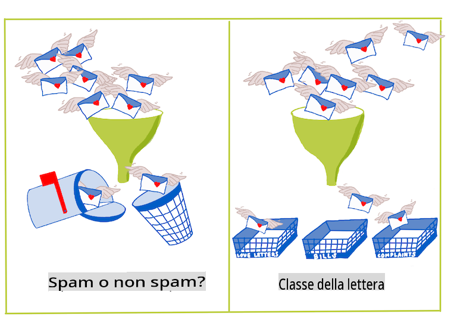
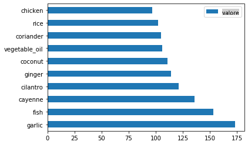
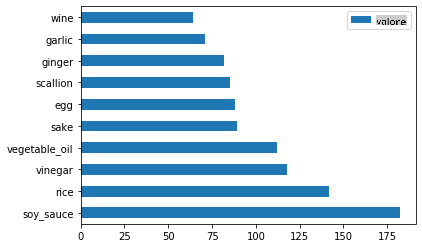
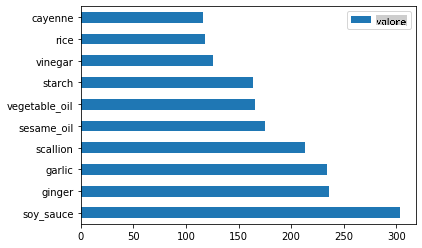
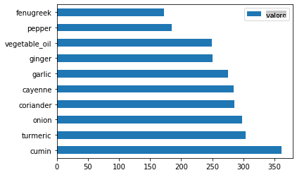
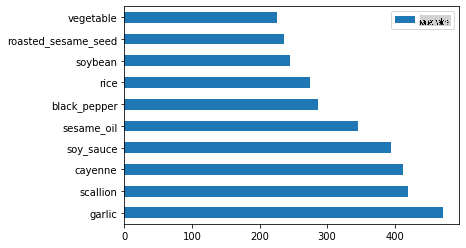

# Introduzione alla classificazione

In queste quattro lezioni esplorerai un aspetto fondamentale del machine learning classico - la _classificazione_. Analizzeremo l'uso di vari algoritmi di classificazione con un dataset che riguarda tutte le brillanti cucine dell'Asia e dell'India. Speriamo che tu abbia fame!


> Celebra le cucine pan-asiatiche in queste lezioni! Immagine di [Jen Looper](https://twitter.com/jenlooper)

La classificazione è una forma di [apprendimento supervisionato](https://wikipedia.org/wiki/Supervised_learning) che ha molto in comune con le tecniche di regressione. Se il machine learning riguarda la previsione di valori o nomi per le cose utilizzando dataset, allora la classificazione generalmente si divide in due gruppi: _classificazione binaria_ e _classificazione multiclasse_.

[](https://youtu.be/eg8DJYwdMyg "Introduzione alla classificazione")

> 🎥 Clicca sull'immagine sopra per un video: John Guttag del MIT introduce la classificazione

Ricorda:

- **La regressione lineare** ti ha aiutato a prevedere le relazioni tra variabili e fare previsioni accurate su dove un nuovo punto dati cadrebbe in relazione a quella linea. Ad esempio, potresti prevedere _che prezzo avrà una zucca a settembre rispetto a dicembre_.
- **La regressione logistica** ti ha aiutato a scoprire "categorie binarie": a questo prezzo, _questa zucca è arancione o non-arancione_?

La classificazione utilizza vari algoritmi per determinare altri modi di determinare l'etichetta o la classe di un punto dati. Lavoriamo con questi dati sulle cucine per vedere se, osservando un gruppo di ingredienti, possiamo determinare la cucina di origine.

## [Quiz pre-lezione](https://gray-sand-07a10f403.1.azurestaticapps.net/quiz/19/)

> ### [Questa lezione è disponibile in R!](../../../../4-Classification/1-Introduction/solution/R/lesson_10.html)

### Introduzione

La classificazione è una delle attività fondamentali del ricercatore di machine learning e del data scientist. Dalla classificazione di base di un valore binario ("questa email è spam o no?"), alla complessa classificazione e segmentazione delle immagini utilizzando la visione artificiale, è sempre utile poter ordinare i dati in classi e porre domande su di essi.

Per esprimere il processo in modo più scientifico, il tuo metodo di classificazione crea un modello predittivo che ti consente di mappare la relazione tra variabili di input e variabili di output.



> Problemi binari vs. multiclasse per gli algoritmi di classificazione. Infografica di [Jen Looper](https://twitter.com/jenlooper)

Prima di iniziare il processo di pulizia dei dati, visualizzazione e preparazione per i nostri compiti di ML, impariamo un po' sui vari modi in cui il machine learning può essere utilizzato per classificare i dati.

Derivata dalla [statistica](https://wikipedia.org/wiki/Statistical_classification), la classificazione utilizzando il machine learning classico utilizza caratteristiche, come `smoker`, `weight` e `age` per determinare la _probabilità di sviluppare X malattia_. Come tecnica di apprendimento supervisionato simile agli esercizi di regressione che hai eseguito in precedenza, i tuoi dati sono etichettati e gli algoritmi di ML utilizzano queste etichette per classificare e prevedere classi (o 'caratteristiche') di un dataset e assegnarle a un gruppo o risultato.

✅ Prenditi un momento per immaginare un dataset sulle cucine. Cosa potrebbe rispondere un modello multiclasse? Cosa potrebbe rispondere un modello binario? E se volessi determinare se una determinata cucina è probabile che utilizzi il fieno greco? E se volessi vedere se, dato un sacchetto di spesa pieno di anice stellato, carciofi, cavolfiori e rafano, potresti creare un piatto tipico indiano?

[](https://youtu.be/GuTeDbaNoEU "Crazy mystery baskets")

> 🎥 Clicca sull'immagine sopra per un video. L'intera premessa dello show 'Chopped' è il 'cestino misterioso' dove gli chef devono preparare un piatto con una scelta casuale di ingredienti. Sicuramente un modello di ML avrebbe aiutato!

## Ciao 'classificatore'

La domanda che vogliamo porre a questo dataset di cucina è in realtà una **domanda multiclasse**, poiché abbiamo diverse potenziali cucine nazionali con cui lavorare. Dato un gruppo di ingredienti, a quale di queste molte classi si adatteranno i dati?

Scikit-learn offre diversi algoritmi per classificare i dati, a seconda del tipo di problema che vuoi risolvere. Nelle prossime due lezioni imparerai a conoscere alcuni di questi algoritmi.

## Esercizio - pulire e bilanciare i tuoi dati

Il primo compito da svolgere, prima di iniziare questo progetto, è pulire e **bilanciare** i tuoi dati per ottenere risultati migliori. Inizia con il file _notebook.ipynb_ vuoto nella radice di questa cartella.

La prima cosa da installare è [imblearn](https://imbalanced-learn.org/stable/). Questo è un pacchetto di Scikit-learn che ti permetterà di bilanciare meglio i dati (imparerai di più su questo compito tra un minuto).

1. Per installare `imblearn`, esegui `pip install`, come segue:

    ```python
    pip install imblearn
    ```

1. Importa i pacchetti necessari per importare i tuoi dati e visualizzarli, importa anche `SMOTE` da `imblearn`.

    ```python
    import pandas as pd
    import matplotlib.pyplot as plt
    import matplotlib as mpl
    import numpy as np
    from imblearn.over_sampling import SMOTE
    ```

    Ora sei pronto per importare i dati.

1. Il prossimo compito sarà importare i dati:

    ```python
    df  = pd.read_csv('../data/cuisines.csv')
    ```

   Utilizzando `read_csv()` will read the content of the csv file _cusines.csv_ and place it in the variable `df`.

1. Controlla la forma dei dati:

    ```python
    df.head()
    ```

   Le prime cinque righe sembrano così:

    ```output
    |     | Unnamed: 0 | cuisine | almond | angelica | anise | anise_seed | apple | apple_brandy | apricot | armagnac | ... | whiskey | white_bread | white_wine | whole_grain_wheat_flour | wine | wood | yam | yeast | yogurt | zucchini |
    | --- | ---------- | ------- | ------ | -------- | ----- | ---------- | ----- | ------------ | ------- | -------- | --- | ------- | ----------- | ---------- | ----------------------- | ---- | ---- | --- | ----- | ------ | -------- |
    | 0   | 65         | indian  | 0      | 0        | 0     | 0          | 0     | 0            | 0       | 0        | ... | 0       | 0           | 0          | 0                       | 0    | 0    | 0   | 0     | 0      | 0        |
    | 1   | 66         | indian  | 1      | 0        | 0     | 0          | 0     | 0            | 0       | 0        | ... | 0       | 0           | 0          | 0                       | 0    | 0    | 0   | 0     | 0      | 0        |
    | 2   | 67         | indian  | 0      | 0        | 0     | 0          | 0     | 0            | 0       | 0        | ... | 0       | 0           | 0          | 0                       | 0    | 0    | 0   | 0     | 0      | 0        |
    | 3   | 68         | indian  | 0      | 0        | 0     | 0          | 0     | 0            | 0       | 0        | ... | 0       | 0           | 0          | 0                       | 0    | 0    | 0   | 0     | 0      | 0        |
    | 4   | 69         | indian  | 0      | 0        | 0     | 0          | 0     | 0            | 0       | 0        | ... | 0       | 0           | 0          | 0                       | 0    | 0    | 0   | 0     | 1      | 0        |
    ```

1. Ottieni informazioni su questi dati chiamando `info()`:

    ```python
    df.info()
    ```

    Il tuo output somiglia a:

    ```output
    <class 'pandas.core.frame.DataFrame'>
    RangeIndex: 2448 entries, 0 to 2447
    Columns: 385 entries, Unnamed: 0 to zucchini
    dtypes: int64(384), object(1)
    memory usage: 7.2+ MB
    ```

## Esercizio - imparare sulle cucine

Ora il lavoro inizia a diventare più interessante. Scopriamo la distribuzione dei dati, per cucina.

1. Traccia i dati come barre chiamando `barh()`:

    ```python
    df.cuisine.value_counts().plot.barh()
    ```

    

    Ci sono un numero finito di cucine, ma la distribuzione dei dati è disomogenea. Puoi risolverlo! Prima di farlo, esplora un po' di più.

1. Scopri quanti dati sono disponibili per cucina e stampali:

    ```python
    thai_df = df[(df.cuisine == "thai")]
    japanese_df = df[(df.cuisine == "japanese")]
    chinese_df = df[(df.cuisine == "chinese")]
    indian_df = df[(df.cuisine == "indian")]
    korean_df = df[(df.cuisine == "korean")]
    
    print(f'thai df: {thai_df.shape}')
    print(f'japanese df: {japanese_df.shape}')
    print(f'chinese df: {chinese_df.shape}')
    print(f'indian df: {indian_df.shape}')
    print(f'korean df: {korean_df.shape}')
    ```

    l'output sembra così:

    ```output
    thai df: (289, 385)
    japanese df: (320, 385)
    chinese df: (442, 385)
    indian df: (598, 385)
    korean df: (799, 385)
    ```

## Scoprire gli ingredienti

Ora puoi approfondire i dati e scoprire quali sono gli ingredienti tipici per cucina. Dovresti pulire i dati ricorrenti che creano confusione tra le cucine, quindi impariamo a conoscere questo problema.

1. Crea una funzione `create_ingredient()` in Python per creare un dataframe di ingredienti. Questa funzione inizierà eliminando una colonna non utile e ordinando gli ingredienti in base al loro conteggio:

    ```python
    def create_ingredient_df(df):
        ingredient_df = df.T.drop(['cuisine','Unnamed: 0']).sum(axis=1).to_frame('value')
        ingredient_df = ingredient_df[(ingredient_df.T != 0).any()]
        ingredient_df = ingredient_df.sort_values(by='value', ascending=False,
        inplace=False)
        return ingredient_df
    ```

   Ora puoi usare quella funzione per farti un'idea dei dieci ingredienti più popolari per cucina.

1. Chiama `create_ingredient()` and plot it calling `barh()`:

    ```python
    thai_ingredient_df = create_ingredient_df(thai_df)
    thai_ingredient_df.head(10).plot.barh()
    ```

    

1. Fai lo stesso per i dati giapponesi:

    ```python
    japanese_ingredient_df = create_ingredient_df(japanese_df)
    japanese_ingredient_df.head(10).plot.barh()
    ```

    

1. Ora per gli ingredienti cinesi:

    ```python
    chinese_ingredient_df = create_ingredient_df(chinese_df)
    chinese_ingredient_df.head(10).plot.barh()
    ```

    

1. Traccia gli ingredienti indiani:

    ```python
    indian_ingredient_df = create_ingredient_df(indian_df)
    indian_ingredient_df.head(10).plot.barh()
    ```

    

1. Infine, traccia gli ingredienti coreani:

    ```python
    korean_ingredient_df = create_ingredient_df(korean_df)
    korean_ingredient_df.head(10).plot.barh()
    ```

    

1. Ora, elimina gli ingredienti più comuni che creano confusione tra cucine distinte, chiamando `drop()`: 

   Tutti amano il riso, l'aglio e lo zenzero!

    ```python
    feature_df= df.drop(['cuisine','Unnamed: 0','rice','garlic','ginger'], axis=1)
    labels_df = df.cuisine #.unique()
    feature_df.head()
    ```

## Bilanciare il dataset

Ora che hai pulito i dati, utilizza [SMOTE](https://imbalanced-learn.org/dev/references/generated/imblearn.over_sampling.SMOTE.html) - "Synthetic Minority Over-sampling Technique" - per bilanciarli.

1. Chiama `fit_resample()`, questa strategia genera nuovi campioni per interpolazione.

    ```python
    oversample = SMOTE()
    transformed_feature_df, transformed_label_df = oversample.fit_resample(feature_df, labels_df)
    ```

    Bilanciando i tuoi dati, otterrai risultati migliori quando li classifichi. Pensa a una classificazione binaria. Se la maggior parte dei tuoi dati appartiene a una classe, un modello di ML predirà quella classe più frequentemente, solo perché ci sono più dati per essa. Bilanciare i dati rimuove qualsiasi squilibrio nei dati e aiuta a rimuovere questo squilibrio. 

1. Ora puoi controllare il numero di etichette per ingrediente:

    ```python
    print(f'new label count: {transformed_label_df.value_counts()}')
    print(f'old label count: {df.cuisine.value_counts()}')
    ```

    Il tuo output sembra così:

    ```output
    new label count: korean      799
    chinese     799
    indian      799
    japanese    799
    thai        799
    Name: cuisine, dtype: int64
    old label count: korean      799
    indian      598
    chinese     442
    japanese    320
    thai        289
    Name: cuisine, dtype: int64
    ```

    I dati sono belli, puliti, bilanciati e molto deliziosi!

1. L'ultimo passaggio è salvare i tuoi dati bilanciati, inclusi etichette e caratteristiche, in un nuovo dataframe che può essere esportato in un file:

    ```python
    transformed_df = pd.concat([transformed_label_df,transformed_feature_df],axis=1, join='outer')
    ```

1. Puoi dare un'ultima occhiata ai dati utilizzando `transformed_df.head()` and `transformed_df.info()`. Salva una copia di questi dati per usarli nelle lezioni future:

    ```python
    transformed_df.head()
    transformed_df.info()
    transformed_df.to_csv("../data/cleaned_cuisines.csv")
    ```

    Questo nuovo CSV si trova ora nella cartella principale dei dati.

---

## 🚀Sfida

Questo curriculum contiene diversi dataset interessanti. Esplora le cartelle `data` e verifica se qualcuno contiene dataset che potrebbero essere appropriati per una classificazione binaria o multiclasse. Quali domande potresti porre a questo dataset?

## [Quiz post-lezione](https://gray-sand-07a10f403.1.azurestaticapps.net/quiz/20/)

## Revisione & Autoapprendimento

Esplora l'API di SMOTE. Per quali casi d'uso è meglio utilizzato? Quali problemi risolve?

## Compito 

[Esplora i metodi di classificazione](assignment.md)

**Avvertenza**: 
Questo documento è stato tradotto utilizzando servizi di traduzione automatica basati su intelligenza artificiale. Sebbene ci impegniamo per garantire l'accuratezza, si prega di notare che le traduzioni automatiche possono contenere errori o imprecisioni. Il documento originale nella sua lingua nativa dovrebbe essere considerato la fonte autorevole. Per informazioni critiche, si raccomanda una traduzione professionale umana. Non siamo responsabili per eventuali malintesi o interpretazioni errate derivanti dall'uso di questa traduzione.