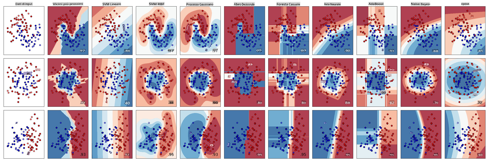
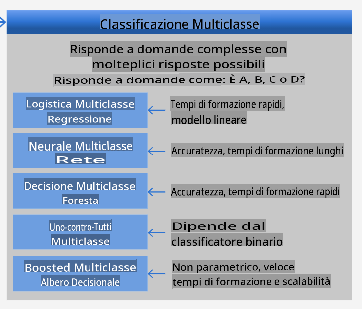
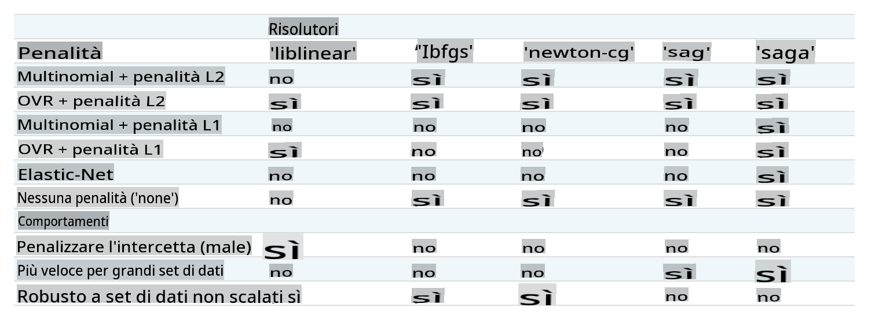

<!--
CO_OP_TRANSLATOR_METADATA:
{
  "original_hash": "9579f42e3ff5114c58379cc9e186a828",
  "translation_date": "2025-08-29T21:43:27+00:00",
  "source_file": "4-Classification/2-Classifiers-1/README.md",
  "language_code": "it"
}
-->
# Classificatori di cucine 1

In questa lezione, utilizzerai il dataset che hai salvato dalla lezione precedente, pieno di dati bilanciati e puliti sulle cucine.

Utilizzerai questo dataset con una varietà di classificatori per _prevedere una cucina nazionale specifica in base a un gruppo di ingredienti_. Durante questo processo, imparerai di più su alcuni dei modi in cui gli algoritmi possono essere utilizzati per compiti di classificazione.

## [Quiz preliminare](https://gray-sand-07a10f403.1.azurestaticapps.net/quiz/21/)
# Preparazione

Supponendo che tu abbia completato [Lezione 1](../1-Introduction/README.md), assicurati che un file _cleaned_cuisines.csv_ esista nella cartella radice `/data` per queste quattro lezioni.

## Esercizio - prevedere una cucina nazionale

1. Lavorando nella cartella _notebook.ipynb_ di questa lezione, importa quel file insieme alla libreria Pandas:

    ```python
    import pandas as pd
    cuisines_df = pd.read_csv("../data/cleaned_cuisines.csv")
    cuisines_df.head()
    ```

    I dati appaiono così:

|     | Unnamed: 0 | cuisine | almond | angelica | anise | anise_seed | apple | apple_brandy | apricot | armagnac | ... | whiskey | white_bread | white_wine | whole_grain_wheat_flour | wine | wood | yam | yeast | yogurt | zucchini |
| --- | ---------- | ------- | ------ | -------- | ----- | ---------- | ----- | ------------ | ------- | -------- | --- | ------- | ----------- | ---------- | ----------------------- | ---- | ---- | --- | ----- | ------ | -------- |
| 0   | 0          | indian  | 0      | 0        | 0     | 0          | 0     | 0            | 0       | 0        | ... | 0       | 0           | 0          | 0                       | 0    | 0    | 0   | 0     | 0      | 0        |
| 1   | 1          | indian  | 1      | 0        | 0     | 0          | 0     | 0            | 0       | 0        | ... | 0       | 0           | 0          | 0                       | 0    | 0    | 0   | 0     | 0      | 0        |
| 2   | 2          | indian  | 0      | 0        | 0     | 0          | 0     | 0            | 0       | 0        | ... | 0       | 0           | 0          | 0                       | 0    | 0    | 0   | 0     | 0      | 0        |
| 3   | 3          | indian  | 0      | 0        | 0     | 0          | 0     | 0            | 0       | 0        | ... | 0       | 0           | 0          | 0                       | 0    | 0    | 0   | 0     | 0      | 0        |
| 4   | 4          | indian  | 0      | 0        | 0     | 0          | 0     | 0            | 0       | 0        | ... | 0       | 0           | 0          | 0                       | 0    | 0    | 0   | 0     | 1      | 0        |
  

1. Ora, importa altre librerie:

    ```python
    from sklearn.linear_model import LogisticRegression
    from sklearn.model_selection import train_test_split, cross_val_score
    from sklearn.metrics import accuracy_score,precision_score,confusion_matrix,classification_report, precision_recall_curve
    from sklearn.svm import SVC
    import numpy as np
    ```

1. Dividi le coordinate X e y in due dataframe per l'addestramento. `cuisine` può essere il dataframe delle etichette:

    ```python
    cuisines_label_df = cuisines_df['cuisine']
    cuisines_label_df.head()
    ```

    Apparirà così:

    ```output
    0    indian
    1    indian
    2    indian
    3    indian
    4    indian
    Name: cuisine, dtype: object
    ```

1. Elimina la colonna `Unnamed: 0` e la colonna `cuisine`, utilizzando `drop()`. Salva il resto dei dati come caratteristiche addestrabili:

    ```python
    cuisines_feature_df = cuisines_df.drop(['Unnamed: 0', 'cuisine'], axis=1)
    cuisines_feature_df.head()
    ```

    Le tue caratteristiche appariranno così:

|      | almond | angelica | anise | anise_seed | apple | apple_brandy | apricot | armagnac | artemisia | artichoke |  ... | whiskey | white_bread | white_wine | whole_grain_wheat_flour | wine | wood |  yam | yeast | yogurt | zucchini |
| ---: | -----: | -------: | ----: | ---------: | ----: | -----------: | ------: | -------: | --------: | --------: | ---: | ------: | ----------: | ---------: | ----------------------: | ---: | ---: | ---: | ----: | -----: | -------: |
|    0 |      0 |        0 |     0 |          0 |     0 |            0 |       0 |        0 |         0 |         0 |  ... |       0 |           0 |          0 |                       0 |    0 |    0 |    0 |     0 |      0 |        0 | 0 |
|    1 |      1 |        0 |     0 |          0 |     0 |            0 |       0 |        0 |         0 |         0 |  ... |       0 |           0 |          0 |                       0 |    0 |    0 |    0 |     0 |      0 |        0 | 0 |
|    2 |      0 |        0 |     0 |          0 |     0 |            0 |       0 |        0 |         0 |         0 |  ... |       0 |           0 |          0 |                       0 |    0 |    0 |    0 |     0 |      0 |        0 | 0 |
|    3 |      0 |        0 |     0 |          0 |     0 |            0 |       0 |        0 |         0 |         0 |  ... |       0 |           0 |          0 |                       0 |    0 |    0 |    0 |     0 |      0 |        0 | 0 |
|    4 |      0 |        0 |     0 |          0 |     0 |            0 |       0 |        0 |         0 |         0 |  ... |       0 |           0 |          0 |                       0 |    0 |    0 |    0 |     0 |      1 |        0 | 0 |

Ora sei pronto per addestrare il tuo modello!

## Scegliere il classificatore

Ora che i tuoi dati sono puliti e pronti per l'addestramento, devi decidere quale algoritmo utilizzare per il compito.

Scikit-learn raggruppa la classificazione sotto l'Apprendimento Supervisionato, e in questa categoria troverai molti modi per classificare. [La varietà](https://scikit-learn.org/stable/supervised_learning.html) può sembrare inizialmente sconcertante. I seguenti metodi includono tecniche di classificazione:

- Modelli Lineari
- Support Vector Machines
- Discesa del Gradiente Stocastico
- Vicini più Prossimi
- Processi Gaussiani
- Alberi Decisionali
- Metodi Ensemble (voting Classifier)
- Algoritmi Multiclasse e Multioutput (classificazione multiclasse e multilabel, classificazione multiclass-multioutput)

> Puoi anche utilizzare [reti neurali per classificare i dati](https://scikit-learn.org/stable/modules/neural_networks_supervised.html#classification), ma ciò è al di fuori dell'ambito di questa lezione.

### Quale classificatore scegliere?

Quindi, quale classificatore dovresti scegliere? Spesso, provare diversi algoritmi e cercare un buon risultato è un modo per testare. Scikit-learn offre un [confronto fianco a fianco](https://scikit-learn.org/stable/auto_examples/classification/plot_classifier_comparison.html) su un dataset creato, confrontando KNeighbors, SVC in due modi, GaussianProcessClassifier, DecisionTreeClassifier, RandomForestClassifier, MLPClassifier, AdaBoostClassifier, GaussianNB e QuadraticDiscriminationAnalysis, mostrando i risultati visualizzati:


> Grafici generati dalla documentazione di Scikit-learn

> AutoML risolve questo problema in modo semplice eseguendo questi confronti nel cloud, permettendoti di scegliere il miglior algoritmo per i tuoi dati. Provalo [qui](https://docs.microsoft.com/learn/modules/automate-model-selection-with-azure-automl/?WT.mc_id=academic-77952-leestott)

### Un approccio migliore

Un modo migliore rispetto a indovinare a caso è seguire le idee presenti in questo [ML Cheat sheet](https://docs.microsoft.com/azure/machine-learning/algorithm-cheat-sheet?WT.mc_id=academic-77952-leestott) scaricabile. Qui scopriamo che, per il nostro problema multiclasse, abbiamo alcune opzioni:


> Una sezione del Cheat Sheet sugli Algoritmi di Microsoft, che dettaglia le opzioni di classificazione multiclasse

✅ Scarica questo cheat sheet, stampalo e appendilo al muro!

### Ragionamento

Vediamo se possiamo ragionare sui diversi approcci dati i vincoli che abbiamo:

- **Le reti neurali sono troppo pesanti**. Dato il nostro dataset pulito ma minimale, e il fatto che stiamo eseguendo l'addestramento localmente tramite notebook, le reti neurali sono troppo pesanti per questo compito.
- **Nessun classificatore a due classi**. Non utilizziamo un classificatore a due classi, quindi escludiamo il metodo one-vs-all.
- **Un albero decisionale o una regressione logistica potrebbero funzionare**. Un albero decisionale potrebbe funzionare, oppure una regressione logistica per dati multiclasse.
- **Gli Alberi Decisionali Potenziati Multiclasse risolvono un problema diverso**. Gli alberi decisionali potenziati multiclasse sono più adatti per compiti non parametrici, ad esempio compiti progettati per costruire classifiche, quindi non sono utili per noi.

### Utilizzare Scikit-learn 

Utilizzeremo Scikit-learn per analizzare i nostri dati. Tuttavia, ci sono molti modi per utilizzare la regressione logistica in Scikit-learn. Dai un'occhiata ai [parametri da passare](https://scikit-learn.org/stable/modules/generated/sklearn.linear_model.LogisticRegression.html?highlight=logistic%20regressio#sklearn.linear_model.LogisticRegression).  

Essenzialmente ci sono due parametri importanti - `multi_class` e `solver` - che dobbiamo specificare quando chiediamo a Scikit-learn di eseguire una regressione logistica. Il valore di `multi_class` applica un certo comportamento. Il valore del solver indica quale algoritmo utilizzare. Non tutti i solver possono essere abbinati a tutti i valori di `multi_class`.

Secondo la documentazione, nel caso multiclasse, l'algoritmo di addestramento:

- **Utilizza lo schema one-vs-rest (OvR)**, se l'opzione `multi_class` è impostata su `ovr`
- **Utilizza la perdita di entropia incrociata**, se l'opzione `multi_class` è impostata su `multinomial`. (Attualmente l'opzione `multinomial` è supportata solo dai solver ‘lbfgs’, ‘sag’, ‘saga’ e ‘newton-cg’.)"

> 🎓 Lo 'schema' qui può essere 'ovr' (one-vs-rest) o 'multinomial'. Poiché la regressione logistica è progettata principalmente per supportare la classificazione binaria, questi schemi le permettono di gestire meglio i compiti di classificazione multiclasse. [fonte](https://machinelearningmastery.com/one-vs-rest-and-one-vs-one-for-multi-class-classification/)

> 🎓 Il 'solver' è definito come "l'algoritmo da utilizzare nel problema di ottimizzazione". [fonte](https://scikit-learn.org/stable/modules/generated/sklearn.linear_model.LogisticRegression.html?highlight=logistic%20regressio#sklearn.linear_model.LogisticRegression).

Scikit-learn offre questa tabella per spiegare come i solver gestiscono le diverse sfide presentate da differenti tipi di strutture dati:



## Esercizio - dividere i dati

Possiamo concentrarci sulla regressione logistica per il nostro primo tentativo di addestramento, dato che hai recentemente imparato a riguardo in una lezione precedente.
Dividi i tuoi dati in gruppi di addestramento e test chiamando `train_test_split()`:

```python
X_train, X_test, y_train, y_test = train_test_split(cuisines_feature_df, cuisines_label_df, test_size=0.3)
```

## Esercizio - applicare la regressione logistica

Poiché stai utilizzando il caso multiclasse, devi scegliere quale _schema_ utilizzare e quale _solver_ impostare. Usa LogisticRegression con un'impostazione multiclasse e il solver **liblinear** per l'addestramento.

1. Crea una regressione logistica con `multi_class` impostato su `ovr` e il solver impostato su `liblinear`:

    ```python
    lr = LogisticRegression(multi_class='ovr',solver='liblinear')
    model = lr.fit(X_train, np.ravel(y_train))
    
    accuracy = model.score(X_test, y_test)
    print ("Accuracy is {}".format(accuracy))
    ```

    ✅ Prova un solver diverso come `lbfgs`, che spesso è impostato come predefinito
> Nota, utilizza la funzione Pandas [`ravel`](https://pandas.pydata.org/pandas-docs/stable/reference/api/pandas.Series.ravel.html) per appiattire i tuoi dati quando necessario.
L'accuratezza è buona, oltre **80%**!

1. Puoi vedere questo modello in azione testando una riga di dati (#50):

    ```python
    print(f'ingredients: {X_test.iloc[50][X_test.iloc[50]!=0].keys()}')
    print(f'cuisine: {y_test.iloc[50]}')
    ```

    Il risultato viene stampato:

   ```output
   ingredients: Index(['cilantro', 'onion', 'pea', 'potato', 'tomato', 'vegetable_oil'], dtype='object')
   cuisine: indian
   ```

   ✅ Prova un numero di riga diverso e controlla i risultati.

1. Approfondendo, puoi verificare l'accuratezza di questa previsione:

    ```python
    test= X_test.iloc[50].values.reshape(-1, 1).T
    proba = model.predict_proba(test)
    classes = model.classes_
    resultdf = pd.DataFrame(data=proba, columns=classes)
    
    topPrediction = resultdf.T.sort_values(by=[0], ascending = [False])
    topPrediction.head()
    ```

    Il risultato viene stampato - la cucina indiana è la sua ipotesi migliore, con buona probabilità:

    |          |        0 |
    | -------: | -------: |
    |   indian | 0.715851 |
    |  chinese | 0.229475 |
    | japanese | 0.029763 |
    |   korean | 0.017277 |
    |     thai | 0.007634 |

    ✅ Riesci a spiegare perché il modello è abbastanza sicuro che si tratti di una cucina indiana?

1. Ottieni maggiori dettagli stampando un report di classificazione, come hai fatto nelle lezioni sulla regressione:

    ```python
    y_pred = model.predict(X_test)
    print(classification_report(y_test,y_pred))
    ```

    |              | precisione | richiamo | f1-score | supporto |
    | ------------ | ---------- | -------- | -------- | -------- |
    | chinese      | 0.73       | 0.71     | 0.72     | 229      |
    | indian       | 0.91       | 0.93     | 0.92     | 254      |
    | japanese     | 0.70       | 0.75     | 0.72     | 220      |
    | korean       | 0.86       | 0.76     | 0.81     | 242      |
    | thai         | 0.79       | 0.85     | 0.82     | 254      |
    | accuratezza  | 0.80       | 1199     |          |          |
    | media macro  | 0.80       | 0.80     | 0.80     | 1199     |
    | media pesata | 0.80       | 0.80     | 0.80     | 1199     |

## 🚀Sfida

In questa lezione, hai utilizzato i tuoi dati puliti per costruire un modello di machine learning in grado di prevedere una cucina nazionale basandosi su una serie di ingredienti. Prenditi del tempo per leggere le numerose opzioni che Scikit-learn offre per classificare i dati. Approfondisci il concetto di 'solver' per capire cosa succede dietro le quinte.

## [Quiz post-lezione](https://gray-sand-07a10f403.1.azurestaticapps.net/quiz/22/)

## Revisione & Studio Autonomo

Approfondisci un po' di più la matematica dietro la regressione logistica in [questa lezione](https://people.eecs.berkeley.edu/~russell/classes/cs194/f11/lectures/CS194%20Fall%202011%20Lecture%2006.pdf)
## Compito 

[Studia i solvers](assignment.md)

---

**Disclaimer**:  
Questo documento è stato tradotto utilizzando il servizio di traduzione automatica [Co-op Translator](https://github.com/Azure/co-op-translator). Sebbene ci impegniamo per garantire l'accuratezza, si prega di notare che le traduzioni automatiche possono contenere errori o imprecisioni. Il documento originale nella sua lingua nativa dovrebbe essere considerato la fonte autorevole. Per informazioni critiche, si raccomanda una traduzione professionale effettuata da un traduttore umano. Non siamo responsabili per eventuali incomprensioni o interpretazioni errate derivanti dall'uso di questa traduzione.