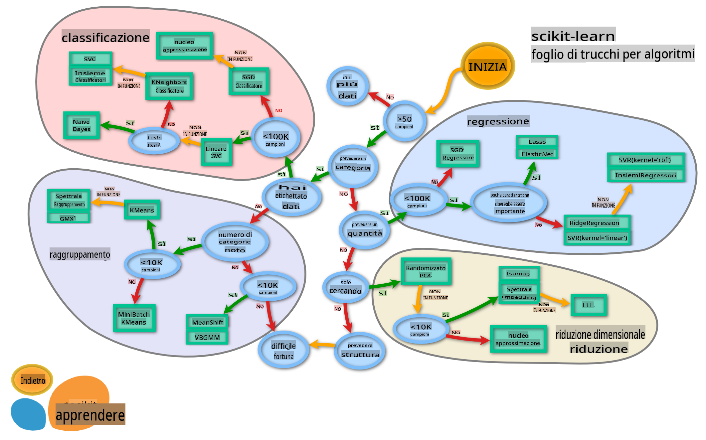

# Classificatori di cucina 2

In questa seconda lezione sulla classificazione, esplorerai ulteriori metodi per classificare i dati numerici. Imparerai anche le conseguenze della scelta di un classificatore rispetto a un altro.

## [Quiz pre-lezione](https://gray-sand-07a10f403.1.azurestaticapps.net/quiz/23/)

### Prerequisito

Presumiamo che tu abbia completato le lezioni precedenti e che tu abbia un dataset pulito nella tua cartella `data` chiamato _cleaned_cuisines.csv_ nella radice di questa cartella di 4 lezioni.

### Preparazione

Abbiamo caricato il tuo file _notebook.ipynb_ con il dataset pulito e lo abbiamo diviso in dataframe X e y, pronti per il processo di costruzione del modello.

## Una mappa della classificazione

In precedenza, hai imparato delle varie opzioni disponibili per classificare i dati utilizzando il cheat sheet di Microsoft. Scikit-learn offre un cheat sheet simile, ma più dettagliato, che può aiutare ulteriormente a restringere i tuoi stimatori (un altro termine per classificatori):


> Suggerimento: [visita questa mappa online](https://scikit-learn.org/stable/tutorial/machine_learning_map/) e clicca lungo il percorso per leggere la documentazione.

### Il piano

Questa mappa è molto utile una volta che hai una chiara comprensione dei tuoi dati, poiché puoi 'camminare' lungo i suoi percorsi verso una decisione:

- Abbiamo >50 campioni
- Vogliamo prevedere una categoria
- Abbiamo dati etichettati
- Abbiamo meno di 100K campioni
- ✨ Possiamo scegliere un Linear SVC
- Se non funziona, poiché abbiamo dati numerici
    - Possiamo provare un ✨ Classificatore KNeighbors 
      - Se non funziona, prova ✨ SVC e ✨ Classificatori Ensemble

Questo è un percorso molto utile da seguire.

## Esercizio - dividere i dati

Seguendo questo percorso, dovremmo iniziare importando alcune librerie da utilizzare.

1. Importa le librerie necessarie:

    ```python
    from sklearn.neighbors import KNeighborsClassifier
    from sklearn.linear_model import LogisticRegression
    from sklearn.svm import SVC
    from sklearn.ensemble import RandomForestClassifier, AdaBoostClassifier
    from sklearn.model_selection import train_test_split, cross_val_score
    from sklearn.metrics import accuracy_score,precision_score,confusion_matrix,classification_report, precision_recall_curve
    import numpy as np
    ```

1. Dividi i tuoi dati di addestramento e di test:

    ```python
    X_train, X_test, y_train, y_test = train_test_split(cuisines_feature_df, cuisines_label_df, test_size=0.3)
    ```

## Classificatore Linear SVC

Il clustering Support-Vector (SVC) è un componente della famiglia delle macchine Support-Vector (SVM) di tecniche ML (scopri di più su queste di seguito). In questo metodo, puoi scegliere un 'kernel' per decidere come raggruppare le etichette. Il parametro 'C' si riferisce alla 'regolarizzazione' che regola l'influenza dei parametri. Il kernel può essere uno di [diversi](https://scikit-learn.org/stable/modules/generated/sklearn.svm.SVC.html#sklearn.svm.SVC); qui lo impostiamo su 'lineare' per assicurarci di sfruttare Linear SVC. La probabilità di default è 'false'; qui la impostiamo su 'true' per raccogliere stime di probabilità. Impostiamo lo stato casuale su '0' per mescolare i dati e ottenere probabilità.

### Esercizio - applica un Linear SVC

Inizia creando un array di classificatori. Aggiungerai progressivamente a questo array man mano che testiamo. 

1. Inizia con un Linear SVC:

    ```python
    C = 10
    # Create different classifiers.
    classifiers = {
        'Linear SVC': SVC(kernel='linear', C=C, probability=True,random_state=0)
    }
    ```

2. Addestra il tuo modello utilizzando il Linear SVC e stampa un report:

    ```python
    n_classifiers = len(classifiers)
    
    for index, (name, classifier) in enumerate(classifiers.items()):
        classifier.fit(X_train, np.ravel(y_train))
    
        y_pred = classifier.predict(X_test)
        accuracy = accuracy_score(y_test, y_pred)
        print("Accuracy (train) for %s: %0.1f%% " % (name, accuracy * 100))
        print(classification_report(y_test,y_pred))
    ```

    Il risultato è piuttosto buono:

    ```output
    Accuracy (train) for Linear SVC: 78.6% 
                  precision    recall  f1-score   support
    
         chinese       0.71      0.67      0.69       242
          indian       0.88      0.86      0.87       234
        japanese       0.79      0.74      0.76       254
          korean       0.85      0.81      0.83       242
            thai       0.71      0.86      0.78       227
    
        accuracy                           0.79      1199
       macro avg       0.79      0.79      0.79      1199
    weighted avg       0.79      0.79      0.79      1199
    ```

## Classificatore K-Neighbors

K-Neighbors fa parte della famiglia di metodi ML "vicini", che può essere utilizzata sia per l'apprendimento supervisionato che non supervisionato. In questo metodo, viene creato un numero predefinito di punti e i dati vengono raccolti attorno a questi punti in modo tale che possano essere previste etichette generalizzate per i dati.

### Esercizio - applica il classificatore K-Neighbors

Il classificatore precedente era buono e funzionava bene con i dati, ma forse possiamo ottenere una precisione migliore. Prova un classificatore K-Neighbors.

1. Aggiungi una riga al tuo array di classificatori (aggiungi una virgola dopo l'elemento Linear SVC):

    ```python
    'KNN classifier': KNeighborsClassifier(C),
    ```

    Il risultato è un po' peggiore:

    ```output
    Accuracy (train) for KNN classifier: 73.8% 
                  precision    recall  f1-score   support
    
         chinese       0.64      0.67      0.66       242
          indian       0.86      0.78      0.82       234
        japanese       0.66      0.83      0.74       254
          korean       0.94      0.58      0.72       242
            thai       0.71      0.82      0.76       227
    
        accuracy                           0.74      1199
       macro avg       0.76      0.74      0.74      1199
    weighted avg       0.76      0.74      0.74      1199
    ```

    ✅ Scopri di più su [K-Neighbors](https://scikit-learn.org/stable/modules/neighbors.html#neighbors)

## Classificatore Support Vector

I classificatori Support-Vector fanno parte della famiglia delle [Support-Vector Machine](https://wikipedia.org/wiki/Support-vector_machine) di metodi ML che vengono utilizzati per compiti di classificazione e regressione. Le SVM "mappano esempi di addestramento su punti nello spazio" per massimizzare la distanza tra due categorie. I dati successivi vengono mappati in questo spazio in modo che la loro categoria possa essere prevista.

### Esercizio - applica un Support Vector Classifier

Proviamo a ottenere una precisione leggermente migliore con un Support Vector Classifier.

1. Aggiungi una virgola dopo l'elemento K-Neighbors, e poi aggiungi questa riga:

    ```python
    'SVC': SVC(),
    ```

    Il risultato è piuttosto buono!

    ```output
    Accuracy (train) for SVC: 83.2% 
                  precision    recall  f1-score   support
    
         chinese       0.79      0.74      0.76       242
          indian       0.88      0.90      0.89       234
        japanese       0.87      0.81      0.84       254
          korean       0.91      0.82      0.86       242
            thai       0.74      0.90      0.81       227
    
        accuracy                           0.83      1199
       macro avg       0.84      0.83      0.83      1199
    weighted avg       0.84      0.83      0.83      1199
    ```

    ✅ Scopri di più su [Support-Vectors](https://scikit-learn.org/stable/modules/svm.html#svm)

## Classificatori Ensemble

Seguiamo il percorso fino alla fine, anche se il test precedente era piuttosto buono. Proviamo alcuni 'Classificatori Ensemble', in particolare Random Forest e AdaBoost:

```python
  'RFST': RandomForestClassifier(n_estimators=100),
  'ADA': AdaBoostClassifier(n_estimators=100)
```

Il risultato è molto buono, specialmente per Random Forest:

```output
Accuracy (train) for RFST: 84.5% 
              precision    recall  f1-score   support

     chinese       0.80      0.77      0.78       242
      indian       0.89      0.92      0.90       234
    japanese       0.86      0.84      0.85       254
      korean       0.88      0.83      0.85       242
        thai       0.80      0.87      0.83       227

    accuracy                           0.84      1199
   macro avg       0.85      0.85      0.84      1199
weighted avg       0.85      0.84      0.84      1199

Accuracy (train) for ADA: 72.4% 
              precision    recall  f1-score   support

     chinese       0.64      0.49      0.56       242
      indian       0.91      0.83      0.87       234
    japanese       0.68      0.69      0.69       254
      korean       0.73      0.79      0.76       242
        thai       0.67      0.83      0.74       227

    accuracy                           0.72      1199
   macro avg       0.73      0.73      0.72      1199
weighted avg       0.73      0.72      0.72      1199
```

✅ Scopri di più sui [Classificatori Ensemble](https://scikit-learn.org/stable/modules/ensemble.html)

Questo metodo di Machine Learning "combina le previsioni di diversi stimatori di base" per migliorare la qualità del modello. Nel nostro esempio, abbiamo utilizzato Random Trees e AdaBoost. 

- [Random Forest](https://scikit-learn.org/stable/modules/ensemble.html#forest), un metodo di mediazione, costruisce una 'foresta' di 'alberi decisionali' infusi di casualità per evitare l'overfitting. Il parametro n_estimators è impostato sul numero di alberi.

- [AdaBoost](https://scikit-learn.org/stable/modules/generated/sklearn.ensemble.AdaBoostClassifier.html) adatta un classificatore a un dataset e poi adatta copie di quel classificatore allo stesso dataset. Si concentra sui pesi degli elementi classificati in modo errato e regola l'adattamento per il classificatore successivo per correggere.

---

## 🚀Sfida

Ognuna di queste tecniche ha un gran numero di parametri che puoi modificare. Ricerca i parametri di default di ciascuna e pensa a cosa significherebbe modificare questi parametri per la qualità del modello.

## [Quiz post-lezione](https://gray-sand-07a10f403.1.azurestaticapps.net/quiz/24/)

## Revisione & Studio Autonomo

C'è molto gergo in queste lezioni, quindi prenditi un momento per rivedere [questa lista](https://docs.microsoft.com/dotnet/machine-learning/resources/glossary?WT.mc_id=academic-77952-leestott) di terminologia utile!

## Compito

[Gioca con i parametri](assignment.md)

**Disclaimer**:
Questo documento è stato tradotto utilizzando servizi di traduzione automatizzati basati su AI. Sebbene ci impegniamo per l'accuratezza, si prega di notare che le traduzioni automatiche possono contenere errori o imprecisioni. Il documento originale nella sua lingua nativa dovrebbe essere considerato la fonte autorevole. Per informazioni critiche, si raccomanda una traduzione professionale umana. Non siamo responsabili per eventuali malintesi o interpretazioni errate derivanti dall'uso di questa traduzione.