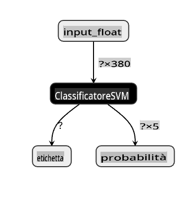
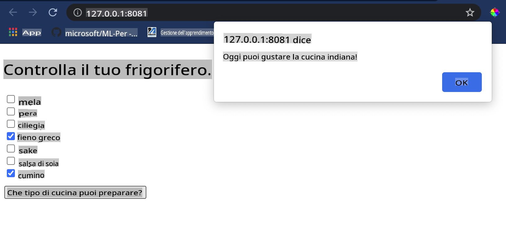

# Costruisci un'app web per consigliare cucine

In questa lezione, costruirai un modello di classificazione utilizzando alcune delle tecniche che hai imparato nelle lezioni precedenti e con il delizioso dataset di cucine utilizzato in tutta questa serie. Inoltre, costruirai una piccola app web per utilizzare un modello salvato, sfruttando il runtime web di Onnx.

Uno degli usi pratici più utili del machine learning è la costruzione di sistemi di raccomandazione, e oggi puoi fare il primo passo in quella direzione!

[](https://youtu.be/17wdM9AHMfg "Applied ML")

> 🎥 Clicca sull'immagine sopra per un video: Jen Looper costruisce un'app web utilizzando dati classificati di cucina

## [Quiz pre-lezione](https://gray-sand-07a10f403.1.azurestaticapps.net/quiz/25/)

In questa lezione imparerai:

- Come costruire un modello e salvarlo come modello Onnx
- Come usare Netron per ispezionare il modello
- Come utilizzare il tuo modello in un'app web per inferenza

## Costruisci il tuo modello

Costruire sistemi di ML applicati è una parte importante per sfruttare queste tecnologie nei tuoi sistemi aziendali. Puoi utilizzare modelli all'interno delle tue applicazioni web (e quindi usarli in un contesto offline se necessario) utilizzando Onnx.

In una [lezione precedente](../../3-Web-App/1-Web-App/README.md), hai costruito un modello di regressione sulle osservazioni UFO, lo hai "pickled" e utilizzato in un'app Flask. Sebbene questa architettura sia molto utile da conoscere, è un'app Python full-stack, e i tuoi requisiti potrebbero includere l'uso di un'applicazione JavaScript.

In questa lezione, puoi costruire un sistema di base basato su JavaScript per l'inferenza. Tuttavia, prima devi addestrare un modello e convertirlo per l'uso con Onnx.

## Esercizio - addestra il modello di classificazione

Prima di tutto, addestra un modello di classificazione utilizzando il dataset di cucine pulito che abbiamo usato.

1. Inizia importando le librerie utili:

    ```python
    !pip install skl2onnx
    import pandas as pd 
    ```

    Ti serve '[skl2onnx](https://onnx.ai/sklearn-onnx/)' per aiutarti a convertire il tuo modello Scikit-learn in formato Onnx.

1. Poi, lavora con i tuoi dati nello stesso modo in cui hai fatto nelle lezioni precedenti, leggendo un file CSV usando `read_csv()`:

    ```python
    data = pd.read_csv('../data/cleaned_cuisines.csv')
    data.head()
    ```

1. Rimuovi le prime due colonne non necessarie e salva i dati rimanenti come 'X':

    ```python
    X = data.iloc[:,2:]
    X.head()
    ```

1. Salva le etichette come 'y':

    ```python
    y = data[['cuisine']]
    y.head()
    
    ```

### Inizia la routine di addestramento

Utilizzeremo la libreria 'SVC' che ha una buona accuratezza.

1. Importa le librerie appropriate da Scikit-learn:

    ```python
    from sklearn.model_selection import train_test_split
    from sklearn.svm import SVC
    from sklearn.model_selection import cross_val_score
    from sklearn.metrics import accuracy_score,precision_score,confusion_matrix,classification_report
    ```

1. Separa i set di addestramento e test:

    ```python
    X_train, X_test, y_train, y_test = train_test_split(X,y,test_size=0.3)
    ```

1. Costruisci un modello di classificazione SVC come hai fatto nella lezione precedente:

    ```python
    model = SVC(kernel='linear', C=10, probability=True,random_state=0)
    model.fit(X_train,y_train.values.ravel())
    ```

1. Ora, testa il tuo modello, chiamando `predict()`:

    ```python
    y_pred = model.predict(X_test)
    ```

1. Stampa un rapporto di classificazione per verificare la qualità del modello:

    ```python
    print(classification_report(y_test,y_pred))
    ```

    Come abbiamo visto prima, l'accuratezza è buona:

    ```output
                    precision    recall  f1-score   support
    
         chinese       0.72      0.69      0.70       257
          indian       0.91      0.87      0.89       243
        japanese       0.79      0.77      0.78       239
          korean       0.83      0.79      0.81       236
            thai       0.72      0.84      0.78       224
    
        accuracy                           0.79      1199
       macro avg       0.79      0.79      0.79      1199
    weighted avg       0.79      0.79      0.79      1199
    ```

### Converti il tuo modello in Onnx

Assicurati di fare la conversione con il numero corretto di Tensor. Questo dataset ha 380 ingredienti elencati, quindi devi annotare quel numero in `FloatTensorType`:

1. Converti usando un numero di tensor di 380.

    ```python
    from skl2onnx import convert_sklearn
    from skl2onnx.common.data_types import FloatTensorType
    
    initial_type = [('float_input', FloatTensorType([None, 380]))]
    options = {id(model): {'nocl': True, 'zipmap': False}}
    ```

1. Crea il file onx e salvalo come **model.onnx**:

    ```python
    onx = convert_sklearn(model, initial_types=initial_type, options=options)
    with open("./model.onnx", "wb") as f:
        f.write(onx.SerializeToString())
    ```

    > Nota, puoi passare [opzioni](https://onnx.ai/sklearn-onnx/parameterized.html) nel tuo script di conversione. In questo caso, abbiamo passato 'nocl' come True e 'zipmap' come False. Poiché questo è un modello di classificazione, hai l'opzione di rimuovere ZipMap che produce un elenco di dizionari (non necessario). `nocl` refers to class information being included in the model. Reduce your model's size by setting `nocl` to 'True'. 

Running the entire notebook will now build an Onnx model and save it to this folder.

## View your model

Onnx models are not very visible in Visual Studio code, but there's a very good free software that many researchers use to visualize the model to ensure that it is properly built. Download [Netron](https://github.com/lutzroeder/Netron) and  open your model.onnx file. You can see your simple model visualized, with its 380 inputs and classifier listed:



Netron is a helpful tool to view your models.

Now you are ready to use this neat model in a web app. Let's build an app that will come in handy when you look in your refrigerator and try to figure out which combination of your leftover ingredients you can use to cook a given cuisine, as determined by your model.

## Build a recommender web application

You can use your model directly in a web app. This architecture also allows you to run it locally and even offline if needed. Start by creating an `index.html` file in the same folder where you stored your `model.onnx` file.

1. In questo file _index.html_, aggiungi il seguente markup:

    ```html
    <!DOCTYPE html>
    <html>
        <header>
            <title>Cuisine Matcher</title>
        </header>
        <body>
            ...
        </body>
    </html>
    ```

1. Ora, lavorando all'interno dei tag `body`, aggiungi un po' di markup per mostrare un elenco di caselle di controllo che riflettono alcuni ingredienti:

    ```html
    <h1>Check your refrigerator. What can you create?</h1>
            <div id="wrapper">
                <div class="boxCont">
                    <input type="checkbox" value="4" class="checkbox">
                    <label>apple</label>
                </div>
            
                <div class="boxCont">
                    <input type="checkbox" value="247" class="checkbox">
                    <label>pear</label>
                </div>
            
                <div class="boxCont">
                    <input type="checkbox" value="77" class="checkbox">
                    <label>cherry</label>
                </div>
    
                <div class="boxCont">
                    <input type="checkbox" value="126" class="checkbox">
                    <label>fenugreek</label>
                </div>
    
                <div class="boxCont">
                    <input type="checkbox" value="302" class="checkbox">
                    <label>sake</label>
                </div>
    
                <div class="boxCont">
                    <input type="checkbox" value="327" class="checkbox">
                    <label>soy sauce</label>
                </div>
    
                <div class="boxCont">
                    <input type="checkbox" value="112" class="checkbox">
                    <label>cumin</label>
                </div>
            </div>
            <div style="padding-top:10px">
                <button onClick="startInference()">What kind of cuisine can you make?</button>
            </div> 
    ```

    Nota che ogni casella di controllo ha un valore. Questo riflette l'indice dove l'ingrediente si trova secondo il dataset. La mela, per esempio, in questa lista alfabetica, occupa la quinta colonna, quindi il suo valore è '4' poiché iniziamo a contare da 0. Puoi consultare il [foglio di calcolo degli ingredienti](../../../../4-Classification/data/ingredient_indexes.csv) per scoprire l'indice di un dato ingrediente.

    Continuando il tuo lavoro nel file index.html, aggiungi un blocco di script dove il modello viene chiamato dopo l'ultimo `</div>` di chiusura.

1. Prima, importa il [Runtime Onnx](https://www.onnxruntime.ai/):

    ```html
    <script src="https://cdn.jsdelivr.net/npm/onnxruntime-web@1.9.0/dist/ort.min.js"></script> 
    ```

    > Onnx Runtime è utilizzato per abilitare l'esecuzione dei tuoi modelli Onnx su una vasta gamma di piattaforme hardware, inclusi ottimizzazioni e un'API da utilizzare.

1. Una volta che il Runtime è in posizione, puoi chiamarlo:

    ```html
    <script>
        const ingredients = Array(380).fill(0);
        
        const checks = [...document.querySelectorAll('.checkbox')];
        
        checks.forEach(check => {
            check.addEventListener('change', function() {
                // toggle the state of the ingredient
                // based on the checkbox's value (1 or 0)
                ingredients[check.value] = check.checked ? 1 : 0;
            });
        });

        function testCheckboxes() {
            // validate if at least one checkbox is checked
            return checks.some(check => check.checked);
        }

        async function startInference() {

            let atLeastOneChecked = testCheckboxes()

            if (!atLeastOneChecked) {
                alert('Please select at least one ingredient.');
                return;
            }
            try {
                // create a new session and load the model.
                
                const session = await ort.InferenceSession.create('./model.onnx');

                const input = new ort.Tensor(new Float32Array(ingredients), [1, 380]);
                const feeds = { float_input: input };

                // feed inputs and run
                const results = await session.run(feeds);

                // read from results
                alert('You can enjoy ' + results.label.data[0] + ' cuisine today!')

            } catch (e) {
                console.log(`failed to inference ONNX model`);
                console.error(e);
            }
        }
               
    </script>
    ```

In questo codice, ci sono diverse cose che stanno succedendo:

1. Hai creato un array di 380 valori possibili (1 o 0) da impostare e inviare al modello per l'inferenza, a seconda che una casella di controllo dell'ingrediente sia selezionata.
2. Hai creato un array di caselle di controllo e un modo per determinare se sono state selezionate in un `init` function that is called when the application starts. When a checkbox is checked, the `ingredients` array is altered to reflect the chosen ingredient.
3. You created a `testCheckboxes` function that checks whether any checkbox was checked.
4. You use `startInference` function when the button is pressed and, if any checkbox is checked, you start inference.
5. The inference routine includes:
   1. Setting up an asynchronous load of the model
   2. Creating a Tensor structure to send to the model
   3. Creating 'feeds' that reflects the `float_input` input that you created when training your model (you can use Netron to verify that name)
   4. Sending these 'feeds' to the model and waiting for a response

## Test your application

Open a terminal session in Visual Studio Code in the folder where your index.html file resides. Ensure that you have [http-server](https://www.npmjs.com/package/http-server) installed globally, and type `http-server` al prompt. Si dovrebbe aprire un localhost e puoi visualizzare la tua app web. Controlla quale cucina viene consigliata in base a vari ingredienti:



Congratulazioni, hai creato un'app web di 'raccomandazione' con alcuni campi. Prenditi del tempo per sviluppare ulteriormente questo sistema!
## 🚀Sfida

La tua app web è molto minimale, quindi continua a svilupparla utilizzando gli ingredienti e i loro indici dai dati [ingredient_indexes](../../../../4-Classification/data/ingredient_indexes.csv). Quali combinazioni di sapori funzionano per creare un piatto nazionale dato?

## [Quiz post-lezione](https://gray-sand-07a10f403.1.azurestaticapps.net/quiz/26/)

## Revisione e auto-studio

Mentre questa lezione ha solo toccato l'utilità di creare un sistema di raccomandazione per gli ingredienti alimentari, quest'area delle applicazioni ML è molto ricca di esempi. Leggi di più su come vengono costruiti questi sistemi:

- https://www.sciencedirect.com/topics/computer-science/recommendation-engine
- https://www.technologyreview.com/2014/08/25/171547/the-ultimate-challenge-for-recommendation-engines/
- https://www.technologyreview.com/2015/03/23/168831/everything-is-a-recommendation/

## Compito

[Costruisci un nuovo raccomandatore](assignment.md)

**Disclaimer**: 
Questo documento è stato tradotto utilizzando servizi di traduzione automatizzata basati su AI. Sebbene ci sforziamo di garantire l'accuratezza, si prega di essere consapevoli che le traduzioni automatizzate possono contenere errori o imprecisioni. Il documento originale nella sua lingua nativa dovrebbe essere considerato la fonte autorevole. Per informazioni critiche, si raccomanda una traduzione umana professionale. Non siamo responsabili per eventuali incomprensioni o interpretazioni errate derivanti dall'uso di questa traduzione.