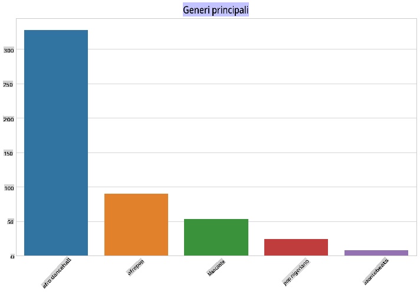
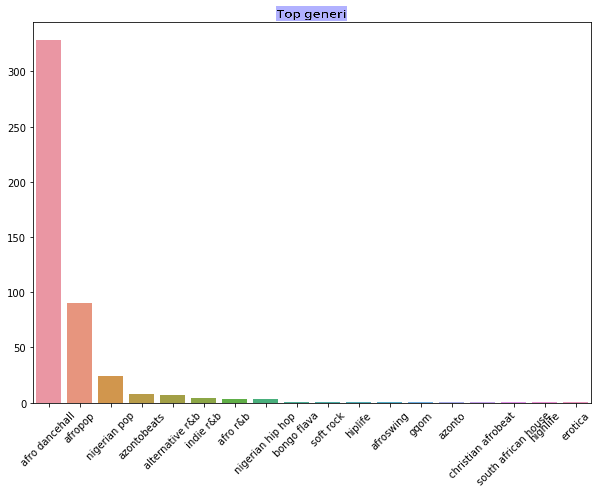
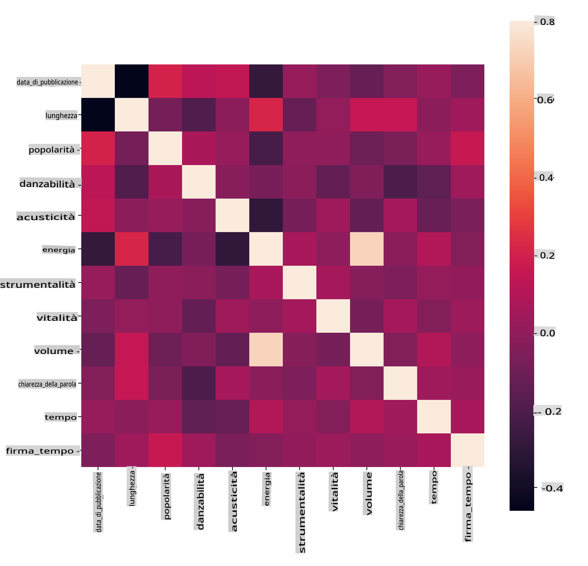
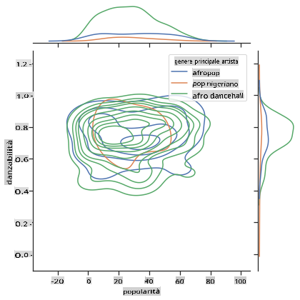
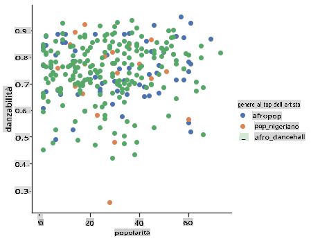

<!--
CO_OP_TRANSLATOR_METADATA:
{
  "original_hash": "0ab69b161efd7a41d325ee28b29415d7",
  "translation_date": "2025-08-29T21:03:11+00:00",
  "source_file": "5-Clustering/1-Visualize/README.md",
  "language_code": "it"
}
-->
# Introduzione al clustering

Il clustering è un tipo di [Apprendimento Non Supervisionato](https://wikipedia.org/wiki/Apprendimento_non_supervisionato) che presuppone che un dataset sia non etichettato o che i suoi input non siano associati a output predefiniti. Utilizza vari algoritmi per analizzare dati non etichettati e fornire raggruppamenti basati sui pattern individuati nei dati.

[](https://youtu.be/ty2advRiWJM "No One Like You by PSquare")

> 🎥 Clicca sull'immagine sopra per un video. Mentre studi il machine learning con il clustering, goditi alcune tracce di Dance Hall nigeriana - questa è una canzone molto apprezzata del 2014 di PSquare.

## [Quiz pre-lezione](https://gray-sand-07a10f403.1.azurestaticapps.net/quiz/27/)

### Introduzione

[Clustering](https://link.springer.com/referenceworkentry/10.1007%2F978-0-387-30164-8_124) è molto utile per l'esplorazione dei dati. Vediamo se può aiutare a scoprire tendenze e pattern nel modo in cui il pubblico nigeriano consuma musica.

✅ Prenditi un minuto per riflettere sugli utilizzi del clustering. Nella vita reale, il clustering avviene ogni volta che hai un mucchio di bucato e devi separare i vestiti dei membri della tua famiglia 🧦👕👖🩲. In data science, il clustering avviene quando si cerca di analizzare le preferenze di un utente o determinare le caratteristiche di un dataset non etichettato. Il clustering, in un certo senso, aiuta a dare un senso al caos, come un cassetto di calzini.

[](https://youtu.be/esmzYhuFnds "Introduzione al Clustering")

> 🎥 Clicca sull'immagine sopra per un video: John Guttag del MIT introduce il clustering.

In un contesto professionale, il clustering può essere utilizzato per determinare cose come la segmentazione del mercato, ad esempio per capire quali fasce d'età acquistano determinati articoli. Un altro utilizzo potrebbe essere la rilevazione di anomalie, magari per individuare frodi in un dataset di transazioni con carta di credito. Oppure potresti usare il clustering per identificare tumori in un lotto di scansioni mediche.

✅ Prenditi un minuto per riflettere su come potresti aver incontrato il clustering "nel mondo reale", in un contesto bancario, di e-commerce o aziendale.

> 🎓 Curiosamente, l'analisi dei cluster ha avuto origine nei campi dell'Antropologia e della Psicologia negli anni '30. Riesci a immaginare come potrebbe essere stata utilizzata?

In alternativa, potresti usarlo per raggruppare i risultati di ricerca - ad esempio per link di shopping, immagini o recensioni. Il clustering è utile quando hai un grande dataset che vuoi ridurre e su cui vuoi eseguire un'analisi più granulare, quindi la tecnica può essere utilizzata per conoscere i dati prima di costruire altri modelli.

✅ Una volta che i tuoi dati sono organizzati in cluster, assegni loro un Id di cluster, e questa tecnica può essere utile per preservare la privacy di un dataset; puoi invece fare riferimento a un punto dati tramite il suo Id di cluster, piuttosto che tramite dati identificabili più rivelatori. Riesci a pensare ad altri motivi per cui potresti preferire fare riferimento a un Id di cluster piuttosto che ad altri elementi del cluster per identificarlo?

Approfondisci la tua comprensione delle tecniche di clustering in questo [modulo di apprendimento](https://docs.microsoft.com/learn/modules/train-evaluate-cluster-models?WT.mc_id=academic-77952-leestott).

## Introduzione al clustering

[Scikit-learn offre una vasta gamma](https://scikit-learn.org/stable/modules/clustering.html) di metodi per eseguire il clustering. Il tipo che scegli dipenderà dal tuo caso d'uso. Secondo la documentazione, ogni metodo ha vari vantaggi. Ecco una tabella semplificata dei metodi supportati da Scikit-learn e i loro casi d'uso appropriati:

| Nome del metodo              | Caso d'uso                                                             |
| :--------------------------- | :--------------------------------------------------------------------- |
| K-Means                      | scopo generale, induttivo                                              |
| Affinity propagation         | molti cluster, cluster disomogenei, induttivo                         |
| Mean-shift                   | molti cluster, cluster disomogenei, induttivo                         |
| Spectral clustering          | pochi cluster, cluster omogenei, transduttivo                         |
| Ward hierarchical clustering | molti cluster, cluster vincolati, transduttivo                        |
| Agglomerative clustering     | molti cluster vincolati, distanze non euclidee, transduttivo           |
| DBSCAN                       | geometria non piatta, cluster disomogenei, transduttivo               |
| OPTICS                       | geometria non piatta, cluster disomogenei con densità variabile, transduttivo |
| Gaussian mixtures            | geometria piatta, induttivo                                           |
| BIRCH                        | dataset grande con outlier, induttivo                                 |

> 🎓 Come creiamo i cluster dipende molto da come raggruppiamo i punti dati in gruppi. Esploriamo un po' di vocabolario:
>
> 🎓 ['Transduttivo' vs. 'induttivo'](https://wikipedia.org/wiki/Transduction_(machine_learning))
> 
> L'inferenza transduttiva è derivata da casi di addestramento osservati che si mappano a casi di test specifici. L'inferenza induttiva è derivata da casi di addestramento che si mappano a regole generali che vengono poi applicate ai casi di test.
> 
> Un esempio: Immagina di avere un dataset solo parzialmente etichettato. Alcune cose sono 'dischi', altre 'cd', e alcune sono vuote. Il tuo compito è fornire etichette per i dati vuoti. Se scegli un approccio induttivo, addestreresti un modello cercando 'dischi' e 'cd', e applicheresti quelle etichette ai dati non etichettati. Questo approccio avrà difficoltà a classificare cose che in realtà sono 'cassette'. Un approccio transduttivo, invece, gestisce questi dati sconosciuti più efficacemente poiché lavora per raggruppare elementi simili e poi applica un'etichetta a un gruppo. In questo caso, i cluster potrebbero riflettere 'cose musicali rotonde' e 'cose musicali quadrate'.
> 
> 🎓 ['Geometria non piatta' vs. 'piatta'](https://datascience.stackexchange.com/questions/52260/terminology-flat-geometry-in-the-context-of-clustering)
> 
> Derivata dalla terminologia matematica, la geometria non piatta vs. piatta si riferisce alla misura delle distanze tra punti utilizzando metodi geometrici 'piatti' ([Euclidei](https://wikipedia.org/wiki/Geometria_euclidea)) o 'non piatti' (non Euclidei).
>
>'Piatta' in questo contesto si riferisce alla geometria euclidea (parte della quale viene insegnata come geometria 'piana'), e 'non piatta' si riferisce alla geometria non euclidea. Cosa c'entra la geometria con il machine learning? Bene, essendo due campi radicati nella matematica, deve esserci un modo comune per misurare le distanze tra punti nei cluster, e ciò può essere fatto in modo 'piatto' o 'non piatto', a seconda della natura dei dati. [Le distanze euclidee](https://wikipedia.org/wiki/Distanza_euclidea) sono misurate come la lunghezza di un segmento di linea tra due punti. [Le distanze non euclidee](https://wikipedia.org/wiki/Geometria_non_euclidea) sono misurate lungo una curva. Se i tuoi dati, visualizzati, sembrano non esistere su un piano, potresti dover utilizzare un algoritmo specializzato per gestirli.
>

> Infografica di [Dasani Madipalli](https://twitter.com/dasani_decoded)
> 
> 🎓 ['Distanze'](https://web.stanford.edu/class/cs345a/slides/12-clustering.pdf)
> 
> I cluster sono definiti dalla loro matrice di distanze, ad esempio le distanze tra punti. Questa distanza può essere misurata in diversi modi. I cluster euclidei sono definiti dalla media dei valori dei punti e contengono un 'centroide' o punto centrale. Le distanze sono quindi misurate dalla distanza da quel centroide. Le distanze non euclidee si riferiscono ai 'clustroidi', il punto più vicino agli altri punti. I clustroidi a loro volta possono essere definiti in vari modi.
> 
> 🎓 ['Vincolati'](https://wikipedia.org/wiki/Constrained_clustering)
> 
> [Il clustering vincolato](https://web.cs.ucdavis.edu/~davidson/Publications/ICDMTutorial.pdf) introduce l'apprendimento 'semi-supervisionato' in questo metodo non supervisionato. Le relazioni tra i punti sono contrassegnate come 'non collegabili' o 'devono essere collegati', quindi alcune regole vengono imposte al dataset.
>
> Un esempio: Se un algoritmo viene lasciato libero su un lotto di dati non etichettati o semi-etichettati, i cluster che produce potrebbero essere di scarsa qualità. Nell'esempio sopra, i cluster potrebbero raggruppare 'cose musicali rotonde', 'cose musicali quadrate', 'cose triangolari' e 'biscotti'. Se vengono forniti alcuni vincoli, o regole da seguire ("l'oggetto deve essere fatto di plastica", "l'oggetto deve essere in grado di produrre musica") questo può aiutare a 'vincolare' l'algoritmo a fare scelte migliori.
> 
> 🎓 'Densità'
> 
> I dati che sono 'rumorosi' sono considerati 'densi'. Le distanze tra i punti in ciascuno dei suoi cluster possono dimostrarsi, all'esame, più o meno dense, o 'affollate', e quindi questi dati devono essere analizzati con il metodo di clustering appropriato. [Questo articolo](https://www.kdnuggets.com/2020/02/understanding-density-based-clustering.html) dimostra la differenza tra l'utilizzo del clustering K-Means e degli algoritmi HDBSCAN per esplorare un dataset rumoroso con densità di cluster disomogenea.

## Algoritmi di clustering

Esistono oltre 100 algoritmi di clustering, e il loro utilizzo dipende dalla natura dei dati a disposizione. Discutiamo alcuni dei principali:

- **Clustering gerarchico**. Se un oggetto viene classificato in base alla sua vicinanza a un oggetto vicino, piuttosto che a uno più lontano, i cluster vengono formati in base alla distanza dei loro membri da e verso altri oggetti. Il clustering agglomerativo di Scikit-learn è gerarchico.

   
   > Infografica di [Dasani Madipalli](https://twitter.com/dasani_decoded)

- **Clustering basato sul centroide**. Questo popolare algoritmo richiede la scelta di 'k', ovvero il numero di cluster da formare, dopodiché l'algoritmo determina il punto centrale di un cluster e raccoglie i dati attorno a quel punto. [Il clustering K-means](https://wikipedia.org/wiki/K-means_clustering) è una versione popolare del clustering basato sul centroide. Il centro è determinato dalla media più vicina, da cui il nome. La distanza quadrata dal cluster viene minimizzata.

   
   > Infografica di [Dasani Madipalli](https://twitter.com/dasani_decoded)

- **Clustering basato sulla distribuzione**. Basato sulla modellazione statistica, il clustering basato sulla distribuzione si concentra sulla determinazione della probabilità che un punto dati appartenga a un cluster, assegnandolo di conseguenza. I metodi di miscele gaussiane appartengono a questo tipo.

- **Clustering basato sulla densità**. I punti dati vengono assegnati ai cluster in base alla loro densità, o al loro raggruppamento reciproco. I punti dati lontani dal gruppo sono considerati outlier o rumore. DBSCAN, Mean-shift e OPTICS appartengono a questo tipo di clustering.

- **Clustering basato sulla griglia**. Per dataset multidimensionali, viene creata una griglia e i dati vengono divisi tra le celle della griglia, creando così cluster.

## Esercizio - raggruppa i tuoi dati

Il clustering come tecnica è notevolmente facilitato da una corretta visualizzazione, quindi iniziamo visualizzando i nostri dati musicali. Questo esercizio ci aiuterà a decidere quale dei metodi di clustering utilizzare in modo più efficace per la natura di questi dati.

1. Apri il file [_notebook.ipynb_](https://github.com/microsoft/ML-For-Beginners/blob/main/5-Clustering/1-Visualize/notebook.ipynb) in questa cartella.

1. Importa il pacchetto `Seaborn` per una buona visualizzazione dei dati.

    ```python
    !pip install seaborn
    ```

1. Aggiungi i dati delle canzoni da [_nigerian-songs.csv_](https://github.com/microsoft/ML-For-Beginners/blob/main/5-Clustering/data/nigerian-songs.csv). Carica un dataframe con alcuni dati sulle canzoni. Preparati a esplorare questi dati importando le librerie e visualizzando i dati:

    ```python
    import matplotlib.pyplot as plt
    import pandas as pd
    
    df = pd.read_csv("../data/nigerian-songs.csv")
    df.head()
    ```

    Controlla le prime righe di dati:

    |     | nome                     | album                        | artista              | genere_principale_artista | data_di_rilascio | durata | popolarità | ballabilità | acusticità | energia | strumentalità | vivacità | volume   | parlato     | tempo   | firma_temporale |
    | --- | ------------------------ | ---------------------------- | ------------------- | ------------------------- | ---------------- | ------ | ---------- | ----------- | ----------- | ------ | ------------- | -------- | -------- | ----------- | ------- | -------------- |
    | 0   | Sparky                   | Mandy & The Jungle           | Cruel Santino       | alternative r&b          | 2019             | 144000 | 48         | 0.666       | 0.851       | 0.42   | 0.534         | 0.11     | -6.699   | 0.0829      | 133.015 | 5              |
    | 1   | shuga rush               | EVERYTHING YOU HEARD IS TRUE | Odunsi (The Engine) | afropop                   | 2020             | 89488  | 30         | 0.71        | 0.0822      | 0.683  | 0.000169      | 0.101    | -5.64    | 0.36        | 129.993 | 3              |
| 2   | LITT!                    | LITT!                        | AYLØ                | indie r&b        | 2018         | 207758 | 40         | 0.836        | 0.272        | 0.564  | 0.000537         | 0.11     | -7.127   | 0.0424      | 130.005 | 4              |
| 3   | Confident / Feeling Cool | Enjoy Your Life              | Lady Donli          | nigerian pop     | 2019         | 175135 | 14         | 0.894        | 0.798        | 0.611  | 0.000187         | 0.0964   | -4.961   | 0.113       | 111.087 | 4              |
| 4   | wanted you               | rare.                        | Odunsi (The Engine) | afropop          | 2018         | 152049 | 25         | 0.702        | 0.116        | 0.833  | 0.91             | 0.348    | -6.044   | 0.0447      | 105.115 | 4              |

1. Ottieni alcune informazioni sul dataframe, chiamando `info()`:

    ```python
    df.info()
    ```

   L'output appare così:

    ```output
    <class 'pandas.core.frame.DataFrame'>
    RangeIndex: 530 entries, 0 to 529
    Data columns (total 16 columns):
     #   Column            Non-Null Count  Dtype  
    ---  ------            --------------  -----  
     0   name              530 non-null    object 
     1   album             530 non-null    object 
     2   artist            530 non-null    object 
     3   artist_top_genre  530 non-null    object 
     4   release_date      530 non-null    int64  
     5   length            530 non-null    int64  
     6   popularity        530 non-null    int64  
     7   danceability      530 non-null    float64
     8   acousticness      530 non-null    float64
     9   energy            530 non-null    float64
     10  instrumentalness  530 non-null    float64
     11  liveness          530 non-null    float64
     12  loudness          530 non-null    float64
     13  speechiness       530 non-null    float64
     14  tempo             530 non-null    float64
     15  time_signature    530 non-null    int64  
    dtypes: float64(8), int64(4), object(4)
    memory usage: 66.4+ KB
    ```

1. Controlla nuovamente la presenza di valori nulli, chiamando `isnull()` e verificando che la somma sia 0:

    ```python
    df.isnull().sum()
    ```

    Tutto sembra a posto:

    ```output
    name                0
    album               0
    artist              0
    artist_top_genre    0
    release_date        0
    length              0
    popularity          0
    danceability        0
    acousticness        0
    energy              0
    instrumentalness    0
    liveness            0
    loudness            0
    speechiness         0
    tempo               0
    time_signature      0
    dtype: int64
    ```

1. Descrivi i dati:

    ```python
    df.describe()
    ```

    |       | release_date | length      | popularity | danceability | acousticness | energy   | instrumentalness | liveness | loudness  | speechiness | tempo      | time_signature |
    | ----- | ------------ | ----------- | ---------- | ------------ | ------------ | -------- | ---------------- | -------- | --------- | ----------- | ---------- | -------------- |
    | count | 530          | 530         | 530        | 530          | 530          | 530      | 530              | 530      | 530       | 530         | 530        | 530            |
    | mean  | 2015.390566  | 222298.1698 | 17.507547  | 0.741619     | 0.265412     | 0.760623 | 0.016305         | 0.147308 | -4.953011 | 0.130748    | 116.487864 | 3.986792       |
    | std   | 3.131688     | 39696.82226 | 18.992212  | 0.117522     | 0.208342     | 0.148533 | 0.090321         | 0.123588 | 2.464186  | 0.092939    | 23.518601  | 0.333701       |
    | min   | 1998         | 89488       | 0          | 0.255        | 0.000665     | 0.111    | 0                | 0.0283   | -19.362   | 0.0278      | 61.695     | 3              |
    | 25%   | 2014         | 199305      | 0          | 0.681        | 0.089525     | 0.669    | 0                | 0.07565  | -6.29875  | 0.0591      | 102.96125  | 4              |
    | 50%   | 2016         | 218509      | 13         | 0.761        | 0.2205       | 0.7845   | 0.000004         | 0.1035   | -4.5585   | 0.09795     | 112.7145   | 4              |
    | 75%   | 2017         | 242098.5    | 31         | 0.8295       | 0.403        | 0.87575  | 0.000234         | 0.164    | -3.331    | 0.177       | 125.03925  | 4              |
    | max   | 2020         | 511738      | 73         | 0.966        | 0.954        | 0.995    | 0.91             | 0.811    | 0.582     | 0.514       | 206.007    | 5              |

> 🤔 Se stiamo lavorando con il clustering, un metodo non supervisionato che non richiede dati etichettati, perché stiamo mostrando questi dati con etichette? Nella fase di esplorazione dei dati, sono utili, ma non sono necessari affinché gli algoritmi di clustering funzionino. Potresti anche rimuovere le intestazioni delle colonne e fare riferimento ai dati per numero di colonna.

Osserva i valori generali dei dati. Nota che la popolarità può essere '0', il che indica canzoni che non hanno una classifica. Rimuoviamole a breve.

1. Usa un barplot per scoprire i generi più popolari:

    ```python
    import seaborn as sns
    
    top = df['artist_top_genre'].value_counts()
    plt.figure(figsize=(10,7))
    sns.barplot(x=top[:5].index,y=top[:5].values)
    plt.xticks(rotation=45)
    plt.title('Top genres',color = 'blue')
    ```

    

✅ Se desideri vedere più valori principali, modifica il top `[:5]` con un valore maggiore o rimuovilo per vedere tutto.

Nota che, quando il genere principale è descritto come 'Missing', significa che Spotify non lo ha classificato, quindi rimuoviamolo.

1. Elimina i dati mancanti filtrandoli:

    ```python
    df = df[df['artist_top_genre'] != 'Missing']
    top = df['artist_top_genre'].value_counts()
    plt.figure(figsize=(10,7))
    sns.barplot(x=top.index,y=top.values)
    plt.xticks(rotation=45)
    plt.title('Top genres',color = 'blue')
    ```

    Ora ricontrolla i generi:

    

1. Di gran lunga, i primi tre generi dominano questo dataset. Concentriamoci su `afro dancehall`, `afropop` e `nigerian pop`, filtrando inoltre il dataset per rimuovere qualsiasi valore di popolarità pari a 0 (il che significa che non è stato classificato con una popolarità nel dataset e può essere considerato rumore per i nostri scopi):

    ```python
    df = df[(df['artist_top_genre'] == 'afro dancehall') | (df['artist_top_genre'] == 'afropop') | (df['artist_top_genre'] == 'nigerian pop')]
    df = df[(df['popularity'] > 0)]
    top = df['artist_top_genre'].value_counts()
    plt.figure(figsize=(10,7))
    sns.barplot(x=top.index,y=top.values)
    plt.xticks(rotation=45)
    plt.title('Top genres',color = 'blue')
    ```

1. Fai un test rapido per vedere se i dati mostrano correlazioni particolarmente forti:

    ```python
    corrmat = df.corr(numeric_only=True)
    f, ax = plt.subplots(figsize=(12, 9))
    sns.heatmap(corrmat, vmax=.8, square=True)
    ```

    

    L'unica correlazione forte è tra `energy` e `loudness`, il che non è troppo sorprendente, dato che la musica forte è di solito piuttosto energica. Altrimenti, le correlazioni sono relativamente deboli. Sarà interessante vedere cosa può fare un algoritmo di clustering con questi dati.

    > 🎓 Nota che la correlazione non implica causalità! Abbiamo la prova della correlazione ma non la prova della causalità. Un [sito web divertente](https://tylervigen.com/spurious-correlations) ha alcune visualizzazioni che enfatizzano questo punto.

C'è qualche convergenza in questo dataset attorno alla percezione della popolarità e della ballabilità di una canzone? Un FacetGrid mostra che ci sono cerchi concentrici che si allineano, indipendentemente dal genere. Potrebbe essere che i gusti nigeriani convergano a un certo livello di ballabilità per questo genere?  

✅ Prova diversi punti dati (energy, loudness, speechiness) e più o diversi generi musicali. Cosa puoi scoprire? Dai un'occhiata alla tabella `df.describe()` per vedere la distribuzione generale dei punti dati.

### Esercizio - distribuzione dei dati

Questi tre generi sono significativamente diversi nella percezione della loro ballabilità, in base alla loro popolarità?

1. Esamina la distribuzione dei dati dei nostri tre generi principali per popolarità e ballabilità lungo un dato asse x e y.

    ```python
    sns.set_theme(style="ticks")
    
    g = sns.jointplot(
        data=df,
        x="popularity", y="danceability", hue="artist_top_genre",
        kind="kde",
    )
    ```

    Puoi scoprire cerchi concentrici attorno a un punto generale di convergenza, mostrando la distribuzione dei punti.

    > 🎓 Nota che questo esempio utilizza un grafico KDE (Kernel Density Estimate) che rappresenta i dati utilizzando una curva di densità di probabilità continua. Questo ci permette di interpretare i dati quando si lavora con più distribuzioni.

    In generale, i tre generi si allineano vagamente in termini di popolarità e ballabilità. Determinare cluster in questi dati vagamente allineati sarà una sfida:

    

1. Crea un grafico a dispersione:

    ```python
    sns.FacetGrid(df, hue="artist_top_genre", height=5) \
       .map(plt.scatter, "popularity", "danceability") \
       .add_legend()
    ```

    Un grafico a dispersione degli stessi assi mostra un modello simile di convergenza

    

In generale, per il clustering, puoi utilizzare grafici a dispersione per mostrare cluster di dati, quindi padroneggiare questo tipo di visualizzazione è molto utile. Nella prossima lezione, prenderemo questi dati filtrati e utilizzeremo il clustering k-means per scoprire gruppi in questi dati che sembrano sovrapporsi in modi interessanti.

---

## 🚀Sfida

In preparazione per la prossima lezione, crea un grafico sui vari algoritmi di clustering che potresti scoprire e utilizzare in un ambiente di produzione. Quali tipi di problemi il clustering cerca di affrontare?

## [Quiz post-lezione](https://gray-sand-07a10f403.1.azurestaticapps.net/quiz/28/)

## Revisione e studio autonomo

Prima di applicare algoritmi di clustering, come abbiamo imparato, è una buona idea comprendere la natura del tuo dataset. Leggi di più su questo argomento [qui](https://www.kdnuggets.com/2019/10/right-clustering-algorithm.html)

[Questo articolo utile](https://www.freecodecamp.org/news/8-clustering-algorithms-in-machine-learning-that-all-data-scientists-should-know/) ti guida attraverso i diversi modi in cui vari algoritmi di clustering si comportano, dati diversi tipi di forme dei dati.

## Compito

[Esplora altre visualizzazioni per il clustering](assignment.md)

---

**Disclaimer**:  
Questo documento è stato tradotto utilizzando il servizio di traduzione automatica [Co-op Translator](https://github.com/Azure/co-op-translator). Sebbene ci impegniamo per garantire l'accuratezza, si prega di notare che le traduzioni automatiche potrebbero contenere errori o imprecisioni. Il documento originale nella sua lingua nativa dovrebbe essere considerato la fonte autorevole. Per informazioni critiche, si consiglia una traduzione professionale eseguita da un traduttore umano. Non siamo responsabili per eventuali fraintendimenti o interpretazioni errate derivanti dall'uso di questa traduzione.