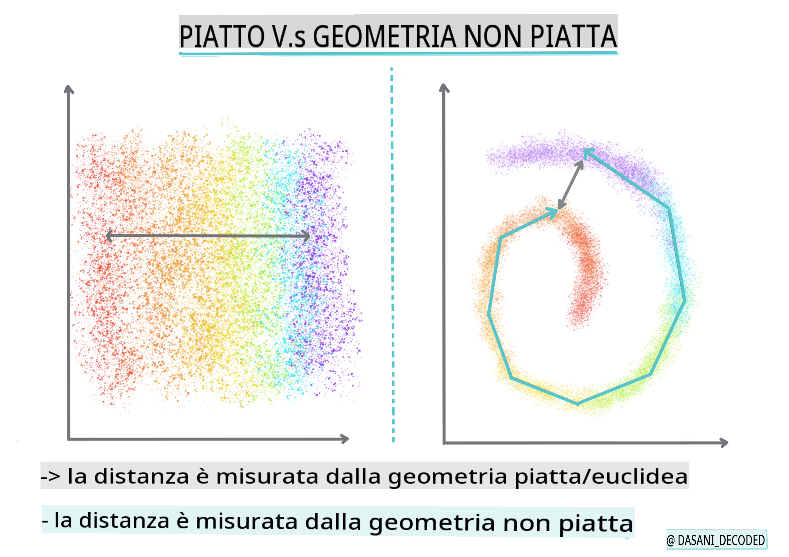
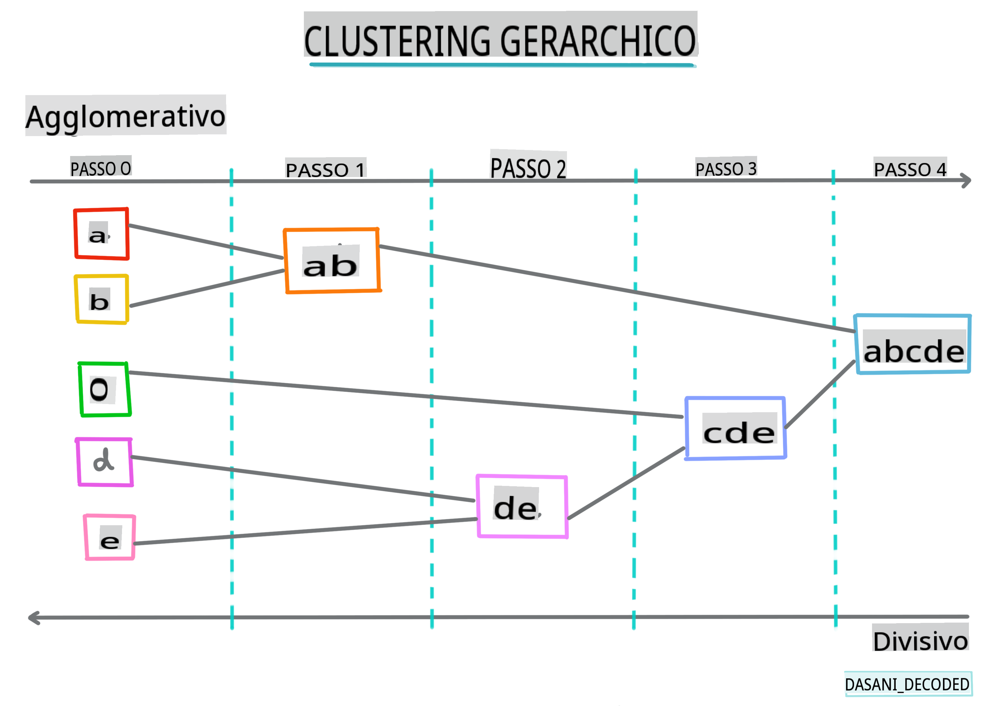
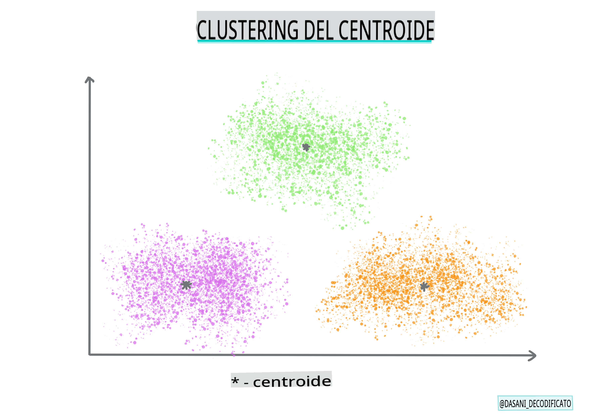

# Introduzione al clustering

Il clustering è un tipo di [Apprendimento Non Supervisionato](https://wikipedia.org/wiki/Unsupervised_learning) che presuppone che un dataset sia non etichettato o che i suoi input non siano associati a output predefiniti. Utilizza vari algoritmi per ordinare i dati non etichettati e fornire raggruppamenti secondo i pattern che rileva nei dati.

[](https://youtu.be/ty2advRiWJM "No One Like You di PSquare")

> 🎥 Clicca sull'immagine sopra per un video. Mentre studi il machine learning con il clustering, goditi alcuni brani Dance Hall nigeriani - questa è una canzone molto apprezzata del 2014 di PSquare.
## [Quiz pre-lezione](https://gray-sand-07a10f403.1.azurestaticapps.net/quiz/27/)
### Introduzione

Il [clustering](https://link.springer.com/referenceworkentry/10.1007%2F978-0-387-30164-8_124) è molto utile per l'esplorazione dei dati. Vediamo se può aiutare a scoprire tendenze e pattern nel modo in cui il pubblico nigeriano consuma musica.

✅ Prenditi un minuto per pensare agli usi del clustering. Nella vita reale, il clustering avviene ogni volta che hai un mucchio di biancheria e devi separare i vestiti dei membri della tua famiglia 🧦👕👖🩲. In data science, il clustering avviene quando si cerca di analizzare le preferenze di un utente o di determinare le caratteristiche di qualsiasi dataset non etichettato. Il clustering, in un certo senso, aiuta a dare un senso al caos, come un cassetto dei calzini.

[](https://youtu.be/esmzYhuFnds "Introduzione al Clustering")

> 🎥 Clicca sull'immagine sopra per un video: John Guttag del MIT introduce il clustering

In un contesto professionale, il clustering può essere utilizzato per determinare cose come la segmentazione del mercato, determinare quali fasce d'età acquistano quali articoli, per esempio. Un altro uso sarebbe il rilevamento delle anomalie, forse per rilevare frodi in un dataset di transazioni con carta di credito. Oppure potresti usare il clustering per determinare i tumori in un lotto di scansioni mediche.

✅ Pensa un minuto a come potresti aver incontrato il clustering 'nel mondo reale', in un contesto bancario, di e-commerce o aziendale.

> 🎓 Interessante, l'analisi dei cluster ha avuto origine nei campi dell'Antropologia e della Psicologia negli anni '30. Riesci a immaginare come potrebbe essere stata utilizzata?

In alternativa, potresti usarlo per raggruppare i risultati di ricerca - per link di shopping, immagini o recensioni, per esempio. Il clustering è utile quando hai un grande dataset che vuoi ridurre e su cui vuoi eseguire un'analisi più granulare, quindi la tecnica può essere utilizzata per conoscere i dati prima che vengano costruiti altri modelli.

✅ Una volta che i tuoi dati sono organizzati in cluster, gli assegni un Id di cluster, e questa tecnica può essere utile quando si preserva la privacy di un dataset; puoi invece fare riferimento a un punto dati tramite il suo Id di cluster, piuttosto che tramite dati identificabili più rivelatori. Riesci a pensare ad altri motivi per cui faresti riferimento a un Id di cluster piuttosto che ad altri elementi del cluster per identificarlo?

Approfondisci la tua comprensione delle tecniche di clustering in questo [modulo di apprendimento](https://docs.microsoft.com/learn/modules/train-evaluate-cluster-models?WT.mc_id=academic-77952-leestott)
## Iniziare con il clustering

[Scikit-learn offre una vasta gamma](https://scikit-learn.org/stable/modules/clustering.html) di metodi per eseguire il clustering. Il tipo che scegli dipenderà dal tuo caso d'uso. Secondo la documentazione, ogni metodo ha vari vantaggi. Ecco una tabella semplificata dei metodi supportati da Scikit-learn e i loro casi d'uso appropriati:

| Nome del metodo              | Caso d'uso                                                               |
| :--------------------------- | :--------------------------------------------------------------------- |
| K-Means                      | uso generale, induttivo                                                 |
| Affinity propagation         | molti, cluster irregolari, induttivo                                     |
| Mean-shift                   | molti, cluster irregolari, induttivo                                     |
| Spectral clustering          | pochi, cluster regolari, transduttivo                                    |
| Ward hierarchical clustering | molti, cluster vincolati, transduttivo                                   |
| Agglomerative clustering     | molti, vincolati, distanze non euclidee, transduttivo                    |
| DBSCAN                       | geometria non piatta, cluster irregolari, transduttivo                   |
| OPTICS                       | geometria non piatta, cluster irregolari con densità variabile, transduttivo |
| Gaussian mixtures            | geometria piatta, induttivo                                              |
| BIRCH                        | grande dataset con outlier, induttivo                                    |

> 🎓 Come creiamo i cluster ha molto a che fare con come raccogliamo i punti dati nei gruppi. Esploriamo un po' di vocabolario:
>
> 🎓 ['Transduttivo' vs. 'induttivo'](https://wikipedia.org/wiki/Transduction_(machine_learning))
> 
> L'inferenza transduttiva è derivata dai casi di addestramento osservati che mappano su casi di test specifici. L'inferenza induttiva è derivata dai casi di addestramento che mappano su regole generali che vengono poi applicate ai casi di test. 
> 
> Un esempio: Immagina di avere un dataset parzialmente etichettato. Alcune cose sono 'dischi', altre 'cd', e alcune sono vuote. Il tuo compito è fornire etichette per i vuoti. Se scegli un approccio induttivo, addestreresti un modello cercando 'dischi' e 'cd', e applichi quelle etichette ai tuoi dati non etichettati. Questo approccio avrà difficoltà a classificare cose che sono effettivamente 'cassette'. Un approccio transduttivo, d'altra parte, gestisce questi dati sconosciuti in modo più efficace poiché lavora per raggruppare oggetti simili e poi applica un'etichetta a un gruppo. In questo caso, i cluster potrebbero riflettere 'oggetti musicali rotondi' e 'oggetti musicali quadrati'. 
> 
> 🎓 ['Geometria non piatta' vs. 'piatta'](https://datascience.stackexchange.com/questions/52260/terminology-flat-geometry-in-the-context-of-clustering)
> 
> Derivato dalla terminologia matematica, la geometria non piatta vs. piatta si riferisce alla misura delle distanze tra punti tramite metodi geometrici 'piatti' ([Euclidei](https://wikipedia.org/wiki/Euclidean_geometry)) o 'non piatti' (non Euclidei). 
>
>'Piatta' in questo contesto si riferisce alla geometria euclidea (parti della quale sono insegnate come geometria 'piana'), e non piatta si riferisce alla geometria non euclidea. Cosa c'entra la geometria con il machine learning? Beh, come due campi che sono radicati nella matematica, deve esserci un modo comune per misurare le distanze tra punti nei cluster, e ciò può essere fatto in modo 'piatto' o 'non piatto', a seconda della natura dei dati. Le [distanze euclidee](https://wikipedia.org/wiki/Euclidean_distance) sono misurate come la lunghezza di un segmento di linea tra due punti. Le [distanze non euclidee](https://wikipedia.org/wiki/Non-Euclidean_geometry) sono misurate lungo una curva. Se i tuoi dati, visualizzati, sembrano non esistere su un piano, potresti dover usare un algoritmo specializzato per gestirli.
>

> Infografica di [Dasani Madipalli](https://twitter.com/dasani_decoded)
> 
> 🎓 ['Distanze'](https://web.stanford.edu/class/cs345a/slides/12-clustering.pdf)
> 
> I cluster sono definiti dalla loro matrice di distanze, ad esempio le distanze tra i punti. Questa distanza può essere misurata in vari modi. I cluster euclidei sono definiti dalla media dei valori dei punti e contengono un 'centroide' o punto centrale. Le distanze sono quindi misurate dalla distanza da quel centroide. Le distanze non euclidee si riferiscono ai 'clustroidi', il punto più vicino ad altri punti. I clustroidi a loro volta possono essere definiti in vari modi.
> 
> 🎓 ['Vincolato'](https://wikipedia.org/wiki/Constrained_clustering)
> 
> Il [Clustering Vincolato](https://web.cs.ucdavis.edu/~davidson/Publications/ICDMTutorial.pdf) introduce l'apprendimento 'semi-supervisionato' in questo metodo non supervisionato. Le relazioni tra i punti sono segnate come 'non può collegare' o 'deve collegare' quindi alcune regole vengono imposte sul dataset.
>
>Un esempio: Se un algoritmo viene lasciato libero su un lotto di dati non etichettati o semi-etichettati, i cluster che produce possono essere di scarsa qualità. Nell'esempio sopra, i cluster potrebbero raggruppare 'oggetti musicali rotondi' e 'oggetti musicali quadrati' e 'oggetti triangolari' e 'biscotti'. Se vengono dati alcuni vincoli, o regole da seguire ("l'oggetto deve essere fatto di plastica", "l'oggetto deve essere in grado di produrre musica") ciò può aiutare a 'vincolare' l'algoritmo a fare scelte migliori.
> 
> 🎓 'Densità'
> 
> I dati che sono 'rumorosi' sono considerati 'densi'. Le distanze tra i punti in ciascuno dei suoi cluster possono risultare, all'esame, più o meno dense, o 'affollate' e quindi questi dati devono essere analizzati con il metodo di clustering appropriato. [Questo articolo](https://www.kdnuggets.com/2020/02/understanding-density-based-clustering.html) dimostra la differenza tra l'uso del clustering K-Means e gli algoritmi HDBSCAN per esplorare un dataset rumoroso con densità di cluster irregolare.

## Algoritmi di clustering

Esistono oltre 100 algoritmi di clustering, e il loro utilizzo dipende dalla natura dei dati in questione. Discutiamo alcuni dei principali:

- **Clustering gerarchico**. Se un oggetto è classificato in base alla sua prossimità a un oggetto vicino, piuttosto che a uno più lontano, i cluster sono formati in base alla distanza dei loro membri da e verso altri oggetti. Il clustering agglomerativo di Scikit-learn è gerarchico.

   
   > Infografica di [Dasani Madipalli](https://twitter.com/dasani_decoded)

- **Clustering del centroide**. Questo popolare algoritmo richiede la scelta di 'k', ovvero il numero di cluster da formare, dopo di che l'algoritmo determina il punto centrale di un cluster e raccoglie i dati attorno a quel punto. Il [clustering K-means](https://wikipedia.org/wiki/K-means_clustering) è una versione popolare del clustering del centroide. Il centro è determinato dalla media più vicina, da cui il nome. La distanza quadrata dal cluster è minimizzata.

   
   > Infografica di [Dasani Madipalli](https://twitter.com/dasani_decoded)

- **Clustering basato sulla distribuzione**. Basato sulla modellazione statistica, il clustering basato sulla distribuzione si concentra sulla determinazione della probabilità che un punto dati appartenga a un cluster e lo assegna di conseguenza. I metodi di miscele gaussiane appartengono a questo tipo.

- **Clustering basato sulla densità**. I punti dati sono assegnati ai cluster in base alla loro densità, o al loro raggruppamento tra di loro. I punti dati lontani dal gruppo sono considerati outlier o rumore. DBSCAN, Mean-shift e OPTICS appartengono a questo tipo di clustering.

- **Clustering basato sulla griglia**. Per dataset multidimensionali, viene creata una griglia e i dati vengono divisi tra le celle della griglia, creando così i cluster.

## Esercizio - raggruppa i tuoi dati

Il clustering come tecnica è notevolmente facilitato da una visualizzazione adeguata, quindi iniziamo visualizzando i nostri dati musicali. Questo esercizio ci aiuterà a decidere quale dei metodi di clustering utilizzare in modo più efficace per la natura di questi dati.

1. Apri il file [_notebook.ipynb_](https://github.com/microsoft/ML-For-Beginners/blob/main/5-Clustering/1-Visualize/notebook.ipynb) in questa cartella.

1. Importa il pacchetto `Seaborn` per una buona visualizzazione dei dati.

    ```python
    !pip install seaborn
    ```

1. Aggiungi i dati delle canzoni dal file [_nigerian-songs.csv_](https://github.com/microsoft/ML-For-Beginners/blob/main/5-Clustering/data/nigerian-songs.csv). Carica un dataframe con alcuni dati sulle canzoni. Preparati a esplorare questi dati importando le librerie e scaricando i dati:

    ```python
    import matplotlib.pyplot as plt
    import pandas as pd
    
    df = pd.read_csv("../data/nigerian-songs.csv")
    df.head()
    ```

    Controlla le prime righe di dati:

    |     | nome                    | album                        | artista             | genere_top_artista | data_rilascio | durata | popolarità | ballabilità | acusticità | energia | strumentalità | vivacità | volume   | parlato     | tempo   | firma_temporale |
    | --- | ----------------------- | ---------------------------- | ------------------- | ------------------ | ------------- | ------ | ---------- | ----------- | ----------- | ------- | -------------- | -------- | -------- | ----------- | ------- | -------------- |
    | 0   | Sparky                  | Mandy & The Jungle           | Cruel Santino       | alternative r&b    | 2019          | 144000 | 48         | 0.666       | 0.851       | 0.42    | 0.534          | 0.11     | -6.699   | 0.0829      | 133.015 | 5              |
    | 1   | shuga rush              | EVERYTHING YOU HEARD IS TRUE | Odunsi (The Engine) | afropop            | 2020          | 89488  | 30         | 0.71        | 0.0822      | 0.683   | 0.000169       | 0.101    | -5.64    | 0.36        | 129.993 | 3              |
    | 2   | LITT!                   | LITT!                        | AYLØ                | indie r&b          | 2018          | 207758 | 40         | 0.836       | 0.272       | 0.564   | 0.000537       | 0.11     | -7.127   | 0.0424      | 130.005 | 4              |
    | 3   | Confident / Feeling Cool| Enjoy Your Life              | Lady Donli          | nigerian pop       | 2019          | 175135 | 14         | 0.894       | 0.798       | 0.611   | 0.000187       | 0.0964   | -4.961   | 0.113       | 111.087 | 4              |
    | 4   | wanted you              | rare.                        | Odunsi (The Engine) | afropop            | 2018          | 152049 | 25         | 0.702       | 0.116       | 0.833   | 0.91           | 0.348    | -6.044   | 0.0447      | 105.115 | 4              |

1. Ottieni alcune informazioni sul dataframe, chiamando `info()`:

    ```python
    df.info()
    ```

   L'output appare così:

    ```output
    <class 'pandas.core.frame.DataFrame'>
    RangeIndex: 530 entries, 0 to 529
    Data columns (total 16 columns):
     #   Column            Non-Null Count  Dtype  
    ---  ------            --------------  -----  
     0   name              530 non-null    object 
     1   album             530 non-null    object 
     2   artist            530 non-null    object 
     3   artist_top_genre  530 non-null    object 
     4   release_date      530 non-null    int64  
     5   length            530 non-null    int64  
     6   popularity        530 non-null    int64  
     7   danceability      530 non-null    float64
     8   acousticness      530 non-null    float64
     9   energy            530 non-null    float64
     10  instrumentalness  530 non-null    float64
     11  liveness          530 non-null    float64
     12  loudness          530 non-null    float64
     13  speechiness       530 non-null    float64
     14  tempo             530 non-null    float64
     15  time_signature    530 non-null    int64  
    dtypes: float64(8), int64(4), object(4)
    memory usage: 66.4+ KB
    ```

1. Controlla di nuovo per valori nulli, chiamando `isnull()` e verificando che la somma sia 0:

    ```python
    df.isnull().sum()
    ```

    Sembra tutto a posto:

    ```output
    name                0
    album               0
    artist              0
    artist_top_genre    0
    release_date        0
    length              0
    popularity          0
    danceability        0
    acousticness        0
    energy              0
    instrumentalness    0
    liveness            0
    loudness            0
    speechiness         0
    tempo               0
    time_signature      0
    dtype: int64
    ```

1. Descrivi i dati:

    ```python
    df.describe()
    ```

    |       | data_rilascio | durata      | popolarità | ballabilità | acusticità | energia   | strumentalità | vivacità | volume   | parlato     | tempo      | firma_temporale |
    | ----- | ------------- | ----------- | ---------- | ----------- | ----------- | -------- | -------------- | -------- | --------- | ----------- | ---------- | -------------- |
    | count | 530           | 530         | 530        | 530         | 530         | 530      | 530            | 530      | 530       | 530         | 530        | 530            |
    | mean  | 2015.390566   | 222298.1698 | 17.507547  | 0.741619    | 0.265412    | 0.760623 | 0.016305       | 0.147308 | -4.953011 | 0.130748    | 116.487864 | 
## [Quiz post-lezione](https://gray-sand-07a10f403.1.azurestaticapps.net/quiz/28/)

## Revisione e Autoapprendimento

Prima di applicare gli algoritmi di clustering, come abbiamo imparato, è una buona idea comprendere la natura del tuo dataset. Leggi di più su questo argomento [qui](https://www.kdnuggets.com/2019/10/right-clustering-algorithm.html)

[Questo articolo utile](https://www.freecodecamp.org/news/8-clustering-algorithms-in-machine-learning-that-all-data-scientists-should-know/) ti guida attraverso i diversi modi in cui vari algoritmi di clustering si comportano, date diverse forme di dati.

## Compito

[Esplora altre visualizzazioni per il clustering](assignment.md)

**Disclaimer**: 
Questo documento è stato tradotto utilizzando servizi di traduzione automatica basati su AI. Sebbene ci impegniamo per l'accuratezza, si prega di notare che le traduzioni automatiche possono contenere errori o imprecisioni. Il documento originale nella sua lingua madre dovrebbe essere considerato la fonte autorevole. Per informazioni critiche, si raccomanda una traduzione professionale umana. Non siamo responsabili per eventuali malintesi o interpretazioni errate derivanti dall'uso di questa traduzione.