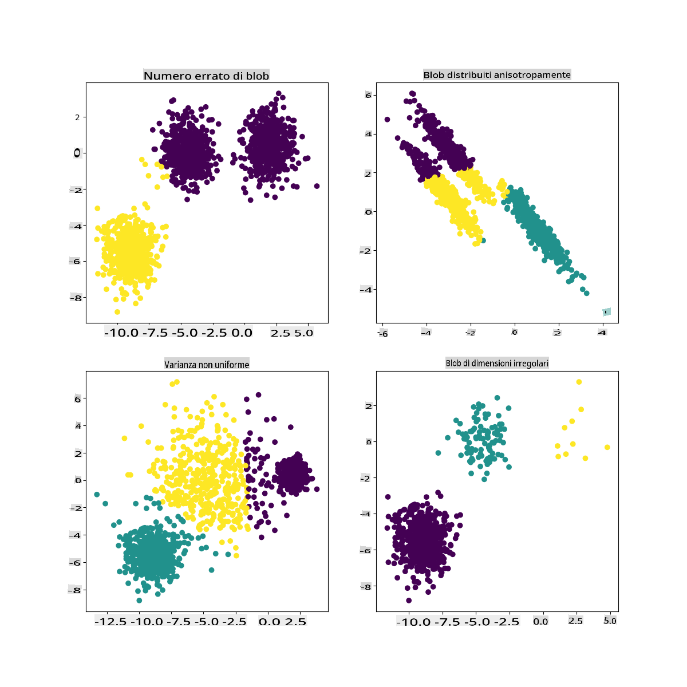

# Clustering K-Means

## [Quiz pre-lezione](https://gray-sand-07a10f403.1.azurestaticapps.net/quiz/29/)

In questa lezione, imparerai come creare cluster utilizzando Scikit-learn e il dataset della musica nigeriana che hai importato in precedenza. Copriremo le basi del K-Means per il clustering. Tieni presente che, come hai appreso nella lezione precedente, ci sono molti modi per lavorare con i cluster e il metodo che usi dipende dai tuoi dati. Proveremo il K-Means poiché è la tecnica di clustering più comune. Iniziamo!

Termini che imparerai:

- Silhouette scoring
- Metodo dell'Elbow
- Inerzia
- Varianza

## Introduzione

[K-Means Clustering](https://wikipedia.org/wiki/K-means_clustering) è un metodo derivato dal campo dell'elaborazione del segnale. Viene utilizzato per dividere e partizionare gruppi di dati in 'k' cluster utilizzando una serie di osservazioni. Ogni osservazione lavora per raggruppare un dato punto dati più vicino al suo 'mean' più vicino, o il punto centrale di un cluster.

I cluster possono essere visualizzati come [diagrammi di Voronoi](https://wikipedia.org/wiki/Voronoi_diagram), che includono un punto (o 'seme') e la sua corrispondente regione.


> infografica di [Jen Looper](https://twitter.com/jenlooper)

Il processo di clustering K-Means [si esegue in tre fasi](https://scikit-learn.org/stable/modules/clustering.html#k-means):

1. L'algoritmo seleziona un numero k di punti centrali campionando dal dataset. Dopo questo, cicla:
    1. Assegna ogni campione al centroide più vicino.
    2. Crea nuovi centroidi prendendo il valore medio di tutti i campioni assegnati ai centroidi precedenti.
    3. Poi, calcola la differenza tra i nuovi e i vecchi centroidi e ripete finché i centroidi non si stabilizzano.

Uno svantaggio dell'utilizzo del K-Means è che dovrai stabilire 'k', cioè il numero di centroidi. Fortunatamente, il 'metodo dell'Elbow' aiuta a stimare un buon valore di partenza per 'k'. Lo proverai tra un minuto.

## Prerequisito

Lavorerai nel file [_notebook.ipynb_](https://github.com/microsoft/ML-For-Beginners/blob/main/5-Clustering/2-K-Means/notebook.ipynb) di questa lezione che include l'importazione dei dati e la pulizia preliminare che hai fatto nella lezione precedente.

## Esercizio - preparazione

Inizia dando un'altra occhiata ai dati delle canzoni.

1. Crea un boxplot, chiamando `boxplot()` per ogni colonna:

    ```python
    plt.figure(figsize=(20,20), dpi=200)
    
    plt.subplot(4,3,1)
    sns.boxplot(x = 'popularity', data = df)
    
    plt.subplot(4,3,2)
    sns.boxplot(x = 'acousticness', data = df)
    
    plt.subplot(4,3,3)
    sns.boxplot(x = 'energy', data = df)
    
    plt.subplot(4,3,4)
    sns.boxplot(x = 'instrumentalness', data = df)
    
    plt.subplot(4,3,5)
    sns.boxplot(x = 'liveness', data = df)
    
    plt.subplot(4,3,6)
    sns.boxplot(x = 'loudness', data = df)
    
    plt.subplot(4,3,7)
    sns.boxplot(x = 'speechiness', data = df)
    
    plt.subplot(4,3,8)
    sns.boxplot(x = 'tempo', data = df)
    
    plt.subplot(4,3,9)
    sns.boxplot(x = 'time_signature', data = df)
    
    plt.subplot(4,3,10)
    sns.boxplot(x = 'danceability', data = df)
    
    plt.subplot(4,3,11)
    sns.boxplot(x = 'length', data = df)
    
    plt.subplot(4,3,12)
    sns.boxplot(x = 'release_date', data = df)
    ```

    Questi dati sono un po' rumorosi: osservando ogni colonna come un boxplot, puoi vedere i valori anomali.

    

Potresti passare attraverso il dataset e rimuovere questi valori anomali, ma ciò renderebbe i dati piuttosto minimi.

1. Per ora, scegli quali colonne utilizzerai per il tuo esercizio di clustering. Scegli quelle con intervalli simili e codifica la colonna `artist_top_genre` come dati numerici:

    ```python
    from sklearn.preprocessing import LabelEncoder
    le = LabelEncoder()
    
    X = df.loc[:, ('artist_top_genre','popularity','danceability','acousticness','loudness','energy')]
    
    y = df['artist_top_genre']
    
    X['artist_top_genre'] = le.fit_transform(X['artist_top_genre'])
    
    y = le.transform(y)
    ```

1. Ora devi scegliere quanti cluster mirare. Sai che ci sono 3 generi di canzoni che abbiamo estratto dal dataset, quindi proviamo con 3:

    ```python
    from sklearn.cluster import KMeans
    
    nclusters = 3 
    seed = 0
    
    km = KMeans(n_clusters=nclusters, random_state=seed)
    km.fit(X)
    
    # Predict the cluster for each data point
    
    y_cluster_kmeans = km.predict(X)
    y_cluster_kmeans
    ```

Vedrai un array stampato con cluster previsti (0, 1 o 2) per ogni riga del dataframe.

1. Usa questo array per calcolare un 'silhouette score':

    ```python
    from sklearn import metrics
    score = metrics.silhouette_score(X, y_cluster_kmeans)
    score
    ```

## Silhouette score

Cerca un silhouette score vicino a 1. Questo punteggio varia da -1 a 1, e se il punteggio è 1, il cluster è denso e ben separato dagli altri cluster. Un valore vicino a 0 rappresenta cluster sovrapposti con campioni molto vicini al confine decisionale dei cluster vicini. [(Fonte)](https://dzone.com/articles/kmeans-silhouette-score-explained-with-python-exam)

Il nostro punteggio è **.53**, quindi a metà strada. Questo indica che i nostri dati non sono particolarmente adatti a questo tipo di clustering, ma continuiamo.

### Esercizio - costruisci un modello

1. Importa `KMeans` e inizia il processo di clustering.

    ```python
    from sklearn.cluster import KMeans
    wcss = []
    
    for i in range(1, 11):
        kmeans = KMeans(n_clusters = i, init = 'k-means++', random_state = 42)
        kmeans.fit(X)
        wcss.append(kmeans.inertia_)
    
    ```

    Ci sono alcune parti qui che meritano spiegazioni.

    > 🎓 range: Queste sono le iterazioni del processo di clustering

    > 🎓 random_state: "Determina la generazione di numeri casuali per l'inizializzazione dei centroidi." [Fonte](https://scikit-learn.org/stable/modules/generated/sklearn.cluster.KMeans.html#sklearn.cluster.KMeans)

    > 🎓 WCSS: "within-cluster sums of squares" misura la distanza media quadratica di tutti i punti all'interno di un cluster dal centroide del cluster. [Fonte](https://medium.com/@ODSC/unsupervised-learning-evaluating-clusters-bd47eed175ce).

    > 🎓 Inerzia: Gli algoritmi K-Means tentano di scegliere i centroidi per minimizzare l'inerzia, "una misura di quanto siano coerenti internamente i cluster." [Fonte](https://scikit-learn.org/stable/modules/clustering.html). Il valore viene aggiunto alla variabile wcss a ogni iterazione.

    > 🎓 k-means++: In [Scikit-learn](https://scikit-learn.org/stable/modules/clustering.html#k-means) puoi usare l'ottimizzazione 'k-means++', che "inizializza i centroidi in modo che siano (generalmente) distanti tra loro, portando probabilmente a risultati migliori rispetto all'inizializzazione casuale."

### Metodo dell'Elbow

In precedenza, avevi ipotizzato che, poiché hai mirato a 3 generi di canzoni, dovresti scegliere 3 cluster. Ma è davvero così?

1. Usa il 'metodo dell'Elbow' per essere sicuro.

    ```python
    plt.figure(figsize=(10,5))
    sns.lineplot(x=range(1, 11), y=wcss, marker='o', color='red')
    plt.title('Elbow')
    plt.xlabel('Number of clusters')
    plt.ylabel('WCSS')
    plt.show()
    ```

    Usa la variabile `wcss` che hai costruito nel passaggio precedente per creare un grafico che mostra dove si trova la 'curva' nell'Elbow, che indica il numero ottimale di cluster. Forse è davvero 3!

    

## Esercizio - visualizza i cluster

1. Prova di nuovo il processo, questa volta impostando tre cluster, e visualizza i cluster come uno scatterplot:

    ```python
    from sklearn.cluster import KMeans
    kmeans = KMeans(n_clusters = 3)
    kmeans.fit(X)
    labels = kmeans.predict(X)
    plt.scatter(df['popularity'],df['danceability'],c = labels)
    plt.xlabel('popularity')
    plt.ylabel('danceability')
    plt.show()
    ```

1. Controlla l'accuratezza del modello:

    ```python
    labels = kmeans.labels_
    
    correct_labels = sum(y == labels)
    
    print("Result: %d out of %d samples were correctly labeled." % (correct_labels, y.size))
    
    print('Accuracy score: {0:0.2f}'. format(correct_labels/float(y.size)))
    ```

    L'accuratezza di questo modello non è molto buona, e la forma dei cluster ti dà un indizio del perché.

    

    Questi dati sono troppo sbilanciati, troppo poco correlati e c'è troppa varianza tra i valori delle colonne per clusterizzare bene. Infatti, i cluster che si formano sono probabilmente fortemente influenzati o distorti dalle tre categorie di generi che abbiamo definito sopra. È stato un processo di apprendimento!

    Nella documentazione di Scikit-learn, puoi vedere che un modello come questo, con cluster non molto ben demarcati, ha un problema di 'varianza':

    
    > Infografica da Scikit-learn

## Varianza

La varianza è definita come "la media delle differenze quadrate dalla media" [(Fonte)](https://www.mathsisfun.com/data/standard-deviation.html). Nel contesto di questo problema di clustering, si riferisce a dati in cui i numeri del nostro dataset tendono a divergere un po' troppo dalla media.

✅ Questo è un ottimo momento per pensare a tutti i modi in cui potresti correggere questo problema. Modificare un po' di più i dati? Utilizzare colonne diverse? Usare un algoritmo diverso? Suggerimento: Prova a [scalare i tuoi dati](https://www.mygreatlearning.com/blog/learning-data-science-with-k-means-clustering/) per normalizzarli e testare altre colonne.

> Prova questo '[calcolatore di varianza](https://www.calculatorsoup.com/calculators/statistics/variance-calculator.php)' per comprendere meglio il concetto.

---

## 🚀Sfida

Trascorri un po' di tempo con questo notebook, modificando i parametri. Puoi migliorare l'accuratezza del modello pulendo di più i dati (rimuovendo i valori anomali, ad esempio)? Puoi usare i pesi per dare più peso a determinati campioni di dati. Cos'altro puoi fare per creare cluster migliori?

Suggerimento: Prova a scalare i tuoi dati. C'è del codice commentato nel notebook che aggiunge la scalatura standard per far sembrare le colonne dei dati più simili tra loro in termini di intervallo. Scoprirai che, mentre il silhouette score diminuisce, la 'curva' nel grafico dell'Elbow si appiana. Questo perché lasciare i dati non scalati permette ai dati con meno varianza di avere più peso. Leggi un po' di più su questo problema [qui](https://stats.stackexchange.com/questions/21222/are-mean-normalization-and-feature-scaling-needed-for-k-means-clustering/21226#21226).

## [Quiz post-lezione](https://gray-sand-07a10f403.1.azurestaticapps.net/quiz/30/)

## Revisione e studio autonomo

Dai un'occhiata a un simulatore di K-Means [come questo](https://user.ceng.metu.edu.tr/~akifakkus/courses/ceng574/k-means/). Puoi usare questo strumento per visualizzare i punti dati campione e determinare i suoi centroidi. Puoi modificare la casualità dei dati, il numero di cluster e il numero di centroidi. Questo ti aiuta a farti un'idea di come i dati possono essere raggruppati?

Dai anche un'occhiata a [questo documento sul K-Means](https://stanford.edu/~cpiech/cs221/handouts/kmeans.html) di Stanford.

## Compito

[Prova diversi metodi di clustering](assignment.md)

**Avvertenza**: 
Questo documento è stato tradotto utilizzando servizi di traduzione basati su intelligenza artificiale. Sebbene ci sforziamo di garantire l'accuratezza, si prega di essere consapevoli che le traduzioni automatizzate possono contenere errori o imprecisioni. Il documento originale nella sua lingua madre dovrebbe essere considerato la fonte autorevole. Per informazioni critiche, si raccomanda una traduzione umana professionale. Non siamo responsabili per eventuali malintesi o interpretazioni errate derivanti dall'uso di questa traduzione.