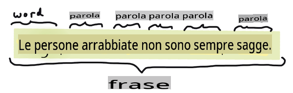
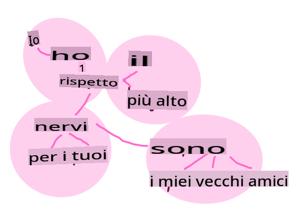
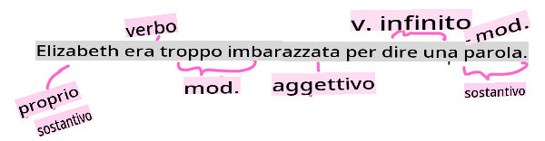

# Compiti e tecniche comuni di elaborazione del linguaggio naturale

Per la maggior parte dei compiti di *elaborazione del linguaggio naturale*, il testo da elaborare deve essere scomposto, esaminato e i risultati memorizzati o confrontati con regole e set di dati. Questi compiti permettono al programmatore di derivare il _significato_ o l'_intento_ o solo la _frequenza_ dei termini e delle parole in un testo.

## [Quiz pre-lezione](https://gray-sand-07a10f403.1.azurestaticapps.net/quiz/33/)

Scopriamo insieme le tecniche comuni utilizzate nell'elaborazione del testo. Combinando queste tecniche con il machine learning, è possibile analizzare grandi quantità di testo in modo efficiente. Prima di applicare il ML a questi compiti, però, è importante comprendere i problemi che un esperto di NLP può incontrare.

## Compiti comuni nell'NLP

Esistono diversi modi per analizzare un testo su cui si sta lavorando. Ci sono compiti che puoi eseguire e attraverso questi compiti puoi comprendere il testo e trarre conclusioni. Di solito, questi compiti vengono eseguiti in sequenza.

### Tokenizzazione

Probabilmente la prima cosa che la maggior parte degli algoritmi di NLP deve fare è dividere il testo in token, o parole. Sebbene possa sembrare semplice, dover tener conto della punteggiatura e dei delimitatori di parole e frasi di diverse lingue può renderlo complicato. Potrebbe essere necessario utilizzare vari metodi per determinare le demarcazioni.


> Tokenizzazione di una frase da **Orgoglio e Pregiudizio**. Infografica di [Jen Looper](https://twitter.com/jenlooper)

### Embeddings

I [word embeddings](https://wikipedia.org/wiki/Word_embedding) sono un modo per convertire i dati del testo in numeri. Gli embeddings sono realizzati in modo tale che parole con significati simili o parole usate insieme si raggruppino.


> "Ho il massimo rispetto per i tuoi nervi, sono vecchi amici." - Word embeddings per una frase in **Orgoglio e Pregiudizio**. Infografica di [Jen Looper](https://twitter.com/jenlooper)

✅ Prova [questo interessante strumento](https://projector.tensorflow.org/) per sperimentare con i word embeddings. Cliccando su una parola, vengono mostrati i cluster di parole simili: 'giocattolo' si raggruppa con 'disney', 'lego', 'playstation' e 'console'.

### Parsing e Part-of-speech Tagging

Ogni parola che è stata tokenizzata può essere etichettata come parte del discorso - un sostantivo, un verbo o un aggettivo. La frase `the quick red fox jumped over the lazy brown dog` potrebbe essere etichettata come POS fox = sostantivo, jumped = verbo.



> Parsing di una frase da **Orgoglio e Pregiudizio**. Infografica di [Jen Looper](https://twitter.com/jenlooper)

Il parsing è il riconoscimento delle parole che sono correlate tra loro in una frase - per esempio `the quick red fox jumped` è una sequenza di aggettivo-sostantivo-verbo che è separata dalla sequenza `lazy brown dog`.

### Frequenze di parole e frasi

Una procedura utile quando si analizza un grande corpo di testo è costruire un dizionario di ogni parola o frase di interesse e quante volte appare. La frase `the quick red fox jumped over the lazy brown dog` ha una frequenza di parole di 2 per the.

Vediamo un esempio di testo in cui contiamo la frequenza delle parole. La poesia di Rudyard Kipling The Winners contiene il seguente verso:

```output
What the moral? Who rides may read.
When the night is thick and the tracks are blind
A friend at a pinch is a friend, indeed,
But a fool to wait for the laggard behind.
Down to Gehenna or up to the Throne,
He travels the fastest who travels alone.
```

Poiché le frequenze delle frasi possono essere sensibili o insensibili alle maiuscole, la frase `a friend` has a frequency of 2 and `the` has a frequency of 6, and `travels` è 2.

### N-grams

Un testo può essere suddiviso in sequenze di parole di una lunghezza impostata, una singola parola (unigram), due parole (bigram), tre parole (trigram) o qualsiasi numero di parole (n-grams).

Per esempio `the quick red fox jumped over the lazy brown dog` con un punteggio n-gram di 2 produce i seguenti n-grams:

1. the quick 
2. quick red 
3. red fox
4. fox jumped 
5. jumped over 
6. over the 
7. the lazy 
8. lazy brown 
9. brown dog

Potrebbe essere più facile visualizzarlo come una casella scorrevole sulla frase. Ecco qui per n-grams di 3 parole, il n-gram è in grassetto in ogni frase:

1.   <u>**the quick red**</u> fox jumped over the lazy brown dog
2.   the **<u>quick red fox</u>** jumped over the lazy brown dog
3.   the quick **<u>red fox jumped</u>** over the lazy brown dog
4.   the quick red **<u>fox jumped over</u>** the lazy brown dog
5.   the quick red fox **<u>jumped over the</u>** lazy brown dog
6.   the quick red fox jumped **<u>over the lazy</u>** brown dog
7.   the quick red fox jumped over <u>**the lazy brown**</u> dog
8.   the quick red fox jumped over the **<u>lazy brown dog</u>**


> Valore n-gram di 3: Infografica di [Jen Looper](https://twitter.com/jenlooper)

### Estrazione di frasi nominali

Nella maggior parte delle frasi, c'è un sostantivo che è il soggetto o l'oggetto della frase. In inglese, spesso è identificabile perché preceduto da 'a', 'an' o 'the'. Identificare il soggetto o l'oggetto di una frase estraendo la frase nominale è un compito comune nell'NLP quando si cerca di comprendere il significato di una frase.

✅ Nella frase "Non riesco a fissare l'ora, o il luogo, o lo sguardo o le parole, che hanno posto le basi. È troppo tempo fa. Ero nel mezzo prima di sapere che avevo iniziato.", riesci a identificare le frasi nominali?

Nella frase `the quick red fox jumped over the lazy brown dog` ci sono 2 frasi nominali: **quick red fox** e **lazy brown dog**.

### Analisi del sentimento

Una frase o un testo possono essere analizzati per il sentimento, ovvero quanto è *positivo* o *negativo*. Il sentimento è misurato in *polarità* e *oggettività/soggettività*. La polarità è misurata da -1.0 a 1.0 (negativo a positivo) e da 0.0 a 1.0 (più oggettivo a più soggettivo).

✅ Più avanti imparerai che ci sono diversi modi per determinare il sentimento usando il machine learning, ma un modo è avere una lista di parole e frasi categorizzate come positive o negative da un esperto umano e applicare quel modello al testo per calcolare un punteggio di polarità. Riesci a vedere come questo funzionerebbe in alcune circostanze e meno bene in altre?

### Inflessione

L'inflessione ti permette di prendere una parola e ottenere il singolare o il plurale della parola.

### Lemmatizzazione

Un *lemma* è la radice o la parola principale per un insieme di parole, ad esempio *flew*, *flies*, *flying* hanno come lemma il verbo *fly*.

Esistono anche database utili per il ricercatore NLP, in particolare:

### WordNet

[WordNet](https://wordnet.princeton.edu/) è un database di parole, sinonimi, contrari e molti altri dettagli per ogni parola in molte lingue diverse. È incredibilmente utile quando si tenta di costruire traduzioni, correttori ortografici o strumenti linguistici di qualsiasi tipo.

## Librerie NLP

Fortunatamente, non devi costruire tutte queste tecniche da solo, poiché ci sono eccellenti librerie Python disponibili che rendono tutto molto più accessibile agli sviluppatori che non sono specializzati in elaborazione del linguaggio naturale o machine learning. Le prossime lezioni includono più esempi di queste, ma qui imparerai alcuni esempi utili per aiutarti con il prossimo compito.

### Esercizio - usando `TextBlob` library

Let's use a library called TextBlob as it contains helpful APIs for tackling these types of tasks. TextBlob "stands on the giant shoulders of [NLTK](https://nltk.org) and [pattern](https://github.com/clips/pattern), and plays nicely with both." It has a considerable amount of ML embedded in its API.

> Note: A useful [Quick Start](https://textblob.readthedocs.io/en/dev/quickstart.html#quickstart) guide is available for TextBlob that is recommended for experienced Python developers 

When attempting to identify *noun phrases*, TextBlob offers several options of extractors to find noun phrases. 

1. Take a look at `ConllExtractor`.

    ```python
    from textblob import TextBlob
    from textblob.np_extractors import ConllExtractor
    # import and create a Conll extractor to use later 
    extractor = ConllExtractor()
    
    # later when you need a noun phrase extractor:
    user_input = input("> ")
    user_input_blob = TextBlob(user_input, np_extractor=extractor)  # note non-default extractor specified
    np = user_input_blob.noun_phrases                                    
    ```

    > Cosa sta succedendo qui? [ConllExtractor](https://textblob.readthedocs.io/en/dev/api_reference.html?highlight=Conll#textblob.en.np_extractors.ConllExtractor) è "Un estrattore di frasi nominali che utilizza il chunk parsing addestrato con il corpus di addestramento ConLL-2000." ConLL-2000 si riferisce alla Conferenza del 2000 sull'Apprendimento del Linguaggio Naturale Computazionale. Ogni anno la conferenza ospitava un workshop per affrontare un problema spinoso di NLP, e nel 2000 si trattava del chunking dei nomi. Un modello è stato addestrato sul Wall Street Journal, con "le sezioni 15-18 come dati di addestramento (211727 token) e la sezione 20 come dati di test (47377 token)". Puoi guardare le procedure utilizzate [qui](https://www.clips.uantwerpen.be/conll2000/chunking/) e i [risultati](https://ifarm.nl/erikt/research/np-chunking.html).

### Sfida - migliorare il tuo bot con l'NLP

Nella lezione precedente hai costruito un bot di domande e risposte molto semplice. Ora, renderai Marvin un po' più simpatico analizzando il tuo input per il sentimento e stampando una risposta che corrisponda al sentimento. Dovrai anche identificare una `noun_phrase` e chiedere informazioni a riguardo.

I tuoi passaggi quando costruisci un bot conversazionale migliore:

1. Stampa istruzioni che consigliano l'utente su come interagire con il bot
2. Avvia il ciclo 
   1. Accetta l'input dell'utente
   2. Se l'utente ha chiesto di uscire, esci
   3. Elabora l'input dell'utente e determina la risposta appropriata al sentimento
   4. Se viene rilevata una frase nominale nel sentimento, pluralizzala e chiedi ulteriori informazioni su quel tema
   5. Stampa la risposta
3. torna al passaggio 2

Ecco il frammento di codice per determinare il sentimento usando TextBlob. Nota che ci sono solo quattro *gradazioni* di risposta al sentimento (puoi averne di più se vuoi):

```python
if user_input_blob.polarity <= -0.5:
  response = "Oh dear, that sounds bad. "
elif user_input_blob.polarity <= 0:
  response = "Hmm, that's not great. "
elif user_input_blob.polarity <= 0.5:
  response = "Well, that sounds positive. "
elif user_input_blob.polarity <= 1:
  response = "Wow, that sounds great. "
```

Ecco un esempio di output per guidarti (l'input dell'utente è sulle righe che iniziano con >):

```output
Hello, I am Marvin, the friendly robot.
You can end this conversation at any time by typing 'bye'
After typing each answer, press 'enter'
How are you today?
> I am ok
Well, that sounds positive. Can you tell me more?
> I went for a walk and saw a lovely cat
Well, that sounds positive. Can you tell me more about lovely cats?
> cats are the best. But I also have a cool dog
Wow, that sounds great. Can you tell me more about cool dogs?
> I have an old hounddog but he is sick
Hmm, that's not great. Can you tell me more about old hounddogs?
> bye
It was nice talking to you, goodbye!
```

Una possibile soluzione al compito è [qui](https://github.com/microsoft/ML-For-Beginners/blob/main/6-NLP/2-Tasks/solution/bot.py)

✅ Verifica delle conoscenze

1. Pensi che le risposte simpatiche potrebbero 'ingannare' qualcuno facendogli credere che il bot li capisca davvero?
2. Identificare la frase nominale rende il bot più 'credibile'?
3. Perché estrarre una 'frase nominale' da una frase è una cosa utile da fare?

---

Implementa il bot nella verifica delle conoscenze precedente e testalo su un amico. Riesce a ingannarlo? Riesci a rendere il tuo bot più 'credibile'?

## 🚀Sfida

Prendi un compito nella verifica delle conoscenze precedente e prova a implementarlo. Testa il bot su un amico. Riesce a ingannarlo? Riesci a rendere il tuo bot più 'credibile'?

## [Quiz post-lezione](https://gray-sand-07a10f403.1.azurestaticapps.net/quiz/34/)

## Revisione e auto-studio

Nelle prossime lezioni imparerai di più sull'analisi del sentimento. Ricerca questa interessante tecnica in articoli come questi su [KDNuggets](https://www.kdnuggets.com/tag/nlp)

## Compito 

[Make a bot talk back](assignment.md)

**Disclaimer**:
Questo documento è stato tradotto utilizzando servizi di traduzione basati su intelligenza artificiale. Sebbene ci impegniamo per l'accuratezza, si prega di essere consapevoli che le traduzioni automatiche possono contenere errori o imprecisioni. Il documento originale nella sua lingua nativa dovrebbe essere considerato la fonte autorevole. Per informazioni critiche, si raccomanda la traduzione professionale umana. Non siamo responsabili per eventuali malintesi o interpretazioni errate derivanti dall'uso di questa traduzione.