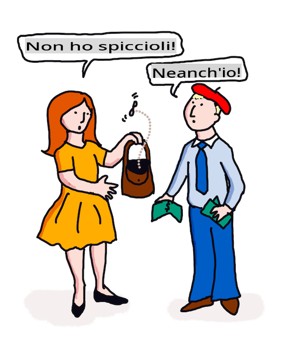

# Traduzione e analisi del sentimento con ML

Nelle lezioni precedenti hai imparato come costruire un bot di base usando `TextBlob`, una libreria che incorpora ML dietro le quinte per eseguire compiti NLP di base come l'estrazione di frasi nominali. Un'altra sfida importante nella linguistica computazionale è la _traduzione_ accurata di una frase da una lingua parlata o scritta a un'altra.

## [Quiz pre-lezione](https://gray-sand-07a10f403.1.azurestaticapps.net/quiz/35/)

La traduzione è un problema molto complesso aggravato dal fatto che esistono migliaia di lingue, ognuna con regole grammaticali molto diverse. Un approccio consiste nel convertire le regole grammaticali formali di una lingua, come l'inglese, in una struttura non dipendente dalla lingua, e poi tradurla riconvertendola in un'altra lingua. Questo approccio prevede i seguenti passaggi:

1. **Identificazione**. Identificare o etichettare le parole nella lingua di input come nomi, verbi ecc.
2. **Creare la traduzione**. Produrre una traduzione diretta di ogni parola nel formato della lingua di destinazione.

### Frase di esempio, Inglese a Irlandese

In 'Inglese', la frase _I feel happy_ è composta da tre parole nell'ordine:

- **soggetto** (I)
- **verbo** (feel)
- **aggettivo** (happy)

Tuttavia, nella lingua 'Irlandese', la stessa frase ha una struttura grammaticale molto diversa - le emozioni come "*happy*" o "*sad*" sono espresse come se fossero *su di te*.

La frase inglese `I feel happy` in irlandese sarebbe `Tá athas orm`. Una traduzione *letterale* sarebbe `Happy is upon me`.

Un parlante irlandese che traduce in inglese direbbe `I feel happy`, non `Happy is upon me`, perché comprende il significato della frase, anche se le parole e la struttura della frase sono diverse.

L'ordine formale per la frase in irlandese è:

- **verbo** (Tá o is)
- **aggettivo** (athas, o happy)
- **soggetto** (orm, o upon me)

## Traduzione

Un programma di traduzione ingenuo potrebbe tradurre solo le parole, ignorando la struttura della frase.

✅ Se hai imparato una seconda (o terza o più) lingua da adulto, potresti aver iniziato pensando nella tua lingua madre, traducendo un concetto parola per parola nella tua testa nella seconda lingua, e poi pronunciando la tua traduzione. Questo è simile a ciò che fanno i programmi di traduzione ingenua. È importante superare questa fase per raggiungere la fluidità!

La traduzione ingenua porta a cattive (e talvolta esilaranti) traduzioni errate: `I feel happy` traduce letteralmente a `Mise bhraitheann athas` in irlandese. Questo significa (letteralmente) `me feel happy` e non è una frase irlandese valida. Anche se l'inglese e l'irlandese sono lingue parlate su due isole vicine, sono lingue molto diverse con strutture grammaticali diverse.

> Puoi guardare alcuni video sulle tradizioni linguistiche irlandesi come [questo](https://www.youtube.com/watch?v=mRIaLSdRMMs)

### Approcci di machine learning

Finora, hai imparato l'approccio delle regole formali per l'elaborazione del linguaggio naturale. Un altro approccio è ignorare il significato delle parole, e _invece usare il machine learning per rilevare modelli_. Questo può funzionare nella traduzione se hai molti testi (un *corpus*) o testi (*corpora*) sia nella lingua di origine che in quella di destinazione.

Ad esempio, considera il caso di *Orgoglio e Pregiudizio*, un noto romanzo inglese scritto da Jane Austen nel 1813. Se consulti il libro in inglese e una traduzione umana del libro in *francese*, potresti rilevare frasi in una lingua che sono tradotte _idiomaticamente_ nell'altra. Lo farai tra un minuto.

Ad esempio, quando una frase inglese come `I have no money` viene tradotta letteralmente in francese, potrebbe diventare `Je n'ai pas de monnaie`. "Monnaie" è un falso amico francese insidioso, poiché 'money' e 'monnaie' non sono sinonimi. Una traduzione migliore che un umano potrebbe fare sarebbe `Je n'ai pas d'argent`, perché trasmette meglio il significato che non hai soldi (piuttosto che 'spiccioli' che è il significato di 'monnaie').



> Immagine di [Jen Looper](https://twitter.com/jenlooper)

Se un modello ML ha abbastanza traduzioni umane su cui costruire un modello, può migliorare l'accuratezza delle traduzioni identificando modelli comuni nei testi che sono stati precedentemente tradotti da esperti parlanti umani di entrambe le lingue.

### Esercizio - traduzione

Puoi usare `TextBlob` per tradurre frasi. Prova la famosa prima riga di **Orgoglio e Pregiudizio**:

```python
from textblob import TextBlob

blob = TextBlob(
    "It is a truth universally acknowledged, that a single man in possession of a good fortune, must be in want of a wife!"
)
print(blob.translate(to="fr"))

```

`TextBlob` fa un buon lavoro nella traduzione: "C'est une vérité universellement reconnue, qu'un homme célibataire en possession d'une bonne fortune doit avoir besoin d'une femme!".

Si può sostenere che la traduzione di TextBlob sia molto più precisa, in effetti, rispetto alla traduzione francese del libro del 1932 di V. Leconte e Ch. Pressoir:

"C'est une vérité universelle qu'un célibataire pourvu d'une belle fortune doit avoir envie de se marier, et, si peu que l'on sache de son sentiment à cet égard, lorsqu'il arrive dans une nouvelle résidence, cette idée est si bien fixée dans l'esprit de ses voisins qu'ils le considèrent sur-le-champ comme la propriété légitime de l'une ou l'autre de leurs filles."

In questo caso, la traduzione informata da ML fa un lavoro migliore rispetto al traduttore umano che mette inutilmente parole in bocca all'autore originale per 'chiarezza'.

> Cosa sta succedendo qui? e perché TextBlob è così bravo nella traduzione? Beh, dietro le quinte, sta usando Google translate, un'IA sofisticata in grado di analizzare milioni di frasi per prevedere le stringhe migliori per il compito da svolgere. Non c'è niente di manuale qui e hai bisogno di una connessione internet per usare `blob.translate`.

✅ Try some more sentences. Which is better, ML or human translation? In which cases?

## Sentiment analysis

Another area where machine learning can work very well is sentiment analysis. A non-ML approach to sentiment is to identify words and phrases which are 'positive' and 'negative'. Then, given a new piece of text, calculate the total value of the positive, negative and neutral words to identify the overall sentiment. 

This approach is easily tricked as you may have seen in the Marvin task - the sentence `Great, that was a wonderful waste of time, I'm glad we are lost on this dark road` è una frase sarcastica e di sentimento negativo, ma l'algoritmo semplice rileva 'great', 'wonderful', 'glad' come positivi e 'waste', 'lost' e 'dark' come negativi. Il sentimento complessivo è influenzato da queste parole contrastanti.

✅ Fermati un attimo e pensa a come trasmettiamo il sarcasmo come parlanti umani. L'inflessione del tono gioca un ruolo importante. Prova a dire la frase "Beh, quel film era fantastico" in modi diversi per scoprire come la tua voce trasmette il significato.

### Approcci ML

L'approccio ML consisterebbe nel raccogliere manualmente corpi di testo negativi e positivi - tweet, recensioni di film o qualsiasi cosa in cui l'umano abbia dato un punteggio *e* un'opinione scritta. Poi le tecniche NLP possono essere applicate alle opinioni e ai punteggi, in modo che emergano modelli (ad esempio, le recensioni positive dei film tendono ad avere la frase 'degno di un Oscar' più delle recensioni negative dei film, o le recensioni positive dei ristoranti dicono 'gourmet' molto più di 'disgustoso').

> ⚖️ **Esempio**: Se lavorassi nell'ufficio di un politico e ci fosse una nuova legge in discussione, i cittadini potrebbero scrivere all'ufficio con email a favore o contro la particolare nuova legge. Diciamo che ti venga assegnato il compito di leggere le email e ordinarle in 2 pile, *a favore* e *contro*. Se ci fossero molte email, potresti essere sopraffatto dal tentativo di leggerle tutte. Non sarebbe bello se un bot potesse leggerle tutte per te, capirle e dirti in quale pila appartiene ogni email?
> 
> Un modo per ottenere ciò è usare il Machine Learning. Addestreresti il modello con una porzione delle email *contro* e una porzione delle email *a favore*. Il modello tenderebbe ad associare frasi e parole con il lato contro e il lato a favore, *ma non comprenderebbe nessuno dei contenuti*, solo che certe parole e modelli erano più probabilmente presenti in un'email *contro* o *a favore*. Potresti testarlo con alcune email che non avevi usato per addestrare il modello, e vedere se arrivava alla stessa conclusione di te. Poi, una volta che fossi soddisfatto dell'accuratezza del modello, potresti elaborare le email future senza dover leggere ciascuna.

✅ Questo processo ti sembra simile ai processi che hai usato nelle lezioni precedenti?

## Esercizio - frasi sentimentali

Il sentimento è misurato con una *polarità* da -1 a 1, dove -1 è il sentimento più negativo e 1 è il più positivo. Il sentimento è anche misurato con un punteggio da 0 a 1 per oggettività (0) e soggettività (1).

Dai un'altra occhiata a *Orgoglio e Pregiudizio* di Jane Austen. Il testo è disponibile qui su [Project Gutenberg](https://www.gutenberg.org/files/1342/1342-h/1342-h.htm). Il campione sotto mostra un breve programma che analizza il sentimento delle prime e ultime frasi del libro e mostra la polarità del sentimento e il punteggio di soggettività/oggettività.

Dovresti usare la libreria `TextBlob` (descritta sopra) per determinare `sentiment` (non devi scrivere il tuo calcolatore di sentimenti) nel seguente compito.

```python
from textblob import TextBlob

quote1 = """It is a truth universally acknowledged, that a single man in possession of a good fortune, must be in want of a wife."""

quote2 = """Darcy, as well as Elizabeth, really loved them; and they were both ever sensible of the warmest gratitude towards the persons who, by bringing her into Derbyshire, had been the means of uniting them."""

sentiment1 = TextBlob(quote1).sentiment
sentiment2 = TextBlob(quote2).sentiment

print(quote1 + " has a sentiment of " + str(sentiment1))
print(quote2 + " has a sentiment of " + str(sentiment2))
```

Vedi il seguente output:

```output
It is a truth universally acknowledged, that a single man in possession of a good fortune, must be in want # of a wife. has a sentiment of Sentiment(polarity=0.20952380952380953, subjectivity=0.27142857142857146)

Darcy, as well as Elizabeth, really loved them; and they were
     both ever sensible of the warmest gratitude towards the persons
      who, by bringing her into Derbyshire, had been the means of
      uniting them. has a sentiment of Sentiment(polarity=0.7, subjectivity=0.8)
```

## Sfida - controlla la polarità del sentimento

Il tuo compito è determinare, usando la polarità del sentimento, se *Orgoglio e Pregiudizio* ha più frasi assolutamente positive che negative. Per questo compito, puoi assumere che un punteggio di polarità di 1 o -1 sia rispettivamente assolutamente positivo o negativo.

**Passaggi:**

1. Scarica una [copia di Orgoglio e Pregiudizio](https://www.gutenberg.org/files/1342/1342-h/1342-h.htm) da Project Gutenberg come file .txt. Rimuovi i metadati all'inizio e alla fine del file, lasciando solo il testo originale
2. Apri il file in Python ed estrai i contenuti come una stringa
3. Crea un TextBlob usando la stringa del libro
4. Analizza ogni frase del libro in un ciclo
   1. Se la polarità è 1 o -1, memorizza la frase in un array o lista di messaggi positivi o negativi
5. Alla fine, stampa tutte le frasi positive e negative (separatamente) e il numero di ciascuna.

Ecco un esempio di [soluzione](https://github.com/microsoft/ML-For-Beginners/blob/main/6-NLP/3-Translation-Sentiment/solution/notebook.ipynb).

✅ Verifica delle conoscenze

1. Il sentimento si basa sulle parole usate nella frase, ma il codice *comprende* le parole?
2. Pensi che la polarità del sentimento sia accurata, o in altre parole, sei *d'accordo* con i punteggi?
   1. In particolare, sei d'accordo o in disaccordo con la polarità assolutamente **positiva** delle seguenti frasi?
      * “Che padre eccellente avete, ragazze!” disse lei, quando la porta fu chiusa.
      * “La tua esaminazione del signor Darcy è finita, suppongo,” disse Miss Bingley; “e prego qual è il risultato?” “Sono perfettamente convinto che il signor Darcy non ha alcun difetto.
      * Come accadono meravigliosamente queste cose!
      * Ho la più grande avversione al mondo per quel genere di cose.
      * Charlotte è un'eccellente amministratrice, oserei dire.
      * “Questo è davvero delizioso!
      * Sono così felice!
      * La tua idea dei pony è deliziosa.
   2. Le prossime 3 frasi sono state valutate con un sentimento assolutamente positivo, ma a una lettura attenta, non sono frasi positive. Perché l'analisi del sentimento ha pensato che fossero frasi positive?
      * Sarò felice, quando la sua permanenza a Netherfield sarà finita!” “Vorrei poter dire qualcosa per confortarti,” rispose Elizabeth; “ma è completamente fuori dal mio potere.
      * Se solo potessi vederti felice!
      * Il nostro disagio, mia cara Lizzy, è molto grande.
   3. Sei d'accordo o in disaccordo con la polarità assolutamente **negativa** delle seguenti frasi?
      - Tutti sono disgustati dal suo orgoglio.
      - “Vorrei sapere come si comporta tra gli estranei.” “Allora sentirai, ma preparati a qualcosa di molto terribile.
      - La pausa fu per i sentimenti di Elizabeth terribile.
      - Sarebbe terribile!

✅ Qualsiasi appassionato di Jane Austen capirà che spesso usa i suoi libri per criticare gli aspetti più ridicoli della società della Reggenza inglese. Elizabeth Bennett, il personaggio principale in *Orgoglio e Pregiudizio*, è una acuta osservatrice sociale (come l'autrice) e il suo linguaggio è spesso fortemente sfumato. Anche Mr. Darcy (l'interesse amoroso nella storia) nota l'uso giocoso e scherzoso del linguaggio di Elizabeth: "Ho avuto il piacere della tua conoscenza abbastanza a lungo per sapere che trovi grande divertimento nell'affermare occasionalmente opinioni che in realtà non sono le tue."

---

## 🚀Sfida

Puoi rendere Marvin ancora migliore estraendo altre caratteristiche dall'input dell'utente?

## [Quiz post-lezione](https://gray-sand-07a10f403.1.azurestaticapps.net/quiz/36/)

## Revisione & Autoapprendimento

Ci sono molti modi per estrarre il sentimento dal testo. Pensa alle applicazioni aziendali che potrebbero fare uso di questa tecnica. Pensa a come può andare storto. Leggi di più sui sistemi sofisticati pronti per l'impresa che analizzano il sentimento come [Azure Text Analysis](https://docs.microsoft.com/azure/cognitive-services/Text-Analytics/how-tos/text-analytics-how-to-sentiment-analysis?tabs=version-3-1?WT.mc_id=academic-77952-leestott). Prova alcune delle frasi di Orgoglio e Pregiudizio sopra e vedi se riesce a rilevare le sfumature.

## Compito

[Licenza poetica](assignment.md)

**Disclaimer**: 
Questo documento è stato tradotto utilizzando servizi di traduzione automatica basati su AI. Sebbene ci impegniamo per garantire l'accuratezza, si prega di essere consapevoli che le traduzioni automatiche possono contenere errori o imprecisioni. Il documento originale nella sua lingua madre dovrebbe essere considerato la fonte autorevole. Per informazioni critiche, si raccomanda una traduzione professionale umana. Non siamo responsabili per eventuali malintesi o interpretazioni errate derivanti dall'uso di questa traduzione.