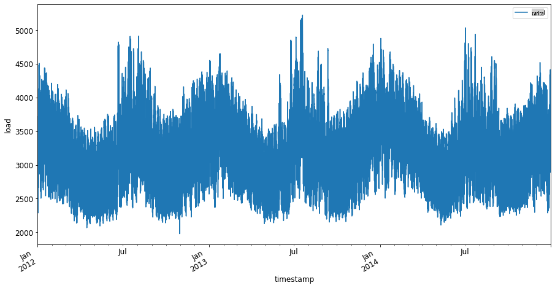
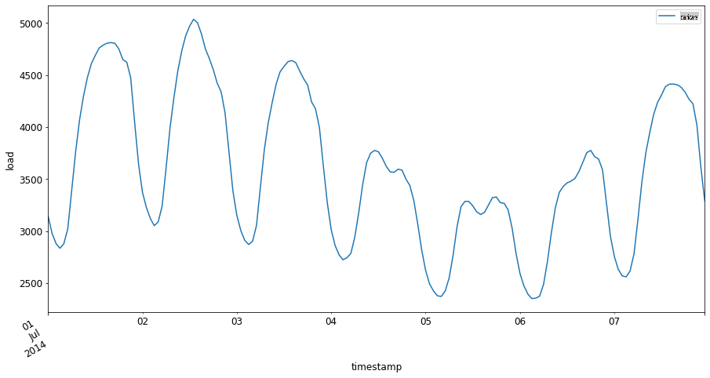

# Introduzione alla previsione delle serie temporali


> Sketchnote di [Tomomi Imura](https://www.twitter.com/girlie_mac)

In questa lezione e nella successiva, imparerai un po' sulla previsione delle serie temporali, una parte interessante e preziosa del repertorio di uno scienziato di ML, che è un po' meno conosciuta rispetto ad altri argomenti. La previsione delle serie temporali è una sorta di 'sfera di cristallo': basandosi sulle prestazioni passate di una variabile come il prezzo, puoi prevederne il valore potenziale futuro.

[](https://youtu.be/cBojo1hsHiI "Introduzione alla previsione delle serie temporali")

> 🎥 Clicca sull'immagine sopra per un video sulla previsione delle serie temporali

## [Quiz pre-lezione](https://gray-sand-07a10f403.1.azurestaticapps.net/quiz/41/)

È un campo utile e interessante con un reale valore per il business, dato che ha una diretta applicazione a problemi di prezzo, inventario e questioni della catena di approvvigionamento. Mentre le tecniche di deep learning hanno iniziato a essere utilizzate per ottenere maggiori intuizioni per prevedere meglio le prestazioni future, la previsione delle serie temporali rimane un campo fortemente informato dalle tecniche classiche di ML.

> Il curriculum utile di serie temporali della Penn State può essere trovato [qui](https://online.stat.psu.edu/stat510/lesson/1)

## Introduzione

Supponiamo che tu gestisca una serie di parcometri intelligenti che forniscono dati su quanto spesso vengono utilizzati e per quanto tempo nel tempo.

> E se potessi prevedere, basandoti sulle prestazioni passate del parcometro, il suo valore futuro secondo le leggi della domanda e dell'offerta?

Prevedere accuratamente quando agire per raggiungere il tuo obiettivo è una sfida che potrebbe essere affrontata dalla previsione delle serie temporali. Non renderebbe felici le persone essere addebitate di più nei momenti di punta quando cercano un parcheggio, ma sarebbe un modo sicuro per generare entrate per pulire le strade!

Esploriamo alcuni dei tipi di algoritmi delle serie temporali e iniziamo un notebook per pulire e preparare alcuni dati. I dati che analizzerai sono presi dalla competizione di previsione GEFCom2014. Consistono in 3 anni di valori orari di carico elettrico e temperatura tra il 2012 e il 2014. Dati i modelli storici di carico elettrico e temperatura, puoi prevedere i valori futuri del carico elettrico.

In questo esempio, imparerai come prevedere un passo temporale avanti, utilizzando solo i dati storici del carico. Tuttavia, prima di iniziare, è utile capire cosa sta succedendo dietro le quinte.

## Alcune definizioni

Quando incontri il termine 'serie temporale' devi capire il suo uso in diversi contesti.

🎓 **Serie temporale**

In matematica, "una serie temporale è una serie di punti dati indicizzati (o elencati o tracciati) in ordine temporale. Più comunemente, una serie temporale è una sequenza presa in punti di tempo successivi equamente distanziati." Un esempio di serie temporale è il valore di chiusura giornaliero del [Dow Jones Industrial Average](https://wikipedia.org/wiki/Time_series). L'uso di tracciati di serie temporali e la modellazione statistica è frequentemente incontrato nell'elaborazione del segnale, previsione meteorologica, previsione dei terremoti e altri campi in cui si verificano eventi e i punti dati possono essere tracciati nel tempo.

🎓 **Analisi delle serie temporali**

L'analisi delle serie temporali è l'analisi dei dati di serie temporali sopra menzionati. I dati di serie temporali possono assumere forme distinte, incluso 'serie temporali interrotte' che rilevano modelli nell'evoluzione di una serie temporale prima e dopo un evento di interruzione. Il tipo di analisi necessario per la serie temporale dipende dalla natura dei dati. I dati di serie temporali stessi possono assumere la forma di serie di numeri o caratteri.

L'analisi da eseguire utilizza una varietà di metodi, inclusi dominio della frequenza e dominio del tempo, lineare e non lineare, e altro. [Scopri di più](https://www.itl.nist.gov/div898/handbook/pmc/section4/pmc4.htm) sui molti modi per analizzare questo tipo di dati.

🎓 **Previsione delle serie temporali**

La previsione delle serie temporali è l'uso di un modello per prevedere valori futuri basati su modelli mostrati dai dati raccolti in precedenza come si sono verificati nel passato. Mentre è possibile utilizzare modelli di regressione per esplorare i dati di serie temporali, con indici temporali come variabili x su un grafico, tali dati sono meglio analizzati utilizzando tipi speciali di modelli.

I dati di serie temporali sono un elenco di osservazioni ordinate, a differenza dei dati che possono essere analizzati tramite regressione lineare. Il più comune è ARIMA, un acronimo che sta per "Autoregressive Integrated Moving Average".

I [modelli ARIMA](https://online.stat.psu.edu/stat510/lesson/1/1.1) "relazionano il valore presente di una serie ai valori passati e agli errori di previsione passati." Sono più appropriati per l'analisi dei dati nel dominio del tempo, dove i dati sono ordinati nel tempo.

> Esistono diversi tipi di modelli ARIMA, che puoi imparare [qui](https://people.duke.edu/~rnau/411arim.htm) e che toccherai nella prossima lezione.

Nella prossima lezione, costruirai un modello ARIMA utilizzando [Serie Temporali Univariate](https://itl.nist.gov/div898/handbook/pmc/section4/pmc44.htm), che si concentra su una variabile che cambia il suo valore nel tempo. Un esempio di questo tipo di dati è [questo dataset](https://itl.nist.gov/div898/handbook/pmc/section4/pmc4411.htm) che registra la concentrazione mensile di CO2 all'Osservatorio di Mauna Loa:

|  CO2   | YearMonth | Year  | Month |
| :----: | :-------: | :---: | :---: |
| 330.62 |  1975.04  | 1975  |   1   |
| 331.40 |  1975.13  | 1975  |   2   |
| 331.87 |  1975.21  | 1975  |   3   |
| 333.18 |  1975.29  | 1975  |   4   |
| 333.92 |  1975.38  | 1975  |   5   |
| 333.43 |  1975.46  | 1975  |   6   |
| 331.85 |  1975.54  | 1975  |   7   |
| 330.01 |  1975.63  | 1975  |   8   |
| 328.51 |  1975.71  | 1975  |   9   |
| 328.41 |  1975.79  | 1975  |  10   |
| 329.25 |  1975.88  | 1975  |  11   |
| 330.97 |  1975.96  | 1975  |  12   |

✅ Identifica la variabile che cambia nel tempo in questo dataset

## Caratteristiche dei dati delle serie temporali da considerare

Quando guardi i dati delle serie temporali, potresti notare che hanno [certe caratteristiche](https://online.stat.psu.edu/stat510/lesson/1/1.1) che devi prendere in considerazione e mitigare per comprendere meglio i loro modelli. Se consideri i dati delle serie temporali come potenzialmente fornendo un 'segnale' che vuoi analizzare, queste caratteristiche possono essere considerate 'rumore'. Spesso sarà necessario ridurre questo 'rumore' compensando alcune di queste caratteristiche utilizzando alcune tecniche statistiche.

Ecco alcuni concetti che dovresti conoscere per poter lavorare con le serie temporali:

🎓 **Trend**

I trend sono definiti come aumenti e diminuzioni misurabili nel tempo. [Leggi di più](https://machinelearningmastery.com/time-series-trends-in-python). Nel contesto delle serie temporali, si tratta di come usare e, se necessario, rimuovere i trend dalla tua serie temporale.

🎓 **[Stagionalità](https://machinelearningmastery.com/time-series-seasonality-with-python/)**

La stagionalità è definita come fluttuazioni periodiche, come i picchi di vendita durante le festività, per esempio. [Dai un'occhiata](https://itl.nist.gov/div898/handbook/pmc/section4/pmc443.htm) a come diversi tipi di grafici mostrano la stagionalità nei dati.

🎓 **Outliers**

Gli outliers sono lontani dalla varianza standard dei dati.

🎓 **Ciclo a lungo termine**

Indipendentemente dalla stagionalità, i dati potrebbero mostrare un ciclo a lungo termine come una recessione economica che dura più di un anno.

🎓 **Varianza costante**

Nel tempo, alcuni dati mostrano fluttuazioni costanti, come l'uso di energia per giorno e notte.

🎓 **Cambiamenti improvvisi**

I dati potrebbero mostrare un cambiamento improvviso che potrebbe necessitare di ulteriori analisi. La chiusura improvvisa delle attività a causa del COVID, per esempio, ha causato cambiamenti nei dati.

✅ Ecco un [esempio di grafico di serie temporali](https://www.kaggle.com/kashnitsky/topic-9-part-1-time-series-analysis-in-python) che mostra la spesa giornaliera in valuta di gioco nel corso di alcuni anni. Riesci a identificare alcune delle caratteristiche elencate sopra in questi dati?


## Esercizio - iniziare con i dati sull'uso dell'energia

Iniziamo a creare un modello di serie temporali per prevedere l'uso futuro dell'energia dato l'uso passato.

> I dati in questo esempio sono presi dalla competizione di previsione GEFCom2014. Consistono in 3 anni di valori orari di carico elettrico e temperatura tra il 2012 e il 2014.
>
> Tao Hong, Pierre Pinson, Shu Fan, Hamidreza Zareipour, Alberto Troccoli e Rob J. Hyndman, "Previsione probabilistica dell'energia: Competizione Globale di Previsione dell'Energia 2014 e oltre", International Journal of Forecasting, vol.32, no.3, pp 896-913, luglio-settembre, 2016.

1. Nella cartella `working` di questa lezione, apri il file _notebook.ipynb_. Inizia aggiungendo le librerie che ti aiuteranno a caricare e visualizzare i dati

    ```python
    import os
    import matplotlib.pyplot as plt
    from common.utils import load_data
    %matplotlib inline
    ```

    Nota, stai usando i file dalla cartella `common` folder which set up your environment and handle downloading the data.

2. Next, examine the data as a dataframe calling `load_data()` and `head()`:

    ```python
    data_dir = './data'
    energy = load_data(data_dir)[['load']]
    energy.head()
    ```

    Puoi vedere che ci sono due colonne che rappresentano data e carico:

    |                     |  carico  |
    | :-----------------: | :------: |
    | 2012-01-01 00:00:00 | 2698.0 |
    | 2012-01-01 01:00:00 | 2558.0 |
    | 2012-01-01 02:00:00 | 2444.0 |
    | 2012-01-01 03:00:00 | 2402.0 |
    | 2012-01-01 04:00:00 | 2403.0 |

3. Ora, traccia i dati chiamando `plot()`:

    ```python
    energy.plot(y='load', subplots=True, figsize=(15, 8), fontsize=12)
    plt.xlabel('timestamp', fontsize=12)
    plt.ylabel('load', fontsize=12)
    plt.show()
    ```

    

4. Ora, traccia la prima settimana di luglio 2014, fornendola come input al modello `energy` in `[from date]: [to date]`:

    ```python
    energy['2014-07-01':'2014-07-07'].plot(y='load', subplots=True, figsize=(15, 8), fontsize=12)
    plt.xlabel('timestamp', fontsize=12)
    plt.ylabel('load', fontsize=12)
    plt.show()
    ```

    

    Un grafico bellissimo! Dai un'occhiata a questi grafici e vedi se riesci a determinare alcune delle caratteristiche elencate sopra. Cosa possiamo dedurre visualizzando i dati?

Nella prossima lezione, creerai un modello ARIMA per creare alcune previsioni.

---

## 🚀Sfida

Fai un elenco di tutte le industrie e aree di indagine che puoi pensare che potrebbero beneficiare della previsione delle serie temporali. Riesci a pensare a un'applicazione di queste tecniche nelle arti? Nell'econometria? Nell'ecologia? Nel commercio al dettaglio? Nell'industria? Nella finanza? Dove altro?

## [Quiz post-lezione](https://gray-sand-07a10f403.1.azurestaticapps.net/quiz/42/)

## Revisione e Autoapprendimento

Anche se non li copriremo qui, le reti neurali sono talvolta utilizzate per migliorare i metodi classici di previsione delle serie temporali. Leggi di più su di esse [in questo articolo](https://medium.com/microsoftazure/neural-networks-for-forecasting-financial-and-economic-time-series-6aca370ff412)

## Compito

[Visualizza altre serie temporali](assignment.md)

**Avvertenza**:
Questo documento è stato tradotto utilizzando servizi di traduzione automatica basati su AI. Sebbene ci impegniamo per garantire l'accuratezza, si prega di essere consapevoli che le traduzioni automatiche possono contenere errori o imprecisioni. Il documento originale nella sua lingua madre dovrebbe essere considerato la fonte autorevole. Per informazioni critiche, si raccomanda una traduzione professionale umana. Non siamo responsabili per eventuali malintesi o interpretazioni errate derivanti dall'uso di questa traduzione.