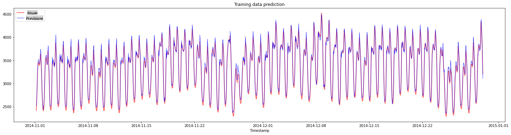
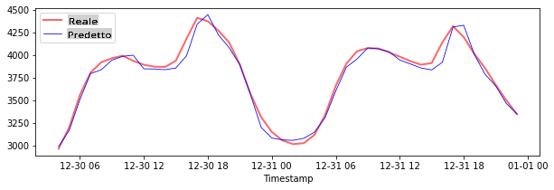
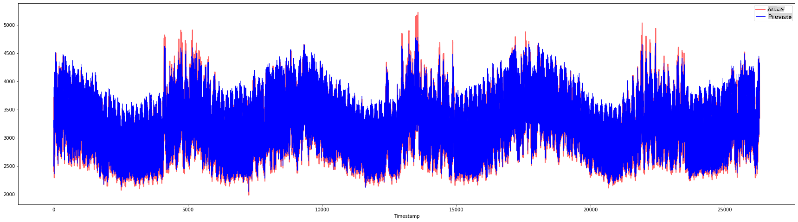

# Previsione di Serie Temporali con Support Vector Regressor

Nella lezione precedente, hai imparato a utilizzare il modello ARIMA per fare previsioni su serie temporali. Ora vedrai il modello Support Vector Regressor, che è un modello di regressione usato per prevedere dati continui.

## [Quiz Pre-lezione](https://gray-sand-07a10f403.1.azurestaticapps.net/quiz/51/) 

## Introduzione

In questa lezione, scoprirai un modo specifico per costruire modelli con [**SVM**: **S**upport **V**ector **M**achine](https://en.wikipedia.org/wiki/Support-vector_machine) per la regressione, o **SVR: Support Vector Regressor**. 

### SVR nel contesto delle serie temporali [^1]

Prima di comprendere l'importanza di SVR nella previsione delle serie temporali, ecco alcuni concetti importanti che devi conoscere:

- **Regressione:** Tecnica di apprendimento supervisionato per prevedere valori continui da un insieme di input dato. L'idea è di adattare una curva (o linea) nello spazio delle caratteristiche che ha il maggior numero di punti dati. [Clicca qui](https://en.wikipedia.org/wiki/Regression_analysis) per maggiori informazioni.
- **Support Vector Machine (SVM):** Un tipo di modello di apprendimento supervisionato utilizzato per classificazione, regressione e rilevamento di anomalie. Il modello è un iperpiano nello spazio delle caratteristiche, che nel caso della classificazione agisce come un confine, e nel caso della regressione agisce come la linea di miglior adattamento. In SVM, una funzione Kernel viene generalmente utilizzata per trasformare il dataset in uno spazio con un numero maggiore di dimensioni, in modo che possano essere facilmente separabili. [Clicca qui](https://en.wikipedia.org/wiki/Support-vector_machine) per maggiori informazioni sulle SVM.
- **Support Vector Regressor (SVR):** Un tipo di SVM, per trovare la linea di miglior adattamento (che nel caso di SVM è un iperpiano) che ha il maggior numero di punti dati.

### Perché SVR? [^1]

Nell'ultima lezione hai imparato l'ARIMA, che è un metodo statistico lineare molto efficace per prevedere i dati delle serie temporali. Tuttavia, in molti casi, i dati delle serie temporali presentano *non-linearità*, che non possono essere mappate da modelli lineari. In questi casi, la capacità di SVM di considerare la non-linearità nei dati per compiti di regressione rende SVR efficace nella previsione delle serie temporali.

## Esercizio - costruisci un modello SVR

I primi passi per la preparazione dei dati sono gli stessi della lezione precedente su [ARIMA](https://github.com/microsoft/ML-For-Beginners/tree/main/7-TimeSeries/2-ARIMA). 

Apri la cartella [_/working_](https://github.com/microsoft/ML-For-Beginners/tree/main/7-TimeSeries/3-SVR/working) in questa lezione e trova il file [_notebook.ipynb_](https://github.com/microsoft/ML-For-Beginners/blob/main/7-TimeSeries/3-SVR/working/notebook.ipynb).[^2]

1. Esegui il notebook e importa le librerie necessarie:  [^2]

   ```python
   import sys
   sys.path.append('../../')
   ```

   ```python
   import os
   import warnings
   import matplotlib.pyplot as plt
   import numpy as np
   import pandas as pd
   import datetime as dt
   import math
   
   from sklearn.svm import SVR
   from sklearn.preprocessing import MinMaxScaler
   from common.utils import load_data, mape
   ```

2. Carica i dati dal file `/data/energy.csv` in un dataframe Pandas e dai un'occhiata:  [^2]

   ```python
   energy = load_data('../../data')[['load']]
   ```

3. Traccia tutti i dati energetici disponibili da gennaio 2012 a dicembre 2014: [^2]

   ```python
   energy.plot(y='load', subplots=True, figsize=(15, 8), fontsize=12)
   plt.xlabel('timestamp', fontsize=12)
   plt.ylabel('load', fontsize=12)
   plt.show()
   ```

   

   Ora, costruiamo il nostro modello SVR.

### Crea set di dati per l'addestramento e il test

Ora i tuoi dati sono caricati, quindi puoi separarli in set di addestramento e test. Poi ridimensionerai i dati per creare un dataset basato sui passi temporali che sarà necessario per il SVR. Addestrerai il tuo modello sul set di addestramento. Dopo che il modello ha finito l'addestramento, valuterai la sua accuratezza sul set di addestramento, sul set di test e poi sull'intero dataset per vedere le prestazioni complessive. Devi assicurarti che il set di test copra un periodo successivo nel tempo rispetto al set di addestramento per garantire che il modello non acquisisca informazioni dai periodi futuri [^2] (una situazione nota come *Overfitting*).

1. Assegna un periodo di due mesi dal 1 settembre al 31 ottobre 2014 al set di addestramento. Il set di test includerà il periodo di due mesi dal 1 novembre al 31 dicembre 2014: [^2]

   ```python
   train_start_dt = '2014-11-01 00:00:00'
   test_start_dt = '2014-12-30 00:00:00'
   ```

2. Visualizza le differenze: [^2]

   ```python
   energy[(energy.index < test_start_dt) & (energy.index >= train_start_dt)][['load']].rename(columns={'load':'train'}) \
       .join(energy[test_start_dt:][['load']].rename(columns={'load':'test'}), how='outer') \
       .plot(y=['train', 'test'], figsize=(15, 8), fontsize=12)
   plt.xlabel('timestamp', fontsize=12)
   plt.ylabel('load', fontsize=12)
   plt.show()
   ```

   


### Prepara i dati per l'addestramento

Ora, devi preparare i dati per l'addestramento eseguendo il filtraggio e la scalatura dei dati. Filtra il tuo dataset per includere solo i periodi di tempo e le colonne necessarie, e scala i dati per garantire che siano proiettati nell'intervallo 0,1.

1. Filtra il dataset originale per includere solo i periodi di tempo sopra menzionati per set e includendo solo la colonna necessaria 'load' più la data: [^2]

   ```python
   train = energy.copy()[(energy.index >= train_start_dt) & (energy.index < test_start_dt)][['load']]
   test = energy.copy()[energy.index >= test_start_dt][['load']]
   
   print('Training data shape: ', train.shape)
   print('Test data shape: ', test.shape)
   ```

   ```output
   Training data shape:  (1416, 1)
   Test data shape:  (48, 1)
   ```
   
2. Scala i dati di addestramento per essere nell'intervallo (0, 1): [^2]

   ```python
   scaler = MinMaxScaler()
   train['load'] = scaler.fit_transform(train)
   ```
   
4. Ora, scala i dati di test: [^2]

   ```python
   test['load'] = scaler.transform(test)
   ```

### Crea dati con passi temporali [^1]

Per il SVR, trasformi i dati di input in forma `[batch, timesteps]`. So, you reshape the existing `train_data` and `test_data` in modo che ci sia una nuova dimensione che si riferisce ai passi temporali. 

```python
# Converting to numpy arrays
train_data = train.values
test_data = test.values
```

Per questo esempio, prendiamo `timesteps = 5`. Quindi, gli input al modello sono i dati per i primi 4 passi temporali, e l'output sarà i dati per il 5° passo temporale.

```python
timesteps=5
```

Convertire i dati di addestramento in un tensore 2D utilizzando la comprensione delle liste nidificate:

```python
train_data_timesteps=np.array([[j for j in train_data[i:i+timesteps]] for i in range(0,len(train_data)-timesteps+1)])[:,:,0]
train_data_timesteps.shape
```

```output
(1412, 5)
```

Convertire i dati di test in un tensore 2D:

```python
test_data_timesteps=np.array([[j for j in test_data[i:i+timesteps]] for i in range(0,len(test_data)-timesteps+1)])[:,:,0]
test_data_timesteps.shape
```

```output
(44, 5)
```

 Selezionare input e output dai dati di addestramento e test:

```python
x_train, y_train = train_data_timesteps[:,:timesteps-1],train_data_timesteps[:,[timesteps-1]]
x_test, y_test = test_data_timesteps[:,:timesteps-1],test_data_timesteps[:,[timesteps-1]]

print(x_train.shape, y_train.shape)
print(x_test.shape, y_test.shape)
```

```output
(1412, 4) (1412, 1)
(44, 4) (44, 1)
```

### Implementa SVR [^1]

Ora, è il momento di implementare SVR. Per leggere di più su questa implementazione, puoi fare riferimento a [questa documentazione](https://scikit-learn.org/stable/modules/generated/sklearn.svm.SVR.html). Per la nostra implementazione, seguiamo questi passaggi:

  1. Definisci il modello chiamando `SVR()` and passing in the model hyperparameters: kernel, gamma, c and epsilon
  2. Prepare the model for the training data by calling the `fit()` function
  3. Make predictions calling the `predict()` function

Ora creiamo un modello SVR. Qui usiamo il [kernel RBF](https://scikit-learn.org/stable/modules/svm.html#parameters-of-the-rbf-kernel), e impostiamo gli iperparametri gamma, C ed epsilon rispettivamente a 0.5, 10 e 0.05.

```python
model = SVR(kernel='rbf',gamma=0.5, C=10, epsilon = 0.05)
```

#### Adatta il modello ai dati di addestramento [^1]

```python
model.fit(x_train, y_train[:,0])
```

```output
SVR(C=10, cache_size=200, coef0=0.0, degree=3, epsilon=0.05, gamma=0.5,
    kernel='rbf', max_iter=-1, shrinking=True, tol=0.001, verbose=False)
```

#### Fai previsioni con il modello [^1]

```python
y_train_pred = model.predict(x_train).reshape(-1,1)
y_test_pred = model.predict(x_test).reshape(-1,1)

print(y_train_pred.shape, y_test_pred.shape)
```

```output
(1412, 1) (44, 1)
```

Hai costruito il tuo SVR! Ora dobbiamo valutarlo.

### Valuta il tuo modello [^1]

Per la valutazione, prima scaleremo indietro i dati alla nostra scala originale. Poi, per verificare le prestazioni, tracceremo il grafico della serie temporale originale e prevista, e stamperemo anche il risultato MAPE.

Scala l'output previsto e originale:

```python
# Scaling the predictions
y_train_pred = scaler.inverse_transform(y_train_pred)
y_test_pred = scaler.inverse_transform(y_test_pred)

print(len(y_train_pred), len(y_test_pred))
```

```python
# Scaling the original values
y_train = scaler.inverse_transform(y_train)
y_test = scaler.inverse_transform(y_test)

print(len(y_train), len(y_test))
```

#### Verifica le prestazioni del modello sui dati di addestramento e di test [^1]

Estrarremo i timestamp dal dataset per mostrarli sull'asse x del nostro grafico. Nota che stiamo utilizzando i primi ```timesteps-1``` valori come input per il primo output, quindi i timestamp per l'output inizieranno dopo.

```python
train_timestamps = energy[(energy.index < test_start_dt) & (energy.index >= train_start_dt)].index[timesteps-1:]
test_timestamps = energy[test_start_dt:].index[timesteps-1:]

print(len(train_timestamps), len(test_timestamps))
```

```output
1412 44
```

Traccia le previsioni per i dati di addestramento:

```python
plt.figure(figsize=(25,6))
plt.plot(train_timestamps, y_train, color = 'red', linewidth=2.0, alpha = 0.6)
plt.plot(train_timestamps, y_train_pred, color = 'blue', linewidth=0.8)
plt.legend(['Actual','Predicted'])
plt.xlabel('Timestamp')
plt.title("Training data prediction")
plt.show()
```



Stampa MAPE per i dati di addestramento

```python
print('MAPE for training data: ', mape(y_train_pred, y_train)*100, '%')
```

```output
MAPE for training data: 1.7195710200875551 %
```

Traccia le previsioni per i dati di test

```python
plt.figure(figsize=(10,3))
plt.plot(test_timestamps, y_test, color = 'red', linewidth=2.0, alpha = 0.6)
plt.plot(test_timestamps, y_test_pred, color = 'blue', linewidth=0.8)
plt.legend(['Actual','Predicted'])
plt.xlabel('Timestamp')
plt.show()
```



Stampa MAPE per i dati di test

```python
print('MAPE for testing data: ', mape(y_test_pred, y_test)*100, '%')
```

```output
MAPE for testing data:  1.2623790187854018 %
```

🏆 Hai ottenuto un ottimo risultato sul dataset di test!

### Verifica le prestazioni del modello sull'intero dataset [^1]

```python
# Extracting load values as numpy array
data = energy.copy().values

# Scaling
data = scaler.transform(data)

# Transforming to 2D tensor as per model input requirement
data_timesteps=np.array([[j for j in data[i:i+timesteps]] for i in range(0,len(data)-timesteps+1)])[:,:,0]
print("Tensor shape: ", data_timesteps.shape)

# Selecting inputs and outputs from data
X, Y = data_timesteps[:,:timesteps-1],data_timesteps[:,[timesteps-1]]
print("X shape: ", X.shape,"\nY shape: ", Y.shape)
```

```output
Tensor shape:  (26300, 5)
X shape:  (26300, 4) 
Y shape:  (26300, 1)
```

```python
# Make model predictions
Y_pred = model.predict(X).reshape(-1,1)

# Inverse scale and reshape
Y_pred = scaler.inverse_transform(Y_pred)
Y = scaler.inverse_transform(Y)
```

```python
plt.figure(figsize=(30,8))
plt.plot(Y, color = 'red', linewidth=2.0, alpha = 0.6)
plt.plot(Y_pred, color = 'blue', linewidth=0.8)
plt.legend(['Actual','Predicted'])
plt.xlabel('Timestamp')
plt.show()
```



```python
print('MAPE: ', mape(Y_pred, Y)*100, '%')
```

```output
MAPE:  2.0572089029888656 %
```


🏆 Grafici molto belli, che mostrano un modello con buona accuratezza. Ben fatto!

---

## 🚀Sfida

- Prova a modificare gli iperparametri (gamma, C, epsilon) durante la creazione del modello e valuta sui dati per vedere quale set di iperparametri dà i migliori risultati sui dati di test. Per saperne di più su questi iperparametri, puoi fare riferimento al documento [qui](https://scikit-learn.org/stable/modules/svm.html#parameters-of-the-rbf-kernel). 
- Prova a usare diverse funzioni kernel per il modello e analizza le loro prestazioni sul dataset. Un documento utile può essere trovato [qui](https://scikit-learn.org/stable/modules/svm.html#kernel-functions).
- Prova a usare diversi valori per `timesteps` per far sì che il modello guardi indietro per fare la previsione.

## [Quiz Post-lezione](https://gray-sand-07a10f403.1.azurestaticapps.net/quiz/52/)

## Revisione & Studio Autonomo

Questa lezione era per introdurre l'applicazione di SVR per la previsione delle serie temporali. Per leggere di più su SVR, puoi fare riferimento a [questo blog](https://www.analyticsvidhya.com/blog/2020/03/support-vector-regression-tutorial-for-machine-learning/). Questa [documentazione su scikit-learn](https://scikit-learn.org/stable/modules/svm.html) fornisce una spiegazione più completa sulle SVM in generale, [SVR](https://scikit-learn.org/stable/modules/svm.html#regression) e anche altri dettagli di implementazione come le diverse [funzioni kernel](https://scikit-learn.org/stable/modules/svm.html#kernel-functions) che possono essere utilizzate, e i loro parametri.

## Compito

[Un nuovo modello SVR](assignment.md)


## Crediti


[^1]: Il testo, il codice e l'output in questa sezione sono stati contribuiti da [@AnirbanMukherjeeXD](https://github.com/AnirbanMukherjeeXD)
[^2]: Il testo, il codice e l'output in questa sezione sono stati presi da [ARIMA](https://github.com/microsoft/ML-For-Beginners/tree/main/7-TimeSeries/2-ARIMA)

**Disclaimer**:
Questo documento è stato tradotto utilizzando servizi di traduzione automatizzata basati su intelligenza artificiale. Sebbene ci impegniamo per l'accuratezza, si prega di essere consapevoli che le traduzioni automatiche possono contenere errori o inesattezze. Il documento originale nella sua lingua nativa dovrebbe essere considerato la fonte autorevole. Per informazioni critiche, si raccomanda una traduzione professionale umana. Non siamo responsabili per eventuali malintesi o interpretazioni errate derivanti dall'uso di questa traduzione.