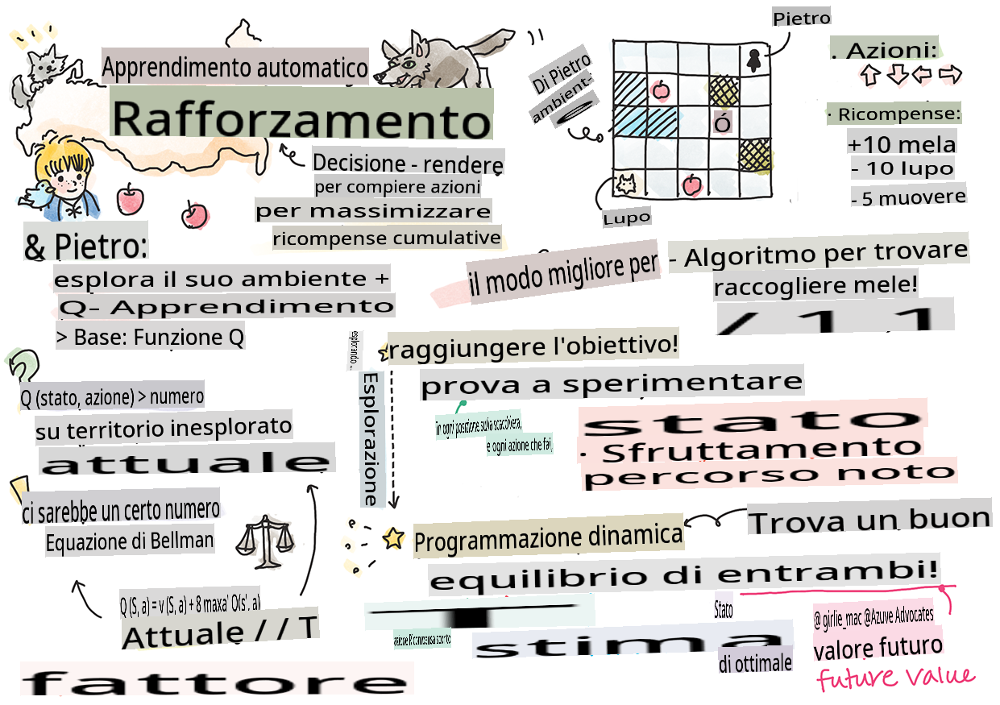
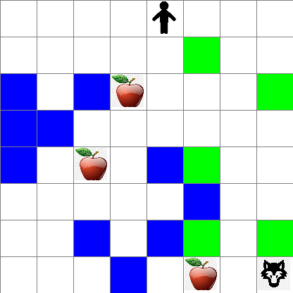

## Introduzione al Reinforcement Learning e al Q-Learning


> Sketchnote di [Tomomi Imura](https://www.twitter.com/girlie_mac)

Il reinforcement learning coinvolge tre concetti importanti: l'agente, alcuni stati e un insieme di azioni per ogni stato. Eseguendo un'azione in uno stato specificato, l'agente riceve una ricompensa. Immagina di nuovo il videogioco Super Mario. Sei Mario, sei in un livello del gioco, in piedi accanto a un dirupo. Sopra di te c'è una moneta. Essere Mario, in un livello del gioco, in una posizione specifica ... quello è il tuo stato. Muoversi di un passo a destra (un'azione) ti farà cadere nel vuoto, e ciò ti darebbe un punteggio numerico basso. Tuttavia, premendo il pulsante di salto otterresti un punto e rimarresti vivo. Questo è un risultato positivo e dovrebbe premiarti con un punteggio numerico positivo.

Utilizzando il reinforcement learning e un simulatore (il gioco), puoi imparare a giocare per massimizzare la ricompensa che consiste nel rimanere vivo e segnare il maggior numero di punti possibile.

[](https://www.youtube.com/watch?v=lDq_en8RNOo)

> 🎥 Clicca sull'immagine sopra per ascoltare Dmitry parlare del Reinforcement Learning

## [Quiz pre-lezione](https://gray-sand-07a10f403.1.azurestaticapps.net/quiz/45/)

## Prerequisiti e Setup

In questa lezione, sperimenteremo un po' di codice in Python. Dovresti essere in grado di eseguire il codice del Jupyter Notebook di questa lezione, sia sul tuo computer che da qualche parte nel cloud.

Puoi aprire [il notebook della lezione](https://github.com/microsoft/ML-For-Beginners/blob/main/8-Reinforcement/1-QLearning/notebook.ipynb) e seguire questa lezione per costruire.

> **Nota:** Se stai aprendo questo codice dal cloud, devi anche recuperare il file [`rlboard.py`](https://github.com/microsoft/ML-For-Beginners/blob/main/8-Reinforcement/1-QLearning/rlboard.py), che viene utilizzato nel codice del notebook. Aggiungilo nella stessa directory del notebook.

## Introduzione

In questa lezione, esploreremo il mondo di **[Peter e il lupo](https://en.wikipedia.org/wiki/Peter_and_the_Wolf)**, ispirato a una fiaba musicale di un compositore russo, [Sergei Prokofiev](https://en.wikipedia.org/wiki/Sergei_Prokofiev). Utilizzeremo il **Reinforcement Learning** per permettere a Peter di esplorare il suo ambiente, raccogliere gustose mele ed evitare di incontrare il lupo.

Il **Reinforcement Learning** (RL) è una tecnica di apprendimento che ci permette di apprendere un comportamento ottimale di un **agente** in un certo **ambiente** eseguendo molti esperimenti. Un agente in questo ambiente dovrebbe avere un **obiettivo**, definito da una **funzione di ricompensa**.

## L'ambiente

Per semplicità, consideriamo il mondo di Peter come una scacchiera di dimensioni `width` x `height`, come questa:


Ogni cella in questa scacchiera può essere:

* **terra**, su cui Peter e altre creature possono camminare.
* **acqua**, su cui ovviamente non si può camminare.
* un **albero** o **erba**, un luogo dove si può riposare.
* una **mela**, che rappresenta qualcosa che Peter sarebbe felice di trovare per nutrirsi.
* un **lupo**, che è pericoloso e dovrebbe essere evitato.

C'è un modulo Python separato, [`rlboard.py`](https://github.com/microsoft/ML-For-Beginners/blob/main/8-Reinforcement/1-QLearning/rlboard.py), che contiene il codice per lavorare con questo ambiente. Poiché questo codice non è importante per comprendere i nostri concetti, importeremo il modulo e lo utilizzeremo per creare la scacchiera di esempio (blocco di codice 1):

```python
from rlboard import *

width, height = 8,8
m = Board(width,height)
m.randomize(seed=13)
m.plot()
```

Questo codice dovrebbe stampare un'immagine dell'ambiente simile a quella sopra.

## Azioni e politica

Nel nostro esempio, l'obiettivo di Peter sarebbe trovare una mela, evitando il lupo e altri ostacoli. Per fare ciò, può essenzialmente camminare in giro fino a trovare una mela.

Pertanto, in qualsiasi posizione, può scegliere tra una delle seguenti azioni: su, giù, sinistra e destra.

Definiremo queste azioni come un dizionario e le mapperemo a coppie di cambiamenti di coordinate corrispondenti. Ad esempio, muoversi a destra (`R`) would correspond to a pair `(1,0)`. (blocco di codice 2):

```python
actions = { "U" : (0,-1), "D" : (0,1), "L" : (-1,0), "R" : (1,0) }
action_idx = { a : i for i,a in enumerate(actions.keys()) }
```

Riassumendo, la strategia e l'obiettivo di questo scenario sono i seguenti:

- **La strategia**, del nostro agente (Peter) è definita da una cosiddetta **politica**. Una politica è una funzione che restituisce l'azione in qualsiasi stato dato. Nel nostro caso, lo stato del problema è rappresentato dalla scacchiera, inclusa la posizione attuale del giocatore.

- **L'obiettivo**, del reinforcement learning è alla fine imparare una buona politica che ci permetta di risolvere il problema in modo efficiente. Tuttavia, come base, consideriamo la politica più semplice chiamata **camminata casuale**.

## Camminata casuale

Per prima cosa risolviamo il nostro problema implementando una strategia di camminata casuale. Con la camminata casuale, sceglieremo casualmente la prossima azione tra le azioni consentite, fino a raggiungere la mela (blocco di codice 3).

1. Implementa la camminata casuale con il codice seguente:

    ```python
    def random_policy(m):
        return random.choice(list(actions))
    
    def walk(m,policy,start_position=None):
        n = 0 # number of steps
        # set initial position
        if start_position:
            m.human = start_position 
        else:
            m.random_start()
        while True:
            if m.at() == Board.Cell.apple:
                return n # success!
            if m.at() in [Board.Cell.wolf, Board.Cell.water]:
                return -1 # eaten by wolf or drowned
            while True:
                a = actions[policy(m)]
                new_pos = m.move_pos(m.human,a)
                if m.is_valid(new_pos) and m.at(new_pos)!=Board.Cell.water:
                    m.move(a) # do the actual move
                    break
            n+=1
    
    walk(m,random_policy)
    ```

    La chiamata a `walk` dovrebbe restituire la lunghezza del percorso corrispondente, che può variare da una esecuzione all'altra. 

1. Esegui l'esperimento di camminata un certo numero di volte (diciamo, 100) e stampa le statistiche risultanti (blocco di codice 4):

    ```python
    def print_statistics(policy):
        s,w,n = 0,0,0
        for _ in range(100):
            z = walk(m,policy)
            if z<0:
                w+=1
            else:
                s += z
                n += 1
        print(f"Average path length = {s/n}, eaten by wolf: {w} times")
    
    print_statistics(random_policy)
    ```

    Nota che la lunghezza media di un percorso è intorno ai 30-40 passi, che è piuttosto elevata, dato che la distanza media alla mela più vicina è di circa 5-6 passi.

    Puoi anche vedere come appare il movimento di Peter durante la camminata casuale:

    

## Funzione di ricompensa

Per rendere la nostra politica più intelligente, dobbiamo capire quali mosse sono "migliori" delle altre. Per fare ciò, dobbiamo definire il nostro obiettivo.

L'obiettivo può essere definito in termini di una **funzione di ricompensa**, che restituirà un valore di punteggio per ogni stato. Più alto è il numero, migliore è la funzione di ricompensa. (blocco di codice 5)

```python
move_reward = -0.1
goal_reward = 10
end_reward = -10

def reward(m,pos=None):
    pos = pos or m.human
    if not m.is_valid(pos):
        return end_reward
    x = m.at(pos)
    if x==Board.Cell.water or x == Board.Cell.wolf:
        return end_reward
    if x==Board.Cell.apple:
        return goal_reward
    return move_reward
```

Una cosa interessante delle funzioni di ricompensa è che nella maggior parte dei casi, *ci viene data una ricompensa sostanziale solo alla fine del gioco*. Questo significa che il nostro algoritmo dovrebbe in qualche modo ricordare i "buoni" passi che portano a una ricompensa positiva alla fine e aumentare la loro importanza. Allo stesso modo, tutte le mosse che portano a risultati negativi dovrebbero essere scoraggiate.

## Q-Learning

Un algoritmo di cui discuteremo qui è chiamato **Q-Learning**. In questo algoritmo, la politica è definita da una funzione (o una struttura dati) chiamata **Q-Table**. Registra la "bontà" di ciascuna delle azioni in uno stato dato.

Si chiama Q-Table perché spesso è conveniente rappresentarla come una tabella, o array multidimensionale. Poiché la nostra scacchiera ha dimensioni `width` x `height`, possiamo rappresentare la Q-Table utilizzando un array numpy con forma `width` x `height` x `len(actions)`: (blocco di codice 6)

```python
Q = np.ones((width,height,len(actions)),dtype=np.float)*1.0/len(actions)
```

Nota che inizializziamo tutti i valori della Q-Table con un valore uguale, nel nostro caso - 0.25. Questo corrisponde alla politica della "camminata casuale", perché tutte le mosse in ogni stato sono ugualmente buone. Possiamo passare la Q-Table al `plot` function in order to visualize the table on the board: `m.plot(Q)`.


In the center of each cell there is an "arrow" that indicates the preferred direction of movement. Since all directions are equal, a dot is displayed.

Now we need to run the simulation, explore our environment, and learn a better distribution of Q-Table values, which will allow us to find the path to the apple much faster.

## Essence of Q-Learning: Bellman Equation

Once we start moving, each action will have a corresponding reward, i.e. we can theoretically select the next action based on the highest immediate reward. However, in most states, the move will not achieve our goal of reaching the apple, and thus we cannot immediately decide which direction is better.

> Remember that it is not the immediate result that matters, but rather the final result, which we will obtain at the end of the simulation.

In order to account for this delayed reward, we need to use the principles of **[dynamic programming](https://en.wikipedia.org/wiki/Dynamic_programming)**, which allow us to think about out problem recursively.

Suppose we are now at the state *s*, and we want to move to the next state *s'*. By doing so, we will receive the immediate reward *r(s,a)*, defined by the reward function, plus some future reward. If we suppose that our Q-Table correctly reflects the "attractiveness" of each action, then at state *s'* we will chose an action *a* that corresponds to maximum value of *Q(s',a')*. Thus, the best possible future reward we could get at state *s* will be defined as `max`<sub>a'</sub>*Q(s',a')* (maximum here is computed over all possible actions *a'* at state *s'*).

This gives the **Bellman formula** for calculating the value of the Q-Table at state *s*, given action *a*:


Here γ is the so-called **discount factor** that determines to which extent you should prefer the current reward over the future reward and vice versa.

## Learning Algorithm

Given the equation above, we can now write pseudo-code for our learning algorithm:

* Initialize Q-Table Q with equal numbers for all states and actions
* Set learning rate α ← 1
* Repeat simulation many times
   1. Start at random position
   1. Repeat
        1. Select an action *a* at state *s*
        2. Execute action by moving to a new state *s'*
        3. If we encounter end-of-game condition, or total reward is too small - exit simulation  
        4. Compute reward *r* at the new state
        5. Update Q-Function according to Bellman equation: *Q(s,a)* ← *(1-α)Q(s,a)+α(r+γ max<sub>a'</sub>Q(s',a'))*
        6. *s* ← *s'*
        7. Update the total reward and decrease α.

## Exploit vs. explore

In the algorithm above, we did not specify how exactly we should choose an action at step 2.1. If we are choosing the action randomly, we will randomly **explore** the environment, and we are quite likely to die often as well as explore areas where we would not normally go. An alternative approach would be to **exploit** the Q-Table values that we already know, and thus to choose the best action (with higher Q-Table value) at state *s*. This, however, will prevent us from exploring other states, and it's likely we might not find the optimal solution.

Thus, the best approach is to strike a balance between exploration and exploitation. This can be done by choosing the action at state *s* with probabilities proportional to values in the Q-Table. In the beginning, when Q-Table values are all the same, it would correspond to a random selection, but as we learn more about our environment, we would be more likely to follow the optimal route while allowing the agent to choose the unexplored path once in a while.

## Python implementation

We are now ready to implement the learning algorithm. Before we do that, we also need some function that will convert arbitrary numbers in the Q-Table into a vector of probabilities for corresponding actions.

1. Create a function `probs()`:

    ```python
    def probs(v,eps=1e-4):
        v = v-v.min()+eps
        v = v/v.sum()
        return v
    ```

    Aggiungiamo alcuni `eps` al vettore originale per evitare la divisione per 0 nel caso iniziale, quando tutti i componenti del vettore sono identici.

Esegui l'algoritmo di apprendimento attraverso 5000 esperimenti, chiamati anche **epoche**: (blocco di codice 8)
```python
    for epoch in range(5000):
    
        # Pick initial point
        m.random_start()
        
        # Start travelling
        n=0
        cum_reward = 0
        while True:
            x,y = m.human
            v = probs(Q[x,y])
            a = random.choices(list(actions),weights=v)[0]
            dpos = actions[a]
            m.move(dpos,check_correctness=False) # we allow player to move outside the board, which terminates episode
            r = reward(m)
            cum_reward += r
            if r==end_reward or cum_reward < -1000:
                lpath.append(n)
                break
            alpha = np.exp(-n / 10e5)
            gamma = 0.5
            ai = action_idx[a]
            Q[x,y,ai] = (1 - alpha) * Q[x,y,ai] + alpha * (r + gamma * Q[x+dpos[0], y+dpos[1]].max())
            n+=1
```

Dopo aver eseguito questo algoritmo, la Q-Table dovrebbe essere aggiornata con valori che definiscono l'attrattività delle diverse azioni a ogni passo. Possiamo provare a visualizzare la Q-Table tracciando un vettore in ogni cella che indicherà la direzione desiderata del movimento. Per semplicità, disegniamo un piccolo cerchio invece della punta di una freccia.

## Verifica della politica

Poiché la Q-Table elenca l'"attrattività" di ciascuna azione in ogni stato, è abbastanza facile utilizzarla per definire la navigazione efficiente nel nostro mondo. Nel caso più semplice, possiamo selezionare l'azione corrispondente al valore Q-Table più alto: (blocco di codice 9)

```python
def qpolicy_strict(m):
        x,y = m.human
        v = probs(Q[x,y])
        a = list(actions)[np.argmax(v)]
        return a

walk(m,qpolicy_strict)
```

> Se provi il codice sopra diverse volte, potresti notare che a volte si "blocca" e devi premere il pulsante STOP nel notebook per interromperlo. Questo accade perché potrebbero esserci situazioni in cui due stati "puntano" l'uno all'altro in termini di valore Q ottimale, nel qual caso l'agente finisce per muoversi tra quegli stati indefinitamente.

## 🚀Sfida

> **Compito 1:** Modifica il `walk` function to limit the maximum length of path by a certain number of steps (say, 100), and watch the code above return this value from time to time.

> **Task 2:** Modify the `walk` function so that it does not go back to the places where it has already been previously. This will prevent `walk` from looping, however, the agent can still end up being "trapped" in a location from which it is unable to escape.

## Navigation

A better navigation policy would be the one that we used during training, which combines exploitation and exploration. In this policy, we will select each action with a certain probability, proportional to the values in the Q-Table. This strategy may still result in the agent returning back to a position it has already explored, but, as you can see from the code below, it results in a very short average path to the desired location (remember that `print_statistics` esegue la simulazione 100 volte): (blocco di codice 10)

```python
def qpolicy(m):
        x,y = m.human
        v = probs(Q[x,y])
        a = random.choices(list(actions),weights=v)[0]
        return a

print_statistics(qpolicy)
```

Dopo aver eseguito questo codice, dovresti ottenere una lunghezza media del percorso molto più piccola rispetto a prima, nell'intervallo di 3-6.

## Indagare il processo di apprendimento

Come abbiamo menzionato, il processo di apprendimento è un equilibrio tra esplorazione e esplorazione della conoscenza acquisita sulla struttura dello spazio dei problemi. Abbiamo visto che i risultati dell'apprendimento (la capacità di aiutare un agente a trovare un percorso breve verso l'obiettivo) sono migliorati, ma è anche interessante osservare come si comporta la lunghezza media del percorso durante il processo di apprendimento:

Le lezioni possono essere riassunte come:

- **Aumento della lunghezza media del percorso**. Quello che vediamo qui è che all'inizio, la lunghezza media del percorso aumenta. Questo è probabilmente dovuto al fatto che quando non sappiamo nulla sull'ambiente, è probabile che ci imbattiamo in stati negativi, acqua o lupo. Man mano che impariamo di più e iniziamo a utilizzare questa conoscenza, possiamo esplorare l'ambiente per più tempo, ma non sappiamo ancora bene dove si trovano le mele.

- **Diminuzione della lunghezza del percorso, man mano che impariamo di più**. Una volta che impariamo abbastanza, diventa più facile per l'agente raggiungere l'obiettivo, e la lunghezza del percorso inizia a diminuire. Tuttavia, siamo ancora aperti all'esplorazione, quindi spesso ci allontaniamo dal percorso migliore e esploriamo nuove opzioni, rendendo il percorso più lungo del necessario.

- **Aumento improvviso della lunghezza**. Quello che osserviamo anche su questo grafico è che a un certo punto, la lunghezza è aumentata improvvisamente. Questo indica la natura stocastica del processo, e che a un certo punto possiamo "rovinare" i coefficienti della Q-Table sovrascrivendoli con nuovi valori. Questo dovrebbe idealmente essere minimizzato riducendo il tasso di apprendimento (ad esempio, verso la fine dell'addestramento, regoliamo i valori della Q-Table solo di un piccolo valore).

In generale, è importante ricordare che il successo e la qualità del processo di apprendimento dipendono significativamente dai parametri, come il tasso di apprendimento, la decadenza del tasso di apprendimento e il fattore di sconto. Questi sono spesso chiamati **iperparametri**, per distinguerli dai **parametri**, che ottimizziamo durante l'addestramento (ad esempio, i coefficienti della Q-Table). Il processo di trovare i migliori valori degli iperparametri è chiamato **ottimizzazione degli iperparametri**, e merita un argomento a parte.

## [Quiz post-lezione](https://gray-sand-07a10f403.1.azurestaticapps.net/quiz/46/)

## Compito 
[Un Mondo Più Realistico](assignment.md)

**Avvertenza**:
Questo documento è stato tradotto utilizzando servizi di traduzione basati su intelligenza artificiale. Sebbene ci impegniamo per garantire l'accuratezza, si prega di essere consapevoli che le traduzioni automatiche possono contenere errori o imprecisioni. Il documento originale nella sua lingua nativa dovrebbe essere considerato la fonte autorevole. Per informazioni critiche, si raccomanda una traduzione professionale umana. Non siamo responsabili per eventuali malintesi o interpretazioni errate derivanti dall'uso di questa traduzione.