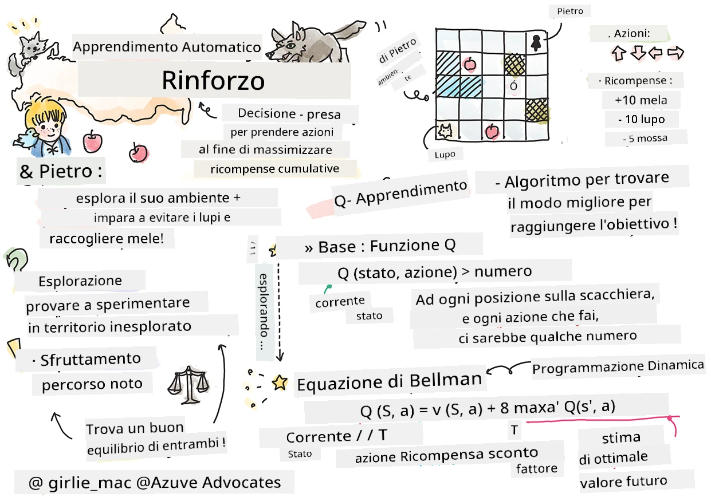
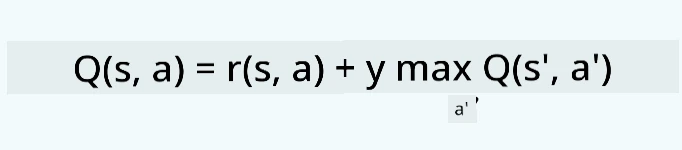

# Introduzione all'Apprendimento per Rinforzo e Q-Learning


> Sketchnote di [Tomomi Imura](https://www.twitter.com/girlie_mac)

L'apprendimento per rinforzo coinvolge tre concetti importanti: l'agente, alcuni stati e un insieme di azioni per ciascuno stato. Eseguendo un'azione in uno stato specificato, l'agente riceve una ricompensa. Immagina di nuovo il gioco per computer Super Mario. Sei Mario, sei in un livello di gioco, in piedi vicino al bordo di una scogliera. Sopra di te c'è una moneta. Tu, essendo Mario, in un livello di gioco, in una posizione specifica ... quello è il tuo stato. Muoversi di un passo a destra (un'azione) ti farà cadere nel vuoto, e questo ti darebbe un punteggio numerico basso. Tuttavia, premere il pulsante di salto ti permetterebbe di segnare un punto e resteresti vivo. Questo è un risultato positivo e dovrebbe premiarti con un punteggio numerico positivo.

Usando l'apprendimento per rinforzo e un simulatore (il gioco), puoi imparare come giocare per massimizzare la ricompensa, che è rimanere vivo e segnare il maggior numero possibile di punti.

[](https://www.youtube.com/watch?v=lDq_en8RNOo)

> 🎥 Clicca sull'immagine sopra per ascoltare Dmitry parlare di Apprendimento per Rinforzo

## [Quiz pre-lezione](https://ff-quizzes.netlify.app/en/ml/)

## Prerequisiti e Configurazione

In questa lezione, sperimenteremo con del codice in Python. Dovresti essere in grado di eseguire il codice del Jupyter Notebook di questa lezione, sia sul tuo computer che da qualche parte nel cloud.

Puoi aprire [il notebook della lezione](https://github.com/microsoft/ML-For-Beginners/blob/main/8-Reinforcement/1-QLearning/notebook.ipynb) e seguire questa lezione per costruire.

> **Nota:** Se stai aprendo questo codice dal cloud, devi anche recuperare il file [`rlboard.py`](https://github.com/microsoft/ML-For-Beginners/blob/main/8-Reinforcement/1-QLearning/rlboard.py), che è usato nel codice del notebook. Aggiungilo alla stessa directory del notebook.

## Introduzione

In questa lezione esploreremo il mondo di **[Pietro e il Lupo](https://it.wikipedia.org/wiki/Pietro_e_il_lupo)**, ispirato a una fiaba musicale di un compositore russo, [Sergej Prokof'ev](https://it.wikipedia.org/wiki/Sergej_Prokof'ev). Useremo l'**Apprendimento per Rinforzo** per permettere a Pietro di esplorare il suo ambiente, raccogliere mele gustose ed evitare di incontrare il lupo.

L'**Apprendimento per Rinforzo** (RL) è una tecnica di apprendimento che ci permette di apprendere un comportamento ottimale di un **agente** in un certo **ambiente** eseguendo molti esperimenti. Un agente in questo ambiente dovrebbe avere un **obiettivo**, definito da una **funzione di ricompensa**.

## L'ambiente

Per semplicità, consideriamo il mondo di Pietro come una scacchiera quadrata di dimensioni `larghezza` x `altezza`, così:


Ogni cella di questa scacchiera può essere:

* **terra**, sulla quale Pietro e altre creature possono camminare.
* **acqua**, sulla quale ovviamente non si può camminare.
* un **albero** o **erba**, un luogo dove puoi riposarti.
* una **mela**, che rappresenta qualcosa che a Pietro piacerebbe trovare per nutrirsi.
* un **lupo**, che è pericoloso e va evitato.

Esiste un modulo Python separato, [`rlboard.py`](https://github.com/microsoft/ML-For-Beginners/blob/main/8-Reinforcement/1-QLearning/rlboard.py), che contiene il codice per lavorare con questo ambiente. Poiché questo codice non è importante per comprendere i nostri concetti, importeremo il modulo e lo useremo per creare la scacchiera di esempio (blocco codice 1):

```python
from rlboard import *

width, height = 8,8
m = Board(width,height)
m.randomize(seed=13)
m.plot()
```

Questo codice dovrebbe stampare un'immagine dell'ambiente simile a quella sopra.

## Azioni e politica

Nel nostro esempio, l'obiettivo di Pietro sarebbe trovare una mela, evitando il lupo e altri ostacoli. Per farlo, può essenzialmente camminare finché non trova una mela.

Pertanto, in ogni posizione, può scegliere tra una delle seguenti azioni: su, giù, sinistra e destra.

Definiremo queste azioni come un dizionario e le mapperemo a coppie di cambiamenti corrispondenti delle coordinate. Per esempio, muoversi a destra (`R`) corrisponderebbe alla coppia `(1,0)`. (blocco codice 2):

```python
actions = { "U" : (0,-1), "D" : (0,1), "L" : (-1,0), "R" : (1,0) }
action_idx = { a : i for i,a in enumerate(actions.keys()) }
```

Per riassumere, la strategia e l'obiettivo di questo scenario sono i seguenti:

- **La strategia**, del nostro agente (Pietro) è definita da una cosiddetta **politica**. Una politica è una funzione che restituisce l'azione in qualsiasi stato dato. Nel nostro caso, lo stato del problema è rappresentato dalla scacchiera, inclusa la posizione attuale del giocatore.

- **L'obiettivo**, dell'apprendimento per rinforzo è infine quello di apprendere una buona politica che ci permetta di risolvere il problema in modo efficiente. Tuttavia, come base, consideriamo la politica più semplice chiamata **camminata casuale**.

## Camminata casuale

Risolviamo prima il nostro problema implementando una strategia di camminata casuale. Con la camminata casuale, sceglieremo casualmente la prossima azione tra quelle consentite, finché non raggiungiamo la mela (blocco codice 3).

1. Implementa la camminata casuale con il codice sottostante:

    ```python
    def random_policy(m):
        return random.choice(list(actions))
    
    def walk(m,policy,start_position=None):
        n = 0 # numero di passi
        # imposta la posizione iniziale
        if start_position:
            m.human = start_position 
        else:
            m.random_start()
        while True:
            if m.at() == Board.Cell.apple:
                return n # successo!
            if m.at() in [Board.Cell.wolf, Board.Cell.water]:
                return -1 # mangiato dal lupo o annegato
            while True:
                a = actions[policy(m)]
                new_pos = m.move_pos(m.human,a)
                if m.is_valid(new_pos) and m.at(new_pos)!=Board.Cell.water:
                    m.move(a) # esegui la mossa effettiva
                    break
            n+=1
    
    walk(m,random_policy)
    ```

    La chiamata a `walk` dovrebbe restituire la lunghezza del percorso corrispondente, che può variare da un'esecuzione all'altra.

1. Esegui l'esperimento di camminata un numero di volte (ad esempio, 100), e stampa le statistiche risultanti (blocco codice 4):

    ```python
    def print_statistics(policy):
        s,w,n = 0,0,0
        for _ in range(100):
            z = walk(m,policy)
            if z<0:
                w+=1
            else:
                s += z
                n += 1
        print(f"Average path length = {s/n}, eaten by wolf: {w} times")
    
    print_statistics(random_policy)
    ```

    Nota che la lunghezza media di un percorso è intorno a 30-40 passi, che è abbastanza, dato che la distanza media alla mela più vicina è intorno a 5-6 passi.

    Puoi anche vedere come si muove Pietro durante la camminata casuale:

    

## Funzione di ricompensa

Per rendere la nostra politica più intelligente, dobbiamo capire quali mosse sono "migliori" di altre. Per fare questo, dobbiamo definire il nostro obiettivo.

L'obiettivo può essere definito in termini di una **funzione di ricompensa**, che restituirà un valore di punteggio per ogni stato. Più alto è il numero, migliore è la funzione di ricompensa. (blocco codice 5)

```python
move_reward = -0.1
goal_reward = 10
end_reward = -10

def reward(m,pos=None):
    pos = pos or m.human
    if not m.is_valid(pos):
        return end_reward
    x = m.at(pos)
    if x==Board.Cell.water or x == Board.Cell.wolf:
        return end_reward
    if x==Board.Cell.apple:
        return goal_reward
    return move_reward
```

Una cosa interessante delle funzioni di ricompensa è che nella maggior parte dei casi, *ci viene data una ricompensa sostanziale solo alla fine del gioco*. Ciò significa che il nostro algoritmo dovrebbe in qualche modo ricordare i passi "buoni" che portano a una ricompensa positiva alla fine, e aumentarne l'importanza. Allo stesso modo, tutte le mosse che portano a risultati negativi dovrebbero essere scoraggiate.

## Q-Learning

Un algoritmo di cui parleremo qui si chiama **Q-Learning**. In questo algoritmo, la politica è definita da una funzione (o da una struttura dati) chiamata **Tabella Q**. Essa registra la "bontà" di ognuna delle azioni in uno stato dato.

Si chiama Tabella Q perché spesso è comodo rappresentarla come una tabella, o array multidimensionale. Poiché la nostra scacchiera ha dimensioni `larghezza` x `altezza`, possiamo rappresentare la Tabella Q usando un array numpy con forma `larghezza` x `altezza` x `len(actions)`: (blocco codice 6)

```python
Q = np.ones((width,height,len(actions)),dtype=np.float)*1.0/len(actions)
```

Nota che inizializziamo tutti i valori della Tabella Q con un valore uguale, nel nostro caso - 0.25. Questo corrisponde alla politica di "camminata casuale", perché tutte le mosse in ogni stato sono ugualmente buone. Possiamo passare la Tabella Q alla funzione `plot` per visualizzare la tabella sulla scacchiera: `m.plot(Q)`.


Al centro di ogni cella c'è una "freccia" che indica la direzione preferita di movimento. Poiché tutte le direzioni sono uguali, viene mostrato un punto.

Ora dobbiamo eseguire la simulazione, esplorare il nostro ambiente e apprendere una migliore distribuzione dei valori nella Tabella Q, che ci permetterà di trovare il percorso verso la mela molto più velocemente.

## Essenza del Q-Learning: Equazione di Bellman

Una volta che iniziamo a muoverci, ogni azione avrà una ricompensa corrispondente, cioè possiamo teoricamente selezionare la prossima azione basandoci sulla ricompensa immediata più alta. Tuttavia, nella maggior parte degli stati, la mossa non porterà al nostro obiettivo di raggiungere la mela, e quindi non possiamo decidere immediatamente quale direzione sia migliore.

> Ricorda che non è il risultato immediato che conta, ma piuttosto il risultato finale, che otterremo alla fine della simulazione.

Per tenere conto di questa ricompensa ritardata, dobbiamo usare i principi della **[programmazione dinamica](https://it.wikipedia.org/wiki/Programmazione_dinamica)**, che ci permettono di pensare al nostro problema in modo ricorsivo.

Supponiamo di essere ora nello stato *s*, e di volerci muovere allo stato successivo *s'*. Facendo ciò, riceveremo la ricompensa immediata *r(s,a)*, definita dalla funzione di ricompensa, più qualche ricompensa futura. Se supponiamo che la nostra Tabella Q rifletta correttamente l'"attrattività" di ogni azione, allora nello stato *s'* sceglieremo un'azione *a* che corrisponde al valore massimo di *Q(s',a')*. Dunque, la migliore possibile ricompensa futura che potremmo ottenere nello stato *s* sarà definita come `max`<sub>a'</sub>*Q(s',a')* (il massimo qui è calcolato su tutte le possibili azioni *a'* nello stato *s'*).

Questo dà la **formula di Bellman** per calcolare il valore della Tabella Q nello stato *s*, data l'azione *a*:



Qui γ è il cosiddetto **fattore di sconto** che determina quanto dovresti preferire la ricompensa corrente rispetto a quella futura e viceversa.

## Algoritmo di Apprendimento

Data l'equazione sopra, ora possiamo scrivere il pseudo-codice per il nostro algoritmo di apprendimento:

* Inizializza la Tabella Q con numeri uguali per tutti gli stati e azioni
* Imposta il tasso di apprendimento α ← 1
* Ripeti la simulazione molte volte
   1. Parti da una posizione casuale
   1. Ripeti
        1. Seleziona un'azione *a* nello stato *s*
        2. Esegui l'azione muovendoti in un nuovo stato *s'*
        3. Se incontriamo la condizione di fine gioco, o la ricompensa totale è troppo bassa - esci dalla simulazione  
        4. Calcola la ricompensa *r* nel nuovo stato
        5. Aggiorna la funzione Q secondo l'equazione di Bellman: *Q(s,a)* ← *(1-α)Q(s,a)+α(r+γ max<sub>a'</sub>Q(s',a'))*
        6. *s* ← *s'*
        7. Aggiorna la ricompensa totale e diminuisci α.

## Sfruttare vs. esplorare

Nell'algoritmo sopra, non abbiamo specificato esattamente come scegliere un'azione al passo 2.1. Se scegliamo l'azione casualmente, esploreremo casualmente l'ambiente, e molto probabilmente moriremo spesso e esploreremo aree dove normalmente non andremmo. Un approccio alternativo sarebbe **sfruttare** i valori della Tabella Q che già conosciamo, e quindi scegliere la migliore azione (con valore Tabella Q più alto) nello stato *s*. Tuttavia, questo ci impedirà di esplorare altri stati, e probabilmente non troveremo la soluzione ottimale.

Dunque, il miglior approccio è trovare un equilibrio tra esplorazione e sfruttamento. Ciò può essere fatto scegliendo l'azione nello stato *s* con probabilità proporzionali ai valori nella Tabella Q. Inizialmente, quando i valori della Tabella Q sono tutti uguali, ciò corrisponderebbe a una selezione casuale, ma man mano che impariamo di più sul nostro ambiente, saremo più propensi a seguire la rotta ottimale consentendo però all'agente di scegliere di tanto in tanto un percorso inesplorato.

## Implementazione in Python

Ora siamo pronti per implementare l'algoritmo di apprendimento. Prima di farlo, ci serve anche una funzione che converta numeri arbitrari nella Tabella Q in un vettore di probabilità per le azioni corrispondenti.

1. Crea una funzione `probs()`:

    ```python
    def probs(v,eps=1e-4):
        v = v-v.min()+eps
        v = v/v.sum()
        return v
    ```

    Aggiungiamo un po' di `eps` al vettore originale per evitare divisioni per 0 nel caso iniziale, quando tutte le componenti del vettore sono identiche.

Esegui l'algoritmo di apprendimento per 5000 esperimenti, chiamati anche **epoche**: (blocco codice 8)
```python
    for epoch in range(5000):
    
        # Scegli il punto iniziale
        m.random_start()
        
        # Inizia il viaggio
        n=0
        cum_reward = 0
        while True:
            x,y = m.human
            v = probs(Q[x,y])
            a = random.choices(list(actions),weights=v)[0]
            dpos = actions[a]
            m.move(dpos,check_correctness=False) # permettiamo al giocatore di muoversi fuori dalla plancia, il che termina l'episodio
            r = reward(m)
            cum_reward += r
            if r==end_reward or cum_reward < -1000:
                lpath.append(n)
                break
            alpha = np.exp(-n / 10e5)
            gamma = 0.5
            ai = action_idx[a]
            Q[x,y,ai] = (1 - alpha) * Q[x,y,ai] + alpha * (r + gamma * Q[x+dpos[0], y+dpos[1]].max())
            n+=1
```

Dopo aver eseguito questo algoritmo, la Tabella Q dovrebbe essere aggiornata con valori che definiscono l'attrattività delle diverse azioni in ogni passo. Possiamo provare a visualizzare la Tabella Q disegnando un vettore in ogni cella che indichi nella direzione desiderata di movimento. Per semplicità, disegniamo un piccolo cerchio anziché una punta di freccia.


## Verifica della politica

Poiché la Tabella Q elenca l'"attrattività" di ogni azione in ogni stato, è abbastanza semplice usarla per definire una navigazione efficiente nel nostro mondo. Nel caso più semplice, possiamo selezionare l'azione corrispondente al valore massimo nella Tabella Q: (blocco codice 9)

```python
def qpolicy_strict(m):
        x,y = m.human
        v = probs(Q[x,y])
        a = list(actions)[np.argmax(v)]
        return a

walk(m,qpolicy_strict)
```


> Se provi il codice sopra diverse volte, potresti notare che a volte “si blocca” e devi premere il pulsante STOP nel notebook per interromperlo. Questo accade perché potrebbero esserci situazioni in cui due stati “si puntano” a vicenda in termini di Q-Value ottimale, nel qual caso l'agente finisce per muoversi indefinitamente tra quegli stati.

## 🚀Sfida

> **Compito 1:** Modifica la funzione `walk` per limitare la lunghezza massima del percorso a un certo numero di passi (ad esempio 100), e osserva il codice sopra restituire questo valore di tanto in tanto.

> **Compito 2:** Modifica la funzione `walk` in modo che non torni nei luoghi in cui è già stato in precedenza. Questo eviterà che `walk` entri in un ciclo, tuttavia, l'agente può ancora finire “intrappolato” in una posizione da cui non è in grado di uscire.

## Navigazione

Una politica di navigazione migliore sarebbe quella che abbiamo usato durante l'addestramento, che combina sfruttamento ed esplorazione. In questa politica, selezioneremo ogni azione con una certa probabilità, proporzionale ai valori nella Q-Table. Questa strategia può ancora far sì che l'agente torni in una posizione che ha già esplorato, ma, come puoi vedere dal codice qui sotto, risulta in un percorso medio molto breve fino alla posizione desiderata (ricorda che `print_statistics` esegue la simulazione 100 volte): (blocco di codice 10)

```python
def qpolicy(m):
        x,y = m.human
        v = probs(Q[x,y])
        a = random.choices(list(actions),weights=v)[0]
        return a

print_statistics(qpolicy)
```

Dopo aver eseguito questo codice, dovresti ottenere una lunghezza media del percorso molto più piccola rispetto a prima, nell'intervallo di 3-6.

## Analisi del processo di apprendimento

Come abbiamo detto, il processo di apprendimento è un equilibrio tra esplorazione e sfruttamento della conoscenza acquisita sulla struttura dello spazio del problema. Abbiamo visto che i risultati dell'apprendimento (la capacità di aiutare un agente a trovare un percorso breve verso l'obiettivo) sono migliorati, ma è anche interessante osservare come si comporta la lunghezza media del percorso durante il processo di apprendimento:


Le conclusioni possono essere riassunte come segue:

- **La lunghezza media del percorso aumenta**. Qui vediamo che all'inizio la lunghezza media del percorso aumenta. Questo è probabilmente dovuto al fatto che quando non sappiamo nulla dell'ambiente, è probabile che rimaniamo intrappolati in stati sfavorevoli, acqua o lupo. Man mano che impariamo e iniziamo a usare questa conoscenza, possiamo esplorare più a lungo l'ambiente, ma ancora non sappiamo molto bene dove sono le mele.

- **La lunghezza del percorso diminuisce man mano che impariamo**. Una volta appreso abbastanza, diventa più facile per l’agente raggiungere l'obiettivo, e la lunghezza del percorso inizia a diminuire. Tuttavia, siamo ancora aperti all’esplorazione, quindi spesso ci allontaniamo dal percorso migliore ed esploriamo nuove opzioni, rendendo il percorso più lungo di quello ottimale.

- **La lunghezza aumenta bruscamente**. Ciò che osserviamo anche in questo grafico è che ad un certo punto la lunghezza è aumentata bruscamente. Questo indica la natura stocastica del processo, e che possiamo a un certo punto “rovinare” i coefficienti della Q-Table sovrascrivendoli con nuovi valori. Idealmente questo dovrebbe essere ridotto diminuendo il tasso di apprendimento (per esempio, verso la fine dell’addestramento, modifichiamo i valori della Q-Table solo di una piccola quantità).

In generale, è importante ricordare che il successo e la qualità del processo di apprendimento dipendono molto dai parametri, come il tasso di apprendimento, il decadimento del tasso di apprendimento e il fattore di sconto. Questi sono spesso chiamati **iperparametri**, per distinguerli dai **parametri**, che ottimizziamo durante l’addestramento (ad esempio, i coefficienti della Q-Table). Il processo di trovare i valori migliori degli iperparametri si chiama **ottimizzazione degli iperparametri**, e merita un argomento a parte.

## [Quiz post-lezione](https://ff-quizzes.netlify.app/en/ml/)

## Compito
[Un mondo più realistico](assignment.md)

---

<!-- CO-OP TRANSLATOR DISCLAIMER START -->
**Disclaimer**:
Questo documento è stato tradotto utilizzando il servizio di traduzione AI [Co-op Translator](https://github.com/Azure/co-op-translator). Sebbene ci impegniamo per garantire la precisione, si prega di notare che le traduzioni automatizzate possono contenere errori o imprecisioni. Il documento originale nella sua lingua nativa deve essere considerato la fonte autorevole. Per informazioni critiche, si raccomanda una traduzione professionale effettuata da un essere umano. Non siamo responsabili per eventuali malintesi o interpretazioni errate derivanti dall’uso di questa traduzione.
<!-- CO-OP TRANSLATOR DISCLAIMER END -->